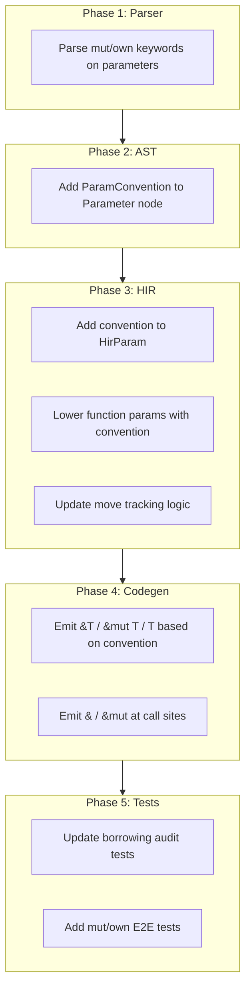

# Borrow-by-Default Ownership Model for Sifr

## Design Summary

Change function parameter passing from **move-by-default** to **borrow-by-default**:

- **Default (no keyword):** immutable borrow (`&T` in Rust)
- **`mut` keyword:** mutable borrow (`&mut T` in Rust)
- **`own` keyword:** ownership transfer (`T` in Rust, current behavior)
- **Copy types** (`int`, `float`, `bool`): always pass by value (no change)
- **Method receivers:** unchanged (auto-inferred `&self`/`&mut self` already works)
- **Assignment:** unchanged (move for heap types, copy for primitives)

```python
def process(items: list[int]) -> int:       # borrows items (default)
    return len(items)

def sort_it(mut items: list[int]):           # mutably borrows items
    items.sort()

def consume(own items: list[int]) -> int:    # takes ownership
    return len(items)
```

## Architecture Overview




## Phase 1: Add `ParamConvention` Enum and Update AST

### 1a. Define `ParamConvention` in the type system

Add to [crates/sifr_type_system/src/types.rs](crates/sifr_type_system/src/types.rs) (after `OwnershipKind` at line ~108):

```rust
/// How a function parameter receives its value.
#[derive(Debug, Clone, Copy, PartialEq, Eq)]
pub enum ParamConvention {
    /// Immutable borrow (default). Codegen: &T
    Borrow,
    /// Mutable borrow (mut keyword). Codegen: &mut T
    MutBorrow,
    /// Ownership transfer (own keyword). Codegen: T
    Own,
}
```

### 1b. Update `HirParam` to carry the convention

In [crates/sifr_hir/src/hir_nodes.rs](crates/sifr_hir/src/hir_nodes.rs) (line 76-82), add a `convention` field:

```rust
pub struct HirParam {
    pub name: String,
    pub ty: Type,
    pub default: Option<HirExpr>,
    pub keyword_only: bool,
    pub convention: ParamConvention,  // NEW
}
```

### 1c. Add `ParamConvention` to `FunctionType` and `Callable`

The `FunctionType` struct (used for cross-module function resolution, stdlib registration, and import/export) must carry conventions so that call-site emission can look up the callee's conventions for any function, not just the one currently being compiled.

In [crates/sifr_type_system/src/types.rs](crates/sifr_type_system/src/types.rs) (line 94-99), extend `FunctionType`:

```rust
pub struct FunctionType {
    /// Parameter names, types, and conventions
    pub params: Vec<(String, Type, ParamConvention)>,
    /// Return type
    pub return_type: Box<Type>,
}
```

Also extend the `Callable` type variant to carry conventions:

```rust
/// Callable type: `Callable[[int, str], bool]`
/// Tuple is (param_types, param_conventions, return_type)
Callable(Vec<Type>, Vec<ParamConvention>, Box<Type>),
```

This ensures conventions survive across module boundaries, stdlib lookups, and `Callable`-typed variable calls. All existing code that constructs `FunctionType` or `Callable` must be updated to supply conventions (defaulting to `Borrow` for Move types, `Own` for Copy types).

**Key files:** `crates/sifr_type_system/src/types.rs` (FunctionType, Callable variant), all callers that construct FunctionType/Callable

### 1d. Parse `mut` and `own` as soft keywords on parameters

In [crates/sifr_python_parser/src/parser/statement.rs](crates/sifr_python_parser/src/parser/statement.rs) (lines 2630-2690, `parse_parameter`):

- Before parsing the parameter name, check if the current token is `mut` or `own` (as identifiers, not hard keywords)
- If found, consume the token and store the convention
- Add a `convention` field to the `Parameter` AST node in [crates/sifr_python_ast/src/nodes.rs](crates/sifr_python_ast/src/nodes.rs) (line 2971-2975)

The parser change is minimal since `mut` and `own` are not Python keywords -- they appear as identifiers before the parameter name and can be detected by peeking.

## Phase 2: Update HIR Lowering

### 2a. Propagate convention through `lower_function`

In [crates/sifr_hir/src/lower.rs](crates/sifr_hir/src/lower.rs) (lines 1360-1414, `lower_function`):

- Read the `convention` from each AST `Parameter`
- Default convention: `Borrow` for Move types, `Own` for Copy types (Copy types are always passed by value)
- Store it on the `HirParam`

### 2b. Replace the `borrows_args` hardcoded list

In [crates/sifr_hir/src/lower.rs](crates/sifr_hir/src/lower.rs) (lines 3669-3684):

**Delete** the entire `borrows_args` match block. Replace with convention-aware logic:

- Look up the called function's parameter conventions
- For each argument: only call `ctx.scope.mark_moved(name)` if the corresponding parameter has `convention == Own` AND the argument type is `Move`
- For `mut` parameters: track that the variable is mutably borrowed (no move, but exclusive access)
- For default `Borrow` parameters: no move tracking needed

This eliminates the hardcoded list of 25 built-in function names.

### 2c. Update `Callable`-typed variable call path

In [crates/sifr_hir/src/lower.rs](crates/sifr_hir/src/lower.rs) (lines 3460-3487), the `callable_info` path handles calls to variables typed as `Callable[[int, str], bool]`. This path must also use conventions:

- Extract `ParamConvention` from the `Callable` type variant (now carrying conventions per 1c)
- Apply the same convention-aware move tracking as regular function calls
- If a `Callable` has no convention info (e.g., from legacy code), default to `Borrow` for Move types

**Note:** Constructor calls (`HirExpr::ConstructorCall`) do not need convention changes -- constructors always take ownership of their arguments. Method calls already have special `self` handling; non-self method parameters propagate conventions through `HirParam` like regular functions.

**Key files:** `crates/sifr_hir/src/lower.rs` (callable_info path)

### 2d. Register built-in function conventions

Built-in functions (print, len, sorted, etc.) need their parameter conventions registered. Since they are not parsed from `.sifr` source, their conventions must be set when registering them in the type system.

- All existing built-in functions get `Borrow` convention (matching current behavior)
- This is already implicit since `Borrow` is the new default

## Phase 3: Update Codegen

### 3a. Emit parameter types based on convention

In [crates/sifr_codegen/src/lib.rs](crates/sifr_codegen/src/lib.rs) (lines 1361-1372, `emit_function`):

Change the parameter emission loop from:

```rust
self.write(&param.ty.rust_type());
```

To:

```rust
match param.convention {
    ParamConvention::Borrow => {
        if param.ty.ownership() == OwnershipKind::Copy {
            self.write(&param.ty.rust_type());       // Copy types: pass by value
        } else {
            self.write(&format!("&{}", param.ty.rust_type())); // Move types: &T
        }
    }
    ParamConvention::MutBorrow => {
        self.write(&format!("&mut {}", param.ty.rust_type())); // &mut T
    }
    ParamConvention::Own => {
        if self.mutated_vars.contains(&param.name) {
            self.write("mut ");
        }
        self.write(&param.ty.rust_type());           // T (owned, current behavior)
    }
}
```

### 3b. Emit borrow/mut-borrow at call sites

When emitting function call arguments, the codegen must prepend `&` or `&mut` for Move-type arguments passed to Borrow/MutBorrow parameters:

- Look up the called function's parameter conventions
- For `Borrow` params with Move-type args: emit `&arg`
- For `MutBorrow` params: emit `&mut arg`
- For `Own` params: emit `arg` (current behavior)
- For Copy-type args: always emit `arg` (no borrow needed)

This logic goes in the function call emission code in `emit_function_call` / `emit_expr` where `HirExpr::Call` is handled.

### 3c. Update method parameter emission

In [crates/sifr_codegen/src/lib.rs](crates/sifr_codegen/src/lib.rs) (lines 1279-1288), method parameters already have special handling for class types (line 1284 adds `&`). Extend this to use `ParamConvention` consistently.

### 3d. Handle body code that uses borrowed parameters

When a parameter is borrowed (`&T`), code inside the function that uses it needs adjustment:

- Read access: works naturally (Rust auto-derefs)
- Passing to another function that also borrows: re-borrow (`&*param`) -- automatic via Rust deref coercion
- Passing to another function that takes `own`: compiler error -- "cannot move borrowed parameter 'x' -- use `own` on the parameter or `.clone()`"
- Returning the parameter: compiler error -- "cannot return borrowed parameter 'x' -- use `own` or `.clone()`"
- Storing into a struct field or collection: compiler error -- same diagnostic as returning

**Important:** The compiler does NOT silently emit `.clone()`. This matches the architecture contract on escape analysis: "the compiler emits a diagnostic rather than silently cloning. The programmer must choose: clone explicitly, or restructure to avoid the escape." The error messages guide the user to add `own` to the parameter or call `.clone()` explicitly at the call site.

## Phase 4: Update Scope and Error Reporting

### 4a. Add mutable borrow tracking to scope

In [crates/sifr_hir/src/scope.rs](crates/sifr_hir/src/scope.rs), extend `VarInfo` (line 11):

```rust
pub struct VarInfo {
    pub ty: Type,
    pub narrowed_type: Option<Type>,
    pub is_moved: bool,
    pub is_mut_borrowed: bool,  // NEW: track mutable borrows
}
```

Add methods:

- `mark_mut_borrowed(name)` -- marks a variable as mutably borrowed
- `is_mut_borrowed(name)` -- checks if mutably borrowed
- `clear_mut_borrow(name)` -- clears after the borrowing call returns

### 4b. Enforce exclusivity rules

In the HIR lowering, when a `mut` parameter is used:

- Check that the variable is not already immutably borrowed elsewhere in the same expression
- Check that the variable is not already mutably borrowed
- Emit clear error: "cannot borrow `x` as mutable because it is already borrowed"

### 4c. Improve error messages

Update error messages in the HIR to guide users:

- "use of moved value: 'x'" -- only for `own` parameters now
- "cannot mutate borrowed parameter 'x' -- add `mut` to the parameter" -- new
- "cannot return borrowed parameter 'x' -- use `own` or `.clone()`" -- new

## Phase 5: Update Tests

### 5a. Update borrowing audit tests

The 50 tests in [audit/borrowing/](audit/borrowing/) need updating:

- Tests 08, 23 (function move): change to borrow-by-default behavior (pass succeeds, variable still usable)
- Tests 09, 24, 31 (use-after-move via function): these now only fail if the function uses `own`
- Tests 16 (move-in-loop): only fails if the function uses `own`
- Tests 01-07, 11-15, 17-22, 25-30, 32-50: most remain unchanged

### 5b. Add new E2E tests

Create new test files in [crates/sifr/tests/e2e/pass/](crates/sifr/tests/e2e/pass/):

- `borrow_default.sifr` -- function args borrowed by default, usable after call
- `mut_param.sifr` -- `mut` parameter allows in-place mutation
- `own_param.sifr` -- `own` parameter moves, use-after-move error
- `borrow_in_loop.sifr` -- borrowed args in loops work without issues
- `mut_exclusivity.sifr` -- cannot pass same var as `mut` twice

Create fail tests in [crates/sifr/tests/e2e/fail/](crates/sifr/tests/e2e/fail/):

- `mutate_borrowed_param.sifr` -- cannot mutate a default-borrowed param
- `return_borrowed_param.sifr` -- cannot return a borrowed param without clone
- `double_mut_borrow.sifr` -- cannot mut-borrow same variable twice

### 5c. Parser snapshot tests

Add parser snapshot tests to verify `mut`/`own` soft keyword parsing in edge cases:

- `mut` and `own` as parameter names (not keywords) -- `def f(mut: int)` should still parse as parameter named `mut`
- `mut`/`own` before typed parameters -- `def f(mut x: int)` parses as convention + name
- `mut`/`own` before untyped parameters -- `def f(mut x)` parses correctly
- `mut`/`own` in lambda parameters -- `lambda mut x: x` (if supported)
- Nested function parameters with conventions -- `def f(mut x: list[int], own y: str)`

**Key files:** `crates/sifr_python_parser/tests/` (parser snapshot tests)

### 5d. Multi-module convention tests

Add tests that verify conventions survive across module boundaries:

- Import a function with `mut`/`own` params from another module, call it, verify correct borrow/move behavior
- Verify that `FunctionType` carries conventions through the import/export pipeline
- Test `Callable`-typed variables with conventions

**Key files:** `crates/sifr/tests/e2e/pass/`, `crates/sifr_driver/`

### 5e. Update POST_HARDENING_REPORT.md

Update [audit/borrowing/POST_HARDENING_REPORT.md](audit/borrowing/POST_HARDENING_REPORT.md) to reflect the new ownership model.

## Phase 6: Update Architecture Documentation

### 6a. Update the Borrow and Lifetime Strategy

In [.cursor/plans/sifr_compiler_architecture_fa3c10ee.md](.cursor/plans/sifr_compiler_architecture_fa3c10ee.md) (lines 3948-3974), replace:

> Function arguments: move by default. Use `ref` keyword for explicit borrowing. Use `mut ref` for mutable borrowing.

With the new model:

> Function arguments: borrow by default (immutable). Use `mut` for mutable borrowing. Use `own` for ownership transfer. Copy types always pass by value.

### 6b. Update the Ownership Model section

In the same file (lines 4300-4308), update the ownership model summary to reflect borrow-by-default.

## Impact on Standard Library

### Current stdlib (13 modules, ~57 functions)

- **95% of stdlib functions already borrow their arguments** in the codegen (using `.iter()`, `&expr`, etc.)
- The hardcoded `borrows_args` list in `lower.rs` (25 built-in names) gets deleted -- borrow becomes the default
- `sifr.collections` mutating functions (`set_add`, `set_remove`, `defaultdict_set`) need `mut` on their first parameter
- `str.join(items)` codegen needs minor adjustment to borrow the list parameter

### Future stdlib additions

Borrow-by-default is the natural fit for the ~200+ missing Python stdlib functions:

- **functools/itertools**: `reduce`, `chain`, `combinations` all borrow their inputs
- **heapq**: `heappush(mut heap, own item)` and `heapify(mut items)` use explicit `mut`
- **copy**: `copy(x)` borrows, `deepcopy(x)` borrows (both return new values)
- **IO/OS/networking**: all borrow string paths and return results

## Impact on Concurrency (milestone_async)

### Foundation for Send/Sync checking

The borrow-by-default model **strengthens** the foundation for `milestone_async` (planned, not yet implemented):

- **Spawning tasks requires `own`**: `asyncio.spawn(process(own data))` -- ownership transfer is explicit and visible
- **Borrowed values cannot cross task boundaries**: the compiler rejects `&T` in spawned closures because borrows are not `'static`
- **`mut` borrows enforce exclusivity**: prevents data races at compile time (same as Rust's `&mut` aliasing rule)

### Closure capture inference (milestone_generics)

The existing capture analysis in [crates/sifr_codegen/src/lib.rs](crates/sifr_codegen/src/lib.rs) (lines 2221-2227) detects captured variables. With borrow-by-default:

- Read-only captures: `&T` (default, safe across threads if `T: Sync`)
- Mutating captures: `&mut T` (exclusive, safe)
- Ownership captures: `move` keyword on closures (for `tokio::spawn`)

### Channel ownership

`sifr.sync.Channel.send(own value)` -- the `own` keyword makes it clear that sending a value through a channel transfers ownership, matching Rust's `mpsc::Sender::send(T)`.

## Implementation Order

The phases should be implemented sequentially since each builds on the previous:

1. **Phase 1** (AST/Type system): Add `ParamConvention` enum and update data structures
2. **Phase 2** (HIR): Update lowering to use conventions, delete `borrows_args` list
3. **Phase 3** (Codegen): Emit `&T`/`&mut T`/`T` based on convention
4. **Phase 4** (Scope/Errors): Add mutable borrow tracking and error messages
5. **Phase 5** (Tests): Update existing tests, add new tests
6. **Phase 6** (Docs): Update architecture documentation

