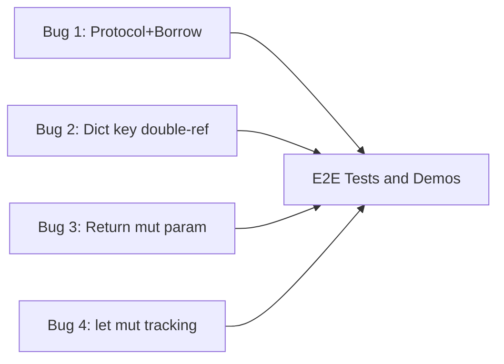

# Borrow-by-Default Codegen Fixes

This milestone fixes three categories of codegen bugs exposed by the borrow-by-default parameter passing model. All three are in the Rust code generation layer -- the HIR and type system are correct; the codegen emits invalid Rust.

## Bug 1: Protocol + Borrow Convention Generates `&Box<dyn Trait>`

**Root cause:** `Type::Protocol.rust_type()` always returns `Box<dyn Trait>` ([types.rs:286](crates/sifr_type_system/src/types.rs)). When the convention is `Borrow`, the codegen blindly wraps it as `&Box<dyn Trait>` -- a double-indirection that doesn't match the `Box::new(concrete)` emitted at call sites.

**Current behavior (broken):**

```
// Sifr: def show(item: Printable)
fn show(item: &Box<dyn Printable>) { ... }  // param: &Box<dyn Trait>
show(Box::new(u));                           // call: Box<dyn Trait> -- type mismatch
```

**Desired behavior:**

```
// Borrow convention:
fn show(item: &dyn Printable) { ... }
show(&u as &dyn Printable);  // or show(&u) with coercion

// Own convention (already works):
fn show(item: Box<dyn Printable>) { ... }
show(Box::new(u));
```

**Fix locations:**

- [crates/sifr_codegen/src/lib.rs](crates/sifr_codegen/src/lib.rs) -- `emit_function` parameter type emission (~line 1528): special-case `Type::Protocol` with `Borrow` convention to emit `&dyn Name` instead of `&Box<dyn Name>`. Same for `MutBorrow` -> `&mut dyn Name`.
- [crates/sifr_codegen/src/lib.rs](crates/sifr_codegen/src/lib.rs) -- call-site Protocol wrapping (~line 3812): when convention is `Borrow`, emit `&arg as &dyn Trait` (or just `&arg` relying on Rust coercion) instead of `Box::new(arg)`. Keep `Box::new()` only for `Own` convention.
- [crates/sifr_codegen/src/lib.rs](crates/sifr_codegen/src/lib.rs) -- class method parameter emission (~line 1417): same special-case for Protocol params in class methods.

## Bug 2: Dict Key Double-Referencing with Borrowed Parameters

**Root cause:** `emit_key_ref_expr` ([lib.rs:5011](crates/sifr_codegen/src/lib.rs)) always prepends `&` to non-literal key expressions. When the key argument is already a borrowed parameter (`key: &String`), this produces `d.get(&&key)` -- a double reference that fails `Borrow<&String>` trait resolution.

**Current behavior (broken):**

```
// Sifr: def lookup(own d: dict[str, int], key: str) -> int:
fn lookup(d: HashMap<String, i64>, key: &String) -> i64 {
    return d.get(&key)...  // &key = &&String -- Borrow<&String> not satisfied
}
```

**Desired behavior:**

```
fn lookup(d: HashMap<String, i64>, key: &String) -> i64 {
    return d.get(key)...  // key is already &String, which satisfies Borrow<String>
}
```

**Fix location:**

- [crates/sifr_codegen/src/lib.rs](crates/sifr_codegen/src/lib.rs) -- `emit_key_ref_expr` (~line 5011): check if the expression is a variable name that is in `self.borrowed_params`. If so, emit the variable directly (it's already `&T`). Otherwise, prepend `&` as before.

## Bug 3: Returning `&mut` Parameter as Owned Type

**Root cause:** When a function has `mut items: list[int]` (codegen: `items: &mut Vec<i64>`) and returns `items`, the codegen emits `return items;` which returns `&mut Vec<i64>`, not `Vec<i64>`.

**Current behavior (broken):**

```
// Sifr: def remove_first(mut items: list[int], val: int) -> list[int]:
fn remove_first(items: &mut Vec<i64>, val: i64) -> Vec<i64> {
    items.remove(...);
    return items;  // type mismatch: &mut Vec<i64> vs Vec<i64>
}
```

**Desired behavior:** The compiler should either:

- (a) Emit `return items.clone();` when returning a `&mut` or `&` parameter, or
- (b) Reject this at the HIR level with a clear error: "cannot return borrowed parameter 'items' -- use `own` or `.clone()`"

Option (b) aligns with the architecture plan's "no silent clone" principle (line 2815 of the arch plan). The fix should be in HIR lowering to detect and reject this pattern.

**Fix location:**

- [crates/sifr_hir/src/lower.rs](crates/sifr_hir/src/lower.rs) -- return statement lowering: when the return expression is a parameter with `Borrow` or `MutBorrow` convention and the return type is an owned type, emit a compile error.

## Bug 4: `let` vs `let mut` for Variables Passed as `&mut`

**Root cause:** When a local variable is passed to a `mut` parameter (`remove_first(&mut nums, 20)`), the codegen emits `let nums` instead of `let mut nums` because the mutation detection (`collect_mutated_vars`) doesn't track variables passed as `&mut` arguments.

**Current behavior (broken):**

```
let nums: Vec<i64> = vec![...];       // not mut
remove_first(&mut nums, 20_i64);      // error: cannot borrow immutable as mutable
```

**Desired behavior:**

```
let mut nums: Vec<i64> = vec![...];   // mut because passed as &mut
remove_first(&mut nums, 20_i64);      // ok
```

**Fix location:**

- [crates/sifr_codegen/src/lib.rs](crates/sifr_codegen/src/lib.rs) -- `collect_mutated_vars` (~line 5497): when scanning function call arguments, check if the callee's corresponding parameter has `MutBorrow` convention. If so, mark the argument variable as mutated.

## Testing

- Update `demos/milestone_audit_fixup_demo.sifr` to remove the `own` workaround on `show(item: Printable)` -- it should work with default borrow convention
- Update `demos/milestone_union_ops_demo.sifr` to remove the `own` workaround on `lookup` and the `mut` workaround on `remove_first` (or keep `mut` and fix the return)
- Add E2E pass tests: `protocol_borrow.sifr`, `dict_get_borrowed_key.sifr`, `mut_param_return.sifr`
- Add E2E fail test: `return_borrowed_param.sifr` (if option (b) is chosen for Bug 3)
- Verify existing `protocol_dispatch.sifr` E2E test still passes
- Verify all 179+ existing E2E tests still pass

## Dependency Graph




All four bugs are independent and can be fixed in parallel. Tests validate all fixes together at the end.