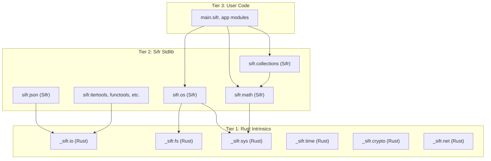

# Hybrid Stdlib Architecture for Sifr

## The Three-Tier Model




### Tier 1: Rust Intrinsics (`_sifr.*`)

These are compiler-provided primitives that map directly to Rust code. They stay in the compiler (like today's stdlib) but are intentionally minimal -- just the operations that **cannot** be written in pure Sifr because they need OS access, unsafe code, or Rust crate bindings.

**Examples of intrinsics:**

- `_sifr.fs`: `read_bytes`, `write_bytes`, `exists`, `list_dir`, `mkdir`, `remove`
- `_sifr.sys`: `argv`, `exit`, `env_get`, `env_set`, `run_command`
- `_sifr.time`: `monotonic_ns`, `sleep_ms`, `wall_clock_ns`
- `_sifr.net`: `tcp_connect`, `tcp_listen`, `http_get` (future)
- `_sifr.crypto`: `sha256_bytes`, `md5_bytes`, `random_bytes`
- `_sifr.io`: `stdin_read_line`, `stdout_write`, `stderr_write`

**Convention:** Prefix with `_` to signal "internal, don't import directly." These are the only modules that live in [sifr_hir/src/stdlib.rs](crates/sifr_hir/src/stdlib.rs) and [sifr_codegen/src/lib.rs](crates/sifr_codegen/src/lib.rs).

### Tier 2: Sifr Stdlib (`sifr.*`)

These are `.sifr` files that import from `_sifr.*` intrinsics and provide the user-facing API. This is where the Python-like API surface lives, written in Sifr itself.

**Examples:**

- `sifr/os.sifr` -- imports `_sifr.fs` and `_sifr.sys`, provides `read_text`, `write_text`, `get_args`, `getcwd`, `listdir`
- `sifr/math.sifr` -- pure Sifr implementations of `sqrt`, `sin`, `cos` (or thin wrappers over intrinsics for performance)
- `sifr/json.sifr` -- imports `_sifr.io`, provides `loads`, `dumps` with proper error handling
- `sifr/collections.sifr` -- pure Sifr: `Counter`, `DefaultDict`, `OrderedDict`, `deque`
- `sifr/itertools.sifr` -- pure Sifr: `chain`, `zip_longest`, `groupby`, `combinations`
- `sifr/functools.sifr` -- pure Sifr: `reduce`, `partial`
- `sifr/statistics.sifr` -- pure Sifr: `mean`, `median`, `stdev`

**Key benefit:** Users can read the stdlib source to understand how things work. The stdlib dogfoods the language and catches language gaps early.

### Tier 3: User Code

Users import from `sifr.*` (Tier 2) as they do today. The API surface doesn't change. They never need to touch `_sifr.*`.

## What Changes in the Compiler

### 1. Stdlib file discovery and bundling

The compiler needs to know where `.sifr` stdlib files live and include them in compilation. Two options:

- **Option A (simpler):** Ship stdlib `.sifr` files alongside the compiler binary. The driver discovers them from a known path (e.g., `$SIFR_HOME/lib/` or relative to the binary).
- **Option B (embedded):** Embed stdlib `.sifr` source in the compiler binary using `include_str!`. No external files needed.

**Recommendation:** Start with Option B (embedded) for simplicity -- no path resolution issues, single binary distribution. The stdlib sources get compiled into the `sifr` binary itself.

### 2. Two-phase compilation

Currently the driver compiles all `.sifr` files in the project directory. With stdlib-in-Sifr:

1. **Phase 1:** Compile stdlib `.sifr` files (they can import `_sifr.*` intrinsics)
2. **Phase 2:** Compile user `.sifr` files (they can import `sifr.*` stdlib modules and other user modules)

The dependency graph already handles ordering; the main change is adding stdlib files to the compilation unit.

### 3. Intrinsics recognition

Rename the current `sifr.*` stdlib registry to `_sifr.*`. The existing `emit_stdlib_call` in codegen becomes `emit_intrinsic_call`. Same mechanism, just scoped to primitives.

### 4. Stdlib `.sifr` file structure

```
lib/
  sifr/
    os.sifr           # from _sifr.fs import read_bytes, write_bytes
    math.sifr          # pure Sifr or thin intrinsic wrappers
    json.sifr          # from _sifr.io import ...
    collections.sifr   # pure Sifr
    itertools.sifr     # pure Sifr
    functools.sifr     # pure Sifr
    statistics.sifr    # pure Sifr
    re.sifr            # from _sifr.regex import ...
    time.sifr          # from _sifr.time import ...
    hash.sifr          # from _sifr.crypto import ...
    encoding.sifr      # pure Sifr (base64 can be pure)
    random.sifr        # from _sifr.crypto import random_bytes
    csv.sifr           # pure Sifr (parsing logic)
    textwrap.sifr      # pure Sifr
    bisect.sifr        # pure Sifr
    heapq.sifr         # pure Sifr
```

## Which Modules Are Pure Sifr vs Need Intrinsics


| Category | Modules | Implementation |
| -------- | ------- | -------------- |


**Pure Sifr (no intrinsics needed):**

- `collections` -- Counter, DefaultDict, OrderedDict, deque (all data structure logic)
- `itertools` -- chain, combinations, permutations, groupby, zip_longest
- `functools` -- reduce, partial, lru_cache
- `statistics` -- mean, median, stdev, variance
- `bisect` -- bisect_left, bisect_right, insort
- `heapq` -- heappush, heappop, heapify
- `textwrap` -- wrap, fill, dedent, indent
- `csv` -- reader, writer (string parsing)
- `encoding` -- base64 encode/decode (pure math)

**Thin Sifr wrapper over intrinsics:**

- `os` -- wraps `_sifr.fs` and `_sifr.sys`
- `io` -- wraps `_sifr.fs` and `_sifr.io`
- `json` -- wraps `_sifr.json` (serde_json is too complex to rewrite)
- `time` -- wraps `_sifr.time`
- `random` -- wraps `_sifr.crypto` (CSPRNG needs Rust)
- `hash` -- wraps `_sifr.crypto`
- `re` -- wraps `_sifr.regex` (regex engine stays in Rust)
- `math` -- wraps `_sifr.math` for transcendental functions (sin/cos/sqrt use libm)

## Why NOT Full Rust FFI Right Now

Full FFI (`extern crate`, `unsafe` blocks, type marshaling) is a large feature that solves a different problem: letting **users** call arbitrary Rust crates. For stdlib, the intrinsics approach is:

- **Simpler:** No `unsafe` keyword, no extern blocks, no type marshaling
- **Safer:** Intrinsics are compiler-controlled, always correct
- **Faster to ship:** Reuses the existing `emit_stdlib_call` mechanism
- **Forward-compatible:** When FFI lands later, intrinsics can be reimplemented as FFI calls internally without changing the stdlib `.sifr` files

## Why NOT Port All of Python's stdlib

Python has 200+ stdlib modules. Many are irrelevant for a compiled language (e.g., `importlib`, `ast`, `dis`, `inspect`, `pdb`). The strategy should be:

**Phase 1 (now):** Port the ~15 most-used modules (listed above) with Sifr's safety guarantees
**Phase 2 (later):** Add modules based on user demand (datetime, pathlib, http, sqlite, etc.)
**Never:** Modules that don't make sense (importlib, ast, dis, code, codeop, compileall)

## Migration Strategy (Incremental, Not Big-Bang)

1. **Start with one pure-Sifr module** (e.g., `sifr.statistics` or `sifr.bisect`) to validate the compilation pipeline
2. **Add intrinsics recognition** (`_sifr.*` prefix) and migrate one intrinsics-backed module (e.g., `sifr.os`)
3. **Migrate remaining modules** one at a time, keeping the old codegen path as fallback
4. **Remove old codegen paths** once all modules are migrated

## Implementation Steps

### Step 1: Stdlib file embedding and compilation

- Add `lib/sifr/` directory with `.sifr` files
- Embed them in the compiler binary via `include_str!`
- Update the driver to include stdlib modules in the compilation unit
- Stdlib modules compile before user modules (topological sort handles this naturally)

### Step 2: Intrinsics layer

- Rename current `sifr.*` registry to `_sifr.*` in [sifr_hir/src/stdlib.rs](crates/sifr_hir/src/stdlib.rs)
- Rename `emit_stdlib_call` to `emit_intrinsic_call` in [sifr_codegen/src/lib.rs](crates/sifr_codegen/src/lib.rs)
- Reduce the intrinsics surface to only what can't be written in Sifr

### Step 3: First pure-Sifr module

- Write `lib/sifr/statistics.sifr` with `mean`, `median`, `stdev`
- Verify it compiles and works end-to-end
- This validates the entire pipeline

### Step 4: First intrinsics-backed module

- Write `lib/sifr/os.sifr` that imports from `_sifr.fs` and `_sifr.sys`
- Verify intrinsics are resolved and codegen works

### Step 5: Migrate remaining modules

- Port each existing stdlib module to a `.sifr` file
- Add new modules (itertools, functools, statistics, etc.)
- Each module gets its own audit test suite

### Step 6: Full FFI (future, separate milestone)

- When users need to call arbitrary Rust crates, implement proper FFI
- Intrinsics can optionally be reimplemented as FFI internally

