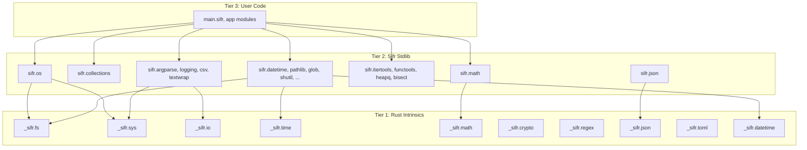

# Hybrid Stdlib Architecture for Sifr

## Phase Position in the Roadmap

```
BorrowChecker Phase (current)
  milestone_borrow_default
  milestone_borrow_hardening
      |
      v
Stdlib Architecture Phase (THIS PLAN -- 4 milestones)
  milestone_intrinsics
  milestone_stdlib_migration
  milestone_stdlib_expansion
  milestone_stdlib_parity
      |
      v
Ecosystem Phase
  milestone_networking_stdlib    <-- T3 modules that need async/net
  milestone_async
  milestone_web_db
  ...
```

---

## The Three-Tier Model



### Tier 1: Rust Intrinsics (`_sifr.*`)

Compiler-provided primitives that map directly to Rust code. Intentionally minimal -- only operations that **cannot** be written in pure Sifr because they need OS access, unsafe code, or Rust crate bindings.

These are the only modules that live in [sifr_hir/src/stdlib.rs](crates/sifr_hir/src/stdlib.rs) and [sifr_codegen/src/lib.rs](crates/sifr_codegen/src/lib.rs). Convention: `_` prefix signals "internal, don't import directly."

**Intrinsics surface (~35 primitives):**

- `_sifr.fs` -- `read_bytes`, `write_bytes`, `append_bytes`, `exists`, `is_file`, `is_dir`, `list_dir`, `mkdir`, `mkdir_p`, `remove`, `remove_dir`, `rename`, `copy_file`, `getcwd`, `file_size`, `walk_dir` (Rust: `std::fs`, `std::path`)
- `_sifr.sys` -- `argv`, `exit`, `env_get`, `env_set`, `run_command`, `platform_os`, `platform_arch` (Rust: `std::env`, `std::process`)
- `_sifr.io` -- `stdin_read_line`, `stdout_write`, `stderr_write` (Rust: `std::io`)
- `_sifr.time` -- `monotonic_ns`, `sleep_ms`, `wall_clock_ns`, `perf_counter_ns` (Rust: `std::time`)
- `_sifr.math` -- `_sqrt`, `_sin`, `_cos`, `_tan`, `_asin`, `_acos`, `_atan`, `_atan2`, `_exp`, `_log`, `_log2`, `_log10` (Rust: `f64` methods / libm)
- `_sifr.crypto` -- `sha256_bytes`, `sha1_bytes`, `sha512_bytes`, `md5_bytes`, `random_bytes`, `random_int_range`, `random_float` (Rust: `sha2`, `md5`, `rand`)
- `_sifr.regex` -- `regex_is_match`, `regex_find`, `regex_find_all`, `regex_replace`, `regex_split` (Rust: `regex`)
- `_sifr.json` -- `json_parse`, `json_stringify` (Rust: `serde_json`)
- `_sifr.toml` -- `toml_parse` (Rust: `toml`)
- `_sifr.datetime` -- `datetime_now`, `datetime_from_timestamp`, `datetime_format`, `datetime_parse` (Rust: `chrono`)

### Tier 2: Sifr Stdlib (`sifr.*`)

`.sifr` files that import from `_sifr.*` intrinsics and provide the user-facing API. Written in Sifr itself. Users can read the source to understand how things work.

### Tier 3: User Code

Users import from `sifr.*` (Tier 2) as they do today. The API surface doesn't change. They never need to touch `_sifr.*`.

---

## What Changes in the Compiler

### 1. Stdlib file embedding

Embed stdlib `.sifr` source in the compiler binary using `include_str!`. No external files needed -- single binary distribution. The stdlib sources get compiled into the `sifr` binary itself.

### 2. Two-phase compilation

1. **Phase 1:** Compile stdlib `.sifr` files (they can import `_sifr.*` intrinsics)
2. **Phase 2:** Compile user `.sifr` files (they can import `sifr.*` stdlib modules and other user modules)

The dependency graph already handles ordering; the main change is adding stdlib files to the compilation unit.

### 3. Intrinsics recognition

Rename the current `sifr.*` stdlib registry to `_sifr.*`. The existing `emit_stdlib_call` in codegen becomes `emit_intrinsic_call`. Same mechanism, just scoped to primitives.

### 4. Stdlib `.sifr` file structure

```
lib/sifr/
  test.sifr          # assert_eq, assert_ne, assert_true, assert_false
  math.sifr          # sqrt, sin, cos, floor, ceil, pi, e, factorial, gcd, ...
  io.sifr            # read_text, write_text, exists, read_lines, append_text
  os.sifr            # run_command, get_args, getcwd, listdir, mkdir, walk
  env.sifr           # env_get, env_set
  json.sifr          # loads, dumps
  re.sifr            # match, find, findall, replace, split
  time.sifr          # now, sleep, format, monotonic, perf_counter
  random.sifr        # randint, random, choice, shuffle, sample, seed
  hash.sifr          # sha256, md5, sha1, sha512, hmac
  encoding.sifr      # base64_encode, base64_decode, urlsafe_encode, ...
  bytes.sifr         # encode_utf8, decode_utf8, to_hex, from_hex
  collections.sifr   # Counter, DefaultDict, OrderedDict, deque, Set ops
  statistics.sifr    # mean, median, stdev, variance
  bisect.sifr        # bisect_left, bisect_right, insort
  heapq.sifr         # heappush, heappop, heapify, nlargest, nsmallest
  textwrap.sifr      # wrap, fill, dedent, indent
  csv.sifr           # reader, writer
  functools.sifr     # reduce
  itertools.sifr     # chain, zip_longest, groupby
  string.sifr        # ascii_letters, digits, punctuation, ...
  argparse.sifr      # ArgumentParser class
  logging.sifr       # Logger, getLogger, info, warning, error, debug
  shutil.sifr        # copy, copytree, rmtree, move
  tempfile.sifr      # mkstemp, mkdtemp, NamedTemporaryFile
  glob.sifr          # glob, iglob
  fnmatch.sifr       # fnmatch, filter, translate
  secrets.sifr       # token_hex, token_urlsafe, token_bytes, choice
  pprint.sifr        # pformat, pprint
  contextlib.sifr    # suppress (context manager utilities)
  difflib.sifr       # unified_diff, get_close_matches, SequenceMatcher
  colorsys.sifr      # rgb_to_hls, hls_to_rgb, rgb_to_hsv, hsv_to_rgb
  graphlib.sifr      # TopologicalSorter
  ipaddress.sifr     # ip_address, ip_network
  timeit.sifr        # timeit, repeat
  platform.sifr      # system, machine, architecture
  configparser.sifr  # ConfigParser
  tomllib.sifr       # loads, load
  datetime.sifr      # date, datetime, timedelta, timezone
  pathlib.sifr       # Path class
  uuid.sifr          # uuid4
  copy.sifr          # copy, deepcopy
  dataclasses.sifr   # dataclass decorator
  enum.sifr          # Enum, IntEnum
```

---

## Rust Crate Mapping for Intrinsics

Each `_sifr.*` intrinsic module maps to specific Rust crates or std modules. When a Sifr stdlib module is used, the compiler traces through to the intrinsics it depends on and injects the appropriate Cargo dependencies.

- `_sifr.fs` -- `std::fs`, `std::path` (no external crate)
- `_sifr.sys` -- `std::env`, `std::process` (no external crate)
- `_sifr.io` -- `std::io` (no external crate)
- `_sifr.time` -- `std::time`, `std::thread` (no external crate)
- `_sifr.math` -- `f64` methods (no external crate; all transcendental functions are on `f64` in Rust std)
- `_sifr.crypto` -- `sha2`, `sha1`, `md5`, `rand` (external crates)
- `_sifr.regex` -- `regex` (external crate)
- `_sifr.json` -- `serde_json`, `serde` (external crates)
- `_sifr.toml` -- `toml` (external crate)
- `_sifr.datetime` -- `chrono` (external crate)

**Key insight:** 6 of 10 intrinsic modules use only Rust std -- no external dependencies. Only `_sifr.crypto`, `_sifr.regex`, `_sifr.json`, `_sifr.toml`, and `_sifr.datetime` need external crates.

---

## Complete Module Inventory: What to Port, What to Skip

### Modules to Port (42 total, across 4 milestones)

Organized by implementation type:

**Pure Sifr -- no intrinsics needed (22 modules):**

- `test` -- assert functions
- `collections` -- Counter, DefaultDict, OrderedDict, deque, Set wrappers
- `statistics` -- mean, median, stdev, variance
- `bisect` -- bisect_left, bisect_right, insort
- `heapq` -- heappush, heappop, heapify, nlargest, nsmallest
- `textwrap` -- wrap, fill, dedent, indent
- `csv` -- reader, writer
- `functools` -- reduce
- `itertools` -- chain, zip_longest, groupby
- `string` -- ascii_letters, digits, punctuation constants
- `argparse` -- ArgumentParser class with add_argument, parse_args
- `logging` -- Logger, handlers, formatters (output via `_sifr.io` + `_sifr.time`)
- `pprint` -- pretty-print data structures
- `contextlib` -- suppress, context manager utilities
- `difflib` -- unified_diff, get_close_matches, SequenceMatcher
- `colorsys` -- color space conversions (pure math, ~50 lines)
- `graphlib` -- TopologicalSorter
- `ipaddress` -- IPv4/IPv6 address parsing and manipulation
- `configparser` -- INI file parsing
- `copy` -- copy, deepcopy
- `dataclasses` -- dataclass decorator
- `enum` -- Enum, IntEnum

**Thin Sifr wrapper over intrinsics (20 modules):**

- `math` -- wraps `_sifr.math` (f64 methods)
- `io` -- wraps `_sifr.fs` + `_sifr.io`
- `os` -- wraps `_sifr.fs` + `_sifr.sys`
- `env` -- wraps `_sifr.sys`
- `json` -- wraps `_sifr.json` (serde_json)
- `re` -- wraps `_sifr.regex` (regex crate)
- `time` -- wraps `_sifr.time`
- `random` -- wraps `_sifr.crypto` (rand crate)
- `hash` -- wraps `_sifr.crypto` (sha2, md5)
- `encoding` -- wraps `_sifr.crypto` for base64 (or pure Sifr)
- `bytes` -- wraps `_sifr.io`
- `secrets` -- wraps `_sifr.crypto` (CSPRNG)
- `shutil` -- wraps `_sifr.fs` (high-level file ops)
- `tempfile` -- wraps `_sifr.fs` + `_sifr.crypto` (random names)
- `glob` -- wraps `_sifr.fs` (list_dir) + fnmatch logic
- `fnmatch` -- wraps `_sifr.regex` (pattern translation)
- `timeit` -- wraps `_sifr.time` (perf_counter)
- `platform` -- wraps `_sifr.sys` (platform_os, platform_arch)
- `tomllib` -- wraps `_sifr.toml`
- `datetime` -- wraps `_sifr.datetime` (chrono)
- `pathlib` -- wraps `_sifr.fs` (Path class)
- `uuid` -- wraps `_sifr.crypto` (random_bytes for uuid4)

### Modules to Defer to Ecosystem Phase

These depend on async, networking, or threading -- features that come after this phase. A `milestone_networking_stdlib` should be the first milestone in the Ecosystem phase, before `milestone_async`.

- `socket` -- raw TCP/UDP (needs `_sifr.net` intrinsics + async runtime)
- `ssl` -- TLS (needs socket + Rust `rustls` or `native-tls`)
- `http` -- HTTP client/server (needs socket + async)
- `urllib` -- URL handling + HTTP requests (needs http)
- `asyncio` -- IS the async milestone itself
- `threading` -- OS threads (needs `_sifr.thread` intrinsics)
- `queue` -- thread-safe queues (needs threading or async)
- `multiprocessing` -- process spawning + IPC (needs `_sifr.sys` extensions)
- `concurrent` -- thread/process pools (needs threading)
- `selectors` -- I/O multiplexing (async runtime internal)
- `subprocess` -- already partially covered by `os.run_command`; full Popen API needs async
- `sqlite3` -- in `milestone_web_db` roadmap
- `xml` / `html` -- parsing libraries (add during web milestone)
- `email` -- in `milestone_email` roadmap
- `gzip` / `bz2` / `lzma` / `zipfile` / `tarfile` -- compression (needs Rust crate bindings, add on demand)
- `decimal` / `fractions` -- arbitrary precision (needs Rust `rust_decimal` crate, add on demand)

### Modules to Never Port (at least for now)

These exist because of Python's specific nature (interpreted, dynamic, REPL-oriented) and have no meaningful equivalent in a compiled, statically-typed language (also to keep the scope reasonable and focus on the most important modules):

- `ast`, `dis`, `symtable`, `tokenize`, `token`, `keyword` -- Python compiler internals
- `code`, `codeop`, `compileall`, `py_compile` -- Python compilation
- `importlib`, `pkgutil`, `modulefinder`, `runpy`, `zipimport` -- Python import machinery
- `inspect` -- runtime introspection of live objects
- `pdb`, `bdb` -- Python debugger
- `profile`, `cProfile`, `pstats`, `profiling` -- Python profiler
- `trace`, `traceback`, `tracemalloc` -- Python tracing
- `pickle`, `pickletools`, `shelve`, `copyreg` -- Python object serialization
- `types`, `typing`, `abc`, `numbers`, `operator` -- runtime type utilities (Sifr has compile-time types, protocols)
- `warnings`, `__future__`, `annotationlib` -- Python version compatibility
- `site`, `_sitebuiltins`, `ensurepip`, `venv` -- Python environment
- `idlelib`, `tkinter`, `turtle`, `turtledemo`, `curses` -- GUI/terminal UI
- `ctypes`, `struct` -- C FFI (Sifr will have its own FFI)
- `antigravity`, `this` -- Easter eggs
- `pydoc`, `pydoc_data`, `pyclbr`, `doctest` -- Python documentation
- `gettext`, `locale` -- i18n/l10n (complex, better as third-party)
- `optparse`, `getopt` -- deprecated CLI parsing
- `wave`, `pty`, `tty`, `webbrowser` -- very niche
- `netrc`, `mailbox`, `mimetypes`, `quopri`, `stringprep` -- very niche
- `ntpath`, `nturl2path`, `posixpath`, `genericpath` -- internal to os.path/pathlib
- `reprlib`, `sched`, `filecmp`, `fileinput` -- niche utilities
- `linecache`, `tabnanny`, `stat`, `signal` -- internal/OS-specific
- `contextvars`, `sysconfig`, `rlcompleter` -- Python-specific
- `weakref` -- Sifr's ownership model eliminates most use cases
- `codecs`, `encodings` -- Rust is UTF-8 by default; minimal encode/decode in `sifr.bytes`

### Modules to Revisit Later

These may become relevant as the language matures:

- `signal` -- OS signal handling (revisit if users need graceful shutdown without async)
- `weakref` -- if ownership model needs weak references for specific patterns
- `decimal` / `fractions` -- if financial/scientific computing becomes a priority
- `gzip` / `zipfile` / `tarfile` -- if compression is commonly requested
- `xml` / `html` -- if web scraping becomes a use case before the web milestone
- `contextlib` advanced features -- `redirect_stdout`, `ExitStack` (revisit as context managers mature)

---

## Milestone Breakdown

### Milestone 1: `milestone_intrinsics` -- Intrinsics Layer and Stdlib Compilation Pipeline

**Size: Medium (comparable to milestone_imports)**

Rewires how stdlib works internally. No new user-facing features, but establishes the architecture everything else builds on.

**Compiler changes:**

1. Rename current `sifr.*` registry to `_sifr.*` in [sifr_hir/src/stdlib.rs](crates/sifr_hir/src/stdlib.rs) -- mechanical rename of `get_stdlib_module()` match arms and `is_stdlib_module()` check
2. Rename `emit_stdlib_call` to `emit_intrinsic_call` in [sifr_codegen/src/lib.rs](crates/sifr_codegen/src/lib.rs)
3. Split current 55 functions into ~35 true primitives across `_sifr.fs`, `_sifr.sys`, `_sifr.io`, `_sifr.time`, `_sifr.math`, `_sifr.crypto`, `_sifr.regex`, `_sifr.json`
4. Add `lib/sifr/` directory with `.sifr` files embedded via `include_str!`
5. Update driver ([sifr_driver/src/lib.rs](crates/sifr_driver/src/lib.rs)) to discover and compile embedded stdlib `.sifr` modules before user modules
6. Update `starts_with("sifr.")` check in [sifr_hir/src/lower.rs](crates/sifr_hir/src/lower.rs) to resolve stdlib `.sifr` files first, falling back to `_sifr.*` intrinsics
7. Update codegen to handle stdlib modules as regular Rust `mod`/`use` (not inline emit)
8. Proof-of-concept: `lib/sifr/test.sifr` (assert_eq, assert_ne, assert_true, assert_false are pure Sifr)

**Acceptance criteria:** `from sifr.test import assert_eq` resolves to the `.sifr` file, compiles, and works. All existing E2E tests still pass (old modules still use intrinsics path during transition).

---

### Milestone 2: `milestone_stdlib_migration` -- Migrate Existing 13 Modules to Sifr

**Size: Medium-Large (comparable to milestone_borrow_default)**

Port all 13 existing stdlib modules from Rust codegen to `.sifr` files. Each module becomes a thin wrapper importing from `_sifr.*` intrinsics.

**Modules to migrate (in dependency order):**

1. `lib/sifr/env.sifr` -- wraps `_sifr.sys` (env_get, env_set) -- simplest, good first migration
2. `lib/sifr/bytes.sifr` -- wraps `_sifr.io` (encode_utf8, decode_utf8, to_hex, from_hex)
3. `lib/sifr/encoding.sifr` -- wraps `_sifr.crypto` or pure Sifr (base64_encode, base64_decode)
4. `lib/sifr/math.sifr` -- wraps `_sifr.math` (12 functions + pi, e constants)
5. `lib/sifr/hash.sifr` -- wraps `_sifr.crypto` (sha256, md5)
6. `lib/sifr/io.sifr` -- wraps `_sifr.fs` + `_sifr.io` (read_text, write_text, exists, read_lines)
7. `lib/sifr/os.sifr` -- wraps `_sifr.sys` + `_sifr.fs` (run_command, get_args)
8. `lib/sifr/json.sifr` -- wraps `_sifr.json` (json_loads, json_dumps)
9. `lib/sifr/time.sifr` -- wraps `_sifr.time` (time_now, sleep, time_format)
10. `lib/sifr/random.sifr` -- wraps `_sifr.crypto` (random_int, random_float, random_choice)
11. `lib/sifr/re.sifr` -- wraps `_sifr.regex` (re_match, re_find, re_replace)
12. `lib/sifr/collections.sifr` -- wraps existing set/counter/defaultdict intrinsics
13. `lib/sifr/test.sifr` -- already done in milestone_intrinsics (verify still works)

**Final cleanup:**

- Delete the ~430-line `emit_stdlib_call` function in codegen
- Delete the old `sifr.*` entries in `get_stdlib_module()`
- Update Cargo dependency injection to trace through `_sifr.*` intrinsics

**Acceptance criteria:** `emit_stdlib_call` is deleted. Every `from sifr.X import Y` resolves to a `.sifr` file. All existing E2E tests, audit tests, and stdlib tests pass with zero regressions.

---

### Milestone 3: `milestone_stdlib_expansion` -- New Modules (Algorithms, CLI, File Utilities)

**Size: Medium (comparable to milestone_ext_stdlib)**

Add ~17 new modules. These are the most commonly needed modules that Python developers reach for daily. Ordered by dependency (modules that others depend on come first) and by implementation complexity (pure Sifr first, then intrinsic-backed).

**Pure Sifr modules (no new intrinsics needed):**

1. `lib/sifr/string.sifr` -- `ascii_letters`, `digits`, `punctuation`, `whitespace` constants (tiny, no deps)
2. `lib/sifr/colorsys.sifr` -- `rgb_to_hls`, `hls_to_rgb`, `rgb_to_hsv`, `hsv_to_rgb` (pure math, ~50 lines)
3. `lib/sifr/statistics.sifr` -- `mean`, `median`, `stdev`, `variance` (pure math over lists)
4. `lib/sifr/bisect.sifr` -- `bisect_left`, `bisect_right`, `insort` (pure algorithms)
5. `lib/sifr/heapq.sifr` -- `heappush`, `heappop`, `heapify`, `nlargest`, `nsmallest` (pure data structure)
6. `lib/sifr/functools.sifr` -- `reduce` (pure higher-order function)
7. `lib/sifr/itertools.sifr` -- `chain`, `zip_longest`, `groupby` (pure iteration)
8. `lib/sifr/textwrap.sifr` -- `wrap`, `fill`, `dedent`, `indent` (pure string processing)
9. `lib/sifr/csv.sifr` -- `reader`, `writer` (pure string parsing)
10. `lib/sifr/pprint.sifr` -- `pformat`, `pprint` (pure string formatting)
11. `lib/sifr/contextlib.sifr` -- `suppress` (context manager utility)
12. `lib/sifr/argparse.sifr` -- `ArgumentParser` class with `add_argument`, `parse_args` (pure Sifr, uses `sifr.os.get_args`)

**Intrinsic-backed modules (need new `_sifr.*` primitives):**

13. `lib/sifr/fnmatch.sifr` -- `fnmatch`, `filter`, `translate` (wraps `_sifr.regex` for pattern translation)
14. `lib/sifr/glob.sifr` -- `glob`, `iglob` (wraps `_sifr.fs.list_dir` + fnmatch)
15. `lib/sifr/shutil.sifr` -- `copy`, `copytree`, `rmtree`, `move` (wraps `_sifr.fs` -- needs new intrinsics: `copy_file`, `walk_dir`)
16. `lib/sifr/tempfile.sifr` -- `mkstemp`, `mkdtemp` (wraps `_sifr.fs` + `_sifr.crypto.random_bytes` for random names)
17. `lib/sifr/secrets.sifr` -- `token_hex`, `token_urlsafe`, `token_bytes`, `choice` (wraps `_sifr.crypto`)

**New intrinsics needed:** `_sifr.fs.copy_file`, `_sifr.fs.walk_dir` (2 new primitives added to existing `_sifr.fs`)

**Acceptance criteria:** Each new module compiles, imports work, functions produce correct output. E2E tests for each module. Language gaps discovered during dogfooding are filed as issues.

---

### Milestone 4: `milestone_stdlib_parity` -- Gap Closing, Remaining Modules, and Audit

**Size: Medium-Large (comparable to milestone_borrow_default + milestone_borrow_hardening)**

Two parts: (A) close gaps in existing modules by adding missing functions, (B) add remaining Tier 1+2 modules, (C) run the comprehensive parity audit.

**Part A -- Expand existing modules:**

- `sifr/math.sifr` -- add ~20 missing functions: `asin`, `acos`, `atan`, `atan2`, `sinh`, `cosh`, `tanh`, `exp`, `log2`, `log10`, `log1p`, `factorial`, `gcd`, `lcm`, `isnan`, `isinf`, `isfinite`, `fmod`, `hypot`, `tau`, `inf` (needs new `_sifr.math` intrinsics for inverse trig and hyperbolic)
- `sifr/os.sifr` -- add `getcwd`, `listdir`, `mkdir`, `makedirs`, `rename`, `remove`, `walk` (uses existing + new `_sifr.fs` intrinsics)
- `sifr/re.sifr` -- add `findall`, `split` (uses new `_sifr.regex` intrinsics)
- `sifr/random.sifr` -- add `shuffle`, `sample`, `seed`, `uniform`, `randrange`
- `sifr/io.sifr` -- add `append_text`, binary I/O
- `sifr/collections.sifr` -- add `deque`, `OrderedDict`
- `sifr/time.sifr` -- add `monotonic`, `perf_counter`
- `sifr/hash.sifr` -- add `sha1`, `sha512`, `hmac`
- `sifr/encoding.sifr` -- add `urlsafe_b64encode`, `urlsafe_b64decode`, `b32encode`, `b32decode`
- `sifr/itertools.sifr` -- add `combinations`, `permutations`, `product`, `accumulate`
- `sifr/functools.sifr` -- add `partial` (if closures support it)

**Part B -- New modules (remaining Tier 1+2):**

1. `lib/sifr/difflib.sifr` -- `unified_diff`, `get_close_matches`, `SequenceMatcher` (pure Sifr, algorithmic)
2. `lib/sifr/graphlib.sifr` -- `TopologicalSorter` (pure Sifr, algorithmic)
3. `lib/sifr/ipaddress.sifr` -- `ip_address`, `ip_network` (pure Sifr, parsing + math)
4. `lib/sifr/timeit.sifr` -- `timeit`, `repeat` (wraps `_sifr.time.perf_counter_ns`)
5. `lib/sifr/platform.sifr` -- `system`, `machine`, `architecture` (wraps `_sifr.sys.platform_os`, `platform_arch`)
6. `lib/sifr/configparser.sifr` -- `ConfigParser` class (pure Sifr, string parsing)
7. `lib/sifr/tomllib.sifr` -- `loads`, `load` (wraps new `_sifr.toml` intrinsic)
8. `lib/sifr/datetime.sifr` -- `date`, `datetime`, `timedelta`, `timezone` (wraps new `_sifr.datetime` intrinsic)
9. `lib/sifr/pathlib.sifr` -- `Path` class with `/` operator, `exists`, `read_text`, `write_text`, `stem`, `suffix`, `parent` (wraps `_sifr.fs`)
10. `lib/sifr/uuid.sifr` -- `uuid4` (wraps `_sifr.crypto.random_bytes`)
11. `lib/sifr/copy.sifr` -- `copy`, `deepcopy` (pure Sifr)
12. `lib/sifr/dataclasses.sifr` -- `dataclass` decorator (pure Sifr, depends on metaprogramming support)
13. `lib/sifr/enum.sifr` -- `Enum`, `IntEnum` (pure Sifr)
14. `lib/sifr/logging.sifr` -- `Logger`, `getLogger`, `info`, `warning`, `error`, `debug` (wraps `_sifr.io` + `_sifr.time`)

**New intrinsics needed:** `_sifr.toml.toml_parse`, `_sifr.datetime.*` (4 primitives), `_sifr.sys.platform_os`, `_sifr.sys.platform_arch`, `_sifr.math` inverse trig/hyperbolic (~8 primitives)

**Part C -- Parity audit:**

- Run the comprehensive stdlib parity audit from [.cursor/plans/stdlib_parity_audit_2c354444.md](.cursor/plans/stdlib_parity_audit_2c354444.md) (~200 test files across 30 directories)
- Produce `audit/STDLIB_PARITY_MASTER_REPORT.md` with coverage percentages per module
- Target: 60%+ coverage across the top 20 CPython modules

**Acceptance criteria:** All expanded modules pass their tests. All new modules compile and work. Parity audit report generated with coverage metrics. `cargo test` passes.

---

## Ecosystem Phase: Networking Stdlib Milestone

The first milestone in the Ecosystem phase should be `milestone_networking_stdlib`, which adds the Tier 3 modules that were deferred because they need async/networking primitives. This milestone should come before or alongside `milestone_async`:

**Modules:**
- `sifr/subprocess.sifr` -- full Popen API (wraps new `_sifr.process` intrinsics)
- `sifr/socket.sifr` -- TCP/UDP (wraps new `_sifr.net` intrinsics)
- `sifr/http.sifr` -- HTTP client (wraps `_sifr.net` + potentially `reqwest` crate)
- `sifr/url.sifr` -- URL parsing (pure Sifr or wraps `url` crate)

These are documented here for completeness but are **not** part of this phase's 4 milestones.

---

## Why NOT Full Rust FFI Right Now

Full FFI (`extern crate`, `unsafe` blocks, type marshaling) solves a different problem: letting **users** call arbitrary Rust crates. For stdlib, the intrinsics approach is:

- **Simpler:** No `unsafe` keyword, no extern blocks, no type marshaling
- **Safer:** Intrinsics are compiler-controlled, always correct
- **Faster to ship:** Reuses the existing `emit_stdlib_call` mechanism
- **Forward-compatible:** When FFI lands later (milestone_ffi in Phase 5), intrinsics can be reimplemented as FFI calls internally without changing the stdlib `.sifr` files

