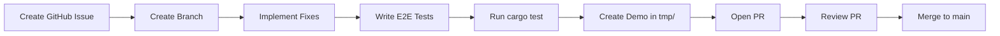

# Language Hardening Phase -- Implementation Plan

## Workflow Per Milestone

Each of the 10 milestones follows this cycle:

- **Issue**: Created via `gh issue create` with task template format
- **Branch**: `milestone_<name>` off `main`
- **Tests**: New `.sifr` files in `crates/sifr/tests/e2e/pass/` using `# expect-stdout:` format
- **Demo**: A `.sifr` file in `demos/<milestone>_demo/` showcasing all features
- **PR**: Using the PR template from `.cursor/references/pr-template.md`
- **Review**: Verify tests pass, demo works, code quality
- **Merge**: Squash merge to `main`

## Key Files to Modify

Almost every milestone touches these core files:

- **Codegen**: `[crates/sifr_codegen/src/lib.rs](crates/sifr_codegen/src/lib.rs)` (~4,355 lines) -- Rust code generation
- **HIR Lowering**: `[crates/sifr_hir/src/lower.rs](crates/sifr_hir/src/lower.rs)` (~4,077 lines) -- AST to typed HIR
- **Type Narrowing**: `[crates/sifr_type_system/src/narrow.rs](crates/sifr_type_system/src/narrow.rs)` (~317 lines)
- **Scope**: `[crates/sifr_hir/src/scope.rs](crates/sifr_hir/src/scope.rs)` (~269 lines)
- **Types**: `[crates/sifr_type_system/src/types.rs](crates/sifr_type_system/src/types.rs)` (~653 lines)
- **Type Check**: `[crates/sifr_type_system/src/check.rs](crates/sifr_type_system/src/check.rs)` (~317 lines)

---

## Milestone 1: `milestone_codegen_fixes`

**10 codegen bugs to fix in `[crates/sifr_codegen/src/lib.rs](crates/sifr_codegen/src/lib.rs)`:**

1. **Tuple indexing** (line ~2839): When index is a positive `IntLiteral`, `emit_expr(index)` emits `5_i64` instead of `5`. Fix: emit the raw integer without suffix for tuple field access.
2. **Union return wrapping** (line ~1371-1395): Only handles `Option<T>` wrapping. For non-Option unions like `int | str`, `return 42` must emit `IntOrStr::Int(42_i64)`. Fix: detect union return types and wrap in enum variant.
3. **int/int division** (line ~2422): `a / b` for two ints emits `a / b` (integer division). Fix: when both operands are `Int` and operator is `/`, emit `(a as f64) / (b as f64)`.
4. **print(None)** (line ~2526): `print(None)` calls `emit_display_expr` which doesn't handle `Type::None`. Fix: special-case `Type::None` to emit `println!("None")`.
5. **Escaped quotes** (line ~2331): String literals use `{:?}` which adds outer quotes. Fix: implement proper escape handling that preserves Python escape sequences in Rust string literals.
6. **Narrowed variable reassignment** (line ~1273-1280): Variables inside isinstance match arms are shadowed but not marked mutable. Fix: track `mutated_vars` through narrowing scopes.
7. **float * int cast precedence** (line ~2422): `as f64` casts may have wrong precedence. Fix: wrap sub-expressions in parens before casting.
8. `****=` power assignment** (codegen): Returns `f64` for `i64` variable. Fix: cast result back to `i64` when target is `Int`.
9. **bool() on collections** (line ~2618-2634): Only handles `Int` and `Str`. Fix: add `Type::List(_)` and `Type::Dict(_, _)` cases emitting `!expr.is_empty()`.
10. **3-way union is None** (line ~1491): Uses `.is_none()` which only works for `Option<T>`. Fix: for 3+ member unions, emit match arm against the `None` variant.

**E2E tests**: ~10 new pass tests in `crates/sifr/tests/e2e/pass/`
**Demo**: `demos/milestone_codegen_fixes_demo/`

---

## Milestone 2: `milestone_narrowing_v2`

**6 narrowing issues across `[crates/sifr_hir/src/lower.rs](crates/sifr_hir/src/lower.rs)`, `[crates/sifr_type_system/src/narrow.rs](crates/sifr_type_system/src/narrow.rs)`, `[crates/sifr_hir/src/scope.rs](crates/sifr_hir/src/scope.rs)`:**

1. **Early-return narrowing** (lower.rs ~1575-1641): After `if x is None: return`, the scope restore at line ~1633 undoes narrowing. Fix: detect early-return patterns (return/raise/break/continue in then-body) and apply inverse narrowing after the if block instead of restoring.
2. **And-based narrowing** (lower.rs ~1644-1720): `detect_narrowing_condition` doesn't handle `BoolOp::And`. Fix: when expr is `BoolOp::And`, recursively detect conditions for each operand and combine with `NarrowingCondition::And`.
3. **elif isinstance codegen** (codegen lib.rs ~1407-1444): Only first `if isinstance` generates match arms. Fix: detect chains of `if isinstance / elif isinstance` and generate a single `match` with all arms.
4. **elif equality narrowing**: `if x == "GET": ... elif x == "POST":` narrows to `Never`. Fix: apply equality narrowing per branch.
5. **Sequential narrowing**: `if x is None: ... elif isinstance(x, int): ... else:` should narrow to remaining type. Fix: track cumulative narrowing across elif chains.
6. **len() on nested optionals**: `len(matrix[0])` fails because `matrix[0]` is `list[int] | None`. Fix: auto-narrow after successful indexing in certain contexts.

**E2E tests**: ~8 new pass tests
**Demo**: `demos/milestone_narrowing_v2_demo/`

---

## Milestone 3: `milestone_ownership_v2`

**6 ownership issues in `[crates/sifr_codegen/src/lib.rs](crates/sifr_codegen/src/lib.rs)` and `[crates/sifr_hir/src/lower.rs](crates/sifr_hir/src/lower.rs)`:**

1. **print() consumes values** (codegen ~2493-2529): `println!("{}", expr)` moves the value. Fix: emit `&expr` or `expr.clone()` for non-Copy types in print.
2. **String method results moved**: Fix: emit `.clone()` when a string/collection is used after a method call.
3. **List mutation after use**: Fix: use `&` references for read-only operations, `&mut` for mutations.
4. **Tuple len() after print**: Fix: auto-borrow tuples in print.
5. **Dunder operators consume left operand**: Fix: emit `&` for operator overload calls.
6. **Chained operations on inferred types**: Fix: ensure intermediate values are not moved.

**Implementation approach**: Add a `needs_borrow` analysis pass that identifies variables used after being passed to print/operators/functions. Emit `&` or `.clone()` accordingly.

**E2E tests**: ~8 new pass tests
**Demo**: `demos/milestone_ownership_v2_demo/`

---

## Milestone 4: `milestone_subscript_mutation`

**5 issues in `[crates/sifr_hir/src/lower.rs](crates/sifr_hir/src/lower.rs)` (line ~1416-1422) and codegen:**

1. **list[i] = val**: The error at line ~1418 ("assignment target must be a simple name") blocks this. Fix: recognize `Expr::Subscript` as a valid assignment target, lower to `HirStmt::SubscriptAssign`, and emit `vec[i] = val` in codegen.
2. **dict[key] = val**: Same fix path, emit `map.insert(key, val)` in codegen.
3. **self.field += 1**: The error at line ~1469 blocks this. Fix: recognize `Expr::Attribute` in augmented assignment, lower to `HirStmt::AttributeAugAssign`, emit `self.field += val`.
4. **list[i] += val**: Combine subscript target with augmented assignment.
5. **self.field = self.field + 1**: Already partially works via attribute assignment (line ~1398-1414), verify and fix.

**New HIR nodes needed**: `HirStmt::SubscriptAssign`, `HirStmt::SubscriptAugAssign`, `HirStmt::AttributeAugAssign`

**E2E tests**: ~6 new pass tests
**Demo**: `demos/milestone_subscript_mutation_demo/`

---

## Milestone 5: `milestone_iteration_v2`

**6 issues across lower.rs and codegen:**

1. **String iteration** (codegen ~1582-1623): Add `Type::Str` case emitting `.chars()`. Also update lower.rs to accept `Str` as iterable.
2. **Dict iteration**: Already works for `for key in d:`. Verify `for k, v in d.items()` once tuple unpacking is added.
3. **Tuple unpacking in for** (lower.rs ~1783-1790): The error at line ~1786 blocks `for i, v in enumerate(...)`. Fix: recognize `Expr::Tuple` as for-loop target, destructure into multiple variables.
4. **Comprehension over range** (lower.rs ~3756-3764): Add `Type::Range` case in comprehension lowering.
5. **Dict comprehension**: Add `lower_dict_comp` function in lower.rs, emit `HashMap::from_iter(...)` or `.collect()` in codegen.
6. **for k, v in dict.items()**: Combines dict iteration + tuple unpacking. Implement `.items()` method returning iterator of tuples.

**E2E tests**: ~8 new pass tests
**Demo**: `demos/milestone_iteration_v2_demo/`

---

## Milestone 6: `milestone_builtins_v2`

**10 issues across lower.rs, codegen, and types.rs:**

1. **max(a, b) / min(a, b)** (lower.rs ~2322-2361): Currently errors on 2 args. Fix: add 2-arg overload.
2. **range(start, stop, step)** (lower.rs ~3564-3613): Currently errors on 3 args. Fix: add 3-arg case emitting `(start..stop).step_by(step)`.
3. **sorted(key=...)**: Add `key` parameter support.
4. **Mixed int/float arithmetic**: Already works per check.rs. Verify codegen emits correct casts.
5. **Module-level variables**: Add module-level scope that functions can read from.
6. **pow() builtin**: Add as standalone function.
7. **list.pop(index)**: Add index parameter to pop.
8. **abs() for all numeric types**: Verify/fix.
9. **with statement variable binding**: Fix `as name` binding.
10. **Optional auto-wrapping**: When passing `T` where `T | None` expected, auto-wrap in `Some()`.

**E2E tests**: ~10 new pass tests
**Demo**: `demos/milestone_builtins_v2_demo/`

---

## Milestone 7: `milestone_syntax_expansion`

**7 issues across parser, lower.rs, and codegen:**

1. **Nested functions/closures**: Allow `def` inside `def`. Lower to Rust closures or inner functions. Handle variable capture.
2. **Bitwise operators** (lower.rs ~1920-1932): Add `BitAnd`, `BitOr`, `BitXor`, `LShift`, `RShift` to the operator match. Add `Invert` unary.
3. **Multiple assignment**: `a, b = 1, 2` and `a, b = b, a`. Already partially supported via tuple unpacking (lower.rs ~1388-1396). Verify swap pattern works.
4. **Chained assignment**: `x = y = z = 0`. Detect and lower as sequential assignments.
5. **@classmethod with cls**: Add `cls` parameter handling.
6. **Higher-order function types**: `Callable[[int], int]` as parameter type.
7. **Unary + operator**: Add `UnaryOp::UAdd` handling.

**E2E tests**: ~8 new pass tests
**Demo**: `demos/milestone_syntax_expansion_demo/`

---

## Milestone 8: `milestone_recursive_types`

**3 issues in types.rs, lower.rs, and codegen:**

1. **Self-referential class detection**: During class registration in lower.rs, detect fields whose type references the class being defined (directly or via union).
2. **Box wrapping in codegen**: For recursive fields, emit `Box<T>` in the struct definition and `Box::new(val)` at construction sites.
3. **Recursive union types**: `ListNode | None` where `ListNode` has a `next: ListNode | None` field. Emit `Option<Box<ListNode>>`.

**E2E tests**: ~4 new pass tests (ListNode, TreeNode, custom recursive)
**Demo**: `demos/milestone_recursive_types_demo/`

---

## Milestone 9: `milestone_inference_v2`

**3 issues in lower.rs and types.rs:**

1. **Return type inference**: When `-> ReturnType` is omitted, analyze all `return` statements to infer the return type instead of defaulting to `None`.
2. **Parameter type inference for nested functions**: Infer parameter types from usage context within the function body.
3. **Result unwrapping in try blocks**: Variables assigned from `Result`-returning functions inside `try` blocks should be inferred as the success type `T`, not `Result[T, E]`.

**E2E tests**: ~5 new pass tests
**Demo**: `tmp/milestone_inference_v2_demo/`

---

## Milestone 10: `milestone_stdlib_hardening`

**9 issues in codegen, lower.rs, and stdlib modules:**

1. **set() type**: Add `HashSet<T>` codegen with `add()`, `discard()`, `len()`, `in` operator, set comprehension.
2. **import aliases**: `import X as alias` support in lower.rs.
3. **sifr.math gaps**: Add `log`, `sin`, `cos`, `tan`, `pow`.
4. **sifr.json gaps**: Accept arbitrary serializable types.
5. **sifr.io gaps**: Add `read_text`, `write_text`, `exists`.
6. **sifr.env gaps**: Fix API name mismatches.
7. **sifr.random gaps**: Make generic (not just `list[int]`).
8. **sifr.hash gaps**: Add `md5`.
9. **defaultdict/Counter**: Make accessible from `sifr.collections`.

**E2E tests**: ~10 new pass tests
**Demo**: `demos/milestone_stdlib_hardening_demo/`

---

## Execution Order

Strictly sequential. Each milestone merges to `main` before the next begins. The full cycle per milestone:

1. Create GitHub issue via `gh issue create`
2. Add to project board (Backlog -> Ready -> In Progress)
3. Create feature branch
4. Implement all fixes
5. Write e2e tests
6. Run `cargo test --workspace` to verify
7. Create demo in `demos/`
8. Push branch, create PR
9. Review PR (code quality, tests pass, demo works)
10. Merge PR
11. Move issue to Done

