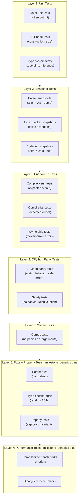

# Sifr Compiler -- Architecture

## Vision

Sifr is a compiled programming language that uses Python syntax with enforced static typing. It compiles Python-like source code to Rust source code, which is then compiled by `rustc` into native binaries. Assignment uses move semantics (like Rust), while function parameters are borrow-by-default with opt-in `mut` (mutable borrow) and `own` (ownership transfer). Types are strict with an opt-in `Any` escape hatch (like TypeScript's strict mode).

The type system draws heavily from TypeScript's design: union and intersection types, literal types, and full control-flow-based type narrowing are first-class citizens. Unlike TypeScript (which erases types at runtime), sifr uses types to generate efficient Rust code -- union types become Rust enums, narrowing becomes `match` expressions, and literal types enable compile-time value checking.

The end goal is a language capable of building web applications and general-purpose programs -- anywhere Python is used today, but with native performance and compile-time safety.

## Safety Philosophy

Sifr's core guarantee: **if it compiles, it works.** The language is designed so that a successfully compiled program will not crash at runtime under normal conditions. This guarantee is **fully enforced from milestone_safe_indexing onward** -- earlier milestones use panic-based indexing as a bootstrap mechanism until `Option`/`Result` types are available. The principles are:

- **No panics in user code.** Sifr programs never panic during normal execution. Every operation that can fail returns `Result[T, E]` or `Option[T]`, forcing the caller to handle the failure case at compile time.
- **Mandatory error handling.** `Result` and `Option` values are `#[must_use]`. Ignoring a `Result` returned by a function is a **compile-time error**. The programmer must either handle the error (`match`, `try`/`except`), propagate it (`?`), or explicitly discard it (`let _ = ...`).
- **All fallible operations return `Result` or `Option`.** This includes:
  - Indexing (`x[i]` returns `Option[T]`)
  - Division (`a / b` returns `Result[T, DivisionError]` when the divisor is not provably non-zero)
  - Type conversions (`int(s)` where `s: str` returns `Result[int, ParseError]`)
  - File I/O, network, and all stdlib operations that can fail
  - Integer overflow (panics in debug, wraps in release -- matches Rust; opt-in checked mode deferred)
- `**assert` is the only panic.** The `assert` statement is a programmer invariant check -- it generates `panic!()` and is intentionally unrecoverable. It exists to catch programmer bugs (violated assumptions), not to handle runtime errors. It is the one escape hatch from the no-panic guarantee.
- **Panic = unrecoverable system failure.** Beyond `assert`, panics only occur from truly unrecoverable situations: stack overflow, double panic, or hardware failure. These are never part of normal control flow.
- **Exceptions are not errors.** Sifr does not use Python's exception model. There is no stack unwinding, no `try`/`except` for control flow. The `try`/`except` syntax is reinterpreted as pattern matching on `Result` values. `raise` is syntax sugar for returning `Err(...)`.

This philosophy means that a Sifr programmer who handles all `Result` and `Option` values (which the compiler enforces) can be confident their program will not crash at runtime.

## CPython Reference

Sifr uses the CPython source code (`/Users/yaseralnajjar/work/sifr/cpython`) as the **authoritative reference** for Python behavior. The goal is to match CPython's semantics for built-in functions, data structure methods, and standard library behavior -- but always through Sifr's safety lens.

### Reference Directory Mapping


| Sifr feature area                                                                   | CPython reference location                                              | Notes                                                                        |
| ----------------------------------------------------------------------------------- | ----------------------------------------------------------------------- | ---------------------------------------------------------------------------- |
| Built-in functions (`len`, `abs`, `min`, `max`, `sorted`, `zip`, `enumerate`, etc.) | `Python/bltinmodule.c`                                                  | Match behavior, but return `Result`/`Option` where CPython would raise/panic |
| `list` methods (`.append`, `.pop`, `.sort`, `.index`, etc.)                         | `Objects/listobject.c`                                                  | Match semantics, safe indexing returns `Option`                              |
| `dict` methods (`.keys`, `.values`, `.get`, `.pop`, etc.)                           | `Objects/dictobject.c`                                                  | Match semantics, safe lookup returns `Option`                                |
| `str` methods (`.replace`, `.find`, `.split`, `.join`, etc.)                        | `Objects/unicodeobject.c`                                               | Match behavior, UTF-8 safe, character-based indexing                         |
| `tuple`                                                                             | `Objects/tupleobject.c`                                                 | Immutable, compile-time enforced                                             |
| `set` / `frozenset`                                                                 | `Objects/setobject.c`                                                   | Match operations, `frozenset` immutability enforced at compile time          |
| `int` / `float` / `bool`                                                            | `Objects/longobject.c`, `Objects/floatobject.c`, `Objects/boolobject.c` | Checked arithmetic, safe conversions                                         |
| `bytes` / `bytearray`                                                               | `Objects/bytesobject.c`, `Objects/bytearrayobject.c`                    | Match API, safe encode/decode                                                |
| `range` / `slice`                                                                   | `Objects/rangeobject.c`, `Objects/sliceobject.c`                        | Match iteration and slicing behavior                                         |
| Iterators / generators                                                              | `Objects/iterobject.c`, `Objects/genobject.c`                           | Match protocol, `Option`-based `__next__`                                    |
| Standard library modules                                                            | `Lib/<module>.py`, `Modules/<module>module.c`                           | Match API surface, wrap Rust crates                                          |
| Test suite (behavioral reference)                                                   | `Lib/test/test_<module>.py`                                             | Use as specification for expected behavior                                   |


### Safety Adaptation Rules

When adapting CPython behavior to Sifr, apply these rules:

1. **Where CPython raises an exception, Sifr returns `Result[T, E]`.** Example: `int("abc")` raises `ValueError` in CPython; in Sifr it returns `Result[int, ParseError]`.
2. **Where CPython raises `IndexError`, Sifr returns `Option[T]`.** Example: `list[99]` raises `IndexError` in CPython; in Sifr it returns `None`.
3. **Where CPython raises `KeyError`, Sifr returns `Option[V]`.** Example: `dict["missing"]` raises `KeyError` in CPython; in Sifr it returns `None`.
4. **Where CPython silently overflows or wraps, Sifr uses Rust's default behavior.** Example: large integer arithmetic in CPython uses arbitrary precision; Sifr uses `i64` arithmetic that panics on overflow in debug mode and wraps in release mode (matching Rust). An opt-in checked mode returning `Result[int, OverflowError]` is a future enhancement.
5. **Where CPython allows mutation on immutable types at runtime, Sifr rejects at compile time.** Example: `tuple[0] = 1` raises `TypeError` at runtime in CPython; in Sifr it is a compile-time error.
6. **Where CPython behavior is undefined or platform-dependent, Sifr defines explicit behavior.** Document any deviations from CPython in the milestone's notes.

### Safety Testing Contract

Every milestone that implements built-in functions, data structure methods, or stdlib modules must include a **safety test layer** that verifies:

1. **Behavioral parity with CPython:** for each function/method, write tests that match CPython's expected output for valid inputs. Use `Lib/test/test_<module>.py` as the specification.
2. **Safe error handling:** for each CPython operation that raises an exception, verify that Sifr returns the correct `Result::Err` or `Option::None` instead.
3. **No panics on any input:** fuzz or property-test each function/method to ensure it never panics, regardless of input. The only acceptable panic is from `assert` statements.
4. **Compile-time rejection of unsafe patterns:** verify that operations CPython rejects at runtime (e.g., mutating a tuple, unhashable dict key) are caught at compile time in Sifr.

This safety test layer is tracked in each milestone's Definition of Done as: **"CPython parity tests pass with safe error handling (no panics, Result/Option where CPython raises)"**.

## Python Divergences

Sifr intentionally diverges from CPython in several areas to achieve compile-time safety. This table documents each divergence, its rationale, and the milestone where it is introduced.


| Python Behavior                                        | Sifr Behavior                                                                                                        | Rationale                                                                                 | Milestone                                      |
| ------------------------------------------------------ | -------------------------------------------------------------------------------------------------------------------- | ----------------------------------------------------------------------------------------- | ---------------------------------------------- |
| Exceptions for error handling (`try`/`except`/`raise`) | `Result[T, E]` and `Option[T]` with mandatory handling; `try`/`except` reinterpreted as pattern matching on `Result` | Compile-time error handling eliminates unhandled exceptions at runtime                    | milestone_error_handling                       |
| `IndexError` on out-of-bounds access                   | `x[i]` returns `Option[T]` (no panic)                                                                                | Safe indexing -- no runtime crashes from bad indices                                      | milestone_safe_indexing                        |
| `KeyError` on missing dict key                         | `d[key]` returns `Option[V]` (no panic)                                                                              | Safe access -- caller must handle missing keys                                            | milestone_safe_indexing                        |
| Arbitrary-precision integers                           | `i64` arithmetic; overflow panics in debug, wraps in release (matches Rust)                                          | Predictable performance; matches Rust's default behavior                                  | milestone_error_handling                       |
| Import-time side effects (`__init__.py` runs code)     | `__init__.sifr` defines exported API only; no side effects on import                                                 | Deterministic, safe module loading                                                        | milestone_imports                              |
| Mutable default arguments (`def f(x=[])`)              | Default values are evaluated fresh each call (no shared mutable state)                                               | Eliminates a common Python footgun                                                        | milestone_ergonomics                           |
| Augmented assignment on immutables                     | Augmented assignment (`+=`) on immutable types (tuple, frozenset) is a compile-time error                            | Compile-time enforcement of immutability                                                  | milestone_ergonomics                           |
| `global` / `nonlocal` keywords                         | Not supported; use closures (milestone_generics) or pass values explicitly                                           | Encourages explicit data flow; avoids hidden state mutation                               | --                                             |
| Metaclasses (`type()`, `__metaclass__`)                | Not supported; use decorators (milestone_metaprogramming) and protocols (milestone_protocols) instead                | Simplification -- metaclasses add complexity with limited benefit in a compiled language  | --                                             |
| `__slots__`                                            | Not needed; all classes compile to Rust structs (already memory-efficient)                                           | Rust structs are fixed-layout by default                                                  | --                                             |
| Runtime duck typing                                    | Structural typing via Protocols (compile-time checked)                                                               | Same flexibility as duck typing but errors caught at compile time                         | milestone_protocols                            |
| `finally` for cleanup                                  | Supported in milestone_error_handling; prefer `with` statement (milestone_generators) which maps to Rust `Drop`      | Scope-based cleanup is more idiomatic and less error-prone                                | milestone_error_handling, milestone_generators |
| `del x` (name unbinding)                               | Not supported; variables are dropped at scope end (Rust RAII)                                                        | Explicit lifetime management is handled by the compiler; manual unbinding adds complexity | --                                             |
| `getattr`/`setattr`/`hasattr`/`delattr` (reflection)   | Not supported; use protocols (milestone_protocols) for dynamic dispatch, pattern matching for type inspection        | Compile-time type safety; runtime reflection undermines static guarantees                 | --                                             |
| `type()` for runtime type creation                     | Not supported; use class definitions (compile-time only)                                                             | All types must be known at compile time for Rust codegen                                  | --                                             |
| Positional-only parameters (`def f(x, /, y)`)          | Deferred to milestone_metaprogramming (metaprogramming); not commonly needed in user code                            | Low priority; most APIs use keyword arguments                                             | milestone_metaprogramming                      |


**Migration note:** code that relies heavily on exception propagation, import-time side effects, arbitrary-precision integers, or runtime reflection will require redesign when porting to Sifr. The compiler provides clear diagnostics for each divergence.

## Compiler Pipeline


## Crate Structure (Rust Workspace)

**Hybrid dependency approach:** Infrastructure crates are referenced as git dependencies from ruff v0.4.10 (unmodified). Parser and AST crates are vendored forks that may diverge from Python syntax in future milestones.

```
sifr/
  Cargo.toml                (workspace root)
  crates/
    sifr_python_ast/        (vendored fork of ruff_python_ast -- may diverge for sifr syntax)
    sifr_python_parser/     (vendored fork of ruff_python_parser -- may diverge for sifr syntax)
    sifr_hir/               (High-level IR: typed AST after name resolution + type checking)
    sifr_type_system/       (type definitions, inference, checking, subtyping)
    sifr_codegen/           (Rust source code generation from HIR)
    sifr_driver/            (orchestrates the pipeline, error reporting)
    sifr/                   (CLI binary: sifr build, sifr check, sifr run)

  # Git dependencies from ruff v0.4.10 (not vendored):
  #   ruff_text_size          -- text span/range utilities
  #   ruff_source_file        -- source file representation, line indexing
  #   ruff_python_trivia      -- whitespace/comment handling
  #   ruff_python_literal     -- literal parsing (string escapes, number formats)
```

New crates added per milestone as needed:

- milestone_core_stdlib/milestone_ext_collections: `sifr_std` (standard library wrappers, extended collections)
- milestone_ffi: FFI codegen extensions in `sifr_codegen`
- milestone_dev_tooling: `sifr_lsp` (language server), `sifr_fmt` (formatter), `sifr_lint` (linter)
- milestone_ecosystem: `sifr_registry` (package registry client)

---

## Cross-cutting Contracts

These are design decisions that span multiple milestones. They must be resolved early to prevent milestones from diverging and breaking each other.

### 1. Runtime Type Representation

Union types, `Unknown`, and class instances all need a coherent runtime representation in generated Rust code. This contract ensures milestone_type_system/milestone_classes/milestone_protocols/milestone_generics produce compatible code.

**Contract:**

- **Primitive unions** (`int | str`): generate Rust `enum` with one variant per member type. The enum name is deterministic from the sorted member types (e.g., `IntOrStr`). Narrowing via `isinstance` generates `match` arms.
- **Optional types** (`T | None`): generate Rust `Option<T>`. Narrowing via `is not None` generates `if let Some(x) = x`.
- **Class unions** (`Circle | Square`, milestone_classes/milestone_protocols): generate Rust `enum` with one variant per class. Discriminated union narrowing via tag field generates `match` on the tag.
- `**Unknown` type**: generates `Box<dyn std::any::Any>` in Rust. The compiler enforces that every use site is guarded by a narrowing check (`isinstance`, equality, etc.) before any operation. At runtime, `downcast_ref::<T>()` is used after narrowing. This is the only type that requires runtime type information (RTTI).
- `**Any` type**: generates the same `Box<dyn Any>` but the compiler does NOT enforce narrowing. This is the escape hatch.
- **Generics** (milestone_generics): monomorphized at compile time (like Rust). No runtime type erasure for generic types. `list[int]` generates `Vec<i64>`, not `Vec<Box<dyn Any>>`.
- **Protocol/trait objects** (milestone_protocols): when a protocol is used as a type (not just a bound), generate `Box<dyn Trait>` with vtable dispatch. This is the only case of dynamic dispatch besides `Unknown`/`Any`.

**Invariant:** Every `Type` variant must have exactly one Rust representation. The `rust_type()` method on `Type` is the single source of truth for this mapping.

### 2. Borrow and Lifetime Strategy

Sifr uses **borrow-by-default** semantics for function parameters. Move-type arguments are immutably borrowed (`&T`) unless the programmer opts in to mutable borrowing (`mut`) or ownership transfer (`own`). Copy types (`int`, `float`, `bool`) always pass by value. This eliminates "use-after-move" friction for the common case while keeping ownership explicit where it matters.

**Contract:**

- **Function arguments:** borrow by default (immutable). The compiler emits `&T` for Move-type parameters. Use `mut` keyword for mutable borrowing (`mut x: list[int]` generates `x: &mut Vec<i64>`). Use `own` keyword for ownership transfer (`own x: list[int]` generates `x: Vec<i64>`). Copy types (`int`, `float`, `bool`) always pass by value regardless of annotation.
- **Method receivers:** auto-borrow based on method body analysis:
  - If the method only reads `self` fields: `&self`
  - If the method mutates `self` fields: `&mut self`
  - If the method consumes `self` (e.g., builder pattern): `self` (move)
  - Self inference is unchanged by borrow-by-default (it already uses body analysis)
- **Closure captures (milestone_generics):** inferred from usage inside the closure body:
  - Read-only access: capture by `&T`
  - Mutation: capture by `&mut T`
  - Move into closure: capture by value (when the closure outlives the variable's scope, or when explicitly requested with `move` keyword)
- **Temporary lifetimes:** temporaries created in expressions live until the end of the enclosing statement. Method chains like `x.upper().split(",")` work without explicit borrows.
- **Escape analysis:** the compiler tracks whether a reference escapes its scope. If it does, the compiler emits a diagnostic rather than silently cloning. The programmer must choose: clone explicitly, or restructure to avoid the escape.
- **No lifetime annotations in user code:** Sifr does not expose Rust's `'a` lifetime syntax. The compiler infers lifetimes using the rules above. If inference fails, the compiler emits a clear error suggesting `.clone()` or restructuring.
- **Shared mutable state requires explicit opt-in:** the compiler does NOT auto-wrap shared data in `RefCell` or `Mutex`. If multiple variables reference the same mutable data, the programmer must use explicit sharing primitives (deferred to post-milestone_protocols). Default behavior is borrow-by-default with explicit `mut`/`own` for mutable borrowing and ownership transfer. This keeps ownership rules predictable and avoids hidden runtime borrow panics.

**Milestone responsibilities:**

- milestone_classes: implement method receiver inference (`&self` / `&mut self` / `self`)
- milestone_borrow_default: implement ParamConvention and borrow-by-default codegen
- milestone_borrow_hardening: implement exclusivity checking and error diagnostics
- milestone_generics: implement closure capture inference
- milestone_async: implement async capture rules (closures sent across `.await` points must be `Send + 'static`)
- Post-milestone_protocols: evaluate explicit shared mutable abstractions (e.g., `Shared[T]` mapping to `Rc<RefCell<T>>`)

### 3. Error Semantics Matrix

Sifr replaces Python's exception model with Rust's `Result`/`Option` model (milestone_error_handling). This contract defines how errors behave across different contexts. **All fallible operations return `Result` or `Option`; the compiler enforces handling via `#[must_use]`.**

**Contract:**


| Context                          | Error mechanism                   | Propagation                             | Codegen                                                    |
| -------------------------------- | --------------------------------- | --------------------------------------- | ---------------------------------------------------------- |
| Sync function                    | `Result[T, E]` return             | `?` operator or explicit `match`        | `Result<T, E>`                                             |
| Async function (milestone_async) | `Result[T, E]` return             | `?` operator (works across `.await`)    | `Result<T, E>`                                             |
| `try`/`except` block             | Pattern match on `Result`         | `except` arms match error variants      | `match result { Ok(v) => ..., Err(e) => match e { ... } }` |
| Indexing                         | `Option[T]` return                | `?` or `match`                          | `.get(i).cloned()` / `.chars().nth(i)`                     |
| Division                         | `Result[T, DivisionError]`        | `?` or `match`                          | Checked division with zero-check                           |
| Integer overflow                 | Panic in debug, wrap in release   | N/A (matches Rust default behavior)     | Default Rust arithmetic (opt-in checked mode deferred)     |
| Type conversion                  | `Result[T, ParseError]`           | `?` or `match`                          | `.parse::<T>()`                                            |
| Unused `Result`                  | **Compile-time error**            | Must handle or `let _ = ...` to discard | `#[must_use]` attribute on `Result`                        |
| Rust FFI (milestone_ffi)         | Rust panics caught at boundary    | `catch_unwind` at Rust FFI entry points | Panic -> `Result::Err` conversion                          |
| C FFI (milestone_ffi)            | Crashes are non-recoverable       | Safe wrappers validate inputs           | Process terminates on segfault/abort                       |
| `assert` statement               | Panic (programmer invariant only) | Not catchable                           | `assert!()` or `panic!()`                                  |
| Main function                    | `Result` printed as exit code     | Non-zero exit on `Err`                  | `fn main() -> Result<(), Box<dyn Error>>`                  |


`**except` arm matching semantics:**

```python
try:
    result = parse_int(s)?
except ValueError as e:
    print(f"Bad value: {e}")
except IOError as e:
    print(f"IO failed: {e}")
```

This generates:

```rust
match parse_int(s) {
    Ok(result) => { /* ... */ }
    Err(e) => match e {
        AppError::ValueError(e) => { println!("Bad value: {}", e); }
        AppError::IOError(e) => { println!("IO failed: {}", e); }
    }
}
```

**Typed error hierarchies:** Error types are classes (milestone_classes) that implement an `Error` protocol. The `raise` keyword maps to `Err(ErrorType::new(...))`. Error types compose via union: `Result[int, ValueError | IOError]`.

### 4. Package Resolver and Reproducibility (milestone_imports/milestone_package_mgmt)

This contract is split across two milestones: milestone_imports (multi-file compilation and imports) and milestone_package_mgmt (package management with dependency resolution). milestone_imports lands in the Language Foundations phase; milestone_package_mgmt lands in the Polish phase just before milestone_ecosystem.

**Contract (milestone_imports -- imports and modules):**

- **Import cycle detection:** the compiler builds a dependency graph of modules during compilation. Cycles are a compile-time error with a clear diagnostic showing the cycle path.
- `**__init__.sifr` semantics:** defines the public API of a package. Symbols not re-exported from `__init__.sifr` are private to the package. No side effects on import (unlike Python's `__init__.py`).
- **Import caching:** each module is compiled exactly once per compilation. The driver maintains a module cache keyed by canonical path.
- **Multi-file diagnostics:** error messages show correct source file and line numbers across module boundaries.

**Contract (milestone_package_mgmt -- package management):**

- `**sifr.toml`:** project manifest with `[dependencies]` section specifying version ranges (semver)
- `**sifr.lock`:** lockfile with exact resolved versions, content hashes (SHA-256), and source URLs. Committed to version control.
- **Version solver:** PubGrub-based solver (same algorithm as Cargo and uv). Resolves dependency graph with conflict detection.
- **Registry:** `sifr.dev` package registry (milestone_ecosystem). Before milestone_ecosystem, dependencies are git-only or path-only.

### 5. CI Quality Gates

**Contract for every PR:**

- `cargo test` passes (all layers: unit, snapshot, E2E, corpus)
- `cargo clippy -- -D warnings` passes
- No new `unsafe` blocks without explicit justification
- E2E pass tests compile generated Rust and verify runtime stdout
- E2E fail tests verify expected diagnostics

**Milestone-specific gates (added as milestones land):**

- milestone_ergonomics+: CPython parity tests -- verify behavioral match with CPython (`/Users/yaseralnajjar/work/sifr/cpython`) for all built-in functions, data structure methods, and stdlib modules, with safe error handling (no panics, `Result`/`Option` where CPython raises exceptions)
- milestone_generics+: benchmark suite with regression thresholds (compile time, binary size)
- milestone_core_stdlib+: stdlib wrapper tests (each module has integration tests against the underlying Rust crate)
- milestone_ecosystem: fuzz testing for parser and type checker (cargo-fuzz or afl)

### 6. Slice and Collection Semantics

Sifr uses Python-like slicing syntax, but must define whether slicing copies or creates a view. This affects performance expectations and ownership behavior.

**Contract:**

- **List slicing copies:** `list[a:b]` produces a new `list` (deep copy of elements). This matches Python semantics and avoids borrow complexity. Codegen: `vec[a..b].to_vec()`.
- **String slicing copies:** `str[a:b]` produces a new `str`. Indices are character positions (not byte offsets). Codegen: `s.chars().skip(a).take(b - a).collect::<String>()`.
- **Dict:** not sliceable. **Tuple:** compile-time slicing supported (milestone_ergonomics) -- the compiler can statically verify tuple slice bounds and produce a new tuple type.
- **Views deferred:** an explicit view API (e.g., `list.view(a, b)` mapping to `&[T]`) may be added in a later milestone for performance-critical paths. Not part of MVP.
- `**for` loop borrows:** `for item in collection` borrows the collection (does not consume it). The collection remains usable after the loop. Codegen: `for item in &collection` (immutable borrow). Explicit consumption via `for item in collection.consume()` or similar if ownership transfer is needed.

### 7. String Semantics (UTF-8)

Sifr's `str` maps to Rust `String` (UTF-8). String indexing and length must be defined carefully because UTF-8 is variable-width.

**Contract (safe indexing -- no panics):**

- `**s[i]`:** returns `Option[str]` -- the i-th character (Unicode code point) as a single-character `str`, or `None` if out-of-bounds. Codegen: `s.chars().nth(i).map(|c| c.to_string())`. This is O(n), not O(1).
- `**list[i]`:** returns `Option[T]` -- the i-th element, or `None` if out-of-bounds. Codegen: `vec.get(i).cloned()`. This is O(1).
- `**s.len()`:** returns the number of Unicode code points (not bytes). Codegen: `s.chars().count()`. This is O(n).
- `**s.byte_len()`:** returns the number of bytes (O(1)). Codegen: `s.len()`.
- `**s[a:b]`:** returns characters from position `a` to `b` (exclusive). Codegen: `s.chars().skip(a).take(b - a).collect::<String>()`. Returns empty string if indices are out of range.
- **String literals:** type is `str`, stored as `String` in generated Rust.
- **Complexity documentation:** the compiler should emit a note when string indexing is used in a loop, suggesting `.chars()` iteration instead for performance.
- **Global indexing contract:** all indexable types (`str`, `list`, `dict`) use safe indexing. `x[i]` returns `Option[T]`, never panics. This is enforced uniformly across the language.

### 8. Concurrency Safety

Sifr must define which types can cross thread/task boundaries. This extends the async capture rules in contract #2 to cover all concurrency scenarios.

**Contract:**

- **Auto-derived Send/Sync:** Sifr types are `Send` and `Sync` when all their fields are `Send` and `Sync` (matches Rust's auto-derivation). The compiler tracks this automatically.
- **Spawn boundaries are checked:** when a value is sent to a spawned task (`sifr.task.spawn`) or thread, the compiler verifies the value is `Send`. If not, it emits a clear error explaining which field is not sendable.
- **No silent upgrades:** the compiler does NOT auto-upgrade `Rc` to `Arc` or `RefCell` to `Mutex`. If a non-sendable type is used across a task boundary, the programmer must fix it explicitly.
- **Shared mutable state across tasks:** requires explicit primitives (deferred to milestone_async). The compiler rejects sharing mutable references across task boundaries without synchronization.
- **Single-threaded by default:** code that does not use `async` or `spawn` has no concurrency overhead. `Rc` and `RefCell` are used internally only when appropriate for single-threaded code.

**Milestone responsibilities:**

- milestone_async: implement Send/Sync checking at spawn boundaries
- milestone_async: provide `sifr.sync.Lock` (maps to `Arc<Mutex<T>>`) and `sifr.sync.Channel` for explicit cross-task sharing

### 9. Destruction and Cleanup Semantics

Sifr compiles to Rust, which has deterministic destruction (RAII). This contract defines when and how values are cleaned up.

**Contract:**

- **Scope-end destruction:** values are dropped at the end of their enclosing scope, in reverse declaration order. This matches Rust's `Drop` semantics and is deterministic (unlike Python's GC).
- **Move invalidates source:** when a value is moved (assigned to another variable, or passed to a function via `own` parameter), the source is invalidated. Accessing it after move is a compile-time error. Note: default function parameters borrow (`&T`), so passing a value to a function does NOT move it unless the parameter is marked `own`.
- **Partial moves:** when a struct field is moved out, the entire struct becomes partially invalid. The compiler tracks which fields are still valid.
- **User-defined destructors deferred:** Sifr does NOT expose `__del__` or custom destructors in MVP. The compiler auto-generates `Drop` for types that hold resources (file handles, connections) via stdlib wrappers.
- **Explicit cleanup via `with`:** for resource management (files, connections), use `with` blocks that map to Rust's scoped resource patterns. The resource is cleaned up when the `with` block exits. The `with` statement calls `__enter__()` at scope start and `__exit__()` at scope end, with compile-time enforcement of the `ContextManager` protocol.
- **Destructor failure:** auto-generated destructors do not fail. If an underlying Rust `Drop` implementation panics (only possible via FFI-wrapped types), the program aborts. This is a system-level failure, not a Sifr-level concern -- Sifr user code cannot trigger destructor panics.

**Milestone responsibilities:**

- milestone_generators: define initial `with` block syntax (scoped block desugaring)
- milestone_compiler_hardening (Phase 7: Stdlib Parity): complete the `with` statement with full `ContextManager` protocol enforcement (`__enter__`/`__exit__` calls, multiple context managers, compile-time protocol checking)
- milestone_classes: implement scope-end destruction for class instances
- milestone_core_stdlib: implement `with` blocks for file handles and other stdlib resources

### 10. Auto-Derived Traits

Sifr auto-derives common Rust traits for all user-defined types. This is a language contract, not an implementation detail.

**Contract:**

- **Always derived (when valid):**
  - `Debug` -- enables `print()` and `repr()` for all types. Derived for all structs and enums.
  - `Clone` -- enables `.clone()`. Derived when all fields implement `Clone`.
  - `PartialEq` -- enables `==` and `!=`. Derived when all fields implement `PartialEq`.
- **Conditionally derived:**
  - `Eq` -- derived when `PartialEq` is derived AND no fields are `float` (since `f64` is not `Eq` in Rust due to `NaN`).
  - `Hash` -- derived when `Eq` is derived AND all fields implement `Hash`. NOT derived for types containing `float`, `dict`, or other unhashable types.
- **Not auto-derived (require explicit opt-in):**
  - `Ord` / `PartialOrd` -- comparison ordering requires explicit definition via `__lt__`, `__le__`, etc.
  - `Copy` -- only primitives (`int`, `float`, `bool`) are `Copy`. User-defined types are move-by-default.
- **Codegen:** the compiler emits `#[derive(Debug, Clone, PartialEq)]` (and conditionally `Eq`, `Hash`) on all generated structs and enums.
- **Dict key constraint:** types used as `dict` keys must be `Hash + Eq`. The compiler enforces this at the call site and emits a clear error if the type is not hashable.

### 11. Diagnostic Mapping

Sifr compiles to Rust source code, which is then compiled by `rustc`. This creates a two-stage compilation where errors can originate from either the Sifr compiler or `rustc`. This contract defines how diagnostics are attributed, mapped, and rendered.

**Contract:**

- **Stable Sifr diagnostic codes:** every Sifr compiler diagnostic has a stable code (e.g., `S0001: type-mismatch`, `S0002: move-after-use`, `S0003: unused-variable`). Each code is owned by a specific compiler phase (parser, type checker, borrow checker, codegen).
- **Span mapping:** the codegen phase maintains a mapping from generated Rust line/column positions to original `.sifr` line/column positions. All compiler errors shown to users reference `.sifr` source locations, never generated Rust locations.
- `**rustc` error translation:** when `rustc` emits an error on generated code, the driver translates it back to `.sifr` coordinates using the span map. If translation fails (e.g., error in compiler-generated boilerplate), the raw `rustc` error is shown with a note: "This error originated in the Rust compilation step."
- **Suppression policy:** `rustc` warnings on generated code are suppressed by default (generated code includes `#[allow(warnings)]`). Only `rustc` errors are surfaced to the user.
- **Multi-file rendering:** errors that span multiple `.sifr` files show each file's relevant snippet with labeled spans. Uses `miette` or `ariadne` for rich terminal rendering with colors, underlines, and related notes.
- **Diagnostic ownership:** the Sifr compiler should catch as many errors as possible before invoking `rustc`. Over time, the set of errors that reach `rustc` should shrink to near-zero as the type checker and borrow checker mature.

**Milestone responsibilities:**

- milestone_core_language-milestone_type_system: basic span tracking (single-file, Sifr-native errors only)
- milestone_imports: multi-file span tracking (import errors reference both files)
- milestone_ffi: FFI-related `rustc` error translation (extern crate mismatches)
- milestone_dev_tooling: LSP diagnostic integration (real-time diagnostics in editor)

### 12. Standard Protocol Primitives

Sifr defines a set of built-in protocols (traits) that are used across multiple milestones. This contract formalizes when each becomes available and what it maps to in Rust.

**Contract:**


| Protocol         | Rust Trait                                      | Available From                                                                      | Purpose                                                       |
| ---------------- | ----------------------------------------------- | ----------------------------------------------------------------------------------- | ------------------------------------------------------------- |
| `Comparable`     | `Ord` (+ `PartialOrd`, `Eq`, `PartialEq`)       | milestone_protocols (defined), milestone_generics (usable as bound)                 | Ordering for `sort()`, `min()`, `max()`, comparison operators |
| `Addable`        | `Add` (+ `Sum` for `sum()`)                     | milestone_protocols (defined), milestone_generics (usable as bound)                 | Arithmetic `+` operator, `sum()` built-in                     |
| `Display`        | `std::fmt::Display`                             | milestone_classes (auto-derived for `__str__`), milestone_protocols (explicit impl) | String representation via `str()`, f-strings, `print()`       |
| `ContextManager` | Custom trait (`__enter__`/`__exit__` -> `Drop`) | milestone_generators (syntax), milestone_compiler_hardening (protocol enforcement)  | `with` statement resource management                          |
| `Iterator`       | `Iterator`                                      | milestone_generics (defined), milestone_generators (yield-based)                    | `for` loops, comprehensions, generator expressions            |
| `Hashable`       | `Hash` (+ `Eq`)                                 | milestone_classes (auto-derived)                                                    | Dict keys, set membership                                     |


**Semantics:**

- **Auto-derived protocols:** `Display`, `Hashable`, `Comparable` are auto-derived for classes where all fields implement the corresponding Rust trait (see contract #10: Auto-Derived Traits). Users can override with explicit `__str__`, `__hash__`, `__lt__` etc.
- **Pre-generics usage:** Before milestone_generics, protocols are used for operator overloading and dynamic dispatch (`&dyn Trait`). After milestone_generics, they become usable as generic bounds (`T: Comparable`).
- **Primitive types:** `int`, `float`, `str`, `bool` implement all applicable protocols from the start. `float` does NOT implement `Comparable` (because `NaN` violates total ordering) -- this is a compile-time error, matching Rust's `f64` not implementing `Ord`.
- **Protocol composition:** a function can require multiple protocols via intersection bounds (milestone_generics): `def process[T: Comparable & Display](item: T)`.

**Milestone responsibilities:**

- milestone_classes: auto-derive `Display` and `Hashable` for classes with eligible fields
- milestone_protocols: define `Comparable`, `Addable`, `Display` as explicit protocols; enable operator overloading via protocol impl
- milestone_generics: enable protocols as generic bounds (`T: Comparable`); define `Iterator` protocol
- milestone_generators: define initial `with` block syntax (scoped block desugaring)
- milestone_compiler_hardening (Phase 7: Stdlib Parity): define `ContextManager` protocol; enforce `with` statement compliance with `__enter__`/`__exit__` calls and compile-time protocol checking

### Ecosystem Strategy

Sifr's standard library follows a **thin wrapper + FFI** strategy:

- **Thin wrappers (milestone_protocols-milestone_data_processing):** The stdlib provides Pythonic APIs over best-in-class Rust crates. The sifr compiler generates Cargo dependencies automatically. Users write Python-like code; the generated Rust uses `axum`, `polars`, `sqlx`, `tokio`, etc. directly.
- **Rust FFI (milestone_ffi):** For crates not yet wrapped, users can import Rust crates directly via FFI. This is the escape hatch that gives Sifr access to the entire Rust ecosystem (50,000+ crates on crates.io).
- **Package ecosystem (milestone_ecosystem):** A package registry (`sifr.dev`) for sharing and reusing Sifr code, with incremental compilation for fast iteration.
- **No reinventing:** Sifr never reimplements what Rust already has. Every stdlib module wraps a proven Rust crate.

---

## Type System Design

### Core Types (Full)

```rust
enum Type {
    // Primitives (Copy)
    Int,
    Float,
    Bool,
    Str,
    None,

    // Compound (Move)
    List(Box<Type>),
    Dict(Box<Type>, Box<Type>),
    Tuple(Vec<Type>),
    Set(Box<Type>),

    // Literal types (Copy) -- specific values as types (milestone_type_system)
    LiteralInt(i64),
    LiteralStr(String),
    LiteralBool(bool),

    // Union / Intersection (milestone_type_system)
    Union(Vec<Type>),           // int | str -- flattened, deduplicated
    Intersection(Vec<Type>),    // internal only, for narrowing engine

    // Type alias (milestone_type_system)
    Alias(String, Box<Type>),   // type HttpMethod = "GET" | "POST"

    // Function
    Function(FunctionType),

    // Class instance (milestone_classes)
    Instance(ClassId),

    // Generics (milestone_generics)
    TypeVar(TypeVarId),
    GenericInstance(ClassId, Vec<Type>),

    // Result / Option (milestone_error_handling)
    Result(Box<Type>, Box<Type>),

    // Range (milestone_control_flow)
    Range,

    // Safe top type: must be narrowed before use (milestone_type_system)
    Unknown,

    // Escape hatch: opts out of type checking
    Any,

    // Bottom
    Never,
}
```

### Literal Type Behavior (TypeScript-inspired)

Literal types represent specific values at the type level. In sifr, values are used directly as types in type position (TypeScript style), avoiding Python's verbose `Literal[...]` wrapper:

```python
type HttpMethod = "GET" | "POST" | "PUT"    # not Literal["GET"] | Literal["POST"] | ...
type StatusCode = 200 | 404 | 500
x: "hello" = "hello"                        # literal type annotation
```

Key behaviors:

- **Fresh literals widen at mutable locations:** `x = 42` infers `x: int` (widened), but `x: 42 = 42` preserves the literal type
- **Literal types are subtypes of their base type:** `42` is assignable to `int`, `"GET"` is assignable to `str`
- **Equality narrows to literals:** `if x == "GET":` narrows `x: str` to `x: "GET"` in the then-branch
- **Union of literals:** `"GET" | "POST"` is a valid type representing exactly two string values

### Union Type Behavior

- **Flattened:** `Union(vec![Union(vec![A, B]), C])` normalizes to `Union(vec![A, B, C])`
- **Deduplicated:** `Union(vec![Int, Int, Str])` normalizes to `Union(vec![Int, Str])`
- **Single-element unions collapse:** `Union(vec![Int])` becomes `Int`
- **Subtyping:** `A` is assignable to `A | B`; `A | B` is assignable to `C` only if both `A` and `C` and `B` and `C` are assignable
- **Codegen:** `int | str` generates a Rust enum `enum IntOrStr { Int(i64), Str(String) }`

### Type Narrowing (TypeScript-inspired, milestone_type_system)

Narrowing refines a variable's type within a control flow branch:

- **Truthiness:** `if x:` removes `None` and falsy types from unions
- **isinstance:** `if isinstance(x, int):` narrows `x: int | str` to `x: int`
- **Equality:** `if x == "GET":` narrows to literal type
- **is None / is not None:** narrows optional types
- **Type predicates:** `def is_str(x: int | str) -> TypeGuard[str]:` enables user-defined narrowing
- **Assertion functions:** `def assert_int(x: int | str) -> AssertType[int]:` narrows after call
- **Exhaustiveness:** after narrowing all variants of a union, the remaining type is `Never` -- compiler error if not exhaustive

### Ownership Model

- All types are **move by default** for assignment (like Rust)
- Primitive types (`int`, `float`, `bool`) are `Copy` -- assignment copies
- Compound types (`str`, `list`, `dict`, classes) **move** on assignment
- Explicit `.clone()` for deep copy
- Function arguments: **borrow by default** (maps to `&T` for Move types)
- Mutable borrow via `mut` keyword on parameters (maps to `&mut T`)
- Ownership transfer via `own` keyword on parameters (maps to `T`)
- Explicit `.clone()` for deep copy when returning or storing borrowed values

### Type Inference Strategy

- **Initializer inference:** `x = 42` infers `x: int` (literal widens to base type)
- **Return type inference:** analyze all return paths
- **Contextual typing (milestone_generics):** lambda/callback parameter types inferred from call-site context. E.g., `map_list(numbers, lambda x: x * 2)` infers `x: int` from the `list[int]` argument. Inspired by TypeScript's contextual typing which looks upward in the tree for type annotations.
- **Enforced annotations:** function parameters MUST have types (or be inferable from defaults)
- **Literal preservation:** `x: "GET" = "GET"` preserves the literal type; `x = "GET"` widens to `str`
- **Empty collection inference:** `x = []` and `x = {}` are compile-time errors -- the element type cannot be inferred. Users must annotate: `x: list[int] = []`, `x: dict[str, int] = {}`. This prevents accidental `list[Unknown]` and matches Rust's requirement for explicit types on empty collections.

---

## Test Suite Architecture

This compiler is built entirely by AI agents. The test suite is the contract that ensures correctness across all agents working on different parts of the compiler. It must be:

- **Deterministic:** same input always produces same output
- **Self-documenting:** test files are readable specifications of language behavior
- **Layered:** each compiler phase has its own test layer
- **Easy to extend:** adding a new language feature means adding test files, not modifying test infrastructure
- **Fast to run:** `cargo test` completes in seconds for the full suite

### Testing Strategy Overview



### Layer 1: Unit Tests (per crate, `#[cfg(test)]`)

Standard Rust unit tests inside each crate. These test individual functions and data structures.

**Where:** `src/*.rs` in each crate, in `#[cfg(test)] mod tests { }` blocks.

**Examples:**

- Lexer: tokenize a string, assert token sequence
- AST: construct nodes, verify `Debug` output, check memory layout sizes
- Type system: `is_subtype(Int, Int) == true`, `is_subtype(Int, Str) == false`
- HIR: name resolution resolves `x` to the correct `DefId`

**Pattern (from ruff_python_ast):**

```rust
#[test]
fn size() {
    assert!(std::mem::size_of::<Stmt>() <= 120);
    assert_eq!(std::mem::size_of::<Expr>(), 64);
}
```

### Layer 2: Snapshot Tests (insta crate)

Snapshot testing using the `insta` crate. The compiler produces output that is compared against stored `.snap` files. When behavior changes intentionally, run `cargo insta review` to accept new baselines.

**Crate:** `insta` with `glob` feature.

#### 2a. Parser Snapshots

**Inspired by:** ruff_python_parser's fixture-driven snapshot tests.

**Directory structure:**

```
crates/sifr_python_parser/
  resources/
    valid/          # .sifr files that must parse successfully
    invalid/        # .sifr files that must produce parse errors
  tests/
    snapshots/      # auto-generated .snap files
    fixtures.rs     # test harness
```

#### 2b. Type Checker Snapshots (Markdown Tests)

**Inspired by:** ty's mdtest framework -- Markdown files with inline assertions.

**Assertion syntax:**

- `# revealed: <type>` -- assert inferred type (like ty)
- `# error: [rule-code] "optional message"` -- assert diagnostic
- `# error: <col> [rule-code]` -- assert diagnostic at specific column

#### 2c. Codegen Snapshots

**Inspired by:** TypeScript's `.js` baseline files. Compile `.sifr` to `.rs` and snapshot the output.

### Layer 3: End-to-End Tests (Compile + Run)

**Inspired by:** Mojo's Lit + FileCheck pattern, adapted for Rust.

These tests compile `.sifr` files to binaries, run them, and check stdout/stderr.

**Directory structure:**

```
tests/
  e2e/
    pass/           # must compile and produce expected output
    fail/           # must fail to compile with expected errors
    ownership/      # ownership-specific compile failures
  e2e.rs            # test runner
```

**Test file format (pass tests):**

```python
# expect-stdout: 120
def factorial(n: int) -> int:
    if n <= 1:
        return 1
    return n * factorial(n - 1)

def main():
    print(factorial(5))
```

**Test file format (fail tests):**

```python
# expect-error: [type-mismatch]
def main():
    x: int = "hello"
```

### Layer 4: CPython Parity and Safety Tests (milestone_ergonomics+)

Verify that Sifr's built-in functions, data structure methods, and stdlib modules match CPython's behavior -- but with safe error handling.

**Reference:** `/Users/yaseralnajjar/work/sifr/cpython` -- specifically `Lib/test/test_<module>.py` for expected behavior.

### Layer 5: Corpus Tests (Robustness)

Run the parser and type checker on a large body of Python source code to catch panics, infinite loops, and crashes. These tests don't check correctness -- only that the compiler doesn't blow up.

### Layer 6: Fuzz and Property Tests (milestone_generics+)

Discover edge cases and crashes that hand-written tests miss. Use `cargo-fuzz` or `afl` for parser/type checker fuzzing. Property tests verify algebraic invariants (union normalization idempotent, subtyping reflexive/transitive, narrowing preserves subtyping).

### Layer 7: Performance Regression Tests (milestone_generics+)

Prevent compile-time and binary-size regressions. Use `criterion` for statistical benchmarking. Regressions beyond threshold block PRs.

### Parser Fixture Migration Plan

The parser snapshot tests currently use `.py` fixtures inherited from ruff. These should be incrementally migrated to `.sifr` fixtures as the language diverges from Python. Start in milestone_error_handling when the first non-Python syntax is introduced. Complete by milestone_generics.

### Test Infrastructure Crate: `sifr_test_utils`

A shared crate providing test helpers: `extract_expect_stdout`, `extract_expect_errors`, `compile_to_rust`, `compile_and_run`, `parse_mdtest`.

### Test Commands

```bash
cargo test                                    # Run all tests (layers 1-3)
cargo test -p sifr_python_parser              # Parser snapshots
cargo test -p sifr_type_system -- mdtest      # Type checker markdown tests
cargo test -p sifr_codegen                    # Codegen snapshots
cargo test --test e2e                         # End-to-end tests
cargo insta review                            # Update snapshots after intentional changes
cargo test -- corpus --ignored                # Run corpus tests (slower, layer 4)
cargo fuzz run parser_fuzz -- -max_total_time=300  # Run fuzz tests (layer 5, milestone_generics+)
cargo bench                                   # Run benchmarks (layer 6, milestone_generics+)
```

### Adding Tests for New Features (Agent Workflow)

When an AI agent adds a new language feature, it must:

1. **Parser:** Add `.sifr` fixture files in `resources/valid/` and `resources/invalid/`
2. **Type checker:** Add markdown test cases in `resources/mdtest/`
3. **Codegen:** Add `.sifr` fixture files in `resources/codegen/`
4. **E2E:** Add pass/fail test files in `tests/e2e/`
5. **Run `cargo insta review`** to accept new snapshots
6. **Run `cargo test`** to verify everything passes

This ensures every feature is tested at every layer of the compiler, and any agent can verify the full system by running `cargo test`.

---

## Design Note: Mojo Comparison

Mojo (`/Users/yaseralnajjar/work/sifr/modular/mojo`) was evaluated as a reference. Key findings:

- **No Rust code to reuse.** Mojo's compiler is proprietary, built on MLIR/LLVM (C++). The open-source repo only contains the stdlib, docs, and design proposals.
- **Ownership model alignment:** Both Mojo and Sifr use **borrow-by-default** for function arguments. Sifr uses `mut` for mutable borrows and `own` for ownership transfer (Mojo uses `mut`/`owned`). Assignment still moves for heap types (preventing aliasing). This gives Python-like ergonomics with Rust-like safety.
- **Useful design references:** `proposals/value-ownership.md` and `proposals/lifetimes-and-provenance.md` document tradeoffs between move/borrow defaults, ASAP destruction, and lifecycle methods.
- `**def` vs `fn` split:** Mojo uses `def` for dynamic and `fn` for strict. Sifr does not need this split since all code is strictly typed.

## Key Files to Reference During Implementation

### Ruff (parser, AST)

- **Ruff parser:** `/Users/yaseralnajjar/work/sifr/ruff/crates/ruff_python_parser/`
- **Ruff AST:** `/Users/yaseralnajjar/work/sifr/ruff/crates/ruff_python_ast/src/nodes.rs`

### ty (type checker)

- **ty type system:** `/Users/yaseralnajjar/work/sifr/ty/ruff/crates/ty_python_semantic/src/types.rs`

### TypeScript (type system design, narrowing, control flow analysis)

- **Checker architecture:** `/Users/yaseralnajjar/work/sifr/TypeScript-Compiler-Notes/codebase/src/compiler/checker.md`
- **Type narrowing and widening:** `/Users/yaseralnajjar/work/sifr/TypeScript-Compiler-Notes/codebase/src/compiler/checker-widening-narrowing.md`
- **Type relations (subtyping, assignability):** `/Users/yaseralnajjar/work/sifr/TypeScript-Compiler-Notes/codebase/src/compiler/checker-relations.md`
- **Type inference:** `/Users/yaseralnajjar/work/sifr/TypeScript-Compiler-Notes/codebase/src/compiler/checker-inference.md`
- **Binder (control flow graph):** `/Users/yaseralnajjar/work/sifr/TypeScript-Compiler-Notes/codebase/src/compiler/binder.md`
- **Type definitions:** `/Users/yaseralnajjar/work/sifr/TypeScript-Compiler-Notes/codebase/src/compiler/types.md`
- **TypeScript wiki:** `/Users/yaseralnajjar/work/sifr/TypeScript.wiki/`

### Mojo (ownership model)

- **Mojo ownership design:** `/Users/yaseralnajjar/work/sifr/modular/mojo/proposals/value-ownership.md`
- **Mojo lifetimes design:** `/Users/yaseralnajjar/work/sifr/modular/mojo/proposals/lifetimes-and-provenance.md`
