# Sifr Compiler -- Roadmap

## Phase Summary

| # | Phase | Milestones | Status | What it unlocks |
|---|-------|-----------|--------|-----------------|
| 1 | Language Foundations | 6 (ergonomics → codegen_quality) | completed | Single-file programs with classes, error handling, safe indexing, imports |
| 2 | Type System Power | 6 (protocols → codegen_quality_v2) | completed | Generics, closures, generators, decorators, operator overloading |
| 3 | Standard Library | 4 (core_stdlib → codegen_quality_v3) | completed | 13 stdlib modules, test runner, extended collections |
| 4 | Language Hardening | 19 (codegen_fixes → ownership_v3) | completed | ~60% LeetCode compiles, nested functions, generics, forward refs |
| 5 | Borrow-by-Default | 2 (borrow_default, borrow_hardening) | pending | Borrow-by-default params, exclusivity, fearless concurrency foundation |
| 6 | Stdlib Architecture | 6 (intrinsics → stdlib_classes) | completed | Stdlib rewritten as .sifr files, 37+ modules, class-in-stdlib pipeline |
| 7 | Stdlib Parity | 6 (compiler_hardening → cpython_tests) | pending | Import error quality, `with` protocol, ~50 new functions, CPython-aligned names, 5 new classes, ~500 CPython test assertions |
| 8 | Ecosystem | 10 (async → data_processing) | pending | Web framework, database, auth, Redis, S3, email, data processing |
| 9 | Polish | 5 (metaprogramming → ecosystem) | pending | FFI, package management, LSP, formatter, REPL |

## Ordering Rationale

1. **Foundations → Type System Power**: Classes and error handling must exist before protocols
   and generics can define trait bounds and typed error hierarchies.

2. **Type System Power → Standard Library**: The full type system (generics, closures, decorators)
   is needed to design stdlib APIs with proper type signatures.

3. **Standard Library → Language Hardening**: Real-world usage (396 LeetCode problems + stdlib)
   exposed systemic gaps in codegen, narrowing, ownership, and iteration.

4. **Language Hardening → Borrow-by-Default**: The language must be fully stable before changing
   the default parameter passing convention — every function is affected.

5. **Borrow-by-Default → Stdlib Architecture**: Stdlib .sifr files must be written against the
   final borrow semantics. Retrofitting conventions after the fact would be wasteful.

6. **Stdlib Architecture → Stdlib Parity**: The three-tier architecture and class-in-stdlib
   pipeline must be proven before expanding the stdlib surface. Parity fixes compiler gaps
   (import errors, `with` protocol), adds test infrastructure, expands functions, aligns
   naming with CPython, rolls out 5 new classes, and ports ~500 CPython test assertions.

7. **Stdlib Parity → Ecosystem**: The async runtime, web framework, and all ecosystem
   milestones depend on a mature stdlib with both function and class APIs, CPython-compatible
   naming, proper `with` statement support, and validated behavior via CPython test assertions.

8. **Ecosystem → Polish**: Metaprogramming, FFI, package management, and tooling come after
   the language is functional for real-world use.

Per-milestone ordering rationale is documented within each phase file in `phases/`.

## Milestone Dependency Diagram

```mermaid
flowchart TD
    subgraph done [Completed]
        milestone_core_language["milestone_core_language: Core Language\nVariables, functions, if/else,\nprimitives, print, CLI"]
        milestone_control_flow["milestone_control_flow: Control Flow + Data\nLoops, list, dict, tuple,\nstring ops, indexing"]
        milestone_type_system["milestone_type_system: Advanced Type System\nUnion types, literal types,\ntype narrowing, Unknown"]
    end
    subgraph phase1 [Language Foundations]
        milestone_ergonomics["milestone_ergonomics: Language Ergonomics\nTernary, kwargs, augmented assign,\nmethods, slicing, walrus"]
        milestone_classes["milestone_classes: Basic Classes\nstruct + impl, __init__,\nmethods, auto-derive"]
        milestone_error_handling["milestone_error_handling: Error Handling\nResult/Option, ? operator,\ntry/except, typed errors"]
        milestone_safe_indexing["milestone_safe_indexing: Safe Indexing\nOption returns, del,\nfallible methods"]
        milestone_imports["milestone_imports: Multi-file + Imports\nimport/from, visibility,\ncircular detection"]
        milestone_codegen_quality["milestone_codegen_quality: Codegen Quality\nRemove unnecessary mut,\nidiomatic println/format,\nclean string/HashMap emit"]
    end
    subgraph phase2 [Type System Power]
        milestone_protocols["milestone_protocols: Protocols + Operators\nTraits, operator overload,\ndiscriminated unions, patterns"]
        milestone_inheritance["milestone_inheritance: Inheritance\nsuper, classmethod,\nstaticmethod, property"]
        milestone_generics["milestone_generics: Generics + Closures\nType params, lambdas,\ncomprehensions, iterators"]
        milestone_generators["milestone_generators: Generators + With\nyield, yield from,\ncontext managers"]
        milestone_decorators["milestone_decorators: Decorators + Variadics\nFunction wrapping,\n*args/**kwargs"]
    end
    subgraph phase3 [Standard Library]
        milestone_core_stdlib["milestone_core_stdlib: Core Stdlib\nI/O, JSON, env, os,\ntoml, collections, open"]
        milestone_test_runner["milestone_test_runner: Test Runner\nsifr test, assertions,\ndiscovery, parallel"]
        milestone_ext_collections["milestone_ext_collections: Extended Collections\nfrozenset, Counter,\ndefaultdict, bytes"]
        milestone_ext_stdlib["milestone_ext_stdlib: Extended Stdlib\nmath, time, random, regex,\nhashlib, base64, stream, logging"]
    end
    subgraph phaseHardening [Language Hardening]
        milestone_codegen_fixes["milestone_codegen_fixes: Codegen Fixes\nTuple indexing, union returns,\nint/int, print None, escapes"]
        milestone_narrowing_v2["milestone_narrowing_v2: Narrowing v2\nElif chains, early-return,\nand-narrowing, 3+ unions"]
        milestone_ownership_v2["milestone_ownership_v2: Ownership v2\nAuto-borrow for print,\nstop consuming values"]
        milestone_subscript_mutation["milestone_subscript_mutation: Subscript Mutation\nlist[i]=val, dict[key]=val,\nself.field += 1"]
        milestone_iteration_v2["milestone_iteration_v2: Iteration v2\nString/dict iteration,\ntuple unpack in for, dict comp"]
        milestone_builtins_v2["milestone_builtins_v2: Builtins v2\nmax/min 2-arg, range 3-arg,\nmixed arithmetic, module vars"]
        milestone_syntax_expansion["milestone_syntax_expansion: Syntax Expansion\nNested functions, closures,\nbitwise ops, multi-assign"]
        milestone_recursive_types["milestone_recursive_types: Recursive Types\nListNode, TreeNode,\nBox for self-referential"]
        milestone_inference_v2["milestone_inference_v2: Inference v2\nReturn type inference,\nparam inference, Result unwrap"]
        milestone_stdlib_hardening["milestone_stdlib_hardening: Stdlib Hardening\nset type, import aliases,\nmath/json/io/env gaps"]
        milestone_nested_functions["milestone_nested_functions: Nested Functions\ndef-inside-def, closures,\ncapture variables, recursive"]
        milestone_forward_refs["milestone_forward_refs: Forward Refs\nTwo-pass class registration,\nListNode, TreeNode, Node"]
        milestone_narrowing_v3["milestone_narrowing_v3: Narrowing v3\nEquality narrowing, field access,\nunion comparison, truthiness"]
        milestone_union_ops["milestone_union_ops: Union Ops\nArithmetic on T|None,\ndict.get, list concat"]
        milestone_subscript_v2["milestone_subscript_v2: Subscript v2\nNested subscript assign,\n&mut self, mutability"]
        milestone_comprehension_v2["milestone_comprehension_v2: Comprehension v2\nRange in comp, dict/set comp,\ntuple unpack in for"]
        milestone_generics_impl["milestone_generics_impl: Generics Impl\nTypeVar, generic fn/class,\nCallable, protocol bounds"]
        milestone_phase_fixes["milestone_phase_fixes: Phase Fixes\nProtocol dispatch, ctx mgr,\ncls calls, stdlib gaps"]
    end
    subgraph phaseBorrow [Borrow-by-Default]
        milestone_borrow_default["milestone_borrow_default: Borrow Default\nParamConvention enum,\nmut/own syntax, codegen"]
        milestone_borrow_hardening["milestone_borrow_hardening: Borrow Hardening\nExclusivity checks,\nerror messages, tests"]
    end
    subgraph phaseStdlibArch [Stdlib Architecture]
        milestone_intrinsics["milestone_intrinsics: Intrinsics Layer\n_sifr.* primitives, .sifr embedding,\ntwo-phase compilation"]
        milestone_stdlib_migration["milestone_stdlib_migration: Stdlib Migration\nPort 13 modules to .sifr,\ndelete emit_stdlib_call"]
        milestone_stdlib_expansion["milestone_stdlib_expansion: Stdlib Expansion\n~14 new modules: algorithms,\nCLI, file utilities"]
        milestone_stdlib_parity_audit["milestone_stdlib_parity: Stdlib Parity\nGap closing, remaining modules,\nparity audit"]
        milestone_stdlib_polish["milestone_stdlib_polish: Stdlib Polish\nAPI alignment, perf_counter/monotonic,\ntimeit API, test coverage"]
        milestone_stdlib_classes["milestone_stdlib_classes: Stdlib Classes\ncollections.Counter class,\nclass-in-stdlib pipeline"]
    end
    subgraph phaseStdlibParity [Stdlib Parity]
        milestone_compiler_hardening["milestone_compiler_hardening: Compiler Hardening\nImport errors, with protocol,\nContextManager enforcement"]
        milestone_test_infra["milestone_test_infra: Test Infrastructure\nassert_almost_eq, assert_gt/lt,\nvariance bug fix"]
        milestone_stdlib_functions["milestone_stdlib_functions: Stdlib Functions\n~25 pure-Sifr + ~12 intrinsics,\nclose function-level gaps"]
        milestone_stdlib_naming["milestone_stdlib_naming: Stdlib Naming\nCPython-compatible names,\nr# keyword handling"]
        milestone_stdlib_class_rollout["milestone_stdlib_class_rollout: Stdlib Class Rollout\nPath, Logger, Match,\nTopologicalSorter, UUID"]
        milestone_cpython_tests["milestone_cpython_tests: CPython Tests\n~500 assertions ported,\nbehavioral validation"]
    end
    subgraph phase4 [Ecosystem]
        milestone_async["milestone_async: Async Runtime\nasync/await, tokio,\ntasks, streams"]
        milestone_networking_stdlib["milestone_networking_stdlib: Networking Stdlib\nsocket, http, subprocess,\nurl parsing"]
        milestone_web_db["milestone_web_db: Web + Database\naxum, reqwest, sqlx,\ngraceful shutdown, health"]
        milestone_typed_serde["milestone_typed_serde: Typed Serialization\nAuto serde, Json/Path/Query,\nform/multipart, file uploads"]
        milestone_crypto_auth["milestone_crypto_auth: Crypto + Auth\nArgon2/Bcrypt, JWT,\nAES-GCM, HMAC, secrets"]
        milestone_web_production["milestone_web_production: Production Web\nJSON logging, request tracing,\nrate limiting, CORS"]
        milestone_redis["milestone_redis: Redis\nAsync client, key-value,\npub/sub, connection pool"]
        milestone_storage["milestone_storage: Object Storage\nS3/R2/MinIO, presigned URLs,\nupload/download"]
        milestone_email["milestone_email: Email\nSMTP, HTML email,\nattachments"]
        milestone_data_processing["milestone_data_processing: Data Processing\npolars DataFrames,\nCSV/Parquet, CLI"]
    end
    subgraph phase5 [Polish]
        milestone_metaprogramming["milestone_metaprogramming: Metaprogramming\nCompile-time decorators,\ndataclass, const eval"]
        milestone_ffi["milestone_ffi: FFI + Interop\nRust FFI, C FFI,\nunsafe boundary"]
        milestone_package_mgmt["milestone_package_mgmt: Package Management\nsifr.toml, sifr.lock,\nPubGrub solver"]
        milestone_dev_tooling["milestone_dev_tooling: Developer Tooling\nLSP, formatter, linter,\ndoc generator"]
        milestone_ecosystem["milestone_ecosystem: Package Ecosystem\nRegistry, incremental\ncompilation, REPL"]
    end
    milestone_core_language --> milestone_control_flow --> milestone_type_system
    milestone_type_system --> milestone_ergonomics --> milestone_classes --> milestone_error_handling --> milestone_safe_indexing
    milestone_safe_indexing --> milestone_imports --> milestone_codegen_quality --> milestone_protocols
    milestone_protocols --> milestone_inheritance --> milestone_generics
    milestone_generics --> milestone_generators --> milestone_decorators --> milestone_core_stdlib
    milestone_core_stdlib --> milestone_test_runner --> milestone_ext_collections --> milestone_ext_stdlib
    milestone_ext_stdlib --> milestone_codegen_quality_v3 --> milestone_codegen_fixes
    milestone_codegen_fixes --> milestone_narrowing_v2 --> milestone_ownership_v2 --> milestone_subscript_mutation
    milestone_subscript_mutation --> milestone_iteration_v2 --> milestone_builtins_v2 --> milestone_syntax_expansion
    milestone_syntax_expansion --> milestone_recursive_types --> milestone_inference_v2 --> milestone_stdlib_hardening
    milestone_stdlib_hardening --> milestone_nested_functions --> milestone_forward_refs --> milestone_narrowing_v3
    milestone_narrowing_v3 --> milestone_union_ops --> milestone_subscript_v2 --> milestone_comprehension_v2
    milestone_comprehension_v2 --> milestone_generics_impl --> milestone_phase_fixes
    milestone_phase_fixes --> milestone_borrow_default --> milestone_borrow_hardening
    milestone_borrow_hardening --> milestone_intrinsics --> milestone_stdlib_migration --> milestone_stdlib_expansion --> milestone_stdlib_parity_audit
    milestone_stdlib_parity_audit --> milestone_stdlib_polish --> milestone_stdlib_classes
    milestone_stdlib_classes --> milestone_compiler_hardening --> milestone_test_infra --> milestone_stdlib_functions
    milestone_stdlib_functions --> milestone_stdlib_naming --> milestone_stdlib_class_rollout --> milestone_cpython_tests
    milestone_cpython_tests --> milestone_async
    milestone_async --> milestone_networking_stdlib --> milestone_web_db --> milestone_typed_serde
    milestone_typed_serde --> milestone_crypto_auth --> milestone_web_production --> milestone_redis
    milestone_redis --> milestone_storage --> milestone_email --> milestone_data_processing
    milestone_data_processing --> milestone_metaprogramming --> milestone_ffi --> milestone_package_mgmt --> milestone_dev_tooling --> milestone_ecosystem
```

## Progress Narrative

After milestone_safe_indexing, Sifr has a complete safety story (no panics from data access). After milestone_imports, Sifr supports multi-file projects. After milestone_generics, the type system is fully expressive. After milestone_decorators, the language has all features needed for stdlib and framework design. After milestone_test_runner, Sifr can test itself (dogfooding).

After the Language Hardening phase, the core language compiles ~60% of LeetCode problems -- nested functions, forward references, generics, comprehensions, union operations, and all Phase 2/3 bugs are fixed.

After the Borrow-by-Default phase, Sifr uses borrow-by-default for function parameters with explicit `mut`/`own` opt-in -- matching how 95% of stdlib functions already work internally. The ownership model is unified, exclusivity is enforced, and the foundation for fearless concurrency is complete.

After the Stdlib Architecture phase, Sifr's stdlib is rewritten as `.sifr` files using a three-tier hybrid architecture (Rust intrinsics → Sifr stdlib → user code), with 37+ modules. The legacy `emit_stdlib_call` codegen path is deleted, and the class-in-stdlib pipeline is proven end-to-end (collections.Counter).

After the Stdlib Parity phase, the compiler produces clear "unknown module" errors for bad imports, the `with` statement implements the full `ContextManager` protocol (`__enter__`/`__exit__`), the test infrastructure includes `assert_almost_eq` for float testing, ~50 new stdlib functions and 5 new classes (Path, Logger, Match, TopologicalSorter, UUID) are available, all API names are aligned with CPython conventions, and ~500 CPython test assertions validate behavioral correctness.

After the Ecosystem phase, Sifr can build production web applications with databases, auth, Redis, S3, email, and data processing. After the Polish phase, it is a complete language ecosystem with FFI, package management, IDE support, and a REPL.
