# Sifr Compiler -- Roadmap

## Phase Summary

| # | Phase | Milestones | Status | What it unlocks |
|---|-------|-----------|--------|-----------------|
| 1 | Language Foundations | 6 (ergonomics → codegen_quality) | completed | Single-file programs with classes, error handling, safe indexing, imports |
| 2 | Type System Power | 6 (protocols → codegen_quality_v2) | completed | Generics, closures, generators, decorators, operator overloading |
| 3 | Standard Library | 4 (core_stdlib → codegen_quality_v3) | completed | 13 stdlib modules, test runner, extended collections |
| 4 | Language Hardening | 19 (codegen_fixes → ownership_v3) | completed | ~60% LeetCode compiles, nested functions, generics, forward refs |
| 5 | Borrow-by-Default | 2 (borrow_default, borrow_hardening) | superseded | Original plan moved to Phase 10 after safety audit findings |
| 6 | Stdlib Architecture | 6 (intrinsics → stdlib_classes) | completed | Stdlib rewritten as .sifr files, 37+ modules, class-in-stdlib pipeline |
| 7 | Stdlib Parity | 7 (compiler_hardening → cpython_tests) | completed | Import errors, `with` protocol, `Callable` fix, lazy iterators, generic stdlib, ~50 new functions, CPython-aligned names, 6 new classes, `datetime` operator overloading, ~500 CPython test assertions |
| 8 | Error Safety | 2 (error_safety, error_safety_stdlib_types) | completed | Built-in error classes, exhaustiveness checking on `except` arms, `Result[T, str]` eliminated, module-specific error type export pipeline |
| 9 | Stdlib Safety Remediation | 5 (io_safety → zero_panic_gate) | completed | All ~45+ `.unwrap()` panic paths fixed, zero-panic gate enforced, safety scores 7/10+ per module |
| 10 | Borrow-by-Default | 3 (borrow_default, borrow_hardening, borrow_stdlib) | pending | Borrow-by-default params, exclusivity, escape analysis, consuming-self, for-loop semantics, stdlib ownership patterns |
| 11 | Stdlib Deepening | 4 (pure_expansion → class_deepening) | pending | ~38% → deep CPython parity, 8 new modules, `open()` built-in, `datetime`/`deque`/`Pattern` classes, API naming divergences documented |
| 12 | Async and Ecosystem Foundation | 3 (async, networking_stdlib, typed_serde_core) | pending | Async runtime, networking stdlib, web-independent typed serialization |
| 13 | Web Stack | 6 (web_db → data_processing) | pending | Web framework, database, typed extractors, auth, production features, Redis, S3, email, data processing |
| 14 | Polish and Tooling | 5 (metaprogramming → ecosystem) | pending | FFI, package management, LSP, formatter, REPL |

## Ordering Rationale

1. **Foundations → Type System Power**: Classes and error handling must exist before protocols
   and generics can define trait bounds and typed error hierarchies.

2. **Type System Power → Standard Library**: The full type system (generics, closures, decorators)
   is needed to design stdlib APIs with proper type signatures.

3. **Standard Library → Language Hardening**: Real-world usage (396 LeetCode problems + stdlib)
   exposed systemic gaps in codegen, narrowing, ownership, and iteration.

4. **Language Hardening → Stdlib Architecture**: The language must be fully stable before rewriting
   the stdlib as `.sifr` files using the three-tier hybrid architecture.

5. **Stdlib Architecture → Stdlib Parity**: The three-tier architecture and class-in-stdlib
   pipeline must be proven before expanding the stdlib surface. Parity fixes compiler gaps
   (import errors, `with` protocol), adds test infrastructure, expands functions, aligns
   naming with CPython, rolls out 6 new classes, and ports ~500 CPython test assertions.

6. **Stdlib Parity → Error Safety**: The error handling model (`Result[T, E]` where `E` extends
   `Error`, exhaustiveness checking on `except` arms) must be enforced by the compiler before
   stdlib functions can be migrated from panicking intrinsics to `Result`-returning functions.

7. **Error Safety → Stdlib Safety Remediation**: You cannot make intrinsics return `Result[T, IOError]`
   if the compiler doesn't enforce that `IOError` extends `Error`, doesn't do exhaustiveness
   checking, and all existing tests use `Result[T, str]`. The zero-panic gate at the end ensures
   no safety regressions leak into subsequent phases.

8. **Stdlib Safety Remediation → Borrow-by-Default**: Both touch the same codegen paths (`stdlib.rs`,
   `lib.rs`). Fixing safety first means borrow-by-default works on non-panicking code. The
   zero-panic gate ensures the foundation is solid before changing the parameter passing convention.

9. **Borrow-by-Default → Stdlib Deepening**: New stdlib functions should be written with the final
   ownership model from day one. Writing 50+ new functions with move-by-default and then
   retrofitting `mut`/`own` is wasteful.

10. **Stdlib Deepening → Async and Ecosystem Foundation**: The async runtime and web framework will
    use stdlib functions heavily. Having a deep, safe, correctly-owned stdlib means fewer surprises
    when building async features on top. Typed serde core (web-independent) lands here.

11. **Async and Ecosystem Foundation → Web Stack**: The web framework requires async I/O. Web-specific
    extractors (`Json[T]`, `Path[T]`, etc.) depend on both the web framework and typed serde core.

12. **Web Stack → Polish and Tooling**: The web stack is the primary use case. Tooling and ecosystem
    features are polish that benefits from a stable, feature-complete language.

Per-milestone ordering rationale is documented within each phase file in `phases/`.

## Milestone Dependency Diagram

```mermaid
flowchart TD
    subgraph done [Completed]
        milestone_core_language["milestone_core_language: Core Language\nVariables, functions, if/else,\nprimitives, print, CLI"]
        milestone_control_flow["milestone_control_flow: Control Flow + Data\nLoops, list, dict, tuple,\nstring ops, indexing"]
        milestone_type_system["milestone_type_system: Advanced Type System\nUnion types, literal types,\ntype narrowing, Unknown"]
    end
    subgraph phase1 [Language Foundations]
        milestone_ergonomics["milestone_ergonomics: Language Ergonomics\nTernary, kwargs, augmented assign,\nmethods, slicing, walrus"]
        milestone_classes["milestone_classes: Basic Classes\nstruct + impl, __init__,\nmethods, auto-derive"]
        milestone_error_handling["milestone_error_handling: Error Handling\nResult/Option, ? operator,\ntry/except, typed errors"]
        milestone_safe_indexing["milestone_safe_indexing: Safe Indexing\nOption returns, del,\nfallible methods"]
        milestone_imports["milestone_imports: Multi-file + Imports\nimport/from, visibility,\ncircular detection"]
        milestone_codegen_quality["milestone_codegen_quality: Codegen Quality\nRemove unnecessary mut,\nidiomatic println/format,\nclean string/HashMap emit"]
    end
    subgraph phase2 [Type System Power]
        milestone_protocols["milestone_protocols: Protocols + Operators\nTraits, operator overload,\ndiscriminated unions, patterns"]
        milestone_inheritance["milestone_inheritance: Inheritance\nsuper, classmethod,\nstaticmethod, property"]
        milestone_generics["milestone_generics: Generics + Closures\nType params, lambdas,\ncomprehensions, iterators"]
        milestone_generators["milestone_generators: Generators + With\nyield, yield from,\ncontext managers"]
        milestone_decorators["milestone_decorators: Decorators + Variadics\nFunction wrapping,\n*args/**kwargs"]
    end
    subgraph phase3 [Standard Library]
        milestone_core_stdlib["milestone_core_stdlib: Core Stdlib\nI/O, JSON, env, os,\ntoml, collections, open"]
        milestone_test_runner["milestone_test_runner: Test Runner\nsifr test, assertions,\ndiscovery, parallel"]
        milestone_ext_collections["milestone_ext_collections: Extended Collections\nfrozenset, Counter,\ndefaultdict, bytes"]
        milestone_ext_stdlib["milestone_ext_stdlib: Extended Stdlib\nmath, time, random, regex,\nhashlib, base64, stream, logging"]
    end
    subgraph phaseHardening [Language Hardening]
        milestone_codegen_fixes["milestone_codegen_fixes: Codegen Fixes\nTuple indexing, union returns,\nint/int, print None, escapes"]
        milestone_narrowing_v2["milestone_narrowing_v2: Narrowing v2\nElif chains, early-return,\nand-narrowing, 3+ unions"]
        milestone_ownership_v2["milestone_ownership_v2: Ownership v2\nAuto-borrow for print,\nstop consuming values"]
        milestone_subscript_mutation["milestone_subscript_mutation: Subscript Mutation\nlist[i]=val, dict[key]=val,\nself.field += 1"]
        milestone_iteration_v2["milestone_iteration_v2: Iteration v2\nString/dict iteration,\ntuple unpack in for, dict comp"]
        milestone_builtins_v2["milestone_builtins_v2: Builtins v2\nmax/min 2-arg, range 3-arg,\nmixed arithmetic, module vars"]
        milestone_syntax_expansion["milestone_syntax_expansion: Syntax Expansion\nNested functions, closures,\nbitwise ops, multi-assign"]
        milestone_recursive_types["milestone_recursive_types: Recursive Types\nListNode, TreeNode,\nBox for self-referential"]
        milestone_inference_v2["milestone_inference_v2: Inference v2\nReturn type inference,\nparam inference, Result unwrap"]
        milestone_stdlib_hardening["milestone_stdlib_hardening: Stdlib Hardening\nset type, import aliases,\nmath/json/io/env gaps"]
        milestone_nested_functions["milestone_nested_functions: Nested Functions\ndef-inside-def, closures,\ncapture variables, recursive"]
        milestone_forward_refs["milestone_forward_refs: Forward Refs\nTwo-pass class registration,\nListNode, TreeNode, Node"]
        milestone_narrowing_v3["milestone_narrowing_v3: Narrowing v3\nEquality narrowing, field access,\nunion comparison, truthiness"]
        milestone_union_ops["milestone_union_ops: Union Ops\nArithmetic on T|None,\ndict.get, list concat"]
        milestone_subscript_v2["milestone_subscript_v2: Subscript v2\nNested subscript assign,\n&mut self, mutability"]
        milestone_comprehension_v2["milestone_comprehension_v2: Comprehension v2\nRange in comp, dict/set comp,\ntuple unpack in for"]
        milestone_generics_impl["milestone_generics_impl: Generics Impl\nTypeVar, generic fn/class,\nCallable, protocol bounds"]
        milestone_phase_fixes["milestone_phase_fixes: Phase Fixes\nProtocol dispatch, ctx mgr,\ncls calls, stdlib gaps"]
    end
    subgraph phaseStdlibArch [Stdlib Architecture]
        milestone_intrinsics["milestone_intrinsics: Intrinsics Layer\n_sifr.* primitives, .sifr embedding,\ntwo-phase compilation"]
        milestone_stdlib_migration["milestone_stdlib_migration: Stdlib Migration\nPort 13 modules to .sifr,\ndelete emit_stdlib_call"]
        milestone_stdlib_expansion["milestone_stdlib_expansion: Stdlib Expansion\n~14 new modules: algorithms,\nCLI, file utilities"]
        milestone_stdlib_parity_audit["milestone_stdlib_parity: Stdlib Parity\nGap closing, remaining modules,\nparity audit"]
        milestone_stdlib_polish["milestone_stdlib_polish: Stdlib Polish\nAPI alignment, perf_counter/monotonic,\ntimeit API, test coverage"]
        milestone_stdlib_classes["milestone_stdlib_classes: Stdlib Classes\ncollections.Counter class,\nclass-in-stdlib pipeline"]
    end
    subgraph phaseStdlibParity [Stdlib Parity]
        milestone_compiler_hardening["milestone_compiler_hardening: Compiler Hardening\nImport errors, with protocol,\nCallable-as-struct-field fix"]
        milestone_lazy_iterators["milestone_lazy_iterators: Lazy Iterators\nState machine codegen,\nIterator trait, lazy yield"]
        milestone_test_infra["milestone_test_infra: Test Infrastructure\nassert_almost_eq, assert_gt/lt,\nvariance bug fix"]
        milestone_stdlib_functions["milestone_stdlib_functions: Stdlib Functions\n~25 pure-Sifr + ~12 intrinsics,\ngeneric bisect/heapq/itertools"]
        milestone_stdlib_naming["milestone_stdlib_naming: Stdlib Naming\nCPython-compatible names,\nr# keyword handling"]
        milestone_stdlib_class_rollout["milestone_stdlib_class_rollout: Stdlib Class Rollout\nPath, Logger, Match, UUID,\nTopologicalSorter, datetime"]
        milestone_cpython_tests["milestone_cpython_tests: CPython Tests\n~500 assertions ported,\nbehavioral validation"]
    end
    subgraph phaseErrorSafety [Error Safety]
        milestone_error_safety["milestone_error_safety: Error Classes\nBuilt-in error types,\nexhaustiveness checking,\nResult[T,str] eliminated"]
        milestone_error_safety_stdlib_types["milestone_error_safety_stdlib_types:\nModule-specific error types\n(StatisticsError, CycleError)"]
    end
    subgraph phaseSafetyRemediation [Stdlib Safety Remediation]
        milestone_io_safety["milestone_io_safety: I/O Safety\nFile ops return Result[T, IOError],\nno .unwrap() panics"]
        milestone_parse_safety["milestone_parse_safety: Parse Safety\nJSON/TOML/regex return Result,\nspecific error types"]
        milestone_collection_safety["milestone_collection_safety: Collection Safety\nEmpty collection handling,\nmath domain errors"]
        milestone_edge_case_safety["milestone_edge_case_safety: Edge Cases\nInput validation, bounds checks,\ncycle detection"]
        milestone_zero_panic_gate["milestone_zero_panic_gate: Zero Panic Gate\nCI lint, safety audit 7/10+,\ncomprehensive E2E test"]
    end
    subgraph phaseBorrow [Borrow-by-Default]
        milestone_borrow_default["milestone_borrow_default: Borrow Default\nParamConvention enum,\nmut/own syntax, codegen"]
        milestone_borrow_hardening["milestone_borrow_hardening: Borrow Hardening\nExclusivity, escape analysis,\nconsuming-self, for-loop semantics"]
        milestone_borrow_stdlib["milestone_borrow_stdlib: Stdlib Ownership\nheapq mut, bisect mut,\ngenerator+borrow fix"]
    end
    subgraph phaseStdlibDeepening [Stdlib Deepening]
        milestone_stdlib_pure_expansion["milestone_stdlib_pure_expansion: Pure Expansion\nmath/stats/random/functools/\nitertools additions, cleanup"]
        milestone_new_modules["milestone_new_modules: New Modules\nsubprocess, sys, html,\ngzip, zipfile, calendar, operator"]
        milestone_stdlib_intrinsic_expansion["milestone_stdlib_intrinsic_expansion: Intrinsic Expansion\nmath/os/hashlib/platform/\ntime/base64/shutil additions"]
        milestone_stdlib_class_deepening["milestone_stdlib_class_deepening: Class Deepening\nopen(), deque, datetime class,\nPath, Pattern, csv, logging"]
    end
    subgraph phaseAsync [Async and Ecosystem]
        milestone_async["milestone_async: Async Runtime\nasync/await, tokio,\ntasks, streams"]
        milestone_networking_stdlib["milestone_networking_stdlib: Networking Stdlib\nsocket, http, subprocess async,\nurl parsing"]
        milestone_typed_serde_core["milestone_typed_serde_core: Typed Serde\nAuto serde, dumps/loads,\nweb-independent"]
    end
    subgraph phaseWebStack [Web Stack]
        milestone_web_db["milestone_web_db: Web + Database\naxum, rusqlite, sqlx"]
        milestone_typed_web_extractors["milestone_typed_web_extractors: Web Extractors\nJson/Path/Query/Form,\nfile uploads, 422"]
        milestone_crypto_auth["milestone_crypto_auth: Crypto + Auth\nArgon2, JWT, AES-GCM, HMAC"]
        milestone_web_production["milestone_web_production: Production Web\nJSON logging, tracing,\nrate limiting, CORS"]
        milestone_web_services["milestone_web_services: External Services\nRedis, S3, email"]
        milestone_data_processing["milestone_data_processing: Data Processing\npolars DataFrames,\nCSV/Parquet"]
    end
    subgraph phasePolish [Polish and Tooling]
        milestone_metaprogramming["milestone_metaprogramming: Metaprogramming\nCompile-time decorators,\ndataclass, const eval"]
        milestone_ffi["milestone_ffi: FFI + Interop\nRust FFI, C FFI,\nunsafe boundary"]
        milestone_package_mgmt["milestone_package_mgmt: Package Management\nsifr.toml, sifr.lock,\nPubGrub solver"]
        milestone_dev_tooling["milestone_dev_tooling: Developer Tooling\nLSP, formatter, linter,\ndoc generator"]
        milestone_ecosystem["milestone_ecosystem: Package Ecosystem\nRegistry, incremental\ncompilation, REPL"]
    end
    milestone_core_language --> milestone_control_flow --> milestone_type_system
    milestone_type_system --> milestone_ergonomics --> milestone_classes --> milestone_error_handling --> milestone_safe_indexing
    milestone_safe_indexing --> milestone_imports --> milestone_codegen_quality --> milestone_protocols
    milestone_protocols --> milestone_inheritance --> milestone_generics
    milestone_generics --> milestone_generators --> milestone_decorators --> milestone_core_stdlib
    milestone_core_stdlib --> milestone_test_runner --> milestone_ext_collections --> milestone_ext_stdlib
    milestone_ext_stdlib --> milestone_codegen_quality_v3 --> milestone_codegen_fixes
    milestone_codegen_fixes --> milestone_narrowing_v2 --> milestone_ownership_v2 --> milestone_subscript_mutation
    milestone_subscript_mutation --> milestone_iteration_v2 --> milestone_builtins_v2 --> milestone_syntax_expansion
    milestone_syntax_expansion --> milestone_recursive_types --> milestone_inference_v2 --> milestone_stdlib_hardening
    milestone_stdlib_hardening --> milestone_nested_functions --> milestone_forward_refs --> milestone_narrowing_v3
    milestone_narrowing_v3 --> milestone_union_ops --> milestone_subscript_v2 --> milestone_comprehension_v2
    milestone_comprehension_v2 --> milestone_generics_impl --> milestone_phase_fixes
    milestone_phase_fixes --> milestone_intrinsics --> milestone_stdlib_migration --> milestone_stdlib_expansion --> milestone_stdlib_parity_audit
    milestone_stdlib_parity_audit --> milestone_stdlib_polish --> milestone_stdlib_classes
    milestone_stdlib_classes --> milestone_compiler_hardening --> milestone_lazy_iterators --> milestone_test_infra --> milestone_stdlib_functions
    milestone_stdlib_functions --> milestone_stdlib_naming --> milestone_stdlib_class_rollout --> milestone_cpython_tests
    milestone_cpython_tests --> milestone_error_safety --> milestone_error_safety_stdlib_types
    milestone_error_safety_stdlib_types --> milestone_io_safety --> milestone_parse_safety --> milestone_collection_safety
    milestone_collection_safety --> milestone_edge_case_safety --> milestone_zero_panic_gate
    milestone_zero_panic_gate --> milestone_borrow_default --> milestone_borrow_hardening --> milestone_borrow_stdlib
    milestone_borrow_stdlib --> milestone_stdlib_pure_expansion --> milestone_new_modules
    milestone_new_modules --> milestone_stdlib_intrinsic_expansion --> milestone_stdlib_class_deepening
    milestone_stdlib_class_deepening --> milestone_async --> milestone_networking_stdlib --> milestone_typed_serde_core
    milestone_typed_serde_core --> milestone_web_db --> milestone_typed_web_extractors --> milestone_crypto_auth
    milestone_crypto_auth --> milestone_web_production --> milestone_web_services --> milestone_data_processing
    milestone_data_processing --> milestone_metaprogramming --> milestone_ffi --> milestone_package_mgmt --> milestone_dev_tooling --> milestone_ecosystem
```

## Progress Narrative

After milestone_safe_indexing, Sifr has a complete safety story (no panics from data access). After milestone_imports, Sifr supports multi-file projects. After milestone_generics, the type system is fully expressive. After milestone_decorators, the language has all features needed for stdlib and framework design. After milestone_test_runner, Sifr can test itself (dogfooding).

After the Language Hardening phase, the core language compiles ~60% of LeetCode problems -- nested functions, forward references, generics, comprehensions, union operations, and all Phase 2/3 bugs are fixed.

After the Stdlib Architecture phase, Sifr's stdlib is rewritten as `.sifr` files using a three-tier hybrid architecture (Rust intrinsics → Sifr stdlib → user code), with 37+ modules. The legacy `emit_stdlib_call` codegen path is deleted, and the class-in-stdlib pipeline is proven end-to-end (collections.Counter).

After the Stdlib Parity phase, the compiler produces clear "unknown module" errors for bad imports, the `with` statement implements the full `ContextManager` protocol, `Callable` types work correctly in struct fields, generators produce lazy iterators via state machine codegen, the test infrastructure includes `assert_almost_eq` for float testing, ~50 new stdlib functions and 6 new classes are available, all API names are aligned with CPython conventions, and ~500 CPython test assertions validate behavioral correctness.

After the Error Safety phase, the compiler enforces that all `Result` error types must be classes extending `Error`, `Result[T, str]` is a compile error, and `except` arms are exhaustiveness-checked against all error types from the `try` body. Built-in error classes (`IOError`, `ParseError`, `ValueError`, etc.) are available without imports. Module-specific error types (`StatisticsError`, `CycleError`) are exportable from stdlib `.sifr` files.

After the Stdlib Safety Remediation phase, all ~45+ `.unwrap()` panic paths in intrinsics are eliminated. Every file I/O, parse/decode, collection, and edge case operation returns `Result` or `Option` with proper error types. The zero-panic gate enforces that no panic-inducing patterns remain in user-facing codegen, every module scores 7/10+ on the safety audit, and a comprehensive E2E test proves no stdlib function panics on invalid input.

After the Borrow-by-Default phase, Sifr uses borrow-by-default for function parameters with explicit `mut`/`own` opt-in. Escape analysis prevents silent `.clone()` insertion. Consuming-self method receivers work correctly. For-loop element semantics are resolved and documented. The 7 known codegen regressions are fixed. Stdlib functions (`heapq`, `bisect`) use `mut` parameters, proving the model works in real code.

After the Stdlib Deepening phase, the stdlib reaches deep CPython parity with 8 new modules (`subprocess`, `sys`, `html`, `gzip`, `zipfile`, `configparser`, `calendar`, `operator`), the `open()` built-in with file object protocol, full `datetime`/`deque`/`Pattern` classes, and API naming divergences documented in `architecture.md`.

After the Async and Ecosystem Foundation phase, Sifr has an async runtime (Tokio-backed), networking stdlib modules, and web-independent typed serialization (`dumps`/`loads` with auto-derived serde).

After the Web Stack phase, Sifr can build production web applications with databases, typed extractors, auth, Redis, S3, email, and data processing.

After the Polish and Tooling phase, it is a complete language ecosystem with compile-time metaprogramming, FFI, package management, IDE support, and a REPL.
