# Sifr Compiler Roadmap (Execution Baseline)

This roadmap is the authoritative execution plan for the current hardening cycle.

## Scope Note
- Historical language-building phases (1-13) are preserved in existing phase docs.
- Active execution sequencing starts at **Phase 14** and runs through **Phase 29**.
- Legacy phase files from prior numbering are retained for historical context but are non-authoritative for current execution.

## Global Rules (from Phase 15 onward)
- Sequential execution only (one phase at a time).
- Local-first validation is authoritative; CI mirrors local commands/gates exactly.
- Local testing runs in parallel profiles (`quick`, `full`, `stress`) with deterministic output.
- Every bug fix includes a regression test before phase closure.
- `check` remains hard-separated from codegen/runtime.
- No user-triggerable compiler panics.
- No data-dependent emitted `.unwrap()`/`.expect()` in generated user runtime paths.
- Scoped fix-back (`N+1` discovering defect in `N`) is allowed only if minimal, documented, regression-tested, and revalidated.

## Phase Summary

| # | Phase | Status | Phase File | Unlocks |
|---|-------|--------|------------|---------|
| 14 | Baseline Reconciliation | planned | [14_baseline_reconciliation.md](./phases/14_baseline_reconciliation.md) | One canonical source of truth and signed execution contract |
| 15 | Local-First Test Platform Foundation | planned | [15_local_first_test_platform_foundation.md](./phases/15_local_first_test_platform_foundation.md) | Deterministic local parallel validation as primary gate |
| 16 | Import and Externals Correctness | planned | [16_import_and_externals_correctness.md](./phases/16_import_and_externals_correctness.md) | Correct import behavior across `check/run/build/test` |
| 17 | Project and CLI Semantics Correctness | planned | [17_project_and_cli_semantics_correctness.md](./phases/17_project_and_cli_semantics_correctness.md) | Predictable project-mode CLI behavior |
| 18 | Preview Distribution and Release Automation (`alpha`/`beta`) | planned | [18_preview_distribution_and_release_automation.md](./phases/18_preview_distribution_and_release_automation.md) | Early adopter distribution with controlled preview channels |
| 19 | Module Graph Safety, Determinism, and Cache | planned | [19_module_graph_safety_determinism_and_cache.md](./phases/19_module_graph_safety_determinism_and_cache.md) | Deterministic multi-module builds and faster local loops |
| 20 | HIR Decomposition and Maintainability Hardening | planned | [20_hir_decomposition_and_maintainability_hardening.md](./phases/20_hir_decomposition_and_maintainability_hardening.md) | Modular HIR architecture and anti-regrowth guardrails |
| 21 | Traversal Completeness and Control-Flow Correctness | planned | [21_traversal_completeness_and_control_flow_correctness.md](./phases/21_traversal_completeness_and_control_flow_correctness.md) | Correct walkers and full intended control-flow semantics |
| 22 | Type-System Soundness | planned | [22_type_system_soundness.md](./phases/22_type_system_soundness.md) | Sound generic/subtyping/variance behavior |
| 23 | Runtime-Safe Codegen Semantics | planned | [23_runtime_safe_codegen_semantics.md](./phases/23_runtime_safe_codegen_semantics.md) | Panic-safe generated runtime paths |
| 24 | Diagnostics, Error Recovery, Stability Contract, Panic-to-Diagnostic | planned | [24_diagnostics_error_recovery_and_stability_contract.md](./phases/24_diagnostics_error_recovery_and_stability_contract.md) | Production-grade diagnostics and stability guarantees |
| 25 | Verification Hardening | planned | [25_verification_hardening.md](./phases/25_verification_hardening.md) | Broad reliability evidence via regressions/fuzz/E2E |
| 26 | Stdlib Parity (Behavior + Complexity) | planned | [26_stdlib_parity_behavior_and_complexity.md](./phases/26_stdlib_parity_behavior_and_complexity.md) | Module-level behavior + complexity parity vs CPython |
| 27 | Performance Benchmarking and Budgets | planned | [27_performance_benchmarking_and_budgets.md](./phases/27_performance_benchmarking_and_budgets.md) | Enforced compile/runtime performance budgets |
| 28 | Stable Channel GA Promotion and Release Governance | planned | [28_stable_channel_ga_promotion_and_release_governance.md](./phases/28_stable_channel_ga_promotion_and_release_governance.md) | Governed stable release promotion and rollback policy |
| 29 | Resume Async/Web/FFI/Package/Tooling Expansion | planned | [29_resume_async_web_ffi_package_tooling_expansion.md](./phases/29_resume_async_web_ffi_package_tooling_expansion.md) | Feature expansion on hardened foundation |

## Milestone Index (Clear Milestones)

### Phase 14
- `milestone_14_1` Canonical Backlog Reconciliation
- `milestone_14_2` Phase Contract Definition
- `milestone_14_3` Stakeholder Sign-off Snapshot

### Phase 15
- `milestone_15_1` Parallel Test Profiles
- `milestone_15_2` Deterministic Reporting
- `milestone_15_3` CI-Parity and Smoke Hardening

### Phase 16
- `milestone_16_1` Frontend-Only Check Path
- `milestone_16_2` Non-Main Externals Resolution
- `milestone_16_3` Test and Constant Import Parity

### Phase 17
- `milestone_17_1` Run/Build Semantics Alignment
- `milestone_17_2` Auto-Detection Rule Tightening
- `milestone_17_3` CLI Contract and Regression Suite

### Phase 18
- `milestone_18_1` Installer and Channel Resolution
- `milestone_18_2` Artifact and Manifest Pipeline
- `milestone_18_3` Agentic Preview Release Command

### Phase 19
- `milestone_19_1` Dependency-Safe Module Ordering
- `milestone_19_2` Deterministic Assembly
- `milestone_19_3` Stdlib Cache for Local Loops

### Phase 20
- `milestone_20_1` Split `lower.rs`
- `milestone_20_2` Split `stdlib.rs`
- `milestone_20_3` Anti-Regrowth Guardrails

### Phase 21
- `milestone_21_1` Canonical Walker Coverage
- `milestone_21_2` `while ... else` End-to-End Support
- `milestone_21_3` Yield and Exception-Path Coverage

### Phase 22
- `milestone_22_1` TypeVar Constraint Enforcement
- `milestone_22_2` Inheritance and Variance Corrections
- `milestone_22_3` Optional Arithmetic Soundness

### Phase 23
- `milestone_23_1` Remove Data-Dependent `unwrap/expect`
- `milestone_23_2` Indexing and Semantics Parity Fixes
- `milestone_23_3` Defaults and Panic-to-Diagnostic Conversion

### Phase 24
- `milestone_24_1` Span and Diagnostic Schema Quality
- `milestone_24_2` Bounded Multi-Error Recovery
- `milestone_24_3` Stability Contract Finalization

### Phase 25
- `milestone_25_1` Regression Matrix Expansion
- `milestone_25_2` Fuzz and Property Scale-Out
- `milestone_25_3` Real-World E2E Parallel Gate

### Phase 26
- `milestone_26_1` Python Test Porting by Module
- `milestone_26_2` Behavioral Parity Classification
- `milestone_26_3` Complexity and Resource Audit vs CPython

### Phase 27
- `milestone_27_1` Baseline Benchmark Suite
- `milestone_27_2` Budget and Threshold Policy
- `milestone_27_3` Enforcement Integration

### Phase 28
- `milestone_28_1` Stable Promotion Policy
- `milestone_28_2` Rollback and Incident Governance
- `milestone_28_3` Release Sign-off Workflow

### Phase 29
- `milestone_29_1` Post-Hardening Replan
- `milestone_29_2` Gated Feature Kickoff
- `milestone_29_3` Expansion Governance Audit

## Dependency Chain

```mermaid
flowchart LR
    p14["Phase 14\nBaseline Reconciliation"] --> p15["Phase 15\nLocal-First Test Foundation"]
    p15 --> p16["Phase 16\nImport/Externals Correctness"]
    p16 --> p17["Phase 17\nProject/CLI Semantics"]
    p17 --> p18["Phase 18\nPreview Distribution (alpha/beta)"]
    p17 --> p19["Phase 19\nModule Graph + Determinism + Cache"]
    p19 --> p20["Phase 20\nHIR Decomposition"]
    p20 --> p21["Phase 21\nTraversal + Control Flow"]
    p21 --> p22["Phase 22\nType-System Soundness"]
    p22 --> p23["Phase 23\nRuntime-Safe Codegen"]
    p23 --> p24["Phase 24\nDiagnostics + Recovery + Stability"]
    p24 --> p25["Phase 25\nVerification Hardening"]
    p25 --> p26["Phase 26\nStdlib Parity + Complexity"]
    p26 --> p27["Phase 27\nPerformance Budgets"]
    p27 --> p28["Phase 28\nStable GA Governance"]
    p28 --> p29["Phase 29\nResume Feature Expansion"]
```

## Execution Discipline
- A phase is not complete when time is up; it is complete when the phase exit gate is met.
- Any scoped fix-back must be recorded in both affected phase docs.
- Merge decisions are based on local gate evidence first, CI second.
