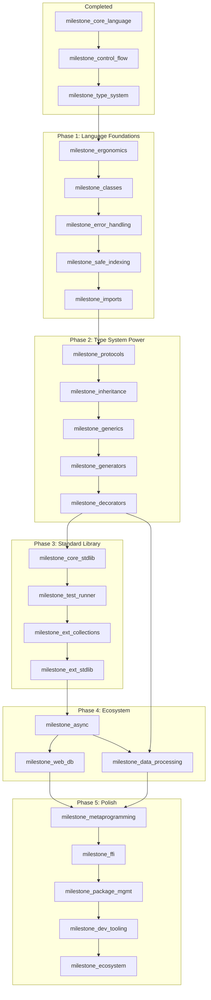

# Sifr Compiler Plan — Recheck Analysis (Post-Update)

**Date:** 2026-02-14
**Plan reviewed:** `sifr_compiler_architecture_fa3c10ee.plan.md`
**Scope:** milestone_ergonomics onward (all unstarted milestones)

---

## What Improved Since Last Review

The plan has been significantly improved:

1. **`milestone_imports` moved into Phase 1** — now sits right after `milestone_safe_indexing`, before `milestone_protocols`. This was a key recommendation: multi-file compilation is needed early to unblock stdlib and real project structure.

2. **`milestone_decorators` moved before `milestone_core_stdlib`** — decorators now land before the stdlib, enabling `@contextmanager` and `@app.get(...)` patterns in stdlib design. The chain is: `milestone_generators` -> `milestone_decorators` -> `milestone_core_stdlib`.

3. **`*args`/`**kwargs` consolidated into `milestone_decorators`** — no more split between basic kwargs (ergonomics) and variadic kwargs (decorators). Basic keyword arguments remain in `milestone_ergonomics`; variadic forms are cleanly in `milestone_decorators`.

4. **`milestone_classes` before `milestone_error_handling`** — classes land first so typed error hierarchies (`class ValueError(Error)`) are available immediately in error handling. This was a previous recommendation now incorporated.

5. **`milestone_ext_collections` and `milestone_ext_stdlib` are now strictly serialized** — `milestone_ext_collections` -> `milestone_ext_stdlib` in a flat chain after `milestone_test_runner`. This is cleaner than the previous parallel arrangement.

6. **Comprehensions moved to `milestone_generics`** — list/dict/set comprehensions are now with iterators and closures where they naturally belong.

7. **Rationale section added** — every ordering decision now has an explicit justification (lines 233-254).

---

## Remaining Issues

### Issue 1: `.sort()` in `milestone_ergonomics` Requires `Comparable` Protocol (HIGH)

**Location:** Line 835, line 1022

`milestone_ergonomics` includes `.sort()` as a concrete list method:

> `.sort()` -> in-place sort (requires `Comparable` -- basic version for primitive types)

But the `Comparable` protocol is defined in `milestone_protocols`, which is 5 milestones later. The parenthetical "(basic version for primitive types)" suggests a hardcoded sort for primitives, but this is never explicitly defined.

**Options:**
- **(A) Hardcode primitive sort in `milestone_ergonomics`:** `.sort()` works only for `list[int]`, `list[str]`, `list[float]` via direct `vec.sort()` / `vec.sort_unstable()` codegen, without any protocol dispatch. Then `milestone_generics` upgrades it to the full `T: Comparable` version.
- **(B) Defer `.sort()` to `milestone_generics`:** Remove it from `milestone_ergonomics` DoD and add it to `milestone_generics` where the `Comparable` bound and `key=` function support already live (lines 1694-1701).

**Recommendation:** Option (B). The `milestone_generics` section already has a full "Sorting Contract" (lines 1692-1701) that covers `.sort()`, `sorted()`, key functions, reverse, and float rejection. Having `.sort()` in both milestones creates ambiguity about which version is canonical. Remove `.sort()` from `milestone_ergonomics` line 1022 and let `milestone_generics` own all sorting.

---

### Issue 2: `@staticmethod` in `milestone_protocols` Newtype Example (MEDIUM)

**Location:** Lines 1498-1503

The newtype pattern example in `milestone_protocols` uses `@staticmethod`:

```python
class Port(int):
    @staticmethod
    def new(value: int) -> Result[Port, ValueError]:
```

But `@staticmethod` is introduced in `milestone_inheritance`, which comes *after* `milestone_protocols` in the dependency chain. This means the example uses syntax that doesn't exist yet at that milestone.

**Fix:** Either:
- **(A)** Change the example to use a regular function: `def Port_new(value: int) -> Result[Port, ValueError]` (less Pythonic but accurate).
- **(B)** Use a regular method with `self` that acts as a factory, or a module-level function.
- **(C)** Add a note that `@staticmethod` in this example is a forward reference to `milestone_inheritance` and the actual newtype pattern is fully usable only after that milestone.

**Recommendation:** Option (C) with a note. The newtype pattern is conceptually part of protocols, but the ergonomic `@staticmethod` form requires inheritance. Add a note like: "Note: `@staticmethod` shown here for clarity; it is introduced in `milestone_inheritance`. Until then, use a module-level factory function."

---

### Issue 3: `@property` Appears in Both `milestone_inheritance` and `milestone_metaprogramming` (MEDIUM)

**Location:** Lines 1551, 1589 (milestone_inheritance) and lines 2303, 2332 (milestone_metaprogramming)

`@property` is listed as a feature in `milestone_inheritance`:
> Properties: `@property` maps to getter methods, `@property.setter` maps to setter methods.

And also in `milestone_metaprogramming`:
> `@property`: getter/setter generation

**Issue:** It's unclear which milestone actually implements `@property`. If `milestone_inheritance` implements it (as its DoD suggests: "property_getter_setter" test), then `milestone_metaprogramming` should not re-list it. If `milestone_metaprogramming` is meant to *enhance* the basic property with compile-time generation, that distinction should be explicit.

**Recommendation:** `@property` is fundamentally a method-level feature (getter/setter), not a compile-time AST transform. It belongs in `milestone_inheritance`. Remove it from `milestone_metaprogramming`'s feature list and DoD, or clarify that `milestone_metaprogramming` only adds *computed/cached* property variants.

---

### Issue 4: `str(x)` Requires `Display` Trait Before Protocols Exist (LOW)

**Location:** Line 1154

`milestone_error_handling` defines:
> `str(x)` for any type -> `str` -- string representation. Codegen: `format!("{}", x)` (requires `Display`)

The `Display` trait is formalized as part of operator overloading in `milestone_protocols` (`__str__` maps to `Display`). However, `milestone_error_handling` comes 3 milestones before `milestone_protocols`.

**Mitigation:** This is actually fine because Rust's auto-derived `Debug` trait (from `milestone_classes`) provides `format!("{:?}", x)`, and the compiler can use `Debug` as a fallback for `str(x)` until `Display` is formally available. The plan should note this: `str(x)` uses `Debug` formatting until `milestone_protocols` provides `Display` via `__str__`.

---

### Issue 5: `milestone_data_processing` Hard-Depends on `milestone_web_db` (LOW)

**Location:** Line 227 (roadmap arrow)

The dependency graph has: `milestone_web_db` -> `milestone_data_processing`

But `milestone_data_processing` (polars, CSV, CLI args) has no real dependency on web/database features. It needs:
- `milestone_generics` (for generic DataFrame operations)
- `milestone_core_stdlib` (for file I/O)
- `milestone_decorators` (arguably, for API patterns)

The rationale (line 250) says "Data processing (polars) benefits from database patterns" — but polars and CSV processing are independent of web routing and SQL.

**Recommendation:** Remove the `milestone_web_db` -> `milestone_data_processing` edge. Instead, have `milestone_data_processing` depend on `milestone_decorators` (or `milestone_core_stdlib`). This allows data processing work to proceed in parallel with web/database work.

---

### Issue 6: `milestone_ext_collections` -> `milestone_ext_stdlib` Hard-Link May Be Unnecessary (LOW)

**Location:** Line 226

The chain is: `milestone_test_runner` -> `milestone_ext_collections` -> `milestone_ext_stdlib`

The rationale (line 247) says "ext_collections comes first since extended stdlib modules may use extended collection types." This is reasonable for `sifr.encoding` (which may use `bytes`) and `sifr.hash` (which may use `bytes`), but most extended stdlib modules (`sifr.math`, `sifr.time`, `sifr.random`, `sifr.re`, `sifr.log`) don't need extended collections.

**Recommendation:** Keep the current ordering but note that `milestone_ext_collections` and `milestone_ext_stdlib` *could* run in parallel if needed for schedule compression. The hard link is a soft preference, not a hard dependency.

---

### Issue 7: `class Port(int)` Newtype Uses Inheritance Syntax Before `milestone_inheritance` (MEDIUM)

**Location:** Lines 1498-1503

The newtype example `class Port(int):` uses `(int)` inheritance syntax, but general inheritance (`class Child(Parent)`) is a `milestone_inheritance` feature. The `milestone_protocols` section doesn't explain how `class Port(int)` works without inheritance.

**Clarification needed:** Is `class Port(int)` a special-cased newtype syntax (like `class ValueError(Error)` in `milestone_error_handling`)? If so, the plan should explicitly state: "Newtype over primitives (`class Port(int)`) is a special-cased syntax recognized by the compiler, not general inheritance. The compiler generates a Rust newtype struct (`struct Port(i64)`)."

---

### Issue 8: Dependency Graph Missing `milestone_inheritance` -> `milestone_generics` Justification (LOW)

**Location:** Line 224

The graph has: `milestone_protocols` -> `milestone_inheritance` -> `milestone_generics`

The rationale (line 241) says "Generics benefit from having the full class hierarchy (including inheritance) available, enabling generic constraints over class hierarchies."

This is a weak dependency. Generics with type bounds (`T: Protocol`) only need protocols, not inheritance. The main thing inheritance adds is that `class Dog(Animal)` can satisfy a `T: Animal` bound — but this is a convenience, not a blocker.

**Assessment:** The ordering is fine for simplicity (linear chain is easier to implement), but if schedule pressure arises, `milestone_generics` could theoretically start after `milestone_protocols` without waiting for `milestone_inheritance`. Note this as a potential parallelization opportunity.

---

## Current Dependency Graph (As-Is)

```
milestone_ergonomics -> milestone_classes -> milestone_error_handling -> milestone_safe_indexing
  -> milestone_imports -> milestone_protocols -> milestone_inheritance -> milestone_generics
    -> milestone_generators -> milestone_decorators -> milestone_core_stdlib
      -> milestone_test_runner -> milestone_ext_collections -> milestone_ext_stdlib
        -> milestone_async -> milestone_web_db -> milestone_data_processing
          -> milestone_metaprogramming -> milestone_ffi -> milestone_package_mgmt
            -> milestone_dev_tooling -> milestone_ecosystem
```

## Proposed Optimized Graph (Minimal Changes)

Changes from current:
1. Remove `.sort()` from `milestone_ergonomics` (defer to `milestone_generics`)
2. Remove `milestone_web_db` -> `milestone_data_processing` hard edge
3. Add `milestone_decorators` -> `milestone_data_processing` edge (actual dependency)



This allows `milestone_data_processing` and `milestone_web_db` to proceed in parallel after `milestone_async`, reducing the critical path by one milestone.

---

## Spec Fixes Needed (Prioritized)

| Priority | Issue | Fix |
|----------|-------|-----|
| HIGH | `.sort()` in `milestone_ergonomics` requires `Comparable` from `milestone_protocols` | Remove `.sort()` from `milestone_ergonomics` DoD; it's fully covered in `milestone_generics` Sorting Contract |
| MEDIUM | `@staticmethod` in `milestone_protocols` newtype example | Add forward-reference note; suggest module-level factory function as interim |
| MEDIUM | `@property` duplicated in `milestone_inheritance` and `milestone_metaprogramming` | Remove from `milestone_metaprogramming` or clarify the distinction |
| MEDIUM | `class Port(int)` newtype uses inheritance syntax before `milestone_inheritance` | Add explicit note that this is special-cased newtype syntax, not general inheritance |
| LOW | `str(x)` uses `Display` before `milestone_protocols` | Note that `Debug` is used as fallback until `Display` is available |
| LOW | `milestone_web_db` -> `milestone_data_processing` is unnecessary | Remove edge; add `milestone_decorators` -> `milestone_data_processing` |
| LOW | `milestone_ext_collections` -> `milestone_ext_stdlib` could be parallelized | Keep current order but note as parallelization opportunity |

---

## Overall Assessment

The plan is in **good shape**. The major structural issues from the previous review (circular dependencies, milestone overload, premature features) have been resolved. The remaining issues are mostly spec-level clarifications and one genuine dependency conflict (`.sort()` / `Comparable`). The milestone ordering is sound and the rationale section makes the design decisions transparent.

The single most impactful change would be removing `.sort()` from `milestone_ergonomics` — it eliminates a real dependency conflict and the feature is already fully specified in `milestone_generics`.
