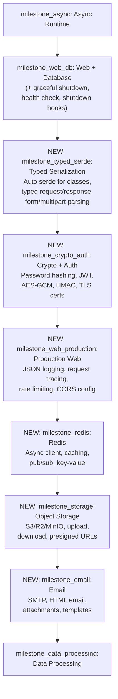

# Phase 4 Ecosystem Expansion

## Summary of Changes

The current Phase 4 has 3 milestones: `milestone_async`, `milestone_web_db`, `milestone_data_processing`. This plan adds **6 new milestones** after `milestone_web_db` and before `milestone_data_processing`, expanding Phase 4 from 3 to 9 milestones. The new milestones are sequenced so each builds on the previous. No existing milestones (Phase 3 or earlier) are modified.

## Constraint: Phase 3 and earlier are locked

All milestones through Phase 3 (including milestone_ext_stdlib, milestone_core_stdlib, etc.) are designed and locked. This plan does **not** modify any existing milestone. Instead, all new functionality is added as new milestones within Phase 4, placed after milestone_web_db and before milestone_data_processing.

Where a new milestone builds on a Phase 3 module (e.g., enhancing `sifr.json` with typed class serialization, or extending `sifr.log` with JSON output), the new milestone adds the enhancement as new functionality that layers on top of what Phase 3 delivered.

## What Already Exists (untouched)

These are already covered in locked milestones:

- **HTTP server** -- `sifr.web` wrapping `axum` (milestone_web_db, Phase 4)
- **HTTP client** -- `sifr.http` wrapping `reqwest` (milestone_web_db, Phase 4)
- **JSON** -- `sifr.json` wrapping `serde` + `serde_json` with `loads`/`dumps` for dicts and lists (milestone_core_stdlib, Phase 3)
- **File I/O** -- `sifr.io` wrapping `std::fs` (milestone_core_stdlib, Phase 3)
- **Environment / .env** -- `sifr.env` wrapping `std::env` + `dotenvy` (milestone_core_stdlib, Phase 3)
- **Testing** -- `sifr test` with assertions and discovery (milestone_test_runner, Phase 3)
- **SQLite** -- `sifr.db.sqlite` wrapping `rusqlite` (milestone_web_db, Phase 4)
- **PostgreSQL** -- `sifr.db` wrapping `sqlx` (milestone_web_db, Phase 4)
- **Data hashing** -- `sifr.hash` wrapping `sha2` + `md5` (milestone_ext_stdlib, Phase 3)
- **Basic structured logging** -- `sifr.log` wrapping `tracing` with levels (milestone_ext_stdlib, Phase 3)

## What the new milestones enhance (layered on top, not modifying originals)

- `sifr.json` (Phase 3: dicts/lists only) --> milestone_typed_serde adds **typed class serialization** (`dumps(my_class)`, `loads(s, MyClass)`)
- `sifr.log` (Phase 3: basic levels) --> milestone_web_production adds **JSON output mode, structured context fields, request tracing**
- `sifr.web` (milestone_web_db: basic routing/middleware) --> milestone_web_db enhanced with **graceful shutdown, health checks, shutdown hooks**; milestone_web_production adds **rate limiting, CORS config**

## Enhance `sifr.web` in milestone_web_db

Add to the existing milestone_web_db scope (this milestone is in Phase 4, not locked):

- **Graceful shutdown** -- `app.run()` automatically handles SIGINT/SIGTERM, drains in-flight requests, and exits cleanly. Codegen: `axum::serve(...).with_graceful_shutdown(shutdown_signal())` using `tokio::signal`. No user code needed -- it is the default behavior.
- **Shutdown hooks** -- `app.on_shutdown(cleanup_fn)` registers async cleanup functions (close DB pools, flush logs). Codegen: runs registered functions after the server stops accepting connections.
- **Health check** -- `app.health_check("/health")` registers a health endpoint returning 200 OK. Standard for container orchestration (Kubernetes, ECS).

These are small additions that belong in milestone_web_db because they are core web server behavior, not separate features.

---

## New Milestones (sequential order within Phase 4)

### New Phase 4 Sequence




---

## milestone_typed_serde: Typed Serialization and Request Validation

**Goal:** Leverage Sifr's type system to automatically serialize/deserialize classes to/from JSON, and provide typed request/response handling in `sifr.web`. This is Sifr's biggest differentiator -- what Pydantic, Zod, and serde derive do manually, Sifr does automatically because the compiler knows the types.

**Depends on:** milestone_web_db (web framework must exist), milestone_classes (classes must exist), milestone_generics (generic type parameters needed for `Request[T]`)

### Typed JSON Serialization (`sifr.json` enhancement)

Enhance `sifr.json` (from milestone_core_stdlib) so that classes can be serialized/deserialized automatically:

```python
class User:
    name: str
    email: str
    age: int

from sifr.json import dumps, loads

user = User("Alice", "alice@example.com", 30)
json_str: str = dumps(user)                          # '{"name":"Alice","email":"alice@example.com","age":30}'
parsed: User = loads(json_str, User)                  # typed deserialization
```

**Codegen:** The compiler auto-derives `serde::Serialize` and `serde::Deserialize` on all classes. `dumps(obj)` emits `serde_json::to_string(&obj)?`. `loads(s, T)` emits `serde_json::from_str::<T>(s)?`. Returns `Result[T, JsonError]` on parse failure.

**Supported types:** All primitive types, `list[T]`, `dict[K, V]`, `tuple[...]`, `Option[T]` (serialized as `null`), nested classes, union types (serialized as tagged enum). `bytes` fields serialize as base64.

### Typed Web Request/Response (`sifr.web` enhancement)

Replace the untyped `Request` / `Response` pattern with typed extractors:

```python
from sifr.web import App, Json, Path, Query

app = App()

class CreateUserRequest:
    name: str
    email: str
    age: int

class UserResponse:
    id: int
    name: str
    email: str

@app.post("/users")
async def create_user(body: Json[CreateUserRequest]) -> Json[UserResponse]:
    # body.data is already parsed and validated as CreateUserRequest
    user = save_user(body.data)
    return Json(UserResponse(id=user.id, name=user.name, email=user.email))

@app.get("/users/{user_id}")
async def get_user(user_id: Path[int]) -> Json[UserResponse]:
    # user_id.data is already parsed as int from the path
    ...

class SearchParams:
    q: str
    page: int = 1
    limit: int = 20

@app.get("/search")
async def search(params: Query[SearchParams]) -> Json[list[UserResponse]]:
    # params.data is parsed from query string with defaults applied
    ...
```

**Codegen:** `Json[T]` maps to axum's `axum::Json<T>` extractor. `Path[T]` maps to `axum::extract::Path<T>`. `Query[T]` maps to `axum::extract::Query<T>`. The compiler verifies that `T` has serde derives. Validation errors automatically return 422 with a structured error body.

### Form Data and Multipart File Uploads

```python
from sifr.web import App, Form, Multipart, UploadFile

class LoginForm:
    username: str
    password: str

@app.post("/login")
async def login(form: Form[LoginForm]) -> Json[dict[str, str]]:
    # form.data is parsed from application/x-www-form-urlencoded
    ...

@app.post("/upload")
async def upload(file: UploadFile) -> Json[dict[str, str]]:
    data: bytes = await file.read()
    filename: str = file.filename
    content_type: str = file.content_type
    await file.save("/uploads/" + filename)
    return Json({"filename": filename, "size": str(len(data))})

@app.post("/upload-multiple")
async def upload_many(files: Multipart) -> Json[list[str]]:
    names: list[str] = []
    async for field in files:
        if field.filename is not None:
            await field.save("/uploads/" + field.filename)
            names.append(field.filename)
    return Json(names)
```

**Codegen:** `Form[T]` maps to `axum::Form<T>`. `UploadFile` and `Multipart` map to `axum::extract::Multipart` (requires the `multipart` feature). File size limits are configurable via `app.config(max_upload_size=50 * 1024 * 1024)` which maps to `tower_http::limit::RequestBodyLimitLayer`.

**Rust crate mapping:**

- Typed serde: `serde` (290M+ downloads/month) + `serde_json` (190M+ downloads/month) -- the most downloaded crates in the Rust ecosystem
- Form/multipart: `axum` with `multipart` feature (already a dependency)
- Body limits: `tower-http` (already a dependency from milestone_web_db)

### Definition of Done (milestone_typed_serde)

- Classes auto-derive `Serialize`/`Deserialize` -- no manual annotation needed
- `dumps(obj)` serializes any class to JSON string
- `loads(s, T)` deserializes JSON string to typed class, returns `Result[T, JsonError]`
- Nested classes, lists, dicts, optionals, unions serialize correctly
- `Json[T]`, `Path[T]`, `Query[T]`, `Form[T]` extractors work in web handlers
- `UploadFile` and `Multipart` handle file uploads
- Validation errors return 422 with structured error body
- File upload size limits configurable
- E2E pass tests: typed_json_roundtrip, typed_request_body, typed_path_param, typed_query_param, form_parsing, file_upload, multipart_upload
- E2E fail tests: json_parse_wrong_type, missing_required_field, upload_exceeds_limit
- Milestone demo in `./demos/milestone_typed_serde_demo.sifr`

---

## milestone_crypto_auth: Cryptography and Authentication

**Goal:** Provide the cryptographic primitives and authentication building blocks that every web application needs. Password hashing with secure defaults, JWT tokens, encryption, and HMAC. The principle: make the secure choice the easy choice.

**Depends on:** milestone_typed_serde (JWT payloads need typed serialization), milestone_ext_stdlib (`sifr.hash` provides data hashing; this milestone adds password hashing and encryption which are distinct)

### Password Hashing (`sifr.crypto.password`)

```python
from sifr.crypto.password import hash_password, verify_password

# Hash with secure defaults (Argon2id, auto-generated salt)
hashed: str = hash_password("my_secret_password")

# Verify -- constant-time comparison, auto-detects algorithm
is_valid: bool = verify_password("my_secret_password", hashed)

# Explicit algorithm choice (for legacy systems)
from sifr.crypto.password import Algorithm
hashed_bcrypt: str = hash_password("password", algorithm=Algorithm.Bcrypt)
```

**Codegen:** `hash_password()` maps to `argon2::Argon2::default().hash_password()` with `SaltString::generate()`. `verify_password()` maps to `argon2::PasswordHash::new(hash).verify_password()`. Both run on a blocking thread pool (`tokio::task::spawn_blocking`) to avoid blocking the async runtime.

**Design:** Returns `str` (PHC string format) not raw bytes -- the hash string includes algorithm, salt, and parameters so it is self-describing. `verify_password` auto-detects whether the hash is Argon2 or Bcrypt from the prefix.

### JWT Tokens (`sifr.crypto.jwt`)

```python
from sifr.crypto.jwt import encode, decode, JwtError

class TokenPayload:
    user_id: int
    role: str
    exp: int  # expiration timestamp

secret: str = sifr.env.get("JWT_SECRET")

# Create token
payload = TokenPayload(user_id=42, role="admin", exp=1700000000)
token: str = encode(payload, secret)

# Decode and validate (checks expiration automatically)
result: Result[TokenPayload, JwtError] = decode(token, secret, TokenPayload)
match result:
    case Ok(data):
        print(f"User {data.user_id} with role {data.role}")
    case Err(e):
        print(f"Invalid token: {e}")
```

**Codegen:** `encode()` maps to `jsonwebtoken::encode()` with `Header::default()` (HS256). `decode()` maps to `jsonwebtoken::decode::<T>()` with `Validation::default()`. The payload class must have serde derives (auto-derived from milestone_typed_serde). Supports HS256, HS384, HS512, RS256, ES256 via `Algorithm` enum.

### Encryption (`sifr.crypto`)

```python
from sifr.crypto import encrypt, decrypt, generate_key

# Symmetric encryption (AES-256-GCM -- authenticated encryption)
key: bytes = generate_key()                              # 32 random bytes
ciphertext: bytes = encrypt(b"secret data", key)         # includes nonce + tag
plaintext: Result[bytes, CryptoError] = decrypt(ciphertext, key)

# HMAC signing
from sifr.crypto import hmac_sign, hmac_verify
signature: bytes = hmac_sign(b"message", key)
is_valid: bool = hmac_verify(b"message", signature, key)
```

**Codegen:**

- `generate_key()` -> `rand::thread_rng().gen::<[u8; 32]>()`
- `encrypt()` -> `aes_gcm::Aes256Gcm::encrypt()` with random nonce prepended to ciphertext
- `decrypt()` -> `aes_gcm::Aes256Gcm::decrypt()` extracting nonce from first 12 bytes
- `hmac_sign()` -> `hmac::Hmac::<sha2::Sha256>::new_from_slice(key)` then `.update(msg)` then `.finalize()`
- `hmac_verify()` -> same but `.verify_slice(signature)`

### Secure Random (`sifr.crypto.random`)

```python
from sifr.crypto.random import token_hex, token_bytes, token_urlsafe

session_id: str = token_hex(32)        # 64-char hex string
raw: bytes = token_bytes(32)           # 32 random bytes
csrf: str = token_urlsafe(32)          # base64url-encoded random
```

**Codegen:** All map to `rand::thread_rng()` with appropriate encoding. These are convenience wrappers matching Python's `secrets` module.

**Rust crate mapping:**

- Password hashing: `argon2` (1.4M downloads/month, RustCrypto team) + `bcrypt` (273K downloads/month) for legacy support
- JWT: `jsonwebtoken` (4.6M downloads/month, #1 in Authentication category, 996 reverse deps)
- Encryption: `aes-gcm` (RustCrypto, 6.5M downloads/month via `aead`) -- NCC Group security audited
- HMAC: `hmac` + `sha2` (RustCrypto, already used by `sifr.hash` in milestone_ext_stdlib)
- Random: `rand` (already a dependency from milestone_ext_stdlib)

### Definition of Done (milestone_crypto_auth)

- `hash_password()` produces Argon2id hashes with secure defaults
- `verify_password()` verifies Argon2 and Bcrypt hashes with constant-time comparison
- Password hashing runs on blocking thread pool (does not block async runtime)
- `encode()` / `decode()` create and validate JWT tokens with typed payloads
- JWT expiration is checked automatically on decode
- `encrypt()` / `decrypt()` provide AES-256-GCM authenticated encryption
- `hmac_sign()` / `hmac_verify()` provide HMAC-SHA256 message authentication
- `token_hex()`, `token_bytes()`, `token_urlsafe()` generate cryptographically secure random values
- E2E pass tests: password_hash_verify, password_bcrypt_legacy, jwt_roundtrip, jwt_expiration, aes_encrypt_decrypt, hmac_sign_verify, secure_random
- E2E fail tests: wrong_password_rejected, expired_jwt_rejected, tampered_ciphertext_rejected, wrong_hmac_rejected
- Milestone demo in `./demos/milestone_crypto_auth_demo.sifr`

---

## milestone_web_production: Production Web Features

**Goal:** Enhance the web stack with production-grade features that every deployed web application needs: structured JSON logging with request tracing, rate limiting, and CORS configuration. This milestone layers on top of `sifr.log` (Phase 3: basic structured logging with levels) and `sifr.web` (milestone_web_db: basic routing and middleware) without modifying those locked milestones.

**Depends on:** milestone_crypto_auth (rate limiting may use token-based identification), milestone_web_db (web framework must exist), milestone_ext_stdlib (`sifr.log` provides basic logging; this milestone extends it)

### Enhanced Logging (`sifr.log` extensions)

Phase 3's `sifr.log` provides basic structured logging with levels (debug, info, warn, error) wrapping `tracing`. This milestone adds production features on top:

```python
from sifr.log import configure, info, warn, error

# JSON output mode for production (machine-readable logs)
configure(format="json")  # default is "pretty" (human-readable)

# Structured context fields -- key-value pairs attached to log entries
info("request handled", user_id=123, path="/api/users", status=200, duration_ms=42)
# JSON output: {"level":"INFO","message":"request handled","user_id":123,"path":"/api/users","status":200,"duration_ms":42,"timestamp":"2026-02-15T10:30:00Z"}

warn("slow query", query="SELECT * FROM users", duration_ms=1500)
error("payment failed", order_id="abc123", error="card_declined")
```

**Codegen:**

- `configure(format="json")` maps to `tracing_subscriber::fmt().json().init()`
- `configure(format="pretty")` maps to `tracing_subscriber::fmt().pretty().init()` (default, same as Phase 3)
- Structured fields `info("msg", key=val)` map to `tracing::info!(key = val, "msg")` -- tracing already supports this natively, this milestone adds the Sifr syntax sugar

### Request Tracing Middleware

Automatic request/response logging for web handlers -- every HTTP request is logged with method, path, status, and duration:

```python
from sifr.web import App
from sifr.log import configure

configure(format="json")

app = App()
app.use_tracing()  # enable request tracing middleware

# Every request now automatically logs:
# {"level":"INFO","message":"request","method":"GET","path":"/api/users","status":200,"duration_ms":12,"request_id":"a1b2c3"}
```

**Codegen:** `app.use_tracing()` maps to `tower_http::trace::TraceLayer::new_for_http()` added as axum middleware. Request IDs are generated via `uuid::Uuid::new_v4()` and propagated via `tower_http::request_id::SetRequestIdLayer`.

### Rate Limiting

Protect endpoints from abuse with configurable rate limiting:

```python
from sifr.web import App, RateLimit

app = App()

# Global rate limit: 100 requests per minute per IP
app.use_rate_limit(RateLimit(requests=100, window=60))

# Per-route rate limit
@app.post("/login")
@app.rate_limit(requests=5, window=60)  # 5 attempts per minute
async def login(body: Json[LoginRequest]) -> Json[LoginResponse]:
    ...
```

**Codegen:** Rate limiting uses `tower::limit::RateLimitLayer` for global limits. Per-route limits use an in-memory token bucket (backed by `moka` cache for concurrent access). Returns 429 Too Many Requests when exceeded. IP extraction uses axum's `ConnectInfo` extractor.

### CORS Configuration

Explicit CORS configuration for API servers:

```python
from sifr.web import App, Cors

app = App()

# Allow specific origins
app.use_cors(Cors(
    origins=["https://myapp.com", "https://staging.myapp.com"],
    methods=["GET", "POST", "PUT", "DELETE"],
    headers=["Authorization", "Content-Type"],
    max_age=3600,
))

# Or allow all (development mode)
app.use_cors(Cors.allow_all())
```

**Codegen:** Maps to `tower_http::cors::CorsLayer` with the specified configuration. `Cors.allow_all()` maps to `CorsLayer::permissive()`.

**Rust crate mapping:**

- Logging: `tracing-subscriber` (260M+ downloads/month, Tokio team) -- JSON formatter already built in
- Request tracing: `tower-http` (already a dep from milestone_web_db) -- `TraceLayer`, `SetRequestIdLayer`
- Request IDs: `uuid` (130M+ downloads/month)
- Rate limiting: `tower` (already a dep) + `moka` (57M+ downloads, production-grade concurrent cache)
- CORS: `tower-http` (already a dep) -- `CorsLayer`

### Definition of Done (milestone_web_production)

- `configure(format="json")` switches logging to JSON output
- Structured context fields (`info("msg", key=val)`) emit key-value pairs in log output
- `app.use_tracing()` logs every request with method, path, status, duration, and request ID
- Request IDs are generated and propagated through the request lifecycle
- Global rate limiting (`app.use_rate_limit()`) works with configurable requests/window
- Per-route rate limiting (`@app.rate_limit()`) works independently of global limits
- Rate limit exceeded returns 429 with Retry-After header
- CORS configuration (`app.use_cors()`) works with specific origins and `allow_all()`
- E2E pass tests: json_logging, structured_fields, request_tracing, rate_limit_global, rate_limit_per_route, cors_specific_origin, cors_allow_all
- E2E fail tests: rate_limit_exceeded_429, cors_blocked_origin
- Milestone demo in `./demos/milestone_web_production_demo.sifr`

---

## milestone_redis: Redis Client

**Goal:** Provide a native async Redis client for caching, session storage, pub/sub, and general key-value operations. Redis is the universal infrastructure layer for web applications -- used for caching, rate limiting, session storage, and real-time messaging.

**Depends on:** milestone_async (async runtime), milestone_typed_serde (typed values need serialization for cache get/set)

### Key-Value Operations (`sifr.redis`)

```python
from sifr.redis import Redis

redis = await Redis.connect("redis://localhost:6379")

# Basic key-value
await redis.set("user:1:name", "Alice")
name: str | None = await redis.get("user:1:name")

# With expiration (TTL in seconds)
await redis.set("session:abc123", session_data, ttl=3600)

# Typed get/set -- serialize classes to JSON automatically
class CachedUser:
    id: int
    name: str
    email: str

await redis.set_json("user:1", CachedUser(1, "Alice", "alice@example.com"))
user: CachedUser | None = await redis.get_json("user:1", CachedUser)

# Atomic operations
count: int = await redis.incr("page:views")
await redis.expire("temp:key", 60)
exists: bool = await redis.exists("user:1:name")
await redis.delete("old:key")
```

### Hash, List, and Set Operations

```python
# Hash maps (Redis HSET/HGET)
await redis.hset("user:1", "name", "Alice")
await redis.hset("user:1", "email", "alice@example.com")
name: str | None = await redis.hget("user:1", "name")
all_fields: dict[str, str] = await redis.hgetall("user:1")

# Lists (Redis LPUSH/RPUSH/LPOP/RPOP)
await redis.lpush("queue:tasks", "task1")
await redis.rpush("queue:tasks", "task2")
task: str | None = await redis.lpop("queue:tasks")

# Sets (Redis SADD/SMEMBERS)
await redis.sadd("tags:post:1", "rust", "sifr", "web")
tags: set[str] = await redis.smembers("tags:post:1")
```

### Pub/Sub

```python
from sifr.redis import Redis

redis = await Redis.connect("redis://localhost:6379")

# Subscribe
async def on_message(channel: str, message: str):
    print(f"[{channel}] {message}")

await redis.subscribe("notifications", on_message)

# Publish (from another connection)
await redis.publish("notifications", "New user signed up!")
```

### Connection Pooling

```python
from sifr.redis import Redis

# Connection pool (default: 10 connections)
redis = await Redis.connect("redis://localhost:6379", pool_size=20)

# All operations automatically use the pool
# No manual connection management needed
```

**Codegen:** All operations map to `redis` crate (redis-rs) commands. `Redis.connect()` maps to `redis::Client::open()` + `redis::aio::MultiplexedConnection`. Pool management uses `redis::aio::ConnectionManager`. `set_json`/`get_json` combine redis commands with `serde_json` serialization from milestone_typed_serde.

**Rust crate mapping:**

- `redis` crate (redis-rs): v1.0+, 4,156 GitHub stars, official Redis recommendation, tokio async support, connection pooling, cluster support. Used by major Rust projects.

### Definition of Done (milestone_redis)

- `Redis.connect()` establishes async connection with connection pooling
- Basic key-value: `get`, `set`, `delete`, `exists`, `expire`, `incr`, `ttl`
- Typed JSON: `set_json`, `get_json` with automatic serialization
- Hash operations: `hset`, `hget`, `hgetall`, `hdel`
- List operations: `lpush`, `rpush`, `lpop`, `rpop`, `lrange`, `llen`
- Set operations: `sadd`, `srem`, `smembers`, `sismember`
- Pub/sub: `subscribe`, `publish` with async message handler
- Connection pooling works transparently
- TTL/expiration works on all key types
- All operations return `Result[T, RedisError]`
- E2E pass tests: redis_connect, redis_get_set, redis_typed_json, redis_hash, redis_list, redis_set, redis_pubsub, redis_ttl, redis_pool
- E2E fail tests: redis_connection_refused, redis_wrong_type
- Milestone demo in `./demos/milestone_redis_demo.sifr`

---

## milestone_storage: Object Storage (S3)

**Goal:** Provide a native client for S3-compatible object storage. Works with AWS S3, Cloudflare R2, MinIO, DigitalOcean Spaces, and any S3-compatible service. Object storage is essential for file uploads, media hosting, backups, and static asset delivery in web applications.

**Depends on:** milestone_async (async runtime), milestone_typed_serde (metadata serialization), milestone_web_db (commonly used with web handlers for file upload flows)

### Basic Operations (`sifr.storage`)

```python
from sifr.storage import Bucket

# Connect to S3 (reads credentials from env: AWS_ACCESS_KEY_ID, AWS_SECRET_ACCESS_KEY)
bucket = Bucket("my-bucket", region="us-east-1")

# Upload
await bucket.put("photos/avatar.jpg", image_data)
await bucket.put("docs/report.pdf", pdf_bytes, content_type="application/pdf")

# Upload from file path
await bucket.put_file("backups/db.sql", "/tmp/dump.sql")

# Download
data: Result[bytes, StorageError] = await bucket.get("photos/avatar.jpg")
await bucket.get_file("photos/avatar.jpg", "/tmp/avatar.jpg")  # download to file

# Delete
await bucket.delete("old/file.txt")

# Check existence
exists: bool = await bucket.exists("photos/avatar.jpg")

# List objects
objects: list[ObjectInfo] = await bucket.list(prefix="photos/")
for obj in objects:
    print(f"{obj.key}: {obj.size} bytes, modified {obj.last_modified}")
```

### Presigned URLs

```python
# Generate a presigned URL for temporary access (no credentials needed to access)
download_url: str = await bucket.presign_get("photos/avatar.jpg", expires=3600)  # 1 hour
upload_url: str = await bucket.presign_put("uploads/new-file.jpg", expires=600)   # 10 minutes
```

### S3-Compatible Services

```python
from sifr.storage import Bucket

# Cloudflare R2
bucket = Bucket(
    "my-r2-bucket",
    endpoint="https://ACCOUNT_ID.r2.cloudflarestorage.com",
    region="auto",
)

# MinIO (local development)
bucket = Bucket(
    "dev-bucket",
    endpoint="http://localhost:9000",
    region="us-east-1",
)

# DigitalOcean Spaces
bucket = Bucket(
    "my-space",
    endpoint="https://nyc3.digitaloceanspaces.com",
    region="nyc3",
)
```

### Web Integration (upload flow)

```python
from sifr.web import App, UploadFile, Json
from sifr.storage import Bucket
from sifr.crypto.random import token_urlsafe

app = App()
bucket = Bucket("uploads-bucket", region="us-east-1")

@app.post("/upload")
async def upload_file(file: UploadFile) -> Json[dict[str, str]]:
    key: str = f"uploads/{token_urlsafe(16)}/{file.filename}"
    data: bytes = await file.read()
    await bucket.put(key, data, content_type=file.content_type)
    url: str = await bucket.presign_get(key, expires=86400)
    return Json({"key": key, "url": url})
```

**Codegen:** All operations map to the `rust-s3` crate. `Bucket(name, region)` maps to `s3::Bucket::new()` with `s3::Region` and `s3::creds::Credentials::from_env()`. `put()` maps to `bucket.put_object()`. `get()` maps to `bucket.get_object()`. Presigned URLs use `bucket.presign_get()` / `bucket.presign_put()`.

**Why `rust-s3` over `aws-sdk-s3`:** `rust-s3` supports S3-compatible services (R2, MinIO, Spaces) natively with custom endpoints. `aws-sdk-s3` is AWS-only and pulls in the entire AWS SDK (~14MB). `rust-s3` is 52KB, async-native, and explicitly designed for multi-provider use.

**Rust crate mapping:**

- `rust-s3`: v0.37+, 6M+ total downloads, supports S3/R2/MinIO/Spaces/Wasabi/GCP, tokio async, multipart uploads

### Definition of Done (milestone_storage)

- `Bucket` connects to S3-compatible storage using env credentials
- `put()` / `put_file()` upload bytes or files to object storage
- `get()` / `get_file()` download objects to bytes or files
- `delete()` removes objects
- `exists()` checks object existence
- `list()` lists objects with prefix filtering, returns `ObjectInfo` (key, size, last_modified)
- `presign_get()` / `presign_put()` generate presigned URLs with configurable expiration
- Custom endpoints work for R2, MinIO, DigitalOcean Spaces
- Content-type is set correctly on upload
- All operations return `Result[T, StorageError]`
- E2E pass tests: s3_put_get, s3_delete, s3_list, s3_presign, s3_put_file, s3_custom_endpoint
- E2E fail tests: s3_bucket_not_found, s3_object_not_found, s3_invalid_credentials
- Milestone demo in `./demos/milestone_storage_demo.sifr`

---

## milestone_email: Email

**Goal:** Provide a native email client for sending transactional emails (registration confirmations, password resets, notifications). Supports plain text, HTML, and attachments over SMTP.

**Depends on:** milestone_async (async SMTP transport), milestone_typed_serde (email template data)

### Sending Email (`sifr.email`)

```python
from sifr.email import Email, SmtpClient

# Configure SMTP (reads from env: SMTP_HOST, SMTP_PORT, SMTP_USER, SMTP_PASSWORD)
smtp = await SmtpClient.connect(
    host="smtp.example.com",
    port=587,
    username="user@example.com",
    password="secret",
    tls=True,
)

# Simple text email
email = Email(
    to="alice@example.com",
    subject="Welcome to Sifr!",
    body="Hello Alice, welcome aboard.",
)
await smtp.send(email)

# HTML email
email = Email(
    to="alice@example.com",
    subject="Your weekly report",
    html="<h1>Weekly Report</h1><p>Here are your stats...</p>",
)
await smtp.send(email)

# With attachments
email = Email(
    to="alice@example.com",
    subject="Invoice attached",
    body="Please find your invoice attached.",
    attachments=["/path/to/invoice.pdf"],
)
await smtp.send(email)

# Multiple recipients, CC, BCC
email = Email(
    to=["alice@example.com", "bob@example.com"],
    cc=["manager@example.com"],
    bcc=["archive@example.com"],
    from_addr="noreply@myapp.com",
    subject="Team update",
    body="Important update for the team.",
)
await smtp.send(email)
```

### Environment-based Configuration

```python
from sifr.email import SmtpClient

# Reads SMTP_HOST, SMTP_PORT, SMTP_USER, SMTP_PASSWORD from environment
smtp = await SmtpClient.from_env()
```

**Codegen:** `SmtpClient.connect()` maps to `lettre::AsyncSmtpTransport::relay()` with `lettre::transport::smtp::authentication::Credentials`. `Email(...)` builds a `lettre::Message` via `lettre::message::MessageBuilder`. Attachments use `lettre::message::MultiPart` and `lettre::message::Attachment`. HTML emails use `lettre::message::SinglePart::html()`. Async transport uses `lettre::AsyncSmtpTransport` with tokio runtime.

**Rust crate mapping:**

- `lettre`: v0.11+, 2,173 GitHub stars, the standard Rust email library, async support via tokio, MIME/attachment support, TLS via rustls, actively maintained

### Definition of Done (milestone_email)

- `SmtpClient.connect()` establishes async SMTP connection with TLS
- `SmtpClient.from_env()` reads SMTP configuration from environment variables
- `Email(...)` constructs plain text, HTML, or multipart emails
- Multiple recipients, CC, BCC, custom from address work
- File attachments work
- `smtp.send(email)` sends email asynchronously, returns `Result[None, EmailError]`
- E2E pass tests: email_text, email_html, email_attachment, email_multiple_recipients, email_from_env
- E2E fail tests: email_invalid_address, email_smtp_connection_refused
- Milestone demo in `./demos/milestone_email_demo.sifr`

---

## Updated Phase 4 Summary

```
PHASE 4 - Ecosystem:
  milestone_async:           Async Runtime           -> async/await, tokio, tasks, async streams
  milestone_web_db:          Web + Database           -> axum web, reqwest HTTP, SQLite, sqlx, graceful shutdown, health check
  milestone_typed_serde:     Typed Serialization      -> Auto serde for classes, Json[T]/Path[T]/Query[T]/Form[T], file uploads
  milestone_crypto_auth:     Crypto + Auth            -> Argon2/Bcrypt password hashing, JWT, AES-GCM, HMAC, secure random
  milestone_web_production:  Production Web           -> JSON logging, request tracing, rate limiting, CORS config
  milestone_redis:           Redis                    -> Async client, key-value, hashes, lists, sets, pub/sub, connection pool
  milestone_storage:         Object Storage           -> S3/R2/MinIO, upload/download, presigned URLs, multi-provider
  milestone_email:           Email                    -> SMTP client, HTML email, attachments, env-based config
  milestone_data_processing: Data Processing          -> polars DataFrames, CSV/Parquet, CLI args
```

## Updated Milestone Chain (full)

The dependency chain for Phase 4 becomes:

```
... -> milestone_codegen_quality_v3 -> milestone_async -> milestone_web_db -> milestone_typed_serde -> milestone_crypto_auth -> milestone_web_production -> milestone_redis -> milestone_storage -> milestone_email -> milestone_data_processing -> ...
```

## Rationale for Milestone Order

- **milestone_typed_serde after milestone_web_db:** The web framework must exist before we can add typed extractors (`Json[T]`, `Form[T]`). Typed serde also enhances `sifr.json` from milestone_core_stdlib with class serialization.
- **milestone_crypto_auth after milestone_typed_serde:** JWT payloads are classes that need auto-serde. Password hashing and encryption are independent but benefit from the typed patterns established in milestone_typed_serde.
- **milestone_web_production after milestone_crypto_auth:** Production web features (logging, tracing, rate limiting, CORS) layer on top of the web framework and benefit from having auth in place (rate limiting by authenticated user, request tracing with user context).
- **milestone_redis after milestone_web_production:** Redis is used for session storage (which needs auth tokens from milestone_crypto_auth), caching (which needs typed JSON serialization from milestone_typed_serde), and rate limiting state (which can be upgraded from in-memory to Redis-backed after this milestone). The `set_json`/`get_json` methods depend on auto-serde.
- **milestone_storage after milestone_redis:** Object storage is often used alongside Redis (cache presigned URLs, track upload status). The web upload integration pattern (`UploadFile` -> S3) depends on milestone_typed_serde's file upload support.
- **milestone_email after milestone_storage:** Email is the least dependent on other milestones but benefits from having the full web stack available (send emails from web handlers with attachments from object storage).
- **milestone_data_processing remains last in Phase 4:** Data processing is independent of web infrastructure and serves a different use case (data science/engineering).

## Rust Crate Summary (all production-grade)


| Module           | Rust Crate                 | Downloads/month   | Notes                             |
| ---------------- | -------------------------- | ----------------- | --------------------------------- |
| Typed serde      | `serde` + `serde_json`     | 290M / 190M       | Most downloaded Rust crates       |
| Multipart        | `axum` (multipart feature) | Already a dep     | Tokio team maintained             |
| Password hashing | `argon2` + `bcrypt`        | 1.4M / 273K       | RustCrypto team                   |
| JWT              | `jsonwebtoken`             | 4.6M              | #1 auth crate, 996 reverse deps   |
| Encryption       | `aes-gcm`                  | via `aead` 6.5M   | NCC Group audited                 |
| HMAC             | `hmac` + `sha2`            | Already deps      | RustCrypto team                   |
| JSON logging     | `tracing-subscriber`       | 260M              | Tokio team, JSON formatter        |
| Request tracing  | `tower-http`               | Already a dep     | TraceLayer, RequestIdLayer        |
| Rate limiting    | `tower` + `moka`           | Already / 57M+    | Concurrent cache for token bucket |
| CORS             | `tower-http`               | Already a dep     | CorsLayer                         |
| Request IDs      | `uuid`                     | 130M              | Standard UUID generation          |
| Redis            | `redis` (redis-rs)         | v1.0+, 4.1K stars | Official Redis recommendation     |
| S3 storage       | `rust-s3`                  | 6M+ total         | S3/R2/MinIO/Spaces/Wasabi         |
| Email            | `lettre`                   | 2.1K stars        | Standard Rust email library       |


