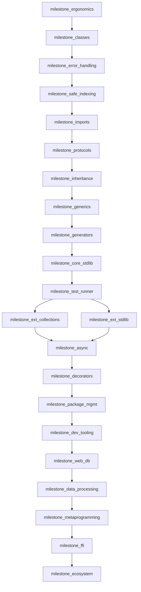

# Recheck After Milestone Rename

## Source Reviewed

- Primary plan file: [sifr_compiler_architecture_fa3c10ee.plan.md](/Users/yaseralnajjar/work/sifr/codebase/.cursor/plans/sifr_compiler_architecture_fa3c10ee.plan.md)
- Current analysis target file (empty): [milestone_reorder_analysis.md](/Users/yaseralnajjar/work/sifr/codebase/.cursor/plans/milestone_reorder_analysis.md)

## What Improved Since Last Review

- Rename migration to `milestone_*` IDs is largely consistent across headings, roadmap nodes, and DoD sections.
- `*args` / `**kwargs` moved into `milestone_decorators`, which resolves the earlier decorator-variadics sequencing gap.

## Remaining High-Impact Gaps

- **Safety model conflict (`milestone_ergonomics` vs global contracts)**
  - `milestone_ergonomics` still uses panic-based indexing (`list[i]`, `str[i]`) until `milestone_safe_indexing`.
  - Cross-cutting contracts define indexing as `Option` and “no panics” globally.
- **Tuple slicing contradiction**
  - `milestone_ergonomics` supports compile-time tuple slicing.
  - Cross-cutting slice contract states dict/tuple are not sliceable.
- **Protocol timing leaks**
  - `milestone_ergonomics` references `Comparable` for `.sort()` before `milestone_protocols`.
  - `milestone_error_handling` references `Display` behavior (`str(x)` mapping) before trait/operator formalization in `milestone_protocols`.
- **Example-level dependency mismatch**
  - `milestone_protocols` newtype example uses `@staticmethod`, but `@staticmethod` is introduced in `milestone_inheritance`.
- **Roadmap optimization opportunity (infra arrives late)**
  - `milestone_package_mgmt` and `milestone_dev_tooling` are still very late despite enabling faster and lower-risk implementation of dependency-heavy milestones (`milestone_web_db`, `milestone_data_processing`, `milestone_ffi`).
- **Unnecessary serialization edge in graph**
  - `milestone_ext_collections -> milestone_ext_stdlib` is currently hard-linked though both mainly depend on `milestone_core_stdlib`.

## Optimized Order (Minimal-Change, Recommended)

- Keep language-core chain unchanged through `milestone_safe_indexing`:
  - `milestone_ergonomics -> milestone_classes -> milestone_error_handling -> milestone_safe_indexing`
- Then optimize throughput and reduce rework:
  - `milestone_imports`
  - `milestone_protocols`
  - `milestone_inheritance`
  - `milestone_generics`
  - `milestone_generators`
  - `milestone_core_stdlib`
  - `milestone_test_runner`
  - `milestone_ext_collections` and `milestone_ext_stdlib` in parallel
  - `milestone_async`
  - `milestone_decorators`
  - `milestone_package_mgmt` (moved earlier)
  - `milestone_dev_tooling` (moved earlier)
  - `milestone_web_db`
  - `milestone_data_processing`
  - `milestone_metaprogramming`
  - `milestone_ffi`
  - `milestone_ecosystem`

## Why This Order Is Better

- Reduces semantics churn by resolving import/protocol/object-model prerequisites before broad ecosystem features.
- Pulls package/tooling infrastructure earlier for faster implementation loops, cleaner dependency handling, and fewer migration steps.
- Preserves existing high-level strategy while removing avoidable serialization and late-infra bottlenecks.

## Dependency Diagram (Optimized)

## Spec Fixes Needed Before Execution

- Reconcile indexing semantics in `milestone_ergonomics` with global safety contracts.
- Resolve tuple slicing contradiction (either permit compile-time tuple slicing in contract, or remove from milestone scope).
- Define/anchor baseline protocol contracts (`Comparable`, `Addable`, display/format trait expectations) where first consumed.
- Remove or adjust `@staticmethod` usage in `milestone_protocols` example unless moved earlier.
- Relax `milestone_ext_collections -> milestone_ext_stdlib` hard dependency if not technically required.

## Next Action

- Update [milestone_reorder_analysis.md](/Users/yaseralnajjar/work/sifr/codebase/.cursor/plans/milestone_reorder_analysis.md) with this recheck output once execution mode is enabled.

