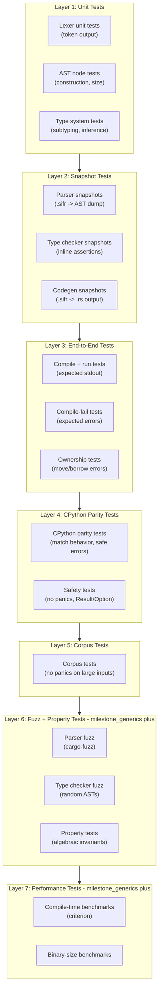

# Sifr Compiler -- Architecture and Implementation Plan

## Vision

Sifr is a compiled programming language that uses Python syntax with enforced static typing. It compiles Python-like source code to Rust source code, which is then compiled by `rustc` into native binaries. Assignment uses move semantics (like Rust), while function parameters are borrow-by-default with opt-in `mut` (mutable borrow) and `own` (ownership transfer). Types are strict with an opt-in `Any` escape hatch (like TypeScript's strict mode).

The type system draws heavily from TypeScript's design: union and intersection types, literal types, and full control-flow-based type narrowing are first-class citizens. Unlike TypeScript (which erases types at runtime), sifr uses types to generate efficient Rust code -- union types become Rust enums, narrowing becomes `match` expressions, and literal types enable compile-time value checking.

The end goal is a language capable of building web applications and general-purpose programs -- anywhere Python is used today, but with native performance and compile-time safety.

## Safety Philosophy

Sifr's core guarantee: **if it compiles, it works.** The language is designed so that a successfully compiled program will not crash at runtime under normal conditions. This guarantee is **fully enforced from milestone_safe_indexing onward** -- earlier milestones use panic-based indexing as a bootstrap mechanism until `Option`/`Result` types are available. The principles are:

- **No panics in user code.** Sifr programs never panic during normal execution. Every operation that can fail returns `Result[T, E]` or `Option[T]`, forcing the caller to handle the failure case at compile time.
- **Mandatory error handling.** `Result` and `Option` values are `#[must_use]`. Ignoring a `Result` returned by a function is a **compile-time error**. The programmer must either handle the error (`match`, `try`/`except`), propagate it (`?`), or explicitly discard it (`let _ = ...`).
- **All fallible operations return `Result` or `Option`.** This includes:
  - Indexing (`x[i]` returns `Option[T]`)
  - Division (`a / b` returns `Result[T, DivisionError]` when the divisor is not provably non-zero)
  - Type conversions (`int(s)` where `s: str` returns `Result[int, ParseError]`)
  - File I/O, network, and all stdlib operations that can fail
  - Integer overflow (panics in debug, wraps in release -- matches Rust; opt-in checked mode deferred)
- `**assert` is the only panic.** The `assert` statement is a programmer invariant check -- it generates `panic!()` and is intentionally unrecoverable. It exists to catch programmer bugs (violated assumptions), not to handle runtime errors. It is the one escape hatch from the no-panic guarantee.
- **Panic = unrecoverable system failure.** Beyond `assert`, panics only occur from truly unrecoverable situations: stack overflow, double panic, or hardware failure. These are never part of normal control flow.
- **Exceptions are not errors.** Sifr does not use Python's exception model. There is no stack unwinding, no `try`/`except` for control flow. The `try`/`except` syntax is reinterpreted as pattern matching on `Result` values. `raise` is syntax sugar for returning `Err(...)`.

This philosophy means that a Sifr programmer who handles all `Result` and `Option` values (which the compiler enforces) can be confident their program will not crash at runtime.

## CPython Reference

Sifr uses the CPython source code (`/Users/yaseralnajjar/work/sifr/cpython`) as the **authoritative reference** for Python behavior. The goal is to match CPython's semantics for built-in functions, data structure methods, and standard library behavior -- but always through Sifr's safety lens.

### Reference Directory Mapping


| Sifr feature area                                                                   | CPython reference location                                              | Notes                                                                        |
| ----------------------------------------------------------------------------------- | ----------------------------------------------------------------------- | ---------------------------------------------------------------------------- |
| Built-in functions (`len`, `abs`, `min`, `max`, `sorted`, `zip`, `enumerate`, etc.) | `Python/bltinmodule.c`                                                  | Match behavior, but return `Result`/`Option` where CPython would raise/panic |
| `list` methods (`.append`, `.pop`, `.sort`, `.index`, etc.)                         | `Objects/listobject.c`                                                  | Match semantics, safe indexing returns `Option`                              |
| `dict` methods (`.keys`, `.values`, `.get`, `.pop`, etc.)                           | `Objects/dictobject.c`                                                  | Match semantics, safe lookup returns `Option`                                |
| `str` methods (`.replace`, `.find`, `.split`, `.join`, etc.)                        | `Objects/unicodeobject.c`                                               | Match behavior, UTF-8 safe, character-based indexing                         |
| `tuple`                                                                             | `Objects/tupleobject.c`                                                 | Immutable, compile-time enforced                                             |
| `set` / `frozenset`                                                                 | `Objects/setobject.c`                                                   | Match operations, `frozenset` immutability enforced at compile time          |
| `int` / `float` / `bool`                                                            | `Objects/longobject.c`, `Objects/floatobject.c`, `Objects/boolobject.c` | Checked arithmetic, safe conversions                                         |
| `bytes` / `bytearray`                                                               | `Objects/bytesobject.c`, `Objects/bytearrayobject.c`                    | Match API, safe encode/decode                                                |
| `range` / `slice`                                                                   | `Objects/rangeobject.c`, `Objects/sliceobject.c`                        | Match iteration and slicing behavior                                         |
| Iterators / generators                                                              | `Objects/iterobject.c`, `Objects/genobject.c`                           | Match protocol, `Option`-based `__next__`                                    |
| Standard library modules                                                            | `Lib/<module>.py`, `Modules/<module>module.c`                           | Match API surface, wrap Rust crates                                          |
| Test suite (behavioral reference)                                                   | `Lib/test/test_<module>.py`                                             | Use as specification for expected behavior                                   |


### Safety Adaptation Rules

When adapting CPython behavior to Sifr, apply these rules:

1. **Where CPython raises an exception, Sifr returns `Result[T, E]`.** Example: `int("abc")` raises `ValueError` in CPython; in Sifr it returns `Result[int, ParseError]`.
2. **Where CPython raises `IndexError`, Sifr returns `Option[T]`.** Example: `list[99]` raises `IndexError` in CPython; in Sifr it returns `None`.
3. **Where CPython raises `KeyError`, Sifr returns `Option[V]`.** Example: `dict["missing"]` raises `KeyError` in CPython; in Sifr it returns `None`.
4. **Where CPython silently overflows or wraps, Sifr uses Rust's default behavior.** Example: large integer arithmetic in CPython uses arbitrary precision; Sifr uses `i64` arithmetic that panics on overflow in debug mode and wraps in release mode (matching Rust). An opt-in checked mode returning `Result[int, OverflowError]` is a future enhancement.
5. **Where CPython allows mutation on immutable types at runtime, Sifr rejects at compile time.** Example: `tuple[0] = 1` raises `TypeError` at runtime in CPython; in Sifr it is a compile-time error.
6. **Where CPython behavior is undefined or platform-dependent, Sifr defines explicit behavior.** Document any deviations from CPython in the milestone's notes.

### Safety Testing Contract

Every milestone that implements built-in functions, data structure methods, or stdlib modules must include a **safety test layer** that verifies:

1. **Behavioral parity with CPython:** for each function/method, write tests that match CPython's expected output for valid inputs. Use `Lib/test/test_<module>.py` as the specification.
2. **Safe error handling:** for each CPython operation that raises an exception, verify that Sifr returns the correct `Result::Err` or `Option::None` instead.
3. **No panics on any input:** fuzz or property-test each function/method to ensure it never panics, regardless of input. The only acceptable panic is from `assert` statements.
4. **Compile-time rejection of unsafe patterns:** verify that operations CPython rejects at runtime (e.g., mutating a tuple, unhashable dict key) are caught at compile time in Sifr.

This safety test layer is tracked in each milestone's Definition of Done as: **"CPython parity tests pass with safe error handling (no panics, Result/Option where CPython raises)"**.

## Python Divergences

Sifr intentionally diverges from CPython in several areas to achieve compile-time safety. This table documents each divergence, its rationale, and the milestone where it is introduced.


| Python Behavior                                        | Sifr Behavior                                                                                                        | Rationale                                                                                 | Milestone                                      |
| ------------------------------------------------------ | -------------------------------------------------------------------------------------------------------------------- | ----------------------------------------------------------------------------------------- | ---------------------------------------------- |
| Exceptions for error handling (`try`/`except`/`raise`) | `Result[T, E]` and `Option[T]` with mandatory handling; `try`/`except` reinterpreted as pattern matching on `Result` | Compile-time error handling eliminates unhandled exceptions at runtime                    | milestone_error_handling                       |
| `IndexError` on out-of-bounds access                   | `x[i]` returns `Option[T]` (no panic)                                                                                | Safe indexing -- no runtime crashes from bad indices                                      | milestone_safe_indexing                        |
| `KeyError` on missing dict key                         | `d[key]` returns `Option[V]` (no panic)                                                                              | Safe access -- caller must handle missing keys                                            | milestone_safe_indexing                        |
| Arbitrary-precision integers                           | `i64` arithmetic; overflow panics in debug, wraps in release (matches Rust)                                          | Predictable performance; matches Rust's default behavior                                  | milestone_error_handling                       |
| Import-time side effects (`__init__.py` runs code)     | `__init__.sifr` defines exported API only; no side effects on import                                                 | Deterministic, safe module loading                                                        | milestone_imports                              |
| Mutable default arguments (`def f(x=[])`)              | Default values are evaluated fresh each call (no shared mutable state)                                               | Eliminates a common Python footgun                                                        | milestone_ergonomics                           |
| Augmented assignment on immutables                     | Augmented assignment (`+=`) on immutable types (tuple, frozenset) is a compile-time error                            | Compile-time enforcement of immutability                                                  | milestone_ergonomics                           |
| `global` / `nonlocal` keywords                         | Not supported; use closures (milestone_generics) or pass values explicitly                                           | Encourages explicit data flow; avoids hidden state mutation                               | --                                             |
| Metaclasses (`type()`, `__metaclass__`)                | Not supported; use decorators (milestone_metaprogramming) and protocols (milestone_protocols) instead                | Simplification -- metaclasses add complexity with limited benefit in a compiled language  | --                                             |
| `__slots__`                                            | Not needed; all classes compile to Rust structs (already memory-efficient)                                           | Rust structs are fixed-layout by default                                                  | --                                             |
| Runtime duck typing                                    | Structural typing via Protocols (compile-time checked)                                                               | Same flexibility as duck typing but errors caught at compile time                         | milestone_protocols                            |
| `finally` for cleanup                                  | Supported in milestone_error_handling; prefer `with` statement (milestone_generators) which maps to Rust `Drop`      | Scope-based cleanup is more idiomatic and less error-prone                                | milestone_error_handling, milestone_generators |
| `del x` (name unbinding)                               | Not supported; variables are dropped at scope end (Rust RAII)                                                        | Explicit lifetime management is handled by the compiler; manual unbinding adds complexity | --                                             |
| `getattr`/`setattr`/`hasattr`/`delattr` (reflection)   | Not supported; use protocols (milestone_protocols) for dynamic dispatch, pattern matching for type inspection        | Compile-time type safety; runtime reflection undermines static guarantees                 | --                                             |
| `type()` for runtime type creation                     | Not supported; use class definitions (compile-time only)                                                             | All types must be known at compile time for Rust codegen                                  | --                                             |
| Positional-only parameters (`def f(x, /, y)`)          | Deferred to milestone_metaprogramming (metaprogramming); not commonly needed in user code                            | Low priority; most APIs use keyword arguments                                             | milestone_metaprogramming                      |


**Migration note:** code that relies heavily on exception propagation, import-time side effects, arbitrary-precision integers, or runtime reflection will require redesign when porting to Sifr. The compiler provides clear diagnostics for each divergence.

## Compiler Pipeline


## Milestone Roadmap

```mermaid
flowchart TD
    subgraph done [Completed]
        milestone_core_language["milestone_core_language: Core Language\nVariables, functions, if/else,\nprimitives, print, CLI"]
        milestone_control_flow["milestone_control_flow: Control Flow + Data\nLoops, list, dict, tuple,\nstring ops, indexing"]
        milestone_type_system["milestone_type_system: Advanced Type System\nUnion types, literal types,\ntype narrowing, Unknown"]
    end
    subgraph phase1 [Phase 1: Language Foundations]
        milestone_ergonomics["milestone_ergonomics: Language Ergonomics\nTernary, kwargs, augmented assign,\nmethods, slicing, walrus"]
        milestone_classes["milestone_classes: Basic Classes\nstruct + impl, __init__,\nmethods, auto-derive"]
        milestone_error_handling["milestone_error_handling: Error Handling\nResult/Option, ? operator,\ntry/except, typed errors"]
        milestone_safe_indexing["milestone_safe_indexing: Safe Indexing\nOption returns, del,\nfallible methods"]
        milestone_imports["milestone_imports: Multi-file + Imports\nimport/from, visibility,\ncircular detection"]
        milestone_codegen_quality["milestone_codegen_quality: Codegen Quality\nRemove unnecessary mut,\nidiomatic println/format,\nclean string/HashMap emit"]
    end
    subgraph phase2 [Phase 2: Type System Power]
        milestone_protocols["milestone_protocols: Protocols + Operators\nTraits, operator overload,\ndiscriminated unions, patterns"]
        milestone_inheritance["milestone_inheritance: Inheritance\nsuper, classmethod,\nstaticmethod, property"]
        milestone_generics["milestone_generics: Generics + Closures\nType params, lambdas,\ncomprehensions, iterators"]
        milestone_generators["milestone_generators: Generators + With\nyield, yield from,\ncontext managers"]
        milestone_decorators["milestone_decorators: Decorators + Variadics\nFunction wrapping,\n*args/**kwargs"]
    end
    subgraph phase3 [Phase 3: Standard Library]
        milestone_core_stdlib["milestone_core_stdlib: Core Stdlib\nI/O, JSON, env, os,\ntoml, collections, open"]
        milestone_test_runner["milestone_test_runner: Test Runner\nsifr test, assertions,\ndiscovery, parallel"]
        milestone_ext_collections["milestone_ext_collections: Extended Collections\nfrozenset, Counter,\ndefaultdict, bytes"]
        milestone_ext_stdlib["milestone_ext_stdlib: Extended Stdlib\nmath, time, random, regex,\nhashlib, base64, stream, logging"]
    end
    subgraph phaseHardening [Phase: Language Hardening]
        milestone_codegen_fixes["milestone_codegen_fixes: Codegen Fixes\nTuple indexing, union returns,\nint/int, print None, escapes"]
        milestone_narrowing_v2["milestone_narrowing_v2: Narrowing v2\nElif chains, early-return,\nand-narrowing, 3+ unions"]
        milestone_ownership_v2["milestone_ownership_v2: Ownership v2\nAuto-borrow for print,\nstop consuming values"]
        milestone_subscript_mutation["milestone_subscript_mutation: Subscript Mutation\nlist[i]=val, dict[key]=val,\nself.field += 1"]
        milestone_iteration_v2["milestone_iteration_v2: Iteration v2\nString/dict iteration,\ntuple unpack in for, dict comp"]
        milestone_builtins_v2["milestone_builtins_v2: Builtins v2\nmax/min 2-arg, range 3-arg,\nmixed arithmetic, module vars"]
        milestone_syntax_expansion["milestone_syntax_expansion: Syntax Expansion\nNested functions, closures,\nbitwise ops, multi-assign"]
        milestone_recursive_types["milestone_recursive_types: Recursive Types\nListNode, TreeNode,\nBox for self-referential"]
        milestone_inference_v2["milestone_inference_v2: Inference v2\nReturn type inference,\nparam inference, Result unwrap"]
        milestone_stdlib_hardening["milestone_stdlib_hardening: Stdlib Hardening\nset type, import aliases,\nmath/json/io/env gaps"]
        milestone_nested_functions["milestone_nested_functions: Nested Functions\ndef-inside-def, closures,\ncapture variables, recursive"]
        milestone_forward_refs["milestone_forward_refs: Forward Refs\nTwo-pass class registration,\nListNode, TreeNode, Node"]
        milestone_narrowing_v3["milestone_narrowing_v3: Narrowing v3\nEquality narrowing, field access,\nunion comparison, truthiness"]
        milestone_union_ops["milestone_union_ops: Union Ops\nArithmetic on T|None,\ndict.get, list concat"]
        milestone_subscript_v2["milestone_subscript_v2: Subscript v2\nNested subscript assign,\n&mut self, mutability"]
        milestone_comprehension_v2["milestone_comprehension_v2: Comprehension v2\nRange in comp, dict/set comp,\ntuple unpack in for"]
        milestone_generics_impl["milestone_generics_impl: Generics Impl\nTypeVar, generic fn/class,\nCallable, protocol bounds"]
        milestone_phase_fixes["milestone_phase_fixes: Phase Fixes\nProtocol dispatch, ctx mgr,\ncls calls, stdlib gaps"]
    end
    subgraph phaseBorrow [Phase: Borrow-by-Default]
        milestone_borrow_default["milestone_borrow_default: Borrow Default\nParamConvention enum,\nmut/own syntax, codegen"]
        milestone_borrow_hardening["milestone_borrow_hardening: Borrow Hardening\nExclusivity checks,\nerror messages, tests"]
    end
    subgraph phaseStdlibArch [Phase: Stdlib Architecture]
        milestone_intrinsics["milestone_intrinsics: Intrinsics Layer\n_sifr.* primitives, .sifr embedding,\ntwo-phase compilation"]
        milestone_stdlib_migration["milestone_stdlib_migration: Stdlib Migration\nPort 13 modules to .sifr,\ndelete emit_stdlib_call"]
        milestone_stdlib_expansion["milestone_stdlib_expansion: Stdlib Expansion\n~14 new modules: algorithms,\nCLI, file utilities"]
        milestone_stdlib_parity["milestone_stdlib_parity: Stdlib Parity\nGap closing, remaining modules,\nparity audit"]
    end
    subgraph phase4 [Phase 4: Ecosystem]
        milestone_async["milestone_async: Async Runtime\nasync/await, tokio,\ntasks, streams"]
        milestone_networking_stdlib["milestone_networking_stdlib: Networking Stdlib\nsocket, http, subprocess,\nurl parsing"]
        milestone_web_db["milestone_web_db: Web + Database\naxum, reqwest, sqlx,\ngraceful shutdown, health"]
        milestone_typed_serde["milestone_typed_serde: Typed Serialization\nAuto serde, Json/Path/Query,\nform/multipart, file uploads"]
        milestone_crypto_auth["milestone_crypto_auth: Crypto + Auth\nArgon2/Bcrypt, JWT,\nAES-GCM, HMAC, secrets"]
        milestone_web_production["milestone_web_production: Production Web\nJSON logging, request tracing,\nrate limiting, CORS"]
        milestone_redis["milestone_redis: Redis\nAsync client, key-value,\npub/sub, connection pool"]
        milestone_storage["milestone_storage: Object Storage\nS3/R2/MinIO, presigned URLs,\nupload/download"]
        milestone_email["milestone_email: Email\nSMTP, HTML email,\nattachments"]
        milestone_data_processing["milestone_data_processing: Data Processing\npolars DataFrames,\nCSV/Parquet, CLI"]
    end
    subgraph phase5 [Phase 5: Polish]
        milestone_metaprogramming["milestone_metaprogramming: Metaprogramming\nCompile-time decorators,\ndataclass, const eval"]
        milestone_ffi["milestone_ffi: FFI + Interop\nRust FFI, C FFI,\nunsafe boundary"]
        milestone_package_mgmt["milestone_package_mgmt: Package Management\nsifr.toml, sifr.lock,\nPubGrub solver"]
        milestone_dev_tooling["milestone_dev_tooling: Developer Tooling\nLSP, formatter, linter,\ndoc generator"]
        milestone_ecosystem["milestone_ecosystem: Package Ecosystem\nRegistry, incremental\ncompilation, REPL"]
    end
    milestone_core_language --> milestone_control_flow --> milestone_type_system
    milestone_type_system --> milestone_ergonomics --> milestone_classes --> milestone_error_handling --> milestone_safe_indexing
    milestone_safe_indexing --> milestone_imports --> milestone_codegen_quality --> milestone_protocols
    milestone_protocols --> milestone_inheritance --> milestone_generics
    milestone_generics --> milestone_generators --> milestone_decorators --> milestone_core_stdlib
    milestone_core_stdlib --> milestone_test_runner --> milestone_ext_collections --> milestone_ext_stdlib
    milestone_ext_stdlib --> milestone_codegen_quality_v3 --> milestone_codegen_fixes
    milestone_codegen_fixes --> milestone_narrowing_v2 --> milestone_ownership_v2 --> milestone_subscript_mutation
    milestone_subscript_mutation --> milestone_iteration_v2 --> milestone_builtins_v2 --> milestone_syntax_expansion
    milestone_syntax_expansion --> milestone_recursive_types --> milestone_inference_v2 --> milestone_stdlib_hardening
    milestone_stdlib_hardening --> milestone_nested_functions --> milestone_forward_refs --> milestone_narrowing_v3
    milestone_narrowing_v3 --> milestone_union_ops --> milestone_subscript_v2 --> milestone_comprehension_v2
    milestone_comprehension_v2 --> milestone_generics_impl --> milestone_phase_fixes
    milestone_phase_fixes --> milestone_borrow_default --> milestone_borrow_hardening
    milestone_borrow_hardening --> milestone_intrinsics --> milestone_stdlib_migration --> milestone_stdlib_expansion --> milestone_stdlib_parity
    milestone_stdlib_parity --> milestone_async --> milestone_networking_stdlib --> milestone_web_db --> milestone_typed_serde
    milestone_typed_serde --> milestone_crypto_auth --> milestone_web_production --> milestone_redis
    milestone_redis --> milestone_storage --> milestone_email --> milestone_data_processing
    milestone_data_processing --> milestone_metaprogramming --> milestone_ffi --> milestone_package_mgmt --> milestone_dev_tooling --> milestone_ecosystem
```




**Rationale for milestone order:**

- **milestone_ergonomics before milestone_classes:** Language ergonomics (ternary, kwargs, methods, slicing) make the language usable before adding classes
- **milestone_classes before milestone_error_handling:** Basic classes must exist before error handling so typed error hierarchies (`class ValueError(Error)`) work immediately in milestone_error_handling
- **milestone_error_handling before milestone_safe_indexing:** Error handling tools (`?`, `match`, `unwrap_or`) must exist before safe indexing returns `Option` values that users need to handle
- **milestone_safe_indexing before milestone_imports:** Safe indexing completes the safety story for single-file programs before adding multi-file compilation
- **milestone_imports before milestone_codegen_quality:** Phase 1 is complete after imports, so all codegen patterns are established. Fixing codegen quality now means every future milestone builds on clean, idiomatic Rust output.
- **milestone_codegen_quality before milestone_protocols:** Codegen refinement is a natural Phase 1 cleanup step. Protocols add significant new codegen complexity, so starting from clean codegen avoids compounding quality issues.
- **milestone_protocols before milestone_inheritance:** Protocols define the trait contracts; inheritance extends them. Having protocols first means inherited classes can implement protocols immediately.
- **milestone_inheritance before milestone_generics:** Generics benefit from having the full class hierarchy (including inheritance) available, enabling generic constraints over class hierarchies.
- **milestone_generics includes comprehensions:** List/dict/set comprehensions are trivial iterator sugar, naturally belonging with iterators and closures
- **milestone_generators after milestone_generics:** Generators need closures and iterators from generics; context managers need the full type system
- **milestone_decorators after milestone_generators, before milestone_core_stdlib:** Decorators need closures (from generics) and are useful for stdlib design patterns. They don't need async. Moving them earlier enables `@decorator` patterns in stdlib.
- **milestone_core_stdlib after milestone_decorators:** Core stdlib benefits from decorators for API design patterns (e.g., `@contextmanager`)
- **milestone_test_runner after milestone_core_stdlib:** Test runner lands early so subsequent stdlib work can be tested using Sifr's own test runner (dogfooding)
- **milestone_ext_collections and milestone_ext_stdlib after milestone_test_runner:** Both depend on core stdlib; in flat order ext_collections comes first since extended stdlib modules may use extended collection types
- **Language Hardening after milestone_codegen_quality_v3:** Phase 3 is complete but audit of 396 LeetCode problems + 8 feature audits revealed systemic gaps. Hardening fixes these before building the ecosystem on a shaky foundation.
- **milestone_codegen_fixes first in Hardening:** Bugs in already-implemented features must be fixed before adding new ones — all subsequent milestones build on correct codegen.
- **milestone_narrowing_v2 before milestone_ownership_v2:** Many ownership workarounds depend on narrowing patterns (`if x is not None:`). Fixing narrowing first unblocks 36+ LeetCode problems.
- **milestone_ownership_v2 before milestone_subscript_mutation:** Subscript assignment requires `&mut` references, which depend on correct ownership tracking.
- **milestone_subscript_mutation before milestone_iteration_v2:** Dict comprehension and `for k, v in d.items()` patterns often combine with `d[k] = v`.
- **milestone_iteration_v2 before milestone_builtins_v2:** `sorted(key=...)` depends on lambda iteration patterns; builtins benefit from working iteration.
- **milestone_builtins_v2 before milestone_syntax_expansion:** Module-level variables and mixed arithmetic are prerequisites for many real-world programs that also use nested functions.
- **milestone_syntax_expansion before milestone_recursive_types:** Tree/graph algorithms heavily use nested functions (DFS/BFS helpers) and closures, which must work before recursive types are useful.
- **milestone_recursive_types before milestone_inference_v2:** Inference for recursive types (e.g., `def build_tree(nums)` returning `TreeNode | None`) requires the type system to already support those types.
- **milestone_inference_v2 before milestone_stdlib_hardening:** Stdlib hardening is the least blocking — programs can work around missing stdlib functions but not missing syntax or broken codegen.
- **milestone_stdlib_hardening before milestone_nested_functions:** Stdlib hardening completes the first 10 hardening milestones. The post-hardening audit revealed systematic remaining failures requiring a second round of fixes.
- **milestone_nested_functions first in Hardening Phase 2:** Nested functions is the single biggest blocker (~200 LeetCode problems). Blocks DFS/BFS helpers, backtracking, and recursive algorithms.
- **milestone_forward_refs after milestone_nested_functions:** Forward refs are the second biggest blocker (~60 LeetCode problems). Together with nested functions, unblocks the majority of class-based algorithms.
- **milestone_narrowing_v3 after milestone_forward_refs:** Narrowing fixes depend on types being resolvable (forward refs). Equality chains and field access on narrowed types are pervasive.
- **milestone_union_ops after milestone_narrowing_v3:** Union operations depend on narrowing being correct first. 90+ LeetCode errors from arithmetic, indexing, and `len()` on `T | None`.
- **milestone_subscript_v2 after milestone_union_ops:** Subscript/codegen fixes build on correct union handling. Nested subscript assignment and `&mut self` for methods.
- **milestone_comprehension_v2 after milestone_subscript_v2:** Comprehensions are syntactic sugar that benefit from all prior fixes. Range in comprehension, dict/set comprehension, tuple unpacking.
- **milestone_generics_impl after milestone_comprehension_v2:** Generics is the largest new feature. Everything else should be stable before adding type parameters.
- **milestone_phase_fixes last in Hardening Phase 2:** Catch-all for remaining bugs -- protocol dispatch, context managers, stdlib gaps, and codegen polish.
- **milestone_phase_fixes before milestone_borrow_default:** The language must be fully hardened before changing the default parameter passing convention. Borrow-by-default is a semantic change that affects every user-defined function -- it must build on a stable foundation.
- **milestone_borrow_default before milestone_async:** Borrow-by-default is a prerequisite for fearless concurrency. The `own` keyword makes ownership transfer explicit at task spawn boundaries. Without it, milestone_async would need to re-implement parameter convention logic.
- **milestone_borrow_hardening after milestone_borrow_default:** Exclusivity checking and error messages build on the working borrow-by-default codegen. Tests validate the complete model.
- **milestone_borrow_hardening before milestone_intrinsics:** The ownership model must be fully hardened (with exclusivity enforcement) before rewriting the stdlib architecture. Stdlib `.sifr` files must be written against the final borrow-by-default semantics -- retrofitting convention annotations after the fact would be error-prone and wasteful.
- **milestone_intrinsics before milestone_stdlib_migration:** The intrinsics layer (`_sifr.*`) and two-phase compilation pipeline must exist before any stdlib module can be ported to `.sifr` files. This milestone establishes the architecture; migration uses it.
- **milestone_stdlib_migration before milestone_stdlib_expansion:** All 13 existing stdlib modules must be ported to `.sifr` files (and `emit_stdlib_call` deleted) before adding new modules. This ensures new modules are written against the final architecture, not the legacy codegen path.
- **milestone_stdlib_expansion before milestone_stdlib_parity:** New pure-Sifr and intrinsic-backed modules (~14) are added before the gap-closing and parity audit. Expansion adds the modules; parity fills in missing functions and validates coverage.
- **milestone_stdlib_parity before milestone_async:** The stdlib must be comprehensive before the async runtime, which depends on a mature stdlib (logging, collections, I/O, etc.) for real-world async programs.
- **milestone_async before milestone_networking_stdlib:** The async runtime must exist before networking stdlib modules (socket, http, subprocess) that require async I/O primitives.
- **milestone_networking_stdlib before milestone_web_db:** Networking stdlib modules (socket, http, url) provide the foundation that the web framework and database milestones build on.
- **milestone_async after Stdlib Architecture Phase:** Async runtime needs the full stdlib (now written in Sifr), a hardened core language, and a complete ownership model in place
- **milestone_async before milestone_web_db:** Async runtime is needed for web framework and database access
- **milestone_typed_serde after milestone_web_db:** The web framework must exist before we can add typed extractors (`Json[T]`, `Form[T]`). Typed serde also enhances `sifr.json` from milestone_core_stdlib with class serialization.
- **milestone_crypto_auth after milestone_typed_serde:** JWT payloads are classes that need auto-serde. Password hashing and encryption are independent but benefit from the typed patterns established in milestone_typed_serde.
- **milestone_web_production after milestone_crypto_auth:** Production web features (logging, tracing, rate limiting, CORS) layer on top of the web framework and benefit from having auth in place (rate limiting by authenticated user, request tracing with user context).
- **milestone_redis after milestone_web_production:** Redis is used for session storage (which needs auth tokens from milestone_crypto_auth), caching (which needs typed JSON serialization from milestone_typed_serde), and rate limiting state (which can be upgraded from in-memory to Redis-backed after this milestone). The `set_json`/`get_json` methods depend on auto-serde.
- **milestone_storage after milestone_redis:** Object storage is often used alongside Redis (cache presigned URLs, track upload status). The web upload integration pattern (`UploadFile` -> S3) depends on milestone_typed_serde's file upload support.
- **milestone_email after milestone_storage:** Email is the least dependent on other milestones but benefits from having the full web stack available (send emails from web handlers with attachments from object storage).
- **milestone_data_processing remains last in Phase 4:** Data processing is independent of web infrastructure and serves a different use case (data science/engineering).
- **milestone_metaprogramming-milestone_ecosystem last:** Metaprogramming, FFI, package management, tooling, and ecosystem polish come after the language is functional
- **milestone_ffi before milestone_package_mgmt:** FFI unlocks access to the full Rust crate ecosystem; package management benefits from a stable language surface
- **milestone_package_mgmt before milestone_dev_tooling:** Package management infrastructure needed before developer tooling
- **milestone_dev_tooling before milestone_ecosystem:** LSP and formatter should exist before the package registry launches, so published packages have consistent quality

---

## Crate Structure (Rust Workspace)

**Hybrid dependency approach:** Infrastructure crates are referenced as git dependencies from ruff v0.4.10 (unmodified). Parser and AST crates are vendored forks that may diverge from Python syntax in future milestones.

```
sifr/
  Cargo.toml                (workspace root)
  crates/
    sifr_python_ast/        (vendored fork of ruff_python_ast -- may diverge for sifr syntax)
    sifr_python_parser/     (vendored fork of ruff_python_parser -- may diverge for sifr syntax)
    sifr_hir/               (High-level IR: typed AST after name resolution + type checking)
    sifr_type_system/       (type definitions, inference, checking, subtyping)
    sifr_codegen/           (Rust source code generation from HIR)
    sifr_driver/            (orchestrates the pipeline, error reporting)
    sifr/                   (CLI binary: sifr build, sifr check, sifr run)

  # Git dependencies from ruff v0.4.10 (not vendored):
  #   ruff_text_size          -- text span/range utilities
  #   ruff_source_file        -- source file representation, line indexing
  #   ruff_python_trivia      -- whitespace/comment handling
  #   ruff_python_literal     -- literal parsing (string escapes, number formats)
```

New crates added per milestone as needed:

- milestone_core_stdlib/milestone_ext_collections: `sifr_std` (standard library wrappers, extended collections)
- milestone_ffi: FFI codegen extensions in `sifr_codegen`
- milestone_dev_tooling: `sifr_lsp` (language server), `sifr_fmt` (formatter), `sifr_lint` (linter)
- milestone_ecosystem: `sifr_registry` (package registry client)

---

## milestone_core_language: Core Language (First Working Compiler)

**Goal:** Compile a simple program with variables, functions, basic types, and branching to a native binary.

### Language Features

- **Types:** `int`, `float`, `bool`, `str`, `None`
- **Literals:** integer, float, string, boolean, None
- **Variables:** typed declarations (`x: int = 5`), inferred declarations (`x = 5`)
- **Functions:** typed parameters and return types, recursion
- **Expressions:** arithmetic (`+`, `-`, `*`, `/`, `//`, `%`), comparison (`==`, `!=`, `<`, `>`, `<=`, `>=`), boolean (`and`, `or`, `not`), string concatenation
- **Statements:** assignment, return, expression statements, `if`/`elif`/`else`
- **Built-in:** `print()` function
- **Entry point:** `main()` function as program entry
- **Move semantics:** move on assignment for `str`, copy for primitives (`int`, `float`, `bool`)
- **CLI:** `sifr build`, `sifr run`, `sifr check`, `sifr emit`

### Implementation Steps

1. Fork ruff parser/AST crates into `crates/` with `sifr_` prefix; use git deps for infrastructure crates
2. Strip the AST to milestone_core_language-relevant nodes only
3. Build `sifr_type_system` -- Type enum, inference from initializers, checking binary ops / function calls
4. Build `sifr_hir` -- Typed IR with name resolution and ownership tracking
5. Build `sifr_codegen` -- Emit Rust source code, generate Cargo.toml + main.rs
6. Build `sifr_driver` -- Orchestrate the pipeline with nice error diagnostics
7. Build `sifr` CLI binary with clap
8. End-to-end tests (hello world, factorial, fibonacci)

### Example Program

```python
def factorial(n: int) -> int:
    if n <= 1:
        return 1
    return n * factorial(n - 1)

def main():
    x: int = factorial(5)
    print(x)
```

### Type Mapping (milestone_core_language)

- `int` -> `i64`
- `float` -> `f64`
- `bool` -> `bool`
- `str` -> `String`
- `None` -> `()`

---

## milestone_control_flow: Control Flow and Data Structures

**Goal:** Support loops and compound data types so programs can process collections of data.

### Language Features

- **Loops:** `while` loop, `for` loop over ranges and iterables
- `**break` / `continue`:** loop control flow (exit loop early or skip to next iteration)
- **Data types:** `list[T]`, `dict[K, V]`, `tuple[T, ...]`
- **Indexing:** `my_list[0]`, `my_dict["key"]`
- **Slicing:** `my_list[1:3]`
- **String operations:** `.len()`, `.upper()`, `.lower()`, `.split()`, `.strip()`, f-strings
- **Type inference:** infer collection element types from usage
- `**in` operator:** membership testing (`item in collection`)
- `**not in` operator:** negated membership testing (`item not in collection`) -- compiles to `!collection.contains(&item)`
- `**range()` built-in**
- **Multiple assignment:** `a, b = 1, 2` (tuple unpacking)

### Example Program

```python
def sum_list(numbers: list[int]) -> int:
    total: int = 0
    for n in numbers:
        total = total + n
    return total

def main():
    nums: list[int] = [1, 2, 3, 4, 5]
    result: int = sum_list(nums)
    print(f"Sum: {result}")
```

### Type Mapping (New)

- `list[T]` -> `Vec<T>`
- `dict[K, V]` -> `std::collections::HashMap<K, V>`
- `tuple[A, B, C]` -> `(A, B, C)`
- `range(n)` -> `0..n`

### Deferred Built-ins and Methods

milestone_control_flow established the core data types but deferred comprehensive method suites and built-in functions to later milestones:

- **Collection methods (concrete returns)** (list `.append()`, `.clear()`, dict `.keys()`, `.values()`, etc.) -> milestone_ergonomics
- **Collection methods (Option/Result returns)** (list `.pop()`, `.index()`, dict `.get()`, `.pop()`, etc.) -> milestone_safe_indexing
- **Extended string methods (concrete)** (`.replace()`, `.startswith()`, `.join()`, etc.) -> milestone_ergonomics
- **Extended string methods (Option)** (`.find()`, `.rfind()`) -> milestone_safe_indexing
- **Non-generic built-in functions** (`len()`, `abs()`, `round()`, `repr()`) -> milestone_ergonomics; `hash()` -> milestone_classes
- **Fallible conversions** (`int(s)`, `float(s)`, `input()`) -> milestone_error_handling (return `Result`)
- **Generic built-in functions** (`min()`, `max()`, `sorted()`, `zip()`, `enumerate()`) -> milestone_generics (require generics)
- **Extended collection types** (`frozenset`, `Counter`, `defaultdict`, `bytes`) -> milestone_ext_collections

---

## milestone_type_system: Advanced Type System

**Goal:** Add union types, intersection types, literal types, and full control-flow-based type narrowing to the sifr compiler. This makes sifr's type system as expressive as TypeScript's while compiling to Rust.

### Why milestone_type_system (before Error Handling)

Union types, literal types, and type narrowing are **prerequisites** for clean error handling and later milestones:

- milestone_error_handling's `Result[T, E]` and `Option[T]` are union-based types
- milestone_protocols's discriminated unions (e.g., `Shape` with a `.tag` field) need narrowing
- milestone_generics's generics need type bounds with unions
- Every milestone after milestone_type_system benefits from the advanced type system

### Syntax Design Principles

Sifr reuses familiar syntax from Python, TypeScript, and Rust rather than inventing new constructs:

- **Python-first:** if Python has syntax for it, use that (`isinstance`, `is None`, `type` statement)
- **TypeScript for types:** where Python's typing module is verbose, borrow TypeScript's cleaner syntax (values as types: `"GET" | "POST"` instead of `Literal["GET"] | Literal["POST"]`)
- **No redundant sugar:** one way to do things. `str | None` for optionals, no `T?` shorthand
- **No user-facing syntax for internal features:** intersection types are internal to the narrowing engine, not exposed as `A & B` syntax

### Language Features

- **Union types:** `int | str`, `A | B | C` -- a value can be one of several types (Python 3.10+ syntax)
- **Literal types:** values used directly as types in type position (TypeScript style):

```python
type HttpMethod = "GET" | "POST" | "PUT" | "DELETE"
type StatusCode = 200 | 404 | 500
type Toggle = True | False
```

- **Type aliases:** `type UserId = int`, `type HttpMethod = "GET" | "POST"` (Python 3.12 `type` statement)
- **Optional types:** `str | None` -- no shorthand, just Python's union-with-None (Python 3.10+ syntax)
- `**Unknown` type:** safe top type -- accepts any value but must be narrowed (via `isinstance`, equality, etc.) before use. Unlike `Any` which opts out of type checking, `Unknown` forces the programmer to prove the type before operating on it
- **Type narrowing via control flow analysis:**
  - Truthiness checks: `if x:` narrows `x: str | None` to `x: str`
  - `isinstance()` checks: `if isinstance(x, int):` narrows union (Python built-in)
  - Equality checks: `if x == "GET":` narrows `x: str` to `x: "GET"` in the then-branch
  - `is None` / `is not None` checks (Python idiom)
  - `== None` diagnostic: the compiler emits a warning suggesting `is None` instead of `== None` (identity check is more correct and idiomatic for None comparisons, matching Python best practice and linter rules)
  - `not` negation: else branches get the complement type
- **Type predicates:** user-defined narrowing via return type annotation (Python typing style):

```python
def is_string(x: int | str) -> TypeGuard[str]:
    return isinstance(x, str)

# Usage: if is_string(val): ... val is str here
```

- `**reveal_type()` built-in:** prints inferred type at compile time (same as mypy/pyright)
- `**never` exhaustiveness:** matching all union variants leaves `never` -- compiler error if not exhaustive
- **Intersection types:** internal to the narrowing engine only. No user-facing `A & B` syntax in milestone_type_system. Exposed later when protocols land in milestone_classes

Note: **Discriminated unions** (union of structs with a shared tag field) are deferred to milestone_protocols when protocols and pattern matching exist. milestone_type_system focuses on unions of primitive/literal types with narrowing via isinstance and equality.

### Compiler Architecture Changes

#### Type System Changes

Extend the `Type` enum in `crates/sifr_type_system/src/types.rs`:

```rust
enum Type {
    // ... existing types ...

    // Union: value is one of these types
    Union(Vec<Type>),

    // Intersection: value satisfies all of these (internal, for narrowing)
    Intersection(Vec<Type>),

    // Literal types: specific values as types
    LiteralInt(i64),
    LiteralStr(String),
    LiteralBool(bool),

    // Optional sugar: T | None
    Optional(Box<Type>),

    // Type alias reference (resolved during checking)
    Alias(String, Box<Type>),

    // Safe top type: must be narrowed before use (unlike Any which opts out)
    Unknown,
}
```

Key design decisions:

- `Optional(T)` is sugar that normalizes to `Union(vec![T, None])` internally
- Union types are **flattened** and **deduplicated** (no nested unions)
- Literal types **widen** to their base type at mutable assignment (like TypeScript's fresh literal behavior)
- `Union` maps to Rust `enum` in codegen (auto-generated discriminated enum)
- `Unknown` vs `Any`: `Any` disables type checking (escape hatch). `Unknown` accepts any value but requires narrowing before any operation -- it is the safe alternative. `Unknown` maps to `Box<dyn Any>` in Rust codegen but the compiler enforces narrowing at every use site.

#### Control Flow Graph (new module: `sifr_hir/src/cfg.rs`)

**Inspired by TypeScript's binder** (see `/Users/yaseralnajjar/work/sifr/TypeScript-Compiler-Notes/codebase/src/compiler/binder.md`):

Build a control flow graph during HIR lowering. Each statement/expression gets a `FlowNode` that points to its antecedents:

```rust
enum FlowNode {
    Start,
    Assignment { var: String, ty: Type, antecedent: FlowNodeId },
    Condition { expr: HirExprId, true_branch: FlowNodeId, false_branch: FlowNodeId },
    Label { antecedents: Vec<FlowNodeId> },  // join point
    Unreachable,
}
```

#### Narrowing Engine (new module: `sifr_type_system/src/narrow.rs`)

**Inspired by TypeScript's checker narrowing** (see `/Users/yaseralnajjar/work/sifr/TypeScript-Compiler-Notes/codebase/src/compiler/checker-widening-narrowing.md`) and **ty's intersection-based narrowing**:

```rust
/// Narrow a type based on a condition being true/false.
fn narrow_type(ty: &Type, condition: &NarrowingCondition, is_true: bool) -> Type

enum NarrowingCondition {
    Truthiness(VarId),                          // if x:
    IsNone(VarId),                              // if x is None
    IsNotNone(VarId),                           // if x is not None
    IsInstance(VarId, Type),                     // if isinstance(x, int)
    Equality(VarId, LiteralValue),              // if x == "GET"
    TypePredicate(VarId, Type),                 // user-defined guard
    AttributeEquality(VarId, String, LiteralValue), // if x.tag == "circle"
    Not(Box<NarrowingCondition>),               // negation
    And(Vec<NarrowingCondition>),               // conjunction
    Or(Vec<NarrowingCondition>),                // disjunction
}
```

#### Scope Changes (update `sifr_hir/src/scope.rs`)

The scope must track **narrowed types** per variable at each point in the control flow:

```rust
struct VariableInfo {
    declared_type: Type,     // the annotation or inferred type
    narrowed_type: Type,     // current type after narrowing (starts = declared_type)
    is_moved: bool,
}
```

#### Codegen Changes (update `sifr_codegen/src/lib.rs`)

Union types map to Rust enums:

```python
# Sifr
x: int | str = 42
```

```rust
// Generated Rust
enum IntOrStr {
    Int(i64),
    Str(String),
}
let x: IntOrStr = IntOrStr::Int(42);
```

Narrowing maps to `match` or `if let`:

```python
# Sifr
def process(x: int | str):
    if isinstance(x, int):
        print(x + 1)     # x is int here
    else:
        print(x.upper())  # x is str here
```

```rust
// Generated Rust
fn process(x: IntOrStr) {
    match &x {
        IntOrStr::Int(x_val) => {
            println!("{}", x_val + 1);
        }
        IntOrStr::Str(x_val) => {
            println!("{}", x_val.to_uppercase());
        }
    }
}
```

### Example Programs (milestone_type_system)

**Union types and narrowing:**

```python
type Shape = "circle" | "square"

def area(shape: Shape, size: float) -> float:
    if shape == "circle":
        return 3.14159 * size * size
    else:
        return size * size

def main():
    print(area("circle", 5.0))
    print(area("square", 4.0))
```

**Optional / None narrowing:**

```python
def find_user(name: str) -> str | None:
    if name == "alice":
        return "Alice Smith"
    return None

def main():
    user: str | None = find_user("alice")
    if user is not None:
        print(user.upper())   # narrowed to str
    else:
        print("not found")
```

**isinstance narrowing:**

```python
def describe(x: int | str) -> str:
    if isinstance(x, int):
        return f"number: {x + 1}"   # x is int here
    else:
        return f"text: {x.upper()}"  # x is str here

def main():
    print(describe(42))
    print(describe("hello"))
```

**Type predicates:**

```python
def is_nonempty(s: str | None) -> TypeGuard[str]:
    return s is not None and len(s) > 0

def main():
    name: str | None = "alice"
    if is_nonempty(name):
        print(name.upper())  # name narrowed to str
```

**Unknown type (safe top type):**

```python
def process(data: Unknown) -> str:
    if isinstance(data, str):
        return data.upper()       # narrowed to str
    if isinstance(data, int):
        return str(data)          # narrowed to int
    return "unknown"

def main():
    print(process("hello"))
    print(process(42))
```

### Files to Modify/Create for milestone_type_system

**Modify:**

- `crates/sifr_type_system/src/types.rs` -- extend `Type` enum
- `crates/sifr_type_system/src/check.rs` -- type checking for unions
- `crates/sifr_type_system/src/infer.rs` -- inference with unions/literals
- `crates/sifr_hir/src/hir_nodes.rs` -- new HIR nodes for narrowing
- `crates/sifr_hir/src/lower.rs` -- lowering with CFG and narrowing
- `crates/sifr_hir/src/scope.rs` -- narrowed type tracking
- `crates/sifr_codegen/src/lib.rs` -- union -> enum codegen
- `crates/sifr_driver/src/lib.rs` -- pipeline updates

**Create:**

- `crates/sifr_type_system/src/narrow.rs` -- narrowing engine
- `crates/sifr_type_system/src/union.rs` -- union construction, normalization, simplification
- `crates/sifr_type_system/src/literal.rs` -- literal type handling, widening
- `crates/sifr_hir/src/cfg.rs` -- control flow graph
- E2E test files in `crates/sifr/tests/e2e/pass/` and `fail/`

---

## milestone_ergonomics: Language Ergonomics

**Goal:** Add essential language features that make Sifr pleasant to use for everyday programming. These features have no dependency on error handling (`Option`/`Result`) -- they work with concrete types only. Safe indexing (returning `Option`) is deferred to milestone_safe_indexing (after milestone_error_handling) so that users have `?` and `match` available when they need to handle `Option` values.

### Augmented Assignment Operators

Add compound assignment operators used in virtually every Python program:

- `+=`, `-=`, `*=`, `/=`, `//=`, `%=`, `**=`
- Codegen: `x += 1` -> `x += 1` in Rust (direct mapping for numeric types)
- For strings: `s += "suffix"` -> `s.push_str("suffix")`
- For lists: `items += [4, 5]` -> `items.extend([4, 5])`

### Conditional Expressions (Ternary)

Add Python's conditional expression syntax:

```python
x = "positive" if n > 0 else "non-positive"
```

Codegen: `let x = if n > 0 { "positive".to_string() } else { "non-positive".to_string() };`

This is simple syntax sugar over `if`/`else` but used as an expression rather than a statement. Both branches must have the same type.

### Keyword Arguments

Add support for keyword (named) arguments in function calls. This is basic call ergonomics used in virtually every Python API:

```python
def greet(name: str, greeting: str = "Hello") -> str:
    return f"{greeting}, {name}!"

# All valid call styles:
greet("Alice")                        # positional
greet("Alice", "Hi")                  # positional
greet(name="Alice")                   # keyword
greet(name="Alice", greeting="Hi")    # keyword
greet("Alice", greeting="Hi")         # mixed
```

**Features:**

- **Default parameter values:** `def f(x: int, y: int = 0)` -- parameters with defaults can be omitted at call site
- **Keyword arguments at call site:** `f(name="Alice")` -- pass arguments by name
- **Mixed positional and keyword:** positional args must come before keyword args (same as Python)
- **Keyword-only parameters:** parameters after `*` separator must be passed by name: `def f(x: int, *, verbose: bool = False)`

**Codegen:** Rust does not have named arguments. The compiler resolves keyword arguments to positional order at compile time and emits a normal positional function call. Default values are inserted for omitted parameters.

**Note:** `*args` and `**kwargs` (variadic arguments) are in milestone_decorators, where they are needed for generic function decorators.

### For-Loop Borrow Semantics

Fix `for item in collection` to borrow the collection rather than consuming it:

- `**for item in collection`:** borrows immutably. The collection remains usable after the loop. Codegen: `for item in &collection`.
- `**for item in collection.consume()`:** takes ownership (move). Codegen: `for item in collection` (Rust's `into_iter`).
- Current behavior may already borrow in some cases; this milestone ensures it is consistent and tested.

### List Slice Copy Semantics

Verify and enforce that `list[a:b]` produces a new list (copy semantics, not a view):

- Codegen: `vec[a..b].to_vec()`
- The original list is not affected by mutations to the slice
- Views (borrowed slices mapping to `&[T]`) are deferred to a future milestone

### Negative Indexing

Add support for negative indices, a heavily used Python idiom:

```python
items = [1, 2, 3, 4, 5]
last = items[-1]        # returns last element
second_last = items[-2] # returns second-to-last
s = "hello"
s[-1]                   # returns "o"
```

**Semantics:** negative index `i` is equivalent to `len - abs(i)`. In this milestone, indexing returns the value directly (panics on out-of-bounds, like current milestone_control_flow behavior). This is a **temporary measure** -- `Option`/`Result` types don't exist yet (they arrive in milestone_error_handling). Safe indexing returning `Option[T]` is added in milestone_safe_indexing, which retroactively replaces all panic-based indexing with safe `Option` returns. No user-facing API changes are needed because the switch is transparent to callers who already handle the value.

> **Safety staging note:** milestones before milestone_safe_indexing use panic-based indexing as a bootstrap mechanism. The global no-panic guarantee (see Safety Philosophy) is fully enforced from milestone_safe_indexing onward. Tests written in earlier milestones are updated in milestone_safe_indexing to use `Option` handling.

**Codegen:** `if i < 0 { collection[((len as isize) + i) as usize] } else { collection[i] }`

### Step Slicing

Add support for step (stride) slicing:

```python
items = [0, 1, 2, 3, 4, 5, 6, 7, 8, 9]
evens = items[::2]      # [0, 2, 4, 6, 8]
odds = items[1::2]      # [1, 3, 5, 7, 9]
reversed = items[::-1]  # [9, 8, 7, 6, 5, 4, 3, 2, 1, 0]
subset = items[1:7:2]   # [1, 3, 5]
```

**Full slice syntax:** `collection[start:stop:step]` where all three components are optional.

**Semantics:**

- Positive step: iterate forward from `start` to `stop` (exclusive), taking every `step`-th element
- Negative step: iterate backward (e.g., `[::-1]` reverses)
- Negative start/stop: resolved relative to length (same as negative indexing)
- Returns a new collection (copy semantics, consistent with existing slice contract)

**Codegen:**

- Positive step: `vec.iter().skip(start).take(stop - start).step_by(step).cloned().collect()`
- Negative step: `vec.iter().rev().skip(len - start - 1).take(start - stop).step_by(step.abs()).cloned().collect()`
- String step slicing: same logic over `.chars()` iterator

### Tuple Slicing

Add support for slicing tuples, a common Python idiom for parsing and ETL:

```python
t = (1, "hello", True, 3.14)
first_two = t[0:2]     # (1, "hello")
last = t[-1]            # 3.14
```

**Semantics:** tuple slicing is resolved at compile time because tuple element types can differ. `t[0:2]` on `tuple[int, str, bool, float]` returns `tuple[int, str]`. The slice indices must be compile-time constants (literals or `const` values).

**Codegen:** direct field access on the Rust tuple. `t[0:2]` -> `(t.0, t.1)`.

**Limitation:** variable-index tuple slicing is not supported (the return type cannot be determined at compile time). Use list conversion for dynamic slicing.

### String Semantics (UTF-8 Fixes)

Current codegen lowers `s[i]` to `x[i as usize]`, which is invalid for Rust `String` (byte-indexed, not character-indexed). This milestone fixes string operations to be character-based:

- `**s[i]`:** returns the i-th character (Unicode code point) as a single-character `str`. Codegen: `s.chars().nth(i).unwrap().to_string()`. In this milestone, panics on out-of-bounds (temporary -- safe `Option` return replaces this in milestone_safe_indexing).
- `**s.len()`:** returns the number of Unicode code points (not bytes). Codegen: `s.chars().count()`.
- `**s.byte_len()`:** returns the number of bytes (O(1)). Codegen: `s.len()`.
- `**s[a:b]`:** returns characters from position `a` to `b` (exclusive). Codegen: `s.chars().skip(a).take(b - a).collect::<String>()`. Returns an empty string if indices are out of range.

**Complexity note:** character-based indexing is O(n) for non-ASCII strings. The compiler should emit a diagnostic note when string indexing is used in a loop, suggesting `.chars()` iteration instead.

### List Methods (Concrete Returns)

List methods that return concrete types (no `Option`/`Result`):

- `.append(item)` -> `vec.push(item)` -- add item to end
- `.extend(other)` -> `vec.extend(other)` -- add all items from another list
- `.insert(i, item)` -> `vec.insert(i, item)` -- insert at index (clamps to bounds)
- `.clear()` -> `vec.clear()` -- remove all items
- `.copy()` -> `vec.clone()` -- shallow copy
- `.reverse()` -> `vec.reverse()` -- reverse in place
- `.count(item)` -> `int` via `vec.iter().filter(|x| x == item).count()` -- count occurrences
- `.contains(item)` -> `bool` via `vec.contains(item)` -- membership test (also via `in` operator)
- `.sort()` -> in-place sort, **primitive types only** (`list[int]`, `list[str]`, `list[bool]`). Codegen: `vec.sort()` (Rust's `Ord` trait covers these types natively -- no protocol dispatch needed). No key functions, no reverse option, no float support in this milestone. The full generic sorting API (key functions, reverse, float rejection, `sorted()` built-in) comes in milestone_generics once `Comparable` protocol and generic bounds exist.

**Deferred to milestone_safe_indexing:** `.pop()` -> `Option[T]`, `.pop(i)` -> `Option[T]`, `.index(item)` -> `Option[int]`, `.remove(item)` -> `Result[None, ValueError]`

### Dict Methods (Concrete Returns)

Dict methods that return concrete types:

- `.keys()` -> iterator over keys. Codegen: `map.keys()`
- `.values()` -> iterator over values. Codegen: `map.values()`
- `.items()` -> iterator over `tuple[K, V]` pairs. Codegen: `map.iter()`
- `.update(other)` -> `map.extend(other)` -- merge another dict (overwrites existing keys)
- `.clear()` -> `map.clear()` -- remove all entries
- `.copy()` -> `map.clone()` -- shallow copy
- `.contains(key)` -> `bool` via `map.contains_key(key)` -- key membership (also via `in` operator)
- `len(d)` -> `int` via `map.len()` -- number of entries

**Deferred to milestone_safe_indexing:** `.get(key)` -> `Option[V]`, `.pop(key)` -> `Option[V]`, `.setdefault(key, default)` -> `V`

### String Methods (Extended)

Beyond what milestone_control_flow already provides (`.len()`, `.upper()`, `.lower()`, `.split()`, `.strip()`):

- `.replace(old, new)` -> `str` via `s.replace(old, new)`
- `.startswith(prefix)` -> `bool`
- `.endswith(suffix)` -> `bool`
- `.join(iterable)` -> `str` -- join items with separator
- `.count(sub)` -> `int` -- count non-overlapping occurrences
- `.isdigit()` -> `bool`, `.isalpha()` -> `bool`, `.isalnum()` -> `bool`, `.isspace()` -> `bool`
- `.lstrip()` -> `str`, `.rstrip()` -> `str` -- strip from left/right only
- `.title()` -> `str`, `.capitalize()` -> `str`, `.swapcase()` -> `str`
- `.center(width)` -> `str`, `.ljust(width)` -> `str`, `.rjust(width)` -> `str`
- `.zfill(width)` -> `str` -- pad with zeros

**Deferred to milestone_safe_indexing:** `.find(sub)` -> `Option[int]`, `.rfind(sub)` -> `Option[int]`

### Tuple Methods

Tuples are immutable (enforced at compile time -- no mutation methods):

- `len(t)` -> `int` -- number of elements (compile-time known)
- Unpacking: `a, b, c = my_tuple` (already in milestone_control_flow)
- `.count(item)` -> `int` -- count occurrences

**Deferred to milestone_safe_indexing:** `.index(item)` -> `Option[int]`

### Built-in Functions (Non-Generic)

Built-in functions that do not require generics (available without `import`):

- `len(x)` -> `int` -- works on `list`, `dict`, `str`, `tuple`. Codegen: `.len()` or `.chars().count()` for strings
- `abs(x)` -> `int` or `float` -- absolute value. Codegen: `.abs()`
- `round(x)` -> `int` -- round float to nearest integer. Codegen: `.round() as i64`
- `round(x, n)` -> `float` -- round to n decimal places
- `isinstance(x, T)` -> `bool` -- already in milestone_type_system for type narrowing
- `repr(x)` -> `str` -- debug representation. Codegen: `format!("{:?}", x)` (requires auto-derived `Debug`)

**Deferred to milestone_classes:** `hash(x)` -> `int` (needs `Hash + Eq` traits from class system)

### Chained Comparisons

Add Python's chained comparison syntax:

```python
if 1 < x < 10:
    print("in range")

if a <= b <= c:
    print("sorted")
```

**Codegen:** `1 < x < 10` desugars to `1 < x && x < 10`, with `x` evaluated only once (use a temporary if `x` is a complex expression).

### String Multiplication

Add string repetition via the `*` operator:

```python
line = "-" * 40     # "----------------------------------------"
header = "abc" * 3  # "abcabcabc"
```

**Codegen:** `"-".repeat(40)` in Rust.

### `pass` Statement

Add the `pass` statement for empty function/class bodies:

```python
def placeholder():
    pass

class EmptyBase:
    pass
```

**Codegen:** no-op (empty block `{}` in Rust).

### Star Unpacking

Add star unpacking for capturing remaining elements:

```python
first, *rest = [1, 2, 3, 4, 5]
# first = 1, rest = [2, 3, 4, 5]

first, *middle, last = [1, 2, 3, 4, 5]
# first = 1, middle = [2, 3, 4], last = 5
```

**Codegen:** slice operations on the underlying `Vec`. `first, *rest = items` -> `let first = items[0]; let rest = items[1..].to_vec();`

### Walrus Operator (`:=`)

Add assignment expressions for concise assign-and-test patterns:

```python
if (n := len(items)) > 10:
    print(f"Too many items: {n}")

while (line := read_line()) != "":
    process(line)
```

**Codegen:** `let n = items.len(); if n > 10 { ... }` -- the compiler hoists the assignment and uses the bound variable in the condition.

### Power Operator Codegen

Specify the codegen for the `**` exponentiation operator (syntax already parsed in milestone_core_language):

- `int ** int` -> `i64::pow(base, exp as u32)` (panics on negative exponent; safe version in milestone_safe_indexing)
- `float ** float` -> `f64::powf(base, exp)`
- `float ** int` -> `f64::powi(base, exp as i32)`

### Multiple Return Values

Explicitly support returning multiple values as tuples (syntax already works via milestone_control_flow tuples, but should be tested):

```python
def divmod(a: int, b: int) -> tuple[int, int]:
    return a // b, a % b

q, r = divmod(17, 5)  # q = 3, r = 2
```

### `for`/`while` ... `else` Clauses

Add Python's loop `else` clause:

```python
for item in items:
    if item == target:
        print("Found!")
        break
else:
    print("Not found")  # runs only if loop completes without break
```

**Codegen:** use a boolean flag to track whether `break` was executed:

```rust
let mut _broke = false;
for item in &items {
    if item == &target {
        println!("Found!");
        _broke = true;
        break;
    }
}
if !_broke {
    println!("Not found");
}
```

### Definition of Done (milestone_ergonomics)

- Augmented assignment (`+=`, `-=`, `*=`, `/=`, `//=`, `%=`, `**=`) works for numeric types, strings, and lists
- Conditional expressions (`a if cond else b`) work as expressions
- Keyword arguments resolve correctly at call site (positional, keyword, mixed)
- Default parameter values are inserted for omitted arguments
- Keyword-only parameters (after `*`) enforced at compile time
- `for item in list` borrows the list; list is usable after the loop
- `list[a:b]` produces a new list (copy, not view)
- Negative indexing: `a[-1]` returns last element
- Step slicing: `a[::2]`, `a[::-1]`, `a[1:7:2]` all produce new collections
- Tuple slicing with compile-time constant indices works
- String indexing is character-based (UTF-8 safe), `s.len()` returns character count
- List methods (concrete): `append`, `extend`, `insert`, `clear`, `copy`, `reverse`, `count`, `contains`, `sort` (primitive types only -- `list[int]`, `list[str]`, `list[bool]`)
- Dict methods (concrete): `keys`, `values`, `items`, `update`, `clear`, `copy`, `contains`
- String methods: `replace`, `startswith`, `endswith`, `join`, `count`, `isdigit`, `isalpha`, `isalnum`, `isspace`, `lstrip`, `rstrip`, `title`, `capitalize`
- Tuple methods: `count` (immutability enforced)
- Built-in functions: `len`, `abs`, `round`, `repr`
- Chained comparisons: `1 < x < 10` works
- String multiplication: `"abc" * 3` works
- `pass` statement works in empty bodies
- Star unpacking: `first, *rest = items` works
- Walrus operator: `if (n := len(x)) > 0` works
- Power operator: `x ** y` has correct codegen for int and float
- Multiple return values: `return a, b` works as tuple packing
- `for`/`while` ... `else` clauses work correctly
- E2E pass tests: augmented_assign, ternary_expr, keyword_args_basic, keyword_args_default, keyword_only_params, for_loop_borrow, list_slice_copy, negative_index_list, negative_index_string, step_slice_basic, step_slice_reverse, step_slice_string, tuple_slice, string_char_index, string_char_len, string_slice, list_methods_concrete, dict_methods_concrete, string_replace, chained_comparison, string_multiply, pass_statement, star_unpacking, walrus_operator, power_operator, multiple_return, loop_else
- E2E fail tests: ternary_type_mismatch, keyword_after_positional_error, missing_keyword_only_arg
- Existing milestone_core_language/milestone_control_flow/milestone_type_system E2E tests still pass (no regressions)
- Milestone demo in `./demos/milestone_ergonomics_demo.sifr`

---

## milestone_classes: Basic Classes

**Goal:** Provide minimal class support -- enough to define data types and error types. This must land before milestone_error_handling because typed error hierarchies (`class ValueError(Error)`) require classes. milestone_classes is structurally simpler than error handling: a basic `class Point: x: float; y: float` with `__init__` and methods is straightforward struct codegen.

### Language Features

- `**class` -> `struct` + `impl`:** class definitions become Rust structs with named fields
- `**__init__` -> `new()`:** constructor mapping
- **Methods:** `self` parameter maps to `&self` or `&mut self`
- **Field access:** `obj.field` maps to Rust field access
- **Method receiver inference:** compiler determines `&self` vs `&mut self` vs `self` from body analysis (see Cross-cutting Contracts: Borrow and Lifetime Strategy)
- **Auto-derived traits:** `Debug`, `Clone`, `PartialEq` auto-derived on all classes (conditional `Eq`/`Hash` when all fields support it)
- `**isinstance` narrowing for class types:** extends milestone_type_system's narrowing engine to class instances
- **Class instances as union members:** `Circle | Square` -> Rust enum with one variant per class

### Example Program

```python
class Point:
    x: float
    y: float

    def __init__(self, x: float, y: float):
        self.x = x
        self.y = y

    def distance(self, other: Point) -> float:
        dx: float = self.x - other.x
        dy: float = self.y - other.y
        return (dx * dx + dy * dy) ** 0.5

def main():
    p1 = Point(0.0, 0.0)
    p2 = Point(3.0, 4.0)
    print(p1.distance(p2))  # 5.0
```

### Generated Rust

```rust
struct Point {
    x: f64,
    y: f64,
}

impl Point {
    fn new(x: f64, y: f64) -> Self {
        Self { x, y }
    }

    fn distance(&self, other: &Point) -> f64 {
        let dx: f64 = self.x - other.x;
        let dy: f64 = self.y - other.y;
        (dx * dx + dy * dy).sqrt()
    }
}
```

### `hash()` Built-in

Now that classes exist with auto-derived `Hash + Eq`:

- `hash(x)` -> `int` -- hash value (only for types where all fields are `Hash + Eq`, compile-time enforced). Codegen: uses `std::hash::Hash` trait.

### Definition of Done (milestone_classes)

- `class` compiles to Rust `struct` + `impl`
- `__init__` maps to `new()` constructor
- Method receiver inference (`&self` / `&mut self` / `self`) works correctly
- Field access compiles to Rust field access
- Auto-derived traits (`Debug`, `Clone`, `PartialEq`, conditional `Eq`/`Hash`) on all classes
- `isinstance` narrowing works for class types
- Class instances work as union type members
- `hash(x)` works for hashable types
- E2E pass tests: class_basic, class_methods, class_field_access, class_isinstance, class_union, hash_builtin
- E2E fail tests: missing_field, use_after_move_self, unhashable_dict_key
- Existing milestone_core_language/milestone_control_flow/milestone_type_system/milestone_ergonomics E2E tests still pass (no regressions)
- Milestone demo in `./demos/milestone_classes_demo.sifr`

---

## milestone_error_handling: Error Handling

**Goal:** Provide safe error handling that maps to Rust's `Result`/`Option` types rather than Python's exception model. Benefits from milestone_type_system's union types -- `Result[T, E]` and `Option[T]` are union-based. Benefits from milestone_classes's classes -- typed error hierarchies (`class ValueError(Error)`) are available immediately.

### Language Features

- `**Result[T, E]` type:** explicit error return type (replaces exceptions)
- `**Option[T]` type:** sugar for `T | None`, maps to Rust `Option<T>` (leverages milestone_type_system's union types)
- `**try`/`except` syntax:** reinterpreted as pattern matching on `Result`
- `**try`/`except`/`finally`:** the `finally` block maps to Rust's scope-based cleanup (`Drop` trait). Code in `finally` always executes when the scope exits, regardless of whether an error occurred. Codegen: the `finally` body is placed after the `match` on `Result`, or uses a scope guard pattern. For resource cleanup, prefer `with` statement (milestone_generators) which provides the same guarantee more idiomatically.
- `**?` operator:** early return on error (borrowed from Rust, new syntax for Sifr)
- `**raise` -> `Err()`:** raising maps to returning an error
- **Custom error types:** classes that implement an `Error` protocol
- `**assert` statement**

> **Note:** `class Foo(Error)` in this milestone is a **special-cased error declaration** -- the compiler recognizes the `(Error)` marker and generates the appropriate Rust error type. This is NOT general inheritance syntax. Full single inheritance (arbitrary `class Child(Parent)`) comes in milestone_inheritance.

### Fallible Built-in Functions

Built-in functions that can fail return `Result` (following the Safety Philosophy):

- `int(s)` where `s: str` -> `Result[int, ParseError]` -- parse string to integer. Codegen: `s.parse::<i64>()`
- `float(s)` where `s: str` -> `Result[float, ParseError]` -- parse string to float. Codegen: `s.parse::<f64>()`
- `bool(s)` where `s: str` -> `Result[bool, ParseError]` -- parse "true"/"false" to bool
- `input()` -> `Result[str, IOError]` -- read a line from stdin. Codegen: `std::io::stdin().read_line()`
- `input(prompt)` -> `Result[str, IOError]` -- print prompt, then read from stdin

**Infallible conversions** (no `Result` wrapping needed):

- `int(x)` where `x: float` -> `int` -- truncate float to integer. Codegen: `x as i64`
- `float(x)` where `x: int` -> `float` -- widen integer to float. Codegen: `x as f64`
- `str(x)` for any type -> `str` -- string representation. Codegen: `format!("{:?}", x)` using `Debug` (auto-derived for all classes from milestone_classes). Once milestone_protocols provides `Display` via user-defined `__str__`, `str(x)` upgrades to `format!("{}", x)` for types that implement `Display`, falling back to `Debug` for types that don't.
- `bool(x)` for any type -> `bool` -- truthiness. Codegen: type-specific (0/empty = false, else true)

### Design Decision

Sifr does NOT use Python's exception model (stack unwinding). Instead, errors are values:

```python
def parse_int(s: str) -> Result[int, str]:
    # ...implementation...
    raise "not a number"   # becomes Err("not a number".to_string())

def main():
    result = parse_int("42")?   # early return on error
    print(result)
```

This maps cleanly to Rust's `Result<T, E>` and `?` operator.

### `except` Arm Matching Semantics

The `try`/`except` syntax is reinterpreted as pattern matching on `Result`. Each `except` arm matches a specific error type:

```python
try:
    data = read_file("config.json")?
    config = parse_json(data)?
except IOError as e:
    print(f"File error: {e}")
except ParseError as e:
    print(f"Parse error: {e}")
```

**Rules:**

- `except` arms are matched in order (like `match` arms in Rust)
- Each arm must specify a concrete error type (no bare `except:`)
- The compiler checks exhaustiveness: if the `Result`'s error type is a union `IOError | ParseError`, all variants must be handled (or a catch-all `except Error` must be present)
- `except` arms generate Rust `match` on the error enum variants (see Cross-cutting Contracts: Error Semantics Matrix)

### Typed Error Hierarchies

Error types are classes (milestone_classes provides basic class support, which is now a prerequisite for milestone_error_handling):

```python
class AppError(Error):
    message: str

class ValueError(AppError):
    pass

class IOError(AppError):
    path: str
```

**Codegen:** Error types generate Rust enums (not structs with inheritance). `AppError` becomes `enum AppError { ValueError(ValueError), IOError(IOError) }`. The `Error` protocol maps to Rust's `std::error::Error` trait.

### Safety Boundary (No-Panic Guarantee)

Sifr's safety philosophy: **all fallible operations return `Result` or `Option`; the compiler enforces handling.** Panic is reserved for programmer invariant violations only.

**Operations that return `Result`:**

- **Division:** `a / b` returns `Result[int, DivisionError]` (or `Result[float, DivisionError]`) when the divisor cannot be statically proven non-zero. If the compiler can prove `b != 0` (e.g., literal divisor `a / 2`), it returns the value directly with no wrapping. Codegen: checked division with zero-check.
- **Integer overflow:** arithmetic on `int` panics on overflow in debug mode (like Rust) and wraps in release mode. This matches Rust's default behavior and avoids making every arithmetic expression require error handling. **Future enhancement:** an opt-in `checked` mode where `a + b` returns `Result[int, OverflowError]` using `checked_add()` etc. This is deferred to avoid making basic programs excessively verbose.
- **Type conversions:** `int(s)` where `s: str` returns `Result[int, ParseError]`. `float(s)` returns `Result[float, ParseError]`. Conversions between numeric types that cannot lose precision (e.g., `int` to `float`) are implicit and infallible.
- **Rust library panics (milestone_ffi FFI):** caught at FFI boundaries via `catch_unwind` where possible and converted to `Result::Err`. C library crashes are non-recoverable (see milestone_ffi FFI contract).

**Operations that return `Option`:**

- **Indexing:** `x[i]` returns `Option[T]` for all indexable types (`str`, `list`, `dict`). Never panics.
- **Dict lookup:** `d[key]` returns `Option[V]`. Never panics on missing key.

**The only panic -- `assert`:**

- `**assert` statements:** generate `assert!()` or `panic!()` in Rust. These are programmer invariant checks -- they catch bugs in logic, not runtime errors. They are intentionally unrecoverable and not catchable by `try`/`except`. `assert` is the ONE place where Sifr intentionally panics.

**Must-Use Contract:**

- `Result` values are `#[must_use]`. Ignoring a `Result` returned by a function is a **compile-time error**.
- `Option` values returned by functions are also `#[must_use]`.
- To explicitly discard an error: `let _ = fallible_operation()` -- this acknowledges the error is intentionally ignored.
- This is the key "if it compiles, it works" guarantee: every error path is either handled or explicitly acknowledged.

### Pattern Matching (milestone_error_handling Foundation)

milestone_error_handling introduces pattern matching as the mechanism for `try`/`except` and `Result`/`Option` handling. This establishes the foundation that milestone_protocols extends with struct destructuring.

**milestone_error_handling pattern matching scope:**

- **Exhaustiveness checking:** `match` on `Result` and `Option` must cover all variants. Missing arms are compile-time errors.
- **Variable binding in arms:** `except ValueError as e` binds the error value.
- **Catch-all arms:** `except Error as e` matches any error type (like `_` in Rust `match`).
- **Match guards:** `case x if x > 0` -- extra conditions on match arms. Codegen: Rust match guards (`pattern if condition => ...`).

**Deferred to milestone_protocols:**

- Struct/class field destructuring in match arms
- Nested pattern matching
- `@` bindings (bind and match simultaneously)

**Deferred to milestone_generics:**

- Pattern matching on generic types

### Definition of Done (milestone_error_handling)

- `Result[T, E]` type compiles to `Result<T, E>` in Rust
- `?` operator works in functions returning `Result`
- `try`/`except` generates correct `match` on error variants
- `raise` inside a `Result`-returning function generates `Err(...)`
- `assert` generates `assert!()` / `panic!()` -- the only panic source in user code
- Division by zero returns `Result[T, DivisionError]`, not a panic
- Integer overflow panics in debug mode, wraps in release mode (matches Rust behavior)
- `int(s)` / `float(s)` / `bool(s)` string conversions return `Result[T, ParseError]`
- `input()` returns `Result[str, IOError]`
- Infallible conversions: `int(f)`, `float(i)`, `str(x)`, `bool(x)` work without `Result`
- Unused `Result` is a compile-time error (`#[must_use]` enforcement)
- Explicit discard via `let _ = expr` compiles without error
- Exhaustiveness checking for `except` arms
- E2E pass tests: result_basic, option_chaining, error_propagation, try_except, division_by_zero_result, int_parse_result, float_parse_result, input_basic, infallible_conversions
- E2E fail tests: unhandled_error, non_exhaustive_except, unused_result_error
- CPython parity tests pass with safe error handling (no panics, `Result`/`Option` where CPython raises). Reference: `Python/bltinmodule.c` (int/float/bool conversions, input), `Lib/test/test_builtin.py`
- Unit tests for Result/Option type checking and inference
- Milestone demo in `./demos/milestone_error_handling_demo.sifr`

---

## milestone_safe_indexing: Safe Indexing and Option Returns

**Goal:** Now that `Option[T]`, `Result[T, E]`, the `?` operator, and `try`/`except` exist (from milestone_error_handling), make all indexing and fallible collection operations safe. This eliminates the last remaining panic sources from collection access.

### Safe Indexing

All indexing operations now return `Option[T]` instead of panicking on out-of-bounds:

- `**list[i]`** -> `Option[T]` via `vec.get(i).cloned()` -- returns `None` if out-of-bounds
- `**dict[key]`** -> `Option[V]` via `map.get(key).cloned()` -- returns `None` if key missing
- `**str[i]`** -> `Option[str]` via `s.chars().nth(i).map(|c| c.to_string())` -- returns `None` if out-of-bounds
- **Negative indexing:** `list[-1]` -> `Option[T]` -- negative index resolved relative to length, then safe lookup

This is the core of Sifr's "no panic" guarantee for data access. Users handle the `Option` with `?`, `match`, `.unwrap_or(default)`, or `.expect("msg")`.

### List Methods (Option/Result Returns)

Methods deferred from milestone_ergonomics that return `Option` or `Result`:

- `.pop()` -> `Option[T]` via `vec.pop()` -- remove and return last item, or `None` if empty
- `.pop(i)` -> `Option[T]` -- remove and return item at index, or `None` if out-of-bounds
- `.index(item)` -> `Option[int]` via `vec.iter().position(|x| x == item)` -- find index, or `None`
- `.remove(item)` -> `Result[None, ValueError]` -- remove first occurrence, or error if not found

### Dict Methods (Option Returns)

- `.get(key)` -> `Option[V]` -- safe lookup (same as `d[key]` under safe indexing)
- `.pop(key)` -> `Option[V]` via `map.remove(key)` -- remove and return value
- `.setdefault(key, default)` -> `V` -- return value if key exists, otherwise insert default and return it

### String Methods (Option Returns)

- `.find(sub)` -> `Option[int]` -- find first occurrence index, or `None`
- `.rfind(sub)` -> `Option[int]` -- find last occurrence index, or `None`

### Tuple Methods (Option Returns)

- `.index(item)` -> `Option[int]` -- find index of item

### Safe Power Operator

- `int ** negative_int` -> `Result[int, ValueError]` (negative exponents produce fractions, not representable as `int`)

### `del` Statement (Item/Key Deletion)

Add `del` for collection item removal as syntax sugar:

```python
items = [1, 2, 3, 4, 5]
del items[2]          # removes element at index 2 -> items = [1, 2, 4, 5]

config = {"a": 1, "b": 2}
del config["a"]       # removes key "a" -> config = {"b": 2}
```

**Semantics:**

- `del d[key]` -> `d.pop(key)` (discards the returned `Option`)
- `del a[i]` -> `a.pop(i)` (discards the returned `Option`)
- `del a[i:j]` -> removes a slice of elements
- `del x` (name unbinding) -> **not supported** in Sifr. Variables are dropped at scope end (Rust's RAII). This is an intentional divergence from Python.

**Codegen:** `del d[key]` -> `let _ = d.remove(&key);`

### Definition of Done (milestone_safe_indexing)

- `list[i]` returns `Option[T]` -- no panic on out-of-bounds
- `dict[key]` returns `Option[V]` -- no panic on missing key
- `str[i]` returns `Option[str]` -- no panic on out-of-bounds
- Negative indexing returns `Option[T]` consistently
- List methods: `pop`, `index`, `remove` return `Option`/`Result`
- Dict methods: `get`, `pop`, `setdefault` return `Option`
- String methods: `find`, `rfind` return `Option`
- Tuple methods: `index` returns `Option`
- `del d[key]` and `del a[i]` work as syntax sugar
- `int ** negative_int` returns `Result`
- Users can ergonomically handle `Option` with `?`, `match`, `.unwrap_or()`, `.expect()`
- E2E pass tests: safe_list_index, safe_dict_key, safe_string_index, list_pop_option, list_index_option, list_remove_result, dict_get_option, dict_pop_option, string_find_option, del_dict_key, del_list_item, safe_negative_index, safe_power_negative
- E2E fail tests: unused_option_error, unused_result_error
- CPython parity tests pass with safe error handling (no panics, `Result`/`Option` where CPython raises). Reference: `Objects/listobject.c`, `Objects/dictobject.c`, `Objects/unicodeobject.c`, `Lib/test/test_list.py`, `Lib/test/test_dict.py`, `Lib/test/test_str.py`
- Existing E2E tests still pass (no regressions)
- Milestone demo in `./demos/milestone_safe_indexing_demo.sifr`

---

## milestone_imports: Multi-file Compilation and Imports

**Goal:** Support multi-file projects with imports, enabling real application structure. This milestone focuses on the compilation model only -- package management (`sifr.toml`, `sifr.lock`, dependency resolution) is deferred to milestone_package_mgmt (just before milestone_ecosystem) since it's only useful once there's an ecosystem to manage.

### Language Features

- `**import` / `from ... import`:** maps to Rust `mod` / `use`
- **Multi-file compilation:** compile a directory of `.sifr` files into one binary
- **Package structure:** `__init__.sifr` defines a package (like `mod.rs`)
- **Visibility:** `_private` prefix convention enforced as `pub`/non-`pub`
- **Relative imports:** `from .utils import helper` works within a package

### Project Structure

```
my_app/
  src/
    main.sifr
    models/
      __init__.sifr
      user.sifr
    utils/
      __init__.sifr
      helpers.sifr
```

### Import and Module Semantics

- **Import cycle detection:** the compiler builds a module dependency graph during compilation. Circular imports are a compile-time error with a clear diagnostic showing the cycle path (e.g., `a.sifr -> b.sifr -> c.sifr -> a.sifr`).
- `**__init__.sifr` semantics:** defines the public API of a package. Only symbols explicitly defined or re-exported in `__init__.sifr` are importable from outside the package. No side effects on import (unlike Python's `__init__.py` which executes on import).
- **Module compilation order:** topological sort of the dependency graph. Each module is compiled exactly once per compilation run. The driver maintains a module cache keyed by canonical file path.
- **Relative imports:** `from .utils import helper` works within a package. Relative imports cannot escape the package root.
- **Multi-file span/diagnostic mapping:** error messages for imported modules show the correct source file and line number, not the generated Rust file.

### Example

```python
# src/models/user.sifr
class User:
    name: str
    email: str

    def __init__(self, name: str, email: str):
        self.name = name
        self.email = email

# src/main.sifr
from models.user import User

def main():
    user = User("Alice", "alice@example.com")
    print(user.name)
```

### Definition of Done (milestone_imports)

- `import` / `from ... import` compiles to Rust `mod` / `use`
- Multi-file projects compile into a single binary
- `__init__.sifr` controls package public API
- `_private` prefix enforced as non-`pub` in generated Rust
- Circular import detection with clear diagnostics showing the cycle path
- Multi-file diagnostics show correct source file and line numbers
- Relative imports work within packages
- E2E pass tests: multi_file_basic, package_import, relative_import
- E2E fail tests: circular_import, private_access, missing_module
- Milestone demo in `./demos/milestone_imports_demo.sifr` (multi-file project)

---

## milestone_codegen_quality: Codegen Quality Refinement

**Goal:** Improve the quality and idiomaticity of generated Rust code by eliminating systematic codegen patterns that produce correct but non-idiomatic output. This is a Phase 1 refinement step that ensures all future milestones build on clean codegen.

**Rationale:** Phase 1 is complete, so all codegen patterns are now established. Every demo generates correct Rust, but with recurring quality issues: unnecessary `mut`, redundant `format!` nesting, verbose string handling, and wasteful HashMap lookups. Fixing these now prevents the issues from compounding as Phase 2 adds more complex codegen.

> **Note:** Some codegen issues are already covered by upcoming milestones: method receiver inference (`&self` vs `&mut self`) is in `milestone_classes`, redundant `as f64` will be addressed in `milestone_protocols` with operator overloading, and `std::collections::HashMap` qualification will improve as import handling matures.

### Tasks

#### Task 1: Remove unnecessary `mut` on variables never reassigned

Every `let` binding is currently emitted as `let mut`. The codegen should track whether a variable is ever reassigned and only emit `mut` when needed.

**Approach:** Before emitting a function body, scan the HIR statements to collect which variables are assigned more than once (or assigned after their initial `let` binding). Only emit `mut` for those variables.

**Where to fix:** `crates/sifr_codegen/src/lib.rs` -- the variable declaration / `let` emission logic.

**Expected impact:** ~60 fewer unnecessary `mut` annotations across all demos.

#### Task 2: Eliminate `println!("{}", format!(...))` double-formatting

When `print(f"...")` is compiled, it generates `println!("{}", format!("...", args))` -- a redundant double-format. Should emit `println!("...", args)` directly.

**Approach:** When the `print` argument is an f-string (`HirExpr::FString`), instead of emitting `println!("{}", <fstring_expr>)`, inline the f-string format string and arguments directly into the `println!` macro call.

**Where to fix:** `crates/sifr_codegen/src/lib.rs` -- the `print` call handling in `emit_expr` and the f-string emission logic.

**Expected impact:** ~40 fewer redundant `format!` calls.

#### Task 3: Remove redundant `.to_string()` on string literals in display contexts

Patterns like `println!("{}", "hello".to_string())` and `"literal".to_string()` appear in contexts where `&str` suffices.

**Approach:** In display contexts (println, format), emit string literals as `"hello"` not `"hello".to_string()`. Only call `.to_string()` when a `String` (owned) is actually needed (variable binding, function argument expecting `String`, etc.).

**Where to fix:** `crates/sifr_codegen/src/lib.rs` -- string literal emission.

**Expected impact:** ~20 fewer redundant `.to_string()` calls.

#### Task 4: Remove `"lit".to_string().as_str()` for string method arguments

`s.starts_with("sifr".to_string().as_str())` should be `s.starts_with("sifr")`.

**Approach:** When emitting a string literal as an argument to a method that accepts `&str` (like `starts_with`, `ends_with`, `contains`, `replace`, `find`), emit the literal directly without `.to_string().as_str()`.

**Where to fix:** `crates/sifr_codegen/src/lib.rs` -- string method call emission.

**Expected impact:** ~10 fewer verbose string method calls.

#### Task 5: Simplify HashMap lookups with string literal keys

`ages.get(&"alice".to_string())` allocates a `String` unnecessarily. Should be `ages.get("alice")` since `HashMap<String, V>::get` accepts `&str` via `Borrow`.

**Approach:** When the key expression is a string literal, emit `"key"` directly instead of `&"key".to_string()`.

**Where to fix:** `crates/sifr_codegen/src/lib.rs` -- dict indexing / `.get()` emission.

**Expected impact:** ~10 fewer unnecessary String allocations.

#### Task 6: Flatten nested `format!` for string concatenation

`format!("{}{}", format!("{}{}", a, b), c)` instead of `format!("{}{}{}", a, b, c)`.

**Approach:** Flatten chained string `+` operations into a single `format!` call with all parts, by collecting all operands of a chain of `BinOp::Add` on strings before emitting.

**Where to fix:** `crates/sifr_codegen/src/lib.rs` -- string concatenation (`+` operator on strings).

**Expected impact:** Cleaner string concatenation in generated code.

### Definition of Done (milestone_codegen_quality)

- Generated Rust from all demos produces zero `cargo clippy` warnings (beyond vendored crate suppression)
- No unnecessary `mut` on variables that are never reassigned
- No `println!("{}", format!(...))` -- all print+fstring combos emit a single `println!`
- String literals are not wrapped in `.to_string()` in display/borrow contexts
- HashMap lookups with string literal keys use `"key"` not `&"key".to_string()`
- No nested `format!` for string concatenation chains
- All existing tests pass (no regressions)
- New unit tests in `sifr_codegen` for each pattern
- Re-emitted `.rs` files in `demos/` show clean, idiomatic Rust

---

## milestone_protocols: Protocols, Operators, and Discriminated Unions

**Goal:** Add the advanced OOP features that make the type system expressive: protocols (traits), operator overloading, discriminated unions, and pattern matching on classes. Builds on milestone_classes's basic class support and milestone_type_system's narrowing engine.

> **Note:** Protocols before generics are primarily for **operator overloading**, **discriminated union narrowing**, and **dynamic dispatch** (`&dyn Trait`). Protocol-as-generic-bound (e.g., `def sort[T: Comparable](items: list[T])`) is a milestone_generics feature -- protocols defined here will be usable as bounds once generics land.

### Design Decision: Nominal vs Structural Typing

Sifr uses **nominal typing by default** (like Rust) with **structural matching via protocols** (like TypeScript's interfaces):

- Two classes with identical fields are NOT automatically assignable to each other (nominal)
- A `Protocol` defines a structural contract -- any class that has the required fields/methods satisfies it (structural)
- This matches Rust's trait system: types are distinct, but traits provide shared interfaces

This is a deliberate middle ground between TypeScript (fully structural) and Rust (fully nominal). Protocols give the flexibility of structural typing where needed, while nominal classes prevent accidental type confusion.

### Language Features

- **Protocols/Interfaces:** `Protocol` classes map to Rust traits (structural matching -- any class with the right shape satisfies the protocol)
- **Operator overloading:** `__add__`, `__eq__`, `__lt__`, `__str__`, etc. map to Rust trait impls (`Add`, `PartialEq`, `PartialOrd`, `Display`)
- **Discriminated unions:** classes with a shared literal-typed tag field, narrowed via attribute equality (leverages milestone_type_system's narrowing engine):

```python
class Circle:
    tag: "circle" = "circle"
    radius: float

class Square:
    tag: "square" = "square"
    side: float

type Shape = Circle | Square

def area(shape: Shape) -> float:
    if shape.tag == "circle":
        return 3.14159 * shape.radius * shape.radius  # narrowed to Circle
    else:
        return shape.side * shape.side                  # narrowed to Square
```

- **Property existence narrowing (`in`):** `if "name" in obj:` narrows the type to one that has a `name` field (extends milestone_type_system's narrowing to object properties)
- **Pattern matching on classes (extends milestone_error_handling):**
  - **Field destructuring:** `case Point(x=x, y=y)` or `case Point(x, y)` in match arms
  - **Nested patterns:** `case Line(start=Point(x=0, y=0), end=end_point)`
  - `**@` bindings:** `case p @ Point(x=0, y=_)` -- bind the whole value while matching fields

### Runtime Type Representation for Classes

- **Protocol/trait objects:** when a protocol is used as a parameter type, generate `&dyn Trait` or `Box<dyn Trait>`. This is the only dynamic dispatch for class types.
- **Discriminated union of classes:** generate Rust `enum` with one variant per class. Tag-based narrowing generates `match` on the tag field.

### Algebraic Data Types (ADTs)

Class unions already provide ADT-like modeling: `Circle | Square` compiles to a Rust enum with one variant per class, and `isinstance` narrowing generates exhaustive `match`. This means Sifr already has algebraic data types via its existing union + class system.

Explicit `enum` syntax with data-carrying variants (e.g., `enum Shape: Circle(radius: float) | Rectangle(w: float, h: float)`) is an **optional ergonomic enhancement**, not a conceptual gap. It may be evaluated after milestone_protocols stabilizes as syntax sugar over class unions.

### Newtype Pattern

Newtypes -- thin wrappers around primitives that add validation and type safety:

```python
class Port(int):
    pass

def make_port(value: int) -> Result[Port, ValueError]:
    if value < 0 or value > 65535:
        raise ValueError("port must be 0-65535")
    return Port(value)
```

Construction is fallible -- callers must handle the `Result`:

```python
port = make_port(8080)?          # propagate error
port = make_port(99999)?         # returns Err(ValueError)
```

> **Note:** this example uses a module-level factory function because `@staticmethod` is not available until milestone_inheritance. Once milestone_inheritance lands, the idiomatic pattern becomes `Port.new(value)` via `@staticmethod`.

> **Note:** `class Port(int)` is a **special-cased newtype declaration** -- the compiler recognizes primitive type parents (`int`, `float`, `str`, `bool`) and generates a Rust newtype struct (e.g., `struct Port(i64)`). This is NOT general inheritance syntax; full single inheritance (`class Child(Parent)` for arbitrary classes) comes in milestone_inheritance. This follows the same pattern as `class Foo(Error)` in milestone_error_handling, which is also a special-cased declaration.

This maps to Rust's newtype pattern (`struct Port(i64)`) with zero-cost runtime representation. The compiler enforces that `Port` and `int` are distinct types -- you cannot pass an `int` where a `Port` is expected without explicit construction. Validation uses `Result`, not `assert`, because invalid input is a runtime condition (not a programmer bug).

### Struct Update / Spread Semantics

When copying a class instance with field overrides (similar to Python's `dataclasses.replace` or JS spread):

```python
new_user = User(email="new@example.com", **old_user)
```

**Contract:** spread/update **clones** non-overridden fields (implicit `.clone()`). This matches Python semantics and avoids partial-move complexity. The compiler emits `.clone()` for each non-overridden field. If a field type does not implement `Clone`, this is a compile-time error.

### Definition of Done (milestone_protocols)

- `Protocol` compiles to Rust `trait`
- Discriminated unions with tag fields narrow correctly via `match`
- Operator overloading (`__add__`, `__eq__`, `__lt__`) maps to Rust trait impls
- Pattern matching with field destructuring works on class types
- Nested patterns and `@` bindings work
- Property existence narrowing (`in`) works
- Newtype pattern works with fallible construction
- Struct update/spread clones non-overridden fields
- E2E pass tests: protocol_dispatch, discriminated_union, operator_overload, pattern_destructure, nested_pattern, at_binding, property_narrowing, newtype_basic, struct_update
- E2E fail tests: protocol_not_satisfied, non_exhaustive_match, newtype_validation_error
- Milestone demo in `./demos/milestone_protocols_demo.sifr`

---

## milestone_inheritance: Inheritance and Class Utilities

**Goal:** Add single inheritance, `super()`, class-level methods, and properties. These are important for OOP but not blocking for error handling or protocols.

### Language Features

- **Single inheritance:** via trait delegation (not Rust inheritance, which doesn't exist). A child class inherits all fields and methods from its parent. Codegen: the child struct embeds the parent struct and delegates method calls.
- `**super()`:** calls parent class method in inheritance chains. Codegen: direct call to the parent struct's impl method (e.g., `ParentType::method(self, ...)`). Works with single inheritance only.
- `**@classmethod`:** class-level methods that receive the class type rather than an instance. Codegen: associated functions (no `self` parameter) on the struct impl. Called as `MyClass.method()` rather than `instance.method()`.
- `**@staticmethod`:** methods that belong to the class namespace but receive neither `self` nor `cls`. Codegen: free functions in the struct's impl block with no receiver.
- **Properties:** `@property` maps to getter methods, `@property.setter` maps to setter methods.

### Example

```python
class Animal:
    name: str
    sound: str

    def __init__(self, name: str, sound: str):
        self.name = name
        self.sound = sound

    def speak(self) -> str:
        return f"{self.name} says {self.sound}"

class Dog(Animal):
    breed: str

    def __init__(self, name: str, breed: str):
        super().__init__(name, "Woof")
        self.breed = breed

    @classmethod
    def from_shelter(cls, name: str) -> Dog:
        return Dog(name, "Unknown")

    @staticmethod
    def species() -> str:
        return "Canis familiaris"
```

### Definition of Done (milestone_inheritance)

- Single inheritance works (child inherits parent fields and methods)
- `super()` calls parent methods correctly
- `@classmethod` compiles to associated functions
- `@staticmethod` compiles to free functions in impl block
- `@property` getter/setter works
- E2E pass tests: inheritance_basic, super_call, classmethod_basic, staticmethod_basic, property_getter_setter
- E2E fail tests: multiple_inheritance_rejected, super_no_parent
- Milestone demo in `./demos/milestone_inheritance_demo.sifr`

---

## milestone_generics: Generics and Advanced Types

**Goal:** Support generic programming, closures, and higher-order functions. Union types and type aliases already exist from milestone_type_system, so this focuses on parameterized types.

### Language Features

- **Generic functions:** `def first[T](items: list[T]) -> T` (Python 3.12 syntax)
- **Generic classes:** `class Stack[T]:` (Python 3.12 syntax)
- **Type bounds:** `def sort[T: Comparable](items: list[T])`
- **Closures / lambdas:** `lambda x: x + 1` maps to Rust closures
- **Contextual typing for lambdas:** lambda parameter types inferred from call-site context (e.g., `map_list(numbers, lambda x: x * 2)` infers `x: int` from `list[int]`)
- **Higher-order functions:** `map`, `filter`, `reduce` on collections (lazy iterators)
- **Iterators:** `__iter__` / `__next__` protocol maps to Rust `Iterator` trait
- **Generic built-in functions:** `min`, `max`, `sum`, `sorted`, `reversed`, `zip`, `enumerate`, `any`, `all` (see below)
- **Sorting:** `list.sort()`, `sorted()` with key functions and reverse option
- **Utility types (TypeScript-inspired):** built-in type aliases for common transformations:
  - `Partial[T]` -- all fields optional (maps to `Option<field>` for each field)
  - `Readonly[T]` -- all fields immutable (maps to non-`mut` references)
  - `Pick[T, "field1", "field2"]` -- subset of fields
  - `Omit[T, "field1"]` -- all fields except specified
  - `Record[K, V]` -- sugar for `dict[K, V]`
- **Mapped/conditional types (stretch):** type-level programming
- **List/dict/set comprehensions:** syntactic sugar over iterator chains (naturally belongs with iterators):
  - `[x * 2 for x in items]` -> `.iter().map(|x| x * 2).collect::<Vec<_>>()`
  - `[x for x in items if x > 0]` -> `.iter().filter(|x| x > 0).map(|x| x).collect()`
  - `{k: v for k, v in pairs}` -> `.iter().map(|(k, v)| (k, v)).collect::<HashMap<_, _>>()`
  - `{x for x in items}` -> `.iter().map(|x| x).collect::<HashSet<_>>()`
  - Nested `for` -> `.flat_map()`

### Example Program

```python
def map_list[T, U](items: list[T], f: (T) -> U) -> list[U]:
    result: list[U] = []
    for item in items:
        result.append(f(item))
    return result

def main():
    numbers: list[int] = [1, 2, 3, 4, 5]
    doubled = map_list(numbers, lambda x: x * 2)
    print(doubled)
```

### Closure Capture Rules

Closure captures are inferred from usage inside the closure body (see Cross-cutting Contracts: Borrow and Lifetime Strategy):

- Read-only access to outer variable: capture by `&T`
- Mutation of outer variable: capture by `&mut T`
- Variable consumed or closure outlives scope: capture by value (move)
- Explicit `move` keyword forces capture by value: `move lambda x: x + captured_var`

### Closure Kind Inference

Rust has three closure traits: `Fn` (immutable borrow), `FnMut` (mutable borrow), and `FnOnce` (consumes captured values). Sifr **hides these from the user** and infers the closure kind automatically:

- The compiler analyzes the closure body to determine the most permissive kind.
- Functions accepting closures declare their requirement implicitly via usage (how many times the closure is called, whether it's stored, etc.).
- If a closure moves a captured value but is called multiple times, the compiler emits a clear error: "this closure moves `x` but is called multiple times -- consider using `.clone()` or restructuring."
- The user never sees `FnOnce`, `FnMut`, or `Fn` -- these are internal codegen details.

**Codegen:** the compiler emits the correct Rust closure trait bound based on inference. `sort_by_key` gets `FnMut`, `unwrap_or_else` gets `FnOnce`, etc.

### Iterator Borrowing Semantics

Sifr's `for` loop follows Python semantics for ergonomics:

- `**for item in collection`:** borrows the collection (does not consume it). The collection remains usable after the loop. Codegen: `for item in &collection`.
- `**for item in collection.consume()`:** takes ownership of the collection. The collection is moved and cannot be used after the loop. Codegen: `for item in collection`.
- **Iterator protocol:** `__iter__` returns an iterator; `__next__` returns `Option[T]`. Maps to Rust's `Iterator` trait with `next(&mut self) -> Option<Self::Item>`.
- **Three iterator modes (internal):** the compiler generates `iter()` (borrow), `iter_mut()` (mutable borrow), or `into_iter()` (consume) based on usage context. The user only sees `for item in collection`.
- **Lazy evaluation:** `map`, `filter`, and other iterator adapters are lazy -- they produce new iterators without allocating intermediate collections. Only consuming operations (`collect`, `sum`, `for` loop) trigger evaluation.

### Generic Built-in Functions

These built-in functions require generics and the iterator protocol. Available without `import`:

- `min(iterable)` -> `Option[T]` where `T: Comparable` -- smallest element, or `None` if empty. Codegen: `.iter().min().cloned()`
- `max(iterable)` -> `Option[T]` where `T: Comparable` -- largest element, or `None` if empty. Codegen: `.iter().max().cloned()`
- `sum(iterable)` -> `T` where `T: Addable` -- sum of elements (with zero default). Codegen: `.iter().sum()`
- `sum(iterable, start)` -> `T` -- sum with custom start value. Codegen: `.iter().fold(start, |a, b| a + b)`
- `sorted(iterable)` -> `list[T]` where `T: Comparable` -- return new sorted list. Codegen: `{ let mut v = ...; v.sort(); v }`
- `sorted(iterable, key=f)` -> `list[T]` -- sort by key function. Codegen: `.sort_by_key(f)`
- `sorted(iterable, reverse=True)` -> `list[T]` -- sort descending. Codegen: `.sort(); .reverse()`
- `reversed(iterable)` -> iterator -- reverse iterator. Codegen: `.iter().rev()`
- `zip(a, b)` -> iterator of `tuple[A, B]` -- pair elements. Codegen: `a.iter().zip(b.iter())`
- `zip(a, b, c)` -> iterator of `tuple[A, B, C]` -- variadic zip (up to reasonable arity)
- `enumerate(iterable)` -> iterator of `tuple[int, T]` -- index-value pairs. Codegen: `.iter().enumerate()`
- `enumerate(iterable, start=n)` -> iterator of `tuple[int, T]` -- with custom start index
- `any(iterable)` -> `bool` -- `True` if any element is truthy. Codegen: `.iter().any(|x| x.into())`
- `all(iterable)` -> `bool` -- `True` if all elements are truthy. Codegen: `.iter().all(|x| x.into())`
- `map(f, iterable)` -> lazy iterator -- apply function to each element (already mentioned above)
- `filter(f, iterable)` -> lazy iterator -- keep elements where function returns `True`
- `reduce(f, iterable)` -> `Option[T]` -- reduce to single value, or `None` if empty. Codegen: `.iter().reduce(f)`

### Sorting Contract

Sorting requires a `Comparable` protocol (maps to Rust's `Ord` trait):

- `list.sort()` -> in-place sort. Requires `T: Comparable`. Codegen: `vec.sort()`
- `list.sort(key=f)` -> in-place sort by key. Codegen: `vec.sort_by_key(f)`
- `list.sort(reverse=True)` -> in-place sort descending. Codegen: `vec.sort(); vec.reverse()`
- `sorted(iterable)` -> new sorted list (see Generic Built-in Functions above)
- **Stability:** all sorts are stable (matching Python and Rust's default sort behavior)
- **Float sorting:** `list[float].sort()` is a compile-time error because `float` is not `Comparable` (due to `NaN`). Use `list.sort(key=lambda x: x)` with an explicit total-ordering wrapper, or filter `NaN` values first. This matches Rust's `f64` not implementing `Ord`.

### Definition of Done (milestone_generics)

- Generic functions with type parameters compile correctly (monomorphized)
- Generic classes with type parameters compile correctly
- Type bounds (`T: Protocol`) enforce constraints
- Lambda expressions compile to Rust closures
- Contextual typing infers lambda parameter types from call-site
- Closure capture inference works correctly (borrow vs move)
- Closure kind inference (Fn/FnMut/FnOnce) works automatically without user annotation
- Higher-order functions (`map`, `filter`) work with lambdas
- Iterator protocol (`__iter__` / `__next__`) maps to Rust `Iterator`
- `for item in collection` borrows by default; `collection.consume()` for ownership transfer
- Lazy iterator adapters (`map`, `filter`) work without intermediate allocations
- Generic built-ins: `min`, `max`, `sum`, `sorted`, `reversed`, `zip`, `enumerate`, `any`, `all`, `reduce`
- `list.sort()` and `sorted()` work with key functions and reverse option
- Float sorting rejected at compile time (not `Comparable`)
- List comprehensions compile to `.iter().map().collect()`
- Filtered comprehensions compile to `.iter().filter().map().collect()`
- Nested comprehensions compile to `.flat_map()`
- Dict comprehensions compile to `.collect::<HashMap>()`
- Set comprehensions compile to `.collect::<HashSet>()`
- E2E pass tests: generic_function, generic_class, lambda_basic, higher_order, iterator, for_loop_borrow, lazy_iterator, builtin_min_max_sum, sorted_basic, sorted_key_reverse, zip_enumerate, any_all, reduce_basic, list_comp, dict_comp, set_comp, filtered_comp, nested_comp
- E2E fail tests: type_bound_violation, generic_mismatch, closure_move_called_twice, float_sort_rejected, comp_type_mismatch
- CPython parity tests pass with safe error handling (no panics, `Result`/`Option` where CPython raises). Reference: `Python/bltinmodule.c` (min, max, sum, sorted, zip, enumerate, any, all), `Objects/listobject.c` (list.sort), `Lib/test/test_builtin.py`
- Milestone demo in `./demos/milestone_generics_demo.sifr`

---

## milestone_generators: Generators and Context Managers

**Goal:** Add generators (`yield`) and context managers (`with` statement). These are complex features that deserve focused attention: generators require state machine transformation, and context managers require the `ContextManager` protocol. Comprehensions have been moved to milestone_generics since they are simple iterator sugar.

### Generator Expressions and `yield`

```python
# Generator expression (lazy)
squares = (x * x for x in range(1000000))

# Generator function
def fibonacci() -> Generator[int]:
    a, b = 0, 1
    while True:
        yield a
        a, b = b, a + b
```

**Codegen:** generators compile to Rust iterators via state machine transformation:

- Generator expressions -> lazy iterator (no `.collect()`)
- `yield` functions -> a struct implementing `Iterator` with a state enum tracking the current yield point
- Each `yield` becomes a state transition; local variables are stored in the struct
- `next()` resumes from the last yield point

`**yield from`:** delegates to a sub-generator, forwarding all values:

```python
def chain(a, b):
    yield from a
    yield from b
```

Codegen: `yield from sub` desugars to `for item in sub: yield item` -- the sub-generator is iterated and each value is yielded. This compiles to chaining the sub-iterator's state machine into the parent's state machine.

**Scope:** this milestone covers sync generators only. Async generators (`async for`, `yield` in `async def`) are deferred to milestone_async.

### `with` Statement (Context Managers)

```python
with open("file.txt") as f:
    data = f.read()
# f is automatically closed here
```

**Codegen:** `with` maps to Rust's scoped resource pattern:

```rust
{
    let f = File::open("file.txt")?;
    let data = read_to_string(&f)?;
    // f is dropped (closed) at end of scope
}
```

**Protocol:** types used in `with` must implement a `ContextManager` protocol with `__enter__` and `__exit__` methods. `__exit__` maps to `Drop` in the generated Rust.

### Definition of Done (milestone_generators)

- Generator expressions produce lazy iterators (no allocation until consumed)
- `yield` functions compile to state machine iterators
- `yield from` delegates to sub-generators correctly
- `with` statement works for resource management (files, etc.)
- `ContextManager` protocol enforced at compile time
- E2E pass tests: generator_expr, yield_basic, yield_infinite, yield_from_basic, yield_from_chain, with_file, with_multiple
- E2E fail tests: yield_outside_function, with_non_context_manager
- Milestone demo in `./demos/milestone_generators_demo.sifr`

---

## milestone_decorators: Basic Function Decorators

**Goal:** Add function decorator support and variadic arguments (`*args`/`**kwargs`) -- the two features needed for milestone_web_db's web routing (`@app.get("/")`, `@app.post("/users")`). Generic decorators require `*args`/`**kwargs` to wrap functions with arbitrary signatures. Full metaprogramming decorators (`@dataclass`, custom compile-time transforms) remain in milestone_metaprogramming.

### Language Features

- **Function decorators:** `@decorator` syntax that wraps a function with another function
- **Decorator with arguments:** `@app.get("/path")` -- decorator factories that return a decorator
- **Multiple decorators:** stacked decorators applied bottom-up (same as Python)
- `***args`:** variadic positional arguments captured as a tuple. Codegen: tuple of trait objects or monomorphized dispatch.
- `****kwargs`:** variadic keyword arguments captured as a dict. Codegen: `HashMap<String, T>` with trait objects or monomorphized dispatch. **Note:** basic keyword arguments (named params, defaults, keyword-only params) are in milestone_ergonomics. This milestone adds the *variadic* forms needed for generic function wrapping.

### Semantics

A decorator is simply a function that takes a function and returns a function:

```python
def my_decorator(func):
    def wrapper(*args, **kwargs):
        print("Before")
        result = func(*args, **kwargs)
        print("After")
        return result
    return wrapper

@my_decorator
def hello():
    print("Hello!")
```

**Codegen:** `@decorator` desugars to `func = decorator(func)` at compile time. The compiler verifies that the decorator's return type is compatible with the decorated function's type.

**Note:** this milestone provides runtime function wrapping and variadic arguments. Compile-time AST transformations (`@dataclass`, custom class decorators) are in milestone_metaprogramming.

### Definition of Done (milestone_decorators)

- `@decorator` syntax wraps functions correctly
- `@decorator_factory(args)` works (decorator with arguments)
- Multiple stacked decorators apply in correct order
- Type checking verifies decorator input/output compatibility
- `*args` captures extra positional arguments as a tuple
- `**kwargs` captures extra keyword arguments as a dict
- A generic decorator can wrap functions with different signatures using `*args`/`**kwargs`
- E2E pass tests: basic_decorator, decorator_with_args, stacked_decorators, args_kwargs_basic, generic_decorator_wrapping
- E2E fail tests: decorator_type_mismatch
- Milestone demo in `./demos/milestone_decorators_demo.sifr`

---

## milestone_codegen_quality_v2: Phase 2 Codegen Polish

**Goal:** Improve the quality and idiomaticity of Rust code generated by the Phase 2 milestones (protocols, inheritance, generics, generators, decorators). Phase 2 introduced new codegen patterns -- lambdas, iterator chains, inheritance field access, protocol impls, generators, and variadics -- that produce correct but non-idiomatic output. This milestone cleans up systematic quality issues before Phase 3 begins.

**Rationale:** Phase 1 had `milestone_codegen_quality` which fixed issues in the original codegen (unnecessary `mut`, redundant `format!` nesting, verbose string handling). The five Phase 2 milestones introduced new patterns with their own quality regressions. Fixing these now prevents the issues from compounding as Phase 3 adds stdlib and async features.

### Task 1: Remove redundant `.clone()` on Copy types and inside `format!`

`nums.iter().min().unwrap().clone()` -- `.clone()` on `i64` is a no-op since `i64` is `Copy`. Similarly, `self.shape.name.clone()` inside `format!("{}", ...)` is unnecessary because `format!` only borrows.

**Approach:** For built-in functions (`min`, `max`), omit `.clone()` when the element type is `Copy`. For field access inside `format!` arguments, detect when the expression is consumed by a formatting macro and skip the `.clone()`.

**Where to fix:** `needs_clone_for_type()` and the `min`/`max` built-in emission in `crates/sifr_codegen/src/lib.rs`.

### Task 2: Inline lambda body in `filter()` instead of closure-within-closure

`filter(lambda x: x > 1, nums)` emits `.filter(|x| { let x = *x; (|x| x > 1)(x) })` -- an immediately-invoked inner closure wrapping the actual lambda. Should emit `.filter(|x| x > 1)` directly by inlining the lambda body into the filter closure.

**Approach:** In the `"filter"` codegen handler, when the function argument is a `HirExpr::Lambda`, emit the lambda body directly inside the filter closure instead of emitting the lambda as a separate closure and invoking it.

**Where to fix:** `"filter"` handler in `crates/sifr_codegen/src/lib.rs`.

### Task 3: Clean up filtered list comprehension deref pattern

`[x for x in nums if x > 2]` emits `.filter(|x| { let x = **x; ... }).map(|x| { let x = *x; ... })`. The double-deref rebinding pattern is correct but verbose.

**Approach:** Use `.iter().copied()` (for Copy types) or `.iter().cloned()` (for non-Copy types) on the iterator before `.filter()` and `.map()`, eliminating the need for manual deref rebinding inside closures.

**Where to fix:** `HirExpr::ListComp` handler in `crates/sifr_codegen/src/lib.rs`.

### Task 4: Fold string literals into `format!` format string

`format!("{}{}{}", "Hello, ".to_string(), name, "!".to_string())` -- literal string parts get `.to_string()` and separate `{}` placeholders. Should emit `format!("Hello, {}!", name)` by detecting `StringLiteral` parts and folding them directly into the format string.

**Approach:** In `collect_string_concat_parts` and the `BinOp` string concat handler, when a part is a `HirExpr::StringLiteral`, embed its value directly in the format string instead of emitting it as a separate argument with `{}`.

**Where to fix:** `collect_string_concat_parts` and the `BinOp` string concat emission in `crates/sifr_codegen/src/lib.rs`.

### Task 5: Prefix unused `with` variable with underscore

`with Timer("work") as t:` emits `let t = Timer::new(...)` which triggers a Rust unused-variable warning if `t` is not referenced in the body.

**Approach:** In the `HirStmt::With` codegen handler, scan the body statements for references to the variable name. If the variable is not used, emit `let _name` instead of `let name`.

**Where to fix:** `HirStmt::With` handler in `crates/sifr_codegen/src/lib.rs`.

### Task 6: Deduplicate protocol impl methods

When a class has `describe()` and implements `Printable`, the method body is emitted twice: once in the inherent `impl` and once in the `impl Printable for`. The trait impl should delegate to the inherent method instead of duplicating the body.

**Approach:** In `emit_protocol_impls`, instead of re-emitting the full method body, emit a delegation call: `fn describe(&self) -> String { ClassName::describe(self) }` (calling the inherent method).

**Where to fix:** `emit_protocol_impls` in `crates/sifr_codegen/src/lib.rs`.

### Task 7: Inline string literals in `println!`

`println!("{}", "doing work")` passes a string literal through format machinery unnecessarily. Should emit `println!("doing work")` directly.

**Approach:** In the `"print"` handler, when the single argument is a `HirExpr::StringLiteral`, emit `println!("literal")` directly instead of `println!("{}", "literal")`.

**Where to fix:** `"print"` handler in `crates/sifr_codegen/src/lib.rs`.

### Definition of Done (milestone_codegen_quality_v2)

- Redundant `.clone()` on Copy types (`i64`, `f64`, `bool`) is eliminated from `min`/`max`/field access
- `.clone()` inside `format!` arguments on `&self` fields is removed where `format!` only borrows
- `filter(lambda, list)` emits a single closure with inlined lambda body, no closure-within-closure
- Filtered list comprehensions use `.copied()`/`.cloned()` instead of manual deref rebinding
- String literal parts in concatenation are folded into the `format!` string: `format!("Hello, {}!", name)`
- `with` variables unused in the body are prefixed with `_`
- Protocol trait impls delegate to inherent methods instead of duplicating the body
- `println!("literal")` is emitted for string literal print arguments
- All existing 94 E2E pass tests still pass
- All 12 milestone demos produce correct output
- `cargo test` passes with no regressions
- Milestone demo in `./demos/milestone_codegen_quality_v2_demo.sifr`

---

## milestone_core_stdlib: Core Standard Library

**Goal:** Provide the foundational stdlib modules that almost every real program needs. This milestone establishes the pattern for how stdlib modules work: thin Sifr wrappers over battle-tested Rust crates, with auto-generated Cargo dependencies. No async dependency -- these are synchronous building blocks.

### Stdlib Modules

- `**sifr.io`:** file read/write, stdin/stdout, path operations -> wraps `std::fs` + `std::io` + `std::path`. Includes the `open()` built-in function:
  - `open(path)` -> `Result[File, IOError]` -- open file for reading (default mode)
  - `open(path, mode="w")` -> `Result[File, IOError]` -- open for writing
  - `open(path, mode="a")` -> `Result[File, IOError]` -- open for appending
  - `File` implements `ContextManager` protocol for use with `with` statement
  - `File.read()` -> `Result[str, IOError]`, `File.write(s)` -> `Result[int, IOError]`
  - `File.readlines()` -> `Result[list[str], IOError]`, `File.readline()` -> `Result[str, IOError]`
- `**sifr.json`:** JSON serialization/deserialization -> wraps `serde` + `serde_json`
- `**sifr.toml`:** TOML config parsing -> wraps `toml` crate
- `**sifr.env`:** environment variables, dotenv loading -> wraps `std::env` + `dotenvy`
- `**sifr.os`:** process spawning, signals, exit codes, argv, shell commands -> wraps `std::process` + `std::env`
- `**sifr.collections`:** `Set`, `OrderedDict`, `Deque` -> wraps `std::collections`

**Why these first:** File I/O, JSON, config, and env vars are needed by virtually every non-trivial program. `sifr.os` enables process spawning (needed by the test runner in milestone_test_runner). `sifr.collections` extends the built-in types.

### Implementation Strategy

Each stdlib module is a thin Sifr wrapper around battle-tested Rust crates. The codegen emits `use` statements and function calls to the underlying Rust crate. The sifr compiler bundles these as Cargo dependencies in the generated project.

```python
# Sifr code
from sifr.json import loads, dumps
from sifr.io import read_file, write_file

def main():
    data: str = read_file("config.json")
    config: dict[str, str] = loads(data)
    print(config["name"])
```

### Definition of Done (milestone_core_stdlib)

- Each stdlib module has a working Sifr API that compiles to the underlying Rust crate
- `sifr.io`: file read/write, path operations work end-to-end
- `sifr.json`: serialize/deserialize dicts and lists
- `sifr.toml`: parse TOML config files
- `sifr.env`: read environment variables, dotenv loading
- `sifr.os`: process spawning, argv, exit codes
- `sifr.collections`: Set, OrderedDict, Deque operations
- Each module has integration tests verifying the Sifr API against the Rust crate behavior
- Generated Cargo.toml includes correct dependencies for used stdlib modules
- E2E pass tests: file_io, json_roundtrip, env_vars, os_process, collections_basic
- CPython parity tests pass with safe error handling (no panics, `Result`/`Option` where CPython raises). Reference: `Lib/json/`, `Lib/os.py`, `Lib/test/test_json/`, `Lib/test/test_os.py`, `Objects/setobject.c`, `Objects/odictobject.c`
- Milestone demo in `./demos/milestone_core_stdlib_demo.sifr`

---

## milestone_test_runner: Built-in Test Runner

**Goal:** Ship a built-in test runner early so that all subsequent stdlib work (milestone_ext_collections, milestone_ext_stdlib) can be tested using Sifr's own test runner, dogfooding the language. Every modern language (Go, Rust, Bun, Deno) ships with a test runner -- Sifr does too. Tests are first-class citizens of the language.

### Test Syntax

```python
from sifr.test import test, assert_eq, assert_true, assert_err

def test_addition():
    assert_eq(1 + 1, 2)

def test_string_upper():
    assert_eq("hello".upper(), "HELLO")

def test_division_by_zero():
    result = 1 / 0
    assert_err(DivisionError, result)
```

### Features

- **Test discovery:** `sifr test` finds all functions named `test_*` in files named `test_*.sifr` or `*_test.sifr`
- **Assertions:** `assert_eq`, `assert_ne`, `assert_true`, `assert_false`, `assert_err`, `assert_ok`, `assert_none`, `assert_contains`
- **Test filtering:** `sifr test -k "test_string"` runs only matching tests
- **Parallel execution:** tests run in parallel by default (each test is independent)
- **Setup/teardown:** `setup()` and `teardown()` functions in test files run before/after each test
- **Test output:** clear pass/fail reporting with source locations for failures
- **Exit code:** non-zero exit on any failure (CI-friendly)

### Codegen

`sifr test` compiles test files into a Rust test binary using `#[test]` attributes. Assertions map to Rust's `assert_eq!`, `assert!`, etc. The test binary is built and run via `cargo test`.

### Dependencies

Depends on milestone_core_stdlib: needs `sifr.io` for test file discovery and `sifr.os` for process management. Does NOT depend on milestone_ext_collections or milestone_ext_stdlib.

### Definition of Done (milestone_test_runner)

- `sifr test` discovers and runs `test_*` functions in `test_*.sifr` / `*_test.sifr` files
- Assertions (`assert_eq`, `assert_ne`, `assert_true`, `assert_false`, `assert_err`, `assert_ok`, `assert_none`, `assert_contains`) work correctly
- Test filtering (`-k`) works
- Parallel execution works (tests run independently)
- Setup/teardown functions execute before/after each test
- Clear pass/fail reporting with source locations for failures
- Non-zero exit code on any failure (CI-friendly)
- Codegen emits `#[test]` attributes and maps assertions to Rust equivalents
- E2E pass tests: test_runner_basic, test_filtering, test_assertions, test_setup_teardown
- Milestone demo in `./demos/milestone_test_runner_demo.sifr`

---

## milestone_ext_collections: Extended Collections and Binary Data

**Goal:** Provide Python's extended collection types and the `bytes` type for binary data handling. These types are commonly needed in real programs but were not part of the core `list`/`dict`/`tuple` foundation in milestone_control_flow or the basic `Set`/`OrderedDict`/`Deque` in milestone_core_stdlib.

### Extended Collection Types

- `**frozenset[T]`:** immutable set. Codegen: `HashSet<T>` with compile-time mutation rejection. Useful as dict keys and set elements (since it's hashable). Supports all set operations (union, intersection, difference) but no `.add()` or `.remove()`.
- `**Counter[T]`:** counting collection. Thin wrapper over `HashMap<T, int>` with counting operations:
  - `Counter(iterable)` -> count occurrences of each element
  - `.most_common(n)` -> `list[tuple[T, int]]` -- top N elements by count
  - Counter arithmetic: `+` (combine counts), `-` (subtract counts), `&` (min counts), `|` (max counts)
  - `.total()` -> `int` -- sum of all counts
  - `.elements()` -> iterator repeating elements by count
- `**defaultdict[K, V]`:** dict with default factory. Codegen: `HashMap` with `.entry().or_insert_with(factory)`:
  - `defaultdict(int)` -> default value is `0`
  - `defaultdict(list)` -> default value is `[]`
  - `defaultdict(factory_fn)` -> custom default factory
  - Indexing `d[key]` auto-creates the default if key is missing (unlike regular `dict` which returns `Option`)

### Set Operations (for `Set` from milestone_core_stdlib and `frozenset`)

- `.add(item)` -> add item (Set only, compile error on frozenset)
- `.remove(item)` -> `Result[None, KeyError]` -- remove item, error if not found
- `.discard(item)` -> remove if present, no error if missing
- `.union(other)` / `|` operator -> new set with elements from both
- `.intersection(other)` / `&` operator -> new set with common elements
- `.difference(other)` / `-` operator -> new set with elements not in other
- `.symmetric_difference(other)` / `^` operator -> new set with elements in either but not both
- `.issubset(other)` -> `bool`, `.issuperset(other)` -> `bool`
- `len(s)` -> `int`, `in` operator for membership

### Binary Data Types

- `**bytes`:** immutable byte sequence. Codegen: `Vec<u8>` (with compile-time mutation rejection).
  - `b"hello"` literal syntax
  - `bytes(n)` -> zero-filled bytes of length n
  - `bytes(iterable)` -> from iterable of ints (0-255)
  - `.decode(encoding)` -> `Result[str, DecodeError]` -- decode to string (default UTF-8)
  - `str.encode(encoding)` -> `bytes` -- encode string to bytes (default UTF-8)
  - Indexing `b[i]` returns `Option[int]` (0-255)
  - Slicing `b[a:b]` returns `bytes`
  - `.hex()` -> `str` -- hexadecimal representation
  - `bytes.fromhex(s)` -> `Result[bytes, ParseError]`
- `**bytearray`:** mutable byte sequence. Codegen: `Vec<u8>`.
  - Same API as `bytes` plus mutation methods: `.append()`, `.extend()`, `.pop()`, `.clear()`
  - Converts to/from `bytes`: `bytes(ba)`, `bytearray(b)`

### Definition of Done (milestone_ext_collections)

- `frozenset` works as immutable set; mutation is a compile-time error
- `frozenset` is hashable and usable as dict key / set element
- `Counter` counts elements and supports arithmetic operations
- `defaultdict` auto-creates default values on missing key access
- Set operations (`|`, `&`, `-`, `^`) work for both `Set` and `frozenset`
- `bytes` and `bytearray` handle binary data with encode/decode
- `b"..."` literal syntax works
- `.decode()` / `.encode()` convert between `str` and `bytes`
- E2E pass tests: frozenset_basic, frozenset_as_key, counter_basic, counter_arithmetic, defaultdict_basic, set_operations, bytes_literal, bytes_decode_encode, bytearray_mutate
- E2E fail tests: frozenset_mutation_rejected, bytes_mutation_rejected, decode_invalid_utf8
- CPython parity tests pass with safe error handling (no panics, `Result`/`Option` where CPython raises). Reference: `Objects/setobject.c`, `Objects/bytesobject.c`, `Objects/bytearrayobject.c`, `Lib/collections/__init__.py` (Counter, defaultdict), `Lib/test/test_set.py`, `Lib/test/test_bytes.py`, `Lib/test/test_collections.py`
- Milestone demo in `./demos/milestone_ext_collections_demo.sifr`

---

## milestone_ext_stdlib: Extended Standard Library

**Goal:** Fill out the remaining stdlib modules -- utilities that are commonly needed but don't block other milestones. Uses the same stdlib infrastructure pattern established in milestone_core_stdlib.

### Stdlib Modules

- `**sifr.math`:** math functions (sqrt, pow, abs, min, max, floor, ceil, etc.) -> wraps `std::f64` + `num` traits
- `**sifr.time`:** timestamps, durations, sleep, formatting -> wraps `std::time` + `chrono`
- `**sifr.random`:** random number generation -> wraps `rand` crate
- `**sifr.re`:** regular expressions -> wraps `regex` crate
- `**sifr.hashlib`:** hashing (sha256, md5, etc.) -> wraps `sha2` + `md5` crates
- `**sifr.base64`:** base64, hex, url encoding -> wraps `base64` + `hex` + `percent-encoding`
- `**sifr.stream`:** streaming read/write for large data -> wraps Rust's `Read`/`Write` traits with buffered readers/writers, line-by-line iteration, and pipe-style chaining
- `**sifr.logging`:** structured logging -> wraps `tracing` crate

### Definition of Done (milestone_ext_stdlib)

- `sifr.math`: basic math functions work (sqrt, pow, abs, min, max, floor, ceil)
- `sifr.time`: timestamps, durations, sleep, formatting work
- `sifr.random`: random number generation works
- `sifr.re`: regex match, search, replace work
- `sifr.hashlib`: sha256, md5 hashing works
- `sifr.base64`: base64, hex, url encoding/decoding works
- `sifr.stream`: streaming read/write with line iteration and chaining
- `sifr.logging`: structured logging with levels (debug, info, warn, error)
- Each module has integration tests verifying the Sifr API against the Rust crate behavior
- Generated Cargo.toml includes correct dependencies for used stdlib modules
- E2E pass tests: math_ops, time_basic, random_gen, regex_match, hashlib_sha256, base64_encode, stream_lines, logging_basic
- CPython parity tests pass with safe error handling (no panics, `Result`/`Option` where CPython raises). Reference: `Lib/test/test_math.py`, `Lib/test/test_time.py`, `Lib/test/test_random.py`, `Lib/test/test_re/`
- Milestone demo in `./demos/milestone_ext_stdlib_demo.sifr`

---

## milestone_codegen_quality_v3: Phase 3 Codegen Polish

**Goal:** Clean up the emitted Rust code from Phase 3 stdlib modules. Eliminate redundant allocations, unnecessary clones, and improve the idiomatic quality of generated code for all stdlib function calls.

### Quality Issues

1. **Redundant `.to_string()` on string literal args** — stdlib functions that accept `&str` receive `"literal".to_string()` instead of `"literal"` directly
2. **Redundant `.clone()` on `vec![...]` literals** — set operations clone freshly-created vecs
3. `**json_dumps` emits `.clone()` instead of `serde_json::to_string**` — incorrect serialization
4. `**set_intersection` re-creates second set inside filter closure** — O(n*m) allocation instead of O(n+m)
5. `**re_replace` uses `.to_string().as_str()**` — unnecessary String allocation
6. **Hash/encoding functions use `.to_string().as_bytes()**` — should use `.as_bytes()` directly on literals

### Implementation

Add `emit_expr_as_str_ref` helper to `RustEmitter` that emits bare `"literal"` for string literals and `&expr` for variables. Update all stdlib codegen call sites.

### Definition of Done (milestone_codegen_quality_v3)

- All stdlib function calls emit clean, idiomatic Rust without redundant allocations
- String literals passed directly to Rust APIs that accept `&str` / `AsRef<str>`
- Vec literals not cloned unnecessarily in set operations
- `json_dumps` uses `serde_json::to_string`
- `set_intersection` hoists second arg before filter
- All existing E2E tests pass (no regressions)
- All Phase 3 demos produce identical output with cleaner Rust

---

## milestone_nested_functions: Nested Functions and Closures

**Goal:** Lower `def` inside `def` to Rust closures or inner functions. This is the single biggest blocker -- 68 "unsupported statement type" + 128 "undefined function" errors in LeetCode. Blocks ~200 problems including DFS/BFS helpers, backtracking, and recursive algorithms.

Lambda closures work (from `milestone_generics`), but `def` inside `def` is not lowered. This is the most impactful fix possible.

### Implementation

1. **Lower `def` inside `def`** to Rust inner functions or closures in `lower_stmt` (currently has no case for `Stmt::FunctionDef` inside function bodies)
2. **Capture variables from outer scope** (read-only via clone, mutable via move or `RefCell`)
3. **Recursive inner functions** (e.g., `backtrack`, `dfs`, `helper` -- extremely common in LeetCode)
4. **Nested function parameters**: require type annotations (consistent with Sifr's design)

**Key files:** `crates/sifr_hir/src/lower.rs` (add nested function lowering in `lower_stmt`), `crates/sifr_codegen/src/lib.rs` (emit closures/inner fns), `crates/sifr_hir/src/scope.rs` (nested scope chains)

### Definition of Done (milestone_nested_functions)

- `def` inside `def` compiles and runs correctly
- Outer variable capture works (read-only and mutable)
- Recursive inner functions work (e.g., `dfs`, `backtrack`, `helper`)
- E2E pass tests for nested functions, closures, and recursive inner functions
- All existing E2E tests pass (no regressions)
- Milestone demo showcasing nested functions with variable capture

---

## milestone_forward_refs: Forward Type References

**Goal:** Two-pass class registration for forward type references. 87 "unknown type" errors in LeetCode from `ListNode`, `TreeNode`, `Node` used as parameter/return types before the class is defined.

### Implementation

1. **Two-pass class registration**: first pass collects all class names as placeholder types, second pass resolves field/param types
2. **Forward references in function parameter and return type annotations**
3. `**__init__` parameter type resolution** when class is defined later in the file

**Key files:** `crates/sifr_hir/src/lower.rs` (two-pass `lower_module` -- currently single-pass)

### Definition of Done (milestone_forward_refs)

- Classes can reference types defined later in the same file
- Function parameters and return types can reference forward-declared classes
- `__init__` parameters resolve correctly for forward-declared types
- E2E pass tests for forward references (ListNode, TreeNode patterns)
- All existing E2E tests pass (no regressions)
- Milestone demo showcasing forward type references

---

## milestone_narrowing_v3: Narrowing Fixes

**Goal:** Fix equality narrowing over-narrowing to `Never` (23+6 errors in LeetCode), field access on narrowed union types (17 errors), and collection truthiness (15 errors).

### Implementation

1. **Equality narrowing**: After `if x == "GET":`, the `elif` branch should narrow to the remaining type, NOT `Never`. Fix `narrow_type` in `crates/sifr_type_system/src/narrow.rs`.
2. **Field access on narrowed types**: After `if isinstance(shape, Circle):`, allow `shape.radius`. The narrowed type should expose the class's fields.
3. **Comparison on union/optional types**: Allow `==`, `!=`, `<`, `>` between `T | None` and `T`.
4. `**not collection` truthiness**: `not list_var` should emit `list_var.is_empty()` (15 LeetCode errors).

**Key files:** `crates/sifr_type_system/src/narrow.rs`, `crates/sifr_hir/src/lower.rs`, `crates/sifr_type_system/src/check.rs`

### Definition of Done (milestone_narrowing_v3)

- Equality narrowing does not over-narrow to `Never` in elif chains
- Field access works on narrowed union types after isinstance checks
- Comparison operators work on union/optional types
- Collection truthiness (`not list_var`) emits `.is_empty()`
- E2E pass tests for all narrowing fixes
- All existing E2E tests pass (no regressions)
- Milestone demo showcasing narrowing improvements

---

## milestone_union_ops: Union Type Operations

**Goal:** Support operations on union/optional types. 90+ errors in LeetCode from arithmetic, indexing, and `len()` on `T | None`.

### Implementation

1. **Arithmetic on `T | None`**: Auto-unwrap or require narrowing for `+`, `-`, `*` on optional types
2. **Indexing `list[T] | None`**: Allow indexing when the non-None member is indexable
3. `**len()` on union types**: Accept `list[T] | None` and similar (37 LeetCode errors)
4. `**dict.get(key, default)`**: Support the 2-arg form (13 errors). Emit `.get(&key).cloned().unwrap_or(default)`
5. `**list.remove(val)`**: Add the missing method
6. `**list + list` concatenation**: Support `+` operator for list types (29 LeetCode errors)
7. `**abs()`, `sum()`, `min()`, `max()` on union types**: Extend builtins to handle optional arguments

**Key files:** `crates/sifr_type_system/src/check.rs`, `crates/sifr_hir/src/lower.rs`, `crates/sifr_codegen/src/lib.rs`

### Definition of Done (milestone_union_ops)

- Arithmetic, indexing, and `len()` work on union/optional types
- `dict.get(key, default)` 2-arg form works
- `list.remove(val)` works
- `list + list` concatenation works
- Builtins (`abs`, `sum`, `min`, `max`) handle optional arguments
- E2E pass tests for all union operations
- All existing E2E tests pass (no regressions)
- Milestone demo showcasing union type operations

---

## milestone_subscript_v2: Subscript and Mutability Fixes

**Goal:** Fix nested subscript assignment (14 errors), augmented subscript assignment (13 errors), `&mut self` for methods, variable mutability, and codegen type mismatches.

### Implementation

1. `**matrix[i][j] = val`**: Nested subscript assignment
2. `**result[i] += val`**: Subscript augmented assignment (some patterns still fail from M4)
3. `**&mut self` for methods**: Methods that mutate `self.field` need `&mut self` in Rust
4. **Variable mutability**: Reassigned variables not emitted as `mut` (3 Rust failures in LeetCode)
5. **Codegen type mismatches (i64 vs usize)**: 6 Rust failures from wrong integer types in indexing

**Key files:** `crates/sifr_codegen/src/lib.rs`, `crates/sifr_hir/src/lower.rs`

### Definition of Done (milestone_subscript_v2)

- Nested subscript assignment (`matrix[i][j] = val`) works
- Augmented subscript assignment (`result[i] += val`) works
- Methods that mutate fields emit `&mut self`
- Reassigned variables correctly emitted as `mut`
- Integer type casts correct for indexing (i64 vs usize)
- E2E pass tests for all subscript and mutability fixes
- All existing E2E tests pass (no regressions)
- Milestone demo showcasing subscript and mutability improvements

---

## milestone_comprehension_v2: Comprehension and Iteration Fixes

**Goal:** Fix range in comprehension (19 errors), dict/set comprehension (11 errors), and tuple unpacking in for loops (34 errors).

### Implementation

1. **Comprehension over `range`**: `[x*x for x in range(10)]` -- fix comprehension lowering to accept `Type::Range`
2. **Dict comprehension**: `{k: v for k, v in items}` -- implement `lower_dict_comp` and codegen
3. **Set comprehension**: `{x*x for x in range(10)}` -- implement `lower_set_comp` and codegen
4. **Tuple unpacking in for loops**: `for i, v in enumerate(lst)` -- extend for-loop target to support all tuple destructuring patterns
5. **Tuple unpacking in comprehensions**: `[v for i, v in enumerate(lst)]`

**Key files:** `crates/sifr_hir/src/lower.rs`, `crates/sifr_codegen/src/lib.rs`

### Definition of Done (milestone_comprehension_v2)

- Comprehension over `range` works
- Dict comprehension works
- Set comprehension works
- Tuple unpacking in for loops works
- Tuple unpacking in comprehensions works
- E2E pass tests for all comprehension and iteration fixes
- All existing E2E tests pass (no regressions)
- Milestone demo showcasing comprehension improvements

---

## milestone_generics_impl: Generics Implementation

**Goal:** Implement generics. Generics were scoped in Phase 2 `milestone_generics` but the type system has NO `TypeVar` or generic type parameter support. This is a significant gap.

### Implementation

1. `**Type::TypeVar`**: Add a type variable variant to the type system
2. **Generic function syntax**: `def first[T](items: list[T]) -> T` -- parse, lower, and monomorphize
3. **Generic class syntax**: `class Stack[T]:` -- parse, lower, and monomorphize
4. `**Callable[[int], int]]`**: Add callable type syntax for higher-order function parameters
5. **Protocol as generic bound**: `def sort[T: Comparable](items: list[T])` -- use existing protocol infrastructure

**Key files:** `crates/sifr_type_system/src/types.rs` (add `TypeVar`), `crates/sifr_hir/src/lower.rs` (generic resolution), `crates/sifr_codegen/src/lib.rs` (monomorphization or trait-based codegen)

### Definition of Done (milestone_generics_impl)

- `TypeVar` variant exists in the type system
- Generic functions (`def first[T](items: list[T]) -> T`) compile and run
- Generic classes (`class Stack[T]:`) compile and run
- `Callable` type syntax works for higher-order function parameters
- Protocol bounds on type parameters work
- E2E pass tests for generics, callable types, and protocol bounds
- All existing E2E tests pass (no regressions)
- Milestone demo showcasing generics

---

## milestone_phase_fixes: Phase Bug Fixes and Polish

**Goal:** Catch-all for remaining bugs in already-shipped Phase 2/3 features, plus stdlib gaps and codegen polish.

### Implementation

1. **Protocol method dispatch**: Fix calling methods through protocol-typed params
2. **Context manager scope**: Fix `with ... as conn` variable scope in codegen
3. **@classmethod `cls(...)` calls**: Fix `cls` as constructor call
4. **Import alias codegen for stdlib**: Fix generated Rust referencing original name instead of alias
5. `**print(None)` / unit type Display**: Emit `println!("None")`
6. **Union return wrapping**: `return 42` in `int | str` function must wrap in enum variant
7. **Optional field/init codegen**: Fix wrong Rust types for optional class fields
8. `**f64 * i64` mixed arithmetic**: Emit explicit cast
9. **Empty collection inference**: `[]` and `{}` need annotation or first-usage inference
10. **Stdlib gaps**: Add `sifr.math` trig (log, sin, cos, tan), fix `sifr.json` to accept non-str types, fix audit test files to use correct API names
11. **Module-level constants**: Top-level `PI = 3.14` accessible from functions

**Key files:** `crates/sifr_codegen/src/lib.rs`, `crates/sifr_hir/src/lower.rs`, `crates/sifr_hir/src/stdlib.rs`, audit test files

### Definition of Done (milestone_phase_fixes)

- Protocol method dispatch works through protocol-typed params
- Context manager `with ... as conn` scope works
- `@classmethod` `cls(...)` constructor calls work
- Import alias codegen correct for stdlib modules
- `print(None)` outputs "None"
- Union return wrapping correct for non-Option unions
- Optional class fields generate correct Rust types
- Mixed `f64 * i64` arithmetic emits correct casts
- Empty collection inference works
- Stdlib trig functions and API name fixes in place
- Module-level constants accessible from functions
- E2E pass tests for all fixes
- All existing E2E tests pass (no regressions)
- Milestone demo showcasing phase fixes

---

## milestone_audit_fixup: Audit Fix-Up

**Goal:** Close out remaining fixable audit failures identified after Language Hardening Phase 2. Targets 13 audit tests across type_system, python_basics, and stdlib categories.

### 1. PEP 695 Inline Generics

Support `def f[T](x: T) -> T` and `class C[T]` syntax. The AST already parses `type_params` on `StmtFunctionDef` and `StmtClassDef` (`crates/sifr_python_ast/src/nodes.rs`); the lowering layer just needs to wire them through.

- In `lower_function` / `extract_function_type`: check `func.type_params` from the AST; if present, register each `TypeParam` name in `ctx.type_vars` and store in `HirFunction.type_params`
- In `collect_class_type`: check `class_def.type_params`; register type params for the class scope
- `resolve_annotation_expr` already handles `Type::TypeVar` lookup -- no change needed

**Fixes:** `audit/type_system/21_generic_functions_syntax.sifr`, `audit/type_system/22_generic_class_syntax.sifr`

### 2. Protocol Method Dispatch

Enable method calls on Protocol-typed function parameters. Currently Protocol types generate `Box<dyn ProtocolName>` in Rust, but method calls on Protocol-typed variables fail during lowering because method lookup doesn't check Protocol definitions.

- In the method call resolution path in `lower.rs`: when the receiver type is `Type::Protocol(name)`, look up the protocol's method signatures and resolve the call
- Codegen should emit correct trait method calls on `Box<dyn Protocol>` automatically once HIR is correct

**Fixes:** `audit/type_system/23_interface_as_param.sifr`, `audit/type_system/34_protocol_param_dispatch.sifr`

### 3. Multi-Generator Comprehensions

Support `[x for row in matrix for x in row]` (multiple `for` clauses in a single comprehension).

- Extend `HirExpr::ListComp` (and `SetComp`, `DictComp`) in `hir_nodes.rs` to support a `Vec` of generators instead of a single `var`/`iter`
- Remove the `generators.len() != 1` guard in `lower.rs`; process generators in order, nesting scopes for each
- Update codegen to emit nested `for` loops for multi-generator comprehensions

**Fixes:** `audit/python_basics/15_list_comprehension.sifr`

### 4. Stdlib Fixes

All changes primarily in `crates/sifr_hir/src/stdlib.rs` (and codegen mappings where needed):

- **Math**: Add `log`, `sin`, `cos`, `tan`, `pow_val`, `min_val`, `max_val`, `round_val`; rename `fabs` -> `abs_val`
- **IO**: Rename `write_file` -> `write_text`, `read_file` -> `read_text`, `file_exists` -> `exists`
- **Env**: Rename `get_env` -> `env_get`, `set_env` -> `env_set`
- **Hash**: Rename `md5_hash` -> `md5`
- **JSON**: Widen `json_dumps` parameter type from `str` to accept any serializable type
- **Random**: Widen `random_choice` to accept generic `list[T]` instead of `list[int]`

**Fixes:** `audit/stdlib/01_math.sifr`, `audit/stdlib/02_json.sifr`, `audit/stdlib/06_io.sifr`, `audit/stdlib/08_env.sifr`, `audit/stdlib/09_random.sifr`, `audit/stdlib/10_hash_encoding.sifr`

### 5. Set[T] Type (Stretch Goal)

Add `Set[T]` to the type system and collections stdlib, similar to how `list` and `dict` are handled. Includes constructor, `contains`, `add`, `remove` methods, and `len()` support.

**Fixes:** `audit/stdlib/05_collections.sifr`

**Key files:** `crates/sifr_hir/src/lower.rs`, `crates/sifr_hir/src/hir_nodes.rs`, `crates/sifr_hir/src/stdlib.rs`, `crates/sifr_codegen/src/lib.rs`, `crates/sifr_type_system/src/types.rs`

### Definition of Done (milestone_audit_fixup)

- PEP 695 `def f[T]` and `class C[T]` syntax works end-to-end
- Protocol method dispatch works through protocol-typed params
- Multi-generator comprehensions compile and run correctly
- Stdlib naming and type signature fixes in place
- E2E pass tests for all new features
- All existing E2E tests pass (no regressions)
- Audit pass rates improve for type_system, python_basics, and stdlib categories
- Milestone demo showcasing fixes

---

## milestone_ownership_v3: Ownership Hardening

**Goal:** Close all ownership/borrowing detection gaps in Sifr's HIR checker so that use-after-move errors are caught by Sifr's own diagnostics (not deferred to rustc). This milestone is the foundation for fearless concurrency -- without complete ownership tracking at the Sifr level, future Send/Sync/async inference cannot work.

### 1. Assignment-Based Move Detection

Track moves through variable assignment (`s2 = s1`). When the RHS of an assignment is a `Name` expression referencing a Move-type variable, mark the source variable as moved. Applies to both `lower_assign()` (untyped assignment) and `lower_ann_assign()` (annotated assignment).

**Key files:** `crates/sifr_hir/src/lower.rs` (lower_assign, lower_ann_assign)

### 2. Move-in-Loop Detection

Detect outer-scope variables consumed inside loop bodies. Before lowering a loop body, snapshot the moved state. After lowering, check which outer-scope variables were newly moved -- these would be unavailable on subsequent iterations.

**Key files:** `crates/sifr_hir/src/scope.rs` (save_moved_state, moved_since), `crates/sifr_hir/src/lower.rs` (lower_for, lower_while)

### 3. Conditional Move Tracking

Save/restore/merge moved state across if/elif/else branches, matching the existing narrowing snapshot pattern. If a variable is moved in any branch, it is conservatively marked as moved after the if/else block.

**Key files:** `crates/sifr_hir/src/lower.rs` (lower_if)

### 4. Set Display Codegen Fix

Add `Type::Set(_)` to the Debug-format pattern in print codegen so `print(set)` emits `println!("{:?}", ...)` instead of `println!("{}", ...)`.

**Key files:** `crates/sifr_codegen/src/lib.rs`

### Concurrency Enablement

This milestone is the prerequisite for fearless concurrency:

- **Closure capture inference** (needed for `tokio::spawn`) requires knowing which variables are moved vs borrowed at every point
- **Send + Sync checking** requires tracking that no `&mut` aliases exist across `.await` points
- **Channel ownership** (`tx.send(value)`) requires the compiler to mark `value` as moved

### Definition of Done (milestone_ownership_v3)

- All assignment-based move errors caught by `sifr check` with Sifr-level error messages
- Loop move errors caught by `sifr check`
- Conditional move tracking works correctly across branches
- `print(set)` works
- All existing E2E tests pass (no regressions)
- `audit/borrowing/` shows 0 "Fail (Rust compile)" results
- Borrowing audit: 38 pass, 12 correct Sifr rejections, 0 Rust failures

---

## milestone_borrow_default: Borrow-by-Default Parameter Passing

**Goal:** Change Sifr's function parameter passing from move-by-default to borrow-by-default. Function arguments are immutably borrowed by default (`&T`), with opt-in `mut` (mutable borrow, `&mut T`) and `own` (ownership transfer, `T`) keywords. Copy types (`int`, `float`, `bool`) always pass by value. This unifies the existing two-tier system where built-in functions borrow (via a hardcoded `borrows_args` list) and user-defined functions move.

### 1. ParamConvention Enum and Signature Propagation

Add a `ParamConvention` enum to the type system with three variants:

- `Borrow` -- immutable borrow (default for Move types). Codegen: `&T`
- `MutBorrow` -- mutable borrow (`mut` keyword). Codegen: `&mut T`
- `Own` -- ownership transfer (`own` keyword). Codegen: `T`

Extend `FunctionType` to carry conventions alongside parameter types:

- `FunctionType.params`: change from `Vec<(String, Type)>` to `Vec<(String, Type, ParamConvention)>`
- `Callable` type variant: extend from `Callable(Vec<Type>, Box<Type>)` to `Callable(Vec<Type>, Vec<ParamConvention>, Box<Type>)`

This ensures conventions are available at every call site -- including cross-module imports, stdlib lookups, and `Callable`-typed variable calls. Without this, the codegen cannot determine whether to emit `&arg`, `&mut arg`, or `arg` for calls to functions defined outside the current compilation unit.

**Key files:** `crates/sifr_type_system/src/types.rs` (ParamConvention, FunctionType, Callable), all callers that construct FunctionType/Callable

### 2. Parser: `mut` and `own` Soft Keywords

Parse `mut` and `own` as soft keywords before parameter names in function definitions. These are not Python keywords, so they appear as identifiers and can be detected by peeking at the token before the parameter name.

```python
def process(items: list[int]) -> int:       # borrows items (default)
    return len(items)

def sort_it(mut items: list[int]):           # mutably borrows items
    items.sort()

def consume(own items: list[int]) -> int:    # takes ownership
    return len(items)
```

Add a `convention` field to the `Parameter` AST node.

**Key files:** `crates/sifr_python_parser/src/parser/statement.rs` (parse_parameter), `crates/sifr_python_ast/src/nodes.rs` (Parameter struct)

### 3. HIR: Convention on HirParam

Add a `convention: ParamConvention` field to `HirParam`. In `lower_function`, propagate the convention from each AST `Parameter` to the corresponding `HirParam`. Default convention: `Borrow` for Move types, `Own` for Copy types (Copy types are always passed by value regardless).

**Key files:** `crates/sifr_hir/src/hir_nodes.rs` (HirParam), `crates/sifr_hir/src/lower.rs` (lower_function)

### 4. HIR: Delete `borrows_args` and Update All Call Paths

Delete the `borrows_args` match block in `lower.rs` that special-cases 25 built-in function names. Replace with convention-aware logic:

- Look up the called function's parameter conventions
- Only call `mark_moved(name)` if the corresponding parameter has `convention == Own` AND the argument type is `Move`
- For `MutBorrow` parameters: track that the variable is mutably borrowed (no move)
- For `Borrow` parameters: no move tracking needed

Apply this convention-aware logic to **all call paths** in `lower.rs`:

- Regular function calls (the main path)
- `Callable`-typed variable calls (extract conventions from the `Callable` type variant)
- Method calls (non-self parameters propagate conventions through `HirParam`)

**Note:** Constructor calls do not need convention changes -- constructors always take ownership of their arguments. Method `self` receivers continue to use auto-inference (`&self`/`&mut self` from body analysis).

**Key files:** `crates/sifr_hir/src/lower.rs` (function call lowering, callable_info path, lower_method_call)

### 5. Codegen: Extend `func_signatures`, Register Class Methods, Emit `&T` / `&mut T` / `T`

Change the codegen-internal `func_signatures` map from `HashMap<String, (Vec<Type>, Type)>` to `HashMap<String, (Vec<(Type, ParamConvention)>, Type)>` so conventions are available at every call site. Register both top-level functions and class/static methods (under the `ClassName::method` key) during `collect_union_types`.

Update `emit_function` to emit parameter types based on convention:

- `Borrow` + Move type: emit `&T` (e.g., `&Vec<i64>`, `&String`)
- `Borrow` + Copy type: emit `T` (e.g., `i64`, `f64`, `bool`)
- `MutBorrow`: emit `&mut T`
- `Own`: emit `T` (current behavior)

Update call-site emission for `HirExpr::Call` to prepend `&` or `&mut` for Move-type arguments based on the callee's parameter conventions (looked up from `func_signatures`).

Update call-site emission for `HirExpr::MethodCall` (`obj.method(arg)`) to use convention-aware argument emission. The current codegen uses a hardcoded heuristic (`if matches!(arg.ty(), Type::Class { .. }) { write("&") }`). Replace this with convention lookup: resolve the method's `HirParam` conventions from the object's class type, then emit `&arg`/`&mut arg`/`arg` per convention. This applies to the `Type::Class` match arm and the fallback arm in the `MethodCall` handler.

**Key files:** `crates/sifr_codegen/src/lib.rs` (func_signatures type, collect_union_types, HirExpr::Call emission, HirExpr::MethodCall emission)

### 6. Codegen: Handle Borrowed Parameter Usage in Function Bodies

When a parameter is borrowed (`&T`), code inside the function body needs adjustment:

- Read access: works naturally via Rust auto-deref
- Passing to another function that also borrows: re-borrow via Rust deref coercion (automatic)
- Passing to a function that takes `own`: compiler error -- "cannot move borrowed parameter -- use `own` or `.clone()`"
- Returning the parameter: compiler error -- "cannot return borrowed parameter -- use `own` or `.clone()`"
- Storing into a struct field or collection: compiler error -- same diagnostic as returning

**Important:** The compiler does NOT silently emit `.clone()`. Per the Borrow and Lifetime Strategy contract, the compiler emits a diagnostic rather than silently cloning. The programmer must choose: add `own` to the parameter, call `.clone()` explicitly, or restructure to avoid the escape.

**Key files:** `crates/sifr_codegen/src/lib.rs`, `crates/sifr_hir/src/lower.rs` (escape detection)

### Definition of Done (milestone_borrow_default)

- `ParamConvention` enum exists in the type system
- `FunctionType.params` carries conventions; `Callable` type variant carries conventions
- `mut`/`own` keywords parse correctly on function parameters
- Convention propagates from AST through HIR to codegen
- User-defined functions emit `&T` by default for Move-type params
- `borrows_args` hardcoded list is deleted
- All call paths (regular, Callable, method) use convention-aware move tracking
- Call sites emit `&arg`/`&mut arg`/`arg` based on callee conventions
- Borrowed parameter escape (return/store) produces a compiler error, not silent `.clone()`
- Existing E2E tests pass (with necessary adjustments for new semantics)
- Basic borrow-by-default programs compile and run correctly

---

## milestone_borrow_hardening: Borrow Exclusivity and Diagnostics

**Goal:** Harden the borrow-by-default model with exclusivity enforcement, clear error messages, comprehensive tests, and stdlib updates. This milestone ensures the ownership model is production-ready and documented before async/concurrency features are built on top.

### 1. Mutable Borrow Exclusivity Tracking

Add `is_mut_borrowed` tracking to `VarInfo` in scope. Implement:

- `mark_mut_borrowed(name)` -- marks a variable as mutably borrowed
- `is_mut_borrowed(name)` -- checks if mutably borrowed
- `clear_mut_borrow(name)` -- clears after the borrowing call returns

Enforce exclusivity rules:

- Cannot pass the same variable as `mut` twice in the same call
- Cannot pass a variable as both `mut` and immutable borrow in the same call
- Error: "cannot borrow `x` as mutable because it is already borrowed"

**Key files:** `crates/sifr_hir/src/scope.rs` (VarInfo), `crates/sifr_hir/src/lower.rs` (function call lowering)

### 2. Error Messages

Add clear, actionable diagnostic messages:

- "use of moved value: 'x'" -- only for `own` parameters now
- "cannot mutate borrowed parameter 'x' -- add `mut` to the parameter"
- "cannot return borrowed parameter 'x' -- use `own` or `.clone()`"
- "cannot borrow 'x' as mutable because it is already borrowed"

**Key files:** `crates/sifr_hir/src/lower.rs`, `crates/sifr_driver/src/lib.rs`

### 3. Update Borrowing Audit Tests

Update the 50 tests in `audit/borrowing/` to reflect borrow-by-default semantics:

- Tests 08, 23 (function move): change to borrow-by-default behavior (pass succeeds, variable still usable)
- Tests 09, 24, 31 (use-after-move via function): update to use `own` keyword, verify they still fail correctly
- Tests 16 (move-in-loop): update to use `own` keyword
- Tests 01-07, 11-15, 17-22, 25-30, 32-50: verify unchanged behavior

Update `audit/borrowing/POST_HARDENING_REPORT.md` to document the new ownership model.

**Key files:** `audit/borrowing/*.sifr`, `audit/borrowing/POST_HARDENING_REPORT.md`

### 4. New E2E Tests

Create pass tests in `crates/sifr/tests/e2e/pass/`:

- `borrow_default.sifr` -- function args borrowed by default, usable after call
- `mut_param.sifr` -- `mut` parameter allows in-place mutation
- `own_param.sifr` -- `own` parameter moves, caller loses access
- `borrow_in_loop.sifr` -- borrowed args in loops work without issues
- `mut_exclusivity.sifr` -- valid uses of `mut` with different variables

Create fail tests in `crates/sifr/tests/e2e/fail/`:

- `mutate_borrowed_param.sifr` -- cannot mutate a default-borrowed param
- `return_borrowed_param.sifr` -- cannot return a borrowed param without clone
- `double_mut_borrow.sifr` -- cannot mut-borrow same variable twice

**Key files:** `crates/sifr/tests/e2e/pass/`, `crates/sifr/tests/e2e/fail/`

### 4b. Parser Snapshot Tests

Add parser snapshot tests for `mut`/`own` soft keyword edge cases:

- `mut` and `own` used as parameter names (not keywords) -- `def f(mut: int)` parses as parameter named `mut`
- `mut`/`own` before typed parameters -- `def f(mut x: int)` parses as convention + name
- `mut`/`own` before untyped parameters -- `def f(mut x)` parses correctly
- Nested function parameters with conventions -- `def f(mut x: list[int], own y: str)`

**Key files:** `crates/sifr_python_parser/tests/`

### 4c. Multi-Module Convention Tests

Add tests that verify conventions survive across module boundaries:

- Import a function with `mut`/`own` params from another module, call it, verify correct borrow/move behavior
- Verify that `FunctionType` carries conventions through the import/export pipeline
- Test `Callable`-typed variables with conventions passed across function boundaries

**Key files:** `crates/sifr/tests/e2e/pass/`, `crates/sifr_driver/`

### 5. Stdlib Updates

- `sifr.collections` mutating functions (`set_add`, `set_remove`, `defaultdict_set`) get `mut` on their first parameter
- `str.join(items)` codegen adjusted to borrow the list parameter instead of moving it

**Key files:** `crates/sifr_hir/src/stdlib.rs`, `crates/sifr_codegen/src/lib.rs`

### Concurrency Enablement

This milestone completes the foundation for fearless concurrency in `milestone_async`:

- **Spawning tasks requires `own`**: `asyncio.spawn(process(own data))` -- ownership transfer is explicit and visible at the call site
- **Borrowed values cannot cross task boundaries**: the compiler rejects `&T` in spawned closures because borrows are not `'static`
- **`mut` borrows enforce exclusivity**: prevents data races at compile time (same as Rust's `&mut` aliasing rule)
- **Channel ownership**: `sifr.sync.Channel.send(own value)` makes it clear that sending through a channel transfers ownership

### Impact on Standard Library

- **95% of stdlib functions already borrow** in the codegen (using `.iter()`, `&expr`, etc.) -- borrow-by-default matches existing behavior
- The hardcoded `borrows_args` list of 25 built-in names is eliminated
- Future stdlib additions (functools, itertools, heapq, etc.) naturally use borrow-by-default with explicit `mut`/`own` where needed

### Definition of Done (milestone_borrow_hardening)

- Exclusivity errors caught by `sifr check` with clear error messages
- All 50 borrowing audit tests updated and passing/failing correctly
- New E2E pass/fail tests for borrow_default, mut_param, own_param, exclusivity
- Parser snapshot tests cover `mut`/`own` soft keyword edge cases
- Multi-module convention tests verify `FunctionType`/`Callable` convention propagation across imports
- Stdlib works correctly with borrow-by-default
- Architecture documentation updated (Borrow and Lifetime Strategy, Ownership Model)
- `audit/borrowing/POST_HARDENING_REPORT.md` reflects new model

---

## milestone_intrinsics: Intrinsics Layer and Stdlib Compilation Pipeline

**Goal:** Rewire how stdlib works internally. Introduce the three-tier hybrid architecture: Rust intrinsics (`_sifr.*`) at the bottom, Sifr stdlib modules (`sifr.*`) as `.sifr` files in the middle, and user code on top. No new user-facing features, but establishes the architecture everything else builds on.

**Full plan:** [.cursor/plans/hybrid_stdlib_architecture_67d3c0a1.md](.cursor/plans/hybrid_stdlib_architecture_67d3c0a1.md)

### Three-Tier Model

- **Tier 1: Rust Intrinsics (`_sifr.*`)** -- Compiler-provided primitives that map directly to Rust code. Intentionally minimal -- only operations that cannot be written in pure Sifr (OS access, unsafe code, Rust crate bindings). ~60 primitives across 10 modules (`_sifr.fs`, `_sifr.sys`, `_sifr.io`, `_sifr.time`, `_sifr.math`, `_sifr.crypto`, `_sifr.regex`, `_sifr.json`, `_sifr.toml`, `_sifr.datetime`).
- **Tier 2: Sifr Stdlib (`sifr.*`)** -- `.sifr` files that import from `_sifr.*` intrinsics and provide the user-facing API. Written in Sifr itself. Users can read the source to understand how things work.
- **Tier 3: User Code** -- Users import from `sifr.*` (Tier 2). They never need to touch `_sifr.*`.

### Compiler Changes

1. Rename current `sifr.*` registry to `_sifr.*` in [sifr_hir/src/stdlib.rs](crates/sifr_hir/src/stdlib.rs) -- mechanical rename of `get_stdlib_module()` match arms and `is_stdlib_module()` check
2. Rename `emit_stdlib_call` to `emit_intrinsic_call` in [sifr_codegen/src/lib.rs](crates/sifr_codegen/src/lib.rs)
3. Split current 55 functions into initial intrinsic primitives across `_sifr.fs`, `_sifr.sys`, `_sifr.io`, `_sifr.time`, `_sifr.math`, `_sifr.crypto`, `_sifr.regex`, `_sifr.json`
4. Add `lib/sifr/` directory with `.sifr` files embedded via `include_str!`
5. Update driver ([sifr_driver/src/lib.rs](crates/sifr_driver/src/lib.rs)) to discover and compile embedded stdlib `.sifr` modules before user modules (two-phase compilation)
6. Update `starts_with("sifr.")` check in [sifr_hir/src/lower.rs](crates/sifr_hir/src/lower.rs) to resolve stdlib `.sifr` files first, falling back to `_sifr.*` intrinsics
7. Update codegen to handle stdlib modules as regular Rust `mod`/`use` (not inline emit)
8. Block user imports of `_sifr.*` in [sifr_hir/src/lower.rs](crates/sifr_hir/src/lower.rs) -- emit a compile error if user code tries to `from _sifr.X import Y` (only stdlib `.sifr` files may import intrinsics). Trust boundary: the compiler distinguishes stdlib from user code by checking whether the source originated from the embedded `lib/sifr/` module set (via `include_str!`), not by filename convention.
9. Proof-of-concept: `lib/sifr/test.sifr` (assert_eq, assert_ne, assert_true, assert_false are pure Sifr)

### Design Constraint: Safety Contract

All stdlib modules must uphold Sifr's safety guarantees:

1. **Fallible operations return `Result[T, E]` or `Option[T]`** -- file I/O, parsing, network calls, and any operation that can fail must return a `Result` or `Option`. No panics, no `.unwrap()` in user-facing APIs.
2. **`open()` returns a `File` context manager** -- `sifr.io.open()` returns `Result[File, IOError]`. The `File` object implements the context manager protocol (`with` statement) to guarantee resource cleanup.
3. **No raw pointers or unsafe code in Tier 2** -- all `unsafe` is confined to Tier 1 intrinsics. Tier 2 `.sifr` files are pure safe Sifr.
4. **Borrow-by-default applies uniformly** -- stdlib functions accept `&T` by default, `&mut T` when mutation is needed, and `T` (owned) only when the function must consume the value.
5. **No silent data loss** -- operations like `write_text` return `Result[None, IOError]`, not `None`. The caller must handle the error or propagate with `?`.

This contract is an **acceptance criterion for every milestone** in this phase.

### Definition of Done (milestone_intrinsics)

- `from sifr.test import assert_eq` resolves to the `.sifr` file, compiles, and works
- All existing E2E tests still pass (old modules still use intrinsics path during transition)
- `_sifr.*` imports are blocked for user code with a clear compile error
- Two-phase compilation pipeline works (stdlib compiled before user code)
- E2E pass tests: stdlib_import_test, intrinsics_block_test
- E2E fail tests: user_imports_intrinsics_rejected

---

## milestone_stdlib_migration: Migrate Existing 13 Modules to Sifr

**Goal:** Port all 13 existing stdlib modules from Rust codegen to `.sifr` files. Each module becomes a thin wrapper importing from `_sifr.*` intrinsics. At the end, `emit_stdlib_call` is deleted.

**Full plan:** [.cursor/plans/hybrid_stdlib_architecture_67d3c0a1.md](.cursor/plans/hybrid_stdlib_architecture_67d3c0a1.md)

### Modules to Migrate (in dependency order)

1. `lib/sifr/env.sifr` -- wraps `_sifr.sys` (env_get, env_set) -- simplest, good first migration
2. `lib/sifr/bytes.sifr` -- wraps `_sifr.io` (encode_utf8, decode_utf8, to_hex, from_hex)
3. `lib/sifr/base64.sifr` -- wraps `_sifr.crypto` or pure Sifr (b64encode, b64decode)
4. `lib/sifr/math.sifr` -- wraps `_sifr.math` (12 functions + pi, e constants)
5. `lib/sifr/hashlib.sifr` -- wraps `_sifr.crypto` (sha256, md5)
6. `lib/sifr/io.sifr` -- wraps `_sifr.fs` + `_sifr.io` (read_text, write_text, exists, read_lines, `open()` / `File` context manager). Needs new intrinsics: `_sifr.fs.open_file`, `read_fd`, `write_fd`, `close_fd`
7. `lib/sifr/os.sifr` -- wraps `_sifr.sys` + `_sifr.fs` (run_command, get_args)
8. `lib/sifr/json.sifr` -- wraps `_sifr.json` (json_loads, json_dumps)
9. `lib/sifr/time.sifr` -- wraps `_sifr.time` (time_now, sleep, time_format)
10. `lib/sifr/random.sifr` -- wraps `_sifr.crypto` (random_int, random_float, random_choice)
11. `lib/sifr/re.sifr` -- wraps `_sifr.regex` (re_match, re_find, re_replace)
12. `lib/sifr/collections.sifr` -- wraps existing set/counter/defaultdict intrinsics
13. `lib/sifr/test.sifr` -- already done in milestone_intrinsics (verify still works)

**Note:** During migration, two modules are renamed to match Python conventions: `sifr.hash` -> `sifr.hashlib`, `sifr.encoding` -> `sifr.base64`. This is a deliberate pre-1.0 breaking change; existing tests and code must be updated as part of this milestone.

### Final Cleanup

- Delete the ~430-line `emit_stdlib_call` function in codegen
- Delete the old `sifr.*` entries in `get_stdlib_module()`
- Update Cargo dependency injection to trace through `_sifr.*` intrinsics

### Definition of Done (milestone_stdlib_migration)

- `emit_stdlib_call` is deleted
- Every `from sifr.X import Y` resolves to a `.sifr` file
- All fallible functions return `Result` or `Option` (safety contract)
- All existing E2E tests, audit tests, and stdlib tests pass with zero regressions
- `sifr.hash` and `sifr.encoding` references updated to `sifr.hashlib` and `sifr.base64`

---

## milestone_stdlib_expansion: New Modules (Algorithms, CLI, File Utilities)

**Goal:** Add ~14 new modules. These are the most commonly needed modules that Python developers reach for daily. Ordered by dependency and implementation complexity (pure Sifr first, then intrinsic-backed).

**Full plan:** [.cursor/plans/hybrid_stdlib_architecture_67d3c0a1.md](.cursor/plans/hybrid_stdlib_architecture_67d3c0a1.md)

### Pure Sifr Modules (no new intrinsics needed)

1. `lib/sifr/string.sifr` -- `ascii_letters`, `digits`, `punctuation`, `whitespace` constants
2. `lib/sifr/statistics.sifr` -- `mean`, `median`, `stdev`, `variance`
3. `lib/sifr/bisect.sifr` -- `bisect_left`, `bisect_right`, `insort`
4. `lib/sifr/heapq.sifr` -- `heappush`, `heappop`, `heapify`, `nlargest`, `nsmallest`
5. `lib/sifr/functools.sifr` -- `reduce`
6. `lib/sifr/itertools.sifr` -- `chain`, `zip_longest`, `groupby`
7. `lib/sifr/textwrap.sifr` -- `wrap`, `fill`, `dedent`, `indent`
8. `lib/sifr/csv.sifr` -- `reader`, `writer`
9. `lib/sifr/argparse.sifr` -- `ArgumentParser` class with `add_argument`, `parse_args`

### Intrinsic-backed Modules (need new `_sifr.*` primitives)

10. `lib/sifr/fnmatch.sifr` -- `fnmatch`, `filter`, `translate` (wraps `_sifr.regex`)
11. `lib/sifr/glob.sifr` -- `glob`, `iglob` (wraps `_sifr.fs.list_dir` + fnmatch)
12. `lib/sifr/shutil.sifr` -- `copy`, `copytree`, `rmtree`, `move` (wraps `_sifr.fs` -- needs new intrinsics: `copy_file`, `walk_dir`)
13. `lib/sifr/tempfile.sifr` -- `mkstemp`, `mkdtemp` (wraps `_sifr.fs` + `_sifr.crypto.random_bytes`)
14. `lib/sifr/secrets.sifr` -- `token_hex`, `token_urlsafe`, `token_bytes`, `choice` (wraps `_sifr.crypto`)

**New intrinsics needed:** `_sifr.fs.copy_file`, `_sifr.fs.walk_dir` (2 new primitives added to existing `_sifr.fs`)

### Definition of Done (milestone_stdlib_expansion)

- Each new module compiles, imports work, functions produce correct output
- All fallible functions return `Result` or `Option` (safety contract)
- No panic paths in stdlib code
- E2E tests for each module, including negative tests (bad input)
- Language gaps discovered during dogfooding are filed as issues

---

## milestone_stdlib_parity: Gap Closing, Remaining Modules, and Audit

**Goal:** Three parts: (A) close gaps in existing modules by adding missing functions, (B) add remaining Tier 1+2 modules, (C) run the comprehensive parity audit.

**Full plan:** [.cursor/plans/hybrid_stdlib_architecture_67d3c0a1.md](.cursor/plans/hybrid_stdlib_architecture_67d3c0a1.md)

### Part A -- Expand Existing Modules

- `sifr/math.sifr` -- add ~20 missing functions: `asin`, `acos`, `atan`, `atan2`, `sinh`, `cosh`, `tanh`, `exp`, `log2`, `log10`, `log1p`, `factorial`, `gcd`, `lcm`, `isnan`, `isinf`, `isfinite`, `fmod`, `hypot`, `tau`, `inf` (needs new `_sifr.math` intrinsics for inverse trig and hyperbolic)
- `sifr/os.sifr` -- add `getcwd`, `listdir`, `mkdir`, `makedirs`, `rename`, `remove`, `walk`
- `sifr/re.sifr` -- add `findall`, `split`
- `sifr/random.sifr` -- add `shuffle`, `sample`, `seed`, `uniform`, `randrange`
- `sifr/io.sifr` -- add `append_text`, binary I/O
- `sifr/collections.sifr` -- add `deque`, `OrderedDict`
- `sifr/time.sifr` -- add `monotonic`, `perf_counter`
- `sifr/hashlib.sifr` -- add `sha1`, `sha512`, `hmac`
- `sifr/base64.sifr` -- add `urlsafe_b64encode`, `urlsafe_b64decode`, `b32encode`, `b32decode`
- `sifr/itertools.sifr` -- add `combinations`, `permutations`, `product`, `accumulate`
- `sifr/functools.sifr` -- add `partial` (**stretch goal** -- requires closure capture support; skip if not available by M4, revisit when closures mature)

### Part B -- New Modules (remaining Tier 1+2)

1. `lib/sifr/difflib.sifr` -- `unified_diff`, `get_close_matches`, `SequenceMatcher` (pure Sifr, algorithmic)
2. `lib/sifr/graphlib.sifr` -- `TopologicalSorter` (pure Sifr, algorithmic)
3. `lib/sifr/ipaddress.sifr` -- `ip_address`, `ip_network` (pure Sifr, parsing + math)
4. `lib/sifr/timeit.sifr` -- `timeit`, `repeat` (wraps `_sifr.time.perf_counter_ns`)
5. `lib/sifr/platform.sifr` -- `system`, `machine`, `architecture` (wraps `_sifr.sys.platform_os`, `platform_arch`)
6. `lib/sifr/tomllib.sifr` -- `loads`, `load` (wraps new `_sifr.toml` intrinsic)
7. `lib/sifr/datetime.sifr` -- `date`, `datetime`, `timedelta`, `timezone` (wraps new `_sifr.datetime` intrinsic)
8. `lib/sifr/pathlib.sifr` -- `Path` class with `/` operator, `exists`, `read_text`, `write_text`, `stem`, `suffix`, `parent` (wraps `_sifr.fs`)
9. `lib/sifr/uuid.sifr` -- `uuid4` (wraps `_sifr.crypto.random_bytes`)
10. `lib/sifr/logging.sifr` -- `Logger`, `getLogger`, `info`, `warning`, `error`, `debug` (wraps `_sifr.io` + `_sifr.time`)

**New intrinsics needed:** `_sifr.toml.toml_parse`, `_sifr.datetime.*` (4 primitives), `_sifr.sys.platform_os`, `_sifr.sys.platform_arch`, `_sifr.math` inverse trig/hyperbolic (~8 primitives)

### Part C -- Parity Audit

- Run the comprehensive stdlib parity audit from [.cursor/plans/stdlib_parity_audit_2c354444.md](.cursor/plans/stdlib_parity_audit_2c354444.md) (~200 test files across 30 directories)
- Produce `audit/STDLIB_PARITY_MASTER_REPORT.md` with coverage percentages per module
- Target: 60%+ coverage across the top 20 CPython modules
- **Reference:** CPython stdlib source is available at `/Users/yaseralnajjar/work/sifr/cpython` for comparing implementations and verifying API surfaces

### Definition of Done (milestone_stdlib_parity)

- All expanded modules pass their tests
- All new modules compile and work
- All fallible functions return `Result` or `Option` (safety contract)
- No panic paths in stdlib code
- Negative tests (bad input) for each module
- Parity audit report generated with coverage metrics
- `cargo test` passes
- 37 total stdlib modules available (13 pure Sifr + 24 intrinsic-backed)

---

## milestone_stdlib_polish: Stdlib API Alignment, Test Coverage, and Cleanup

**Goal:** Polish the stdlib to align API names with the architecture plan, fill test coverage gaps, and clean up stale code. This milestone addresses reviewer findings that don't require new language features or compiler-level changes.

**Full plan:** [issues/milestone_stdlib_polish.md](../../issues/milestone_stdlib_polish.md)

**Context:** The Stdlib Architecture Phase delivered 37 modules with full compilation pipeline support. However, a reviewer audit identified: (1) function names that don't match the plan, (2) missing E2E tests for 3 modules, (3) thin negative/fail test coverage, and (4) a stale comment in lower.rs. The safety contract (Result/Option) and class-based APIs are deferred to future milestones.

### API Alignment (renames to match CPython)

- `glob.sifr`: `glob_match` → `glob` (matches `glob.glob()`)
- `shutil.sifr`: `copy_file` → `copy`, `move_file` → `move`, add `rmtree` (matches `shutil.copy/move/rmtree`)
- `timeit.sifr`: full CPython API -- `default_timer()` backed by `perf_counter`, plus `timeit(stmt, number)` and `repeat(stmt, repeat, number)` using existing `Callable` type support (no new language features needed)
- `tomllib.sifr`: add `load(path)` (pragmatic adaptation of `tomllib.load(fp)` since Sifr lacks file objects)

### New Intrinsics

**`_sifr.time` (monotonic clocks via `std::time::Instant`):**
- `perf_counter() -> float` -- high-resolution monotonic clock for benchmarking (matches `time.perf_counter()`)
- `monotonic() -> float` -- guaranteed non-decreasing clock for timeouts (matches `time.monotonic()`)

**`_sifr.fs` (file operations):**
- `copy_file(src, dst)` -- wraps `std::fs::copy`
- `walk_dir(path)` -- wraps recursive `std::fs::read_dir`
- `rmdir_all(path)` -- wraps `std::fs::remove_dir_all`

### Stdlib Re-exports and New Functions

- `sifr.time` adds `perf_counter`, `monotonic` (from `_sifr.time`)
- `sifr.timeit` rewritten with full CPython API:
  - `default_timer()` → `perf_counter()`
  - `timeit(stmt: Callable[[], None], number: int)` → run stmt N times, return total seconds
  - `repeat(stmt: Callable[[], None], repeat: int, number: int)` → run timeit() M times, return list[float]
  - Old `timer`/`elapsed` removed

### Missing E2E Pass Tests

- `stdlib_glob.sifr` -- test glob with directory listing
- `stdlib_shutil.sifr` -- test copy/move
- `stdlib_tempfile.sifr` -- test mkstemp/mkdtemp

### New E2E Fail Tests (negative coverage)

- `stdlib_invalid_module.sifr` -- import nonexistent `sifr.nonexistent`
- `stdlib_wrong_type.sifr` -- pass wrong type to stdlib function
- `stdlib_missing_function.sifr` -- import nonexistent function from valid module
- `stdlib_intrinsic_direct_v2.sifr` -- another `_sifr.*` direct import attempt
- `stdlib_readonly_param.sifr` -- attempt to mutate a borrowed stdlib parameter

### Cleanup

- Fix stale fallback comment in `lower.rs`
- Fix `has_pure_sifr_code` check in `sifr_driver` to include classes (future-proofing)
- Update `audit/STDLIB_PARITY_MASTER_REPORT.md` with final metrics

### Not included (and why)

- **`timeit.Timer` class:** Functional API covers 100% of the functionality. Also blocked by a codegen issue: `Callable` emits `impl Fn(...)` which Rust rejects in struct fields (needs `Box<dyn Fn(...)>` -- a small fix, but not needed since the functional API suffices).
- **Class-based stdlib APIs** (ArgumentParser, Logger, Path, File): Same `Callable`-in-struct-field codegen issue applies to any class storing callbacks. Infrastructure for classes in stdlib `.sifr` files otherwise exists (parsing, lowering, export, import resolution, codegen all wired up).

### Definition of Done (milestone_stdlib_polish)

- `perf_counter` and `monotonic` intrinsics work (backed by `std::time::Instant`)
- `sifr.time` re-exports `perf_counter` and `monotonic`
- `sifr.timeit` has full CPython API: `default_timer` (uses `perf_counter`), `timeit(stmt, number)`, `repeat(stmt, repeat, number)` using `Callable` type
- All renamed functions work and existing tests updated
- E2E pass tests for glob, shutil, tempfile
- At least 5 new stdlib fail tests
- Stale comment fixed
- `has_pure_sifr_code` check includes classes
- `cargo test` passes (zero regressions)
- Parity report updated
- Demo: `demos/milestone_stdlib_polish_demo.sifr`

---

## milestone_async: Async Runtime

**Goal:** Add async/await language support. This is a language feature milestone -- it adds the async primitives that milestone_web_db (web, database) builds on.

### Language Features

- `**async def` / `await`:** maps to Rust `async fn` / `.await`
- **Async runtime:** built on `tokio` (bundled automatically when async is used)
- `**sifr.net`:** TCP/UDP sockets (async) -> wraps `tokio::net`
- `**sifr.task`:** task spawning, sleep, timeouts -> wraps `tokio::task` + `tokio::time`
- **Async iterators:** `async for` over async streams
- `**async with`:** async context managers for resources that require async setup/teardown (e.g., database connections, HTTP sessions). Codegen: the `__aenter__` and `__aexit__` methods are `async fn`, and the `with` block `.await`s them. Maps to Rust's async scope pattern with `Drop` + async cleanup.
- **Async generators:** `yield` inside `async def` produces an async iterator. Codegen: combines the state machine from milestone_generators generators with async/await from this milestone.

### Example

```python
from sifr.task import sleep
from sifr.net import TcpListener

async def handle_connection(stream: TcpStream):
    data: str = await stream.read()
    await stream.write(f"Echo: {data}")

async def main():
    listener = await TcpListener.bind("0.0.0.0:8080")
    while True:
        stream = await listener.accept()
        await handle_connection(stream)
```

### Async Error Propagation

The `?` operator works across `.await` points. Async functions returning `Result` propagate errors the same way as sync functions. Closures captured across `.await` points must be `Send + 'static` (the compiler enforces this and emits clear diagnostics if violated).

### Concurrency Primitives

milestone_async also provides basic cross-task communication primitives:

- `**sifr.sync.Lock`:** async mutex for shared mutable state. Codegen: `tokio::sync::Mutex<T>`.
- `**sifr.sync.Channel`:** async channel for message passing. Codegen: `tokio::sync::mpsc::channel`.
- `**sifr.sync.Semaphore`:** async semaphore for rate limiting. Codegen: `tokio::sync::Semaphore`.

### Definition of Done (milestone_async)

- `async def` compiles to Rust `async fn`
- `await` compiles to `.await`
- Tokio runtime is automatically bundled when async is used
- `?` operator works across `.await` points
- Async closures captured across `.await` are checked for `Send + 'static`
- `sifr.task.spawn` works for concurrent tasks
- `async with` works for async context managers
- Async generators (`yield` in `async def`) produce async iterators
- `sifr.sync.Lock`, `sifr.sync.Channel`, `sifr.sync.Semaphore` work for cross-task coordination
- E2E pass tests: async_basic, await_chain, task_spawn, async_error_propagation, async_with_basic, async_generator_basic, lock_basic, channel_basic
- Milestone demo in `./demos/milestone_async_demo.sifr`

---

## milestone_networking_stdlib: Networking Standard Library

**Goal:** Add networking-related stdlib modules that depend on the async runtime from milestone_async. These modules bridge the gap between the synchronous stdlib (from the Stdlib Architecture phase) and the web framework (milestone_web_db).

**Full plan:** [.cursor/plans/hybrid_stdlib_architecture_67d3c0a1.md](.cursor/plans/hybrid_stdlib_architecture_67d3c0a1.md) (see "Modules to Defer to Ecosystem Phase")

### Modules

- `sifr/subprocess.sifr` -- full Popen API (wraps new `_sifr.process` intrinsics)
- `sifr/socket.sifr` -- TCP/UDP (wraps new `_sifr.net` intrinsics)
- `sifr/http.sifr` -- HTTP client (wraps `_sifr.net` + potentially `reqwest` crate)
- `sifr/url.sifr` -- URL parsing (pure Sifr or wraps `url` crate)

### Definition of Done (milestone_networking_stdlib)

- Each networking module compiles and works with async I/O
- All fallible operations return `Result` or `Option`
- E2E pass tests: subprocess_run, socket_tcp, http_get, url_parse
- Integration with the async runtime (tokio) is seamless

---

## milestone_web_db: Web and Database

**Goal:** Enable production web applications and database-backed services. This is the milestone that makes sifr useful for the most common Python use case: web APIs.

### Web Framework (`sifr.web`)

Thin wrapper around `axum` -- the most popular async Rust web framework:

- **Routing:** decorator-based route registration
- **Request/Response:** typed request parsing, JSON responses
- **Middleware:** logging, CORS, auth hooks
- **Static files:** serve static assets
- **WebSockets:** real-time communication
- **Graceful shutdown:** `app.run()` automatically handles SIGINT/SIGTERM, drains in-flight requests, and exits cleanly. No user code needed -- it is the default behavior. Codegen: `axum::serve(...).with_graceful_shutdown(shutdown_signal())` using `tokio::signal`.
- **Shutdown hooks:** `app.on_shutdown(cleanup_fn)` registers async cleanup functions (close DB pools, flush logs). Codegen: runs registered functions after the server stops accepting connections.
- **Health check:** `app.health_check("/health")` registers a health endpoint returning 200 OK. Standard for container orchestration (Kubernetes, ECS).

```python
from sifr.web import App, Request, Response, Router

app = App()

@app.get("/")
async def index(req: Request) -> Response:
    return Response.text("Hello, World!")

@app.get("/users/{id}")
async def get_user(req: Request) -> Response:
    user_id: str = req.params["id"]
    return Response.json({"id": user_id, "name": "Alice"})

@app.post("/users")
async def create_user(req: Request) -> Response:
    body: dict[str, str] = await req.json()
    return Response.json(body, status=201)

def main():
    app.run(host="0.0.0.0", port=8000)
```

### HTTP Client (`sifr.http`)

Thin wrapper around `reqwest`:

```python
from sifr.http import get, post

async def fetch_data() -> dict[str, str]:
    response = await get("https://api.example.com/data")
    return await response.json()
```

### Database (`sifr.db`)

Two tiers of database support:

**Embedded SQLite (`sifr.db.sqlite`)** -- zero-config, no external server needed. Wraps `rusqlite`:

- **Synchronous API:** simple and fast for prototyping, CLI tools, and small apps
- **In-memory or file-backed:** `Database.open(":memory:")` or `Database.open("app.db")`
- **Prepared statements, transactions, typed parameters**

```python
from sifr.db.sqlite import Database

db = Database.open("app.db")
db.execute("CREATE TABLE IF NOT EXISTS users (id INTEGER PRIMARY KEY, name TEXT)")
db.execute("INSERT INTO users (name) VALUES (?)", "Alice")

for row in db.query("SELECT * FROM users"):
    print(f"{row.id}: {row.name}")
```

**Async databases (`sifr.db`)** -- production-grade, wraps `sqlx` (async, compile-time checked SQL):

- **Connection pools:** PostgreSQL, MySQL, SQLite
- **Typed queries:** compile-time SQL validation
- **Transactions:** context-manager style
- **Migrations:** schema management

```python
from sifr.db import Database, query

db = Database.connect("postgres://localhost/myapp")

async def get_user(id: int) -> dict[str, str] | None:
    row = await db.query_one("SELECT name, email FROM users WHERE id = $1", id)
    if row is not None:
        return {"name": row.name, "email": row.email}
    return None
```

### Rust Crate Mapping

- `sifr.web` -> `axum` + `tower` (middleware) + `tower-http` (static files, body limits)
- `sifr.web` graceful shutdown -> `tokio::signal` (SIGINT/SIGTERM handling)
- `sifr.http` -> `reqwest`
- `sifr.db.sqlite` -> `rusqlite` (synchronous, embedded)
- `sifr.db` -> `sqlx` (async, compile-time checked)
- Generated Cargo.toml includes these as dependencies automatically

### SQLx Build-time Contract

SQLx's compile-time SQL checking requires database metadata at build time. Sifr supports two modes:

- **Online mode (development):** the compiler connects to a running database during compilation to validate SQL queries. Connection string is read from `DATABASE_URL` in `.env` or `sifr.toml`.
- **Offline mode (CI/production):** SQL metadata is cached in a `sqlx-data.json` file (generated by `sifr db prepare`). The compiler reads this file instead of connecting to a database. This file is committed to version control for reproducible CI builds.

The compiler emits a clear error if neither a database connection nor offline metadata is available, with instructions on how to set up either mode.

### Definition of Done (milestone_web_db)

- `sifr.web` routes compile to axum handlers
- Decorator-based routing (`@app.get("/")`) works
- Request/Response types are correctly typed
- `sifr.http` GET/POST requests work end-to-end
- `sifr.db.sqlite` embedded SQLite works (open, execute, query, transactions)
- `sifr.db` connects to PostgreSQL/SQLite via sqlx
- SQL queries are validated at compile time (online or offline mode)
- `sifr db prepare` generates offline metadata
- Graceful shutdown: `app.run()` handles SIGINT/SIGTERM, drains in-flight requests
- Shutdown hooks: `app.on_shutdown(fn)` registers cleanup functions that run on shutdown
- Health check: `app.health_check("/health")` registers a 200 OK health endpoint
- E2E pass tests: web_hello, http_get, sqlite_basic, db_query, graceful_shutdown, health_check
- Milestone demo in `./demos/milestone_web_db_demo.sifr` (simple REST API with embedded SQLite)

---

## milestone_typed_serde: Typed Serialization and Request Validation

**Goal:** Leverage Sifr's type system to automatically serialize/deserialize classes to/from JSON, and provide typed request/response handling in `sifr.web`. This is Sifr's biggest differentiator -- what Pydantic, Zod, and serde derive do manually, Sifr does automatically because the compiler knows the types.

**Depends on:** milestone_web_db (web framework must exist), milestone_classes (classes must exist), milestone_generics (generic type parameters needed for `Json[T]`)

### Typed JSON Serialization (`sifr.json` enhancement)

Enhance `sifr.json` (from milestone_core_stdlib) so that classes can be serialized/deserialized automatically:

```python
class User:
    name: str
    email: str
    age: int

from sifr.json import dumps, loads

user = User("Alice", "alice@example.com", 30)
json_str: str = dumps(user)                          # '{"name":"Alice","email":"alice@example.com","age":30}'
parsed: User = loads(json_str, User)                  # typed deserialization
```

**Codegen:** The compiler auto-derives `serde::Serialize` and `serde::Deserialize` on all classes. `dumps(obj)` emits `serde_json::to_string(&obj)?`. `loads(s, T)` emits `serde_json::from_str::<T>(s)?`. Returns `Result[T, JsonError]` on parse failure.

**Supported types:** All primitive types, `list[T]`, `dict[K, V]`, `tuple[...]`, `Option[T]` (serialized as `null`), nested classes, union types (serialized as tagged enum). `bytes` fields serialize as base64.

### Typed Web Request/Response (`sifr.web` enhancement)

Replace the untyped `Request` / `Response` pattern with typed extractors:

```python
from sifr.web import App, Json, Path, Query

app = App()

class CreateUserRequest:
    name: str
    email: str
    age: int

class UserResponse:
    id: int
    name: str
    email: str

@app.post("/users")
async def create_user(body: Json[CreateUserRequest]) -> Json[UserResponse]:
    # body.data is already parsed and validated as CreateUserRequest
    user = save_user(body.data)
    return Json(UserResponse(id=user.id, name=user.name, email=user.email))

@app.get("/users/{user_id}")
async def get_user(user_id: Path[int]) -> Json[UserResponse]:
    # user_id.data is already parsed as int from the path
    ...

class SearchParams:
    q: str
    page: int = 1
    limit: int = 20

@app.get("/search")
async def search(params: Query[SearchParams]) -> Json[list[UserResponse]]:
    # params.data is parsed from query string with defaults applied
    ...
```

**Codegen:** `Json[T]` maps to axum's `axum::Json<T>` extractor. `Path[T]` maps to `axum::extract::Path<T>`. `Query[T]` maps to `axum::extract::Query<T>`. The compiler verifies that `T` has serde derives. Validation errors automatically return 422 with a structured error body.

### Form Data and Multipart File Uploads

```python
from sifr.web import App, Form, Multipart, UploadFile

class LoginForm:
    username: str
    password: str

@app.post("/login")
async def login(form: Form[LoginForm]) -> Json[dict[str, str]]:
    # form.data is parsed from application/x-www-form-urlencoded
    ...

@app.post("/upload")
async def upload(file: UploadFile) -> Json[dict[str, str]]:
    data: bytes = await file.read()
    filename: str = file.filename
    content_type: str = file.content_type
    await file.save("/uploads/" + filename)
    return Json({"filename": filename, "size": str(len(data))})

@app.post("/upload-multiple")
async def upload_many(files: Multipart) -> Json[list[str]]:
    names: list[str] = []
    async for field in files:
        if field.filename is not None:
            await field.save("/uploads/" + field.filename)
            names.append(field.filename)
    return Json(names)
```

**Codegen:** `Form[T]` maps to `axum::Form<T>`. `UploadFile` and `Multipart` map to `axum::extract::Multipart` (requires the `multipart` feature). File size limits are configurable via `app.config(max_upload_size=50 * 1024 * 1024)` which maps to `tower_http::limit::RequestBodyLimitLayer`.

### Rust Crate Mapping

- Typed serde: `serde` (290M+ downloads/month) + `serde_json` (190M+ downloads/month) -- the most downloaded crates in the Rust ecosystem
- Form/multipart: `axum` with `multipart` feature (already a dependency)
- Body limits: `tower-http` (already a dependency from milestone_web_db)

### Definition of Done (milestone_typed_serde)

- Classes auto-derive `Serialize`/`Deserialize` -- no manual annotation needed
- `dumps(obj)` serializes any class to JSON string
- `loads(s, T)` deserializes JSON string to typed class, returns `Result[T, JsonError]`
- Nested classes, lists, dicts, optionals, unions serialize correctly
- `Json[T]`, `Path[T]`, `Query[T]`, `Form[T]` extractors work in web handlers
- `UploadFile` and `Multipart` handle file uploads
- Validation errors return 422 with structured error body
- File upload size limits configurable
- E2E pass tests: typed_json_roundtrip, typed_request_body, typed_path_param, typed_query_param, form_parsing, file_upload, multipart_upload
- E2E fail tests: json_parse_wrong_type, missing_required_field, upload_exceeds_limit
- Milestone demo in `./demos/milestone_typed_serde_demo.sifr`

---

## milestone_crypto_auth: Cryptography and Authentication

**Goal:** Provide the cryptographic primitives and authentication building blocks that every web application needs. Password hashing with secure defaults, JWT tokens, encryption, and HMAC. The principle: make the secure choice the easy choice.

**Depends on:** milestone_typed_serde (JWT payloads need typed serialization), milestone_ext_stdlib (`sifr.hashlib` provides data hashing; this milestone adds password hashing and encryption which are distinct)

### Password Hashing (`sifr.crypto.password`)

```python
from sifr.crypto.password import hash_password, verify_password

# Hash with secure defaults (Argon2id, auto-generated salt)
hashed: str = hash_password("my_secret_password")

# Verify -- constant-time comparison, auto-detects algorithm
is_valid: bool = verify_password("my_secret_password", hashed)

# Explicit algorithm choice (for legacy systems)
from sifr.crypto.password import Algorithm
hashed_bcrypt: str = hash_password("password", algorithm=Algorithm.Bcrypt)
```

**Codegen:** `hash_password()` maps to `argon2::Argon2::default().hash_password()` with `SaltString::generate()`. `verify_password()` maps to `argon2::PasswordHash::new(hash).verify_password()`. Both run on a blocking thread pool (`tokio::task::spawn_blocking`) to avoid blocking the async runtime.

**Design:** Returns `str` (PHC string format) not raw bytes -- the hash string includes algorithm, salt, and parameters so it is self-describing. `verify_password` auto-detects whether the hash is Argon2 or Bcrypt from the prefix.

### JWT Tokens (`sifr.crypto.jwt`)

```python
from sifr.crypto.jwt import encode, decode, JwtError

class TokenPayload:
    user_id: int
    role: str
    exp: int  # expiration timestamp

secret: str = sifr.env.get("JWT_SECRET")

# Create token
payload = TokenPayload(user_id=42, role="admin", exp=1700000000)
token: str = encode(payload, secret)

# Decode and validate (checks expiration automatically)
result: Result[TokenPayload, JwtError] = decode(token, secret, TokenPayload)
match result:
    case Ok(data):
        print(f"User {data.user_id} with role {data.role}")
    case Err(e):
        print(f"Invalid token: {e}")
```

**Codegen:** `encode()` maps to `jsonwebtoken::encode()` with `Header::default()` (HS256). `decode()` maps to `jsonwebtoken::decode::<T>()` with `Validation::default()`. The payload class must have serde derives (auto-derived from milestone_typed_serde). Supports HS256, HS384, HS512, RS256, ES256 via `Algorithm` enum.

### Encryption (`sifr.crypto`)

```python
from sifr.crypto import encrypt, decrypt, generate_key

# Symmetric encryption (AES-256-GCM -- authenticated encryption)
key: bytes = generate_key()                              # 32 random bytes
ciphertext: bytes = encrypt(b"secret data", key)         # includes nonce + tag
plaintext: Result[bytes, CryptoError] = decrypt(ciphertext, key)

# HMAC signing
from sifr.crypto import hmac_sign, hmac_verify
signature: bytes = hmac_sign(b"message", key)
is_valid: bool = hmac_verify(b"message", signature, key)
```

**Codegen:**

- `generate_key()` -> `rand::thread_rng().gen::<[u8; 32]>()`
- `encrypt()` -> `aes_gcm::Aes256Gcm::encrypt()` with random nonce prepended to ciphertext
- `decrypt()` -> `aes_gcm::Aes256Gcm::decrypt()` extracting nonce from first 12 bytes
- `hmac_sign()` -> `hmac::Hmac::<sha2::Sha256>::new_from_slice(key)` then `.update(msg)` then `.finalize()`
- `hmac_verify()` -> same but `.verify_slice(signature)`

### Secure Random (`sifr.crypto.random`)

```python
from sifr.crypto.random import token_hex, token_bytes, token_urlsafe

session_id: str = token_hex(32)        # 64-char hex string
raw: bytes = token_bytes(32)           # 32 random bytes
csrf: str = token_urlsafe(32)          # base64url-encoded random
```

**Codegen:** All map to `rand::thread_rng()` with appropriate encoding. These are convenience wrappers matching Python's `secrets` module.

### Rust Crate Mapping

- Password hashing: `argon2` (1.4M downloads/month, RustCrypto team) + `bcrypt` (273K downloads/month) for legacy support
- JWT: `jsonwebtoken` (4.6M downloads/month, #1 in Authentication category, 996 reverse deps)
- Encryption: `aes-gcm` (RustCrypto, 6.5M downloads/month via `aead`) -- NCC Group security audited
- HMAC: `hmac` + `sha2` (RustCrypto, already used by `sifr.hashlib` in milestone_ext_stdlib)
- Random: `rand` (already a dependency from milestone_ext_stdlib)

### Definition of Done (milestone_crypto_auth)

- `hash_password()` produces Argon2id hashes with secure defaults
- `verify_password()` verifies Argon2 and Bcrypt hashes with constant-time comparison
- Password hashing runs on blocking thread pool (does not block async runtime)
- `encode()` / `decode()` create and validate JWT tokens with typed payloads
- JWT expiration is checked automatically on decode
- `encrypt()` / `decrypt()` provide AES-256-GCM authenticated encryption
- `hmac_sign()` / `hmac_verify()` provide HMAC-SHA256 message authentication
- `token_hex()`, `token_bytes()`, `token_urlsafe()` generate cryptographically secure random values
- E2E pass tests: password_hash_verify, password_bcrypt_legacy, jwt_roundtrip, jwt_expiration, aes_encrypt_decrypt, hmac_sign_verify, secure_random
- E2E fail tests: wrong_password_rejected, expired_jwt_rejected, tampered_ciphertext_rejected, wrong_hmac_rejected
- Milestone demo in `./demos/milestone_crypto_auth_demo.sifr`

---

## milestone_web_production: Production Web Features

**Goal:** Enhance the web stack with production-grade features that every deployed web application needs: structured JSON logging with request tracing, rate limiting, and CORS configuration. This milestone layers on top of `sifr.logging` (Phase 3: basic structured logging with levels) and `sifr.web` (milestone_web_db: basic routing and middleware) without modifying those locked milestones.

**Depends on:** milestone_crypto_auth (rate limiting may use token-based identification), milestone_web_db (web framework must exist), milestone_ext_stdlib (`sifr.logging` provides basic logging; this milestone extends it)

### Enhanced Logging (`sifr.logging` extensions)

Phase 3's `sifr.logging` provides basic structured logging with levels (debug, info, warn, error) wrapping `tracing`. This milestone adds production features on top:

```python
from sifr.logging import configure, info, warn, error

# JSON output mode for production (machine-readable logs)
configure(format="json")  # default is "pretty" (human-readable)

# Structured context fields -- key-value pairs attached to log entries
info("request handled", user_id=123, path="/api/users", status=200, duration_ms=42)
# JSON output: {"level":"INFO","message":"request handled","user_id":123,"path":"/api/users","status":200,"duration_ms":42,"timestamp":"2026-02-15T10:30:00Z"}

warn("slow query", query="SELECT * FROM users", duration_ms=1500)
error("payment failed", order_id="abc123", error="card_declined")
```

**Codegen:**

- `configure(format="json")` maps to `tracing_subscriber::fmt().json().init()`
- `configure(format="pretty")` maps to `tracing_subscriber::fmt().pretty().init()` (default, same as Phase 3)
- Structured fields `info("msg", key=val)` map to `tracing::info!(key = val, "msg")` -- tracing already supports this natively, this milestone adds the Sifr syntax sugar

### Request Tracing Middleware

Automatic request/response logging for web handlers -- every HTTP request is logged with method, path, status, and duration:

```python
from sifr.web import App
from sifr.logging import configure

configure(format="json")

app = App()
app.use_tracing()  # enable request tracing middleware

# Every request now automatically logs:
# {"level":"INFO","message":"request","method":"GET","path":"/api/users","status":200,"duration_ms":12,"request_id":"a1b2c3"}
```

**Codegen:** `app.use_tracing()` maps to `tower_http::trace::TraceLayer::new_for_http()` added as axum middleware. Request IDs are generated via `uuid::Uuid::new_v4()` and propagated via `tower_http::request_id::SetRequestIdLayer`.

### Rate Limiting

Protect endpoints from abuse with configurable rate limiting:

```python
from sifr.web import App, RateLimit

app = App()

# Global rate limit: 100 requests per minute per IP
app.use_rate_limit(RateLimit(requests=100, window=60))

# Per-route rate limit
@app.post("/login")
@app.rate_limit(requests=5, window=60)  # 5 attempts per minute
async def login(body: Json[LoginRequest]) -> Json[LoginResponse]:
    ...
```

**Codegen:** Rate limiting uses `tower::limit::RateLimitLayer` for global limits. Per-route limits use an in-memory token bucket (backed by `moka` cache for concurrent access). Returns 429 Too Many Requests when exceeded. IP extraction uses axum's `ConnectInfo` extractor.

### CORS Configuration

Explicit CORS configuration for API servers:

```python
from sifr.web import App, Cors

app = App()

# Allow specific origins
app.use_cors(Cors(
    origins=["https://myapp.com", "https://staging.myapp.com"],
    methods=["GET", "POST", "PUT", "DELETE"],
    headers=["Authorization", "Content-Type"],
    max_age=3600,
))

# Or allow all (development mode)
app.use_cors(Cors.allow_all())
```

**Codegen:** Maps to `tower_http::cors::CorsLayer` with the specified configuration. `Cors.allow_all()` maps to `CorsLayer::permissive()`.

### Rust Crate Mapping

- Logging: `tracing-subscriber` (260M+ downloads/month, Tokio team) -- JSON formatter already built in
- Request tracing: `tower-http` (already a dep from milestone_web_db) -- `TraceLayer`, `SetRequestIdLayer`
- Request IDs: `uuid` (130M+ downloads/month)
- Rate limiting: `tower` (already a dep) + `moka` (57M+ downloads, production-grade concurrent cache)
- CORS: `tower-http` (already a dep) -- `CorsLayer`

### Definition of Done (milestone_web_production)

- `configure(format="json")` switches logging to JSON output
- Structured context fields (`info("msg", key=val)`) emit key-value pairs in log output
- `app.use_tracing()` logs every request with method, path, status, duration, and request ID
- Request IDs are generated and propagated through the request lifecycle
- Global rate limiting (`app.use_rate_limit()`) works with configurable requests/window
- Per-route rate limiting (`@app.rate_limit()`) works independently of global limits
- Rate limit exceeded returns 429 with Retry-After header
- CORS configuration (`app.use_cors()`) works with specific origins and `allow_all()`
- E2E pass tests: json_logging, structured_fields, request_tracing, rate_limit_global, rate_limit_per_route, cors_specific_origin, cors_allow_all
- E2E fail tests: rate_limit_exceeded_429, cors_blocked_origin
- Milestone demo in `./demos/milestone_web_production_demo.sifr`

---

## milestone_redis: Redis Client

**Goal:** Provide a native async Redis client for caching, session storage, pub/sub, and general key-value operations. Redis is the universal infrastructure layer for web applications -- used for caching, rate limiting, session storage, and real-time messaging.

**Depends on:** milestone_async (async runtime), milestone_typed_serde (typed values need serialization for cache get/set)

### Key-Value Operations (`sifr.redis`)

```python
from sifr.redis import Redis

redis = await Redis.connect("redis://localhost:6379")

# Basic key-value
await redis.set("user:1:name", "Alice")
name: str | None = await redis.get("user:1:name")

# With expiration (TTL in seconds)
await redis.set("session:abc123", session_data, ttl=3600)

# Typed get/set -- serialize classes to JSON automatically
class CachedUser:
    id: int
    name: str
    email: str

await redis.set_json("user:1", CachedUser(1, "Alice", "alice@example.com"))
user: CachedUser | None = await redis.get_json("user:1", CachedUser)

# Atomic operations
count: int = await redis.incr("page:views")
await redis.expire("temp:key", 60)
exists: bool = await redis.exists("user:1:name")
await redis.delete("old:key")
```

### Hash, List, and Set Operations

```python
# Hash maps (Redis HSET/HGET)
await redis.hset("user:1", "name", "Alice")
await redis.hset("user:1", "email", "alice@example.com")
name: str | None = await redis.hget("user:1", "name")
all_fields: dict[str, str] = await redis.hgetall("user:1")

# Lists (Redis LPUSH/RPUSH/LPOP/RPOP)
await redis.lpush("queue:tasks", "task1")
await redis.rpush("queue:tasks", "task2")
task: str | None = await redis.lpop("queue:tasks")

# Sets (Redis SADD/SMEMBERS)
await redis.sadd("tags:post:1", "rust", "sifr", "web")
tags: set[str] = await redis.smembers("tags:post:1")
```

### Pub/Sub

```python
from sifr.redis import Redis

redis = await Redis.connect("redis://localhost:6379")

# Subscribe
async def on_message(channel: str, message: str):
    print(f"[{channel}] {message}")

await redis.subscribe("notifications", on_message)

# Publish (from another connection)
await redis.publish("notifications", "New user signed up!")
```

### Connection Pooling

```python
from sifr.redis import Redis

# Connection pool (default: 10 connections)
redis = await Redis.connect("redis://localhost:6379", pool_size=20)

# All operations automatically use the pool
# No manual connection management needed
```

**Codegen:** All operations map to `redis` crate (redis-rs) commands. `Redis.connect()` maps to `redis::Client::open()` + `redis::aio::MultiplexedConnection`. Pool management uses `redis::aio::ConnectionManager`. `set_json`/`get_json` combine redis commands with `serde_json` serialization from milestone_typed_serde.

### Rust Crate Mapping

- `redis` crate (redis-rs): v1.0+, 4,156 GitHub stars, official Redis recommendation, tokio async support, connection pooling, cluster support. Used by major Rust projects.

### Definition of Done (milestone_redis)

- `Redis.connect()` establishes async connection with connection pooling
- Basic key-value: `get`, `set`, `delete`, `exists`, `expire`, `incr`, `ttl`
- Typed JSON: `set_json`, `get_json` with automatic serialization
- Hash operations: `hset`, `hget`, `hgetall`, `hdel`
- List operations: `lpush`, `rpush`, `lpop`, `rpop`, `lrange`, `llen`
- Set operations: `sadd`, `srem`, `smembers`, `sismember`
- Pub/sub: `subscribe`, `publish` with async message handler
- Connection pooling works transparently
- TTL/expiration works on all key types
- All operations return `Result[T, RedisError]`
- E2E pass tests: redis_connect, redis_get_set, redis_typed_json, redis_hash, redis_list, redis_set, redis_pubsub, redis_ttl, redis_pool
- E2E fail tests: redis_connection_refused, redis_wrong_type
- Milestone demo in `./demos/milestone_redis_demo.sifr`

---

## milestone_storage: Object Storage (S3)

**Goal:** Provide a native client for S3-compatible object storage. Works with AWS S3, Cloudflare R2, MinIO, DigitalOcean Spaces, and any S3-compatible service. Object storage is essential for file uploads, media hosting, backups, and static asset delivery in web applications.

**Depends on:** milestone_async (async runtime), milestone_typed_serde (metadata serialization), milestone_web_db (commonly used with web handlers for file upload flows)

### Basic Operations (`sifr.storage`)

```python
from sifr.storage import Bucket

# Connect to S3 (reads credentials from env: AWS_ACCESS_KEY_ID, AWS_SECRET_ACCESS_KEY)
bucket = Bucket("my-bucket", region="us-east-1")

# Upload
await bucket.put("photos/avatar.jpg", image_data)
await bucket.put("docs/report.pdf", pdf_bytes, content_type="application/pdf")

# Upload from file path
await bucket.put_file("backups/db.sql", "/tmp/dump.sql")

# Download
data: Result[bytes, StorageError] = await bucket.get("photos/avatar.jpg")
await bucket.get_file("photos/avatar.jpg", "/tmp/avatar.jpg")  # download to file

# Delete
await bucket.delete("old/file.txt")

# Check existence
exists: bool = await bucket.exists("photos/avatar.jpg")

# List objects
objects: list[ObjectInfo] = await bucket.list(prefix="photos/")
for obj in objects:
    print(f"{obj.key}: {obj.size} bytes, modified {obj.last_modified}")
```

### Presigned URLs

```python
# Generate a presigned URL for temporary access (no credentials needed to access)
download_url: str = await bucket.presign_get("photos/avatar.jpg", expires=3600)  # 1 hour
upload_url: str = await bucket.presign_put("uploads/new-file.jpg", expires=600)   # 10 minutes
```

### S3-Compatible Services

```python
from sifr.storage import Bucket

# Cloudflare R2
bucket = Bucket(
    "my-r2-bucket",
    endpoint="https://ACCOUNT_ID.r2.cloudflarestorage.com",
    region="auto",
)

# MinIO (local development)
bucket = Bucket(
    "dev-bucket",
    endpoint="http://localhost:9000",
    region="us-east-1",
)

# DigitalOcean Spaces
bucket = Bucket(
    "my-space",
    endpoint="https://nyc3.digitaloceanspaces.com",
    region="nyc3",
)
```

### Web Integration (upload flow)

```python
from sifr.web import App, UploadFile, Json
from sifr.storage import Bucket
from sifr.crypto.random import token_urlsafe

app = App()
bucket = Bucket("uploads-bucket", region="us-east-1")

@app.post("/upload")
async def upload_file(file: UploadFile) -> Json[dict[str, str]]:
    key: str = f"uploads/{token_urlsafe(16)}/{file.filename}"
    data: bytes = await file.read()
    await bucket.put(key, data, content_type=file.content_type)
    url: str = await bucket.presign_get(key, expires=86400)
    return Json({"key": key, "url": url})
```

**Codegen:** All operations map to the `rust-s3` crate. `Bucket(name, region)` maps to `s3::Bucket::new()` with `s3::Region` and `s3::creds::Credentials::from_env()`. `put()` maps to `bucket.put_object()`. `get()` maps to `bucket.get_object()`. Presigned URLs use `bucket.presign_get()` / `bucket.presign_put()`.

**Why `rust-s3` over `aws-sdk-s3`:** `rust-s3` supports S3-compatible services (R2, MinIO, Spaces) natively with custom endpoints. `aws-sdk-s3` is AWS-only and pulls in the entire AWS SDK (~14MB). `rust-s3` is 52KB, async-native, and explicitly designed for multi-provider use.

### Rust Crate Mapping

- `rust-s3`: v0.37+, 6M+ total downloads, supports S3/R2/MinIO/Spaces/Wasabi/GCP, tokio async, multipart uploads

### Definition of Done (milestone_storage)

- `Bucket` connects to S3-compatible storage using env credentials
- `put()` / `put_file()` upload bytes or files to object storage
- `get()` / `get_file()` download objects to bytes or files
- `delete()` removes objects
- `exists()` checks object existence
- `list()` lists objects with prefix filtering, returns `ObjectInfo` (key, size, last_modified)
- `presign_get()` / `presign_put()` generate presigned URLs with configurable expiration
- Custom endpoints work for R2, MinIO, DigitalOcean Spaces
- Content-type is set correctly on upload
- All operations return `Result[T, StorageError]`
- E2E pass tests: s3_put_get, s3_delete, s3_list, s3_presign, s3_put_file, s3_custom_endpoint
- E2E fail tests: s3_bucket_not_found, s3_object_not_found, s3_invalid_credentials
- Milestone demo in `./demos/milestone_storage_demo.sifr`

---

## milestone_email: Email

**Goal:** Provide a native email client for sending transactional emails (registration confirmations, password resets, notifications). Supports plain text, HTML, and attachments over SMTP.

**Depends on:** milestone_async (async SMTP transport), milestone_typed_serde (email template data)

### Sending Email (`sifr.email`)

```python
from sifr.email import Email, SmtpClient

# Configure SMTP (reads from env: SMTP_HOST, SMTP_PORT, SMTP_USER, SMTP_PASSWORD)
smtp = await SmtpClient.connect(
    host="smtp.example.com",
    port=587,
    username="user@example.com",
    password="secret",
    tls=True,
)

# Simple text email
email = Email(
    to="alice@example.com",
    subject="Welcome to Sifr!",
    body="Hello Alice, welcome aboard.",
)
await smtp.send(email)

# HTML email
email = Email(
    to="alice@example.com",
    subject="Your weekly report",
    html="<h1>Weekly Report</h1><p>Here are your stats...</p>",
)
await smtp.send(email)

# With attachments
email = Email(
    to="alice@example.com",
    subject="Invoice attached",
    body="Please find your invoice attached.",
    attachments=["/path/to/invoice.pdf"],
)
await smtp.send(email)

# Multiple recipients, CC, BCC
email = Email(
    to=["alice@example.com", "bob@example.com"],
    cc=["manager@example.com"],
    bcc=["archive@example.com"],
    from_addr="noreply@myapp.com",
    subject="Team update",
    body="Important update for the team.",
)
await smtp.send(email)
```

### Environment-based Configuration

```python
from sifr.email import SmtpClient

# Reads SMTP_HOST, SMTP_PORT, SMTP_USER, SMTP_PASSWORD from environment
smtp = await SmtpClient.from_env()
```

**Codegen:** `SmtpClient.connect()` maps to `lettre::AsyncSmtpTransport::relay()` with `lettre::transport::smtp::authentication::Credentials`. `Email(...)` builds a `lettre::Message` via `lettre::message::MessageBuilder`. Attachments use `lettre::message::MultiPart` and `lettre::message::Attachment`. HTML emails use `lettre::message::SinglePart::html()`. Async transport uses `lettre::AsyncSmtpTransport` with tokio runtime.

### Rust Crate Mapping

- `lettre`: v0.11+, 2,173 GitHub stars, the standard Rust email library, async support via tokio, MIME/attachment support, TLS via rustls, actively maintained

### Definition of Done (milestone_email)

- `SmtpClient.connect()` establishes async SMTP connection with TLS
- `SmtpClient.from_env()` reads SMTP configuration from environment variables
- `Email(...)` constructs plain text, HTML, or multipart emails
- Multiple recipients, CC, BCC, custom from address work
- File attachments work
- `smtp.send(email)` sends email asynchronously, returns `Result[None, EmailError]`
- E2E pass tests: email_text, email_html, email_attachment, email_multiple_recipients, email_from_env
- E2E fail tests: email_invalid_address, email_smtp_connection_refused
- Milestone demo in `./demos/milestone_email_demo.sifr`

---

## milestone_data_processing: Data Processing

**Goal:** Enable data science and data engineering workflows. This is what makes sifr competitive with Python's pandas/polars ecosystem.

### DataFrame Library (`sifr.data`)

Thin wrapper around `polars` -- the fastest DataFrame library, written in Rust:

- **DataFrame creation:** from CSV, Parquet, JSON, dicts
- **Lazy evaluation:** query optimization before execution
- **Expressions:** filter, select, group_by, join, sort, aggregate
- **I/O:** CSV, Parquet, JSON, Arrow IPC, cloud storage
- **Streaming:** process datasets larger than RAM

```python
from sifr.data import DataFrame, col, lit

def main():
    # Read data
    df = DataFrame.read_csv("sales.csv")

    # Transform (lazy evaluation)
    result = (
        df.lazy()
        .filter(col("amount") > 100)
        .group_by("region")
        .agg(
            col("amount").sum().alias("total"),
            col("amount").mean().alias("average"),
            col("id").count().alias("count"),
        )
        .sort("total", descending=True)
        .collect()
    )

    # Write output
    result.write_parquet("summary.parquet")
    print(result)
```

### Additional Data Modules

- `**sifr.csv`:** simple CSV read/write (for when full DataFrame is overkill) -> wraps `csv` crate
- `**sifr.args`:** CLI argument parsing with typed arguments -> wraps `clap` (derive mode)

### Rust Crate Mapping

- `sifr.data` -> `polars`
- `sifr.csv` -> `csv`
- `sifr.args` -> `clap`

### Definition of Done (milestone_data_processing)

- `sifr.data.DataFrame` wraps polars DataFrame with Pythonic API
- Lazy evaluation chain (filter, group_by, agg, sort) compiles correctly
- CSV/Parquet read/write works end-to-end
- `sifr.args` provides typed CLI argument parsing
- E2E pass tests: dataframe_basic, csv_roundtrip, cli_args
- Milestone demo in `./demos/milestone_data_processing_demo.sifr` (data pipeline)

---

## milestone_metaprogramming: Metaprogramming

**Goal:** Support compile-time code generation and advanced decorators. **Note:** basic function decorators (runtime wrapping) are already available from milestone_decorators. This milestone adds compile-time AST transformation decorators.

### Language Features

- **Compile-time decorators:** `@decorator` maps to Rust attribute macros or AST transforms (extends milestone_decorators's runtime decorators with compile-time power)
- `**@dataclass`:** auto-generate `__init__`, `__eq__`, `__repr__` (like Rust `#[derive]`)
- **Custom decorators:** user-defined compile-time transforms (note: basic `@property` getter/setter is delivered in milestone_inheritance; this milestone extends it with compile-time computed/cached property variants if needed)
- `***args` / `**kwargs`:** delivered in milestone_decorators (needed for generic decorators). Available here for use in compile-time decorator transforms.
- **Compile-time evaluation:** `const` expressions evaluated at compile time

### Example

```python
@dataclass
class Config:
    host: str
    port: int
    debug: bool = False

# Auto-generates __init__, __eq__, __repr__, clone
# Maps to Rust #[derive(Debug, Clone, PartialEq)] struct
```

### Security Boundary for Compile-time Evaluation

Compile-time evaluation (`const` expressions, custom decorators) runs during compilation. To prevent supply-chain attacks via malicious packages:

- **No I/O at compile time:** compile-time evaluation cannot read files, make network requests, or access environment variables. It is a pure computation sandbox.
- **No arbitrary code execution:** custom decorators are limited to AST transformations (adding/removing/modifying fields and methods). They cannot execute arbitrary Rust code or shell commands.
- **Deterministic:** compile-time evaluation must produce the same output for the same input, regardless of the host system.

### Definition of Done (milestone_metaprogramming)

- `@dataclass` generates `__init__`, `__eq__`, `__repr__`, `clone` methods
- Custom decorators can transform class definitions (add/remove fields and methods)
- `*args` / `**kwargs` (delivered in milestone_decorators) work within compile-time decorator transforms
- Positional-only parameters (`def f(x, /, y)`) work
- `const` expressions evaluated at compile time
- Compile-time sandbox enforced (no I/O, no side effects)
- Deterministic compile-time expansion: same source always produces same output (important for caching in milestone_ecosystem)
- E2E pass tests: dataclass_basic, property_decorator, custom_decorator, const_eval, positional_only_params
- Milestone demo in `./demos/milestone_metaprogramming_demo.sifr`

---

## milestone_ffi: FFI and Interop

**Goal:** Give Sifr access to the entire Rust and C ecosystem via foreign function interfaces. This is the escape hatch that makes Sifr practical before every Rust crate has a Sifr wrapper -- users can call any Rust crate directly.

### Language Features

- **Rust FFI:** call Rust crates directly from Sifr code using `extern` blocks
- **C FFI:** call C libraries via `unsafe` blocks (maps to Rust's `extern "C"`)
- `**unsafe` keyword:** required for any FFI call. The compiler emits a warning for any `unsafe` usage, encouraging safe wrappers
- **Python interop (stretch):** call Python libraries via PyO3 bindings

### FFI Syntax

```python
# Declare an external Rust crate dependency
extern crate uuid

# Use it in Sifr code
from uuid import Uuid

def main():
    id: str = unsafe { Uuid.new_v4().to_string() }
    print(f"Generated UUID: {id}")
```

### FFI Security Boundary

FFI introduces unsafe code into the Sifr ecosystem. The following policies apply:

- `**unsafe` keyword required:** any FFI call must be wrapped in an `unsafe` block
- **Panic boundary (Rust FFI):** Rust FFI entry points are wrapped in `catch_unwind`. Unwinding panics from Rust libraries are caught and converted to `Result::Err`. Note: if the Rust library is compiled with `panic=abort`, the process will abort instead of unwinding -- this is a known limitation documented in the FFI guide.
- **Crash boundary (C FFI):** C library crashes (segfault, `abort()`, stack overflow) are **not recoverable** -- the process terminates. Safe wrappers must validate inputs before calling C functions. The compiler emits a warning when `extern "C"` functions are called without a safe wrapper.
- **Non-recoverable cases:** stack overflow, double panic, `abort()`, and C-level undefined behavior always terminate the process. These are explicitly documented as non-catchable.
- **No implicit `unsafe`:** stdlib wrappers (milestone_protocols-milestone_data_processing) encapsulate all `unsafe` internally. User code never needs `unsafe` unless calling raw FFI
- **Type mapping:** the compiler maps Sifr types to Rust types at FFI boundaries. Mismatches are compile-time errors

### Codegen

- `extern crate` declarations add the crate to the generated `Cargo.toml` dependencies
- `unsafe { ... }` blocks generate Rust `unsafe { ... }` blocks
- FFI function calls generate direct Rust function calls with type-mapped arguments
- Rust FFI return values are wrapped in `Result` when `catch_unwind` is applied
- C FFI return values are passed through directly (no automatic wrapping)

### Definition of Done (milestone_ffi)

- `extern crate` adds Rust crate dependencies to generated Cargo.toml
- Rust FFI calls compile and execute correctly
- `unsafe` blocks required and enforced by the compiler
- Rust FFI panic boundary (`catch_unwind`) wraps entry points and converts panics to `Result::Err`
- C FFI via `extern "C"` works for basic function calls
- C FFI non-recoverability is documented; compiler warns on unwrapped `extern "C"` calls
- Type mapping between Sifr and Rust types at FFI boundaries
- Rustc-to-Sifr error span translation: errors from FFI-generated code map back to the Sifr source location
- E2E pass tests: ffi_rust_crate, ffi_c_function, unsafe_block, ffi_rust_panic_caught
- E2E fail tests: missing_unsafe, ffi_type_mismatch
- Milestone demo in `./demos/milestone_ffi_demo.sifr` (calling a Rust crate from Sifr)

---

## milestone_package_mgmt: Package Management

**Goal:** Add the package management infrastructure that was deferred from milestone_imports. Now that the language is mature and a registry is about to be built (milestone_ecosystem), it's time to add dependency resolution, lockfiles, and the `sifr add` command.

### Language Features

- `**sifr.toml`:** project manifest with `[dependencies]` section. Version ranges use semver (e.g., `requests = "^1.2"`).
- `**sifr.lock`:** auto-generated lockfile with exact resolved versions, content hashes (SHA-256), and source URLs. Must be committed to version control for reproducible builds.
- **Version solver:** PubGrub-based algorithm (same as Cargo and uv). Resolves the full dependency graph with conflict detection and clear error messages.
- **Dependency sources:** git repositories and local paths. Registry support (`sifr.dev`) added in milestone_ecosystem.
- `**sifr add <package>`:** adds a dependency to `sifr.toml` and resolves the lockfile.
- `**sifr remove <package>`:** removes a dependency.

### Definition of Done (milestone_package_mgmt)

- `sifr.toml` parsed and used for project configuration and dependencies
- `sifr.lock` generated with exact versions and content hashes
- `sifr add` resolves and updates lockfile
- `sifr remove` removes dependencies cleanly
- PubGrub solver handles version conflicts with clear diagnostics
- Git and local path dependencies work
- E2E pass tests: add_dependency, remove_dependency, lockfile_generation, version_conflict_resolution
- Milestone demo in `./demos/milestone_package_mgmt_demo.sifr`

---

## milestone_dev_tooling: Developer Tooling

**Goal:** Provide the developer experience tools that make Sifr productive for daily use: IDE support, code formatting, linting, and documentation generation. These tools are what make a language feel "real" to developers.

### LSP Server (`sifr_lsp`)

A Language Server Protocol implementation that provides IDE features:

- **Autocomplete:** suggest variables, functions, methods, and types based on scope and type information
- **Go-to-definition:** jump to the definition of any symbol
- **Hover types:** show the inferred type of any expression on hover
- **Diagnostics:** show type errors, unused variables, and linter warnings in real-time
- **Rename refactor:** rename a symbol across all files in the project
- **Find references:** find all usages of a symbol

**Implementation:** built as a new `sifr_lsp` crate using the `tower-lsp` Rust crate. Reuses the existing parser, type checker, and HIR infrastructure. The LSP server runs the compiler pipeline incrementally on file changes.

### Formatter (`sifr fmt`)

An opinionated code formatter that enforces consistent style:

- **Indentation:** 4 spaces (like Python/ruff)
- **Line length:** 88 characters (like Black/ruff)
- **String quotes:** double quotes by default
- **Trailing commas:** always in multi-line constructs
- **Import sorting:** alphabetical, grouped by stdlib/third-party/local

**Implementation:** built as a new `sifr_fmt` crate. Can reuse ruff's formatting infrastructure as a reference. Operates on the AST (parse -> format -> emit), preserving comments.

### Linter (`sifr lint`)

A linter that catches common mistakes beyond type errors:

- **Unused variables/imports:** warn when a variable or import is never used
- **Unreachable code:** warn when code follows a `return` or `raise`
- **Shadowed variables:** warn when a variable shadows an outer scope variable
- **Style violations:** enforce naming conventions (snake_case for functions/variables, PascalCase for classes)
- **Complexity warnings:** warn when functions exceed cyclomatic complexity thresholds

**Implementation:** built as a new `sifr_lint` crate. Operates on the HIR (after type checking), so it has full type information available.

### Documentation Generator (`sifr doc`)

Generate HTML documentation from docstrings:

- **Docstring format:** triple-quoted strings at the top of functions/classes/modules
- **Output:** static HTML site (like Rust's `rustdoc`)
- **Cross-references:** link to other symbols in the documentation
- **Type signatures:** automatically include type annotations in the docs

### Definition of Done (milestone_dev_tooling)

- LSP server provides autocomplete, go-to-definition, hover types, and real-time diagnostics
- LSP works with VS Code (via extension) and any LSP-compatible editor
- `sifr fmt` formats all valid Sifr code consistently and idempotently
- `sifr lint` detects unused variables, unreachable code, and style violations
- `sifr doc` generates browsable HTML documentation from docstrings
- E2E tests: LSP responds correctly to completion/hover/definition requests
- Formatter round-trip test: `format(format(code)) == format(code)`
- Milestone demo in `./demos/milestone_dev_tooling_demo.sifr` (project with LSP, formatted code, and generated docs)

---

## milestone_ecosystem: Package Ecosystem

**Goal:** Build the infrastructure for sharing and reusing Sifr code: a package registry, incremental compilation for fast iteration, and a REPL for interactive exploration. This is the milestone that turns Sifr from a language into an ecosystem.

### Package Registry (`sifr.dev`)

A package registry for publishing and installing Sifr packages:

- **Publish:** `sifr publish` uploads a package to `sifr.dev`
- **Install:** `sifr add <package>` resolves from the registry (extends milestone_package_mgmt's git/path-only support)
- **Versioning:** semver with the PubGrub solver (from milestone_package_mgmt)
- **Trust model:** packages with `unsafe` usage are flagged and require explicit opt-in by the consumer (`allow_unsafe = true` in `sifr.toml`)
- **Package metadata:** name, version, description, license, repository URL, dependencies
- **Search:** `sifr search <query>` searches the registry

### Incremental Compilation

Optimize the compiler for fast iteration during development:

- **Module-level caching:** only recompile modules whose source (or dependencies) changed
- **Generated Rust caching:** cache the generated `.rs` files and skip codegen for unchanged modules
- **Cargo build caching:** leverage Cargo's built-in incremental compilation for the Rust compilation step
- **File watcher mode:** `sifr watch` recompiles on file changes (like `cargo watch`)

**Cache key and invalidation contract:**

- **Cache key:** content hash (SHA-256) of the source file combined with the public API signature hash of all transitive dependencies. Two compilations with the same cache key produce identical output.
- **Public API signature hash:** a hash of the module's exported symbols (function signatures, type definitions, re-exports). If only the implementation body changes but the public API is identical, dependents are NOT recompiled.
- **Transitive invalidation:** if module A depends on module B, and B's public API hash changes, A is recompiled. If B's API hash is unchanged (implementation-only change), A is skipped.
- **Decorator/macro expansion:** expansion output is included in the content hash. A decorator that changes its output invalidates the module even if the source text is unchanged.
- **Detailed design deferred:** the full cache storage format, eviction policy, and cross-machine sharing strategy will be designed during milestone_ecosystem implementation.

### REPL (`sifr repl`)

An interactive mode for quick experimentation:

- **Expression evaluation:** type an expression, see the result immediately
- **Type display:** show the inferred type of each expression
- **Multi-line input:** support for function definitions and control flow
- **History:** up/down arrow for command history

**Implementation:** compile each REPL input as a small Sifr program, run it, and display the result. Use `rustyline` for line editing.

### Definition of Done (milestone_ecosystem)

- `sifr publish` uploads packages to `sifr.dev`
- `sifr add <package>` resolves and installs from the registry
- Package trust model enforced (unsafe flagging, opt-in)
- Incremental compilation skips unchanged modules
- `sifr watch` recompiles on file changes
- `sifr repl` provides interactive expression evaluation with type display
- Fuzz testing for parser and type checker integrated into CI
- Benchmark suite with regression thresholds for compile time and binary size
- Milestone demo: a complete web application built entirely in Sifr, published as a package

---

---

## Milestone Summary

```
COMPLETED:
  milestone_core_language:  Core Language              -> "Hello World" compiles to native binary
  milestone_control_flow:  Control Flow + Data        -> Process collections, loops, real algorithms
  milestone_type_system:  Advanced Type System       -> Union types, literal types, type narrowing, Unknown

PHASE 1 - Language Foundations:
  milestone_ergonomics:  Language Ergonomics        -> Ternary, kwargs, augmented assign, methods, slicing, walrus
  milestone_classes:  Basic Classes              -> struct + impl, __init__, methods, auto-derive, hash
  milestone_error_handling:  Error Handling             -> Result/Option, ? operator, try/except, typed errors
  milestone_safe_indexing:  Safe Indexing              -> Option returns from indexing, del, fallible methods
  milestone_imports:  Multi-file + Imports       -> import/from, visibility, circular detection

PHASE 2 - Type System Power:
  milestone_protocols:  Protocols + Operators      -> Traits, operator overload, discriminated unions, patterns
  milestone_inheritance:  Inheritance + Utilities    -> super(), classmethod, staticmethod, property
  milestone_generics:  Generics + Closures        -> Type params, lambdas, comprehensions, iterators
  milestone_generators:  Generators + With          -> yield, yield from, context managers
  milestone_decorators:  Decorators + Variadics     -> Function wrapping, *args/**kwargs
  milestone_codegen_quality_v2:  Phase 2 Codegen Polish  -> Remove redundant clones, inline lambdas, fold string literals, dedup protocol impls

PHASE 3 - Standard Library:
  milestone_core_stdlib:  Core Stdlib                -> I/O, JSON, toml, env, os, collections, open()
  milestone_test_runner:  Test Runner                -> sifr test, assertions, discovery, parallel
  milestone_ext_collections:  Extended Collections       -> frozenset, Counter, defaultdict, bytes, bytearray
  milestone_ext_stdlib:  Extended Stdlib            -> math, time, random, regex, hashlib, base64, stream, logging
  milestone_codegen_quality_v3:  Phase 3 Codegen Polish  -> Remove redundant .to_string() on literals, .clone() on vec literals, fix json_dumps, hoist set_intersection args, clean re_replace/hashlib/base64 codegen

PHASE: LANGUAGE HARDENING:
  milestone_codegen_fixes:      Codegen Fixes            -> Tuple indexing, union return wrapping, int/int codegen, print(None), escaped quotes, narrowed reassignment
  milestone_narrowing_v2:       Narrowing v2             -> Elif chains, early-return narrowing, and-narrowing, 3+ union isinstance, sequential narrowing
  milestone_ownership_v2:       Ownership v2             -> Auto-borrow for print, stop consuming values, clone for collections, dunder operator fix
  milestone_subscript_mutation:  Subscript Mutation       -> list[i]=val, dict[key]=val, self.field+=1, augmented subscript assignment
  milestone_iteration_v2:       Iteration v2             -> String/dict iteration, tuple unpack in for, comprehension over range, dict comprehension
  milestone_builtins_v2:        Builtins v2              -> max/min 2-arg, range 3-arg, sorted(key=), mixed int/float, module-level vars, pow(), list.pop(i)
  milestone_syntax_expansion:   Syntax Expansion         -> Nested functions/closures, bitwise operators, multiple assignment, chained assignment, @classmethod
  milestone_recursive_types:    Recursive Types          -> ListNode/TreeNode self-referential classes, Box<T> for recursive fields
  milestone_inference_v2:       Inference v2             -> Return type inference, parameter inference for nested functions, Result unwrap in try
  milestone_stdlib_hardening:   Stdlib Hardening         -> set() type, import aliases, math/json/io/env gaps, defaultdict, Counter
  milestone_nested_functions:   Nested Functions          -> def-inside-def, closures, capture variables, recursive inner fns
  milestone_forward_refs:       Forward Refs              -> Two-pass class registration, ListNode, TreeNode, Node forward references
  milestone_narrowing_v3:       Narrowing v3              -> Equality narrowing fix, field access on narrowed types, union comparison, collection truthiness
  milestone_union_ops:          Union Ops                 -> Arithmetic/indexing/len on T|None, dict.get(key,default), list.remove, list+list concat
  milestone_subscript_v2:       Subscript v2              -> Nested subscript assign, &mut self for methods, variable mutability, i64/usize casts
  milestone_comprehension_v2:   Comprehension v2          -> Range in comprehension, dict/set comprehension, tuple unpacking in for/comprehension
  milestone_generics_impl:      Generics Impl             -> TypeVar, generic functions/classes, Callable type syntax, protocol bounds
  milestone_phase_fixes:        Phase Fixes               -> Protocol dispatch, context manager scope, cls calls, import alias codegen, stdlib gaps, module-level constants
  milestone_ownership_v3:       Ownership v3              -> Assignment-based move detection, move-in-loop, conditional move merging, set Display fix. Foundation for fearless concurrency.

PHASE: Borrow-by-Default (after Language Hardening, before Stdlib Architecture):
  milestone_borrow_default:    Borrow Default          -> ParamConvention enum (Borrow/MutBorrow/Own), extend FunctionType/Callable with conventions, parse mut/own keywords, HIR convention propagation across all call paths, codegen &T/&mut T/T emission, call-site borrow emission, delete borrows_args list, no-silent-clone enforcement
  milestone_borrow_hardening:  Borrow Hardening        -> Mutable borrow exclusivity checking, error messages, borrowing audit test updates, new E2E tests, parser snapshot tests, multi-module convention tests, stdlib mut param annotations, architecture doc updates

PHASE: Stdlib Architecture (after Borrow-by-Default, before Ecosystem):
  milestone_intrinsics:        Intrinsics Layer        -> _sifr.* primitives, .sifr file embedding via include_str!, two-phase compilation, block user _sifr.* imports, proof-of-concept sifr.test
  milestone_stdlib_migration:  Stdlib Migration        -> Port 13 existing modules to .sifr files, delete emit_stdlib_call, rename hash->hashlib / encoding->base64, zero regressions
  milestone_stdlib_expansion:  Stdlib Expansion        -> ~14 new modules: string, statistics, bisect, heapq, functools, itertools, textwrap, csv, argparse, fnmatch, glob, shutil, tempfile, secrets
  milestone_stdlib_parity:     Stdlib Parity           -> Expand existing modules (~20 math fns, os, re, random, io, collections, time, hashlib, base64, itertools, functools), add remaining modules (difflib, graphlib, ipaddress, timeit, platform, tomllib, datetime, pathlib, uuid, logging), parity audit

PHASE 4 - Ecosystem:
  milestone_async:              Async Runtime           -> async/await, tokio, tasks, async streams
  milestone_networking_stdlib:  Networking Stdlib       -> socket, http, subprocess, url parsing (depends on async runtime)
  milestone_web_db:             Web + Database          -> axum web, reqwest HTTP, SQLite, sqlx, graceful shutdown, health check
  milestone_typed_serde:        Typed Serialization     -> Auto serde for classes, Json[T]/Path[T]/Query[T]/Form[T], file uploads
  milestone_crypto_auth:        Crypto + Auth           -> Argon2/Bcrypt password hashing, JWT, AES-GCM, HMAC, secure random
  milestone_web_production:     Production Web          -> JSON logging, request tracing, rate limiting, CORS config
  milestone_redis:              Redis                   -> Async client, key-value, hashes, lists, sets, pub/sub, connection pool
  milestone_storage:            Object Storage          -> S3/R2/MinIO, upload/download, presigned URLs, multi-provider
  milestone_email:              Email                   -> SMTP client, HTML email, attachments, env-based config
  milestone_data_processing:    Data Processing         -> polars DataFrames, CSV/Parquet, CLI args

PHASE 5 - Polish:
  milestone_metaprogramming:  Metaprogramming            -> Compile-time decorators, @dataclass, const eval
  milestone_ffi:  FFI + Interop              -> Rust FFI, C FFI, unsafe boundary, type mapping
  milestone_package_mgmt:  Package Management         -> sifr.toml, sifr.lock, PubGrub solver
  milestone_dev_tooling:  Developer Tooling          -> LSP, formatter, linter, documentation generator
  milestone_ecosystem:  Package Ecosystem          -> Registry, incremental compilation, REPL
```

After milestone_safe_indexing, Sifr has a complete safety story (no panics from data access). After milestone_imports, Sifr supports multi-file projects. After milestone_generics, the type system is fully expressive. After milestone_decorators, the language has all features needed for stdlib and framework design. After milestone_test_runner, Sifr can test itself (dogfooding). After milestone_stdlib_hardening (end of Hardening Phase 1), the core language compiles 80%+ of real-world Python programs -- codegen bugs are fixed, narrowing/ownership/mutation work correctly, iteration and builtins match Python semantics, recursive types are supported, and the stdlib is production-ready. After milestone_phase_fixes (end of Language Hardening), the language is fully hardened -- nested functions, forward references, generics, comprehensions, union operations, and all Phase 2/3 bugs are fixed, enabling ~50-60% of LeetCode problems to compile. After milestone_borrow_hardening (end of Borrow-by-Default), Sifr uses borrow-by-default for function parameters with explicit `mut`/`own` opt-in -- matching how 95% of stdlib functions already work internally. The ownership model is unified, exclusivity is enforced, and the foundation for fearless concurrency is complete. After milestone_stdlib_parity (end of Stdlib Architecture), Sifr's stdlib is rewritten as `.sifr` files using a three-tier hybrid architecture (Rust intrinsics -> Sifr stdlib -> user code), with 37 modules covering the vast majority of what Python developers use daily -- algorithms, file utilities, CLI parsing, data formats, cryptographic hashing, and more. The legacy `emit_stdlib_call` codegen path is deleted, and all stdlib modules uphold the safety contract (Result/Option for fallible ops, no panics, borrow-by-default). After milestone_web_db, Sifr can build basic web applications with databases. After milestone_typed_serde, Sifr has automatic typed serialization and typed web request/response handling. After milestone_crypto_auth, Sifr has password hashing, JWT, encryption, and secure random -- the auth building blocks. After milestone_web_production, Sifr has production-grade logging, request tracing, rate limiting, and CORS. After milestone_redis, Sifr has native caching, session storage, and pub/sub. After milestone_storage, Sifr can upload/download files to S3-compatible object storage. After milestone_email, Sifr can send transactional emails. After milestone_data_processing, it can handle data pipelines. After milestone_ffi, Sifr has access to the entire Rust crate ecosystem. After milestone_dev_tooling, developers have full IDE support. After milestone_ecosystem, it is a complete language ecosystem with package sharing.

---

## Cross-cutting Contracts

These are design decisions that span multiple milestones. They must be resolved early to prevent milestones from diverging and breaking each other.

### 1. Runtime Type Representation

Union types, `Unknown`, and class instances all need a coherent runtime representation in generated Rust code. This contract ensures milestone_type_system/milestone_classes/milestone_protocols/milestone_generics produce compatible code.

**Contract:**

- **Primitive unions** (`int | str`): generate Rust `enum` with one variant per member type. The enum name is deterministic from the sorted member types (e.g., `IntOrStr`). Narrowing via `isinstance` generates `match` arms.
- **Optional types** (`T | None`): generate Rust `Option<T>`. Narrowing via `is not None` generates `if let Some(x) = x`.
- **Class unions** (`Circle | Square`, milestone_classes/milestone_protocols): generate Rust `enum` with one variant per class. Discriminated union narrowing via tag field generates `match` on the tag.
- `**Unknown` type**: generates `Box<dyn std::any::Any>` in Rust. The compiler enforces that every use site is guarded by a narrowing check (`isinstance`, equality, etc.) before any operation. At runtime, `downcast_ref::<T>()` is used after narrowing. This is the only type that requires runtime type information (RTTI).
- `**Any` type**: generates the same `Box<dyn Any>` but the compiler does NOT enforce narrowing. This is the escape hatch.
- **Generics** (milestone_generics): monomorphized at compile time (like Rust). No runtime type erasure for generic types. `list[int]` generates `Vec<i64>`, not `Vec<Box<dyn Any>>`.
- **Protocol/trait objects** (milestone_protocols): when a protocol is used as a type (not just a bound), generate `Box<dyn Trait>` with vtable dispatch. This is the only case of dynamic dispatch besides `Unknown`/`Any`.

**Invariant:** Every `Type` variant must have exactly one Rust representation. The `rust_type()` method on `Type` is the single source of truth for this mapping.

### 2. Borrow and Lifetime Strategy

Sifr uses **borrow-by-default** semantics for function parameters. Move-type arguments are immutably borrowed (`&T`) unless the programmer opts in to mutable borrowing (`mut`) or ownership transfer (`own`). Copy types (`int`, `float`, `bool`) always pass by value. This eliminates "use-after-move" friction for the common case while keeping ownership explicit where it matters.

**Contract:**

- **Function arguments:** borrow by default (immutable). The compiler emits `&T` for Move-type parameters. Use `mut` keyword for mutable borrowing (`mut x: list[int]` generates `x: &mut Vec<i64>`). Use `own` keyword for ownership transfer (`own x: list[int]` generates `x: Vec<i64>`). Copy types (`int`, `float`, `bool`) always pass by value regardless of annotation.
- **Method receivers:** auto-borrow based on method body analysis:
  - If the method only reads `self` fields: `&self`
  - If the method mutates `self` fields: `&mut self`
  - If the method consumes `self` (e.g., builder pattern): `self` (move)
  - Self inference is unchanged by borrow-by-default (it already uses body analysis)
- **Closure captures (milestone_generics):** inferred from usage inside the closure body:
  - Read-only access: capture by `&T`
  - Mutation: capture by `&mut T`
  - Move into closure: capture by value (when the closure outlives the variable's scope, or when explicitly requested with `move` keyword)
- **Temporary lifetimes:** temporaries created in expressions live until the end of the enclosing statement. Method chains like `x.upper().split(",")` work without explicit borrows.
- **Escape analysis:** the compiler tracks whether a reference escapes its scope. If it does, the compiler emits a diagnostic rather than silently cloning. The programmer must choose: clone explicitly, or restructure to avoid the escape.
- **No lifetime annotations in user code:** Sifr does not expose Rust's `'a` lifetime syntax. The compiler infers lifetimes using the rules above. If inference fails, the compiler emits a clear error suggesting `.clone()` or restructuring.
- **Shared mutable state requires explicit opt-in:** the compiler does NOT auto-wrap shared data in `RefCell` or `Mutex`. If multiple variables reference the same mutable data, the programmer must use explicit sharing primitives (deferred to post-milestone_protocols). Default behavior is borrow-by-default with explicit `mut`/`own` for mutable borrowing and ownership transfer. This keeps ownership rules predictable and avoids hidden runtime borrow panics.

**Milestone responsibilities:**

- milestone_classes: implement method receiver inference (`&self` / `&mut self` / `self`)
- milestone_borrow_default: implement ParamConvention and borrow-by-default codegen
- milestone_borrow_hardening: implement exclusivity checking and error diagnostics
- milestone_generics: implement closure capture inference
- milestone_async: implement async capture rules (closures sent across `.await` points must be `Send + 'static`)
- Post-milestone_protocols: evaluate explicit shared mutable abstractions (e.g., `Shared[T]` mapping to `Rc<RefCell<T>>`)

### 3. Error Semantics Matrix

Sifr replaces Python's exception model with Rust's `Result`/`Option` model (milestone_error_handling). This contract defines how errors behave across different contexts. **All fallible operations return `Result` or `Option`; the compiler enforces handling via `#[must_use]`.**

**Contract:**


| Context                          | Error mechanism                   | Propagation                             | Codegen                                                    |
| -------------------------------- | --------------------------------- | --------------------------------------- | ---------------------------------------------------------- |
| Sync function                    | `Result[T, E]` return             | `?` operator or explicit `match`        | `Result<T, E>`                                             |
| Async function (milestone_async) | `Result[T, E]` return             | `?` operator (works across `.await`)    | `Result<T, E>`                                             |
| `try`/`except` block             | Pattern match on `Result`         | `except` arms match error variants      | `match result { Ok(v) => ..., Err(e) => match e { ... } }` |
| Indexing                         | `Option[T]` return                | `?` or `match`                          | `.get(i).cloned()` / `.chars().nth(i)`                     |
| Division                         | `Result[T, DivisionError]`        | `?` or `match`                          | Checked division with zero-check                           |
| Integer overflow                 | Panic in debug, wrap in release   | N/A (matches Rust default behavior)     | Default Rust arithmetic (opt-in checked mode deferred)     |
| Type conversion                  | `Result[T, ParseError]`           | `?` or `match`                          | `.parse::<T>()`                                            |
| Unused `Result`                  | **Compile-time error**            | Must handle or `let _ = ...` to discard | `#[must_use]` attribute on `Result`                        |
| Rust FFI (milestone_ffi)         | Rust panics caught at boundary    | `catch_unwind` at Rust FFI entry points | Panic -> `Result::Err` conversion                          |
| C FFI (milestone_ffi)            | Crashes are non-recoverable       | Safe wrappers validate inputs           | Process terminates on segfault/abort                       |
| `assert` statement               | Panic (programmer invariant only) | Not catchable                           | `assert!()` or `panic!()`                                  |
| Main function                    | `Result` printed as exit code     | Non-zero exit on `Err`                  | `fn main() -> Result<(), Box<dyn Error>>`                  |


`**except` arm matching semantics:**

```python
try:
    result = parse_int(s)?
except ValueError as e:
    print(f"Bad value: {e}")
except IOError as e:
    print(f"IO failed: {e}")
```

This generates:

```rust
match parse_int(s) {
    Ok(result) => { /* ... */ }
    Err(e) => match e {
        AppError::ValueError(e) => { println!("Bad value: {}", e); }
        AppError::IOError(e) => { println!("IO failed: {}", e); }
    }
}
```

**Typed error hierarchies:** Error types are classes (milestone_classes) that implement an `Error` protocol. The `raise` keyword maps to `Err(ErrorType::new(...))`. Error types compose via union: `Result[int, ValueError | IOError]`.

### 4. Package Resolver and Reproducibility (milestone_imports/milestone_package_mgmt)

This contract is split across two milestones: milestone_imports (multi-file compilation and imports) and milestone_package_mgmt (package management with dependency resolution). milestone_imports lands in Phase 1 (after milestone_safe_indexing); milestone_package_mgmt lands in Phase 5 just before milestone_ecosystem.

**Contract (milestone_imports -- imports and modules):**

- **Import cycle detection:** the compiler builds a dependency graph of modules during compilation. Cycles are a compile-time error with a clear diagnostic showing the cycle path.
- `**__init__.sifr` semantics:** defines the public API of a package. Symbols not re-exported from `__init__.sifr` are private to the package. No side effects on import (unlike Python's `__init__.py`).
- **Import caching:** each module is compiled exactly once per compilation. The driver maintains a module cache keyed by canonical path.
- **Multi-file diagnostics:** error messages show correct source file and line numbers across module boundaries.

**Contract (milestone_package_mgmt -- package management):**

- `**sifr.toml`:** project manifest with `[dependencies]` section specifying version ranges (semver)
- `**sifr.lock`:** lockfile with exact resolved versions, content hashes (SHA-256), and source URLs. Committed to version control.
- **Version solver:** PubGrub-based solver (same algorithm as Cargo and uv). Resolves dependency graph with conflict detection.
- **Registry:** `sifr.dev` package registry (milestone_ecosystem). Before milestone_ecosystem, dependencies are git-only or path-only.

### 5. CI Quality Gates

**Contract for every PR:**

- `cargo test` passes (all layers: unit, snapshot, E2E, corpus)
- `cargo clippy -- -D warnings` passes
- No new `unsafe` blocks without explicit justification
- E2E pass tests compile generated Rust and verify runtime stdout
- E2E fail tests verify expected diagnostics

**Milestone-specific gates (added as milestones land):**

- milestone_ergonomics+: CPython parity tests -- verify behavioral match with CPython (`/Users/yaseralnajjar/work/sifr/cpython`) for all built-in functions, data structure methods, and stdlib modules, with safe error handling (no panics, `Result`/`Option` where CPython raises exceptions)
- milestone_generics+: benchmark suite with regression thresholds (compile time, binary size)
- milestone_core_stdlib+: stdlib wrapper tests (each module has integration tests against the underlying Rust crate)
- milestone_ecosystem: fuzz testing for parser and type checker (cargo-fuzz or afl)

### 6. Slice and Collection Semantics

Sifr uses Python-like slicing syntax, but must define whether slicing copies or creates a view. This affects performance expectations and ownership behavior.

**Contract:**

- **List slicing copies:** `list[a:b]` produces a new `list` (deep copy of elements). This matches Python semantics and avoids borrow complexity. Codegen: `vec[a..b].to_vec()`.
- **String slicing copies:** `str[a:b]` produces a new `str`. Indices are character positions (not byte offsets). Codegen: `s.chars().skip(a).take(b - a).collect::<String>()`.
- **Dict:** not sliceable. **Tuple:** compile-time slicing supported (milestone_ergonomics) -- the compiler can statically verify tuple slice bounds and produce a new tuple type.
- **Views deferred:** an explicit view API (e.g., `list.view(a, b)` mapping to `&[T]`) may be added in a later milestone for performance-critical paths. Not part of MVP.
- `**for` loop borrows:** `for item in collection` borrows the collection (does not consume it). The collection remains usable after the loop. Codegen: `for item in &collection` (immutable borrow). Explicit consumption via `for item in collection.consume()` or similar if ownership transfer is needed.

### 7. String Semantics (UTF-8)

Sifr's `str` maps to Rust `String` (UTF-8). String indexing and length must be defined carefully because UTF-8 is variable-width.

**Contract (safe indexing -- no panics):**

- `**s[i]`:** returns `Option[str]` -- the i-th character (Unicode code point) as a single-character `str`, or `None` if out-of-bounds. Codegen: `s.chars().nth(i).map(|c| c.to_string())`. This is O(n), not O(1).
- `**list[i]`:** returns `Option[T]` -- the i-th element, or `None` if out-of-bounds. Codegen: `vec.get(i).cloned()`. This is O(1).
- `**s.len()`:** returns the number of Unicode code points (not bytes). Codegen: `s.chars().count()`. This is O(n).
- `**s.byte_len()`:** returns the number of bytes (O(1)). Codegen: `s.len()`.
- `**s[a:b]`:** returns characters from position `a` to `b` (exclusive). Codegen: `s.chars().skip(a).take(b - a).collect::<String>()`. Returns empty string if indices are out of range.
- **String literals:** type is `str`, stored as `String` in generated Rust.
- **Complexity documentation:** the compiler should emit a note when string indexing is used in a loop, suggesting `.chars()` iteration instead for performance.
- **Global indexing contract:** all indexable types (`str`, `list`, `dict`) use safe indexing. `x[i]` returns `Option[T]`, never panics. This is enforced uniformly across the language.

### 8. Concurrency Safety

Sifr must define which types can cross thread/task boundaries. This extends the async capture rules in contract #2 to cover all concurrency scenarios.

**Contract:**

- **Auto-derived Send/Sync:** Sifr types are `Send` and `Sync` when all their fields are `Send` and `Sync` (matches Rust's auto-derivation). The compiler tracks this automatically.
- **Spawn boundaries are checked:** when a value is sent to a spawned task (`sifr.task.spawn`) or thread, the compiler verifies the value is `Send`. If not, it emits a clear error explaining which field is not sendable.
- **No silent upgrades:** the compiler does NOT auto-upgrade `Rc` to `Arc` or `RefCell` to `Mutex`. If a non-sendable type is used across a task boundary, the programmer must fix it explicitly.
- **Shared mutable state across tasks:** requires explicit primitives (deferred to milestone_async). The compiler rejects sharing mutable references across task boundaries without synchronization.
- **Single-threaded by default:** code that does not use `async` or `spawn` has no concurrency overhead. `Rc` and `RefCell` are used internally only when appropriate for single-threaded code.

**Milestone responsibilities:**

- milestone_async: implement Send/Sync checking at spawn boundaries
- milestone_async: provide `sifr.sync.Lock` (maps to `Arc<Mutex<T>>`) and `sifr.sync.Channel` for explicit cross-task sharing

### 9. Destruction and Cleanup Semantics

Sifr compiles to Rust, which has deterministic destruction (RAII). This contract defines when and how values are cleaned up.

**Contract:**

- **Scope-end destruction:** values are dropped at the end of their enclosing scope, in reverse declaration order. This matches Rust's `Drop` semantics and is deterministic (unlike Python's GC).
- **Move invalidates source:** when a value is moved (assigned to another variable, or passed to a function via `own` parameter), the source is invalidated. Accessing it after move is a compile-time error. Note: default function parameters borrow (`&T`), so passing a value to a function does NOT move it unless the parameter is marked `own`.
- **Partial moves:** when a struct field is moved out, the entire struct becomes partially invalid. The compiler tracks which fields are still valid.
- **User-defined destructors deferred:** Sifr does NOT expose `__del__` or custom destructors in MVP. The compiler auto-generates `Drop` for types that hold resources (file handles, connections) via stdlib wrappers.
- **Explicit cleanup via `with`:** for resource management (files, connections), use `with` blocks that map to Rust's scoped resource patterns. The resource is cleaned up when the `with` block exits.
- **Destructor failure:** auto-generated destructors do not fail. If an underlying Rust `Drop` implementation panics (only possible via FFI-wrapped types), the program aborts. This is a system-level failure, not a Sifr-level concern -- Sifr user code cannot trigger destructor panics.

**Milestone responsibilities:**

- milestone_generators: define `with` block semantics and `ContextManager` protocol (`__enter__`/`__exit__`)
- milestone_classes: implement scope-end destruction for class instances
- milestone_core_stdlib: implement `with` blocks for file handles and other stdlib resources

### 10. Auto-Derived Traits

Sifr auto-derives common Rust traits for all user-defined types. This is a language contract, not an implementation detail.

**Contract:**

- **Always derived (when valid):**
  - `Debug` -- enables `print()` and `repr()` for all types. Derived for all structs and enums.
  - `Clone` -- enables `.clone()`. Derived when all fields implement `Clone`.
  - `PartialEq` -- enables `==` and `!=`. Derived when all fields implement `PartialEq`.
- **Conditionally derived:**
  - `Eq` -- derived when `PartialEq` is derived AND no fields are `float` (since `f64` is not `Eq` in Rust due to `NaN`).
  - `Hash` -- derived when `Eq` is derived AND all fields implement `Hash`. NOT derived for types containing `float`, `dict`, or other unhashable types.
- **Not auto-derived (require explicit opt-in):**
  - `Ord` / `PartialOrd` -- comparison ordering requires explicit definition via `__lt__`, `__le__`, etc.
  - `Copy` -- only primitives (`int`, `float`, `bool`) are `Copy`. User-defined types are move-by-default.
- **Codegen:** the compiler emits `#[derive(Debug, Clone, PartialEq)]` (and conditionally `Eq`, `Hash`) on all generated structs and enums.
- **Dict key constraint:** types used as `dict` keys must be `Hash + Eq`. The compiler enforces this at the call site and emits a clear error if the type is not hashable.

### 11. Diagnostic Mapping

Sifr compiles to Rust source code, which is then compiled by `rustc`. This creates a two-stage compilation where errors can originate from either the Sifr compiler or `rustc`. This contract defines how diagnostics are attributed, mapped, and rendered.

**Contract:**

- **Stable Sifr diagnostic codes:** every Sifr compiler diagnostic has a stable code (e.g., `S0001: type-mismatch`, `S0002: move-after-use`, `S0003: unused-variable`). Each code is owned by a specific compiler phase (parser, type checker, borrow checker, codegen).
- **Span mapping:** the codegen phase maintains a mapping from generated Rust line/column positions to original `.sifr` line/column positions. All compiler errors shown to users reference `.sifr` source locations, never generated Rust locations.
- `**rustc` error translation:** when `rustc` emits an error on generated code, the driver translates it back to `.sifr` coordinates using the span map. If translation fails (e.g., error in compiler-generated boilerplate), the raw `rustc` error is shown with a note: "This error originated in the Rust compilation step."
- **Suppression policy:** `rustc` warnings on generated code are suppressed by default (generated code includes `#[allow(warnings)]`). Only `rustc` errors are surfaced to the user.
- **Multi-file rendering:** errors that span multiple `.sifr` files show each file's relevant snippet with labeled spans. Uses `miette` or `ariadne` for rich terminal rendering with colors, underlines, and related notes.
- **Diagnostic ownership:** the Sifr compiler should catch as many errors as possible before invoking `rustc`. Over time, the set of errors that reach `rustc` should shrink to near-zero as the type checker and borrow checker mature.

**Milestone responsibilities:**

- milestone_core_language-milestone_type_system: basic span tracking (single-file, Sifr-native errors only)
- milestone_imports: multi-file span tracking (import errors reference both files)
- milestone_ffi: FFI-related `rustc` error translation (extern crate mismatches)
- milestone_dev_tooling: LSP diagnostic integration (real-time diagnostics in editor)

### 12. Standard Protocol Primitives

Sifr defines a set of built-in protocols (traits) that are used across multiple milestones. This contract formalizes when each becomes available and what it maps to in Rust.

**Contract:**


| Protocol         | Rust Trait                                      | Available From                                                                      | Purpose                                                       |
| ---------------- | ----------------------------------------------- | ----------------------------------------------------------------------------------- | ------------------------------------------------------------- |
| `Comparable`     | `Ord` (+ `PartialOrd`, `Eq`, `PartialEq`)       | milestone_protocols (defined), milestone_generics (usable as bound)                 | Ordering for `sort()`, `min()`, `max()`, comparison operators |
| `Addable`        | `Add` (+ `Sum` for `sum()`)                     | milestone_protocols (defined), milestone_generics (usable as bound)                 | Arithmetic `+` operator, `sum()` built-in                     |
| `Display`        | `std::fmt::Display`                             | milestone_classes (auto-derived for `__str__`), milestone_protocols (explicit impl) | String representation via `str()`, f-strings, `print()`       |
| `ContextManager` | Custom trait (`__enter__`/`__exit__` -> `Drop`) | milestone_generators (defined and enforced)                                         | `with` statement resource management                          |
| `Iterator`       | `Iterator`                                      | milestone_generics (defined), milestone_generators (yield-based)                    | `for` loops, comprehensions, generator expressions            |
| `Hashable`       | `Hash` (+ `Eq`)                                 | milestone_classes (auto-derived)                                                    | Dict keys, set membership                                     |


**Semantics:**

- **Auto-derived protocols:** `Display`, `Hashable`, `Comparable` are auto-derived for classes where all fields implement the corresponding Rust trait (see contract #10: Auto-Derived Traits). Users can override with explicit `__str__`, `__hash__`, `__lt__` etc.
- **Pre-generics usage:** Before milestone_generics, protocols are used for operator overloading and dynamic dispatch (`&dyn Trait`). After milestone_generics, they become usable as generic bounds (`T: Comparable`).
- **Primitive types:** `int`, `float`, `str`, `bool` implement all applicable protocols from the start. `float` does NOT implement `Comparable` (because `NaN` violates total ordering) -- this is a compile-time error, matching Rust's `f64` not implementing `Ord`.
- **Protocol composition:** a function can require multiple protocols via intersection bounds (milestone_generics): `def process[T: Comparable & Display](item: T)`.

**Milestone responsibilities:**

- milestone_classes: auto-derive `Display` and `Hashable` for classes with eligible fields
- milestone_protocols: define `Comparable`, `Addable`, `Display` as explicit protocols; enable operator overloading via protocol impl
- milestone_generics: enable protocols as generic bounds (`T: Comparable`); define `Iterator` protocol
- milestone_generators: define `ContextManager` protocol; enforce `with` statement compliance

### Ecosystem Strategy

Sifr's standard library follows a **thin wrapper + FFI** strategy:

- **Thin wrappers (milestone_protocols-milestone_data_processing):** The stdlib provides Pythonic APIs over best-in-class Rust crates. The sifr compiler generates Cargo dependencies automatically. Users write Python-like code; the generated Rust uses `axum`, `polars`, `sqlx`, `tokio`, etc. directly.
- **Rust FFI (milestone_ffi):** For crates not yet wrapped, users can import Rust crates directly via FFI. This is the escape hatch that gives Sifr access to the entire Rust ecosystem (50,000+ crates on crates.io).
- **Package ecosystem (milestone_ecosystem):** A package registry (`sifr.dev`) for sharing and reusing Sifr code, with incremental compilation for fast iteration.
- **No reinventing:** Sifr never reimplements what Rust already has. Every stdlib module wraps a proven Rust crate.

---

## Type System Design

### Core Types (Full)

```rust
enum Type {
    // Primitives (Copy)
    Int,
    Float,
    Bool,
    Str,
    None,

    // Compound (Move)
    List(Box<Type>),
    Dict(Box<Type>, Box<Type>),
    Tuple(Vec<Type>),
    Set(Box<Type>),

    // Literal types (Copy) -- specific values as types (milestone_type_system)
    LiteralInt(i64),
    LiteralStr(String),
    LiteralBool(bool),

    // Union / Intersection (milestone_type_system)
    Union(Vec<Type>),           // int | str -- flattened, deduplicated
    Intersection(Vec<Type>),    // internal only, for narrowing engine

    // Type alias (milestone_type_system)
    Alias(String, Box<Type>),   // type HttpMethod = "GET" | "POST"

    // Function
    Function(FunctionType),

    // Class instance (milestone_classes)
    Instance(ClassId),

    // Generics (milestone_generics)
    TypeVar(TypeVarId),
    GenericInstance(ClassId, Vec<Type>),

    // Result / Option (milestone_error_handling)
    Result(Box<Type>, Box<Type>),

    // Range (milestone_control_flow)
    Range,

    // Safe top type: must be narrowed before use (milestone_type_system)
    Unknown,

    // Escape hatch: opts out of type checking
    Any,

    // Bottom
    Never,
}
```

### Literal Type Behavior (TypeScript-inspired)

Literal types represent specific values at the type level. In sifr, values are used directly as types in type position (TypeScript style), avoiding Python's verbose `Literal[...]` wrapper:

```python
type HttpMethod = "GET" | "POST" | "PUT"    # not Literal["GET"] | Literal["POST"] | ...
type StatusCode = 200 | 404 | 500
x: "hello" = "hello"                        # literal type annotation
```

Key behaviors:

- **Fresh literals widen at mutable locations:** `x = 42` infers `x: int` (widened), but `x: 42 = 42` preserves the literal type
- **Literal types are subtypes of their base type:** `42` is assignable to `int`, `"GET"` is assignable to `str`
- **Equality narrows to literals:** `if x == "GET":` narrows `x: str` to `x: "GET"` in the then-branch
- **Union of literals:** `"GET" | "POST"` is a valid type representing exactly two string values

### Union Type Behavior

- **Flattened:** `Union(vec![Union(vec![A, B]), C])` normalizes to `Union(vec![A, B, C])`
- **Deduplicated:** `Union(vec![Int, Int, Str])` normalizes to `Union(vec![Int, Str])`
- **Single-element unions collapse:** `Union(vec![Int])` becomes `Int`
- **Subtyping:** `A` is assignable to `A | B`; `A | B` is assignable to `C` only if both `A` and `C` and `B` and `C` are assignable
- **Codegen:** `int | str` generates a Rust enum `enum IntOrStr { Int(i64), Str(String) }`

### Type Narrowing (TypeScript-inspired, milestone_type_system)

Narrowing refines a variable's type within a control flow branch:

- **Truthiness:** `if x:` removes `None` and falsy types from unions
- **isinstance:** `if isinstance(x, int):` narrows `x: int | str` to `x: int`
- **Equality:** `if x == "GET":` narrows to literal type
- **is None / is not None:** narrows optional types
- **Type predicates:** `def is_str(x: int | str) -> TypeGuard[str]:` enables user-defined narrowing
- **Assertion functions:** `def assert_int(x: int | str) -> AssertType[int]:` narrows after call
- **Exhaustiveness:** after narrowing all variants of a union, the remaining type is `Never` -- compiler error if not exhaustive

```

### Ownership Model

- All types are **move by default** for assignment (like Rust)
- Primitive types (`int`, `float`, `bool`) are `Copy` -- assignment copies
- Compound types (`str`, `list`, `dict`, classes) **move** on assignment
- Explicit `.clone()` for deep copy
- Function arguments: **borrow by default** (maps to `&T` for Move types)
- Mutable borrow via `mut` keyword on parameters (maps to `&mut T`)
- Ownership transfer via `own` keyword on parameters (maps to `T`)
- Explicit `.clone()` for deep copy when returning or storing borrowed values

### Type Inference Strategy

- **Initializer inference:** `x = 42` infers `x: int` (literal widens to base type)
- **Return type inference:** analyze all return paths
- **Contextual typing (milestone_generics):** lambda/callback parameter types inferred from call-site context. E.g., `map_list(numbers, lambda x: x * 2)` infers `x: int` from the `list[int]` argument. Inspired by TypeScript's contextual typing which looks upward in the tree for type annotations.
- **Enforced annotations:** function parameters MUST have types (or be inferable from defaults)
- **Literal preservation:** `x: "GET" = "GET"` preserves the literal type; `x = "GET"` widens to `str`
- **Empty collection inference:** `x = []` and `x = {}` are compile-time errors -- the element type cannot be inferred. Users must annotate: `x: list[int] = []`, `x: dict[str, int] = {}`. This prevents accidental `list[Unknown]` and matches Rust's requirement for explicit types on empty collections.

---

## Test Suite Architecture

This compiler is built entirely by AI agents. The test suite is the contract that ensures correctness across all agents working on different parts of the compiler. It must be:

- **Deterministic:** same input always produces same output
- **Self-documenting:** test files are readable specifications of language behavior
- **Layered:** each compiler phase has its own test layer
- **Easy to extend:** adding a new language feature means adding test files, not modifying test infrastructure
- **Fast to run:** `cargo test` completes in seconds for the full suite

### Testing Strategy Overview



### Layer 1: Unit Tests (per crate, `#[cfg(test)]`)

Standard Rust unit tests inside each crate. These test individual functions and data structures.

**Where:** `src/*.rs` in each crate, in `#[cfg(test)] mod tests { }` blocks.

**Examples:**

- Lexer: tokenize a string, assert token sequence
- AST: construct nodes, verify `Debug` output, check memory layout sizes
- Type system: `is_subtype(Int, Int) == true`, `is_subtype(Int, Str) == false`
- HIR: name resolution resolves `x` to the correct `DefId`

**Pattern (from ruff_python_ast):**

```rust
#[test]
fn size() {
    assert!(std::mem::size_of::<Stmt>() <= 120);
    assert_eq!(std::mem::size_of::<Expr>(), 64);
}
```

### Layer 2: Snapshot Tests (insta crate)

Snapshot testing using the `insta` crate. The compiler produces output that is compared against stored `.snap` files. When behavior changes intentionally, run `cargo insta review` to accept new baselines.

**Crate:** `insta` with `glob` feature.

#### 2a. Parser Snapshots

**Inspired by:** ruff_python_parser's fixture-driven snapshot tests.

**Directory structure:**

```
crates/sifr_python_parser/
  resources/
    valid/          # .sifr files that must parse successfully
      expressions/
        arithmetic.sifr
        boolean.sifr
        string.sifr
      statements/
        assignment.sifr
        if_else.sifr
        function_def.sifr
    invalid/        # .sifr files that must produce parse errors
      missing_colon.sifr
      bad_indent.sifr
      unterminated_string.sifr
  tests/
    snapshots/      # auto-generated .snap files
    fixtures.rs     # test harness
```

**Test harness (`fixtures.rs`):**

```rust
#[test]
fn test_valid_syntax() {
    insta::glob!("../resources/valid/**/*.sifr", |path| {
        let source = std::fs::read_to_string(path).unwrap();
        let parsed = parse_module(&source);
        assert!(parsed.is_valid(), "Parse errors: {:?}", parsed.errors());

        let mut output = String::new();
        writeln!(&mut output, "## AST\n\n```\n{:#?}\n```", parsed.syntax()).unwrap();

        insta::with_settings!({
            input_file => path,
            omit_expression => true,
        }, {
            insta::assert_snapshot!(output);
        });
    });
}

#[test]
fn test_invalid_syntax() {
    insta::glob!("../resources/invalid/**/*.sifr", |path| {
        let source = std::fs::read_to_string(path).unwrap();
        let parsed = parse_module(&source);
        assert!(!parsed.is_valid());

        let mut output = String::new();
        writeln!(&mut output, "## AST\n\n```\n{:#?}\n```", parsed.syntax()).unwrap();
        writeln!(&mut output, "\n## Errors\n").unwrap();
        for error in parsed.errors() {
            writeln!(&mut output, "  {}", error).unwrap();
        }

        insta::with_settings!({
            input_file => path,
        }, {
            insta::assert_snapshot!(output);
        });
    });
}
```

#### 2b. Type Checker Snapshots (Markdown Tests)

**Inspired by:** ty's mdtest framework -- Markdown files with inline assertions.

**Directory structure:**

```
crates/sifr_type_system/
  resources/
    mdtest/
      basics/
        literals.md
        variables.md
        arithmetic.md
      functions/
        parameters.md
        return_types.md
        inference.md
      ownership/
        move_semantics.md
        copy_types.md
        borrow.md
      errors/
        type_mismatch.md
        undefined_variable.md
  tests/
    mdtest.rs       # test harness using datatest-stable
```

**Markdown test format:**

```markdown
# Variable type inference

## Integer literal

`​`​`sifr
x = 42
reveal_type(x)  # revealed: int
`​`​`

## String literal

`​`​`sifr
name = "hello"
reveal_type(name)  # revealed: str
`​`​`

## Type mismatch

`​`​`sifr
x: int = "hello"  # error: [type-mismatch] expected `int`, got `str`
`​`​`

## Move semantics

`​`​`sifr
a: str = "hello"
b: str = a
print(a)  # error: [use-after-move] `a` was moved to `b`
`​`​`
```

**Assertion syntax:**

- `# revealed: <type>` -- assert inferred type (like ty)
- `# error: [rule-code] "optional message"` -- assert diagnostic
- `# error: <col> [rule-code]` -- assert diagnostic at specific column

#### 2c. Codegen Snapshots

**Inspired by:** TypeScript's `.js` baseline files.

**Directory structure:**

```
crates/sifr_codegen/
  resources/
    codegen/
      hello_world.sifr
      arithmetic.sifr
      functions.sifr
      if_else.sifr
      string_ops.sifr
  tests/
    snapshots/      # .snap files with expected Rust output
    codegen.rs      # test harness
```

**Test harness:**

```rust
#[test]
fn test_codegen() {
    insta::glob!("../resources/codegen/**/*.sifr", |path| {
        let source = std::fs::read_to_string(path).unwrap();
        let rust_output = compile_to_rust(&source).unwrap();

        insta::with_settings!({
            input_file => path,
        }, {
            insta::assert_snapshot!(rust_output);
        });
    });
}
```

**Snapshot content (e.g. `hello_world.sifr.snap`):**

```
---
source: crates/sifr_codegen/tests/codegen.rs
input_file: crates/sifr_codegen/resources/codegen/hello_world.sifr
---
fn main() {
    println!("{}", "Hello, World!");
}
```

### Layer 3: End-to-End Tests (Compile + Run)

**Inspired by:** Mojo's Lit + FileCheck pattern, adapted for Rust.

These tests compile `.sifr` files to binaries, run them, and check stdout/stderr.

**Directory structure:**

```
tests/
  e2e/
    pass/           # must compile and produce expected output
      hello_world.sifr
      factorial.sifr
      fibonacci.sifr
      arithmetic.sifr
      string_concat.sifr
      if_else.sifr
    fail/            # must fail to compile with expected errors
      type_mismatch.sifr
      undefined_var.sifr
      missing_return_type.sifr
      use_after_move.sifr
    ownership/       # ownership-specific compile failures
      move_on_assign.sifr
      double_move.sifr
      borrow_after_move.sifr
  e2e.rs             # test runner
```

**Test file format (pass tests) -- inline expected output:**

```python
# expect-stdout: 120
def factorial(n: int) -> int:
    if n <= 1:
        return 1
    return n * factorial(n - 1)

def main():
    print(factorial(5))
```

**Test file format (fail tests) -- inline expected errors:**

```python
# expect-error: [type-mismatch]
def main():
    x: int = "hello"
```

**Test runner (`e2e.rs`):**

```rust
#[test]
fn test_e2e_pass() {
    for path in glob("tests/e2e/pass/**/*.sifr") {
        let source = fs::read_to_string(&path).unwrap();
        let expected_stdout = extract_expect_stdout(&source);

        // Compile to Rust, build, and run
        let output = compile_and_run(&path).unwrap();
        assert_eq!(output.stdout.trim(), expected_stdout,
            "Failed: {}", path.display());
    }
}

#[test]
fn test_e2e_fail() {
    for path in glob("tests/e2e/fail/**/*.sifr") {
        let source = fs::read_to_string(&path).unwrap();
        let expected_errors = extract_expect_errors(&source);

        let result = compile(&path);
        assert!(result.is_err());
        for expected in expected_errors {
            assert!(result.errors().any(|e| e.code() == expected));
        }
    }
}
```

### Layer 4: CPython Parity and Safety Tests (milestone_ergonomics+)

**Purpose:** Verify that Sifr's built-in functions, data structure methods, and stdlib modules match CPython's behavior -- but with safe error handling. This layer ensures behavioral compatibility while enforcing Sifr's no-panic guarantee.

**Reference:** `/Users/yaseralnajjar/work/sifr/cpython` -- specifically `Lib/test/test_<module>.py` for expected behavior, and `Objects/<type>object.c` / `Python/bltinmodule.c` for implementation semantics.

**Test structure:**

```
tests/cpython_parity/
  test_list_methods.sifr      # list.append, pop, sort, etc.
  test_dict_methods.sifr      # dict.keys, values, get, etc.
  test_str_methods.sifr       # str.replace, find, join, etc.
  test_builtins.sifr          # len, abs, min, max, sorted, zip, etc.
  test_set_operations.sifr    # set union, intersection, etc.
  test_bytes.sifr             # bytes/bytearray operations
  test_conversions.sifr       # int(), float(), str() conversions
```

**Each test file contains:**

1. **Behavioral parity tests:** verify that valid inputs produce the same output as CPython. Example: `assert_eq(sorted([3, 1, 2]), [1, 2, 3])`.
2. **Safe error tests:** verify that inputs which raise exceptions in CPython return `Result::Err` or `Option::None` in Sifr. Example: `assert_err(ParseError, int("abc"))`.
3. **No-panic tests:** verify that no input causes a panic. Fuzz inputs are fed to each function; the test passes if no panic occurs (errors via `Result`/`Option` are acceptable).
4. **Compile-time safety tests:** verify that operations CPython rejects at runtime are caught at compile time in Sifr. Example: `tuple[0] = 1` should not compile.

**When CPython behavior differs from Sifr's safety model, document the deviation in the test file with a comment:**

```python
# CPython: list[99] raises IndexError
# Sifr: list[99] returns None (safe indexing)
assert_eq(my_list[99], None)
```

### Layer 5: Corpus Tests (Robustness)

**Inspired by:** ty's corpus tests -- ensure the compiler doesn't panic on large/varied inputs.

**Purpose:** Run the parser and type checker on a large body of Python source code to catch panics, infinite loops, and crashes. These tests don't check correctness -- only that the compiler doesn't blow up.

**Sources:**

- Ruff's parser test fixtures (`/Users/yaseralnajjar/work/sifr/ruff/crates/ruff_python_parser/resources/`)
- Python stdlib source files
- Any `.sifr` files in the test suite

```rust
#[test]
fn corpus_no_panics() {
    for path in glob("tests/corpus/**/*.sifr") {
        let source = fs::read_to_string(&path).unwrap();
        // Must not panic
        let _ = parse_module(&source);
    }
}
```

### Layer 6: Fuzz and Property Tests (milestone_generics+)

**Purpose:** Discover edge cases and crashes that hand-written tests miss. Especially important for a compiler built by AI agents, where subtle regressions can be introduced silently.

**Fuzz testing (parser):**

- Use `cargo-fuzz` or `afl` to generate random/mutated inputs and feed them to the parser
- Goal: no panics, no infinite loops, no memory safety issues
- Run in CI on a schedule (nightly) rather than on every PR

**Fuzz testing (type checker):**

- Generate random well-formed ASTs and run the type checker on them
- Goal: no panics, no infinite loops in type inference or narrowing

**Property tests:**

- Use `proptest` or `quickcheck` for algebraic properties:
  - Union normalization is idempotent: `normalize(normalize(u)) == normalize(u)`
  - Subtyping is reflexive: `is_subtype(T, T) == true`
  - Subtyping is transitive: if `A <: B` and `B <: C` then `A <: C`
  - Narrowing preserves subtyping: `narrow(T, cond) <: T`

### Layer 7: Performance Regression Tests (milestone_generics+)

**Purpose:** Prevent compile-time and binary-size regressions as the compiler grows.

**Benchmark suite:**

- Compile-time benchmarks: measure time to compile representative `.sifr` programs of increasing size
- Binary-size benchmarks: measure output binary size for representative programs
- Use `criterion` crate for statistical benchmarking

**CI integration:**

- Benchmarks run on every PR (compared against `main` baseline)
- Regressions beyond threshold (e.g., >10% compile time increase, >20% binary size increase) block the PR
- Thresholds are configurable in `sifr.toml` or CI config

### Parser Fixture Migration Plan

The parser snapshot tests currently use `.py` fixtures inherited from ruff. These should be incrementally migrated to `.sifr` fixtures as the language diverges from Python:

- **Keep `.py` fixtures** as a compatibility lane (ensure the parser still handles standard Python syntax)
- **Add `.sifr` fixtures** for Sifr-specific syntax (e.g., `?` operator in milestone_error_handling, custom type syntax)
- **Migration timeline:** start in milestone_error_handling when the first non-Python syntax is introduced. Complete by milestone_generics when the language has significantly diverged.

### Test Infrastructure Crate: `sifr_test_utils`

A shared crate providing test helpers used across all other crates:

```
crates/sifr_test_utils/
  src/
    lib.rs
    assertions.rs    # extract_expect_stdout, extract_expect_errors
    compile.rs       # compile_to_rust, compile_and_run helpers
    fixtures.rs      # fixture loading, glob helpers
    mdtest.rs        # markdown test parser (inline assertions)
```

**Key functions:**

- `extract_expect_stdout(source: &str) -> &str` -- parse `# expect-stdout:` header
- `extract_expect_errors(source: &str) -> Vec<&str>` -- parse `# expect-error:` comments
- `compile_to_rust(source: &str) -> Result<String, Vec<Diagnostic>>` -- full pipeline
- `compile_and_run(path: &Path) -> Result<Output, Error>` -- compile, build, execute
- `parse_mdtest(markdown: &str) -> Vec<TestCase>` -- parse markdown test files

### Test Commands

```bash
# Run all tests (layers 1-3)
cargo test

# Run specific layer
cargo test -p sifr_python_parser           # Parser snapshots
cargo test -p sifr_type_system -- mdtest    # Type checker markdown tests
cargo test -p sifr_codegen                  # Codegen snapshots
cargo test --test e2e                       # End-to-end tests

# Update snapshots after intentional changes
cargo insta review

# Run corpus tests (slower, layer 4)
cargo test -- corpus --ignored

# Run fuzz tests (layer 5, milestone_generics+)
cargo fuzz run parser_fuzz -- -max_total_time=300

# Run benchmarks (layer 6, milestone_generics+)
cargo bench
```

### Adding Tests for New Features (Agent Workflow)

When an AI agent adds a new language feature, it must:

1. **Parser:** Add `.sifr` fixture files in `resources/valid/` and `resources/invalid/`
2. **Type checker:** Add markdown test cases in `resources/mdtest/`
3. **Codegen:** Add `.sifr` fixture files in `resources/codegen/`
4. **E2E:** Add pass/fail test files in `tests/e2e/`
5. **Run `cargo insta review**` to accept new snapshots
6. **Run `cargo test**` to verify everything passes

This ensures every feature is tested at every layer of the compiler, and any agent can verify the full system by running `cargo test`.

---

## Design Note: Mojo Comparison

Mojo (`/Users/yaseralnajjar/work/sifr/modular/mojo`) was evaluated as a reference. Key findings:

- **No Rust code to reuse.** Mojo's compiler is proprietary, built on MLIR/LLVM (C++). The open-source repo only contains the stdlib, docs, and design proposals.
- **Ownership model alignment:** Both Mojo and Sifr use **borrow-by-default** for function arguments. Sifr uses `mut` for mutable borrows and `own` for ownership transfer (Mojo uses `mut`/`owned`). Assignment still moves for heap types (preventing aliasing). This gives Python-like ergonomics with Rust-like safety.
- **Useful design references:** `proposals/value-ownership.md` and `proposals/lifetimes-and-provenance.md` document tradeoffs between move/borrow defaults, ASAP destruction, and lifecycle methods.
- `**def` vs `fn` split:** Mojo uses `def` for dynamic and `fn` for strict. Sifr does not need this split since all code is strictly typed.

## Key Files to Reference During Implementation

### Ruff (parser, AST)

- **Ruff parser:** `/Users/yaseralnajjar/work/sifr/ruff/crates/ruff_python_parser/`
- **Ruff AST:** `/Users/yaseralnajjar/work/sifr/ruff/crates/ruff_python_ast/src/nodes.rs`

### ty (type checker)

- **ty type system:** `/Users/yaseralnajjar/work/sifr/ty/ruff/crates/ty_python_semantic/src/types.rs`

### TypeScript (type system design, narrowing, control flow analysis)

- **Checker architecture:** `/Users/yaseralnajjar/work/sifr/TypeScript-Compiler-Notes/codebase/src/compiler/checker.md`
- **Type narrowing and widening:** `/Users/yaseralnajjar/work/sifr/TypeScript-Compiler-Notes/codebase/src/compiler/checker-widening-narrowing.md`
- **Type relations (subtyping, assignability):** `/Users/yaseralnajjar/work/sifr/TypeScript-Compiler-Notes/codebase/src/compiler/checker-relations.md`
- **Type inference:** `/Users/yaseralnajjar/work/sifr/TypeScript-Compiler-Notes/codebase/src/compiler/checker-inference.md`
- **Binder (control flow graph):** `/Users/yaseralnajjar/work/sifr/TypeScript-Compiler-Notes/codebase/src/compiler/binder.md`
- **Type definitions:** `/Users/yaseralnajjar/work/sifr/TypeScript-Compiler-Notes/codebase/src/compiler/types.md`
- **TypeScript wiki:** `/Users/yaseralnajjar/work/sifr/TypeScript.wiki/`

### Mojo (ownership model)

- **Mojo ownership design:** `/Users/yaseralnajjar/work/sifr/modular/mojo/proposals/value-ownership.md`
- **Mojo lifetimes design:** `/Users/yaseralnajjar/work/sifr/modular/mojo/proposals/lifetimes-and-provenance.md`

