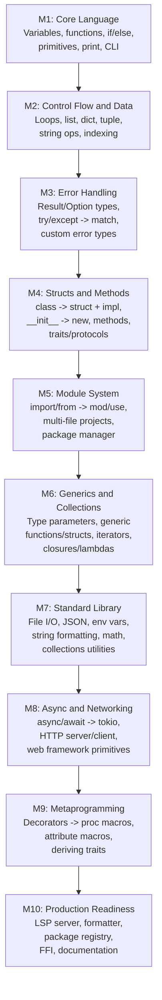
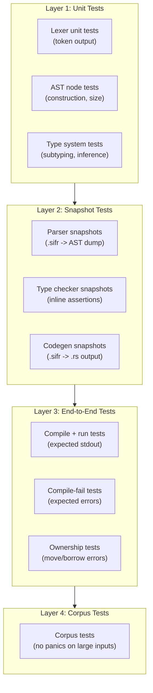

# Sifr Compiler -- Architecture and Implementation Plan

## Vision

Sifr is a compiled programming language that uses Python syntax with enforced static typing. It compiles Python-like source code to Rust source code, which is then compiled by `rustc` into native binaries. Ownership semantics follow Rust's move-by-default model. Types are strict with an opt-in `Any` escape hatch (like TypeScript's strict mode).

The end goal is a language capable of building web applications and general-purpose programs -- anywhere Python is used today, but with native performance and compile-time safety.

## Compiler Pipeline


## Milestone Roadmap




---

## Crate Structure (Rust Workspace)

```
sifr/
  Cargo.toml                (workspace root)
  crates/
    sifr_text_size/         (forked from ruff_text_size)
    sifr_source_file/       (forked from ruff_source_file)
    sifr_python_trivia/     (forked from ruff_python_trivia)
    sifr_python_ast/        (forked from ruff_python_ast)
    sifr_python_parser/     (forked from ruff_python_parser)
    sifr_python_literal/    (forked from ruff_python_literal)
    sifr_hir/               (High-level IR: typed AST after name resolution + type checking)
    sifr_type_system/       (type definitions, inference, checking, subtyping)
    sifr_codegen/           (Rust source code generation from HIR)
    sifr_driver/            (orchestrates the pipeline, error reporting)
    sifr/                   (CLI binary: sifr build, sifr check, sifr run)
```

New crates added per milestone as needed (e.g. `sifr_std`, `sifr_lsp`, `sifr_fmt`).

---

## M1: Core Language (First Working Compiler)

**Goal:** Compile a simple program with variables, functions, basic types, and branching to a native binary.

### Language Features

- **Types:** `int`, `float`, `bool`, `str`, `None`
- **Literals:** integer, float, string, boolean, None
- **Variables:** typed declarations (`x: int = 5`), inferred declarations (`x = 5`)
- **Functions:** typed parameters and return types, recursion
- **Expressions:** arithmetic (`+`, `-`, `*`, `/`, `//`, `%`), comparison (`==`, `!=`, `<`, `>`, `<=`, `>=`), boolean (`and`, `or`, `not`), string concatenation
- **Statements:** assignment, return, expression statements, `if`/`elif`/`else`
- **Built-in:** `print()` function
- **Entry point:** `main()` function as program entry
- **Move semantics:** move on assignment for `str`, copy for primitives (`int`, `float`, `bool`)
- **CLI:** `sifr build`, `sifr run`, `sifr check`, `sifr emit`

### Implementation Steps

1. Fork and rename 6 ruff crates into `crates/` with `sifr_` prefix
2. Strip the AST to M1-relevant nodes only
3. Build `sifr_type_system` -- Type enum, inference from initializers, checking binary ops / function calls
4. Build `sifr_hir` -- Typed IR with name resolution and ownership tracking
5. Build `sifr_codegen` -- Emit Rust source code, generate Cargo.toml + main.rs
6. Build `sifr_driver` -- Orchestrate the pipeline with nice error diagnostics
7. Build `sifr` CLI binary with clap
8. End-to-end tests (hello world, factorial, fibonacci)

### Example Program

```python
def factorial(n: int) -> int:
    if n <= 1:
        return 1
    return n * factorial(n - 1)

def main():
    x: int = factorial(5)
    print(x)
```

### Type Mapping (M1)

- `int` -> `i64`
- `float` -> `f64`
- `bool` -> `bool`
- `str` -> `String`
- `None` -> `()`

---

## M2: Control Flow and Data Structures

**Goal:** Support loops and compound data types so programs can process collections of data.

### Language Features

- **Loops:** `while` loop, `for` loop over ranges and iterables
- **Data types:** `list[T]`, `dict[K, V]`, `tuple[T, ...]`
- **Indexing:** `my_list[0]`, `my_dict["key"]`
- **Slicing:** `my_list[1:3]`
- **String operations:** `.len()`, `.upper()`, `.lower()`, `.split()`, `.strip()`, f-strings
- **Type inference:** infer collection element types from usage
- `**in` operator:** membership testing
- `**range()` built-in**
- **Multiple assignment:** `a, b = 1, 2` (tuple unpacking)

### Example Program

```python
def sum_list(numbers: list[int]) -> int:
    total: int = 0
    for n in numbers:
        total = total + n
    return total

def main():
    nums: list[int] = [1, 2, 3, 4, 5]
    result: int = sum_list(nums)
    print(f"Sum: {result}")
```

### Type Mapping (New)

- `list[T]` -> `Vec<T>`
- `dict[K, V]` -> `std::collections::HashMap<K, V>`
- `tuple[A, B, C]` -> `(A, B, C)`
- `range(n)` -> `0..n`

---

## M3: Error Handling

**Goal:** Provide safe error handling that maps to Rust's `Result`/`Option` types rather than Python's exception model.

### Language Features

- `**Result[T, E]` type:** explicit error return type (replaces exceptions)
- `**Option[T]` type:** sugar for `T | None`, maps to Rust `Option<T>`
- `**try`/`except` syntax:** reinterpreted as pattern matching on `Result`
- `**?` operator:** early return on error (borrowed from Rust, new syntax for Sifr)
- `**raise` -> `Err()`:** raising maps to returning an error
- **Custom error types:** classes that implement an `Error` protocol
- `**assert` statement**

### Design Decision

Sifr does NOT use Python's exception model (stack unwinding). Instead, errors are values:

```python
def parse_int(s: str) -> Result[int, str]:
    # ...implementation...
    raise "not a number"   # becomes Err("not a number".to_string())

def main():
    result = parse_int("42")?   # early return on error
    print(result)
```

This maps cleanly to Rust's `Result<T, E>` and `?` operator.

---

## M4: Structs and Methods (OOP)

**Goal:** Support class-based programming that compiles to Rust structs with impl blocks.

### Language Features

- `**class` -> `struct` + `impl`:** class definitions become Rust structs
- `**__init__` -> `new()`:** constructor mapping
- **Methods:** `self` parameter maps to `&self` or `&mut self`
- **Properties:** `@property` maps to getter methods
- **Protocols/Interfaces:** `Protocol` classes map to Rust traits
- `**isinstance` -> type narrowing:** compile-time type checking
- **Inheritance:** single inheritance via trait delegation (not Rust inheritance, which doesn't exist)
- **Operator overloading:** `__add__`, `__eq__`, etc. map to Rust trait impls (`Add`, `PartialEq`)

### Example Program

```python
class Point:
    x: float
    y: float

    def __init__(self, x: float, y: float):
        self.x = x
        self.y = y

    def distance(self, other: Point) -> float:
        dx: float = self.x - other.x
        dy: float = self.y - other.y
        return (dx * dx + dy * dy) ** 0.5

def main():
    p1 = Point(0.0, 0.0)
    p2 = Point(3.0, 4.0)
    print(p1.distance(p2))  # 5.0
```

### Generated Rust

```rust
struct Point {
    x: f64,
    y: f64,
}

impl Point {
    fn new(x: f64, y: f64) -> Self {
        Self { x, y }
    }

    fn distance(&self, other: &Point) -> f64 {
        let dx: f64 = self.x - other.x;
        let dy: f64 = self.y - other.y;
        (dx * dx + dy * dy).sqrt()
    }
}
```

---

## M5: Module System

**Goal:** Support multi-file projects with imports, enabling real application structure.

### Language Features

- `**import` / `from ... import`:** maps to Rust `mod` / `use`
- **Multi-file compilation:** compile a directory of `.sifr` files into one binary
- **Package structure:** `__init__.sifr` defines a package (like `mod.rs`)
- **Visibility:** `_private` prefix convention enforced as `pub`/non-`pub`
- `**sifr.toml`:** project manifest (like `Cargo.toml` + `pyproject.toml`)
- **Dependency management:** `sifr add <package>`, resolve from a registry or git

### Project Structure

```
my_app/
  sifr.toml
  src/
    main.sifr
    models/
      __init__.sifr
      user.sifr
    utils/
      __init__.sifr
      helpers.sifr
```

### Example

```python
# src/models/user.sifr
class User:
    name: str
    email: str

    def __init__(self, name: str, email: str):
        self.name = name
        self.email = email

# src/main.sifr
from models.user import User

def main():
    user = User("Alice", "alice@example.com")
    print(user.name)
```

---

## M6: Generics and Advanced Types

**Goal:** Support generic programming, closures, and advanced type system features.

### Language Features

- **Generic functions:** `def first[T](items: list[T]) -> T`
- **Generic classes:** `class Stack[T]:`
- **Type bounds:** `def sort[T: Comparable](items: list[T])`
- **Closures / lambdas:** `lambda x: x + 1` maps to Rust closures
- **Higher-order functions:** `map`, `filter`, `reduce` on collections
- **Iterators:** `__iter__` / `__next__` protocol maps to Rust `Iterator` trait
- **Union types:** `int | str` maps to Rust enums
- **Type aliases:** `type UserId = int`
- **Literal types:** `Literal["GET", "POST"]`

### Example Program

```python
def map_list[T, U](items: list[T], f: (T) -> U) -> list[U]:
    result: list[U] = []
    for item in items:
        result.append(f(item))
    return result

def main():
    numbers: list[int] = [1, 2, 3, 4, 5]
    doubled = map_list(numbers, lambda x: x * 2)
    print(doubled)
```

---

## M7: Standard Library

**Goal:** Provide essential built-in functionality for real programs.

### Modules

- `**sifr.io`:** file read/write, stdin/stdout, path operations
- `**sifr.json`:** JSON serialization/deserialization (wraps `serde_json`)
- `**sifr.env`:** environment variables
- `**sifr.fmt`:** string formatting, f-string internals
- `**sifr.math`:** math functions (sqrt, pow, abs, min, max, etc.)
- `**sifr.collections`:** `Set`, `OrderedDict`, `Deque`
- `**sifr.time`:** timestamps, durations, sleep
- `**sifr.random`:** random number generation
- `**sifr.os`:** process spawning, signals, exit codes
- `**sifr.re`:** regular expressions (wraps `regex` crate)

### Implementation Strategy

Each stdlib module is a thin Sifr wrapper around battle-tested Rust crates:

- `sifr.json` -> `serde` + `serde_json`
- `sifr.re` -> `regex`
- `sifr.time` -> `std::time` + `chrono`
- `sifr.io` -> `std::fs` + `std::io`

---

## M8: Async and Networking

**Goal:** Support async programming and HTTP, enabling web applications.

### Language Features

- `**async def` / `await`:** maps to Rust `async fn` / `.await`
- **Async runtime:** built on `tokio`
- `**sifr.http`:** HTTP client and server primitives
- `**sifr.net`:** TCP/UDP sockets
- `**sifr.web`:** minimal web framework (routing, request/response, middleware)

### Example: Web Application

```python
from sifr.web import App, Request, Response

app = App()

@app.route("/")
async def index(req: Request) -> Response:
    return Response.text("Hello, World!")

@app.route("/users/{id}")
async def get_user(req: Request) -> Response:
    user_id: str = req.params["id"]
    return Response.json({"id": user_id, "name": "Alice"})

def main():
    app.run(host="0.0.0.0", port=8000)
```

### Generated Rust (Conceptual)

The web framework layer wraps `axum` or `hyper`:

```rust
use axum::{Router, routing::get, response::IntoResponse};

async fn index() -> impl IntoResponse {
    "Hello, World!"
}

#[tokio::main]
async fn main() {
    let app = Router::new().route("/", get(index));
    let listener = tokio::net::TcpListener::bind("0.0.0.0:8000").await.unwrap();
    axum::serve(listener, app).await.unwrap();
}
```

---

## M9: Metaprogramming

**Goal:** Support decorators and compile-time code generation.

### Language Features

- **Decorators:** `@decorator` maps to Rust attribute macros or code transforms
- `**@dataclass`:** auto-generate `__init__`, `__eq__`, `__repr__` (like Rust `#[derive]`)
- `**@property`:** getter/setter generation
- **Custom decorators:** user-defined compile-time transforms
- `***args` / `**kwargs`:** variadic arguments via macro expansion or trait objects
- **Compile-time evaluation:** `const` expressions evaluated at compile time

### Example

```python
@dataclass
class Config:
    host: str
    port: int
    debug: bool = False

# Auto-generates __init__, __eq__, __repr__, clone
# Maps to Rust #[derive(Debug, Clone, PartialEq)] struct
```

---

## M10: Production Readiness

**Goal:** Make Sifr a complete, usable language ecosystem.

### Tooling

- **LSP server (`sifr_lsp`):** autocomplete, go-to-definition, hover types, diagnostics
- **Formatter (`sifr fmt`):** opinionated code formatter (like `ruff format` / `rustfmt`)
- **Linter (`sifr lint`):** catch common mistakes beyond type errors
- **Package registry:** `sifr.dev` -- publish and install packages
- **Documentation generator:** `sifr doc` -- generate HTML docs from docstrings
- **REPL:** `sifr repl` -- interactive mode (compile-and-run snippets)

### Interop

- **Rust FFI:** call Rust crates directly from Sifr code
- **C FFI:** call C libraries via `unsafe` blocks
- **Python interop (stretch):** call Python libraries via PyO3 bindings

### Performance

- **Incremental compilation:** only recompile changed modules
- **Build caching:** cache generated Rust code and compiled artifacts
- **Parallel compilation:** compile independent modules in parallel

---

## Milestone Summary

```
M1:  Core Language           -> "Hello World" compiles to native binary
M2:  Control Flow + Data     -> Process collections, loops, real algorithms
M3:  Error Handling          -> Safe error propagation via Result/Option
M4:  Structs + Methods       -> Object-oriented programming, data modeling
M5:  Module System           -> Multi-file projects, packages, dependencies
M6:  Generics + Closures     -> Generic programming, higher-order functions
M7:  Standard Library        -> File I/O, JSON, time, regex, OS operations
M8:  Async + Networking      -> Web servers, HTTP clients, async I/O
M9:  Metaprogramming         -> Decorators, dataclasses, compile-time code gen
M10: Production Readiness    -> LSP, formatter, package registry, FFI
```

After M8, Sifr can build web applications. After M10, it is a complete language ecosystem.

---

## Type System Design

### Core Types (Full)

```rust
enum Type {
    // Primitives (Copy)
    Int,
    Float,
    Bool,
    Str,
    None,

    // Compound (Move)
    List(Box<Type>),
    Dict(Box<Type>, Box<Type>),
    Tuple(Vec<Type>),
    Set(Box<Type>),

    // Optional / Union / Intersection
    Optional(Box<Type>),        // sugar for Union(T, None)
    Union(Vec<Type>),
    Intersection(Vec<Type>),

    // Function
    Function(FunctionType),

    // Class instance
    Instance(ClassId),

    // Generics
    TypeVar(TypeVarId),
    GenericInstance(ClassId, Vec<Type>),

    // Result / Option
    Result(Box<Type>, Box<Type>),
    Option(Box<Type>),

    // Escape hatch
    Any,

    // Bottom
    Never,
}
```

### Ownership Model

- All types are **move by default** (like Rust)
- Primitive types (`int`, `float`, `bool`) are `Copy` -- assignment copies
- Compound types (`str`, `list`, `dict`, classes) **move** on assignment
- Explicit `.clone()` for deep copy
- References via `ref` keyword (maps to `&T`)
- Mutable references via `mut ref` (maps to `&mut T`)
- Function arguments: move by default, use `ref` for borrowing

### Type Inference Strategy

- **Initializer inference:** `x = 42` infers `x: int`
- **Return type inference:** analyze all return paths
- **Contextual typing:** lambda params inferred from call-site
- **Enforced annotations:** function parameters MUST have types (or be inferable from defaults)

---

## Test Suite Architecture

This compiler is built entirely by AI agents. The test suite is the contract that ensures correctness across all agents working on different parts of the compiler. It must be:

- **Deterministic:** same input always produces same output
- **Self-documenting:** test files are readable specifications of language behavior
- **Layered:** each compiler phase has its own test layer
- **Easy to extend:** adding a new language feature means adding test files, not modifying test infrastructure
- **Fast to run:** `cargo test` completes in seconds for the full suite

### Testing Strategy Overview




### Layer 1: Unit Tests (per crate, `#[cfg(test)]`)

Standard Rust unit tests inside each crate. These test individual functions and data structures.

**Where:** `src/*.rs` in each crate, in `#[cfg(test)] mod tests { }` blocks.

**Examples:**

- Lexer: tokenize a string, assert token sequence
- AST: construct nodes, verify `Debug` output, check memory layout sizes
- Type system: `is_subtype(Int, Int) == true`, `is_subtype(Int, Str) == false`
- HIR: name resolution resolves `x` to the correct `DefId`

**Pattern (from ruff_python_ast):**

```rust
#[test]
fn size() {
    assert!(std::mem::size_of::<Stmt>() <= 120);
    assert_eq!(std::mem::size_of::<Expr>(), 64);
}
```

### Layer 2: Snapshot Tests (insta crate)

Snapshot testing using the `insta` crate. The compiler produces output that is compared against stored `.snap` files. When behavior changes intentionally, run `cargo insta review` to accept new baselines.

**Crate:** `insta` with `glob` feature.

#### 2a. Parser Snapshots

**Inspired by:** ruff_python_parser's fixture-driven snapshot tests.

**Directory structure:**

```
crates/sifr_python_parser/
  resources/
    valid/          # .sifr files that must parse successfully
      expressions/
        arithmetic.sifr
        boolean.sifr
        string.sifr
      statements/
        assignment.sifr
        if_else.sifr
        function_def.sifr
    invalid/        # .sifr files that must produce parse errors
      missing_colon.sifr
      bad_indent.sifr
      unterminated_string.sifr
  tests/
    snapshots/      # auto-generated .snap files
    fixtures.rs     # test harness
```

**Test harness (`fixtures.rs`):**

```rust
#[test]
fn test_valid_syntax() {
    insta::glob!("../resources/valid/**/*.sifr", |path| {
        let source = std::fs::read_to_string(path).unwrap();
        let parsed = parse_module(&source);
        assert!(parsed.is_valid(), "Parse errors: {:?}", parsed.errors());

        let mut output = String::new();
        writeln!(&mut output, "## AST\n\n```\n{:#?}\n```", parsed.syntax()).unwrap();

        insta::with_settings!({
            input_file => path,
            omit_expression => true,
        }, {
            insta::assert_snapshot!(output);
        });
    });
}

#[test]
fn test_invalid_syntax() {
    insta::glob!("../resources/invalid/**/*.sifr", |path| {
        let source = std::fs::read_to_string(path).unwrap();
        let parsed = parse_module(&source);
        assert!(!parsed.is_valid());

        let mut output = String::new();
        writeln!(&mut output, "## AST\n\n```\n{:#?}\n```", parsed.syntax()).unwrap();
        writeln!(&mut output, "\n## Errors\n").unwrap();
        for error in parsed.errors() {
            writeln!(&mut output, "  {}", error).unwrap();
        }

        insta::with_settings!({
            input_file => path,
        }, {
            insta::assert_snapshot!(output);
        });
    });
}
```

#### 2b. Type Checker Snapshots (Markdown Tests)

**Inspired by:** ty's mdtest framework -- Markdown files with inline assertions.

**Directory structure:**

```
crates/sifr_type_system/
  resources/
    mdtest/
      basics/
        literals.md
        variables.md
        arithmetic.md
      functions/
        parameters.md
        return_types.md
        inference.md
      ownership/
        move_semantics.md
        copy_types.md
        borrow.md
      errors/
        type_mismatch.md
        undefined_variable.md
  tests/
    mdtest.rs       # test harness using datatest-stable
```

**Markdown test format:**

```markdown
# Variable type inference

## Integer literal

`​`​`sifr
x = 42
reveal_type(x)  # revealed: int
`​`​`

## String literal

`​`​`sifr
name = "hello"
reveal_type(name)  # revealed: str
`​`​`

## Type mismatch

`​`​`sifr
x: int = "hello"  # error: [type-mismatch] expected `int`, got `str`
`​`​`

## Move semantics

`​`​`sifr
a: str = "hello"
b: str = a
print(a)  # error: [use-after-move] `a` was moved to `b`
`​`​`
```

**Assertion syntax:**

- `# revealed: <type>` -- assert inferred type (like ty)
- `# error: [rule-code] "optional message"` -- assert diagnostic
- `# error: <col> [rule-code]` -- assert diagnostic at specific column

#### 2c. Codegen Snapshots

**Inspired by:** TypeScript's `.js` baseline files.

**Directory structure:**

```
crates/sifr_codegen/
  resources/
    codegen/
      hello_world.sifr
      arithmetic.sifr
      functions.sifr
      if_else.sifr
      string_ops.sifr
  tests/
    snapshots/      # .snap files with expected Rust output
    codegen.rs      # test harness
```

**Test harness:**

```rust
#[test]
fn test_codegen() {
    insta::glob!("../resources/codegen/**/*.sifr", |path| {
        let source = std::fs::read_to_string(path).unwrap();
        let rust_output = compile_to_rust(&source).unwrap();

        insta::with_settings!({
            input_file => path,
        }, {
            insta::assert_snapshot!(rust_output);
        });
    });
}
```

**Snapshot content (e.g. `hello_world.sifr.snap`):**

```
---
source: crates/sifr_codegen/tests/codegen.rs
input_file: crates/sifr_codegen/resources/codegen/hello_world.sifr
---
fn main() {
    println!("{}", "Hello, World!");
}
```

### Layer 3: End-to-End Tests (Compile + Run)

**Inspired by:** Mojo's Lit + FileCheck pattern, adapted for Rust.

These tests compile `.sifr` files to binaries, run them, and check stdout/stderr.

**Directory structure:**

```
tests/
  e2e/
    pass/           # must compile and produce expected output
      hello_world.sifr
      factorial.sifr
      fibonacci.sifr
      arithmetic.sifr
      string_concat.sifr
      if_else.sifr
    fail/            # must fail to compile with expected errors
      type_mismatch.sifr
      undefined_var.sifr
      missing_return_type.sifr
      use_after_move.sifr
    ownership/       # ownership-specific compile failures
      move_on_assign.sifr
      double_move.sifr
      borrow_after_move.sifr
  e2e.rs             # test runner
```

**Test file format (pass tests) -- inline expected output:**

```python
# expect-stdout: 120
def factorial(n: int) -> int:
    if n <= 1:
        return 1
    return n * factorial(n - 1)

def main():
    print(factorial(5))
```

**Test file format (fail tests) -- inline expected errors:**

```python
# expect-error: [type-mismatch]
def main():
    x: int = "hello"
```

**Test runner (`e2e.rs`):**

```rust
#[test]
fn test_e2e_pass() {
    for path in glob("tests/e2e/pass/**/*.sifr") {
        let source = fs::read_to_string(&path).unwrap();
        let expected_stdout = extract_expect_stdout(&source);

        // Compile to Rust, build, and run
        let output = compile_and_run(&path).unwrap();
        assert_eq!(output.stdout.trim(), expected_stdout,
            "Failed: {}", path.display());
    }
}

#[test]
fn test_e2e_fail() {
    for path in glob("tests/e2e/fail/**/*.sifr") {
        let source = fs::read_to_string(&path).unwrap();
        let expected_errors = extract_expect_errors(&source);

        let result = compile(&path);
        assert!(result.is_err());
        for expected in expected_errors {
            assert!(result.errors().any(|e| e.code() == expected));
        }
    }
}
```

### Layer 4: Corpus Tests (Robustness)

**Inspired by:** ty's corpus tests -- ensure the compiler doesn't panic on large/varied inputs.

**Purpose:** Run the parser and type checker on a large body of Python source code to catch panics, infinite loops, and crashes. These tests don't check correctness -- only that the compiler doesn't blow up.

**Sources:**

- Ruff's parser test fixtures (`/Users/yaseralnajjar/work/sifr/ruff/crates/ruff_python_parser/resources/`)
- Python stdlib source files
- Any `.sifr` files in the test suite

```rust
#[test]
fn corpus_no_panics() {
    for path in glob("tests/corpus/**/*.sifr") {
        let source = fs::read_to_string(&path).unwrap();
        // Must not panic
        let _ = parse_module(&source);
    }
}
```

### Test Infrastructure Crate: `sifr_test_utils`

A shared crate providing test helpers used across all other crates:

```
crates/sifr_test_utils/
  src/
    lib.rs
    assertions.rs    # extract_expect_stdout, extract_expect_errors
    compile.rs       # compile_to_rust, compile_and_run helpers
    fixtures.rs      # fixture loading, glob helpers
    mdtest.rs        # markdown test parser (inline assertions)
```

**Key functions:**

- `extract_expect_stdout(source: &str) -> &str` -- parse `# expect-stdout:` header
- `extract_expect_errors(source: &str) -> Vec<&str>` -- parse `# expect-error:` comments
- `compile_to_rust(source: &str) -> Result<String, Vec<Diagnostic>>` -- full pipeline
- `compile_and_run(path: &Path) -> Result<Output, Error>` -- compile, build, execute
- `parse_mdtest(markdown: &str) -> Vec<TestCase>` -- parse markdown test files

### Test Commands

```bash
# Run all tests
cargo test

# Run specific layer
cargo test -p sifr_python_parser           # Parser snapshots
cargo test -p sifr_type_system -- mdtest    # Type checker markdown tests
cargo test -p sifr_codegen                  # Codegen snapshots
cargo test --test e2e                       # End-to-end tests

# Update snapshots after intentional changes
cargo insta review

# Run corpus tests (slower)
cargo test -- corpus --ignored
```

### Adding Tests for New Features (Agent Workflow)

When an AI agent adds a new language feature, it must:

1. **Parser:** Add `.sifr` fixture files in `resources/valid/` and `resources/invalid/`
2. **Type checker:** Add markdown test cases in `resources/mdtest/`
3. **Codegen:** Add `.sifr` fixture files in `resources/codegen/`
4. **E2E:** Add pass/fail test files in `tests/e2e/`
5. **Run `cargo insta review**` to accept new snapshots
6. **Run `cargo test**` to verify everything passes

This ensures every feature is tested at every layer of the compiler, and any agent can verify the full system by running `cargo test`.

---

## Design Note: Mojo Comparison

Mojo (`/Users/yaseralnajjar/work/sifr/modular/mojo`) was evaluated as a reference. Key findings:

- **No Rust code to reuse.** Mojo's compiler is proprietary, built on MLIR/LLVM (C++). The open-source repo only contains the stdlib, docs, and design proposals.
- **Ownership model difference:** Mojo chose **borrow-by-default** for function arguments. Sifr uses **move-by-default** (like Rust). This is a deliberate tradeoff -- Sifr prioritizes Rust-like safety and explicitness.
- **Useful design references:** `proposals/value-ownership.md` and `proposals/lifetimes-and-provenance.md` document tradeoffs between move/borrow defaults, ASAP destruction, and lifecycle methods.
- `**def` vs `fn` split:** Mojo uses `def` for dynamic and `fn` for strict. Sifr does not need this split since all code is strictly typed.

## Key Files to Reference During Implementation

- **Ruff parser:** `/Users/yaseralnajjar/work/sifr/ruff/crates/ruff_python_parser/`
- **Ruff AST:** `/Users/yaseralnajjar/work/sifr/ruff/crates/ruff_python_ast/src/nodes.rs`
- **ty type system:** `/Users/yaseralnajjar/work/sifr/ty/ruff/crates/ty_python_semantic/src/types.rs`
- **TypeScript checker architecture:** `/Users/yaseralnajjar/work/sifr/TypeScript.wiki/`
- **Mojo ownership design:** `/Users/yaseralnajjar/work/sifr/modular/mojo/proposals/value-ownership.md`
- **Mojo lifetimes design:** `/Users/yaseralnajjar/work/sifr/modular/mojo/proposals/lifetimes-and-provenance.md`

