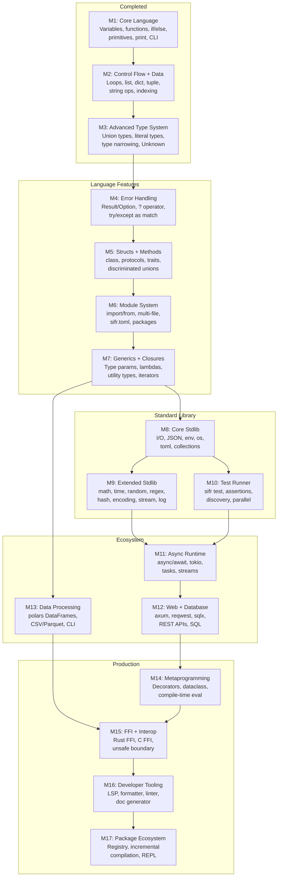
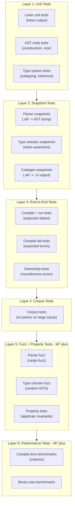

# Sifr Compiler -- Architecture and Implementation Plan

## Vision

Sifr is a compiled programming language that uses Python syntax with enforced static typing. It compiles Python-like source code to Rust source code, which is then compiled by `rustc` into native binaries. Ownership semantics follow Rust's move-by-default model. Types are strict with an opt-in `Any` escape hatch (like TypeScript's strict mode).

The type system draws heavily from TypeScript's design: union and intersection types, literal types, and full control-flow-based type narrowing are first-class citizens. Unlike TypeScript (which erases types at runtime), sifr uses types to generate efficient Rust code -- union types become Rust enums, narrowing becomes `match` expressions, and literal types enable compile-time value checking.

The end goal is a language capable of building web applications and general-purpose programs -- anywhere Python is used today, but with native performance and compile-time safety.

## Compiler Pipeline


## Milestone Roadmap




**Rationale for milestone order:**

- **M3 before M4:** Union types are prerequisites for `Result[T, E]` and `Option[T]`
- **M7 before M8-M13:** Generics and closures are needed for stdlib APIs
- **M8 before M9/M10:** Core stdlib (I/O, JSON, env, os) establishes the stdlib pattern and provides foundations that the extended stdlib and test runner build on
- **M9 parallel to M10:** Extended stdlib (math, time, regex, etc.) and the test runner both depend on M8 but not on each other -- they can be developed in parallel
- **M9/M10 before M11:** Async runtime needs the full stdlib and test runner in place
- **M11 before M12:** Async runtime is needed for web framework and database access
- **M13 parallel to M12:** Data processing (polars) doesn't depend on web/async, only on generics and modules
- **M14-M17 last:** Metaprogramming, FFI, tooling, and ecosystem polish come after the language and ecosystem are functional
- **M15 before M16:** FFI unlocks access to the full Rust crate ecosystem; developer tooling benefits from a stable language surface
- **M16 before M17:** LSP and formatter should exist before the package registry launches, so published packages have consistent quality

---

## Crate Structure (Rust Workspace)

**Hybrid dependency approach:** Infrastructure crates are referenced as git dependencies from ruff v0.4.10 (unmodified). Parser and AST crates are vendored forks that may diverge from Python syntax in future milestones.

```
sifr/
  Cargo.toml                (workspace root)
  crates/
    sifr_python_ast/        (vendored fork of ruff_python_ast -- may diverge for sifr syntax)
    sifr_python_parser/     (vendored fork of ruff_python_parser -- may diverge for sifr syntax)
    sifr_hir/               (High-level IR: typed AST after name resolution + type checking)
    sifr_type_system/       (type definitions, inference, checking, subtyping)
    sifr_codegen/           (Rust source code generation from HIR)
    sifr_driver/            (orchestrates the pipeline, error reporting)
    sifr/                   (CLI binary: sifr build, sifr check, sifr run)

  # Git dependencies from ruff v0.4.10 (not vendored):
  #   ruff_text_size          -- text span/range utilities
  #   ruff_source_file        -- source file representation, line indexing
  #   ruff_python_trivia      -- whitespace/comment handling
  #   ruff_python_literal     -- literal parsing (string escapes, number formats)
```

New crates added per milestone as needed:

- M8: `sifr_std` (standard library wrappers)
- M15: FFI codegen extensions in `sifr_codegen`
- M16: `sifr_lsp` (language server), `sifr_fmt` (formatter), `sifr_lint` (linter)
- M17: `sifr_registry` (package registry client)

---

## M1: Core Language (First Working Compiler)

**Goal:** Compile a simple program with variables, functions, basic types, and branching to a native binary.

### Language Features

- **Types:** `int`, `float`, `bool`, `str`, `None`
- **Literals:** integer, float, string, boolean, None
- **Variables:** typed declarations (`x: int = 5`), inferred declarations (`x = 5`)
- **Functions:** typed parameters and return types, recursion
- **Expressions:** arithmetic (`+`, `-`, `*`, `/`, `//`, `%`), comparison (`==`, `!=`, `<`, `>`, `<=`, `>=`), boolean (`and`, `or`, `not`), string concatenation
- **Statements:** assignment, return, expression statements, `if`/`elif`/`else`
- **Built-in:** `print()` function
- **Entry point:** `main()` function as program entry
- **Move semantics:** move on assignment for `str`, copy for primitives (`int`, `float`, `bool`)
- **CLI:** `sifr build`, `sifr run`, `sifr check`, `sifr emit`

### Implementation Steps

1. Fork ruff parser/AST crates into `crates/` with `sifr_` prefix; use git deps for infrastructure crates
2. Strip the AST to M1-relevant nodes only
3. Build `sifr_type_system` -- Type enum, inference from initializers, checking binary ops / function calls
4. Build `sifr_hir` -- Typed IR with name resolution and ownership tracking
5. Build `sifr_codegen` -- Emit Rust source code, generate Cargo.toml + main.rs
6. Build `sifr_driver` -- Orchestrate the pipeline with nice error diagnostics
7. Build `sifr` CLI binary with clap
8. End-to-end tests (hello world, factorial, fibonacci)

### Example Program

```python
def factorial(n: int) -> int:
    if n <= 1:
        return 1
    return n * factorial(n - 1)

def main():
    x: int = factorial(5)
    print(x)
```

### Type Mapping (M1)

- `int` -> `i64`
- `float` -> `f64`
- `bool` -> `bool`
- `str` -> `String`
- `None` -> `()`

---

## M2: Control Flow and Data Structures

**Goal:** Support loops and compound data types so programs can process collections of data.

### Language Features

- **Loops:** `while` loop, `for` loop over ranges and iterables
- **Data types:** `list[T]`, `dict[K, V]`, `tuple[T, ...]`
- **Indexing:** `my_list[0]`, `my_dict["key"]`
- **Slicing:** `my_list[1:3]`
- **String operations:** `.len()`, `.upper()`, `.lower()`, `.split()`, `.strip()`, f-strings
- **Type inference:** infer collection element types from usage
- `**in` operator:** membership testing
- `**range()` built-in**
- **Multiple assignment:** `a, b = 1, 2` (tuple unpacking)

### Example Program

```python
def sum_list(numbers: list[int]) -> int:
    total: int = 0
    for n in numbers:
        total = total + n
    return total

def main():
    nums: list[int] = [1, 2, 3, 4, 5]
    result: int = sum_list(nums)
    print(f"Sum: {result}")
```

### Type Mapping (New)

- `list[T]` -> `Vec<T>`
- `dict[K, V]` -> `std::collections::HashMap<K, V>`
- `tuple[A, B, C]` -> `(A, B, C)`
- `range(n)` -> `0..n`

---

## M3: Advanced Type System

**Goal:** Add union types, intersection types, literal types, and full control-flow-based type narrowing to the sifr compiler. This makes sifr's type system as expressive as TypeScript's while compiling to Rust.

### Why M3 (before Error Handling)

Union types, literal types, and type narrowing are **prerequisites** for clean error handling and later milestones:

- M4's `Result[T, E]` and `Option[T]` are union-based types
- M5's discriminated unions (e.g., `Shape` with a `.tag` field) need narrowing
- M7's generics need type bounds with unions
- Every milestone after M3 benefits from the advanced type system

### Syntax Design Principles

Sifr reuses familiar syntax from Python, TypeScript, and Rust rather than inventing new constructs:

- **Python-first:** if Python has syntax for it, use that (`isinstance`, `is None`, `type` statement)
- **TypeScript for types:** where Python's typing module is verbose, borrow TypeScript's cleaner syntax (values as types: `"GET" | "POST"` instead of `Literal["GET"] | Literal["POST"]`)
- **No redundant sugar:** one way to do things. `str | None` for optionals, no `T?` shorthand
- **No user-facing syntax for internal features:** intersection types are internal to the narrowing engine, not exposed as `A & B` syntax

### Language Features

- **Union types:** `int | str`, `A | B | C` -- a value can be one of several types (Python 3.10+ syntax)
- **Literal types:** values used directly as types in type position (TypeScript style):

```python
type HttpMethod = "GET" | "POST" | "PUT" | "DELETE"
type StatusCode = 200 | 404 | 500
type Toggle = True | False
```

- **Type aliases:** `type UserId = int`, `type HttpMethod = "GET" | "POST"` (Python 3.12 `type` statement)
- **Optional types:** `str | None` -- no shorthand, just Python's union-with-None (Python 3.10+ syntax)
- `**Unknown` type:** safe top type -- accepts any value but must be narrowed (via `isinstance`, equality, etc.) before use. Unlike `Any` which opts out of type checking, `Unknown` forces the programmer to prove the type before operating on it
- **Type narrowing via control flow analysis:**
  - Truthiness checks: `if x:` narrows `x: str | None` to `x: str`
  - `isinstance()` checks: `if isinstance(x, int):` narrows union (Python built-in)
  - Equality checks: `if x == "GET":` narrows `x: str` to `x: "GET"` in the then-branch
  - `is None` / `is not None` checks (Python idiom)
  - `not` negation: else branches get the complement type
- **Type predicates:** user-defined narrowing via return type annotation (Python typing style):

```python
def is_string(x: int | str) -> TypeGuard[str]:
    return isinstance(x, str)

# Usage: if is_string(val): ... val is str here
```

- `**reveal_type()` built-in:** prints inferred type at compile time (same as mypy/pyright)
- `**never` exhaustiveness:** matching all union variants leaves `never` -- compiler error if not exhaustive
- **Intersection types:** internal to the narrowing engine only. No user-facing `A & B` syntax in M3. Exposed later when protocols land in M5

Note: **Discriminated unions** (union of structs with a shared tag field) are deferred to M5 when classes exist. M3 focuses on unions of primitive/literal types with narrowing via isinstance and equality.

### Compiler Architecture Changes

#### Type System Changes

Extend the `Type` enum in `crates/sifr_type_system/src/types.rs`:

```rust
enum Type {
    // ... existing types ...

    // Union: value is one of these types
    Union(Vec<Type>),

    // Intersection: value satisfies all of these (internal, for narrowing)
    Intersection(Vec<Type>),

    // Literal types: specific values as types
    LiteralInt(i64),
    LiteralStr(String),
    LiteralBool(bool),

    // Optional sugar: T | None
    Optional(Box<Type>),

    // Type alias reference (resolved during checking)
    Alias(String, Box<Type>),

    // Safe top type: must be narrowed before use (unlike Any which opts out)
    Unknown,
}
```

Key design decisions:

- `Optional(T)` is sugar that normalizes to `Union(vec![T, None])` internally
- Union types are **flattened** and **deduplicated** (no nested unions)
- Literal types **widen** to their base type at mutable assignment (like TypeScript's fresh literal behavior)
- `Union` maps to Rust `enum` in codegen (auto-generated discriminated enum)
- `Unknown` vs `Any`: `Any` disables type checking (escape hatch). `Unknown` accepts any value but requires narrowing before any operation -- it is the safe alternative. `Unknown` maps to `Box<dyn Any>` in Rust codegen but the compiler enforces narrowing at every use site.

#### Control Flow Graph (new module: `sifr_hir/src/cfg.rs`)

**Inspired by TypeScript's binder** (see `/Users/yaseralnajjar/work/sifr/TypeScript-Compiler-Notes/codebase/src/compiler/binder.md`):

Build a control flow graph during HIR lowering. Each statement/expression gets a `FlowNode` that points to its antecedents:

```rust
enum FlowNode {
    Start,
    Assignment { var: String, ty: Type, antecedent: FlowNodeId },
    Condition { expr: HirExprId, true_branch: FlowNodeId, false_branch: FlowNodeId },
    Label { antecedents: Vec<FlowNodeId> },  // join point
    Unreachable,
}
```

#### Narrowing Engine (new module: `sifr_type_system/src/narrow.rs`)

**Inspired by TypeScript's checker narrowing** (see `/Users/yaseralnajjar/work/sifr/TypeScript-Compiler-Notes/codebase/src/compiler/checker-widening-narrowing.md`) and **ty's intersection-based narrowing**:

```rust
/// Narrow a type based on a condition being true/false.
fn narrow_type(ty: &Type, condition: &NarrowingCondition, is_true: bool) -> Type

enum NarrowingCondition {
    Truthiness(VarId),                          // if x:
    IsNone(VarId),                              // if x is None
    IsNotNone(VarId),                           // if x is not None
    IsInstance(VarId, Type),                     // if isinstance(x, int)
    Equality(VarId, LiteralValue),              // if x == "GET"
    TypePredicate(VarId, Type),                 // user-defined guard
    AttributeEquality(VarId, String, LiteralValue), // if x.tag == "circle"
    Not(Box<NarrowingCondition>),               // negation
    And(Vec<NarrowingCondition>),               // conjunction
    Or(Vec<NarrowingCondition>),                // disjunction
}
```

#### Scope Changes (update `sifr_hir/src/scope.rs`)

The scope must track **narrowed types** per variable at each point in the control flow:

```rust
struct VariableInfo {
    declared_type: Type,     // the annotation or inferred type
    narrowed_type: Type,     // current type after narrowing (starts = declared_type)
    is_moved: bool,
}
```

#### Codegen Changes (update `sifr_codegen/src/lib.rs`)

Union types map to Rust enums:

```python
# Sifr
x: int | str = 42
```

```rust
// Generated Rust
enum IntOrStr {
    Int(i64),
    Str(String),
}
let x: IntOrStr = IntOrStr::Int(42);
```

Narrowing maps to `match` or `if let`:

```python
# Sifr
def process(x: int | str):
    if isinstance(x, int):
        print(x + 1)     # x is int here
    else:
        print(x.upper())  # x is str here
```

```rust
// Generated Rust
fn process(x: IntOrStr) {
    match &x {
        IntOrStr::Int(x_val) => {
            println!("{}", x_val + 1);
        }
        IntOrStr::Str(x_val) => {
            println!("{}", x_val.to_uppercase());
        }
    }
}
```

### Example Programs (M3)

**Union types and narrowing:**

```python
type Shape = "circle" | "square"

def area(shape: Shape, size: float) -> float:
    if shape == "circle":
        return 3.14159 * size * size
    else:
        return size * size

def main():
    print(area("circle", 5.0))
    print(area("square", 4.0))
```

**Optional / None narrowing:**

```python
def find_user(name: str) -> str | None:
    if name == "alice":
        return "Alice Smith"
    return None

def main():
    user: str | None = find_user("alice")
    if user is not None:
        print(user.upper())   # narrowed to str
    else:
        print("not found")
```

**isinstance narrowing:**

```python
def describe(x: int | str) -> str:
    if isinstance(x, int):
        return f"number: {x + 1}"   # x is int here
    else:
        return f"text: {x.upper()}"  # x is str here

def main():
    print(describe(42))
    print(describe("hello"))
```

**Type predicates:**

```python
def is_nonempty(s: str | None) -> TypeGuard[str]:
    return s is not None and len(s) > 0

def main():
    name: str | None = "alice"
    if is_nonempty(name):
        print(name.upper())  # name narrowed to str
```

**Unknown type (safe top type):**

```python
def process(data: Unknown) -> str:
    if isinstance(data, str):
        return data.upper()       # narrowed to str
    if isinstance(data, int):
        return str(data)          # narrowed to int
    return "unknown"

def main():
    print(process("hello"))
    print(process(42))
```

### Files to Modify/Create for M3

**Modify:**

- `crates/sifr_type_system/src/types.rs` -- extend `Type` enum
- `crates/sifr_type_system/src/check.rs` -- type checking for unions
- `crates/sifr_type_system/src/infer.rs` -- inference with unions/literals
- `crates/sifr_hir/src/hir_nodes.rs` -- new HIR nodes for narrowing
- `crates/sifr_hir/src/lower.rs` -- lowering with CFG and narrowing
- `crates/sifr_hir/src/scope.rs` -- narrowed type tracking
- `crates/sifr_codegen/src/lib.rs` -- union -> enum codegen
- `crates/sifr_driver/src/lib.rs` -- pipeline updates

**Create:**

- `crates/sifr_type_system/src/narrow.rs` -- narrowing engine
- `crates/sifr_type_system/src/union.rs` -- union construction, normalization, simplification
- `crates/sifr_type_system/src/literal.rs` -- literal type handling, widening
- `crates/sifr_hir/src/cfg.rs` -- control flow graph
- E2E test files in `crates/sifr/tests/e2e/pass/` and `fail/`

---

## M4: Error Handling

**Goal:** Provide safe error handling that maps to Rust's `Result`/`Option` types rather than Python's exception model. Benefits from M3's union types -- `Result[T, E]` and `Option[T]` are union-based.

### Language Features

- `**Result[T, E]` type:** explicit error return type (replaces exceptions)
- `**Option[T]` type:** sugar for `T | None`, maps to Rust `Option<T>` (leverages M3's union types)
- `**try`/`except` syntax:** reinterpreted as pattern matching on `Result`
- `**?` operator:** early return on error (borrowed from Rust, new syntax for Sifr)
- `**raise` -> `Err()`:** raising maps to returning an error
- **Custom error types:** classes that implement an `Error` protocol
- `**assert` statement**

### Design Decision

Sifr does NOT use Python's exception model (stack unwinding). Instead, errors are values:

```python
def parse_int(s: str) -> Result[int, str]:
    # ...implementation...
    raise "not a number"   # becomes Err("not a number".to_string())

def main():
    result = parse_int("42")?   # early return on error
    print(result)
```

This maps cleanly to Rust's `Result<T, E>` and `?` operator.

### `except` Arm Matching Semantics

The `try`/`except` syntax is reinterpreted as pattern matching on `Result`. Each `except` arm matches a specific error type:

```python
try:
    data = read_file("config.json")?
    config = parse_json(data)?
except IOError as e:
    print(f"File error: {e}")
except ParseError as e:
    print(f"Parse error: {e}")
```

**Rules:**

- `except` arms are matched in order (like `match` arms in Rust)
- Each arm must specify a concrete error type (no bare `except:`)
- The compiler checks exhaustiveness: if the `Result`'s error type is a union `IOError | ParseError`, all variants must be handled (or a catch-all `except Error` must be present)
- `except` arms generate Rust `match` on the error enum variants (see Cross-cutting Contracts: Error Semantics Matrix)

### Typed Error Hierarchies

Error types are classes (M5 dependency for full class support, but M4 introduces the `Error` protocol):

```python
class AppError(Error):
    message: str

class ValueError(AppError):
    pass

class IOError(AppError):
    path: str
```

**Codegen:** Error types generate Rust enums (not structs with inheritance). `AppError` becomes `enum AppError { ValueError(ValueError), IOError(IOError) }`. The `Error` protocol maps to Rust's `std::error::Error` trait.

### Panic vs Result Boundary

- `**assert` statements:** generate `assert!()` or `panic!()` in Rust. These are unrecoverable and not catchable by `try`/`except`.
- **Rust library panics (M15 FFI):** caught at FFI boundaries via `catch_unwind` and converted to `Result::Err`. Sifr code never sees a panic from wrapped Rust crates.
- **Out-of-bounds indexing:** returns `Result` or `Option`, not a panic. `list[i]` returns `Option[T]`; `list.get(i)` is the safe accessor.

### Definition of Done (M4)

- `Result[T, E]` type compiles to `Result<T, E>` in Rust
- `?` operator works in functions returning `Result`
- `try`/`except` generates correct `match` on error variants
- `raise` inside a `Result`-returning function generates `Err(...)`
- `assert` generates `assert!()` / `panic!()`
- Exhaustiveness checking for `except` arms
- E2E pass tests: result_basic, option_chaining, error_propagation, try_except
- E2E fail tests: unhandled_error, non_exhaustive_except
- Unit tests for Result/Option type checking and inference
- Milestone demo in `./tmp/m4_demo.sifr`

---

## M5: Structs and Methods (OOP)

**Goal:** Support class-based programming that compiles to Rust structs with impl blocks. Benefits from M3's discriminated unions and narrowing.

### Design Decision: Nominal vs Structural Typing

Sifr uses **nominal typing by default** (like Rust) with **structural matching via protocols** (like TypeScript's interfaces):

- Two classes with identical fields are NOT automatically assignable to each other (nominal)
- A `Protocol` defines a structural contract -- any class that has the required fields/methods satisfies it (structural)
- This matches Rust's trait system: types are distinct, but traits provide shared interfaces

This is a deliberate middle ground between TypeScript (fully structural) and Rust (fully nominal). Protocols give the flexibility of structural typing where needed, while nominal classes prevent accidental type confusion.

### Language Features

- `**class` -> `struct` + `impl`:** class definitions become Rust structs
- `**__init__` -> `new()`:** constructor mapping
- **Methods:** `self` parameter maps to `&self` or `&mut self`
- **Properties:** `@property` maps to getter methods
- **Protocols/Interfaces:** `Protocol` classes map to Rust traits (structural matching -- any class with the right shape satisfies the protocol)
- `**isinstance` -> type narrowing:** compile-time type checking (leverages M3's narrowing)
- **Inheritance:** single inheritance via trait delegation (not Rust inheritance, which doesn't exist)
- **Operator overloading:** `__add__`, `__eq__`, etc. map to Rust trait impls (`Add`, `PartialEq`)
- **Discriminated unions:** classes with a shared literal-typed tag field, narrowed via attribute equality (leverages M3's narrowing engine):

```python
class Circle:
    tag: "circle" = "circle"
    radius: float

class Square:
    tag: "square" = "square"
    side: float

type Shape = Circle | Square

def area(shape: Shape) -> float:
    if shape.tag == "circle":
        return 3.14159 * shape.radius * shape.radius  # narrowed to Circle
    else:
        return shape.side * shape.side                  # narrowed to Square
```

- **Property existence narrowing (`in`):** `if "name" in obj:` narrows the type to one that has a `name` field (extends M3's narrowing to object properties)

### Example Program

```python
class Point:
    x: float
    y: float

    def __init__(self, x: float, y: float):
        self.x = x
        self.y = y

    def distance(self, other: Point) -> float:
        dx: float = self.x - other.x
        dy: float = self.y - other.y
        return (dx * dx + dy * dy) ** 0.5

def main():
    p1 = Point(0.0, 0.0)
    p2 = Point(3.0, 4.0)
    print(p1.distance(p2))  # 5.0
```

### Generated Rust

```rust
struct Point {
    x: f64,
    y: f64,
}

impl Point {
    fn new(x: f64, y: f64) -> Self {
        Self { x, y }
    }

    fn distance(&self, other: &Point) -> f64 {
        let dx: f64 = self.x - other.x;
        let dy: f64 = self.y - other.y;
        (dx * dx + dy * dy).sqrt()
    }
}
```

### Method Receiver Inference

The compiler automatically determines the Rust receiver type for each method based on body analysis (see Cross-cutting Contracts: Borrow and Lifetime Strategy):

- `self` only read -> `&self`
- `self` fields mutated -> `&mut self`
- `self` consumed (builder pattern, returned) -> `self` (move)

The programmer can override with explicit annotations: `def method(ref self)` or `def method(mut ref self)`.

### Runtime Type Representation for Classes

- **Class instances:** generate Rust `struct` with fields. `isinstance(x, MyClass)` is resolved at compile time via the type system (no runtime RTTI needed for concrete types).
- **Protocol/trait objects:** when a protocol is used as a parameter type, generate `&dyn Trait` or `Box<dyn Trait>`. This is the only dynamic dispatch for class types.
- **Discriminated union of classes:** generate Rust `enum` with one variant per class. Tag-based narrowing generates `match` on the tag field.

### Definition of Done (M5)

- `class` compiles to Rust `struct` + `impl`
- `__init__` maps to `new()` constructor
- Method receiver inference (`&self` / `&mut self` / `self`) works correctly
- `Protocol` compiles to Rust `trait`
- Discriminated unions with tag fields narrow correctly via `match`
- Operator overloading (`__add__`, `__eq__`) maps to Rust trait impls
- Single inheritance via trait delegation
- E2E pass tests: class_basic, protocol_dispatch, discriminated_union, operator_overload
- E2E fail tests: missing_field, protocol_not_satisfied, use_after_move_self
- Milestone demo in `./tmp/m5_demo.sifr`

---

## M6: Module System

**Goal:** Support multi-file projects with imports, enabling real application structure.

### Language Features

- `**import` / `from ... import`:** maps to Rust `mod` / `use`
- **Multi-file compilation:** compile a directory of `.sifr` files into one binary
- **Package structure:** `__init__.sifr` defines a package (like `mod.rs`)
- **Visibility:** `_private` prefix convention enforced as `pub`/non-`pub`
- `**sifr.toml`:** project manifest (like `Cargo.toml` + `pyproject.toml`)
- **Dependency management:** `sifr add <package>`, resolve from a registry or git

### Project Structure

```
my_app/
  sifr.toml
  sifr.lock          # auto-generated lockfile (committed to VCS)
  src/
    main.sifr
    models/
      __init__.sifr
      user.sifr
    utils/
      __init__.sifr
      helpers.sifr
```

### Import and Module Semantics

- **Import cycle detection:** the compiler builds a module dependency graph during compilation. Circular imports are a compile-time error with a clear diagnostic showing the cycle path (e.g., `a.sifr -> b.sifr -> c.sifr -> a.sifr`).
- `**__init__.sifr` semantics:** defines the public API of a package. Only symbols explicitly defined or re-exported in `__init__.sifr` are importable from outside the package. No side effects on import (unlike Python's `__init__.py` which executes on import).
- **Module compilation order:** topological sort of the dependency graph. Each module is compiled exactly once per compilation run. The driver maintains a module cache keyed by canonical file path.
- **Relative imports:** `from .utils import helper` works within a package. Relative imports cannot escape the package root.

### Package Management

- `**sifr.toml`:** project manifest with `[dependencies]` section. Version ranges use semver (e.g., `requests = "^1.2"`).
- `**sifr.lock`:** auto-generated lockfile with exact resolved versions, content hashes (SHA-256), and source URLs. Must be committed to version control for reproducible builds.
- **Version solver:** PubGrub-based algorithm (same as Cargo and uv). Resolves the full dependency graph with conflict detection and clear error messages.
- **Dependency sources (M6):** git repositories and local paths only. Registry support (`sifr.dev`) deferred to M17.
- `**sifr add <package>`:** adds a dependency to `sifr.toml` and resolves the lockfile.

### Example

```python
# src/models/user.sifr
class User:
    name: str
    email: str

    def __init__(self, name: str, email: str):
        self.name = name
        self.email = email

# src/main.sifr
from models.user import User

def main():
    user = User("Alice", "alice@example.com")
    print(user.name)
```

### Definition of Done (M6)

- `import` / `from ... import` compiles to Rust `mod` / `use`
- Multi-file projects compile into a single binary
- `__init__.sifr` controls package public API
- `_private` prefix enforced as non-`pub` in generated Rust
- Circular import detection with clear diagnostics
- `sifr.toml` parsed and used for project configuration
- `sifr.lock` generated with exact versions and content hashes
- `sifr add` resolves and updates lockfile
- E2E pass tests: multi_file_basic, package_import, relative_import
- E2E fail tests: circular_import, private_access, missing_module
- Milestone demo in `./tmp/m6_demo.sifr` (multi-file project)

---

## M7: Generics and Advanced Types

**Goal:** Support generic programming, closures, and higher-order functions. Union types and type aliases already exist from M3, so this focuses on parameterized types.

### Language Features

- **Generic functions:** `def first[T](items: list[T]) -> T` (Python 3.12 syntax)
- **Generic classes:** `class Stack[T]:` (Python 3.12 syntax)
- **Type bounds:** `def sort[T: Comparable](items: list[T])`
- **Closures / lambdas:** `lambda x: x + 1` maps to Rust closures
- **Contextual typing for lambdas:** lambda parameter types inferred from call-site context (e.g., `map_list(numbers, lambda x: x * 2)` infers `x: int` from `list[int]`)
- **Higher-order functions:** `map`, `filter`, `reduce` on collections
- **Iterators:** `__iter__` / `__next__` protocol maps to Rust `Iterator` trait
- **Utility types (TypeScript-inspired):** built-in type aliases for common transformations:
  - `Partial[T]` -- all fields optional (maps to `Option<field>` for each field)
  - `Readonly[T]` -- all fields immutable (maps to non-`mut` references)
  - `Pick[T, "field1", "field2"]` -- subset of fields
  - `Omit[T, "field1"]` -- all fields except specified
  - `Record[K, V]` -- sugar for `dict[K, V]`
- **Mapped/conditional types (stretch):** type-level programming

### Example Program

```python
def map_list[T, U](items: list[T], f: (T) -> U) -> list[U]:
    result: list[U] = []
    for item in items:
        result.append(f(item))
    return result

def main():
    numbers: list[int] = [1, 2, 3, 4, 5]
    doubled = map_list(numbers, lambda x: x * 2)
    print(doubled)
```

### Closure Capture Rules

Closure captures are inferred from usage inside the closure body (see Cross-cutting Contracts: Borrow and Lifetime Strategy):

- Read-only access to outer variable: capture by `&T`
- Mutation of outer variable: capture by `&mut T`
- Variable consumed or closure outlives scope: capture by value (move)
- Explicit `move` keyword forces capture by value: `move lambda x: x + captured_var`

### Definition of Done (M7)

- Generic functions with type parameters compile correctly (monomorphized)
- Generic classes with type parameters compile correctly
- Type bounds (`T: Protocol`) enforce constraints
- Lambda expressions compile to Rust closures
- Contextual typing infers lambda parameter types from call-site
- Closure capture inference works correctly (borrow vs move)
- Higher-order functions (`map`, `filter`) work with lambdas
- Iterator protocol (`__iter__` / `__next__`) maps to Rust `Iterator`
- E2E pass tests: generic_function, generic_class, lambda_basic, higher_order, iterator
- E2E fail tests: type_bound_violation, generic_mismatch
- Milestone demo in `./tmp/m7_demo.sifr`

---

## M8: Core Standard Library

**Goal:** Provide the foundational stdlib modules that almost every real program needs. This milestone establishes the pattern for how stdlib modules work: thin Sifr wrappers over battle-tested Rust crates, with auto-generated Cargo dependencies. No async dependency -- these are synchronous building blocks.

### Stdlib Modules

- `**sifr.io`:** file read/write, stdin/stdout, path operations -> wraps `std::fs` + `std::io` + `std::path`
- `**sifr.json`:** JSON serialization/deserialization -> wraps `serde` + `serde_json`
- `**sifr.toml`:** TOML config parsing -> wraps `toml` crate
- `**sifr.env`:** environment variables, dotenv loading -> wraps `std::env` + `dotenvy`
- `**sifr.os`:** process spawning, signals, exit codes, argv, shell commands -> wraps `std::process` + `std::env`
- `**sifr.collections`:** `Set`, `OrderedDict`, `Deque` -> wraps `std::collections`

**Why these first:** File I/O, JSON, config, and env vars are needed by virtually every non-trivial program. `sifr.os` enables process spawning (needed by the test runner in M10). `sifr.collections` extends the built-in types.

### Implementation Strategy

Each stdlib module is a thin Sifr wrapper around battle-tested Rust crates. The codegen emits `use` statements and function calls to the underlying Rust crate. The sifr compiler bundles these as Cargo dependencies in the generated project.

```python
# Sifr code
from sifr.json import loads, dumps
from sifr.io import read_file, write_file

def main():
    data: str = read_file("config.json")
    config: dict[str, str] = loads(data)
    print(config["name"])
```

### Definition of Done (M8)

- Each stdlib module has a working Sifr API that compiles to the underlying Rust crate
- `sifr.io`: file read/write, path operations work end-to-end
- `sifr.json`: serialize/deserialize dicts and lists
- `sifr.toml`: parse TOML config files
- `sifr.env`: read environment variables, dotenv loading
- `sifr.os`: process spawning, argv, exit codes
- `sifr.collections`: Set, OrderedDict, Deque operations
- Each module has integration tests verifying the Sifr API against the Rust crate behavior
- Generated Cargo.toml includes correct dependencies for used stdlib modules
- E2E pass tests: file_io, json_roundtrip, env_vars, os_process, collections_basic
- Milestone demo in `./tmp/m8_demo.sifr`

---

## M9: Extended Standard Library

**Goal:** Fill out the remaining stdlib modules -- utilities that are commonly needed but don't block other milestones. Uses the same stdlib infrastructure pattern established in M8.

### Stdlib Modules

- `**sifr.math`:** math functions (sqrt, pow, abs, min, max, floor, ceil, etc.) -> wraps `std::f64` + `num` traits
- `**sifr.time`:** timestamps, durations, sleep, formatting -> wraps `std::time` + `chrono`
- `**sifr.random`:** random number generation -> wraps `rand` crate
- `**sifr.re`:** regular expressions -> wraps `regex` crate
- `**sifr.hash`:** hashing (sha256, md5, etc.) -> wraps `sha2` + `md5` crates
- `**sifr.encoding`:** base64, hex, url encoding -> wraps `base64` + `hex` + `percent-encoding`
- `**sifr.stream`:** streaming read/write for large data -> wraps Rust's `Read`/`Write` traits with buffered readers/writers, line-by-line iteration, and pipe-style chaining
- `**sifr.log`:** structured logging -> wraps `tracing` crate

### Definition of Done (M9)

- `sifr.math`: basic math functions work (sqrt, pow, abs, min, max, floor, ceil)
- `sifr.time`: timestamps, durations, sleep, formatting work
- `sifr.random`: random number generation works
- `sifr.re`: regex match, search, replace work
- `sifr.hash`: sha256, md5 hashing works
- `sifr.encoding`: base64, hex, url encoding/decoding works
- `sifr.stream`: streaming read/write with line iteration and chaining
- `sifr.log`: structured logging with levels (debug, info, warn, error)
- Each module has integration tests verifying the Sifr API against the Rust crate behavior
- Generated Cargo.toml includes correct dependencies for used stdlib modules
- E2E pass tests: math_ops, time_basic, random_gen, regex_match, hash_sha256, encoding_base64, stream_lines, log_basic
- Milestone demo in `./tmp/m9_demo.sifr`

---

## M10: Built-in Test Runner

**Goal:** Ship a built-in test runner. Every modern language (Go, Rust, Bun, Deno) ships with a test runner -- Sifr does too. Tests are first-class citizens of the language.

### Test Syntax

```python
from sifr.test import test, assert_eq, assert_true, assert_raises

def test_addition():
    assert_eq(1 + 1, 2)

def test_string_upper():
    assert_eq("hello".upper(), "HELLO")

def test_division_by_zero():
    assert_raises(ValueError, lambda: 1 / 0)
```

### Features

- **Test discovery:** `sifr test` finds all functions named `test_*` in files named `test_*.sifr` or `*_test.sifr`
- **Assertions:** `assert_eq`, `assert_ne`, `assert_true`, `assert_false`, `assert_raises`, `assert_contains`
- **Test filtering:** `sifr test -k "test_string"` runs only matching tests
- **Parallel execution:** tests run in parallel by default (each test is independent)
- **Setup/teardown:** `setup()` and `teardown()` functions in test files run before/after each test
- **Test output:** clear pass/fail reporting with source locations for failures
- **Exit code:** non-zero exit on any failure (CI-friendly)

### Codegen

`sifr test` compiles test files into a Rust test binary using `#[test]` attributes. Assertions map to Rust's `assert_eq!`, `assert!`, etc. The test binary is built and run via `cargo test`.

### Dependencies

Depends on M8: needs `sifr.io` for test file discovery and `sifr.os` for process management. Does NOT depend on M9.

### Definition of Done (M10)

- `sifr test` discovers and runs `test_*` functions in `test_*.sifr` / `*_test.sifr` files
- Assertions (`assert_eq`, `assert_ne`, `assert_true`, `assert_false`, `assert_raises`, `assert_contains`) work correctly
- Test filtering (`-k`) works
- Parallel execution works (tests run independently)
- Setup/teardown functions execute before/after each test
- Clear pass/fail reporting with source locations for failures
- Non-zero exit code on any failure (CI-friendly)
- Codegen emits `#[test]` attributes and maps assertions to Rust equivalents
- E2E pass tests: test_runner_basic, test_filtering, test_assertions, test_setup_teardown
- Milestone demo in `./tmp/m10_demo.sifr`

---

## M11: Async Runtime

**Goal:** Add async/await language support. This is a language feature milestone -- it adds the async primitives that M12 (web, database) builds on.

### Language Features

- `**async def` / `await`:** maps to Rust `async fn` / `.await`
- **Async runtime:** built on `tokio` (bundled automatically when async is used)
- `**sifr.net`:** TCP/UDP sockets (async) -> wraps `tokio::net`
- `**sifr.task`:** task spawning, sleep, timeouts -> wraps `tokio::task` + `tokio::time`
- **Async iterators:** `async for` over async streams

### Example

```python
from sifr.task import sleep
from sifr.net import TcpListener

async def handle_connection(stream: TcpStream):
    data: str = await stream.read()
    await stream.write(f"Echo: {data}")

async def main():
    listener = await TcpListener.bind("0.0.0.0:8080")
    while True:
        stream = await listener.accept()
        await handle_connection(stream)
```

### Async Error Propagation

The `?` operator works across `.await` points. Async functions returning `Result` propagate errors the same way as sync functions. Closures captured across `.await` points must be `Send + 'static` (the compiler enforces this and emits clear diagnostics if violated).

### Definition of Done (M11)

- `async def` compiles to Rust `async fn`
- `await` compiles to `.await`
- Tokio runtime is automatically bundled when async is used
- `?` operator works across `.await` points
- Async closures captured across `.await` are checked for `Send + 'static`
- `sifr.task.spawn` works for concurrent tasks
- E2E pass tests: async_basic, await_chain, task_spawn, async_error_propagation
- Milestone demo in `./tmp/m11_demo.sifr`

---

## M12: Web and Database

**Goal:** Enable production web applications and database-backed services. This is the milestone that makes sifr useful for the most common Python use case: web APIs.

### Web Framework (`sifr.web`)

Thin wrapper around `axum` -- the most popular async Rust web framework:

- **Routing:** decorator-based route registration
- **Request/Response:** typed request parsing, JSON responses
- **Middleware:** logging, CORS, auth hooks
- **Static files:** serve static assets
- **WebSockets:** real-time communication

```python
from sifr.web import App, Request, Response, Router

app = App()

@app.get("/")
async def index(req: Request) -> Response:
    return Response.text("Hello, World!")

@app.get("/users/{id}")
async def get_user(req: Request) -> Response:
    user_id: str = req.params["id"]
    return Response.json({"id": user_id, "name": "Alice"})

@app.post("/users")
async def create_user(req: Request) -> Response:
    body: dict[str, str] = await req.json()
    return Response.json(body, status=201)

def main():
    app.run(host="0.0.0.0", port=8000)
```

### HTTP Client (`sifr.http`)

Thin wrapper around `reqwest`:

```python
from sifr.http import get, post

async def fetch_data() -> dict[str, str]:
    response = await get("https://api.example.com/data")
    return await response.json()
```

### Database (`sifr.db`)

Two tiers of database support:

**Embedded SQLite (`sifr.db.sqlite`)** -- zero-config, no external server needed. Wraps `rusqlite`:

- **Synchronous API:** simple and fast for prototyping, CLI tools, and small apps
- **In-memory or file-backed:** `Database.open(":memory:")` or `Database.open("app.db")`
- **Prepared statements, transactions, typed parameters**

```python
from sifr.db.sqlite import Database

db = Database.open("app.db")
db.execute("CREATE TABLE IF NOT EXISTS users (id INTEGER PRIMARY KEY, name TEXT)")
db.execute("INSERT INTO users (name) VALUES (?)", "Alice")

for row in db.query("SELECT * FROM users"):
    print(f"{row.id}: {row.name}")
```

**Async databases (`sifr.db`)** -- production-grade, wraps `sqlx` (async, compile-time checked SQL):

- **Connection pools:** PostgreSQL, MySQL, SQLite
- **Typed queries:** compile-time SQL validation
- **Transactions:** context-manager style
- **Migrations:** schema management

```python
from sifr.db import Database, query

db = Database.connect("postgres://localhost/myapp")

async def get_user(id: int) -> dict[str, str] | None:
    row = await db.query_one("SELECT name, email FROM users WHERE id = $1", id)
    if row is not None:
        return {"name": row.name, "email": row.email}
    return None
```

### Rust Crate Mapping

- `sifr.web` -> `axum` + `tower` (middleware)
- `sifr.http` -> `reqwest`
- `sifr.db.sqlite` -> `rusqlite` (synchronous, embedded)
- `sifr.db` -> `sqlx` (async, compile-time checked)
- Generated Cargo.toml includes these as dependencies automatically

### SQLx Build-time Contract

SQLx's compile-time SQL checking requires database metadata at build time. Sifr supports two modes:

- **Online mode (development):** the compiler connects to a running database during compilation to validate SQL queries. Connection string is read from `DATABASE_URL` in `.env` or `sifr.toml`.
- **Offline mode (CI/production):** SQL metadata is cached in a `sqlx-data.json` file (generated by `sifr db prepare`). The compiler reads this file instead of connecting to a database. This file is committed to version control for reproducible CI builds.

The compiler emits a clear error if neither a database connection nor offline metadata is available, with instructions on how to set up either mode.

### Definition of Done (M12)

- `sifr.web` routes compile to axum handlers
- Decorator-based routing (`@app.get("/")`) works
- Request/Response types are correctly typed
- `sifr.http` GET/POST requests work end-to-end
- `sifr.db.sqlite` embedded SQLite works (open, execute, query, transactions)
- `sifr.db` connects to PostgreSQL/SQLite via sqlx
- SQL queries are validated at compile time (online or offline mode)
- `sifr db prepare` generates offline metadata
- E2E pass tests: web_hello, http_get, sqlite_basic, db_query
- Milestone demo in `./tmp/m12_demo.sifr` (simple REST API with embedded SQLite)

---

## M13: Data Processing

**Goal:** Enable data science and data engineering workflows. This is what makes sifr competitive with Python's pandas/polars ecosystem.

### DataFrame Library (`sifr.data`)

Thin wrapper around `polars` -- the fastest DataFrame library, written in Rust:

- **DataFrame creation:** from CSV, Parquet, JSON, dicts
- **Lazy evaluation:** query optimization before execution
- **Expressions:** filter, select, group_by, join, sort, aggregate
- **I/O:** CSV, Parquet, JSON, Arrow IPC, cloud storage
- **Streaming:** process datasets larger than RAM

```python
from sifr.data import DataFrame, col, lit

def main():
    # Read data
    df = DataFrame.read_csv("sales.csv")

    # Transform (lazy evaluation)
    result = (
        df.lazy()
        .filter(col("amount") > 100)
        .group_by("region")
        .agg(
            col("amount").sum().alias("total"),
            col("amount").mean().alias("average"),
            col("id").count().alias("count"),
        )
        .sort("total", descending=True)
        .collect()
    )

    # Write output
    result.write_parquet("summary.parquet")
    print(result)
```

### Additional Data Modules

- `**sifr.csv`:** simple CSV read/write (for when full DataFrame is overkill) -> wraps `csv` crate
- `**sifr.args`:** CLI argument parsing with typed arguments -> wraps `clap` (derive mode)

### Rust Crate Mapping

- `sifr.data` -> `polars`
- `sifr.csv` -> `csv`
- `sifr.args` -> `clap`

### Definition of Done (M13)

- `sifr.data.DataFrame` wraps polars DataFrame with Pythonic API
- Lazy evaluation chain (filter, group_by, agg, sort) compiles correctly
- CSV/Parquet read/write works end-to-end
- `sifr.args` provides typed CLI argument parsing
- E2E pass tests: dataframe_basic, csv_roundtrip, cli_args
- Milestone demo in `./tmp/m13_demo.sifr` (data pipeline)

---

## M14: Metaprogramming

**Goal:** Support decorators and compile-time code generation.

### Language Features

- **Decorators:** `@decorator` maps to Rust attribute macros or code transforms
- `**@dataclass`:** auto-generate `__init__`, `__eq__`, `__repr__` (like Rust `#[derive]`)
- `**@property`:** getter/setter generation
- **Custom decorators:** user-defined compile-time transforms
- `***args` / `**kwargs`:** variadic arguments via macro expansion or trait objects
- **Compile-time evaluation:** `const` expressions evaluated at compile time

### Example

```python
@dataclass
class Config:
    host: str
    port: int
    debug: bool = False

# Auto-generates __init__, __eq__, __repr__, clone
# Maps to Rust #[derive(Debug, Clone, PartialEq)] struct
```

### Security Boundary for Compile-time Evaluation

Compile-time evaluation (`const` expressions, custom decorators) runs during compilation. To prevent supply-chain attacks via malicious packages:

- **No I/O at compile time:** compile-time evaluation cannot read files, make network requests, or access environment variables. It is a pure computation sandbox.
- **No arbitrary code execution:** custom decorators are limited to AST transformations (adding/removing/modifying fields and methods). They cannot execute arbitrary Rust code or shell commands.
- **Deterministic:** compile-time evaluation must produce the same output for the same input, regardless of the host system.

### Definition of Done (M14)

- `@dataclass` generates `__init__`, `__eq__`, `__repr__`, `clone` methods
- `@property` generates getter/setter methods
- Custom decorators can transform class definitions (add/remove fields and methods)
- `*args` / `**kwargs` work via macro expansion or trait objects
- `const` expressions evaluated at compile time
- Compile-time sandbox enforced (no I/O, no side effects)
- E2E pass tests: dataclass_basic, property_decorator, custom_decorator, const_eval
- Milestone demo in `./tmp/m14_demo.sifr`

---

## M15: FFI and Interop

**Goal:** Give Sifr access to the entire Rust and C ecosystem via foreign function interfaces. This is the escape hatch that makes Sifr practical before every Rust crate has a Sifr wrapper -- users can call any Rust crate directly.

### Language Features

- **Rust FFI:** call Rust crates directly from Sifr code using `extern` blocks
- **C FFI:** call C libraries via `unsafe` blocks (maps to Rust's `extern "C"`)
- `**unsafe` keyword:** required for any FFI call. The compiler emits a warning for any `unsafe` usage, encouraging safe wrappers
- **Python interop (stretch):** call Python libraries via PyO3 bindings

### FFI Syntax

```python
# Declare an external Rust crate dependency
extern crate uuid

# Use it in Sifr code
from uuid import Uuid

def main():
    id: str = unsafe { Uuid.new_v4().to_string() }
    print(f"Generated UUID: {id}")
```

### FFI Security Boundary

FFI introduces unsafe code into the Sifr ecosystem. The following policies apply:

- `**unsafe` keyword required:** any FFI call must be wrapped in an `unsafe` block
- **Panic boundary:** all FFI entry points are wrapped in `catch_unwind`. Panics from Rust/C libraries are converted to `Result::Err` rather than crashing the Sifr program
- **No implicit `unsafe`:** stdlib wrappers (M8-M13) encapsulate all `unsafe` internally. User code never needs `unsafe` unless calling raw FFI
- **Type mapping:** the compiler maps Sifr types to Rust types at FFI boundaries. Mismatches are compile-time errors

### Codegen

- `extern crate` declarations add the crate to the generated `Cargo.toml` dependencies
- `unsafe { ... }` blocks generate Rust `unsafe { ... }` blocks
- FFI function calls generate direct Rust function calls with type-mapped arguments
- Return values from FFI are wrapped in `Result` when `catch_unwind` is applied

### Definition of Done (M15)

- `extern crate` adds Rust crate dependencies to generated Cargo.toml
- Rust FFI calls compile and execute correctly
- `unsafe` blocks required and enforced by the compiler
- Panic boundary (`catch_unwind`) wraps FFI entry points
- C FFI via `extern "C"` works for basic function calls
- Type mapping between Sifr and Rust types at FFI boundaries
- E2E pass tests: ffi_rust_crate, ffi_c_function, unsafe_block
- E2E fail tests: missing_unsafe, ffi_type_mismatch
- Milestone demo in `./tmp/m15_demo.sifr` (calling a Rust crate from Sifr)

---

## M16: Developer Tooling

**Goal:** Provide the developer experience tools that make Sifr productive for daily use: IDE support, code formatting, linting, and documentation generation. These tools are what make a language feel "real" to developers.

### LSP Server (`sifr_lsp`)

A Language Server Protocol implementation that provides IDE features:

- **Autocomplete:** suggest variables, functions, methods, and types based on scope and type information
- **Go-to-definition:** jump to the definition of any symbol
- **Hover types:** show the inferred type of any expression on hover
- **Diagnostics:** show type errors, unused variables, and linter warnings in real-time
- **Rename refactor:** rename a symbol across all files in the project
- **Find references:** find all usages of a symbol

**Implementation:** built as a new `sifr_lsp` crate using the `tower-lsp` Rust crate. Reuses the existing parser, type checker, and HIR infrastructure. The LSP server runs the compiler pipeline incrementally on file changes.

### Formatter (`sifr fmt`)

An opinionated code formatter that enforces consistent style:

- **Indentation:** 4 spaces (like Python/ruff)
- **Line length:** 88 characters (like Black/ruff)
- **String quotes:** double quotes by default
- **Trailing commas:** always in multi-line constructs
- **Import sorting:** alphabetical, grouped by stdlib/third-party/local

**Implementation:** built as a new `sifr_fmt` crate. Can reuse ruff's formatting infrastructure as a reference. Operates on the AST (parse -> format -> emit), preserving comments.

### Linter (`sifr lint`)

A linter that catches common mistakes beyond type errors:

- **Unused variables/imports:** warn when a variable or import is never used
- **Unreachable code:** warn when code follows a `return` or `raise`
- **Shadowed variables:** warn when a variable shadows an outer scope variable
- **Style violations:** enforce naming conventions (snake_case for functions/variables, PascalCase for classes)
- **Complexity warnings:** warn when functions exceed cyclomatic complexity thresholds

**Implementation:** built as a new `sifr_lint` crate. Operates on the HIR (after type checking), so it has full type information available.

### Documentation Generator (`sifr doc`)

Generate HTML documentation from docstrings:

- **Docstring format:** triple-quoted strings at the top of functions/classes/modules
- **Output:** static HTML site (like Rust's `rustdoc`)
- **Cross-references:** link to other symbols in the documentation
- **Type signatures:** automatically include type annotations in the docs

### Definition of Done (M16)

- LSP server provides autocomplete, go-to-definition, hover types, and real-time diagnostics
- LSP works with VS Code (via extension) and any LSP-compatible editor
- `sifr fmt` formats all valid Sifr code consistently and idempotently
- `sifr lint` detects unused variables, unreachable code, and style violations
- `sifr doc` generates browsable HTML documentation from docstrings
- E2E tests: LSP responds correctly to completion/hover/definition requests
- Formatter round-trip test: `format(format(code)) == format(code)`
- Milestone demo in `./tmp/m16_demo.sifr` (project with LSP, formatted code, and generated docs)

---

## M17: Package Ecosystem

**Goal:** Build the infrastructure for sharing and reusing Sifr code: a package registry, incremental compilation for fast iteration, and a REPL for interactive exploration. This is the milestone that turns Sifr from a language into an ecosystem.

### Package Registry (`sifr.dev`)

A package registry for publishing and installing Sifr packages:

- **Publish:** `sifr publish` uploads a package to `sifr.dev`
- **Install:** `sifr add <package>` resolves from the registry (extends M6's git/path-only support)
- **Versioning:** semver with the PubGrub solver (from M6)
- **Trust model:** packages with `unsafe` usage are flagged and require explicit opt-in by the consumer (`allow_unsafe = true` in `sifr.toml`)
- **Package metadata:** name, version, description, license, repository URL, dependencies
- **Search:** `sifr search <query>` searches the registry

### Incremental Compilation

Optimize the compiler for fast iteration during development:

- **Module-level caching:** only recompile modules whose source (or dependencies) changed
- **Generated Rust caching:** cache the generated `.rs` files and skip codegen for unchanged modules
- **Cargo build caching:** leverage Cargo's built-in incremental compilation for the Rust compilation step
- **File watcher mode:** `sifr watch` recompiles on file changes (like `cargo watch`)

### REPL (`sifr repl`)

An interactive mode for quick experimentation:

- **Expression evaluation:** type an expression, see the result immediately
- **Type display:** show the inferred type of each expression
- **Multi-line input:** support for function definitions and control flow
- **History:** up/down arrow for command history

**Implementation:** compile each REPL input as a small Sifr program, run it, and display the result. Use `rustyline` for line editing.

### Definition of Done (M17)

- `sifr publish` uploads packages to `sifr.dev`
- `sifr add <package>` resolves and installs from the registry
- Package trust model enforced (unsafe flagging, opt-in)
- Incremental compilation skips unchanged modules
- `sifr watch` recompiles on file changes
- `sifr repl` provides interactive expression evaluation with type display
- Fuzz testing for parser and type checker integrated into CI
- Benchmark suite with regression thresholds for compile time and binary size
- Milestone demo: a complete web application built entirely in Sifr, published as a package

---

## Milestone Summary

```
M1:  Core Language (DONE)       -> "Hello World" compiles to native binary
M2:  Control Flow + Data (DONE) -> Process collections, loops, real algorithms
M3:  Advanced Type System (DONE)-> Union types, literal types, type narrowing, Unknown
M4:  Error Handling             -> Result/Option, ? operator (uses M3 unions)
M5:  Structs + Methods          -> OOP, protocols, discriminated unions (uses M3 narrowing)
M6:  Module System              -> Multi-file projects, packages, sifr.toml
M7:  Generics + Closures        -> Type params, lambdas, utility types, contextual typing
M8:  Core Stdlib                -> I/O, JSON, toml, env, os, collections
M9:  Extended Stdlib            -> math, time, random, regex, hash, encoding, stream, log
M10: Test Runner                -> sifr test, assertions, discovery, parallel execution
M11: Async Runtime              -> async/await, tokio, tasks, async streams
M12: Web + Database             -> axum web, reqwest HTTP, embedded SQLite, sqlx
M13: Data Processing            -> polars DataFrames, CSV/Parquet, CLI args
M14: Metaprogramming            -> Decorators, @dataclass, compile-time eval
M15: FFI + Interop              -> Rust FFI, C FFI, unsafe boundary, type mapping
M16: Developer Tooling          -> LSP, formatter, linter, documentation generator
M17: Package Ecosystem          -> Package registry, incremental compilation, REPL
```

After M10, Sifr has a complete standard library and test runner. After M12, Sifr can build production web applications. After M13, it can handle data pipelines. After M15, Sifr has access to the entire Rust crate ecosystem. After M16, developers have full IDE support. After M17, it is a complete language ecosystem with package sharing.

---

## Cross-cutting Contracts

These are design decisions that span multiple milestones. They must be resolved early to prevent milestones from diverging and breaking each other.

### 1. Runtime Type Representation

Union types, `Unknown`, and class instances all need a coherent runtime representation in generated Rust code. This contract ensures M3/M5/M7 produce compatible code.

**Contract:**

- **Primitive unions** (`int | str`): generate Rust `enum` with one variant per member type. The enum name is deterministic from the sorted member types (e.g., `IntOrStr`). Narrowing via `isinstance` generates `match` arms.
- **Optional types** (`T | None`): generate Rust `Option<T>`. Narrowing via `is not None` generates `if let Some(x) = x`.
- **Class unions** (`Circle | Square`, M5): generate Rust `enum` with one variant per class. Discriminated union narrowing via tag field generates `match` on the tag.
- `**Unknown` type**: generates `Box<dyn std::any::Any>` in Rust. The compiler enforces that every use site is guarded by a narrowing check (`isinstance`, equality, etc.) before any operation. At runtime, `downcast_ref::<T>()` is used after narrowing. This is the only type that requires runtime type information (RTTI).
- `**Any` type**: generates the same `Box<dyn Any>` but the compiler does NOT enforce narrowing. This is the escape hatch.
- **Generics** (M7): monomorphized at compile time (like Rust). No runtime type erasure for generic types. `list[int]` generates `Vec<i64>`, not `Vec<Box<dyn Any>>`.
- **Protocol/trait objects** (M5): when a protocol is used as a type (not just a bound), generate `Box<dyn Trait>` with vtable dispatch. This is the only case of dynamic dispatch besides `Unknown`/`Any`.

**Invariant:** Every `Type` variant must have exactly one Rust representation. The `rust_type()` method on `Type` is the single source of truth for this mapping.

### 2. Borrow and Lifetime Strategy

Sifr uses move-by-default semantics (like Rust), but must define when the compiler auto-borrows to keep the language usable. Without this contract, M5 (methods), M7 (closures), and M11 (async) will produce user-hostile "use-after-move" errors.

**Contract:**

- **Function arguments:** move by default. Use `ref` keyword for explicit borrowing (`ref x: str` generates `x: &String`). Use `mut ref` for mutable borrowing.
- **Method receivers:** auto-borrow based on method body analysis:
  - If the method only reads `self` fields: `&self`
  - If the method mutates `self` fields: `&mut self`
  - If the method consumes `self` (e.g., builder pattern): `self` (move)
  - The programmer can override with explicit `ref self` or `mut ref self` annotations
- **Closure captures (M7):** inferred from usage inside the closure body:
  - Read-only access: capture by `&T`
  - Mutation: capture by `&mut T`
  - Move into closure: capture by value (when the closure outlives the variable's scope, or when explicitly requested with `move` keyword)
- **Temporary lifetimes:** temporaries created in expressions live until the end of the enclosing statement. Method chains like `x.upper().split(",")` work without explicit borrows.
- **Escape analysis:** the compiler tracks whether a reference escapes its scope. If it does, the compiler emits a diagnostic rather than silently cloning. The programmer must choose: clone explicitly, or restructure to avoid the escape.
- **No lifetime annotations in user code:** Sifr does not expose Rust's `'a` lifetime syntax. The compiler infers lifetimes using the rules above. If inference fails, the compiler emits a clear error suggesting `.clone()` or restructuring.

**Milestone responsibilities:**

- M5: implement method receiver inference (`&self` / `&mut self` / `self`)
- M7: implement closure capture inference
- M11: implement async capture rules (closures sent across `.await` points must be `Send + 'static`)

### 3. Error Semantics Matrix

Sifr replaces Python's exception model with Rust's `Result`/`Option` model (M4). This contract defines how errors behave across different contexts.

**Contract:**


| Context              | Error mechanism                | Propagation                          | Codegen                                                    |
| -------------------- | ------------------------------ | ------------------------------------ | ---------------------------------------------------------- |
| Sync function        | `Result[T, E]` return          | `?` operator or explicit `match`     | `Result<T, E>`                                             |
| Async function (M11) | `Result[T, E]` return          | `?` operator (works across `.await`) | `Result<T, E>`                                             |
| `try`/`except` block | Pattern match on `Result`      | `except` arms match error variants   | `match result { Ok(v) => ..., Err(e) => match e { ... } }` |
| FFI boundary (M15)   | Rust panics caught at boundary | `catch_unwind` at FFI entry points   | Panic -> `Result::Err` conversion                          |
| `assert` statement   | Panic (unrecoverable)          | Not catchable                        | `assert!()` or `panic!()`                                  |
| Main function        | `Result` printed as exit code  | Non-zero exit on `Err`               | `fn main() -> Result<(), Box<dyn Error>>`                  |


`**except` arm matching semantics:**

```python
try:
    result = parse_int(s)?
except ValueError as e:
    print(f"Bad value: {e}")
except IOError as e:
    print(f"IO failed: {e}")
```

This generates:

```rust
match parse_int(s) {
    Ok(result) => { /* ... */ }
    Err(e) => match e {
        AppError::ValueError(e) => { println!("Bad value: {}", e); }
        AppError::IOError(e) => { println!("IO failed: {}", e); }
    }
}
```

**Typed error hierarchies:** Error types are classes (M5) that implement an `Error` protocol. The `raise` keyword maps to `Err(ErrorType::new(...))`. Error types compose via union: `Result[int, ValueError | IOError]`.

### 4. Package Resolver and Reproducibility (M6)

**Contract:**

- `**sifr.toml`:** project manifest with `[dependencies]` section specifying version ranges (semver)
- `**sifr.lock`:** lockfile with exact resolved versions, content hashes (SHA-256), and source URLs. Committed to version control.
- **Version solver:** PubGrub-based solver (same algorithm as Cargo and uv). Resolves dependency graph with conflict detection.
- **Registry:** `sifr.dev` package registry (M17). Before M17, dependencies are git-only or path-only.
- **Import cycle detection:** the compiler builds a dependency graph of modules during compilation. Cycles are a compile-time error with a clear diagnostic showing the cycle path.
- `**__init__.sifr` semantics:** defines the public API of a package. Symbols not re-exported from `__init__.sifr` are private to the package. No side effects on import (unlike Python's `__init__.py`).
- **Import caching:** each module is compiled exactly once per compilation. The driver maintains a module cache keyed by canonical path.

### 5. CI Quality Gates

**Contract for every PR:**

- `cargo test` passes (all layers: unit, snapshot, E2E, corpus)
- `cargo clippy -- -D warnings` passes
- No new `unsafe` blocks without explicit justification
- E2E pass tests compile generated Rust and verify runtime stdout
- E2E fail tests verify expected diagnostics

**Milestone-specific gates (added as milestones land):**

- M7+: benchmark suite with regression thresholds (compile time, binary size)
- M8+: stdlib wrapper tests (each module has integration tests against the underlying Rust crate)
- M17: fuzz testing for parser and type checker (cargo-fuzz or afl)

### Ecosystem Strategy

Sifr's standard library follows a **thin wrapper + FFI** strategy:

- **Thin wrappers (M8-M13):** The stdlib provides Pythonic APIs over best-in-class Rust crates. The sifr compiler generates Cargo dependencies automatically. Users write Python-like code; the generated Rust uses `axum`, `polars`, `sqlx`, `tokio`, etc. directly.
- **Rust FFI (M15):** For crates not yet wrapped, users can import Rust crates directly via FFI. This is the escape hatch that gives Sifr access to the entire Rust ecosystem (50,000+ crates on crates.io).
- **Package ecosystem (M17):** A package registry (`sifr.dev`) for sharing and reusing Sifr code, with incremental compilation for fast iteration.
- **No reinventing:** Sifr never reimplements what Rust already has. Every stdlib module wraps a proven Rust crate.

---

## Type System Design

### Core Types (Full)

```rust
enum Type {
    // Primitives (Copy)
    Int,
    Float,
    Bool,
    Str,
    None,

    // Compound (Move)
    List(Box<Type>),
    Dict(Box<Type>, Box<Type>),
    Tuple(Vec<Type>),
    Set(Box<Type>),

    // Literal types (Copy) -- specific values as types (M3)
    LiteralInt(i64),
    LiteralStr(String),
    LiteralBool(bool),

    // Union / Intersection (M3)
    Union(Vec<Type>),           // int | str -- flattened, deduplicated
    Intersection(Vec<Type>),    // internal only, for narrowing engine

    // Type alias (M3)
    Alias(String, Box<Type>),   // type HttpMethod = "GET" | "POST"

    // Function
    Function(FunctionType),

    // Class instance (M5)
    Instance(ClassId),

    // Generics (M7)
    TypeVar(TypeVarId),
    GenericInstance(ClassId, Vec<Type>),

    // Result / Option (M4)
    Result(Box<Type>, Box<Type>),

    // Range (M2)
    Range,

    // Safe top type: must be narrowed before use (M3)
    Unknown,

    // Escape hatch: opts out of type checking
    Any,

    // Bottom
    Never,
}
```

### Literal Type Behavior (TypeScript-inspired)

Literal types represent specific values at the type level. In sifr, values are used directly as types in type position (TypeScript style), avoiding Python's verbose `Literal[...]` wrapper:

```python
type HttpMethod = "GET" | "POST" | "PUT"    # not Literal["GET"] | Literal["POST"] | ...
type StatusCode = 200 | 404 | 500
x: "hello" = "hello"                        # literal type annotation
```

Key behaviors:

- **Fresh literals widen at mutable locations:** `x = 42` infers `x: int` (widened), but `x: 42 = 42` preserves the literal type
- **Literal types are subtypes of their base type:** `42` is assignable to `int`, `"GET"` is assignable to `str`
- **Equality narrows to literals:** `if x == "GET":` narrows `x: str` to `x: "GET"` in the then-branch
- **Union of literals:** `"GET" | "POST"` is a valid type representing exactly two string values

### Union Type Behavior

- **Flattened:** `Union(vec![Union(vec![A, B]), C])` normalizes to `Union(vec![A, B, C])`
- **Deduplicated:** `Union(vec![Int, Int, Str])` normalizes to `Union(vec![Int, Str])`
- **Single-element unions collapse:** `Union(vec![Int])` becomes `Int`
- **Subtyping:** `A` is assignable to `A | B`; `A | B` is assignable to `C` only if both `A` and `C` and `B` and `C` are assignable
- **Codegen:** `int | str` generates a Rust enum `enum IntOrStr { Int(i64), Str(String) }`

### Type Narrowing (TypeScript-inspired, M3)

Narrowing refines a variable's type within a control flow branch:

- **Truthiness:** `if x:` removes `None` and falsy types from unions
- **isinstance:** `if isinstance(x, int):` narrows `x: int | str` to `x: int`
- **Equality:** `if x == "GET":` narrows to literal type
- **is None / is not None:** narrows optional types
- **Type predicates:** `def is_str(x: int | str) -> TypeGuard[str]:` enables user-defined narrowing
- **Assertion functions:** `def assert_int(x: int | str) -> AssertType[int]:` narrows after call
- **Exhaustiveness:** after narrowing all variants of a union, the remaining type is `Never` -- compiler error if not exhaustive

```

### Ownership Model

- All types are **move by default** (like Rust)
- Primitive types (`int`, `float`, `bool`) are `Copy` -- assignment copies
- Compound types (`str`, `list`, `dict`, classes) **move** on assignment
- Explicit `.clone()` for deep copy
- References via `ref` keyword (maps to `&T`)
- Mutable references via `mut ref` (maps to `&mut T`)
- Function arguments: move by default, use `ref` for borrowing

### Type Inference Strategy

- **Initializer inference:** `x = 42` infers `x: int` (literal widens to base type)
- **Return type inference:** analyze all return paths
- **Contextual typing (M7):** lambda/callback parameter types inferred from call-site context. E.g., `map_list(numbers, lambda x: x * 2)` infers `x: int` from the `list[int]` argument. Inspired by TypeScript's contextual typing which looks upward in the tree for type annotations.
- **Enforced annotations:** function parameters MUST have types (or be inferable from defaults)
- **Literal preservation:** `x: "GET" = "GET"` preserves the literal type; `x = "GET"` widens to `str`

---

## Test Suite Architecture

This compiler is built entirely by AI agents. The test suite is the contract that ensures correctness across all agents working on different parts of the compiler. It must be:

- **Deterministic:** same input always produces same output
- **Self-documenting:** test files are readable specifications of language behavior
- **Layered:** each compiler phase has its own test layer
- **Easy to extend:** adding a new language feature means adding test files, not modifying test infrastructure
- **Fast to run:** `cargo test` completes in seconds for the full suite

### Testing Strategy Overview



### Layer 1: Unit Tests (per crate, `#[cfg(test)]`)

Standard Rust unit tests inside each crate. These test individual functions and data structures.

**Where:** `src/*.rs` in each crate, in `#[cfg(test)] mod tests { }` blocks.

**Examples:**

- Lexer: tokenize a string, assert token sequence
- AST: construct nodes, verify `Debug` output, check memory layout sizes
- Type system: `is_subtype(Int, Int) == true`, `is_subtype(Int, Str) == false`
- HIR: name resolution resolves `x` to the correct `DefId`

**Pattern (from ruff_python_ast):**

```rust
#[test]
fn size() {
    assert!(std::mem::size_of::<Stmt>() <= 120);
    assert_eq!(std::mem::size_of::<Expr>(), 64);
}
```

### Layer 2: Snapshot Tests (insta crate)

Snapshot testing using the `insta` crate. The compiler produces output that is compared against stored `.snap` files. When behavior changes intentionally, run `cargo insta review` to accept new baselines.

**Crate:** `insta` with `glob` feature.

#### 2a. Parser Snapshots

**Inspired by:** ruff_python_parser's fixture-driven snapshot tests.

**Directory structure:**

```
crates/sifr_python_parser/
  resources/
    valid/          # .sifr files that must parse successfully
      expressions/
        arithmetic.sifr
        boolean.sifr
        string.sifr
      statements/
        assignment.sifr
        if_else.sifr
        function_def.sifr
    invalid/        # .sifr files that must produce parse errors
      missing_colon.sifr
      bad_indent.sifr
      unterminated_string.sifr
  tests/
    snapshots/      # auto-generated .snap files
    fixtures.rs     # test harness
```

**Test harness (`fixtures.rs`):**

```rust
#[test]
fn test_valid_syntax() {
    insta::glob!("../resources/valid/**/*.sifr", |path| {
        let source = std::fs::read_to_string(path).unwrap();
        let parsed = parse_module(&source);
        assert!(parsed.is_valid(), "Parse errors: {:?}", parsed.errors());

        let mut output = String::new();
        writeln!(&mut output, "## AST\n\n```\n{:#?}\n```", parsed.syntax()).unwrap();

        insta::with_settings!({
            input_file => path,
            omit_expression => true,
        }, {
            insta::assert_snapshot!(output);
        });
    });
}

#[test]
fn test_invalid_syntax() {
    insta::glob!("../resources/invalid/**/*.sifr", |path| {
        let source = std::fs::read_to_string(path).unwrap();
        let parsed = parse_module(&source);
        assert!(!parsed.is_valid());

        let mut output = String::new();
        writeln!(&mut output, "## AST\n\n```\n{:#?}\n```", parsed.syntax()).unwrap();
        writeln!(&mut output, "\n## Errors\n").unwrap();
        for error in parsed.errors() {
            writeln!(&mut output, "  {}", error).unwrap();
        }

        insta::with_settings!({
            input_file => path,
        }, {
            insta::assert_snapshot!(output);
        });
    });
}
```

#### 2b. Type Checker Snapshots (Markdown Tests)

**Inspired by:** ty's mdtest framework -- Markdown files with inline assertions.

**Directory structure:**

```
crates/sifr_type_system/
  resources/
    mdtest/
      basics/
        literals.md
        variables.md
        arithmetic.md
      functions/
        parameters.md
        return_types.md
        inference.md
      ownership/
        move_semantics.md
        copy_types.md
        borrow.md
      errors/
        type_mismatch.md
        undefined_variable.md
  tests/
    mdtest.rs       # test harness using datatest-stable
```

**Markdown test format:**

```markdown
# Variable type inference

## Integer literal

`​`​`sifr
x = 42
reveal_type(x)  # revealed: int
`​`​`

## String literal

`​`​`sifr
name = "hello"
reveal_type(name)  # revealed: str
`​`​`

## Type mismatch

`​`​`sifr
x: int = "hello"  # error: [type-mismatch] expected `int`, got `str`
`​`​`

## Move semantics

`​`​`sifr
a: str = "hello"
b: str = a
print(a)  # error: [use-after-move] `a` was moved to `b`
`​`​`
```

**Assertion syntax:**

- `# revealed: <type>` -- assert inferred type (like ty)
- `# error: [rule-code] "optional message"` -- assert diagnostic
- `# error: <col> [rule-code]` -- assert diagnostic at specific column

#### 2c. Codegen Snapshots

**Inspired by:** TypeScript's `.js` baseline files.

**Directory structure:**

```
crates/sifr_codegen/
  resources/
    codegen/
      hello_world.sifr
      arithmetic.sifr
      functions.sifr
      if_else.sifr
      string_ops.sifr
  tests/
    snapshots/      # .snap files with expected Rust output
    codegen.rs      # test harness
```

**Test harness:**

```rust
#[test]
fn test_codegen() {
    insta::glob!("../resources/codegen/**/*.sifr", |path| {
        let source = std::fs::read_to_string(path).unwrap();
        let rust_output = compile_to_rust(&source).unwrap();

        insta::with_settings!({
            input_file => path,
        }, {
            insta::assert_snapshot!(rust_output);
        });
    });
}
```

**Snapshot content (e.g. `hello_world.sifr.snap`):**

```
---
source: crates/sifr_codegen/tests/codegen.rs
input_file: crates/sifr_codegen/resources/codegen/hello_world.sifr
---
fn main() {
    println!("{}", "Hello, World!");
}
```

### Layer 3: End-to-End Tests (Compile + Run)

**Inspired by:** Mojo's Lit + FileCheck pattern, adapted for Rust.

These tests compile `.sifr` files to binaries, run them, and check stdout/stderr.

**Directory structure:**

```
tests/
  e2e/
    pass/           # must compile and produce expected output
      hello_world.sifr
      factorial.sifr
      fibonacci.sifr
      arithmetic.sifr
      string_concat.sifr
      if_else.sifr
    fail/            # must fail to compile with expected errors
      type_mismatch.sifr
      undefined_var.sifr
      missing_return_type.sifr
      use_after_move.sifr
    ownership/       # ownership-specific compile failures
      move_on_assign.sifr
      double_move.sifr
      borrow_after_move.sifr
  e2e.rs             # test runner
```

**Test file format (pass tests) -- inline expected output:**

```python
# expect-stdout: 120
def factorial(n: int) -> int:
    if n <= 1:
        return 1
    return n * factorial(n - 1)

def main():
    print(factorial(5))
```

**Test file format (fail tests) -- inline expected errors:**

```python
# expect-error: [type-mismatch]
def main():
    x: int = "hello"
```

**Test runner (`e2e.rs`):**

```rust
#[test]
fn test_e2e_pass() {
    for path in glob("tests/e2e/pass/**/*.sifr") {
        let source = fs::read_to_string(&path).unwrap();
        let expected_stdout = extract_expect_stdout(&source);

        // Compile to Rust, build, and run
        let output = compile_and_run(&path).unwrap();
        assert_eq!(output.stdout.trim(), expected_stdout,
            "Failed: {}", path.display());
    }
}

#[test]
fn test_e2e_fail() {
    for path in glob("tests/e2e/fail/**/*.sifr") {
        let source = fs::read_to_string(&path).unwrap();
        let expected_errors = extract_expect_errors(&source);

        let result = compile(&path);
        assert!(result.is_err());
        for expected in expected_errors {
            assert!(result.errors().any(|e| e.code() == expected));
        }
    }
}
```

### Layer 4: Corpus Tests (Robustness)

**Inspired by:** ty's corpus tests -- ensure the compiler doesn't panic on large/varied inputs.

**Purpose:** Run the parser and type checker on a large body of Python source code to catch panics, infinite loops, and crashes. These tests don't check correctness -- only that the compiler doesn't blow up.

**Sources:**

- Ruff's parser test fixtures (`/Users/yaseralnajjar/work/sifr/ruff/crates/ruff_python_parser/resources/`)
- Python stdlib source files
- Any `.sifr` files in the test suite

```rust
#[test]
fn corpus_no_panics() {
    for path in glob("tests/corpus/**/*.sifr") {
        let source = fs::read_to_string(&path).unwrap();
        // Must not panic
        let _ = parse_module(&source);
    }
}
```

### Layer 5: Fuzz and Property Tests (M7+)

**Purpose:** Discover edge cases and crashes that hand-written tests miss. Especially important for a compiler built by AI agents, where subtle regressions can be introduced silently.

**Fuzz testing (parser):**

- Use `cargo-fuzz` or `afl` to generate random/mutated inputs and feed them to the parser
- Goal: no panics, no infinite loops, no memory safety issues
- Run in CI on a schedule (nightly) rather than on every PR

**Fuzz testing (type checker):**

- Generate random well-formed ASTs and run the type checker on them
- Goal: no panics, no infinite loops in type inference or narrowing

**Property tests:**

- Use `proptest` or `quickcheck` for algebraic properties:
  - Union normalization is idempotent: `normalize(normalize(u)) == normalize(u)`
  - Subtyping is reflexive: `is_subtype(T, T) == true`
  - Subtyping is transitive: if `A <: B` and `B <: C` then `A <: C`
  - Narrowing preserves subtyping: `narrow(T, cond) <: T`

### Layer 6: Performance Regression Tests (M7+)

**Purpose:** Prevent compile-time and binary-size regressions as the compiler grows.

**Benchmark suite:**

- Compile-time benchmarks: measure time to compile representative `.sifr` programs of increasing size
- Binary-size benchmarks: measure output binary size for representative programs
- Use `criterion` crate for statistical benchmarking

**CI integration:**

- Benchmarks run on every PR (compared against `main` baseline)
- Regressions beyond threshold (e.g., >10% compile time increase, >20% binary size increase) block the PR
- Thresholds are configurable in `sifr.toml` or CI config

### Parser Fixture Migration Plan

The parser snapshot tests currently use `.py` fixtures inherited from ruff. These should be incrementally migrated to `.sifr` fixtures as the language diverges from Python:

- **Keep `.py` fixtures** as a compatibility lane (ensure the parser still handles standard Python syntax)
- **Add `.sifr` fixtures** for Sifr-specific syntax (e.g., `?` operator in M4, custom type syntax)
- **Migration timeline:** start in M4 when the first non-Python syntax is introduced. Complete by M7 when the language has significantly diverged.

### Test Infrastructure Crate: `sifr_test_utils`

A shared crate providing test helpers used across all other crates:

```
crates/sifr_test_utils/
  src/
    lib.rs
    assertions.rs    # extract_expect_stdout, extract_expect_errors
    compile.rs       # compile_to_rust, compile_and_run helpers
    fixtures.rs      # fixture loading, glob helpers
    mdtest.rs        # markdown test parser (inline assertions)
```

**Key functions:**

- `extract_expect_stdout(source: &str) -> &str` -- parse `# expect-stdout:` header
- `extract_expect_errors(source: &str) -> Vec<&str>` -- parse `# expect-error:` comments
- `compile_to_rust(source: &str) -> Result<String, Vec<Diagnostic>>` -- full pipeline
- `compile_and_run(path: &Path) -> Result<Output, Error>` -- compile, build, execute
- `parse_mdtest(markdown: &str) -> Vec<TestCase>` -- parse markdown test files

### Test Commands

```bash
# Run all tests (layers 1-3)
cargo test

# Run specific layer
cargo test -p sifr_python_parser           # Parser snapshots
cargo test -p sifr_type_system -- mdtest    # Type checker markdown tests
cargo test -p sifr_codegen                  # Codegen snapshots
cargo test --test e2e                       # End-to-end tests

# Update snapshots after intentional changes
cargo insta review

# Run corpus tests (slower, layer 4)
cargo test -- corpus --ignored

# Run fuzz tests (layer 5, M7+)
cargo fuzz run parser_fuzz -- -max_total_time=300

# Run benchmarks (layer 6, M7+)
cargo bench
```

### Adding Tests for New Features (Agent Workflow)

When an AI agent adds a new language feature, it must:

1. **Parser:** Add `.sifr` fixture files in `resources/valid/` and `resources/invalid/`
2. **Type checker:** Add markdown test cases in `resources/mdtest/`
3. **Codegen:** Add `.sifr` fixture files in `resources/codegen/`
4. **E2E:** Add pass/fail test files in `tests/e2e/`
5. **Run `cargo insta review**` to accept new snapshots
6. **Run `cargo test**` to verify everything passes

This ensures every feature is tested at every layer of the compiler, and any agent can verify the full system by running `cargo test`.

---

## Design Note: Mojo Comparison

Mojo (`/Users/yaseralnajjar/work/sifr/modular/mojo`) was evaluated as a reference. Key findings:

- **No Rust code to reuse.** Mojo's compiler is proprietary, built on MLIR/LLVM (C++). The open-source repo only contains the stdlib, docs, and design proposals.
- **Ownership model difference:** Mojo chose **borrow-by-default** for function arguments. Sifr uses **move-by-default** (like Rust). This is a deliberate tradeoff -- Sifr prioritizes Rust-like safety and explicitness.
- **Useful design references:** `proposals/value-ownership.md` and `proposals/lifetimes-and-provenance.md` document tradeoffs between move/borrow defaults, ASAP destruction, and lifecycle methods.
- `**def` vs `fn` split:** Mojo uses `def` for dynamic and `fn` for strict. Sifr does not need this split since all code is strictly typed.

## Key Files to Reference During Implementation

### Ruff (parser, AST)

- **Ruff parser:** `/Users/yaseralnajjar/work/sifr/ruff/crates/ruff_python_parser/`
- **Ruff AST:** `/Users/yaseralnajjar/work/sifr/ruff/crates/ruff_python_ast/src/nodes.rs`

### ty (type checker)

- **ty type system:** `/Users/yaseralnajjar/work/sifr/ty/ruff/crates/ty_python_semantic/src/types.rs`

### TypeScript (type system design, narrowing, control flow analysis)

- **Checker architecture:** `/Users/yaseralnajjar/work/sifr/TypeScript-Compiler-Notes/codebase/src/compiler/checker.md`
- **Type narrowing and widening:** `/Users/yaseralnajjar/work/sifr/TypeScript-Compiler-Notes/codebase/src/compiler/checker-widening-narrowing.md`
- **Type relations (subtyping, assignability):** `/Users/yaseralnajjar/work/sifr/TypeScript-Compiler-Notes/codebase/src/compiler/checker-relations.md`
- **Type inference:** `/Users/yaseralnajjar/work/sifr/TypeScript-Compiler-Notes/codebase/src/compiler/checker-inference.md`
- **Binder (control flow graph):** `/Users/yaseralnajjar/work/sifr/TypeScript-Compiler-Notes/codebase/src/compiler/binder.md`
- **Type definitions:** `/Users/yaseralnajjar/work/sifr/TypeScript-Compiler-Notes/codebase/src/compiler/types.md`
- **TypeScript wiki:** `/Users/yaseralnajjar/work/sifr/TypeScript.wiki/`

### Mojo (ownership model)

- **Mojo ownership design:** `/Users/yaseralnajjar/work/sifr/modular/mojo/proposals/value-ownership.md`
- **Mojo lifetimes design:** `/Users/yaseralnajjar/work/sifr/modular/mojo/proposals/lifetimes-and-provenance.md`

