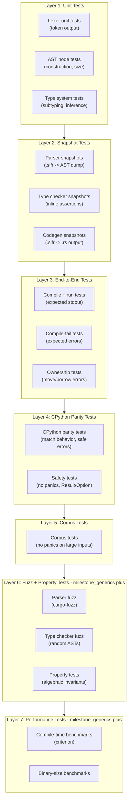

# Sifr Compiler -- Architecture

## Execution Plan Source of Truth

- Authoritative phase sequencing for current execution is tracked in [`plans/roadmap.md`](../plans/roadmap.md), starting at **Phase 15** through **Phase 41**.
- Authoritative entry/exit criteria, milestone quality checks, and mandatory local validation commands for execution phases are embedded in [`plans/phases/`](../plans/phases/) files `15`-`41` under `## Quality Contract`.
- Iterator architecture execution has two closed stages:
  - stage 1 (closed): `plans/issues/archive/ad-hoc-first-class-lazy-iterators-and-python-iterable-protocol.md` and `plans/issues/archive/ad-hoc-first-class-lazy-iterators-and-python-iterable-protocol-execution.md`
  - stage 2 (closed corrective continuation): `plans/issues/archive/ad-hoc-canonical-iteration-model-and-lazy-parity-closure.md` and `plans/issues/archive/ad-hoc-canonical-iteration-model-and-lazy-parity-closure-execution.md`
  - stage-2 wave closure: `wave_psp_iter_fix_0` through `wave_psp_iter_fix_8` are merged and review-closed (including post-closure CPython `itertools` parity sweep/remediation passes)
  - stage-2 contract lock enforces one canonical iteration path from type system through HIR/codegen with explicit capability tracking (single-pass, multi-pass, reversible/double-ended).
- RNG/crypto continuation is production-grade closed:
  - phase docs: `plans/issues/archive/ad-hoc-stateful-rng-crypto-and-polish-parity-expansion.md` and `plans/issues/archive/ad-hoc-stateful-rng-crypto-and-polish-parity-expansion-execution.md`
  - wave closure: `wave_psp_rng_0` through `wave_psp_rng_3` merged with external production-grade review artifacts and phase-closure pass-2 approval
- Ownership-aware collection lowering continuation is in closure review:
  - phase docs: `plans/issues/archive/ad-hoc-ownership-aware-collection-lowering-and-clone-elision.md` and `plans/issues/archive/ad-hoc-ownership-aware-collection-lowering-and-clone-elision-execution.md`
  - completed waves:
    - `wave_clone_0` lock/baseline artifact: `verification/stdlib/wave_clone_0_codegen_traceability.md`
    - `wave_clone_1` iterator/comprehension ownership correction artifact: `verification/stdlib/wave_clone_1_iterator_codegen_traceability.md`
    - `wave_clone_2` indexing/slicing/star-unpack ownership correction artifact: `verification/stdlib/wave_clone_2_index_slice_unpack_traceability.md`
    - `wave_clone_3` generic hardening/regression lock artifact: `verification/stdlib/wave_clone_3_generic_hardening_traceability.md`
  - active closure stage: external review/closure cycles after wave-level implementation completion
  - locked planner contract for implementation waves:
    - value category: `Place | Temporary`
    - source access mode: `Preserve | Consume`
    - yield mode: `Copy | Clone | Move | Borrow`
    - conservative generic handling remains mandatory for `TypeVar`/`Any`/move unions
  - canonical ownership-aware collection lowering rule:
    - classify source expression as `ValueCategory::Place` or `ValueCategory::Temporary`
    - derive source access contract as `SourceAccessMode::Preserve` or `SourceAccessMode::Consume`
    - resolve element ownership as `Some(Copy | Move)` or `None` when ownership is conservative/unknown
    - choose `YieldMode` from planner contract:
      - `Preserve + Some(Copy)` -> `Copy` (`.iter().copied()` or equivalent copy-out)
      - `Preserve + Some(Move)` -> `Clone` (`.iter().cloned()` where owned element materialization is required)
      - `Preserve + None` -> `Borrow` (no forced copy/clone lowering)
      - `Consume` (or iterator source) -> `Move` (consume source directly, no pre-clone shim)
    - emit Rust lowering from this plan only; do not bypass planner with ad hoc clone heuristics
  - residual boundary lock:
    - this continuation removes unnecessary clone-heavy lowering patterns for targeted surfaces
    - it does not claim full CPython parity for move-heavy runtime representations that depend on broader runtime/model changes
  - traceability artifacts:
    - `verification/stdlib/wave_clone_0_codegen_traceability.md`
    - `verification/stdlib/wave_clone_1_iterator_codegen_traceability.md`
    - `verification/stdlib/wave_clone_2_index_slice_unpack_traceability.md`
    - `verification/stdlib/wave_clone_3_generic_hardening_traceability.md`
- Integer model amendment source of truth:
  - `internal_docs/integer_model.md` defines the canonical semantic contract and replaces the historical machine-integer/separate user-facing `bigint` design before production.
  - `plans/issues/archive/ad-hoc-integer-model-and-fixed-width-numeric-contract.md` tracks the implementation phase and milestone breakdown for that contract.
  - Target source semantics: `int` is an exact signed arbitrary-precision value-semantic scalar backed by inline-small `SifrInt`; explicit fixed-width `int8`/`int16`/`int32`/`int64` and `uint8`/`uint16`/`uint32`/`uint64` are for storage, dtypes, binary formats, and FFI.
  - Ordinary fixed-width scalar arithmetic promotes to exact `int`; fixed-width array/tensor/dataframe arithmetic preserves dtype and exposes checked/wrapping/saturating/overflowing policies explicitly.
- Historical references in this architecture document may mention legacy phase numbering from earlier roadmap versions.
- When phase-number conflicts exist, follow [`plans/roadmap.md`](../plans/roadmap.md) and the matching files under [`plans/phases/`](../plans/phases/).
- Network/TLS/URL/HTTP substrate architecture is tracked in [`network_http_architecture.md`](./network_http_architecture.md). The public boundary is `sifr.net`, `sifr.tls`, `sifr.url`, and `sifr.http`; CPython-shaped networking modules remain unsupported diagnostics or rejected surfaces.

## Vision

Sifr is a compiled programming language that uses Python syntax with enforced static typing. It compiles Python-like source code to Rust source code, which is then compiled by `rustc` into native binaries. Assignment uses move semantics (like Rust), while function parameters are borrow-by-default with opt-in `mut` (mutable borrow) and `own` (ownership transfer). Types are strict with an opt-in `Any` escape hatch (like TypeScript's strict mode).

The type system draws heavily from TypeScript's design: union and intersection types, literal types, and full control-flow-based type narrowing are first-class citizens. Unlike TypeScript (which erases types at runtime), sifr uses types to generate efficient Rust code -- union types become Rust enums, narrowing becomes `match` expressions, and literal types enable compile-time value checking.

The end goal is a language capable of building web applications and general-purpose programs -- anywhere Python is used today, but with native performance and compile-time safety.

## Safety Philosophy

Sifr's core guarantee: **if it compiles, it works.** The language is designed so that a successfully compiled program will not crash at runtime under normal conditions. This guarantee is **fully enforced from milestone_safe_indexing onward** -- earlier milestones use panic-based indexing as a bootstrap mechanism until `Option`/`Result` types are available. The principles are:

- **No panics in user code.** Sifr programs never panic during normal execution. Every operation that can fail returns `Result[T, E]` or `Option[T]`, forcing the caller to handle the failure case at compile time.
- **Mandatory error handling.** `Result` and `Option` values are `#[must_use]`. Ignoring a `Result` returned by a function is a **compile-time error**. The programmer must either handle the error (`try`/`except`) or explicitly discard it (`_ = ...`). There is no user-facing `?` operator -- the compiler handles error propagation internally via `try`/`except` auto-unwrap (see contract #3).
- **All fallible operations return `Result` or `Option`.** This includes:
  - Indexing (`x[i]` returns `Option[T]`)
  - Division (`a / b` returns `Result[T, DivisionError]` when the divisor is not provably non-zero)
  - Type conversions (`int(s)` where `s: str` returns `Result[int, ParseError]`)
  - File I/O, network, and all stdlib operations that can fail
  - Fixed-width integer narrowing and representation-preserving fixed-width arithmetic (`int` itself is exact; overflow policy is explicit at fixed-width/storage boundaries)
- `**assert` is the only panic.** The `assert` statement is a programmer invariant check -- it generates `panic!()` and is intentionally unrecoverable. It exists to catch programmer bugs (violated assumptions), not to handle runtime errors. It is the one escape hatch from the no-panic guarantee.
- **Panic = unrecoverable system failure.** Beyond `assert`, panics only occur from truly unrecoverable situations: stack overflow, double panic, or hardware failure. These are never part of normal control flow.
- **Generated runtime panic-shape gate is enforced.** Phase 27 requires an emitted-code sweep across pass fixtures to ensure generated Rust contains no `.unwrap(` or `.expect(` in user-facing runtime paths.
- **Exceptions are not errors.** Sifr does not use Python's exception model. There is no stack unwinding, no exception propagation. The `try`/`except` syntax is reinterpreted as pattern matching on `Result` values with **compiler-enforced exhaustiveness checking** on error types. `raise` is syntax sugar for returning `Err(...)`. `return value` in a `Result`-returning function auto-wraps in `Ok(...)`.

This philosophy means that a Sifr programmer who handles all `Result` and `Option` values (which the compiler enforces) can be confident their program will not crash at runtime.

## CPython Reference

Sifr uses the CPython source code (`/Users/yaseralnajjar/work/sifr/cpython`) as the **authoritative reference** for Python behavior. The goal is to match CPython's semantics for built-in functions, data structure methods, and standard library behavior -- but always through Sifr's safety lens.

### Reference Directory Mapping


| Sifr feature area                                                                   | CPython reference location                                              | Notes                                                                        |
| ----------------------------------------------------------------------------------- | ----------------------------------------------------------------------- | ---------------------------------------------------------------------------- |
| Built-in functions (`len`, `abs`, `min`, `max`, `sorted`, `zip`, `enumerate`, etc.) | `Python/bltinmodule.c`                                                  | Match behavior, but return `Result`/`Option` where CPython would raise/panic |
| `list` methods (`.append`, `.pop`, `.sort`, `.index`, etc.)                         | `Objects/listobject.c`                                                  | Match semantics, safe indexing returns `Option`                              |
| `dict` methods (`.keys`, `.values`, `.get`, `.pop`, etc.)                           | `Objects/dictobject.c`                                                  | Match semantics, safe lookup returns `Option`                                |
| `str` methods (`.replace`, `.find`, `.split`, `.join`, etc.)                        | `Objects/unicodeobject.c`                                               | Match behavior, UTF-8 safe, character-based indexing                         |
| `tuple`                                                                             | `Objects/tupleobject.c`                                                 | Immutable, compile-time enforced                                             |
| `set` / `frozenset`                                                                 | `Objects/setobject.c`                                                   | Match operations, `frozenset` immutability enforced at compile time          |
| `int` / `float` / `bool`                                                            | `Objects/longobject.c`, `Objects/floatobject.c`, `Objects/boolobject.c` | Checked arithmetic, safe conversions                                         |
| `bytes` / `bytearray`                                                               | `Objects/bytesobject.c`, `Objects/bytearrayobject.c`                    | Match API, safe encode/decode                                                |
| `range` / `slice`                                                                   | `Objects/rangeobject.c`, `Objects/sliceobject.c`                        | Match iteration and slicing behavior                                         |
| Iterators / generators                                                              | `Objects/iterobject.c`, `Objects/genobject.c`                           | Match protocol, `Option`-based `__next__`                                    |
| Standard library modules                                                            | `Lib/<module>.py`, `Modules/<module>module.c`                           | Match API surface, wrap Rust crates                                          |
| Test suite (behavioral reference)                                                   | `Lib/test/test_<module>.py`                                             | Use as specification for expected behavior                                   |


### Bytes Representation Note (Phase 31.5 / wave_psp_bytes_4)

- The first-class `bytes` surface is now a distinct compiler type (`Type::Bytes`) across type checking, lowering, and codegen.
- Current Rust codegen representation is raw-byte storage (`Vec<u8>`) for typed bytes-native paths.
- Target integer-model amendment: indexing and iteration yield `uint8`; callers use `int(b)` when they want exact scalar integer arithmetic.
- Explicit construction boundaries (`bytes.from_ints`, `bytes.from_hex`, UTF-8 decode) remain responsible for runtime validation and typed error propagation.

### Safety Adaptation Rules

When adapting CPython behavior to Sifr, apply these rules:

1. **Where CPython raises an exception, Sifr returns `Result[T, E]`.** Example: `int("abc")` raises `ValueError` in CPython; in Sifr it returns `Result[int, ParseError]`.
2. **Where CPython raises `IndexError`, Sifr returns `Option[T]`.** Example: `list[99]` raises `IndexError` in CPython; in Sifr it returns `None`.
3. **Where CPython raises `KeyError`, Sifr returns `Option[V]`.** Example: `dict["missing"]` raises `KeyError` in CPython; in Sifr it returns `None`.
4. **Where CPython uses arbitrary-precision integers, Sifr uses exact `int`.** Source-level `int` is signed, arbitrary precision, and value-semantic. Fixed-width integer families are explicit for storage, binary protocols, dataframes/tensors, and FFI. Narrowing from `int` to a fixed-width type is explicit and fallible unless the compiler proves a constant fits.
5. **Where CPython allows mutation on immutable types at runtime, Sifr rejects at compile time.** Example: `tuple[0] = 1` raises `TypeError` at runtime in CPython; in Sifr it is a compile-time error.
6. **Where CPython behavior is undefined or platform-dependent, Sifr defines explicit behavior.** Document any deviations from CPython in the milestone's notes.

### Safety Testing Contract

Every milestone that implements built-in functions, data structure methods, or stdlib modules must include a **safety test layer** that verifies:

1. **Behavioral parity with CPython:** for each function/method, write tests that match CPython's expected output for valid inputs. Use `Lib/test/test_<module>.py` as the specification.
2. **Safe error handling:** for each CPython operation that raises an exception, verify that Sifr returns the correct `Result::Err` or `Option::None` instead.
3. **No panics on any input:** fuzz or property-test each function/method to ensure it never panics, regardless of input. The only acceptable panic is from `assert` statements.
4. **Compile-time rejection of unsafe patterns:** verify that operations CPython rejects at runtime (e.g., mutating a tuple, unhashable dict key) are caught at compile time in Sifr.

This safety test layer is tracked in each milestone's Definition of Done as: **"CPython parity tests pass with safe error handling (no panics, Result/Option where CPython raises)"**.

### Phase 31.5 Governance Artifact

For the ad-hoc Python source parity closure track (roadmap phase `31.5`), the canonical parity governance source is:

- `verification/stdlib/milestone_psp_7_parity_governance_inventory.md`

It is the single consolidated inventory for builtin parity status, core object-model parity status, shipped-module terminal classification, CPython adopt/adapt/waive traceability links, and waiver-index governance rules.

## Python Divergences

Sifr intentionally diverges from CPython in several areas to achieve compile-time safety. This table documents each divergence, its rationale, and the milestone where it is introduced.

### Standard Library Namespace Contract

Sifr is Python-syntax and CPython-behavior-informed, but it is not Python-source-compatible. The standard library import contract is explicit:

| Import root | Owner | Resolution |
| --- | --- | --- |
| `_sifr.*` | Compiler intrinsics | Embedded only; never filesystem or package-manager resolution. |
| `sifr.*` | Sifr standard library | Embedded `sifr_stdlib::STDLIB_SOURCES`; never filesystem or package-manager resolution. |
| top-level | User code and third-party packages | Workspace/package resolution. |

Bare CPython stdlib roots such as `math`, `json`, `os`, `heapq`, and `collections` are not aliases for `sifr.*`. A real top-level user or package module named `math`, `json`, or similar wins normal resolution. If no real top-level module resolves and the written import root matches an embedded Sifr stdlib module tail, the compiler emits `SIFR-IMPORT-0008` with a suggestion to use `sifr.*`.

Examples:

```python
from sifr.math import sqrt
from sifr.collections import deque
```

Unsupported bare forms:

```python
from math import sqrt
import collections
```


| Python Behavior                                        | Sifr Behavior                                                                                                        | Rationale                                                                                 | Milestone                                      |
| ------------------------------------------------------ | -------------------------------------------------------------------------------------------------------------------- | ----------------------------------------------------------------------------------------- | ---------------------------------------------- |
| Exceptions for error handling (`try`/`except`/`raise`) | `Result[T, E]` and `Option[T]` with mandatory handling; `try`/`except` reinterpreted as pattern matching on `Result` with compiler-enforced exhaustiveness checking on error types; no `?` operator in user code; `raise` maps to `Err(...)`, `return` auto-wraps in `Ok(...)` | Compile-time error handling eliminates unhandled exceptions at runtime; exhaustiveness checking ensures all error types are covered | milestone_error_handling, milestone_error_exhaustiveness |
| `IndexError` on out-of-bounds access                   | `x[i]` returns `Option[T]` (no panic)                                                                                | Safe indexing -- no runtime crashes from bad indices                                      | milestone_safe_indexing                        |
| `KeyError` on missing dict key                         | `d[key]` returns `Option[V]` (no panic)                                                                              | Safe access -- caller must handle missing keys                                            | milestone_safe_indexing                        |
| Arbitrary-precision integers                           | `int` is exact and arbitrary precision; fixed-width integer families are explicit for storage, dtypes, binary formats, and FFI | Python-simple default arithmetic without overflow; widths are visible only where representation matters | ad-hoc-integer-model-and-fixed-width-numeric-contract |
| Import-time side effects (`__init__.py` runs code)     | `__init__.sifr` defines exported API only; no side effects on import                                                 | Deterministic, safe module loading                                                        | milestone_imports                              |
| Mutable default arguments (`def f(x=[])`)              | Default values are evaluated fresh each call (no shared mutable state)                                               | Eliminates a common Python footgun                                                        | milestone_ergonomics                           |
| Parameter reassignment is implicit (`def f(x): x = ...`) | Rebinding or mutating a parameter requires explicit `mut` / `own mut`; bare parameters are immutable by default | Keeps ownership and mutability explicit; avoids hidden local mutation that conflicts with borrow-by-default semantics | milestone_borrow_default, ad-hoc-own-mut-parameter-convention |
| Augmented assignment on immutables                     | Augmented assignment (`+=`) on immutable types (tuple, frozenset) is a compile-time error                            | Compile-time enforcement of immutability                                                  | milestone_ergonomics                           |
| `global` / `nonlocal` keywords                         | Not supported; use closures (milestone_generics) or pass values explicitly                                           | Encourages explicit data flow; avoids hidden state mutation                               | --                                             |
| Metaclasses (`type()`, `__metaclass__`)                | Not supported; use decorators (milestone_metaprogramming) and protocols (milestone_protocols) instead                | Simplification -- metaclasses add complexity with limited benefit in a compiled language  | --                                             |
| `__slots__`                                            | Not needed; all classes compile to Rust structs (already memory-efficient)                                           | Rust structs are fixed-layout by default                                                  | --                                             |
| Runtime duck typing                                    | Structural typing via Protocols (compile-time checked)                                                               | Same flexibility as duck typing but errors caught at compile time                         | milestone_protocols                            |
| `finally` for cleanup                                  | Supported in milestone_error_handling; prefer `with` statement (milestone_generators) which maps to Rust `Drop`      | Scope-based cleanup is more idiomatic and less error-prone                                | milestone_error_handling, milestone_generators |
| `del x` (name unbinding)                               | Not supported; variables are dropped at scope end (Rust RAII)                                                        | Explicit lifetime management is handled by the compiler; manual unbinding adds complexity | --                                             |
| `getattr`/`setattr`/`hasattr`/`delattr` (reflection)   | Not supported; use protocols (milestone_protocols) for dynamic dispatch, pattern matching for type inspection        | Compile-time type safety; runtime reflection undermines static guarantees                 | --                                             |
| `type()` for runtime type creation                     | Not supported; use class definitions (compile-time only)                                                             | All types must be known at compile time for Rust codegen                                  | --                                             |
| Positional-only parameters (`def f(x, /, y)`)          | Deferred to milestone_metaprogramming (metaprogramming); not commonly needed in user code                            | Low priority; most APIs use keyword arguments                                             | milestone_metaprogramming                      |
| Math domain errors (`sqrt(-1)`, `log(0)`, etc.) raise `ValueError` | Sifr follows Rust's IEEE 754 behavior: returns `NaN` / `inf` silently (no exception, no Result) | Consistent with Rust semantics; avoidance of panic; user can check with `isnan()`/`isinf()` | milestone_collection_safety |
| `list.remove(x)` raises `ValueError` if x not in list | `list.remove(x)` is a no-op if x is not found (no exception, no panic) | Safe by default; callers don't need to pre-check membership | milestone_collection_safety |
| `list.index(x)` raises `ValueError` if x not in list | `list.index(x)` returns `int \| None` (Option); `None` if not found | Safe by default; callers handle absence via pattern matching | milestone_collection_safety |
| `min([])`/`max([])` raise `ValueError` on empty | `min(list)`/`max(list)` return `T \| None`; `None` on empty list | Safe by default; absence is a value, not an error | milestone_collection_safety |
| `set.pop()` raises `KeyError` on empty set | `set.pop()` returns `T \| None`; `None` on empty set | Consistent with safe collection semantics | milestone_collection_safety |
| Error subclass fields | Only `message` via `str(e)` | `message: str` + typed fields (`line`, `column`, `detail`) | Structured error data without string parsing | milestone_error_subclasses |
| `@dataclass` for auto-generated methods | `@dataclass` decorator | Auto-generated `__init__`, `__eq__`, `__str__` from field declarations (no decorator needed); `@dataclass` adds advanced features (ordering, frozen, field config) | Eliminates the most common boilerplate; every class with typed fields gets a constructor automatically | milestone_auto_init, milestone_metaprogramming |
| `match`/`case` with soft keywords | `match`/`case` are soft keywords (context-dependent) | `match`/`case` are hard keywords (always reserved) | No backward compatibility concern; avoids parser ambiguity; `match` is already reserved as a Rust keyword | milestone_pattern_matching |
| `enum.Enum` class-based syntax | `class Color(Enum): RED = auto()` | `enum Color: RED, GREEN, BLUE` (dedicated syntax, no class inheritance) | Cleaner syntax; direct mapping to Rust enums; no metaclass machinery | milestone_enums |
| No enum associated data | `enum` variants can hold data via class-based pattern | Union types + classes for data-carrying variants; enums are simple constants only | One obvious way: classes + unions for data, enums for constants. Avoids duplicating algebraic data types. | milestone_enums |
| Dict insertion order guaranteed (Python 3.7+) | Dict order is unspecified (`HashMap`); use `collections.OrderedDict` if order matters | `dict` maps to Rust `HashMap` which does not guarantee insertion order | Performance: `HashMap` is faster than ordered alternatives; `IndexMap` may be considered in a future milestone | -- |


**Migration note:** code that relies heavily on exception propagation, import-time side effects, arbitrary-precision integers, or runtime reflection will require redesign when porting to Sifr. The compiler provides clear diagnostics for each divergence.

### API Naming Divergences

Several stdlib functions intentionally diverge from CPython names due to Rust keyword conflicts or Sifr type-system constraints. This table is the authoritative reference — do not "fix" these names or introduce inconsistent workarounds.

| sifr name | CPython name | reason |
|---|---|---|
| `sifr.shutil.move_file` | `shutil.move` | `move` is a Rust keyword |
| `sifr.math.abs_val` | `math.fabs` (float abs) | `abs` is a Sifr built-in; `abs_val` is the intrinsic name used internally |
| `sifr.math.pow_val` | `math.pow` | `pow` shadows the built-in; `pow_val` is the intrinsic; `sifr.math.pow` is the CPython-compatible wrapper |
| `sifr.math.min_val` / `sifr.math.max_val` | `min` / `max` | `min`/`max` are Sifr built-ins; `min_val`/`max_val` are the float-specific intrinsics |
| `sifr.math.round_val` | `round` | `round` is a Sifr built-in; `round_val` is the float intrinsic |
| `sifr.itertools.repeat` | `itertools.repeat` | CPython-compatible name; `repeat_val` was the old non-CPython name (removed) |
| `sifr.itertools.count` | `itertools.count` | CPython-compatible lazy counter iterator |
| `sifr.itertools.count_from` | — (bounded helper over `count`) | Sifr extension; finite convenience helper equivalent to `islice(count(start, step), n)` |
| `sifr.os.remove_file` | `os.remove` | `remove` is used as a method name on collections; `remove_file` avoids ambiguity |
| `sifr.random.shuffle` | `random.shuffle` | CPython-compatible name; returns a new shuffled list (Sifr is immutable-by-default) instead of mutating in place |
| `sifr.operator.mod_val` | `operator.mod` | `mod` is a Rust keyword |
| `sifr.re.Pattern.is_match` | `re.Pattern.match` | `match` is a Rust keyword (also a Sifr keyword from milestone_pattern_matching) |
| `sifr.itertools.take` | — (no CPython equivalent) | Sifr extension; returns first N elements from an `Iterable[T]`. Kept for ergonomics. |
| `sifr.itertools.flatten` | `itertools.chain.from_iterable` | Sifr extension; flattens `Iterable[Iterable[T]]`. Simpler API than CPython's `chain.from_iterable`. |

**Removed type-specific duplicates (Phase 13 — stdlib generic rewrite):** `chain_str`, `chain_float`, `accumulate_float`, `accumulate_str`, `counter_add`, `counter_sub`, and other monomorphic variants have been deleted. All stdlib functions are now generic — e.g., `chain[T]`, `accumulate[T: Addable]`, `Counter[T: Hashable]`, `deque[T]`, `heapq` functions with `[T: Comparable]` bounds, `reduce[T, U]`, `shuffle[T]`, `sample[T]`.

## Compiler Pipeline


## Crate Structure (Rust Workspace)

**Hybrid dependency approach:** Infrastructure crates, parser, AST crates, and
the formatter are referenced from the Ruff fork submodule, currently based on
Ruff 0.15.12. Parser and AST crates include Sifr-specific syntax extensions and
are imported through Cargo aliases as `sifr_python_ast` and
`sifr_python_parser`. The Ruff fork formatter is Sifr-aware for parameter
conventions, Sifr type syntax, generics, match/case, ownership-aware
collections, formatter pragmas, and Sifr-tagged docstring snippets. The root
workspace pins Sifr's direct and generated-runtime support crates to the latest
stable releases independently from the excluded Ruff fork, which keeps its own
sub-workspace dependency pins. The effective Rust toolchain floor follows the
Ruff submodule crates and is currently Rust 1.93.

```
sifr/
  Cargo.toml                (workspace root)
  crates/
    sifr_source/            (canonical source text, line-map, file metadata, and UTF-8/UTF-16/UTF-32 position conversion primitives)
    sifr_frontend/          (canonical parse/lower/type-check/diagnostics query facade shared by CLI and tooling)
    sifr_diagnostics/       (canonical diagnostic codes, source-map spans, model, render schema, and sink)
    sifr_ir/                (High-level IR data contracts, public lowered views, CFG/flow graph data)
    sifr_lowering/          (AST-to-IR lowering, name/type/ownership/async analysis, lowering diagnostics)
    sifr_stdlib/            (compiler-host stdlib source inventory, intrinsic signatures, generated dependency feature specs)
    sifr_type_system/       (type definitions, inference, checking, subtyping)
    sifr_codegen/           (Rust source code generation from HIR via structured Rust IR)
    sifr_driver/            (CLI/project orchestration, split into diagnostics.rs + stdlib/ frontend/ project/ build/ test_runner/)
    sifr_format/            (Sifr-facing Ruff-backed formatter API, config conversion, diagnostics, and text edits)
    sifr_analysis/          (editor query host; routes formatting through sifr_format)
    sifr_lsp/               (LSP protocol shell; serves document/range formatting over sifr_analysis)
    sifr/                   (CLI binary: sifr build, sifr check, sifr run, sifr fmt)

  # Path dependencies from the Ruff fork submodule:
  #   ruff_text_size          -- text span/range utilities
  #   ruff_source_file        -- source file representation, line indexing
  #   ruff_python_trivia      -- whitespace/comment handling
  #   ruff_python_literal     -- literal parsing (string escapes, number formats)
  #   ruff_python_formatter   -- Sifr-aware Ruff formatter rules and range formatting

  third_party/
    ruff/                    (sifr-lang/ruff submodule, branch sifr/0.15.12-maintenance)
      crates/
        ruff_python_ast/      (imported as Cargo dependency alias sifr_python_ast)
        ruff_python_parser/   (imported as Cargo dependency alias sifr_python_parser)
        ruff_python_formatter/ (Sifr-aware formatter wrapper consumed by sifr_format)
```

New crates added per milestone as needed:

- milestone_core_stdlib/milestone_ext_collections: `sifr_std` (standard library wrappers, extended collections)
- Ad-hoc semantic diagnostic taxonomy: `sifr_diagnostics` (shared diagnostic model and schema, introduced before migrating existing emission paths)
- TypeScript-Go architecture transfer M0: `sifr_source` (bottom-of-graph source text, line-map, source-file metadata, and editor position conversion authority)
- TypeScript-Go architecture transfer M1: `internal_docs/typescript_go_architecture_transfer_m1_guardrails.md` records the pre-session direct-read inventory, current LSP single-file rebuild caveat, aggregate LSP budget caveat, and guardrail automation before M2-M5 behavior migration.
- TypeScript-Go architecture transfer M2: `sifr_frontend::SourceProvider` is the typed semantic filesystem boundary. `internal_docs/typescript_go_architecture_transfer_m2_source_provider.md` records how `DiskSourceProvider`, `OverlaySourceProvider`, and `TrackingSourceProvider` cover disk reads, unsaved editor buffers, read/probe/canonicalization dependency records, failed lookup records, and package import ambiguity before `WorkspaceSession` owns overlay lifecycle in M3.
- TypeScript-Go architecture transfer M3: `sifr_frontend::WorkspaceSession` owns serialized compiler-service workspace state and can freeze inspectable `WorkspaceSnapshot` values. `internal_docs/typescript_go_architecture_transfer_m3_workspace_session.md` records the pre-analysis-migration session/snapshot state.
- TypeScript-Go architecture transfer M4: `sifr_analysis::AnalysisSnapshot` is now an analysis-facing handle to a captured `WorkspaceSnapshot`, and LSP request handling routes editor queries through snapshot methods while staying serialized. `internal_docs/typescript_go_architecture_transfer_m4_analysis_snapshot.md` records query metadata snapshot ids, stale-result identity, and the conservative dirty-scope report slot before persistent LSP sessions and precise dirty scopes land in M5/M6.
- TypeScript-Go architecture transfer M5: `sifr_lsp::Session` owns persistent analysis handles that wrap `WorkspaceSession`, while `DocumentStore` keeps only protocol document state. `internal_docs/typescript_go_architecture_transfer_m5_lsp_persistent_session.md` records overlay-fed open/change/save handling and document-version stale-result checks before M6 dirty scopes.
- TypeScript-Go architecture transfer M6: `sifr_lsp` compacts batched editor edits and watcher notifications before updating analysis, while `sifr_frontend::WorkspaceSession` records dirty-scope reports with explicit reasons, merge priority, and conservative degradation. `internal_docs/typescript_go_architecture_transfer_m6_event_compaction_dirty_scope.md` records the precise invalidation vocabulary before M7 dependency-sensitive signatures.
- TypeScript-Go architecture transfer M7: `sifr_frontend::FrontendContext` records import/export/module signatures and reverse dependency edges so private body edits invalidate only the changed module when public/import signatures are unchanged, while public API or import graph changes invalidate reverse dependents. `internal_docs/typescript_go_architecture_transfer_m7_module_signatures_dependency_invalidation.md` records the first dependency-sensitive invalidation policy.
- TypeScript-Go architecture transfer M8: `sifr_lowering::flow_graph` provides first-class data-flow nodes, edges, and effects for definitions, assignments, conditions, branches, loops, calls, mutations, moves, borrows, joins, unreachable statements, and exits. `LoweringResult` now carries a snapshot-scoped `FlowGraph`, and `FlowFacts` exposes graph fingerprints and debug traces. `internal_docs/typescript_go_architecture_transfer_m8_first_class_flow_graph.md` records the initial graph-backed narrowing and ownership-effect surface.
- TypeScript-Go architecture transfer M9: `sifr_frontend::cache_keys` defines deterministic `CompilerFingerprint`, `CacheKeyFingerprint`, common workspace/package/query-policy context fingerprints, and typed cache-key identities for parse, source-map, HIR/lowering, diagnostics, lint, format, package graph, symbol bucket, and flow graph cache families. `internal_docs/typescript_go_architecture_transfer_m9_fingerprints_cache_keys.md` records the identity contract before M10 introduces cache reuse.
- TypeScript-Go architecture transfer M10: `sifr_frontend` adds ref-counted, M9-keyed reuse storage for parse trees, source-map file views, lowered HIR, module diagnostics, and module symbol indexes. `WorkspaceSnapshot` stores immutable snapshot payloads behind `Arc`, and `FrontendContext::can_replace_module_in_project` gates safe one-module replacement on unchanged import/export signatures. `internal_docs/typescript_go_architecture_transfer_m10_snapshot_reuse.md` records the initial reuse contract.
- TypeScript-Go architecture transfer M11: `sifr_lsp::RequestQueue` routes latency-sensitive, formatting, workspace, and background requests through explicit priority lanes with bounded fairness, while diagnostic jobs preserve captured document versions. `internal_docs/typescript_go_architecture_transfer_m11_lsp_scheduler.md` records the serialized scheduler contract before worker execution expands.
- TypeScript-Go architecture transfer M12: protocol-level LSP performance coverage is split into per-request `perf.lsp.*` budget ids, leaving `perf.lsp.request_families` as aggregate smoke only. `internal_docs/typescript_go_architecture_transfer_m12_lsp_latency_budgets.md` records the request-family budget taxonomy and Phase 35 relationship.
- TypeScript-Go architecture transfer M13: LSP cancellation state, delayed workspace-diagnostic progress, and parent-process watchdog behavior are explicit server surfaces. `internal_docs/typescript_go_architecture_transfer_m13_lsp_cancellation_progress_watchdog.md` records the serialized cancellation/progress/watchdog contract.
- TypeScript-Go architecture transfer M14: `sifr_analysis::SymbolIndex` now exposes workspace/package/stdlib bucket readiness states, import-entry counts, and dirty-module refresh for editor symbol/import queries. Package and stdlib buckets are explicit unavailable states until frontend graph views carry those identities. `sifr_analysis::ApprovedWorkerLane` records phases eligible for future parallel execution while `SingleOwnerCompilerPhase` keeps type identity, ownership mutation, package graph mutation, and codegen state serialized. `internal_docs/typescript_go_architecture_transfer_m14_bucketed_indexes.md` records the bucket and worker-lane contract.
- TypeScript-Go architecture transfer M15: `sifr_frontend::WorkspaceSession` snapshots now include `WorkspaceResidencySnapshot` for project residency, config registry entries, deduped watch registrations, and verified non-authoritative `.sifrbuildinfo` metadata. Build info is retained only after current compiler, package/config, and source hashes match. `internal_docs/typescript_go_architecture_transfer_m15_project_residency.md` records the residency contract.
- TypeScript-Go architecture transfer M16: `WorkspaceSnapshot` carries bounded `WorkspaceDebugSnapshot` trace/status output with normalized `WorkspaceTracePhase` events for source update, parse, lower, type check, ownership, flow, cache, invalidation, stale rejection, and LSP timing. LSP scheduler/cancellation/stale/timing events are exposed through `sifr/debugTrace`; `AnalysisHost::debug_snapshot` adds side-effect-free index readiness, and `sifr trace` prints representative CLI snapshots. `internal_docs/typescript_go_architecture_transfer_m16_trace_status.md` records the trace/status contract.
- TypeScript-Go architecture transfer M17: marker-based multi-file editor corpus fixtures now cover the analysis query families and stale-snapshot behavior, while internal-only `SnapshotHandleKind` handles for symbols, types, signatures, diagnostics, and source spans reject wrong-snapshot resolution. Runtime package fixtures also lock `SIFR-IMPORT-0005` ambiguity and fatal `SIFR-PACKAGE-*` non-duplication. `internal_docs/typescript_go_architecture_transfer_m17_editor_corpus_snapshot_handles.md` records the corpus/handle contract.
- milestone_ffi: FFI codegen extensions in `sifr_codegen`
- Phase 35 shared analysis/query architecture: `sifr_frontend` (canonical frontend API and query/database ownership)
- milestone_dev_tooling: `sifr_lsp` (language server), `sifr_format` (formatter), `sifr_lint` (linter)
- milestone_ecosystem: `sifr_registry` (package registry client)

## Formatter Architecture

The production Sifr formatter is Ruff-backed and in-process. `.sifr` source
flows through `sifr_syntax` into the Sifr Ruff fork parser, AST, comments,
trivia, and formatter rules, then through the Sifr-owned `sifr_format` wrapper.
`sifr_format` owns Sifr-facing options, config conversion, deterministic
diagnostics, and text edits; it does not lower to HIR, type-check, or run
ownership analysis. Standalone file and config reads use short-lived
`sifr_frontend::SourceProvider` instances so formatting does not create a
separate source text or line-map authority.

The single formatter core is shared by:

- `sifr fmt` for CLI write, check, diff, stdin, range, path-selection, and cache behavior
- `sifr_analysis` document and range formatting queries
- `sifr_lsp` `textDocument/formatting` and `textDocument/rangeFormatting`
- checked-in editor integrations through `sifr lsp --stdio`

Formatter validation is part of local validation. `verification/tooling/check_formatter_ast_coverage.py`
fails when a Sifr parser or AST extension lacks both Ruff fork formatter fixture
coverage and Sifr wrapper corpus coverage. Formatter performance budgets cover a
large-file check and a representative project check.

## Driver Build Model

`sifr_driver` uses one rooted-entrypoint compilation model for native binary builds.

- `RootedEntrypointPlan` is the canonical driver abstraction for build planning.
- `RootedEntrypointShape::SingleFile` models the one-module case.
- `RootedEntrypointShape::Project` models the reachable user import closure. Outside a workspace, legacy activation remains `main.sifr` plus local sibling imports. Inside the nearest ancestor `sifr.toml` workspace, any entry filename can activate project mode.
- Native `sifr.toml` workspace discovery lives in `sifr_driver::workspace`. `[source].roots` define workspace user-module search roots, defaulting to `["."]`; malformed workspace config is a hard build diagnostic rather than a single-file fallback.
- User module resolution keeps embedded `sifr.*` / `_sifr.*` stdlib registry precedence separate from filesystem lookup, then searches the entry parent first and configured workspace source roots second. Dotted module IDs such as `helpers.nodes` map to `helpers/nodes.sifr`.
- Generated Rust preserves canonical dotted module IDs through HIR/codegen and materializes them as nested Rust files, for example `helpers.nodes` -> `src/helpers/nodes.rs` plus `src/helpers/mod.rs`.
- Both shapes materialize through the same generated-binary-project path and the same Cargo manifest generation helper.
- Dependency metadata for both shapes comes from codegen outputs (`used_stdlib_modules` and `required_crates`), never from emitted Rust text scans.
- Workspace design details and deferred package-management semantics are tracked in [`sifr_workspace_design.md`](./sifr_workspace_design.md).

This keeps CLI mode resolution as the boundary that selects the rooted entrypoint shape while preserving one internal build architecture.

Phase 31 decomposed `sifr_driver` into the following stable internal boundaries:

- `diagnostics.rs`: compile/public result types, panic boundaries, diagnostic serialization, and stderr rendering helpers
- `stdlib/`: embedded stdlib sources, intrinsic mapping, cache lifecycle, and bootstrap compilation
- `frontend/`: single-file parse/lower/type-check entrypoints and metadata extraction
- `project/`: import-closure discovery, reachable module parsing, export collection, and deterministic compile ordering
- `build/`: rooted-entrypoint planning, generated-project materialization, Cargo manifest generation, and generated-artifact cache management for repeated `sifr run` builds
- `test_runner/`: test root discovery, generated test harness assembly, reusable cached Cargo test workspaces, and cargo test execution orchestration

### Generated Artifact Cache Boundary

Phase ad-hoc test strategy milestone 4 moved `run`/`test` away from invocation-scoped temp directories as the default cache boundary.

- `sifr build` still materializes into the caller-provided output directory and does not reuse a hidden cache.
- `sifr run` now lowers/codegens on each invocation but materializes the generated Cargo project into a content-addressed cache rooted under the system temp directory. The cache key includes:
  - rooted entrypoint scope
  - generated Cargo manifest and Rust sources
  - cargo/rustc toolchain signature plus relevant build env vars
- cache misses build inside an isolated staging directory and promote atomically into the stable cache path only after `cargo build --release` succeeds
- cache hits execute the previously built binary directly without paying the generated-project rebuild cost again
- `sifr test` uses the same cache discipline for generated test-runner Cargo projects: unchanged input reuses the prior workspace and its `target/` artifacts, while still running `cargo test` on every invocation
- both paths emit explicit cache-hit/miss status lines so validation logs surface reuse and invalidation behavior

---

## Cross-cutting Contracts

These are design decisions that span multiple milestones. They must be resolved early to prevent milestones from diverging and breaking each other.

### 1. Runtime Type Representation

Union types, `Unknown`, and class instances all need a coherent runtime representation in generated Rust code. This contract ensures milestone_type_system/milestone_classes/milestone_protocols/milestone_generics produce compatible code.

**Contract:**

- **Primitive unions** (`int | str`): generate Rust `enum` with one variant per member type. The enum name is deterministic from the sorted member types (e.g., `IntOrStr`). Narrowing via `isinstance` generates `match` arms.
- **Optional types** (`T | None`): generate Rust `Option<T>`. Narrowing via `is not None` generates `if let Some(x) = x`.
- **Class unions** (`Circle | Square`, milestone_classes/milestone_protocols): generate Rust `enum` with one variant per class. Discriminated union narrowing via tag field generates `match` on the tag.
- `**Unknown` type**: generates `Box<dyn std::any::Any>` in Rust. The compiler enforces that every use site is guarded by a narrowing check (`isinstance`, equality, etc.) before any operation. At runtime, `downcast_ref::<T>()` is used after narrowing. This is the only type that requires runtime type information (RTTI).
- `**Any` type**: generates the same `Box<dyn Any>` but the compiler does NOT enforce narrowing. This is the escape hatch.
- **Generics** (milestone_generics): monomorphized at compile time (like Rust). No runtime type erasure for generic types. Under the integer-model amendment, `list[int]` generates storage over the canonical `SifrInt` representation, while fixed-width lists use the corresponding Rust primitive storage.
- **Protocol/trait objects** (milestone_protocols): when a protocol is used as a type (not just a bound), generate `Box<dyn Trait>` with vtable dispatch. This is the only case of dynamic dispatch besides `Unknown`/`Any`.

**Invariant:** Every `Type` variant must have exactly one Rust representation. The `rust_type()` method on `Type` is the single source of truth for this mapping.

### 2. Borrow and Lifetime Strategy

Sifr uses **borrow-by-default** semantics for function parameters. Move-type arguments are immutably borrowed (`&T`) unless the programmer opts in to mutable borrowing (`mut`), ownership transfer (`own`), or owned mutable parameters (`own mut`). Scalar value-semantic primitives (`int`, fixed-width integers, `float`, `bool`) do not expose use-after-move friction at the source level; under the integer-model amendment, `int` is not Rust `Copy`, but codegen owns the borrow/clone/primitive-local optimization needed to preserve scalar source semantics.

**Contract:**

- **Function arguments:** borrow by default (immutable). The compiler models parameter passing along two axes:
  - ownership:
    - borrowed
    - owned
  - mutability:
    - immutable
    - mutable
  Valid surface forms are:
  - `x: list[int]` -> borrowed immutable -> `x: &Vec<SifrInt>` under the integer-model amendment
  - `mut x: list[int]` -> borrowed mutable -> `x: &mut Vec<SifrInt>` under the integer-model amendment
  - `own x: list[int]` -> owned immutable -> `x: Vec<SifrInt>` under the integer-model amendment
  - `own mut x: list[int]` -> owned mutable -> `mut x: Vec<SifrInt>` under the integer-model amendment
  Scalar value-semantic types (`int`, fixed-width integers, `float`, `bool`) remain reusable after calls regardless of annotation; `mut` on those parameters only affects local rebinding/mutation semantics, not observable ownership transfer.
- **Method receivers:** auto-borrow based on method body analysis:
  - If the method only reads `self` fields: `&self`
  - If the method mutates `self` fields: `&mut self`
  - If the method consumes `self` (e.g., builder pattern): `self` (move)
  - Self inference is unchanged by borrow-by-default (it already uses body analysis)
- **Closure captures (milestone_generics):** inferred from usage inside the closure body:
  - Read-only access: capture by `&T`
  - Mutation: capture by `&mut T`
  - Move into closure: capture by value (when the closure outlives the variable's scope, or when explicitly requested with `move` keyword)
- **Temporary lifetimes:** temporaries created in expressions live until the end of the enclosing statement. Method chains like `x.upper().split(",")` work without explicit borrows.
- **Escape analysis:** the compiler tracks whether a reference escapes its scope. If it does, the compiler emits a diagnostic rather than silently cloning. The programmer must choose: clone explicitly, or restructure to avoid the escape.
- **No lifetime annotations in user code:** Sifr does not expose Rust's `'a` lifetime syntax. The compiler infers lifetimes using the rules above. If inference fails, the compiler emits a clear error suggesting `.clone()` or restructuring.
- **Shared mutable state requires explicit opt-in:** the compiler does NOT auto-wrap shared data in `RefCell` or `Mutex`. If multiple variables reference the same mutable data, the programmer must use explicit sharing primitives (deferred to post-milestone_protocols). Default behavior is borrow-by-default with explicit `mut`, `own`, and `own mut` parameter contracts rather than hidden runtime borrowing. This keeps ownership rules predictable and avoids hidden runtime borrow panics.
- **Return semantics follow ownership, not mutability:** returning a Move-type parameter by value is only valid when the callee owns that parameter (`own` / `own mut`). Borrowed parameters, including `mut` borrows, cannot escape by return or store unless the programmer clones explicitly.

**Milestone responsibilities:**

- milestone_classes: implement method receiver inference (`&self` / `&mut self` / `self`)
- milestone_borrow_default: implement borrow-by-default parameter conventions and codegen
- milestone_borrow_hardening: implement exclusivity checking and error diagnostics
- ad-hoc-own-mut-parameter-convention: extend parameter conventions so owned mutable parameters are first-class and lower canonically to Rust `mut x: T`
- milestone_generics: implement closure capture inference
- milestone_async_4: implement task/thread boundary ownership and Send/Sync capture rules.
- Post-milestone_protocols: evaluate explicit shared mutable abstractions (e.g., `Shared[T]` mapping to `Rc<RefCell<T>>`)

### 3. Error Semantics

Sifr replaces Python's exception model with Rust's `Result`/`Option` model (milestone_error_handling). **All fallible operations return `Result` or `Option`; the compiler enforces handling via `#[must_use]`.** The only user-facing error handling mechanism is `try`/`except` -- there is no user-facing `?` operator. The compiler uses `?` internally (as an HIR node) when auto-unwrapping `Result` values inside `try` blocks.

**Contract:**

**Error mechanism matrix:**

| Context                          | Error mechanism                   | Handling                                                    | Codegen                                                    |
| -------------------------------- | --------------------------------- | ----------------------------------------------------------- | ---------------------------------------------------------- |
| Sync function                    | `Result[T, E]` return             | `try`/`except` with exhaustiveness checking                 | `Result<T, E>`                                             |
| Async function (milestone_async_1/milestone_async_2) | `Result[T, E]` return             | `try`/`except` works across same-task `.await`; spawned task observation returns `TaskResult[T, E]` | `Result<T, E>` inside the task; task handles observe `TaskResult<T, E>` |
| `try`/`except` block             | Pattern match on `Result`         | `except` arms match error types; compiler checks coverage   | `match result { Ok(v) => ..., Err(e) => match e { ... } }` |
| Indexing                         | `Option[T]` return                | Type narrowing (`if val is not None`)                       | `.get(i).cloned()` / `.chars().nth(i)`                     |
| Division                         | `Result[T, DivisionError]`        | `try`/`except`                                              | Checked division with zero-check                           |
| Exact integer arithmetic (`int`) | Exact value-semantic arithmetic; explosive operations such as exponentiation/large shifts are budgeted and fallible when needed | Use fixed-width integer APIs only when representation matters; no silent wrap/panic in normal `int` arithmetic | `SifrInt` inline-small runtime type; fixed-width types map to Rust primitives |
| Type conversion                  | `Result[T, ParseError]`           | `try`/`except`                                              | `.parse::<T>()`                                            |
| Unused `Result`                  | **Compile-time error**            | Must handle via `try`/`except` or discard with `_ = ...`    | `#[must_use]` attribute on `Result`                        |
| Rust FFI (milestone_ffi)         | Rust panics caught at boundary    | `catch_unwind` at Rust FFI entry points                     | Panic -> `Result::Err` conversion                          |
| C FFI (milestone_ffi)            | Crashes are non-recoverable       | Safe wrappers validate inputs                               | Process terminates on segfault/abort                       |
| `assert` statement               | Panic (programmer invariant only) | Not catchable                                               | `assert!()` or `panic!()`                                  |
| Main function                    | `Result` printed as exit code     | Non-zero exit on `Err`                                      | `fn main() -> Result<(), Box<dyn Error>>`                  |

**`try`/`except` semantics and auto-unwrap:**

Inside a `try` block, when a `Result`-returning function is called and the result is assigned to a non-`Result` variable, the compiler **auto-unwraps** the `Result`. If the call returns `Err`, execution jumps to the matching `except` arm. No explicit `?` is needed in user code:

```python
class ValidationError(Error):
    message: str

def validate(x: int) -> Result[str, ValidationError]:
    if x > 0:
        return "positive"                          # auto-wrapped in Ok("positive")
    raise ValidationError("must be positive")      # maps to return Err(ValidationError {...})

def main():
    try:
        r: str = validate(5)    # auto-unwrapped: compiler inserts ? in HIR
        print(f"ok: {r}")
    except ValidationError as e:
        print(f"caught: {e}")                      # Display formats e.message
```

**`except` exhaustiveness checking:**

The compiler enforces that all error types from fallible calls inside a `try` block are covered by the `except` arms. The rules are:

1. **`except Error as e`** is the catch-all for ordinary errors. All ordinary error types are classes that extend `Error`. Since `Error` is the root of the ordinary error hierarchy, this covers every possible ordinary error type. The compiler is satisfied -- no further checking needed.
2. **`except SpecificError as e`** triggers exhaustiveness checking. The compiler collects every error type from every `Result`-returning call in the `try` block and verifies that each one is covered by some `except` arm.
3. **Mixing is allowed.** Specific `except` arms are checked first; an `except Error as e` arm at the end covers all remaining uncovered ordinary error types. This mirrors Python's `except` ordering (specific before general).
4. **Each `try` block is checked independently.** Nested or sequential `try` blocks each have their own exhaustiveness scope.
5. **Uncovered error types are a compile error.** If any error type from a fallible call is not covered by an `except` arm, the compiler emits a diagnostic listing the uncovered types and the calls that produce them.

**Error type constraint:** The ordinary `E` in `Result[T, E]` must always be a class that extends `Error`. Primitive types like `str` are not valid error types. This ensures every ordinary error has a structured type that the compiler can track for exhaustiveness checking, and that `except Error as e` is a true catch-all for ordinary errors. Spawned task observation uses `TaskResult[T, E]`; its `Cancelled(Failure[CancellationError])` branch is not an ordinary `Result` error, and `CancellationError` is not an `Error` subclass.

**Example -- catch-all (compiler satisfied):**

```python
class ProcessError(Error):
    message: str

def process(path: str) -> Result[str, ProcessError]:
    try:
        content: str = read_text(path)           # can fail with IOError
        config: dict = parse_toml(content)       # can fail with TOMLDecodeError
        return config["name"]
    except Error as e:
        raise ProcessError(f"pipeline failed: {e}")   # catches everything
```

**Example -- specific handling (compiler enforces exhaustiveness):**

```python
class ProcessError(Error):
    message: str

def process(path: str) -> Result[str, ProcessError]:
    try:
        content: str = read_text(path)           # IOError
        config: dict = parse_toml(content)       # TOMLDecodeError
        return config["name"]
    except IOError as e:
        raise ProcessError(f"read failed: {e}")
    except TOMLDecodeError as e:
        raise ProcessError(f"parse failed: {e}")
```

If the developer omits `except TOMLDecodeError`, the compiler emits:

```
error[S0042]: unhandled error type in try block
  --> process.sifr:4:22
   |
4  |         config: dict = parse_toml(content)
   |                        ^^^^^^^^^^^^^^^^^^^ can fail with TOMLDecodeError
   |
   = help: add `except TOMLDecodeError as e`, or use `except Error as e` to catch all
```

**Example -- mixed (specific + catch-all):**

```python
class PipelineError(Error):
    message: str

def pipeline(path: str) -> Result[str, PipelineError]:
    try:
        content: str = read_text(path)              # IOError
        config: dict = parse_toml(content)          # TOMLDecodeError
        validated: int = validate_range(x, 0, 100)  # ValidationError
        return "done"
    except IOError as e:
        raise PipelineError(f"io: {e}")             # handles IOError specifically
    except Error as e:
        raise PipelineError(f"other: {e}")          # covers TOMLDecodeError, ValidationError
```

**Typed error hierarchies:** All ordinary error types are classes that extend `Error`. The `raise` keyword maps to `Err(ErrorInstance)`. `return value` in a `Result`-returning function auto-wraps in `Ok(value)`. Using a non-`Error` type (e.g., `str`, `int`) as the `E` in `Result[T, E]` is a compile-time error. Task cancellation is handled by the async cancellation contract rather than ordinary catch-all matching.

**Built-in error classes:** Sifr provides a standard set of error classes for common failure modes (e.g., I/O, parsing, validation). These are used by the stdlib and available to user code.

#### Error Hierarchy

All errors have `message: str` populated from Rust's `Display` (for built-ins) or the constructor (for user-defined errors). `print(e)` is the idiomatic way to display error messages.

**Design Principles:**
1. The type tells you the error kind; the message tells you the details
2. All errors have `message: str` — inherited from the base `Error` class
3. `print(e)` is the idiomatic way to display errors (via `Display` which formats `self.message`)
4. Additional structured fields where Rust provides data the developer can't know in advance
5. Subclasses at Sifr level = `kind` field dispatch at Rust level

**Error Type Reference:**

| Sifr type | Parent | Fields | Rust source |
|---|---|---|---|
| `Error` | — | `message: str` | Base class |
| `IOError` | `Error` | `message: str`, `kind: str` | `std::io::Error` |
| `FileNotFoundError` | `IOError` | `message: str` | `io::ErrorKind::NotFound` |
| `PermissionError` | `IOError` | `message: str` | `io::ErrorKind::PermissionDenied` |
| `FileExistsError` | `IOError` | `message: str` | `io::ErrorKind::AlreadyExists` |
| `IsADirectoryError` | `IOError` | `message: str` | `io::ErrorKind::IsADirectory` |
| `NotADirectoryError` | `IOError` | `message: str` | `io::ErrorKind::NotADirectory` |
| `DirectoryNotEmptyError` | `IOError` | `message: str` | `io::ErrorKind::DirectoryNotEmpty` |
| `ParseError` | `Error` | `message: str` | `ParseIntError`, `FromUtf8Error`, etc. |
| `ValueError` | `Error` | `message: str` | Manually constructed |
| `DivisionError` | `Error` | `message: str` | Compiler-generated |
| `KeyError` | `Error` | `message: str` | Compiler-generated |
| `JSONDecodeError` | `Error` | `message: str`, `line: int`, `column: int` | `serde_json::Error` |
| `TOMLDecodeError` | `Error` | `message: str`, `line: int`, `column: int` | `toml::de::Error` |
| `RegexError` | `Error` | `message: str`, `detail: str` | `regex::Error` |
| `OverflowError` | `Error` | `message: str` | Fixed-width narrowing and representation-preserving fixed-width arithmetic overflow |
| `ArithmeticLimitError` | `OverflowError` | `message: str`, `limit: int` | Exact integer operation exceeds configured output budget |
| `FloatOverflowError` | `OverflowError` | `message: str` | Exact integer cannot be represented as finite `float` |
| `FloatPrecisionLossError` | `OverflowError` | `message: str` | Exact integer to `float` conversion would silently lose precision |
| `JsonIntegerRangeError` | `Error` | `message: str`, `path: str`, `profile: str` | JSON integer output violates selected precision/range profile |
| `JsonLimitError` | `Error` | `message: str`, `limit: int` | JSON/text integer token or document exceeds configured decoder limit |
| `CancellationError` | -- | `message: str` | Task-control evidence for a cancelled child task; not an `Error` subclass and never matched by broad `except Error` |
| `TaskCancelled` | `Error` | `message: str` | Ordinary wrapper when user code intentionally converts child cancellation evidence into an error channel |
| `TimeoutError` | `Error` | `message: str`, `duration: float` | `sifr.task.timeout` deadline expiry |
| `ScopeFailure` | `Error` | `primary: ScopeFailureCause`, `secondary: list[SecondaryError]` | Scope-exit evidence for unobserved child task failure/cancellation |
| `GeneratorCloseError` | `Error` | `message: str` | Explicit async generator close failed during cleanup |
| `GeneratorBusyError` | `Error` | `message: str` | Reentrant async generator advancement protocol error |
| `SecondaryError` | `Error` | `message: str`, `primary: str`, `secondary: Error` | Cleanup or sibling failure evidence attached to a primary cancellation/failure; never masks the primary result |

**Exhaustiveness with Subclasses:**

```python
# Specific subclass handling
try:
    content: str = read_text("data.txt")
except FileNotFoundError as e:
    print(f"File not found: {e.message}")
except IOError as e:
    print(f"Other I/O error: {e.message}")

# Parent catches all subclasses
try:
    content: str = read_text("data.txt")
except IOError as e:
    print(f"Any I/O error: {e.message}")
    print(f"Error kind: {e.kind}")
```

**Codegen: subclasses = enum variants via kind field:**
- At the Sifr level, `FileNotFoundError` looks like a subclass of `IOError`
- At the Rust level, `IOError` is a struct with a `kind: String` field
- `except FileNotFoundError` generates a guard: `Err(ref e) if e.kind == "FileNotFound"`
- `except IOError` catches all variants (no guard)

**User-defined error classes:** User-defined error classes inherit `message: str` from `Error`. The constructor accepts a message string, and `print(e)` formats it via `Display`. Users can add additional fields as needed.

```python
# Simple user-defined error — inherits message from Error
class AppError(Error):
    pass                                       # only has message: str (inherited)

def connect() -> Result[str, AppError]:
    raise AppError("connection refused")       # message = "connection refused"

try:
    conn: str = connect()
except AppError as e:
    print(e.message)                           # field access: "connection refused"
    print(e)                                   # Display: "connection refused" (same thing)
    print(f"failed: {e}")                      # f-string: "failed: connection refused"
```

```python
# User-defined error with additional fields
class DbError(Error):
    query: str
    code: int

try:
    result: str = execute(query)
except DbError as e:
    print(e.message)                           # inherited from Error
    print(e.query)                             # additional field access
    print(e.code)                              # additional field access
    print(e)                                   # Display: formats e.message
```

**Common error type patterns:**

- **Application code:** define a simple error class per module or feature (e.g., `class AppError(Error)`). The inherited `message` field carries the human-readable text. Use `except Error as e` as a catch-all when fine-grained ordinary error handling is not needed.
- **Library code:** define a domain error class (e.g., `class ConfigError(Error)`) and wrap internal errors at API boundaries. Callers only see the domain error type.
- **Stdlib functions:** return `Result[T, SpecificError]` using the built-in error classes. For example, `read_text(path)` returns `Result[str, IOError]`, `int(s)` returns `Result[int, ParseError]`.

### 4. Package Resolver and Reproducibility (milestone_imports/milestone_cli_semantics/milestone_package_mgmt)

This contract is split across three milestones: milestone_imports (multi-file compilation and import semantics), milestone_cli_semantics (CLI project-mode activation semantics), and milestone_package_mgmt (package management with dependency resolution). milestone_imports maps to Phase 17 (Import and Externals Correctness), milestone_cli_semantics maps to Phase 18 (Project and CLI Semantics Correctness), and milestone_package_mgmt lands in Phase 31 (Package Management).

**Contract (milestone_imports -- imports and modules):**

- **Import cycle detection:** the compiler builds a dependency graph of modules during compilation. Cycles are a compile-time error with a clear diagnostic showing the cycle path.
- `**__init__.sifr` semantics:** defines the public API of a package. Symbols not re-exported from `__init__.sifr` are private to the package. No side effects on import (unlike Python's `__init__.py`).
- **Import-form matrix is explicit:** behavior for `from x import ...`, `from .x import ...`, `from ..x import ...`, `from . import ...`, and `import x` is explicitly defined as supported, unsupported, or non-activating with stable diagnostics.
- **Import caching:** each module is compiled exactly once per compilation. The driver maintains a module cache keyed by canonical path.
- **Multi-file diagnostics:** error messages show correct source file and line numbers across module boundaries.

**Contract (milestone_cli_semantics -- CLI project-mode activation):**

- **Resolver trigger matrix:** project-mode activation rules are explicit for `from` imports, relative import levels, bare relative imports, and regular `import` statements.
- **Run/build equivalence:** `run` and `build` use the same resolver and produce equivalent mode selection and error-class outcomes for identical inputs.
- **Contract synchronization:** resolver behavior, regression tests, and CLI semantics documentation must remain aligned.

**Contract (milestone_package_mgmt -- package management, Phase 37):**

- **Cargo-backed package substrate:** `Cargo.toml` and `Cargo.lock` own external dependency resolution, lockfile behavior, registries, Git/path sources, workspaces, publishing, vendoring, and backend Rust/native dependencies.
- **Sifr compiler metadata:** `sifr.toml` owns Sifr package name, edition, compiler requirement, source roots, exports, privacy, aliases, and native trust policy. It does not own external dependency resolution or registry credentials.
- **Package graph:** `crates/sifr_package` consumes `cargo metadata --format-version 1`, normalizes Cargo packages and resolved dependency edges, and derives `SifrPackageGraph` plus `PackageSourceMap` for the normal frontend/lowering/codegen pipeline. Package source-map construction uses the SourceProvider boundary for source-root traversal and `__init__.sifr` API reads, and preserves otherwise legal ambiguous module candidates for import-site `SIFR-IMPORT-0005` diagnostics instead of failing construction as `SIFR-PACKAGE-*`.
- **Package identity:** package instance identity includes Cargo package id, version, and source identity. Multiple Cargo-selected versions are allowed when each package's direct dependency scope remains unambiguous.
- **Distribution:** a Sifr package is a valid Cargo package carrying `.sifr` source and `[package.metadata.sifr] manifest = "sifr.toml"`. Pure Sifr packages include only the canonical Rust marker target; Rust-backed packages must declare and pass backend trust validation.
- **No Sifr-native lockfile in Phase 37:** there is no committed `sifr.lock`; reproducibility is derived from `Cargo.toml`, `Cargo.lock`, `sifr.toml`, selected Sifr source, compiler/toolchain inputs, and package feature/selector inputs.
- **Python interop deferred:** `pyproject.toml`, `uv.lock`, uv, and Python package distribution are future interop surfaces. They must lower into the same Cargo-backed package graph and import semantics instead of forking package resolution.

### 5. CI Quality Gates

**Contract for every PR:**

- `cargo test` passes (all layers: unit, snapshot, E2E, corpus)
- `cargo clippy -- -D warnings` passes
- No new `unsafe` blocks without explicit justification
- E2E pass tests compile generated Rust and verify runtime stdout
- E2E fail tests verify expected diagnostics

**Milestone-specific gates (added as milestones land):**

- milestone_ergonomics+: CPython parity tests -- verify behavioral match with CPython (`/Users/yaseralnajjar/work/sifr/cpython`) for all built-in functions, data structure methods, and stdlib modules, with safe error handling (no panics, `Result`/`Option` where CPython raises exceptions)
- milestone_generics+: benchmark suite with regression thresholds (compile time, binary size)
- milestone_core_stdlib+: stdlib wrapper tests (each module has integration tests against the underlying Rust crate)
- milestone_ecosystem: fuzz testing for parser and type checker (cargo-fuzz or afl)

### 6. Slice and Collection Semantics

Sifr uses Python-like slicing syntax, but must define whether slicing copies or creates a view. This affects performance expectations and ownership behavior.

**Contract:**

- **List slicing copies:** `list[a:b]` produces a new `list` (deep copy of elements). This matches Python semantics and avoids borrow complexity. Codegen: `vec[a..b].to_vec()`.
- **String slicing copies:** `str[a:b]` produces a new `str`. Indices are character positions (not byte offsets). Codegen: `s.chars().skip(a).take(b - a).collect::<String>()`.
- **Dict:** not sliceable. **Tuple:** compile-time slicing supported (milestone_ergonomics) -- the compiler can statically verify tuple slice bounds and produce a new tuple type.
- **Views deferred:** an explicit view API (e.g., `list.view(a, b)` mapping to `&[T]`) may be added in a later milestone for performance-critical paths. Not part of MVP.
- **`for` loop protocol entry:** `for item in collection` lowers through `iter(collection)` first, then iterates the resulting iterator. Collection-backed iterables (list/set/dict/string/range/iterable wrappers) are converted to iterator objects without consuming the original collection. This preserves reusable collection behavior while making the protocol boundary explicit in HIR.
- **For-loop element semantics (milestone_borrow_hardening):** Loop elements are independent copies (deep-copy on assignment via `.cloned()`). This matches Python's loop semantics and avoids exposing Rust's borrow/lifetime complexity to Sifr users. The practical consequence: `for x in items: x = transform(x)` does not mutate `items`. Codegen rationale: `.iter().cloned()` copies elements one-at-a-time (like Python), avoids lifetime issues with borrowed elements escaping the loop, and keeps the Sifr ownership model simple for users.
- **Iterator mutation safety in loops (wave_iter_2):** mutating a collection while iterating over it in the same `for` body is rejected at compile time (`cannot mutate '<name>' while iterating over it in a for loop`). No eager fallback or implicit snapshot is inserted.

### 7. String Semantics (UTF-8)

Sifr's `str` maps to Rust `String` (UTF-8). String indexing and length must be defined carefully because UTF-8 is variable-width.

**Contract (safe indexing -- no panics):**

- `**s[i]`:** returns `Option[str]` -- the i-th character (Unicode code point) as a single-character `str`, or `None` if out-of-bounds. Codegen: `s.chars().nth(i).map(|c| c.to_string())`. This is O(n), not O(1).
- `**list[i]`:** returns `Option[T]` -- the i-th element, or `None` if out-of-bounds. Codegen: `vec.get(i).cloned()`. This is O(1).
- `**s.len()`:** returns the number of Unicode code points (not bytes). Codegen: `s.chars().count()`. This is O(n).
- `**s.byte_len()`:** returns the number of bytes (O(1)). Codegen: `s.len()`.
- `**s[a:b]`:** returns characters from position `a` to `b` (exclusive). Codegen: `s.chars().skip(a).take(b - a).collect::<String>()`. Returns empty string if indices are out of range.
- **String literals:** type is `str`, stored as `String` in generated Rust.
- **Complexity documentation:** the compiler should emit a note when string indexing is used in a loop, suggesting `.chars()` iteration instead for performance.
- **Global indexing contract:** all indexable types (`str`, `list`, `dict`) use safe indexing. `x[i]` returns `Option[T]`, never panics. This is enforced uniformly across the language.

### 7.1 Text, Encoding, Unicode, And I18n Substrate

Sifr's production text substrate is owned by `sifr.encoding`, `sifr.io`, `sifr.unicode`, and `sifr.i18n`.
The focused closeout note lives in [text_i18n_architecture.md](./text_i18n_architecture.md).

**Valid text invariant:**

- `str` is always valid Unicode and lowers to Rust `String`/`str`.
- Arbitrary payloads stay in `bytes` until an explicit decode boundary succeeds.
- Invalid Unicode recovery cannot be hidden inside ordinary strings; recovery paths return typed outcomes or typed errors.

**Encoding and text I/O boundaries:**

- `sifr.encoding` uses a static registry for accepted Tier 0/Tier 1 encodings. Runtime registry mutation and dynamic codec lookup are unsupported.
- `str.encode(...)`, `bytes.decode(...)`, `sifr.encoding.encode/decode`, and text-mode file I/O all lower through the same encoding substrate.
- Text file I/O requires an explicit encoding. `open(path, "r")` and other text modes without `encoding=` are rejected; locale-derived default encodings are not part of the language.
- Compiler-recognized `open(...)` mode values must be string literals so lowering can choose binary versus text handle types statically.

**Unicode data and segmentation:**

- Normalization, property lookup, names, numeric values, and case folding use checked-in generated Unicode 17.0.0 table artifacts and regeneration markers.
- Grapheme and word segmentation use the Unicode 17.0.0-aligned `unicode-segmentation` substrate. Public APIs return owned strings and byte-index records; streaming segmentation is deferred.

**Locale and i18n data:**

- Locale identifiers are explicit `LocaleId` values. Object-scoped number, datetime, plural, and collation APIs use ICU4X compiled data behind Sifr-owned wrappers.
- `host_locale()` is read-only and host-limited. It may observe environment locale identifiers, but it cannot mutate process state and cannot make implicit text encodings legal.
- Process-global locale mutation, `gettext.install`, and global `_` binding are unsupported.

**Translation catalogs:**

- `Bundle`, `Message`, and `Translator` are the production translation API.
- `.mo` files are a compatibility backend/import format. Catalog parsing validates byte layout, declared charset, context keys, plural metadata, and malformed paths through typed `CatalogError`.
- `.mo` plural expressions are parsed by a constrained safe parser. Sifr never evaluates catalog metadata through a Python, Sifr, shell, or host expression engine.
- Missing keys fall through explicit fallback chains and finally return the source singular/plural text; corrupt catalogs surface as typed translation errors.

### 8. Concurrency Safety

Sifr must define which types can cross thread/task boundaries. Phase 32 planning follows `internal_docs/async_concurrency_model.md`; this section records the high-level contract that implementation milestones must preserve.

**Contract:**

- **Auto-derived Send/Sync:** Sifr types are `Send` and `Sync` when all their fields are `Send` and `Sync` (matches Rust's auto-derivation). The compiler tracks this automatically.
- **Spawn boundaries are checked:** when a value is sent to a spawned task (`scope.spawn`) or thread, the compiler verifies the value satisfies the task/thread boundary rules. If not, it emits a clear error explaining which captured value or field is not sendable/share-safe.
- **No silent upgrades:** the compiler does NOT auto-upgrade `Rc` to `Arc` or `RefCell` to `Mutex`. If a non-sendable type is used across a task boundary, the programmer must fix it explicitly.
- **Shared mutable state across tasks:** requires explicit primitives from the async/concurrency model (`sifr.sync.Lock`, `sifr.sync.RwLock`, or `sifr.sync.Channel`). The compiler rejects sharing mutable references across task boundaries without synchronization.
- **Shared immutable state is deep-safe:** `sifr.sync.Shared[T]` requires `T` to satisfy the Phase 32 `ShareSafe` capability (`Send + Sync` and no unsynchronized interior mutability).
- **Lock and channel safety:** `sifr.sync.Lock` is synchronous in v1 and may block an async runtime worker under contention, so it is for short critical sections only. Channels use explicit sender/receiver endpoints; send and receive are async and direct `receive` reports closed-and-drained with `ClosedError`; channel-backed `async for` maps closed-and-drained to `Ok(None)`. Channel endpoint lifetime rules: dropping last sender closes after buffered drain; dropping receiver closes immediately to senders; `close()` on any sender closes entire channel; buffered messages remain receivable; FIFO delivery order.
- **Async callables are distinct:** `AsyncFunction` is not a subtype of sync `Function`/`Callable`; async functions cannot be stored, passed, or invoked through a sync callable path.
- **Coroutine/task/result ladder:** calling an async function returns a linear `Coroutine[T, E]`. Awaiting that coroutine in the same task yields the async function's surface return type. Spawning it with `scope.spawn` consumes the coroutine and returns `Task[T, E]`.
- **Task error types are constrained:** `Task[T, E]` must satisfy `E: Error`, with `Never` accepted for no-error tasks. Awaiting a task from a non-cancelled owner consumes the affine handle and produces `TaskResult[T, E]`; `CancellationError` is a separate `Cancelled(Failure[CancellationError])` branch, not an `Error` subclass, and is not caught by broad `except Error`.
- **Scope failures are typed:** `TaskScope.__aexit__` returns `Result[None, ScopeFailure]`; unobserved child failure or cancellation is type-erased into `ScopeFailure` instead of being silently dropped. `TaskGroup[E]` requires homogeneous child error type `E` in v1 and cancels unfinished siblings on first failure. User-defined async context managers choose their own ordinary `Error` type for their exit error, not necessarily `ScopeFailure`.
- **Timeouts are typed:** `task.timeout(handle, duration)` returns `TaskResult[T, TimeoutResult[E]]`. `async with task.timeout(duration)` is a compiler-recognized same-task cancellation scope using internal delimited cancellation; deadline exits through ordinary `TimeoutError`, not child cancellation evidence.
- **Async generators are async iterables:** `async def` with `yield` returns `AsyncGenerator[T, E]`, not a coroutine. `AsyncGenerator[T, E]` implements `AsyncIterator[T, E]` and `AsyncClosable[GeneratorCloseError]`; `anext()` returns `Result[Option[T], E]`, where `Ok(None)` is normal exhaustion or completed close and `Err(E)` is stream failure. Async generators are not awaitable.
- **Async generator suspension is ownership-checked:** mutable borrows cannot remain live across `yield` or `await` inside an async generator. If an async generator object crosses a spawned-task boundary, all captured values and generated state-machine fields must satisfy the same sendability facts as any other task-boundary value.
- **Async comprehensions are protocol sugar:** list, set, and dict async comprehensions consume `AsyncIterator[T, E]` through `anext()`; they do not create hidden tasks or detached work. Cancellation of a comprehension closes the active `AsyncClosable` iterator it started. Lazy async generator expressions are deferred in v1.
- **`AsyncClosable` is parameterized:** `AsyncClosable[E]` with `aclose() -> Result[None, E]` allows streams, files, sockets, and database cursors to define their own cleanup error type. `AsyncGenerator` implements `AsyncClosable[GeneratorCloseError]`.
- **Async calls are async-only:** sync code cannot invoke an async function through the async-call path. The compiler rejects async calls from sync functions unless a future explicit runtime bridge is added. This prevents Python-style unawaited coroutine/task leaks.
- **Borrow rules at async boundaries:** immutable borrows may cross `await` only when the borrow remains valid and no conflicting mutation exists; mutable borrows cannot remain live across `await`; v1 spawn boundaries require owned, sendable, static captures; `sync.Shared[T]` is allowed for immutable shared data; unsynchronized mutable state is rejected.
- **Task composition semantics:** `task.timeout` accepts task handles in v1, returns the inner result when the inner task completes before the deadline, timeout expiry cancels and awaits inner cleanup, same-tick completion wins over timeout, and outer cancellation cancels the inner task. `task.gather` is fail-fast with deterministic success ordering; first observed failure cancels unfinished children and cleanup/sibling failures become secondary evidence. `task.select` and `task.race` consume their input handles and cancel losing tasks by default. `BlockingTask[T, E]` is separate from cooperative `Task[T, E]` because blocking cancellation may only abandon the result.
- **Single-threaded by default:** code that does not use `async` or `spawn` has no concurrency overhead. `Rc` and `RefCell` are used internally only when appropriate for single-threaded code.

**Milestone responsibilities:**

- `milestone_async_0`: copy the complete async/concurrency type, task, cancellation, and runtime contracts from `internal_docs/async_concurrency_model.md` into the architecture contract.
- `milestone_async_1`: add async HIR/type substrate (`Coroutine`, `Task`, `TaskResult`, `Awaitable`, `AsyncFunction`, `await`, async calls).
- `milestone_async_4`: implement Send/Sync and borrow-boundary checking at spawn boundaries.
- `milestone_async_5`: provide `sifr.sync.Shared`, `Lock`, `RwLock`, and `Channel` for explicit cross-task sharing.
- `milestone_async_6` (completed): provide workload annotations and async-context diagnostics, explicit blocking offload through `task.spawn_blocking`, and `BlockingTask[T, E]` result-abandonment cancellation semantics. The later production concurrency/runtime substrate removed public `sifr.concurrent` and `sifr.threading` compatibility surfaces in favor of native `sifr.task`, `sifr.sync`, `sifr.runtime`, and `sifr.parallel` APIs.
- `milestone_async_7a`: implement user-defined async context managers, `AsyncIterator[T, E]`, and `async for` over protocol-conforming streams.
- `milestone_async_7b`: implement `AsyncGenerator[T, E]`, async generator lifecycle/cleanup, and list/set/dict async comprehensions.

**M7 production runtime closeout:** the terminal architecture audit for the production concurrency/runtime substrate lives in [structured_runtime_work_model.md](./structured_runtime_work_model.md#m7-production-closure-audit). It locks the task/process/channel/offload/runtime boundaries, typed IPC policy, blocking/offload policy, sendability/shareability rules, task/request context model, diagnostics/signal global-state policy, and rejected CPython-shaped surface index without reopening the Phase 32 async syntax contract.

### 9. Destruction and Cleanup Semantics

Sifr compiles to Rust, which has deterministic destruction (RAII). This contract defines when and how values are cleaned up.

**Contract:**

- **Scope-end destruction:** values are dropped at the end of their enclosing scope, in reverse declaration order. This matches Rust's `Drop` semantics and is deterministic (unlike Python's GC).
- **Move invalidates source:** when a value is moved (assigned to another variable, or passed to a function via `own` parameter), the source is invalidated. Accessing it after move is a compile-time error. Note: default function parameters borrow (`&T`), so passing a value to a function does NOT move it unless the parameter is marked `own`.
- **Partial moves:** when a struct field is moved out, the entire struct becomes partially invalid. The compiler tracks which fields are still valid.
- **User-defined destructors deferred:** Sifr does NOT expose `__del__` or custom destructors in MVP. The compiler auto-generates `Drop` for types that hold resources (file handles, connections) via stdlib wrappers.
- **Explicit cleanup via `with`:** for resource management (files, connections), use `with` blocks that map to Rust's scoped resource patterns. The resource is cleaned up when the `with` block exits. The `with` statement calls `__enter__()` at scope start and `__exit__()` at scope end, with compile-time enforcement of the `ContextManager` protocol.
- **Destructor failure:** auto-generated destructors do not fail. If an underlying Rust `Drop` implementation panics (only possible via FFI-wrapped types), the program aborts. This is a system-level failure, not a Sifr-level concern -- Sifr user code cannot trigger destructor panics.

**Milestone responsibilities:**

- milestone_generators: define initial `with` block syntax (scoped block desugaring)
- milestone_compiler_hardening (Phase 7: Stdlib Parity): complete the `with` statement with full `ContextManager` protocol enforcement (`__enter__`/`__exit__` calls, multiple context managers, compile-time protocol checking)
- milestone_classes: implement scope-end destruction for class instances
- milestone_core_stdlib: implement `with` blocks for file handles and other stdlib resources

### 10. Auto-Derived Traits

Sifr auto-derives common Rust traits for all user-defined types. This is a language contract, not an implementation detail.

**Contract:**

- **Always derived (when valid):**
  - `Debug` -- enables `print()` and `repr()` for all types. Derived for all structs and enums.
  - `Clone` -- enables `.clone()`. Derived when all fields implement `Clone`.
  - `PartialEq` -- enables `==` and `!=`. Derived when all fields implement `PartialEq`.
- **Conditionally derived:**
  - `Eq` -- derived when `PartialEq` is derived AND no fields are `float` (since `f64` is not `Eq` in Rust due to `NaN`).
  - `Hash` -- derived when `Eq` is derived AND all fields implement `Hash`. NOT derived for types containing `float`, `dict`, or other unhashable types.
- **Not auto-derived (require explicit opt-in):**
  - `Ord` / `PartialOrd` -- comparison ordering requires explicit definition via `__lt__`, `__le__`, etc.
  - `Copy` -- only Rust-copy scalar primitives such as fixed-width integers, `float`, and `bool` are `Copy`. Source-level `int` is value-semantic but lowers to `SifrInt` and is not Rust `Copy`.
- **Codegen:** the compiler emits `#[derive(Debug, Clone, PartialEq)]` (and conditionally `Eq`, `Hash`) on all generated structs and enums.
- **Enum types (milestone_enums):** enum types unconditionally derive `Debug`, `Clone`, `PartialEq`, `Eq`, `Hash`. All enum values are usable as dict keys and set members.
- **Auto-init (milestone_auto_init):** when a class has no explicit `__init__`, the compiler auto-generates `__init__`, `__eq__` (if all fields are `PartialEq`), and `__str__` (via `Debug`-style formatting). Explicit definitions always take precedence.
- **Dict key constraint:** types used as `dict` keys must be `Hash + Eq`. The compiler enforces this at the call site and emits a clear error if the type is not hashable.

### 11. Diagnostic Mapping

Sifr compiles to Rust source code, which is then compiled by `rustc`. This creates a two-stage compilation where errors can originate from either the Sifr compiler or `rustc`. This contract defines how diagnostics are attributed, mapped, and rendered. The corrective ad-hoc semantic diagnostic taxonomy phase amends the original Phase 27 contract and moves public diagnostic ownership into `crates/sifr_diagnostics`.

**Contract:**

- **Stable Sifr diagnostic codes:** every top-level Sifr compiler diagnostic has a stable family-local code of the form `SIFR-<FAMILY>-dddd`, for example `SIFR-NAME-0001`. Families identify the semantic domain, not merely the compiler phase. Historical `E####`/`W####` and message-embedded pseudo-codes are removed before public stability.
- **Deterministic documentation URL:** every top-level diagnostic exposes `url = "https://sifr.sh/docs/errors/<CODE>"`. This URL is part of the stable contract and must render in `human` and `json` outputs. `compact` intentionally omits URLs unless a future reviewed verbose compact flag is added.
- **Canonical severity enum:** the shared diagnostic model uses exactly three top-level severities:
  - `Error` -- blocks compilation or the active command
  - `Warning` -- non-blocking but actionable
  - `Note` -- contextual top-level information such as `reveal_type(...)` output and recovery-cap summaries
- **Help and children:** help text is attached through `help` fields or `ChildSeverity::Help`; `Help` is not a top-level diagnostic severity. Diagnostic children are uncoded `Note` or `Help` messages.
- **Canonical diagnostic object:** target migrated parser, lowering, type checking, borrow checking, and codegen paths must emit `SifrDiagnostic` values from `sifr_diagnostics`. Source diagnostics require a `SourceSpan`; internal diagnostics are reserved for compiler failures without source mapping.
- **Canonical suggestion model:** suggestion payloads are structured logical suggestions with one or more text replacement edits plus applicability (`MachineApplicable`, `MaybeIncorrect`, `HasPlaceholders`, or `Unspecified`). Replacement text lives in suggestion edits, not duplicated help children.
- **Span mapping:** semantic diagnostics preserve byte ranges as `SourceSpan` values before rendering. `sifr_source` owns source text, line maps, and UTF-8/UTF-16/UTF-32 position conversion primitives. Renderers derive display paths, byte offsets, 1-based UTF-8 character line/column positions, source snippets, and related spans at the source-map boundary without defining a separate line-map authority. Codegen/rustc diagnostics use `.sifr` source mapping where available; unmapped compiler failures use `SIFR-INTERNAL-*`.
- **Producer/presentation boundary:** producers own canonical diagnostic identity, source spans, related spans, and structured context before a diagnostic reaches output formatting. `sifr_diagnostics` owns source-map rendering and the `human`, `json`, and `compact` presentation once producers have supplied canonical diagnostic data. Workspace and package discovery must attach resolver details as args/children on source-level import diagnostics instead of replacing source problems with phase-specific workspace codes.
- **Package diagnostic conversion:** `sifr_driver::diagnostics::render_package_diagnostic` is the shared package-to-rendered conversion path. It preserves `PackageDiagnostic.help` and useful `PackageDiagnosticOrigin` fields as JSON args while leaving diagnostics spanless when no honest source/config byte range is available.
- `**rustc` error translation:** when `rustc` emits an error on generated code, the driver translates it back to `.sifr` coordinates using the span map. If translation fails (e.g., error in compiler-generated boilerplate), the raw `rustc` error is shown with a note: "This error originated in the Rust compilation step."
- **Generation vs rendering separation:** semantic phases construct diagnostics; renderer layers convert them to `human`, `json`, and `compact` presentation formats. Output mode selection must not change diagnostic ownership or semantics.
- **JSON renderer contract:** CLI `json` output preserves the existing `RenderedDiagnostic[]` transport and must preserve the shared diagnostic model fields without human-only lossy reformatting. The checked-in schema is generated from `sifr_diagnostics`.
- **CLI diagnostic-format contract:** the stable renderer flag surface is `--diagnostic-format human|json|compact`. Unknown values fail fast with exit code `2` before semantic compilation work starts.
- **CLI exit-code contract:** compiler commands return exactly:
  - `0` success (including warning-only outcomes)
  - `1` user-facing compile/check/test diagnostics
  - `2` CLI usage/configuration error
  - `3` internal compiler failure after panic/error boundary handling
- **Human renderer contract:** default `human` output is source-aware. It prints severity, code, message, primary file/line/column, source snippets, caret highlights derived from `DiagnosticSpanLine`, related spans, child notes/help, suggestions, and documentation URLs. Spanless internal diagnostics use an explicit no-source fallback.
- **Compact renderer contract:** `compact` is a stable line-oriented summary format for agents, CI summaries, and quick terminal scanning. It must:
  - show one severity-only summary line first
  - render one physical line per retained diagnostic after recovery limiting
  - keep the first four fields stable: severity abbreviation, code, location or `<unknown>`, and message
  - preserve deterministic diagnostic ordering
  - avoid source snippets, default URLs, help counts, and grouped `CompactKey`-style aggregation
- **Suppression policy:** `rustc` warnings on generated code are suppressed by default (generated code includes `#[allow(warnings)]`). Only `rustc` errors are surfaced to the user.
- **Multi-file rendering:** errors that span multiple `.sifr` files show each file's relevant snippet with labeled spans. Uses `miette` or `ariadne` for rich terminal rendering with colors, underlines, and related notes.
- **Diagnostic ownership:** the Sifr compiler should catch as many errors as possible before invoking `rustc`. Over time, the set of errors that reach `rustc` should shrink to near-zero as the type checker and borrow checker mature.
- **No split-brain rule:** `sifr_driver`, future editor integrations, and automation-facing adapters must consume diagnostics through the canonical frontend API. They may render or transport diagnostics differently, but they may not reimplement parse/lower/type-check logic or semantic diagnostic derivation.
- **Canonical frontend API minimum surface:** the shared frontend/query API established in Phase 35 must expose one canonical project/context handle plus reusable entrypoints for: parse, lower, type-check, collect diagnostics, inspect project/module graph state, and request per-module/per-project analysis results. CLI, editor, and automation adapters may wrap this API, but they must not bypass it for semantic analysis.

**Milestone responsibilities:**

- milestone_core_language-milestone_type_system: basic span tracking (single-file, Sifr-native errors only)
- milestone_imports: multi-file span tracking (import errors reference both files)
- Phase 27 diagnostics contract: structured diagnostic schema, stable renderers, and recovery policy
- Phase 35 shared analysis/query architecture: canonical query/database-backed frontend API consumed by CLI and future tooling
- milestone_ffi: FFI-related `rustc` error translation (extern crate mismatches)
- milestone_dev_tooling (Phase 36): editor/LSP parity validation and thin tooling adapter boundaries on top of `sifr_frontend`

### 12. Standard Protocol Primitives

Sifr defines a set of built-in protocols (traits) that are used across multiple milestones. This contract formalizes when each becomes available and what it maps to in Rust.

**Contract:**


| Protocol         | Rust Trait                                      | Available From                                                                      | Purpose                                                       |
| ---------------- | ----------------------------------------------- | ----------------------------------------------------------------------------------- | ------------------------------------------------------------- |
| `Comparable`     | `Ord` (+ `PartialOrd`, `Eq`, `PartialEq`)       | milestone_protocols (defined), milestone_generics (usable as bound)                 | Ordering for `sort()`, `min()`, `max()`, comparison operators |
| `Addable`        | `Add` (+ `Sum` for `sum()`)                     | milestone_protocols (defined), milestone_generics (usable as bound)                 | Arithmetic `+` operator, `sum()` built-in                     |
| `Display`        | `std::fmt::Display`                             | milestone_classes (auto-derived for `__str__`), milestone_protocols (explicit impl) | String representation via `str()`, f-strings, `print()`       |
| `ContextManager` | Custom trait (`__enter__`/`__exit__` -> `Drop`) | milestone_generators (syntax), milestone_compiler_hardening (protocol enforcement)  | `with` statement resource management                          |
| `Iterable`       | `IntoIterator` / iterable protocol             | ad-hoc phase `first-class-lazy-iterators-and-python-iterable-protocol` (wave 1+) | `iter(x)` entry boundary and protocol typing                 |
| `Iterator`       | `Box<dyn Iterator<Item = T>>` runtime surface  | ad-hoc phase `first-class-lazy-iterators-and-python-iterable-protocol` (wave 1+, builtin lowering in wave 2) | `next(it)`, single-pass stateful iteration, lazy pipelines  |
| `Reversible`     | `DoubleEndedIterator` capability contract      | ad-hoc phase `canonical-iteration-model-and-lazy-parity-closure` (wave 0 lock, wave 1+ implementation) | capability-gated `reversed(...)` semantics                    |
| `Hashable`       | `Hash` (+ `Eq`)                                 | milestone_classes (auto-derived)                                                    | Dict keys, set membership                                     |


**Semantics:**

- **Auto-derived protocols:** `Display`, `Hashable`, `Comparable` are auto-derived for classes where all fields implement the corresponding Rust trait (see contract #10: Auto-Derived Traits). Users can override with explicit `__str__`, `__hash__`, `__lt__` etc.
- **Pre-generics usage:** Before milestone_generics, protocols are used for operator overloading and dynamic dispatch (`&dyn Trait`). After milestone_generics, they become usable as generic bounds (`T: Comparable`).
- **Primitive types:** `int`, fixed-width integer types, `float`, `str`, and `bool` implement applicable protocols from the start. Under the integer-model amendment, `Addable` must model the operator output type; fixed-width scalar `+` returns exact `int`, so fixed-width types do not satisfy a generic `T + T -> T` contract through ordinary arithmetic. `float` does NOT implement `Comparable` (because `NaN` violates total ordering) -- this is a compile-time error, matching Rust's `f64` not implementing `Ord`.
- **Protocol composition:** a function can require multiple protocols via intersection bounds (milestone_generics): `def process[T: Comparable & Display](item: T)`.

**Milestone responsibilities:**

- milestone_classes: auto-derive `Display` and `Hashable` for classes with eligible fields
- milestone_protocols: define `Comparable`, `Addable`, `Display` as explicit protocols; enable operator overloading via protocol impl
- milestone_generics: enable protocols as generic bounds (`T: Comparable`)
- milestone_generators: define initial `with` block syntax (scoped block desugaring)
- ad-hoc first-class lazy iterator phase: introduces first-class `Iterable[T]` / `Iterator[T]` typing and protocol execution plan (`iter`, `next`, generator rewrite, lazy builtin conversion)
- ad-hoc parity-extension waiver-reduction phase: re-closes iterator-returning builtin/stdlib surfaces (`map` parity, approved `itertools` combinators, `re.finditer`, `glob.iglob`, `Path.iterdir/glob/rglob`) and retires broad lazy-waiver claims to narrow residual governance entries
- ad-hoc canonical iteration continuation phase: freezes/implements capability-aware canonical iteration semantics across type system, HIR, codegen, generators, builtins, and stdlib adapters
- ad-hoc structured-data/class-surface parity-expansion phase: locks bounded contracts for `json`, `configparser`, `csv`, `collections`, `argparse`, `uuid`, `datetime`, `textwrap`, and `html` while keeping explicit permanent diffs (`json` dynamic hooks, timezone-db/tzinfo ecosystems, `Counter(**kwargs)`, dynamic csv registry mutation, argparse formatter ecosystems, package-wide html expansion)
- milestone_compiler_hardening (Phase 7: Stdlib Parity): define `ContextManager` protocol; enforce `with` statement compliance with `__enter__`/`__exit__` calls and compile-time protocol checking; fix `Callable`-as-struct-field (`Box<dyn Fn>`)
- milestone_generics_v2 (Phase 13: Type System Completion): complete generic class field/method substitution; protocol bounds on type parameters (`T: Comparable & Display`)
- milestone_pattern_matching (Phase 13: Type System Completion): `match`/`case` syntax with exhaustiveness checking on union types, literal unions, optional types, class unions, and enum types
- milestone_enums (Phase 13: Type System Completion): simple enum types with exhaustive pattern matching; enum values implement `Eq`, `Hash`, `Clone`, `Debug`

### Ecosystem Strategy

Sifr's standard library follows a **thin wrapper + FFI** strategy:

- **Thin wrappers (milestone_protocols-milestone_data_processing):** The stdlib provides Pythonic APIs over best-in-class Rust crates. The sifr compiler generates Cargo dependencies automatically. Users write Python-like code; the generated Rust uses `axum`, `polars`, `sqlx`, `tokio`, etc. directly.
- **Rust FFI (milestone_ffi):** For crates not yet wrapped, users can import Rust crates directly via FFI. This is the escape hatch that gives Sifr access to the entire Rust ecosystem (50,000+ crates on crates.io).
- **Package ecosystem (milestone_ecosystem):** A package registry (`sifr.sh`) for sharing and reusing Sifr code, with incremental compilation for fast iteration.
- **No reinventing:** Sifr never reimplements what Rust already has. Every stdlib module wraps a proven Rust crate.

---

## Type System Design

### Core Types (Full)

```rust
enum Type {
    // Exact integer (value-semantic at source, not Rust Copy)
    Int,

    // Fixed-width integer primitives (Copy)
    Int8,
    Int16,
    Int32,
    Int64,
    UInt8,
    UInt16,
    UInt32,
    UInt64,
    ISize,
    USize,

    // Other primitives
    Float,
    Bool,
    Str,
    None,

    // Compound (Move)
    List(Box<Type>),
    Dict(Box<Type>, Box<Type>),
    Tuple(Vec<Type>),
    Set(Box<Type>),

    // Literal types -- specific values as types (milestone_type_system)
    LiteralInt(SifrIntLiteral),
    LiteralStr(String),
    LiteralBool(bool),

    // Union / Intersection (milestone_type_system)
    Union(Vec<Type>),           // int | str -- flattened, deduplicated
    Intersection(Vec<Type>),    // internal only, for narrowing engine

    // Type alias (milestone_type_system)
    Alias(String, Box<Type>),   // type HttpMethod = "GET" | "POST"

    // Function
    Function(FunctionType),

    // Async/concurrency model (Phase 32)
    Coroutine(Box<Type>, Box<Type>),  // Coroutine[T, E] -- linear async computation, consumed by await or spawn
    Task(Box<Type>, Box<Type>),       // Task[T, E] -- awaitable task handle, yields TaskResult[T, E]
    TaskResult(Box<Type>, Box<Type>), // TaskResult[T, E] -- Ok(T), Err(Failure[E]), Cancelled(Failure[CancellationError])
    BlockingTask(Box<Type>, Box<Type>), // BlockingTask[T, E] -- blocking offload handle
    Awaitable(Box<Type>),             // structural awaitability protocol
    AsyncFunction(FunctionType),       // async callable, not a subtype of sync Function
    AsyncIterator(Box<Type>, Box<Type>), // AsyncIterator[T, E] -- anext() yields Result[Option[T], E]
    AsyncGenerator(Box<Type>, Box<Type>), // AsyncGenerator[T, E] -- async def with yield

    // Class instance (milestone_classes)
    Instance(ClassId),

    // Generics (milestone_generics)
    TypeVar(TypeVarId),
    GenericInstance(ClassId, Vec<Type>),

    // Result / Option (milestone_error_handling)
    Result(Box<Type>, Box<Type>),

    // Enum (milestone_enums)
    Enum(EnumId),

    // Range (milestone_control_flow)
    Range,

    // Protocol iteration model (ad-hoc first-class lazy iterator phase)
    Iterable(Box<Type>),
    Iterator(Box<Type>),

    // Safe top type: must be narrowed before use (milestone_type_system)
    Unknown,

    // Escape hatch: opts out of type checking
    Any,

    // Bottom
    Never,
}
```

### Literal Type Behavior (TypeScript-inspired)

Literal types represent specific values at the type level. In sifr, values are used directly as types in type position (TypeScript style), avoiding Python's verbose `Literal[...]` wrapper:

```python
type HttpMethod = "GET" | "POST" | "PUT"    # not Literal["GET"] | Literal["POST"] | ...
type StatusCode = 200 | 404 | 500
x: "hello" = "hello"                        # literal type annotation
```

Key behaviors:

- **Fresh literals widen at mutable locations:** `x = 42` infers `x: int` (widened), but `x: 42 = 42` preserves the literal type
- **Literal types are subtypes of their base type:** `42` is assignable to `int`, `"GET"` is assignable to `str`
- **Equality narrows to literals:** `if x == "GET":` narrows `x: str` to `x: "GET"` in the then-branch
- **Union of literals:** `"GET" | "POST"` is a valid type representing exactly two string values

### Union Type Behavior

- **Flattened:** `Union(vec![Union(vec![A, B]), C])` normalizes to `Union(vec![A, B, C])`
- **Deduplicated:** `Union(vec![Int, Int, Str])` normalizes to `Union(vec![Int, Str])`
- **Single-element unions collapse:** `Union(vec![Int])` becomes `Int`
- **Subtyping:** `A` is assignable to `A | B`; `A | B` is assignable to `C` only if both `A` and `C` and `B` and `C` are assignable
- **Codegen:** `int | str` generates a Rust enum with one variant per runtime representation, e.g. `enum IntOrStr { Int(SifrInt), Str(String) }` under the integer-model amendment.

### Type Narrowing (TypeScript-inspired, milestone_type_system)

Narrowing refines a variable's type within a control flow branch:

- **Truthiness:** `if x:` removes `None` and falsy types from unions
- **isinstance:** `if isinstance(x, int):` narrows `x: int | str` to `x: int`
- **Equality:** `if x == "GET":` narrows to literal type
- **is None / is not None:** narrows optional types
- **Type predicates:** `def is_str(x: int | str) -> TypeGuard[str]:` enables user-defined narrowing
- **Assertion functions:** `def assert_int(x: int | str) -> AssertType[int]:` narrows after call
- **Exhaustiveness:** after narrowing all variants of a union, the remaining type is `Never` -- compiler error if not exhaustive

### Ownership Model

- All types are **move by default** for assignment (like Rust)
- Fixed-width integer types, `float`, and `bool` are Rust `Copy` values in generated code. Source-level `int` remains scalar and value-semantic, but it lowers to `SifrInt` and is not Rust `Copy`; codegen preserves non-consuming source behavior with borrowing, cloning, or primitive-local optimization.
- Compound types (`str`, `list`, `dict`, classes) **move** on assignment
- Explicit `.clone()` for deep copy
- Function arguments: **borrow by default** (maps to `&T` for Move types)
- Mutable borrow via `mut` keyword on parameters (maps to `&mut T`)
- Ownership transfer via `own` keyword on parameters (maps to `T`)
- Explicit `.clone()` for deep copy when returning or storing borrowed values

### Type Inference Strategy

- **Initializer inference:** `x = 42` infers `x: int` (literal widens to base type)
- **Return type inference:** analyze all return paths
- **Contextual typing (milestone_generics):** lambda/callback parameter types inferred from call-site context. E.g., `map_list(numbers, lambda x: x * 2)` infers `x: int` from the `list[int]` argument. Inspired by TypeScript's contextual typing which looks upward in the tree for type annotations.
- **Enforced annotations:** function parameters MUST have types (or be inferable from defaults)
- **Literal preservation:** `x: "GET" = "GET"` preserves the literal type; `x = "GET"` widens to `str`
- **Empty collection inference:** `x = []` and `x = {}` are compile-time errors -- the element type cannot be inferred. Users must annotate: `x: list[int] = []`, `x: dict[str, int] = {}`. This prevents accidental `list[Unknown]` and matches Rust's requirement for explicit types on empty collections.

---

## Test Suite Architecture

This compiler is built entirely by AI agents. The test suite is the contract that ensures correctness across all agents working on different parts of the compiler. It must be:

- **Deterministic:** same input always produces same output
- **Self-documenting:** test files are readable specifications of language behavior
- **Layered:** each compiler phase has its own test layer
- **Easy to extend:** adding a new language feature means adding test files, not modifying test infrastructure
- **Fast to run:** `cargo test` completes in seconds for the full suite

### Testing Strategy Overview



### Layer 1: Unit Tests (per crate, `#[cfg(test)]`)

Standard Rust unit tests inside each crate. These test individual functions and data structures.

**Where:** `src/*.rs` in each crate, in `#[cfg(test)] mod tests { }` blocks.

**Examples:**

- Lexer: tokenize a string, assert token sequence
- AST: construct nodes, verify `Debug` output, check memory layout sizes
- Type system: `is_subtype(Int, Int) == true`, `is_subtype(Int, Str) == false`
- HIR: name resolution resolves `x` to the correct `DefId`

**Pattern (from ruff_python_ast):**

```rust
#[test]
fn size() {
    assert!(std::mem::size_of::<Stmt>() <= 120);
    assert_eq!(std::mem::size_of::<Expr>(), 64);
}
```

### Layer 2: Snapshot Tests (insta crate)

Snapshot testing using the `insta` crate. The compiler produces output that is compared against stored `.snap` files. When behavior changes intentionally, run `cargo insta review` to accept new baselines.

**Crate:** `insta` with `glob` feature.

#### 2a. Parser Snapshots

**Inspired by:** ruff_python_parser's fixture-driven snapshot tests.

**Directory structure:**

```
third_party/ruff/crates/ruff_python_parser/
  resources/
    valid/          # .sifr files that must parse successfully
    invalid/        # .sifr files that must produce parse errors
  tests/
    snapshots/      # auto-generated .snap files
    fixtures.rs     # test harness
```

#### 2b. Type Checker Snapshots (Markdown Tests)

**Inspired by:** ty's mdtest framework -- Markdown files with inline assertions.

**Assertion syntax:**

- `# revealed: <type>` -- assert inferred type (like ty)
- `# error: [rule-code] "optional message"` -- assert diagnostic
- `# error: <col> [rule-code]` -- assert diagnostic at specific column

#### 2c. Codegen Snapshots

**Inspired by:** TypeScript's `.js` baseline files. Compile `.sifr` to `.rs` and snapshot the output.

### Layer 3: End-to-End Tests (Compile + Run)

**Inspired by:** Mojo's Lit + FileCheck pattern, adapted for Rust.

These tests compile `.sifr` files to binaries and run them. Runtime validation in pass fixtures is now assertion-first (`assert ...`), using no `# expect-stdout` directives.

**Directory structure:**

```
tests/
  e2e/
    pass/           # must compile and produce expected output
    fail/           # must fail to compile with expected errors
    ownership/      # ownership-specific compile failures
  e2e.rs            # test runner
```

**Test file format (pass tests, assertion-first):**

```python
def factorial(n: int) -> int:
    if n <= 1:
        return 1
    return n * factorial(n - 1)

def main():
    assert factorial(5) == 120
```

**Test file format (fail tests):**

```python
def main():
    x: int = "hello"  # expected to fail at compile-time
```

### Layer 4: CPython Parity and Safety Tests (milestone_ergonomics+)

Verify that Sifr's built-in functions, data structure methods, and stdlib modules match CPython's behavior -- but with safe error handling.

**Reference:** `/Users/yaseralnajjar/work/sifr/cpython` -- specifically `Lib/test/test_<module>.py` for expected behavior.

### Layer 5: Corpus Tests (Robustness)

Run the parser and type checker on a large body of Python source code to catch panics, infinite loops, and crashes. These tests don't check correctness -- only that the compiler doesn't blow up.

### Layer 6: Fuzz and Property Tests (milestone_generics+)

Discover edge cases and crashes that hand-written tests miss. Use `cargo-fuzz` or `afl` for parser/type checker fuzzing. Property tests verify algebraic invariants (union normalization idempotent, subtyping reflexive/transitive, narrowing preserves subtyping).

### Layer 7: Performance Regression Tests (milestone_generics+)

Prevent compile-time and binary-size regressions. Use `criterion` for statistical benchmarking. Regressions beyond threshold block PRs.

### Parser Fixture Migration Plan

The parser snapshot tests currently use `.py` fixtures inherited from ruff. These should be incrementally migrated to `.sifr` fixtures as the language diverges from Python. Start in milestone_error_handling when the first non-Python syntax is introduced. Complete by milestone_generics.

### Test Infrastructure Crate: `sifr_test_utils`

A shared crate providing test helpers: `extract_expect_stdout`, `extract_expect_errors`, `compile_to_rust`, `compile_and_run`, `parse_mdtest`.
Note: `extract_expect_stdout` is retained for legacy runner compatibility only. New runtime checks in pass fixtures should use `assert` statements and avoid `# expect-stdout`.

### Test Commands

```bash
cargo test                                    # Run all tests (layers 1-3)
./scripts/run_all_tests.sh --profile create-pr # Fast local-first profile
./scripts/run_all_tests.sh --profile merge   # Authoritative merge gate
./scripts/run_all_tests.sh --profile nightly # Broad nightly validation lane
./scripts/run_all_tests.sh --profile release # Highest-confidence local qualification lane
./scripts/run_distribution_validation.sh     # Preview installer/artifact/release automation checks
./scripts/check_e2e_report_determinism.sh --profile release # Stable e2e report signature across reruns
./scripts/run_smoke_fuzz_property.sh         # Opt-in nightly smoke property/fuzz validation
cargo test --manifest-path third_party/ruff/Cargo.toml -p ruff_python_parser # Parser snapshots
cargo test -p sifr_type_system -- mdtest      # Type checker markdown tests
cargo test -p sifr_codegen                    # Codegen snapshots
cargo test --test e2e                         # End-to-end tests
cargo insta review                            # Update snapshots after intentional changes
cargo test -- corpus --ignored                # Run corpus tests (slower, layer 4)
cargo fuzz run parser_fuzz -- -max_total_time=300  # Run fuzz tests (layer 5, milestone_generics+)
cargo bench                                   # Run benchmarks (layer 6, milestone_generics+)
```

Validation profile policy is defined in `verification/profiles/{create-pr,merge,nightly,release}.json` and resolved for the legacy bash facade by `verification/runner/sifr_verify/profiles.py`. The diagnostics, project workspace, core language, and regression verification areas are owned by `verification/areas/*/manifest.json` and executed through `uv run --project verification python -m sifr_verify areas run`. Representative `create-pr` and `merge` e2e coverage is selected through checked-in fixture manifests rather than hard-coded shell assumptions. Declarative contract-matrix coverage lives in area-owned validation contract manifests under `verification/areas/{core_language,project_workspace}/data/validation_contracts/`; profiles select the individual contract suite names, and the area adapter invokes the Rust-native `tests/validation_contracts.rs` harness with that exact suite filter. Fixed bug locks and unresolved crash sentinels live under `verification/areas/regression/`.

`scripts/run_all_tests.sh` also emits a per-lane runtime report under `target/validation_lane_reports/` (`<profile>.latest.json`, `<profile>.latest.log`, `<profile>.latest.time`). The report summarizes wall/CPU time, e2e compile-build-run timing, cache hits and rebuilt groups, group-skew tail behavior, cache footprints, default worker settings, and advisory resource signals such as swap activity or default-lane RSS regressions.

### Adding Tests for New Features (Agent Workflow)

When an AI agent adds a new language feature, it must:

1. **Parser:** Add `.sifr` fixture files in `resources/valid/` and `resources/invalid/`
2. **Type checker:** Add markdown test cases in `resources/mdtest/`
3. **Codegen:** Add `.sifr` fixture files in `resources/codegen/`
4. **E2E:** Add pass/fail test files in `tests/e2e/`
5. **Run `cargo insta review`** to accept new snapshots
6. **Run `cargo test`** to verify everything passes

This ensures every feature is tested at every layer of the compiler, and any agent can verify the full system by running `cargo test`.

---

## Design Note: Mojo Comparison

Mojo (`/Users/yaseralnajjar/work/sifr/modular/mojo`) was evaluated as a reference. Key findings:

- **No Rust code to reuse.** Mojo's compiler is proprietary, built on MLIR/LLVM (C++). The open-source repo only contains the stdlib, docs, and design proposals.
- **Ownership model alignment:** Both Mojo and Sifr use **borrow-by-default** for function arguments. Sifr uses `mut` for mutable borrows, `own` for ownership transfer, and `own mut` for owned mutable parameters (Mojo uses `mut`/`owned`). Assignment still moves for heap types (preventing aliasing). This gives Python-like ergonomics with Rust-like safety.
- **Useful design references:** `proposals/value-ownership.md` and `proposals/lifetimes-and-provenance.md` document tradeoffs between move/borrow defaults, ASAP destruction, and lifecycle methods.
- `**def` vs `fn` split:** Mojo uses `def` for dynamic and `fn` for strict. Sifr does not need this split since all code is strictly typed.

## Key Files to Reference During Implementation

### Ruff (parser, AST)

- **Ruff parser:** `third_party/ruff/crates/ruff_python_parser/`
- **Ruff AST:** `third_party/ruff/crates/ruff_python_ast/src/nodes.rs`

### ty (type checker)

- **ty type system:** `/Users/yaseralnajjar/work/sifr/ty/ruff/crates/ty_python_semantic/src/types.rs`

### TypeScript (type system design, narrowing, control flow analysis)

- **Checker architecture:** `/Users/yaseralnajjar/work/sifr/TypeScript-Compiler-Notes/codebase/src/compiler/checker.md`
- **Type narrowing and widening:** `/Users/yaseralnajjar/work/sifr/TypeScript-Compiler-Notes/codebase/src/compiler/checker-widening-narrowing.md`
- **Type relations (subtyping, assignability):** `/Users/yaseralnajjar/work/sifr/TypeScript-Compiler-Notes/codebase/src/compiler/checker-relations.md`
- **Type inference:** `/Users/yaseralnajjar/work/sifr/TypeScript-Compiler-Notes/codebase/src/compiler/checker-inference.md`
- **Binder (control flow graph):** `/Users/yaseralnajjar/work/sifr/TypeScript-Compiler-Notes/codebase/src/compiler/binder.md`
- **Type definitions:** `/Users/yaseralnajjar/work/sifr/TypeScript-Compiler-Notes/codebase/src/compiler/types.md`
- **TypeScript wiki:** `/Users/yaseralnajjar/work/sifr/TypeScript.wiki/`

### Mojo (ownership model)

- **Mojo ownership design:** `/Users/yaseralnajjar/work/sifr/modular/mojo/proposals/value-ownership.md`
- **Mojo lifetimes design:** `/Users/yaseralnajjar/work/sifr/modular/mojo/proposals/lifetimes-and-provenance.md`
