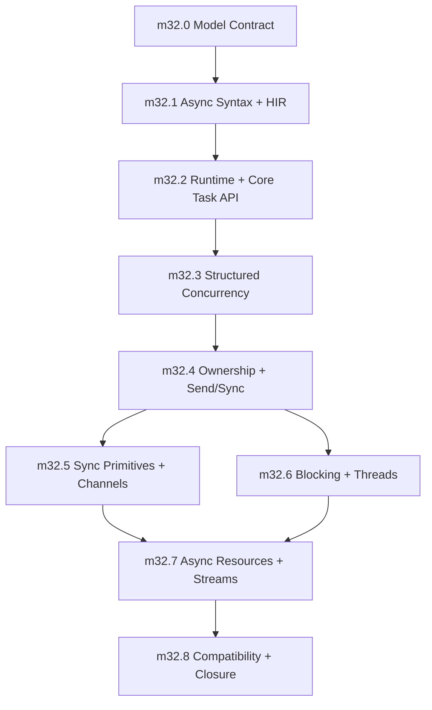

# Async and Concurrency Model Proposal

Status: proposal
Target phase: Phase 32 replacement candidate
Last updated: 2026-05-09

## Purpose

This document proposes the Sifr async and concurrency model and, more importantly, the milestone sequence for building it correctly.

The phase should not be an ecosystem grab bag. Its job is to make one coherent model real:

- Python-shaped syntax: `async def`, `await`, `async with`, `async for`
- Rust-shaped safety: ownership-aware task boundaries, explicit sharing, no hidden thread-safety wrappers
- Structured concurrency by default: parent scopes own child tasks
- Typed cancellation and shutdown behavior
- Explicit offload for CPU-bound or blocking work
- Blocking/IO annotations that power diagnostics instead of hidden scheduling changes
- Compatibility layers only after the canonical model exists

The phase succeeds when users can write practical concurrent Sifr programs without learning raw event-loop internals and without escaping Sifr's core guarantee: no user-triggerable runtime panics.

## Product Decision

The primary model is:

```sifr
async def fetch_one(url: str) -> Result[str, NetworkError]:
    response: Response = await http.get(url)
    return response.text()

async def main() -> Result[None, Error]:
    async with task.scope() as scope:
        first = scope.spawn(fetch_one("https://example.com/a"))
        second = scope.spawn(fetch_one("https://example.com/b"))

        a: str = await first
        b: str = await second
        print(a + b)
```

The user-facing vocabulary is:

- `async def`
- `await`
- `sifr.task`
- `sifr.sync`
- scoped task groups
- explicit channels and locks
- explicit blocking/thread offload
- `@blocking_io` and `@cpu_bound` annotations for diagnostic guidance

The primary model does not include:

- user-visible event-loop objects
- event-loop policies
- callback-first APIs
- implicit detached tasks
- implicit `Arc`, `Mutex`, or thread-safe wrapper insertion
- implicit offload of blocking or CPU-heavy calls
- raw `Future` manipulation as the normal user path

## Design Principles

### One Canonical Model

Sifr should have one main async story: `async def`, `await`, `sifr.task`, and `sifr.sync`.

`sifr.asyncio` can exist later as a compatibility veneer, but it must be implemented on top of the canonical model. It must not define the model.

### Structured Concurrency First

Task lifetime should be visible in source code. Child tasks should normally belong to a parent scope. Detached work must be explicit and rare.

Default APIs should prefer:

- `task.scope(...)`
- `task.TaskGroup`
- `scope.spawn(...)`: canonical task creation; all spawned tasks are children of a scope
- `task.gather(*handles)`: wait for multiple task handles, preserving input ordering
- `task.select(*handles)`: first-completion semantics; losers are cancelled by default
- `task.race(*handles)`: alias for `select`; losers are cancelled by default

Default APIs should not encourage:

- ambient global tasks
- silent fire-and-forget work
- orphaned task handles
- shutdown behavior that depends on runtime accident

### Async Is For Waiting

Async tasks are for I/O waiting and cooperative scheduling. CPU-bound work and blocking OS calls must use explicit offload APIs.

Required surfaces:

- `@blocking_io` for sync functions that perform blocking I/O
- `@cpu_bound` for sync functions expected to burn CPU
- `task.spawn_blocking(...)`
- `sifr.concurrent.ThreadPoolExecutor`

These annotations are diagnostic facts, not scheduling commands. Calling a `@blocking_io` function from async code should produce a Sifr diagnostic that suggests an async API when one exists, or explicit offload when it does not. Calling a `@cpu_bound` function from async code should suggest `spawn_blocking` or a thread-pool executor. The compiler must not silently rewrite either call into a task or thread.

Deferred surfaces:

- `ProcessPoolExecutor`
- multiprocessing-style APIs

Process pools require a stable typed data and IPC serialization contract. Shipping them first would force a premature transport model.

### No Implicit Shared Mutable Memory

The compiler must not silently turn local state into shared state.

Allowed explicit surfaces:

- `sync.Shared[T]`
- `sync.Lock[T]`
- `sync.RwLock[T]`
- `sync.Channel[T]`
- `sync.Semaphore`
- `sync.Notify`

Deferred coordination primitives:

- `sync.Barrier`
- `sync.Condvar`

`Barrier` and `Condvar` are useful, but they are not required to prove the first model. `Notify`, `Semaphore`, channels, and locks cover the common coordination paths with a smaller teaching surface.

Rejected implicit behavior:

- silently upgrading `Rc` to `Arc`
- silently wrapping mutable values in `Mutex`
- silently cloning captured mutable state for task safety
- silently moving a blocking call onto another executor
- implicitly detaching borrowed values from their owner

### Typed Failure and Cancellation

Cancellation is part of the contract, not an implementation detail.

Timeouts, task cancellation, sibling failure, shutdown tokens, and resource cleanup must have deterministic behavior and Sifr-native diagnostics. Cancellation must not become an ambient exception leak.

### Runtime Is An Implementation Detail

The implementation may use Tokio or a Tokio-compatible runtime substrate, but ordinary Sifr users should not configure a runtime directly.

The compiler should:

- detect async usage
- wire the required runtime dependency
- generate the correct entrypoint bootstrap
- reject invalid async usage before Rust compilation where possible
- translate remaining runtime/type-bound failures into Sifr diagnostics

## Scope Boundaries

### In Scope

- async syntax lowering
- awaitable type model
- runtime bootstrapping
- task handles
- scoped task groups
- cancellation and timeout semantics
- gather/select/race composition
- async context managers
- async iteration
- task-boundary ownership and Send/Sync checking
- explicit synchronization primitives
- explicit blocking/thread offload
- diagnostics and validation for the model

### Out Of Scope

- web framework
- typed serialization and pydantic-like validation
- database clients
- full `asyncio` parity
- raw event-loop APIs
- transports/protocols callback APIs
- public selectors module unless later socket work requires it
- `contextvars`
- multiprocessing
- process pools
- async generators and async comprehensions as phase exit requirements

Some out-of-scope items may get thin compatibility wrappers later. They should not be allowed to shape the core model.

`contextvars` is intentionally deferred. Sifr should prefer lexical scope and explicit task arguments over implicit task-local propagation. If later evidence shows a real need for task-local storage with structured inheritance, a `sifr.task.local[T]` primitive can be designed as a scoped, lexical value with structured inheritance, not as a global mutable copy-on-fork store.

`selectors` is intentionally not a public phase requirement. Runtime internals may use readiness machinery, but users should compose tasks and channels rather than file-descriptor readiness APIs. If low-level socket work later requires a public module, it should land as a curated compatibility layer with CPython-derived tests, not as a core async concept.

Async generators are distinct from async iteration. This phase owns the async iterable protocol and `async for` over channels/streams. User-defined `async def` with `yield` requires separate `AsyncGenerator` HIR and protocol work and remains a later feature.

## Architecture Targets

### Language and HIR

Add canonical HIR concepts rather than encoding async behavior through ad hoc expression strings.

Required concepts:

- async function marker
- await expression
- awaitable/future type
- task handle type
- task scope/group type
- cancellation token or cancellation result type
- async context-manager protocol
- async iterable protocol
- spawn-boundary capture model

Required HIR additions:

- async function metadata, either `HirStmt::AsyncFnDef` or `HirFunction::is_async`
- `HirExpr::Await`
- async function invocation metadata so async calls are distinguishable from sync calls before codegen
- `HirExpr::TaskSpawn` or an equivalent canonical task-spawn expression
- `HirStmt::AsyncWith`
- `HirStmt::AsyncFor`
- HIR type representation for `Task[T, E]`
- HIR type representation for `Awaitable[T]`
- capture metadata for spawn-boundary sendability, borrowing, and lifetime diagnostics

The HIR must preserve enough source information to emit Sifr diagnostics for:

- `await` outside async
- awaiting non-awaitable values
- spawning non-sendable values
- borrowed values escaping task boundaries
- invalid borrow across await points
- blocking calls in async contexts when statically known

### Type System

The type system needs first-class awaitability and task-boundary rules.

Required type additions:

- `Task[T, E]`: a typed task handle. It is not a `Result`; it is an awaitable handle that yields `Result[T, E]`.
- `Task[T]`: shorthand for `Task[T, Never]` plus cancellation, yielding `Result[T, CancellationError]`.
- `Awaitable[T]`: structural protocol for values that can be awaited. `Task[T, E]` implements `Awaitable[Result[T, E]]`.
- `AsyncFunction[Params, T, E]`: the callable type of `async def`. This may be implemented as a distinct type or as a capability flag on `Callable`, but the type checker must distinguish async callables from sync callables with the same parameters.
- `Never`: bottom type used by `Task[T, Never]`, exhaustive matches, and unreachable control flow. `Never` already exists in the architecture type enum and remains the no-value type.

Required rules:

- `Task[T, E]` requires `E: Error`, matching `Result[T, E]`. `Task[T, Never]` is valid because `Never` represents no possible error value.
- `await x` is valid only when `x` has an awaitable type.
- `await Task[T, E]` always produces `Result[T, E]`. Inside a `try` block, that `Result[T, E]` follows existing auto-unwrap semantics. Outside `try`, the caller observes the `Result[T, E]` expression type.
- Auto-unwrap applies to the `Result` produced by `await`, never to the `Task` handle itself.
- `await` is protocol-based: any type implementing `Awaitable[T]` is awaitable, not only `Task`.
- Calling an async function returns a `Task[T, E]` handle or equivalent awaitable value; it does not run as a sync function.
- `AsyncFunction` is not a subtype of sync `Function`/`Callable`. Storing an async function in a sync callable variable, passing it where a sync callable is required, or invoking it through a sync-call path is a compile-time error.
- `scope.spawn` requires captures and return values to satisfy task-boundary requirements.
- `scope.spawn` can use stricter lifetime-scoped rules than detached spawn.
- detached spawn is not exposed in v1. A future `spawn_detached`, if added, must require explicit owned, sendable, static captures.
- mutable cross-task access requires explicit synchronization.
- values borrowed across `await` must be proven valid or rejected.
- spawned tasks require sendable task boundaries in v1. Ordinary awaited futures within the same task do not introduce a spawn boundary.

Borrow rules at async boundaries:

| Value form | Across `await` in same task | Across `scope.spawn` |
| --- | --- | --- |
| immutable borrow | allowed only when the borrow remains valid and no conflicting mutation exists | allowed only when the scoped lifetime proves the task cannot outlive the borrow and the referent is share-safe |
| mutable borrow | rejected when it would remain live across `await` | rejected; use explicit synchronization or ownership transfer |
| owned value | allowed | allowed when the type is sendable across task boundaries |
| `sync.Shared[T]` | allowed for immutable shared data | allowed when `T` satisfies the share/send requirements |
| unsynchronized mutable state | rejected | rejected |

### Runtime and Codegen

The runtime substrate should be generated, not user-managed.

Codegen must:

- emit Rust async functions for Sifr async functions
- emit `.await` only for typed awaitable values
- bootstrap the runtime at async entrypoints
- materialize runtime dependencies only when needed
- preserve `Result`/`Option` safety across await points
- avoid generated `.unwrap()`, `.expect()`, and `panic!` in user-triggerable paths
- lower task scopes so all children are joined, cancelled, or consumed deterministically

### Diagnostics

All async diagnostics should be Sifr-native and stable.

Diagnostic families should cover:

- invalid async syntax/use
- non-awaitable await
- task-boundary Send/Sync failure
- borrow-across-await failure
- detached-task capture failure
- cancellation misuse
- blocking call in async context
- invalid async protocol implementation

Rust compiler errors can be used as implementation evidence, but they should not leak as the primary user experience.

## Milestone Sequence

The milestones below are ordered by dependency. Later ecosystem work should not start until this sequence has closed.

### milestone_async_0: Model Contract and Runtime Architecture Lock

Status: proposed

Goal: lock the semantic contract before adding code. This is a short design milestone that prevents the implementation from drifting into partial `asyncio` compatibility or raw Tokio exposure.

Work items:

- Write the canonical async/concurrency contract into `internal_docs/architecture.md`.
- Decide the runtime substrate boundary:
  - public Sifr API is runtime-neutral
  - implementation may use Tokio
  - no public event-loop object in the primary model
- Define core public modules:
  - `sifr.task`
  - `sifr.sync`
  - `sifr.concurrent`
- Define initial types:
  - `Task[T, E]`
  - `Task[T]` as shorthand for `Task[T, Never]` plus cancellation
  - `TaskGroup`
  - `TaskScope`
  - `CancellationError`
  - `TimeoutError`
  - `Channel[T]`
  - `Lock[T]`
- Define async type-system additions:
  - add task-handle type representation (`Type::Task` or equivalent)
  - add awaitable protocol representation (`Type::Awaitable` or equivalent structural protocol)
  - add async-callable representation (`Type::AsyncFunction` or an async capability on `Callable`)
  - confirm async functions are not interchangeable with sync functions of the same signature
  - reject assigning, passing, or invoking an `AsyncFunction` through a sync callable type
  - require `Task[T, E]` to satisfy `E: Error`, with `Never` accepted as the no-error bottom type
  - confirm `Task[T, E]` implements `Awaitable[Result[T, E]]`
- Define task container protocols:
  - `task.scope()` returns a `TaskScope`
  - `TaskScope` is an async context manager implementing async `__aenter__` and `__aexit__`
  - `async with task.scope() as scope` binds `scope` to the `TaskScope` instance
  - `TaskScope.__aexit__` waits for all children to finish, or cancels unfinished children on abnormal exit, and waits for cleanup before the scope exits
  - `TaskScope` cannot be used outside its `async with` lifetime
  - `TaskGroup` is the higher-level sibling-failure composition API built on top of task scopes; `TaskScope` owns lifetime, while `TaskGroup` owns group error policy
- Define HIR additions:
  - async function marker
  - await expression
  - async call representation
  - task spawn representation
  - async context-manager statement
  - async iteration statement
  - spawn capture metadata
- Resolve scope conflict with `internal_docs/phases/32_async_ecosystem.md`:
  - Phase 32 planning must follow this 9-milestone async/concurrency model
  - the older 4-milestone phase doc must be rewritten or explicitly marked superseded before implementation begins
  - subprocess and signal handling are not Phase 32 exit criteria for this v1 model
  - any future subprocess/signal work requires a separate model amendment and cannot be inferred from the older phase document
- Lock task result semantics:
  - `await Task[T, E]` always yields `Result[T, E]`
  - `await Task[T]` yields `Result[T, CancellationError]`
  - existing `try`/`except` auto-unwrap works on that result inside `try` blocks
  - outside `try`, the observable expression type remains `Result[T, E]`
  - auto-unwrap is sequenced after await: first `await` produces `Result[T, E]`, then `try` unwraps that result or routes `E` to the matching `except`
- Define detached task policy:
  - v1 exposes scoped spawn only
  - `scope.spawn(...)` is the canonical task creation API
  - free-floating detached spawn is deferred
  - any future `spawn_detached` must require explicit owned/static/sendable captures
- Define cancellation policy:
  - `CancellationError` and `TimeoutError` live in `sifr.task`
  - `Task[T, E]` uses `CancellationError` when a task is cancelled before completing
  - `task.timeout` uses `TimeoutError` when an operation exceeds its deadline
  - timeout cancels the enclosed operation
  - task-group failure cancels unfinished siblings
  - cancelling a task is observable and typed
  - cancellation waits for cleanup before scope exit
- Define selection policy:
  - `select` / `race` cancel losing tasks by default
  - if multiple tasks complete in the same scheduler tick, handle creation order breaks ties deterministically
  - users must not rely on tie-breaking order for correctness; use `gather` plus explicit priority logic when order matters
  - users who need all results should use `gather`
  - users who need non-cancelling competition must keep handles and perform explicit cleanup
- Define channel policy:
  - `sync.Channel[T]` is multi-producer, multi-consumer
  - unbounded channels use `sync.channel[T]()`
  - bounded channels use `sync.bounded_channel[T](capacity)`
  - bounded channels apply backpressure when full
- Define lock policy:
  - `sync.Lock[T]` uses a synchronous Rust mutex internally in v1
  - `lock()` is not await-aware and returns a guard restricted to a synchronous lexical scope
  - lock guards must not cross `await` points in v1
  - the type checker rejects a live `LockGuard` or `RwLockGuard` at an `await` point
  - diagnostic family: async safety
  - message: "lock guard is still live at this await point; lock guards cannot cross await points in v1"
  - help: "release the lock before the await, or use a channel to communicate results instead"
  - a distinct `sync.AsyncLock[T]`, if needed, is deferred
- Define blocking annotation policy:
  - `@blocking_io` and `@cpu_bound` are compile-time diagnostic annotations
  - they never imply automatic task/thread scheduling
  - stdlib blocking APIs should be annotated as the database of known blocking calls
  - diagnostics are warning-level in v1 unless the called API is known to break runtime safety
  - a formal effect/capability system can be evaluated after the v1 annotation model has evidence
- Define runtime-neutral API gate:
  - no public Sifr API may expose Tokio or runtime-specific types
  - runtime internals stay behind `sifr._runtime` or an equivalent private boundary
- Define runtime selection policy:
  - Tokio or the chosen Tokio-compatible substrate is the only v1 runtime
  - users do not configure or select runtimes in the primary model
  - multiple runtime instances in one generated binary are unsupported in v1
  - custom runtime injection and runtime tuning are deferred
- Define validation fixture names and diagnostics codes before implementation begins.

Acceptance criteria:

- The model contract is documented.
- The phase explicitly rejects raw event-loop APIs as primary API.
- Typed serialization, web, process pools, and full `asyncio` parity are documented as out of scope.
- Every later milestone has positive and negative validation targets.
- The previously open decisions are locked or explicitly moved to v2 with a dependency.

Validation:

- Documentation review only.
- No compiler behavior change required.

### milestone_async_1: Async Syntax, Awaitability, and HIR Substrate

Status: proposed

Goal: teach the compiler to understand async syntax as typed Sifr semantics without introducing task scheduling yet.

Work items:

- Parse and lower `async def`.
- Parse and lower `await`.
- Add HIR nodes for async functions and await expressions.
- Add awaitable/future type representation.
- Add await type-checking: `await x` is valid only when `x: Awaitable[T]`, and the result type of the await expression is `T`.
- Add structural awaitable protocol checking. Nominal conformance is not required when a type structurally implements the await protocol.
- Reject `await` outside async functions.
- Reject awaiting non-awaitable values.
- Preserve existing `try`/`except` auto-unwrap behavior for `Result` values produced by await expressions, even if runtime execution arrives in the next milestone.
- Add source-span plumbing for async diagnostics.
- Add initial codegen shape for async functions that do not spawn tasks.

Acceptance criteria:

- `async def` is represented explicitly in HIR.
- `await` is represented explicitly in HIR.
- Type checking distinguishes awaitable and non-awaitable values.
- Awaiting `Task[T, E]` has one stable type: `Result[T, E]`.
- Invalid async syntax/use fails before Rust compilation.
- The implementation does not introduce raw string fallback paths.

Positive validation:

- `async_basic.sifr`
- `await_chain.sifr`
- `async_result_auto_unwrap.sifr`

Negative validation:

- `await_outside_async.sifr`
- `await_non_awaitable.sifr`
- `async_return_type_mismatch.sifr`

Demo:

- `demos/m32_async_syntax_demo.sifr`

### milestone_async_2: Runtime Bootstrap and Core Task API

Status: proposed

Goal: make ordinary async programs run without user-managed runtime setup.

Work items:

- Auto-detect async entrypoints.
- Generate runtime bootstrap for `async def main()`.
- Support `async def main() -> Result[None, E]` where `E: Error` as the canonical async program entrypoint.
- Wire runtime dependencies only when async is used.
- Implement `sifr.task.sleep`.
- Implement `sifr.task.timeout`.
- Implement the minimal `sifr.task.scope` runtime container needed for scoped spawn.
- Implement `scope.spawn` returning a typed task handle.
- Implement task-handle `join`.
- Implement task-handle cancellation API.
- Translate obvious runtime/task-boundary failures into Sifr diagnostics.

Acceptance criteria:

- Async programs run through `sifr run`.
- Sync programs do not gain async runtime dependencies.
- `scope.spawn` returns a handle that must be awaited or joined.
- There is no free-floating detached spawn in v1.
- `task.sleep` and `task.timeout` work.
- Cancelling a task produces typed, deterministic behavior.
- Runtime bootstrap does not require user-visible event-loop configuration.
- Public `sifr.task`, `sifr.sync`, and `sifr.concurrent` APIs do not expose runtime-specific implementation types.

Positive validation:

- `async_runtime_bootstrap.sifr`
- `scope_spawn_join.sifr`
- `task_sleep.sifr`
- `task_timeout_success.sifr`
- `task_cancel_basic.sifr`
- `runtime_leak_rejected.sifr`

Negative validation:

- `task_handle_unused_must_join_or_cancel.sifr`
- `detached_spawn_not_available.sifr`
- `task_timeout_error_type.sifr`
- `spawn_non_send_initial_diagnostic.sifr`

Demo:

- `demos/m32_task_core_demo.sifr`

### milestone_async_3: Structured Concurrency and Cancellation Semantics

Status: proposed

Goal: make scoped concurrency the default composition model.

Work items:

- Implement `task.scope`.
- Implement `task.TaskGroup`.
- Implement `scope.spawn`.
- Implement deterministic scope exit:
  - all child tasks complete,
  - or unfinished children are cancelled,
  - and cleanup is awaited before exit.
- Implement sibling cancellation on first failure for task groups.
- Implement `task.gather` with deterministic result ordering.
- Define `task.gather` error behavior:
  - by default, the first child error cancels unfinished children and returns that typed error
  - if multiple children fail before cancellation completes, the earliest handle in input order is the primary error and later errors are secondary structured errors
  - a future collect-all API may return all `Result` values, but v1 `gather` is fail-fast and cancellation-safe
- Implement `task.select` and `task.race` for first-completion behavior.
- Cancel losing tasks by default for `select` and `race`.
- Define how cancellation composes with `Result`.
- Add diagnostics for leaked task handles and invalid scope escape.

Acceptance criteria:

- Task scopes own child task lifetimes.
- A task spawned inside a scope cannot escape with borrowed state that outlives the scope.
- Task-group failure cancels unfinished siblings.
- Cancellation is observable through the Sifr type model.
- `gather` preserves input ordering for successes and has documented fail-fast cancellation behavior for errors.
- `select`/`race` deterministically cancel losing tasks by default.
- Nested cancellation scopes propagate cancellation in a documented order.

Positive validation:

- `task_scope_basic.sifr`
- `task_group_basic.sifr`
- `task_group_error_cancels_siblings.sifr`
- `task_gather_ordered.sifr`
- `task_select_first_completion.sifr`
- `task_race_cancels_losers.sifr`
- `cancellation_scope_timeout.sifr`
- `cancellation_group_sibling.sifr`
- `cancellation_nested_scopes.sifr`
- `cancellation_cleanup_runs.sifr`

Negative validation:

- `task_escape_scope_rejected.sifr`
- `cancelled_task_use_rejected.sifr`
- `task_group_unhandled_error_rejected.sifr`

Demo:

- `demos/m32_structured_concurrency_demo.sifr`

### milestone_async_4: Async Ownership and Send/Sync Boundary Checking

Status: proposed

Goal: make concurrency safety a Sifr compiler feature, not a raw Rust error after codegen.

Work items:

- Track task captures in HIR.
- Check `Send` eligibility for spawned task captures.
- Check `Sync` eligibility where shared references cross boundaries.
- Reject borrowed values that escape a task boundary.
- Reject invalid borrows held across await points.
- Validate scoped spawn requirements and keep detached spawn unavailable in v1.
- Implement field-path diagnostics for non-sendable captures.
- Ensure no compiler path silently inserts sharing wrappers.
- Add regression tests for user-defined classes, lists, dicts, closures, nested functions, and captured `self`.

Acceptance criteria:

- Spawn-boundary errors are reported as Sifr diagnostics.
- Diagnostics identify the captured value and non-sendable field where possible.
- Scoped spawn allows only lifetimes that the scope can prove safe.
- Detached spawn remains unavailable; any attempt to use it receives an intentional diagnostic.
- Borrow-across-await rejection is deterministic and documented.
- No `rustc` Send/Sync diagnostic is the primary user-facing error for covered cases.

Positive validation:

- `spawn_owned_send_value.sifr`
- `spawn_scoped_borrow_ok.sifr`
- `spawn_capture_immutable_shared_ok.sifr`
- `await_without_live_borrow.sifr`

Negative validation:

- `spawn_non_send_field_rejected.sifr`
- `spawn_borrowed_value_escapes_rejected.sifr`
- `borrow_across_await_rejected.sifr`
- `spawn_mutable_alias_rejected.sifr`
- `spawn_self_with_non_send_field_rejected.sifr`

Demo:

- `demos/m32_async_safety_demo.sifr`

### milestone_async_5: Synchronization Primitives and Channels

Status: proposed

Goal: provide the explicit primitives users need when concurrency really requires sharing or coordination.

Work items:

- Implement `sync.Shared[T]` for immutable shared ownership, mapping to atomic shared ownership (`Arc<T>`-style semantics) with no mutation API.
- Implement `sync.Lock[T]`.
- Implement `sync.RwLock[T]`.
- Implement `sync.Channel[T]`.
- Implement unbounded MPMC channels via `sync.channel[T]()`.
- Implement bounded MPMC channels via `sync.bounded_channel[T](capacity)`.
- Implement channel send/receive close semantics:
  - `channel.send(value)` on a closed channel returns `Result[None, ClosedError]`
  - `channel.receive()` returns `Result[Option[T], ClosedError]`
  - `None` indicates graceful end-of-stream after close and drain
  - `channel.close()` wakes pending senders and receivers deterministically
  - a task cancelled while blocked on `send` or `receive` propagates cancellation
  - bounded channels apply backpressure when full
- Implement `sync.Semaphore`.
- Implement `sync.Notify`.
- Define sync primitive behavior in async and blocking contexts.
- Reject lock guards that remain live across an `await` point using the v1 `LockGuard`/`RwLockGuard` liveness rule defined in `milestone_async_0`.
- Add diagnostics for lock misuse where statically knowable.

Acceptance criteria:

- Shared immutable state works across tasks through `sync.Shared[T]`.
- `sync.Shared[T]` exposes shared ownership only; mutation requires `Lock`, `RwLock`, or message passing.
- Mutable shared state requires `Lock` or `RwLock`.
- Channels are the canonical queue-like concurrency primitive and are MPMC in v1.
- Channel close and receiver exhaustion behavior is typed and deterministic.
- Channel cancellation behavior is typed and deterministic.
- Lock guards cannot cross `await` points in v1.
- Semaphore and notify primitives support common coordination patterns.
- The compiler rejects unsynchronized shared mutable access.

Positive validation:

- `shared_basic.sifr`
- `lock_basic.sifr`
- `rwlock_readers.sifr`
- `channel_basic.sifr`
- `channel_backpressure.sifr`
- `channel_close.sifr`
- `channel_cancel_pending_receive.sifr`
- `semaphore_basic.sifr`
- `notify_basic.sifr`

Negative validation:

- `shared_mut_without_lock_rejected.sifr`
- `channel_send_wrong_type_rejected.sifr`
- `channel_non_send_element_rejected.sifr`
- `lock_guard_escape_rejected.sifr`
- `lock_guard_across_await_rejected.sifr`
- `lock_across_task_boundary_rejected.sifr`

Demo:

- `demos/m32_sync_primitives_demo.sifr`

### milestone_async_6: Blocking and Thread-Based Offload

Status: proposed

Goal: keep the async scheduler for waiting and provide explicit APIs for CPU-bound or blocking work.

Work items:

- Implement `@blocking_io` as a diagnostic annotation for sync functions that perform blocking I/O.
- Implement `@cpu_bound` as a diagnostic annotation for sync functions that are CPU-heavy.
- Annotate known blocking stdlib functions so async-context diagnostics can be precise.
- Implement `task.spawn_blocking`.
- Implement `sifr.concurrent.ThreadPoolExecutor`.
- Add `sifr.threading` as a compatibility veneer over the same thread and sync substrate where it can stay thin:
  - `Thread`
  - `Lock`
  - `Event`
  - `Condition`
- Define return/error/cancellation behavior for blocking tasks.
- Add diagnostics for known blocking stdlib calls used directly in async contexts.
- Ensure blocking work cannot accidentally occupy cooperative async workers where Sifr can control the path.
- Document when users should choose async tasks, channels, locks, or blocking offload.

Compatibility mapping:

| Compatibility API | Canonical Sifr equivalent |
| --- | --- |
| `sifr.threading.Thread` | `sifr.concurrent.Thread` or thread-pool-backed standalone thread API |
| `sifr.threading.Lock` | `sifr.sync.Lock` compatibility wrapper |
| `sifr.threading.Event` | `sifr.sync.Notify` compatibility wrapper |
| `sifr.threading.Condition` | `sifr.sync.Notify` plus `sifr.sync.Lock` compatibility wrapper |

Acceptance criteria:

- CPU-bound functions can be offloaded explicitly.
- Blocking work returns typed results.
- Thread-pool tasks obey Send/Sync capture rules.
- Direct known-blocking calls and annotated `@blocking_io` calls in async functions produce diagnostics where statically knowable.
- Direct `@cpu_bound` calls in async functions suggest `spawn_blocking` or `ThreadPoolExecutor`.
- `sifr.threading` compatibility APIs are thin wrappers and do not introduce a second synchronization model.
- Process pools remain explicitly blocked on the future typed IPC/serialization contract.

Positive validation:

- `spawn_blocking_basic.sifr`
- `spawn_blocking_result.sifr`
- `thread_pool_executor_basic.sifr`
- `thread_pool_executor_many_tasks.sifr`
- `blocking_io_annotation_diagnostic.sifr`
- `cpu_bound_annotation_diagnostic.sifr`
- `threading_lock_subset.sifr`
- `threading_event_subset.sifr`

Negative validation:

- `blocking_call_in_async_rejected.sifr`
- `thread_pool_non_send_capture_rejected.sifr`
- `process_pool_deferred_diagnostic.sifr`

Demo:

- `demos/m32_blocking_offload_demo.sifr`

### milestone_async_7: Async Resource Protocols and Stream Iteration

Status: proposed

Goal: complete the language-level async control-flow model without dragging in broad ecosystem APIs.

Work items:

- Implement `async with`.
- Define and enforce the async context-manager protocol.
- Implement async iterable protocol.
- Implement `async for`.
- Define cancellation cleanup behavior for async context managers:
  - cleanup order is LIFO, matching acquisition order in reverse
  - cancelling a task inside `async with` unwinds all active async context managers
  - async exit receives the cancellation cause
  - async exit runs to completion unless the enclosing runtime is forcefully aborted
  - errors from async exit during cancellation are secondary structured errors
  - panic-like failures from async exit must be caught at the runtime/codegen boundary and surfaced as secondary structured errors, not process aborts
  - parent cancellation triggers child cancellation, but each task unwinds its own cleanup independently
- Define channel-backed async iteration.
- Keep async generators and async comprehensions deferred; they require separate `AsyncGenerator` HIR and protocol work.

Acceptance criteria:

- `async with` calls async enter/exit protocol methods correctly.
- Async resource cleanup runs under cancellation.
- When a task is cancelled inside an `async with` block, async exit/cleanup is called before scope exit completes.
- If cleanup itself fails during cancellation, the cancellation remains the primary result and cleanup failure is surfaced as secondary structured error evidence through the owning scope.
- Async exit cleanup order is LIFO.
- Panic-like failures in async exit do not become process-terminating double-panic paths.
- Nested cancellation is deterministic: parent cancellation triggers child cancellation, and every task unwinds its own cleanup independently.
- `async for` works for channel/stream-like values.
- Async comprehensions are explicitly deferred as syntax sugar over stable `async for`.
- Non-async iterables are rejected in `async for`.
- Async protocol diagnostics are Sifr-native.

Positive validation:

- `async_with_basic.sifr`
- `async_with_cancel_cleanup.sifr`
- `async_with_nested_cleanup_order.sifr`
- `async_for_channel.sifr`
- `async_for_stream_result.sifr`

Negative validation:

- `async_with_missing_protocol_rejected.sifr`
- `async_for_non_async_iterable_rejected.sifr`
- `async_resource_cleanup_error_typed.sifr`
- `async_with_cleanup_panic_secondary.sifr`

Demo:

- `demos/m32_async_resource_demo.sifr`

### milestone_async_8: Compatibility Veneers and Phase Closure

Status: proposed

Goal: expose limited compatibility surfaces only after the canonical model is proven.

Work items:

- Add `sifr.asyncio` as a veneer over `sifr.task` and `sifr.sync`.
- Support only the curated subset:
  - `run`
  - `create_task`
  - `gather`
  - `TaskGroup`
  - `sleep`
  - `wait_for`
  - `Queue`
- Add `sifr.concurrent.Future` as a type alias for `sifr.task.Task`, not a separate runtime primitive.
- Keep raw event loops, loop policies, transports/protocols, public selectors, context variables, multiprocessing, and process pools deferred.
- Treat `ProcessPoolExecutor` as blocked on the future typed IPC/serialization contract, not merely postponed.
- Track `ProcessPoolExecutor` as a hard dependency on Phase 40 typed IPC/serialization before any process-pool implementation begins.
- Add CPython-derived compatibility tests for the supported subset.
- Add CPython-derived negative/waiver tests for unsupported raw loop, selector, transport/protocol, contextvars, multiprocessing, and process-pool APIs.
- Document intentional divergences.
- Run full phase closure validation.

Compatibility mapping:

| Compatibility API | Canonical Sifr equivalent |
| --- | --- |
| `sifr.asyncio.run(fn)` | compatibility shim over direct async entrypoint bootstrap; not needed for new Sifr code |
| `sifr.asyncio.create_task(fn)` | `scope.spawn(fn)` inside an explicit task scope |
| `sifr.asyncio.gather(*tasks)` | `sifr.task.gather(*tasks)` |
| `sifr.asyncio.TaskGroup` | `sifr.task.TaskGroup` |
| `sifr.asyncio.sleep(delay)` | `sifr.task.sleep(delay)` |
| `sifr.asyncio.wait_for(task, timeout)` | `sifr.task.timeout(task, timeout)` |
| `sifr.asyncio.timeout(duration)` | `sifr.task.timeout(duration)` context-manager form |
| `sifr.asyncio.Queue` | `sifr.sync.Channel` / `sifr.sync.bounded_channel` |
| `sifr.concurrent.Future` | `sifr.task.Task` type alias |

Curated subset rationale:

- `sifr.asyncio` covers only common compatibility APIs that map cleanly to the canonical model.
- `asyncio.Event` maps to `sifr.sync.Notify` where needed, but the canonical API remains `sifr.sync.Notify`.
- `asyncio.Condition` maps to `sifr.sync.Notify` plus `sifr.sync.Lock` where needed.
- `asyncio.Barrier` is deferred with `sifr.sync.Barrier`.
- `asyncio.wait` maps to `task.gather` for all-results composition or `task.select` / `task.race` for first-completion behavior.
- `asyncio.as_completed` should be modeled with channel-backed producers and `async for` rather than a distinct core primitive.

Acceptance criteria:

- Compatibility APIs are thin wrappers over canonical model types.
- No compatibility API introduces a second runtime model.
- `sifr.concurrent.Future` is an alias over task handles, not a second future implementation.
- Unsupported `asyncio` APIs fail with intentional diagnostics or remain absent from documented public surface.
- Intentional divergences are documented.
- The phase exit gate passes.

Positive validation:

- `asyncio_run_subset.sifr`
- `asyncio_create_task_subset.sifr`
- `asyncio_task_group_subset.sifr`
- `asyncio_wait_for_subset.sifr`
- `asyncio_queue_via_channel.sifr`
- `concurrent_future_subset.sifr`

Negative validation:

- `asyncio_loop_policy_not_supported.sifr`
- `asyncio_transport_protocol_not_supported.sifr`
- `selectors_public_api_deferred.sifr`
- `contextvars_deferred.sifr`
- `process_pool_not_available.sifr`

Demo:

- `demos/m32_async_concurrency_model_demo.sifr`

## Dependency Graph



## Phase Exit Gate

The phase is complete only when all of these are true:

- `async def` and `await` are first-class typed Sifr constructs.
- Async entrypoints run without user-visible runtime setup.
- `sifr.task` supports scoped spawn, join, cancel, sleep, timeout, gather, select/race, `TaskGroup` structured groups, and `TaskScope` containers via `async with task.scope()`.
- Structured concurrency is the default successful path.
- Detached task behavior is either absent or explicit and restricted.
- Cancellation semantics are deterministic and typed.
- Task-boundary Send/Sync and borrow rules are enforced by Sifr diagnostics.
- Explicit synchronization primitives exist for shared state.
- Channels are the canonical producer/consumer primitive.
- CPU-bound and blocking work has explicit offload APIs.
- `async with` and `async for` work for protocol-conforming values.
- Compatibility veneers do not define a second async model.
- No new user-triggerable generated panic paths exist.
- Full local validation passes.

## Required Validation Lanes

Every implementation PR should run at least:

```bash
scripts/run_all_tests.sh --profile quick
```

Milestone closure should run:

```bash
scripts/run_all_tests.sh
```

The phase should add these validation families:

- async syntax pass/fail fixtures
- awaitability type-check fixtures
- runtime bootstrap fixtures
- task lifecycle fixtures
- cancellation determinism fixtures
- structured concurrency fixtures
- task-boundary ownership fixtures
- Send/Sync diagnostics fixtures
- synchronization primitive fixtures
- channel close/backpressure fixtures
- channel cancellation fixtures
- blocking offload fixtures
- blocking/CPU annotation diagnostics fixtures
- async context-manager fixtures
- async iteration fixtures
- compatibility veneer fixtures
- runtime-neutrality checks proving Tokio/runtime-specific types do not leak into public Sifr APIs
- async cleanup panic-boundary fixtures
- generated-code panic sweep for async/runtime paths

## Locked V1 Decisions

These decisions are locked for the first async/concurrency model. `milestone_async_0` should copy them into the architecture contract before implementation begins.

1. `scope.spawn` is the canonical v1 task creation API. Free-floating detached spawn is not exposed.
2. Task cancellation is represented as a standard `CancellationError` in the task result/error model.
3. `await Task[T, E]` always produces `Result[T, E]`. `try`/`except` auto-unwrap works on that result, but the expression type is not context-dependent.
4. `task.select` and `task.race` cancel losing tasks by default.
5. `sync.Channel[T]` is multi-producer, multi-consumer. Unbounded and bounded constructors are separate.
6. Lock guards must not cross `await` points in v1.
7. Spawned tasks require sendable task boundaries in v1. Local, non-Send task sets are deferred.
8. `sifr.asyncio` ships only as a compatibility veneer after the canonical model is complete.
9. Public selectors, contextvars, multiprocessing, process pools, raw event loops, and transport/protocol APIs are deferred.
10. `ProcessPoolExecutor` is blocked on the future typed IPC/serialization contract.
11. `@blocking_io` and `@cpu_bound` are diagnostics annotations, not implicit scheduling directives.
12. Subprocess and signal APIs are out of scope for Phase 32 v1 and require a later model amendment.

## Recommendation

Use this proposal to rewrite Phase 32 from "Async and Ecosystem Foundation" into "Async and Concurrency Model".

The phase should close the model first. Web, typed data, subprocess expansion, database clients, and broad CPython async parity should build on top later.
