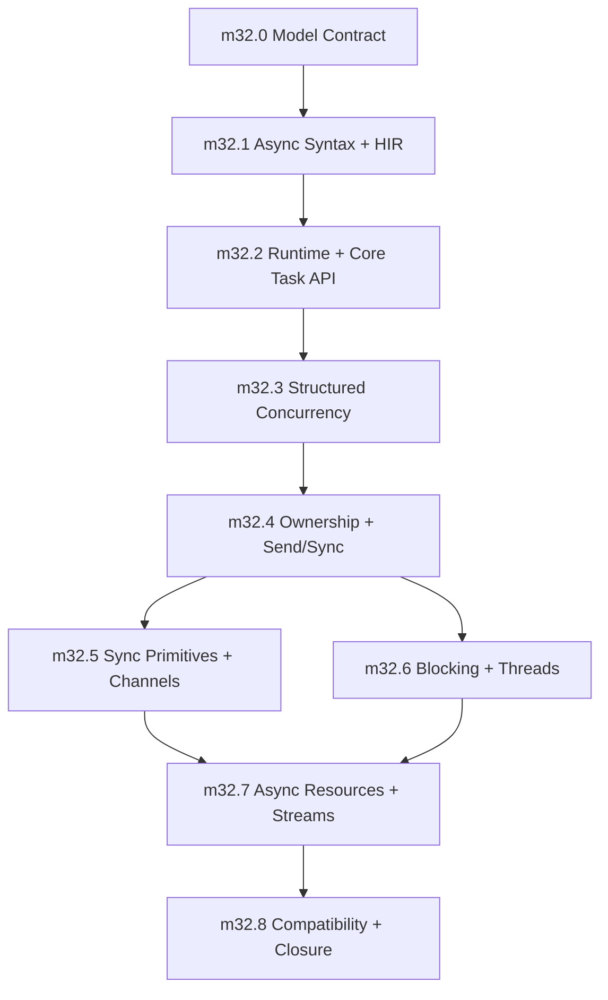

# Async and Concurrency Model Proposal

Status: proposal
Target phase: Phase 32 replacement candidate
Last updated: 2026-05-09

## Purpose

This document proposes the Sifr async and concurrency model and, more importantly, the milestone sequence for building it correctly.

The phase should not be an ecosystem grab bag. Its job is to make one coherent model real:

- Python-shaped syntax: `async def`, `await`, `async with`, `async for`
- Rust-shaped safety: ownership-aware task boundaries, explicit sharing, no hidden thread-safety wrappers
- Structured concurrency by default: parent scopes own child tasks
- Typed cancellation and shutdown behavior
- Explicit offload for CPU-bound or blocking work
- Compatibility layers only after the canonical model exists

The phase succeeds when users can write practical concurrent Sifr programs without learning raw event-loop internals and without escaping Sifr's core guarantee: no user-triggerable runtime panics.

## Product Decision

The primary model is:

```sifr
async def fetch_one(url: str) -> Result[str, NetworkError]:
    response: Response = await http.get(url)
    return response.text()

async def main() -> Result[None, Error]:
    async with task.scope() as scope:
        first = scope.spawn(fetch_one("https://example.com/a"))
        second = scope.spawn(fetch_one("https://example.com/b"))

        a: str = await first
        b: str = await second
        print(a + b)
```

The user-facing vocabulary is:

- `async def`
- `await`
- `sifr.task`
- `sifr.sync`
- scoped task groups
- explicit channels and locks
- explicit blocking/thread offload

The primary model does not include:

- user-visible event-loop objects
- event-loop policies
- callback-first APIs
- implicit detached tasks
- implicit `Arc`, `Mutex`, or thread-safe wrapper insertion
- raw `Future` manipulation as the normal user path

## Design Principles

### One Canonical Model

Sifr should have one main async story: `async def`, `await`, `sifr.task`, and `sifr.sync`.

`sifr.asyncio` can exist later as a compatibility veneer, but it must be implemented on top of the canonical model. It must not define the model.

### Structured Concurrency First

Task lifetime should be visible in source code. Child tasks should normally belong to a parent scope. Detached work must be explicit and rare.

Default APIs should prefer:

- `task.scope(...)`
- `task.TaskGroup`
- `scope.spawn(...)`
- `task.gather(...)`
- `task.select(...)`
- `task.race(...)`

Default APIs should not encourage:

- ambient global tasks
- silent fire-and-forget work
- orphaned task handles
- shutdown behavior that depends on runtime accident

### Async Is For Waiting

Async tasks are for I/O waiting and cooperative scheduling. CPU-bound work and blocking OS calls must use explicit offload APIs.

Required surfaces:

- `task.spawn_blocking(...)`
- `concurrent.ThreadPoolExecutor`

Deferred surfaces:

- `ProcessPoolExecutor`
- multiprocessing-style APIs

Process pools require a stable typed data and IPC serialization contract. Shipping them first would force a premature transport model.

### No Implicit Shared Mutable Memory

The compiler must not silently turn local state into shared state.

Allowed explicit surfaces:

- `sync.Shared[T]`
- `sync.Lock[T]`
- `sync.RwLock[T]`
- `sync.Channel[T]`
- `sync.Semaphore`
- `sync.Notify`

Rejected implicit behavior:

- silently upgrading `Rc` to `Arc`
- silently wrapping mutable values in `Mutex`
- silently cloning captured mutable state for task safety
- implicitly detaching borrowed values from their owner

### Typed Failure and Cancellation

Cancellation is part of the contract, not an implementation detail.

Timeouts, task cancellation, sibling failure, shutdown tokens, and resource cleanup must have deterministic behavior and Sifr-native diagnostics. Cancellation must not become an ambient exception leak.

### Runtime Is An Implementation Detail

The implementation may use Tokio or a Tokio-compatible runtime substrate, but ordinary Sifr users should not configure a runtime directly.

The compiler should:

- detect async usage
- wire the required runtime dependency
- generate the correct entrypoint bootstrap
- reject invalid async usage before Rust compilation where possible
- translate remaining runtime/type-bound failures into Sifr diagnostics

## Scope Boundaries

### In Scope

- async syntax lowering
- awaitable type model
- runtime bootstrapping
- task handles
- scoped task groups
- cancellation and timeout semantics
- gather/select/race composition
- async context managers
- async iteration
- task-boundary ownership and Send/Sync checking
- explicit synchronization primitives
- explicit blocking/thread offload
- diagnostics and validation for the model

### Out Of Scope

- web framework
- typed serialization and pydantic-like validation
- database clients
- full `asyncio` parity
- raw event-loop APIs
- transports/protocols callback APIs
- public selectors module unless later socket work requires it
- `contextvars`
- multiprocessing
- process pools
- async generators and async comprehensions as phase exit requirements

Some out-of-scope items may get thin compatibility wrappers later. They should not be allowed to shape the core model.

## Architecture Targets

### Language and HIR

Add canonical HIR concepts rather than encoding async behavior through ad hoc expression strings.

Required concepts:

- async function marker
- await expression
- awaitable/future type
- task handle type
- task scope/group type
- cancellation token or cancellation result type
- async context-manager protocol
- async iterable protocol
- spawn-boundary capture model

The HIR must preserve enough source information to emit Sifr diagnostics for:

- `await` outside async
- awaiting non-awaitable values
- spawning non-sendable values
- borrowed values escaping task boundaries
- invalid borrow across await points
- blocking calls in async contexts when statically known

### Type System

The type system needs first-class awaitability and task-boundary rules.

Required rules:

- `await x` is valid only when `x` has an awaitable type.
- `await Task[T, E]` produces `Result[T, E]` or participates in existing `try`/`except` auto-unwrap rules.
- `task.spawn` requires captures and return values to satisfy task-boundary requirements.
- `scope.spawn` can use stricter lifetime-scoped rules than detached spawn.
- `spawn_detached`, if exposed, requires owned, sendable, static captures.
- mutable cross-task access requires explicit synchronization.
- values borrowed across `await` must be proven valid or rejected.

### Runtime and Codegen

The runtime substrate should be generated, not user-managed.

Codegen must:

- emit Rust async functions for Sifr async functions
- emit `.await` only for typed awaitable values
- bootstrap the runtime at async entrypoints
- materialize runtime dependencies only when needed
- preserve `Result`/`Option` safety across await points
- avoid generated `.unwrap()`, `.expect()`, and `panic!` in user-triggerable paths
- lower task scopes so all children are joined, cancelled, or consumed deterministically

### Diagnostics

All async diagnostics should be Sifr-native and stable.

Diagnostic families should cover:

- invalid async syntax/use
- non-awaitable await
- task-boundary Send/Sync failure
- borrow-across-await failure
- detached-task capture failure
- cancellation misuse
- blocking call in async context
- invalid async protocol implementation

Rust compiler errors can be used as implementation evidence, but they should not leak as the primary user experience.

## Milestone Sequence

The milestones below are ordered by dependency. Later ecosystem work should not start until this sequence has closed.

### milestone_async_0: Model Contract and Runtime Architecture Lock

Status: proposed

Goal: lock the semantic contract before adding code. This is a short design milestone that prevents the implementation from drifting into partial `asyncio` compatibility or raw Tokio exposure.

Work items:

- Write the canonical async/concurrency contract into `internal_docs/architecture.md`.
- Decide the runtime substrate boundary:
  - public Sifr API is runtime-neutral
  - implementation may use Tokio
  - no public event-loop object in the primary model
- Define core public modules:
  - `sifr.task`
  - `sifr.sync`
  - `sifr.concurrent`
- Define initial types:
  - `Task[T]`
  - `TaskGroup`
  - `TaskScope`
  - `CancellationError` or `Cancelled`
  - `TimeoutError`
  - `Channel[T]`
  - `Lock[T]`
- Define detached task policy:
  - either no detached tasks in the first phase
  - or `spawn_detached` only with explicit owned/static/sendable captures
- Define cancellation policy:
  - timeout cancels the enclosed operation
  - task-group failure cancels unfinished siblings
  - cancelling a task is observable and typed
  - cancellation waits for cleanup before scope exit
- Define validation fixture names and diagnostics codes before implementation begins.

Acceptance criteria:

- The model contract is documented.
- The phase explicitly rejects raw event-loop APIs as primary API.
- Typed serialization, web, process pools, and full `asyncio` parity are documented as out of scope.
- Every later milestone has positive and negative validation targets.

Validation:

- Documentation review only.
- No compiler behavior change required.

### milestone_async_1: Async Syntax, Awaitability, and HIR Substrate

Status: proposed

Goal: teach the compiler to understand async syntax as typed Sifr semantics without introducing task scheduling yet.

Work items:

- Parse and lower `async def`.
- Parse and lower `await`.
- Add HIR nodes for async functions and await expressions.
- Add awaitable/future type representation.
- Reject `await` outside async functions.
- Reject awaiting non-awaitable values.
- Preserve existing `try`/`except` auto-unwrap behavior across await boundaries in HIR design, even if runtime execution arrives in the next milestone.
- Add source-span plumbing for async diagnostics.
- Add initial codegen shape for async functions that do not spawn tasks.

Acceptance criteria:

- `async def` is represented explicitly in HIR.
- `await` is represented explicitly in HIR.
- Type checking distinguishes awaitable and non-awaitable values.
- Invalid async syntax/use fails before Rust compilation.
- The implementation does not introduce raw string fallback paths.

Positive validation:

- `async_basic.sifr`
- `await_chain.sifr`
- `async_result_auto_unwrap.sifr`

Negative validation:

- `await_outside_async.sifr`
- `await_non_awaitable.sifr`
- `async_return_type_mismatch.sifr`

Demo:

- `demos/m32_async_syntax_demo.sifr`

### milestone_async_2: Runtime Bootstrap and Core Task API

Status: proposed

Goal: make ordinary async programs run without user-managed runtime setup.

Work items:

- Auto-detect async entrypoints.
- Generate runtime bootstrap for async `main`.
- Wire runtime dependencies only when async is used.
- Implement `sifr.task.sleep`.
- Implement `sifr.task.timeout`.
- Implement `sifr.task.spawn` returning a typed task handle.
- Implement task-handle `join`.
- Implement task-handle cancellation API.
- Translate obvious runtime/task-boundary failures into Sifr diagnostics.

Acceptance criteria:

- Async programs run through `sifr run`.
- Sync programs do not gain async runtime dependencies.
- `task.spawn` returns a handle that must be awaited or joined.
- `task.sleep` and `task.timeout` work.
- Cancelling a task produces typed, deterministic behavior.
- Runtime bootstrap does not require user-visible event-loop configuration.

Positive validation:

- `async_runtime_bootstrap.sifr`
- `task_spawn_join.sifr`
- `task_sleep.sifr`
- `task_timeout_success.sifr`
- `task_cancel_basic.sifr`

Negative validation:

- `task_handle_unused_must_join_or_detach.sifr`
- `task_timeout_error_type.sifr`
- `spawn_non_send_initial_diagnostic.sifr`

Demo:

- `demos/m32_task_core_demo.sifr`

### milestone_async_3: Structured Concurrency and Cancellation Semantics

Status: proposed

Goal: make scoped concurrency the default composition model.

Work items:

- Implement `task.scope`.
- Implement `task.TaskGroup`.
- Implement `scope.spawn`.
- Implement deterministic scope exit:
  - all child tasks complete,
  - or unfinished children are cancelled,
  - and cleanup is awaited before exit.
- Implement sibling cancellation on first failure for task groups.
- Implement `task.gather` with deterministic result ordering.
- Implement `task.select` or `task.race` for first-completion behavior.
- Define how cancellation composes with `Result`.
- Add diagnostics for leaked task handles and invalid scope escape.

Acceptance criteria:

- Task scopes own child task lifetimes.
- A task spawned inside a scope cannot escape with borrowed state that outlives the scope.
- Task-group failure cancels unfinished siblings.
- Cancellation is observable through the Sifr type model.
- `gather` preserves input ordering.
- `select`/`race` documents and tests loser cancellation behavior.

Positive validation:

- `task_scope_basic.sifr`
- `task_group_basic.sifr`
- `task_group_error_cancels_siblings.sifr`
- `task_gather_ordered.sifr`
- `task_select_first_completion.sifr`
- `task_race_cancels_losers.sifr`

Negative validation:

- `task_escape_scope_rejected.sifr`
- `cancelled_task_use_rejected.sifr`
- `task_group_unhandled_error_rejected.sifr`

Demo:

- `demos/m32_structured_concurrency_demo.sifr`

### milestone_async_4: Async Ownership and Send/Sync Boundary Checking

Status: proposed

Goal: make concurrency safety a Sifr compiler feature, not a raw Rust error after codegen.

Work items:

- Track task captures in HIR.
- Check `Send` eligibility for spawned task captures.
- Check `Sync` eligibility where shared references cross boundaries.
- Reject borrowed values that escape a task boundary.
- Reject invalid borrows held across await points.
- Distinguish scoped spawn from detached spawn requirements.
- Implement field-path diagnostics for non-sendable captures.
- Ensure no compiler path silently inserts sharing wrappers.
- Add regression tests for user-defined classes, lists, dicts, closures, nested functions, and captured `self`.

Acceptance criteria:

- Spawn-boundary errors are reported as Sifr diagnostics.
- Diagnostics identify the captured value and non-sendable field where possible.
- Scoped spawn allows only lifetimes that the scope can prove safe.
- Detached spawn, if present, requires owned/static/sendable captures.
- Borrow-across-await rejection is deterministic and documented.
- No `rustc` Send/Sync diagnostic is the primary user-facing error for covered cases.

Positive validation:

- `spawn_owned_send_value.sifr`
- `spawn_scoped_borrow_ok.sifr`
- `spawn_capture_immutable_shared_ok.sifr`
- `await_without_live_borrow.sifr`

Negative validation:

- `spawn_non_send_field_rejected.sifr`
- `spawn_borrowed_value_escapes_rejected.sifr`
- `borrow_across_await_rejected.sifr`
- `spawn_mutable_alias_rejected.sifr`
- `spawn_self_with_non_send_field_rejected.sifr`

Demo:

- `demos/m32_async_safety_demo.sifr`

### milestone_async_5: Synchronization Primitives and Channels

Status: proposed

Goal: provide the explicit primitives users need when concurrency really requires sharing or coordination.

Work items:

- Implement `sync.Shared[T]` for immutable shared ownership.
- Implement `sync.Lock[T]`.
- Implement `sync.RwLock[T]`.
- Implement `sync.Channel[T]`.
- Implement bounded and unbounded channel creation.
- Implement channel send/receive close semantics.
- Implement `sync.Semaphore`.
- Implement `sync.Notify`.
- Define sync primitive behavior in async and blocking contexts.
- Add diagnostics for lock misuse where statically knowable.

Acceptance criteria:

- Shared immutable state works across tasks.
- Mutable shared state requires `Lock` or `RwLock`.
- Channels are the canonical queue-like concurrency primitive.
- Channel close and receiver exhaustion behavior is typed and deterministic.
- Semaphore and notify primitives support common coordination patterns.
- The compiler rejects unsynchronized shared mutable access.

Positive validation:

- `shared_basic.sifr`
- `lock_basic.sifr`
- `rwlock_readers.sifr`
- `channel_basic.sifr`
- `channel_backpressure.sifr`
- `channel_close.sifr`
- `semaphore_basic.sifr`
- `notify_basic.sifr`

Negative validation:

- `shared_mut_without_lock_rejected.sifr`
- `channel_send_wrong_type_rejected.sifr`
- `lock_guard_escape_rejected.sifr`

Demo:

- `demos/m32_sync_primitives_demo.sifr`

### milestone_async_6: Blocking and Thread-Based Offload

Status: proposed

Goal: keep the async scheduler for waiting and provide explicit APIs for CPU-bound or blocking work.

Work items:

- Implement `task.spawn_blocking`.
- Implement `concurrent.ThreadPoolExecutor`.
- Define return/error/cancellation behavior for blocking tasks.
- Add diagnostics for known blocking stdlib calls used directly in async contexts.
- Ensure blocking work cannot accidentally occupy cooperative async workers where Sifr can control the path.
- Document when users should choose async tasks, channels, locks, or blocking offload.

Acceptance criteria:

- CPU-bound functions can be offloaded explicitly.
- Blocking work returns typed results.
- Thread-pool tasks obey Send/Sync capture rules.
- Direct known-blocking calls in async functions produce diagnostics where statically knowable.
- Process pools remain explicitly deferred.

Positive validation:

- `spawn_blocking_basic.sifr`
- `spawn_blocking_result.sifr`
- `thread_pool_executor_basic.sifr`
- `thread_pool_executor_many_tasks.sifr`

Negative validation:

- `blocking_call_in_async_rejected.sifr`
- `thread_pool_non_send_capture_rejected.sifr`
- `process_pool_deferred_diagnostic.sifr`

Demo:

- `demos/m32_blocking_offload_demo.sifr`

### milestone_async_7: Async Resource Protocols and Stream Iteration

Status: proposed

Goal: complete the language-level async control-flow model without dragging in broad ecosystem APIs.

Work items:

- Implement `async with`.
- Define and enforce the async context-manager protocol.
- Implement async iterable protocol.
- Implement `async for`.
- Define cancellation cleanup behavior for async context managers.
- Define channel-backed async iteration.
- Keep async generators and async comprehensions deferred unless the implementation naturally falls out of the protocol work without scope expansion.

Acceptance criteria:

- `async with` calls async enter/exit protocol methods correctly.
- Async resource cleanup runs under cancellation.
- `async for` works for channel/stream-like values.
- Non-async iterables are rejected in `async for`.
- Async protocol diagnostics are Sifr-native.

Positive validation:

- `async_with_basic.sifr`
- `async_with_cancel_cleanup.sifr`
- `async_for_channel.sifr`
- `async_for_stream_result.sifr`

Negative validation:

- `async_with_missing_protocol_rejected.sifr`
- `async_for_non_async_iterable_rejected.sifr`
- `async_resource_cleanup_error_typed.sifr`

Demo:

- `demos/m32_async_resource_demo.sifr`

### milestone_async_8: Compatibility Veneers and Phase Closure

Status: proposed

Goal: expose limited compatibility surfaces only after the canonical model is proven.

Work items:

- Add `sifr.asyncio` as a veneer over `sifr.task` and `sifr.sync`.
- Support only the curated subset:
  - `run`
  - `create_task`
  - `gather`
  - `TaskGroup`
  - `sleep`
  - `wait_for`
  - `Queue`
- Add `sifr.concurrent.Future` as a compatibility type where it maps cleanly to task handles.
- Keep raw event loops, loop policies, transports/protocols, public selectors, context variables, multiprocessing, and process pools deferred.
- Add CPython-derived compatibility tests for the supported subset.
- Document intentional divergences.
- Run full phase closure validation.

Acceptance criteria:

- Compatibility APIs are thin wrappers over canonical model types.
- No compatibility API introduces a second runtime model.
- Unsupported `asyncio` APIs fail with intentional diagnostics or remain absent from documented public surface.
- Intentional divergences are documented.
- The phase exit gate passes.

Positive validation:

- `asyncio_run_subset.sifr`
- `asyncio_create_task_subset.sifr`
- `asyncio_task_group_subset.sifr`
- `asyncio_wait_for_subset.sifr`
- `asyncio_queue_via_channel.sifr`
- `concurrent_future_subset.sifr`

Negative validation:

- `asyncio_loop_policy_not_supported.sifr`
- `asyncio_transport_protocol_not_supported.sifr`
- `process_pool_not_available.sifr`

Demo:

- `demos/m32_async_concurrency_model_demo.sifr`

## Dependency Graph



## Phase Exit Gate

The phase is complete only when all of these are true:

- `async def` and `await` are first-class typed Sifr constructs.
- Async entrypoints run without user-visible runtime setup.
- `sifr.task` supports spawn, scoped spawn, join, cancel, sleep, timeout, gather, select/race, and task groups.
- Structured concurrency is the default successful path.
- Detached task behavior is either absent or explicit and restricted.
- Cancellation semantics are deterministic and typed.
- Task-boundary Send/Sync and borrow rules are enforced by Sifr diagnostics.
- Explicit synchronization primitives exist for shared state.
- Channels are the canonical producer/consumer primitive.
- CPU-bound and blocking work has explicit offload APIs.
- `async with` and `async for` work for protocol-conforming values.
- Compatibility veneers do not define a second async model.
- No new user-triggerable generated panic paths exist.
- Full local validation passes.

## Required Validation Lanes

Every implementation PR should run at least:

```bash
scripts/run_all_tests.sh --profile quick
```

Milestone closure should run:

```bash
scripts/run_all_tests.sh
```

The phase should add these validation families:

- async syntax pass/fail fixtures
- awaitability type-check fixtures
- runtime bootstrap fixtures
- task lifecycle fixtures
- cancellation determinism fixtures
- structured concurrency fixtures
- task-boundary ownership fixtures
- Send/Sync diagnostics fixtures
- synchronization primitive fixtures
- channel close/backpressure fixtures
- blocking offload fixtures
- async context-manager fixtures
- async iteration fixtures
- compatibility veneer fixtures
- generated-code panic sweep for async/runtime paths

## Open Decisions

These should be resolved in `milestone_async_0` before implementation begins:

1. Should `task.spawn` mean scoped spawn only, with `spawn_detached` as the explicit detached API?
2. Should task cancellation use a dedicated `Cancelled` result variant or a standard `CancellationError` error type?
3. Should `Task[T]` await to `T` inside `try` contexts and `Result[T, E]` outside, or should task failure always be represented uniformly as a result?
4. Should `task.select` cancel losing tasks by default, or should it return handles for explicit user cleanup?
5. Should `sync.Channel[T]` be single-consumer, multi-consumer, or expose separate constructors?
6. Should lock guards be allowed across `await` if the lock type is async-aware, or should the first version reject guard-across-await for simplicity?
7. Should local, non-Send tasks exist for single-threaded runtimes, or should the first phase require sendable task boundaries everywhere?
8. Should `sifr.asyncio` ship in this phase or be the first follow-up phase after the model closes?

## Recommendation

Use this proposal to rewrite Phase 32 from "Async and Ecosystem Foundation" into "Async and Concurrency Model".

The phase should close the model first. Web, typed data, subprocess expansion, database clients, and broad CPython async parity should build on top later.

