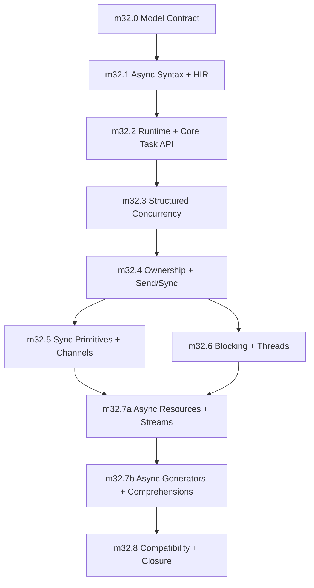

# Phase 32: Async and Concurrency Model

status: in_progress

## Objective

Implement the canonical async and concurrency model defined in `internal_docs/async_concurrency_model.md`.

Phase 32 is not an ecosystem grab bag. It closes one coherent model:

- Python-shaped syntax: `async def`, `await`, `async with`, `async for`
- Rust-shaped safety: ownership-aware task boundaries, explicit sharing, no hidden thread-safety wrappers
- structured concurrency by default: parent scopes own child tasks
- typed cancellation, timeout, and cleanup behavior
- explicit offload for CPU-bound or blocking work
- I/O-bound/CPU-bound annotations that power diagnostics instead of hidden scheduling
- compatibility veneers only after the canonical model works

The phase is complete when practical async/concurrent Sifr programs run without user-managed event loops and without escaping Sifr's core guarantee: no user-triggerable runtime panics.

## Semantic Source Of Truth

`internal_docs/async_concurrency_model.md` is the authoritative semantic contract for this phase.

This file is the implementation plan. It records the milestone order, implementation responsibilities, validation goals, deferrals, and phase exit gate. If a detail conflicts with the model file, the model file wins and this phase file must be updated before implementation continues.

The type-honest canonical user example lives in the model file's `Product Decision` section. This phase file intentionally references that example instead of duplicating it.

## Depends On

- Phase 10 borrow-by-default and ownership semantics.
- Phase 14 codegen structure.
- Phase 23 project graph and invocation isolation.
- Phase 27 runtime-safety and diagnostics contract.
- Phase 30 reliability, parity, and performance budgets.
- Phase 31 algorithmic compatibility hardening.

## Non-Goals And Deferrals

The following are not Phase 32 v1 exit criteria:

- web framework
- typed serialization and pydantic-like validation
- database clients
- full `asyncio` parity
- raw event-loop APIs and loop policies
- transports/protocols callback APIs
- public selectors module unless later low-level socket work proves it necessary
- `contextvars`
- multiprocessing
- process pools and `ProcessPoolExecutor`
- subprocess and signal APIs
- async generator `send()` and `throw()`
- async `yield from` / generator delegation
- async generator expressions
- nested async comprehensions and awaited comprehension filters

`ProcessPoolExecutor`, multiprocessing, and hard interruption of CPU-bound work are blocked on the future Phase 40 typed data/IPC contract.

Subprocess and signal integration require a later model amendment. Older Phase 32 notes that listed subprocess or signal delivery as exit criteria are superseded by the model contract.

## Design Principles

- **One canonical async model:** user code should learn `async def`, `await`, `sifr.task`, and `sifr.sync`; not event-loop objects, loop policies, or callback orchestration.
- **Structured concurrency first:** child tasks belong to parent scopes. Fire-and-forget is absent in v1.
- **Async is for waiting:** I/O-bound and CPU-bound sync work must use async APIs or explicit offload when it would otherwise occupy cooperative runtime workers. The compiler never silently schedules work on another executor.
- **No implicit shared mutable memory:** cross-task/thread sharing requires explicit primitives. The compiler never invents `Arc`, `Mutex`, clones, or detached ownership on the user's behalf.
- **Cancellation is typed control flow:** active cancellation is scope-exit semantics, not a broad-catchable ordinary error. Materialized child cancellation is explicit evidence.
- **Compatibility is layered:** `sifr.asyncio` and `sifr.concurrent` can wrap the canonical model, but cannot define a second model.
- **Runtime is private:** the implementation may use Tokio or a compatible substrate, but public APIs remain runtime-neutral.

## Locked V1 Decisions

These are implementation constraints, not suggestions:

1. `scope.spawn` is the canonical v1 task creation API. Free-floating detached spawn is not exposed.
2. Active task cancellation is scope-exit semantics and is not catchable by ordinary `except Error`; `CancellationError` is materialized boundary evidence observed from outside the cancelled task.
3. `CancellationError` is not an `Error` subclass and is never matched by broad `except Error`.
4. Calling an async function returns a linear `Coroutine[T, E]`; awaiting it in the same task yields the function's surface return type, while spawning it creates `Task[T, E]`.
5. `await Task[T, E]` consumes the affine task handle and produces `TaskResult[T, E]` when observed by a non-cancelled task.
6. `try await task_handle` is rejected in v1; cancellation requires explicit matching and intentional conversion into an ordinary error when needed.
7. `task.select` and `task.race` consume input handles and cancel losing tasks by default.
8. `task.gather` is fail-fast in v1. The first child error cancels unfinished children; later errors are secondary evidence.
9. `task.timeout` accepts task handles in v1. Inner completion wins same-tick ties, timeout expiry cancels and awaits cleanup, and outer cancellation cancels the inner task. Handle timeout returns `TaskResult[T, TimeoutResult[E]]`; timeout context blocks exit through ordinary `TimeoutError`.
10. Channels use explicit sender/receiver endpoints. Send and receive are async operations; receive returns `Result[T, ClosedError]` with no second closed state.
11. `sync.Lock[T]` uses a synchronous Rust mutex internally in v1; acquiring it in async code may block a runtime worker under contention, and lock guards cannot cross `await`.
12. Spawned tasks require owned, sendable, static task boundaries in v1. Local non-Send task sets and scoped borrowed spawn are deferred.
13. `sifr.asyncio` ships only as a compatibility veneer after the canonical model is complete.
14. Public selectors, contextvars, multiprocessing, process pools, raw event loops, and transport/protocol APIs are deferred.
15. `ProcessPoolExecutor` is blocked on the future typed IPC/serialization contract.
16. `@io_bound` and `@cpu_bound` are declaration-site diagnostic annotations; they classify workload class for compiler diagnostics and never trigger implicit scheduling. The stdlib ships with a pre-annotated database of known stdlib functions.
17. Subprocess and signal APIs are out of scope for Phase 32 v1 and require a later model amendment.
18. Cancellation suppression, shielding, cancellation counters, and graceful shutdown tokens are deferred; v1 graceful shutdown uses structured scope cancellation and explicit channels.
19. `async def` with `yield` is a first-model feature and creates `AsyncGenerator[T, E]`, not a coroutine that returns a generator.
20. `AsyncGenerator[T, E]` implements `AsyncIterator[T, E]`; it is consumed by `async for`, `anext()`, async comprehensions, or explicit close and is never directly awaitable.
21. `AsyncIterator[T, E].anext()` returns `Result[Option[T], E]`, with `Ok(None)` as normal exhaustion and `Err(E)` as stream failure.
22. Async generator cancellation and `aclose()` run `finally` blocks and async context cleanup before termination; cleanup failures become `SecondaryError` evidence.
23. List, set, and dict async comprehensions are in Phase 32 v1. They are protocol sugar over `async for`, not hidden task creation.
24. Async generator `send()`, `throw()`, async `yield from`, async generator expressions, nested async comprehensions, and awaited comprehension filters are deferred.
25. `TaskScope.__aexit__` returns `Result[None, ScopeFailure]`; unobserved child failure or cancellation must surface as `ScopeFailure`.
26. `TaskGroup[E]` requires homogeneous child error type `E` in v1 and cancels unfinished siblings on first child failure.
27. `BlockingTask[T, E]` is distinct from cooperative `Task[T, E]`; blocking cancellation means result abandonment (the observer abandoned the result after cancellation), not guaranteed OS-thread interruption or work stoppage.
28. `AsyncClosable` is parameterized: `AsyncClosable[E]` with `aclose() -> Result[None, E]`; `AsyncGenerator` implements `AsyncClosable[GeneratorCloseError]`.
29. Channel endpoint lifetime: dropping last sender closes channel after buffered messages drain; dropping receiver closes immediately to senders; `close()` on any sender closes whole channel; buffered messages remain receivable after close; messages received in FIFO order.
30. `task.timeout(duration)` context-manager form uses same-task cancellation scoping with internal delimited cancellation; does not introduce a spawn boundary.

## Milestones

The milestones below intentionally match the async implementation plan from `milestone_async_0` through `milestone_async_8`, with `milestone_async_7` split into `milestone_async_7a` and `milestone_async_7b` so async generators/comprehensions land after the async iteration protocol is stable. Implementation must execute them in order unless a later PR updates both files with reviewed rationale.

### milestone_async_0: Model Contract and Runtime Architecture Lock

status: completed

**Goal:** Lock the async/concurrency semantic contract before adding compiler/runtime code.

**Scope:**

- Copy the canonical type, task, cancellation, timeout, lock, and runtime contracts into `internal_docs/architecture.md`.
- Decide and document the runtime substrate boundary:
  - public Sifr APIs are runtime-neutral,
  - implementation may use Tokio or the chosen Tokio-compatible substrate,
  - no public event-loop object exists in the primary model,
  - users do not configure or select runtimes in v1.
- Define initial public modules:
  - `sifr.task`
  - `sifr.sync`
  - `sifr.concurrent`
- Define initial public types:
  - `Coroutine[T, E]`
  - `Task[T, E]`
  - `Task[T]`
  - `TaskResult[T, E]`
  - `BlockingTask[T, E]`
  - `AsyncIterator[T, E]`
  - `AsyncClosable[E]`
  - `AsyncGenerator[T, E]`
  - `Failure[E]`
  - `TaskScope`
  - `TaskGroup`
  - `ScopeFailure`
  - `ScopeFailureCause`
  - `CancellationError`
  - `TaskCancelled`
  - `TimeoutError`
  - `TimeoutResult[E]`
  - `SecondaryError`
  - `GeneratorCloseError`
  - `GeneratorBusyError`
  - `Channel[T]`
  - `ChannelSender[T]`
  - `ChannelReceiver[T]`
  - `ClosedError`
  - `WouldBlockError`
  - `Lock[T]`
  - `LockGuard[T]`
  - `RwLock[T]`
  - `RwLockReadGuard[T]`
  - `RwLockWriteGuard[T]`
  - `Shared[T]`
  - `Semaphore`
  - `SemaphorePermit`
  - `Notify`
  - `Select2[A, B]`
  - `ThreadPoolExecutor`
  - `ShareSafe` (capability bound, not a public instantiable type)
  - `AsyncContextManager[T, EnterE, ExitE]` (user-defined async context manager protocol, defined in `milestone_async_7a`)
  - `AsyncExitCause` (exit cause enum for user-defined async context managers, defined in `milestone_async_7a`)
- Define async type-system additions:
  - coroutine type representation,
  - task-handle type representation,
  - task-result type representation,
  - awaitable structural protocol representation,
  - async-callable representation,
  - async-iterator representation,
  - async-generator representation,
  - `Task[T, E]` ordinary error constraint (`E: Error`),
  - `Task[T, E]` await result (`TaskResult[T, E]`),
  - affine task-handle consumption,
  - `Coroutine[T, E]` linear consumption by same-task `await` or `scope.spawn`,
  - `AsyncFunction` not interchangeable with sync `Function`/`Callable`.
- Define HIR additions:
  - async function marker,
  - await expression,
  - async call representation,
  - task spawn representation,
  - async context-manager statement,
  - async iteration statement,
  - async generator function marker,
  - async yield expression,
  - async comprehension expression,
  - task/awaitable type representation,
  - spawn capture metadata for sendability, borrowing, and lifetimes.
- Define task container protocols:
  - `task.scope()` returns a `TaskScope`,
  - `TaskScope` is an async context manager,
  - `TaskScope.__aexit__` waits for all children or cancels unfinished children on abnormal exit,
  - `TaskScope.__aexit__` returns `Result[None, ScopeFailure]`,
  - `TaskScope` cannot be used outside its `async with` lifetime,
  - `TaskGroup[E]` owns homogeneous group error policy on top of task scopes.
- Define cancellation policy:
  - active cancellation is not caught by `except Error`,
  - materialized `CancellationError` is not an `Error` subclass,
  - timeouts cancel task handles and return `TimeoutResult.Timeout(TimeoutError)` as ordinary failure inside `TaskResult`,
  - cancellation waits for cleanup before scope exit,
  - cancellation suppression/shield/uncancel APIs are absent in v1.
- Define timeout API forms:
  - `task.timeout(task, duration)` wraps a task handle,
  - `task.timeout(duration)` returns an async context manager usable as `async with task.timeout(duration):`,
  - context timeout exits with ordinary `TimeoutError`,
  - both forms share the same completion-vs-deadline race policy,
  - the context-manager form is the canonical implementation target for `sifr.asyncio.timeout(duration)`,
  - arbitrary awaitables are not accepted by `task.timeout` in v1.
- Define selection, channel, lock, annotation, async-generator, async-comprehension, and runtime-neutrality policies.
- Rewrite or explicitly replace older Phase 32 planning with this milestone plan.
- Define validation fixture names and diagnostic families before implementation begins.

**Definition of done:**

- Architecture and phase docs reference the same semantic contract.
- There are no conflicting Phase 32 exit criteria in `internal_docs/phases/32_async_ecosystem.md`.
- All public modules/types for v1 are named and scoped.
- `Coroutine`, `Task`, `TaskResult`, `Awaitable`, `AsyncFunction`, `AsyncIterator`, `AsyncGenerator`, cancellation, timeout, scope, lock, channel, async generator, and async comprehension semantics are specified enough for implementation PRs.
- Deferred surfaces are explicit and cannot be inferred from older notes.

**Validation planning goals:**

- Positive: documentation/architecture consistency check for all initial types and modules.
- Negative: review checklist rejects any plan that exposes raw event loops, detached spawn, process pools, subprocess/signal APIs, or raw Tokio types in public APIs.

**Demo:** none; this milestone is a design/architecture lock.

---

### milestone_async_1: Async Syntax, Awaitability, and HIR Substrate

status: completed

**Goal:** Teach the compiler to understand async syntax as typed Sifr semantics without task scheduling.

**Depends on:** `milestone_async_0`

**Scope:**

- Parse and lower `async def`.
- Parse and lower `await`.
- Parse and lower minimal `async with task.scope() as scope` and `async with task.timeout(duration)` as built-in scoped-task constructs. General user-defined async context-manager protocol remains `milestone_async_7a`.
- Add HIR nodes for async functions and await expressions.
- Add awaitable/future/task type representation.
- Add await type checking:
  - `await x` is valid only when `x: Awaitable[T]`,
  - result type is `T`.
- Add structural awaitable protocol checking.
- Reject async function calls from sync functions. Sync code cannot call an async function and silently create an unawaited task handle.
- Reject `await` outside async functions.
- Reject awaiting non-awaitable values.
- Preserve `try`/`except` auto-unwrap behavior for `Result` values produced by await expressions.
- Reject `try await task_handle` in v1; task-handle cancellation must be matched or explicitly converted.
- Add source-span plumbing for async diagnostics.
- Add initial codegen shape for async functions that do not spawn tasks.

**Definition of done:**

- `async def` is represented explicitly in HIR.
- `await` is represented explicitly in HIR.
- Type checking distinguishes awaitable and non-awaitable values.
- Awaiting `Task[T, E]` has the stable type `TaskResult[T, E]`.
- `async with task.scope()` and `async with task.timeout(duration)` are available as built-in async-with forms before general async context managers.
- Invalid async syntax/use fails before Rust compilation.
- The implementation does not introduce raw string fallback paths.

**Positive validation:**

- `async_basic.sifr`
- `await_chain.sifr`
- `async_result_auto_unwrap.sifr`

**Negative validation:**

- `await_outside_async.sifr`
- `await_non_awaitable.sifr`
- `async_return_type_mismatch.sifr`
- `async_call_without_await_from_sync_rejected.sifr`
- `cancelled_task_except_error_does_not_swallow.sifr`
- `async_with_outside_async.sifr`
- `async_with_unsupported_context.sifr`
- `try_await_task_handle_rejected.sifr`

**Implementation progress (2026-05-09):**

- Completed first substrate slice: `async def` HIR marking, `await` HIR expression, async call typing as `Coroutine[T, E]`, async function value typing as `AsyncFunction`, await type checks, initial async/await codegen shape, and async type annotations for `Coroutine`, `Task`, `TaskResult`, `BlockingTask`, `Awaitable`, `AsyncIterator`, and `AsyncGenerator`.
- Completed milestone closure slice: built-in `async with task.scope()`, built-in `async with task.timeout(duration)`, and `try await task_handle` rejection.
- Added positive validation fixtures: `async_basic.sifr`, `await_chain.sifr`, `async_result_auto_unwrap.sifr`, `async_with_scope_builtin.sifr`, and `async_with_timeout_builtin.sifr`.
- Added negative validation fixtures: `await_outside_async.sifr`, `await_non_awaitable.sifr`, `async_return_type_mismatch.sifr`, `async_call_without_await_from_sync_rejected.sifr`, `async_function_not_sync_callable.sifr`, `async_with_outside_async.sifr`, `async_with_unsupported_context.sifr`, and `try_await_task_handle_rejected.sifr`.
- Deferred cancellation-swallow validation until `milestone_async_2` introduces materialized task handles and cancellation evidence.

**Demo:**

- `demos/m32_async_syntax_demo.sifr`

---

### milestone_async_2: Runtime Bootstrap and Core Task API

status: completed

**Goal:** Make ordinary async programs run without user-managed runtime setup.

**Depends on:** `milestone_async_1`

**Scope:**

- Auto-detect async entrypoints.
- Generate runtime bootstrap for `async def main()`.
- Support `async def main() -> Result[None, E]` where `E: Error`.
- Wire runtime dependencies only when async is used.
- Implement `sifr.task.sleep`.
- Implement `sifr.task.timeout`.
- Define `task.timeout(task, duration)` race behavior:
  - inner completion before deadline returns the inner result and does not cancel it,
  - deadline first cancels the inner task, waits for cleanup, and returns `TaskResult.Err(Failure[TimeoutResult.Timeout(TimeoutError)])`,
  - same scheduler tick gives inner completion priority,
  - outer cancellation cancels the inner task unconditionally,
  - arbitrary awaitables are not accepted; users must spawn them into child tasks first.
- Define `task.timeout(duration)` context-manager form:
  - usable as `async with task.timeout(duration):`,
  - is a compiler-recognized same-task cancellation scope using internal delimited cancellation,
  - does not introduce a spawn boundary; surrounding locals are accessible naturally,
  - deadline expiry sets an internal cancellation flag; cooperative await points observe it and unwind,
  - deadline first exits through ordinary `TimeoutError`, not child cancellation evidence,
  - cancellation or timeout of the enclosed block awaits cleanup before scope exit,
  - this is the canonical implementation target for `sifr.asyncio.timeout(duration)`.
- **Conservative spawn until milestone_async_4:** Before milestone_async_4, `scope.spawn` accepts only trivially owned/static captures or fixture-limited no-capture coroutines. Nontrivial captures are rejected with a diagnostic until full task-boundary checking lands.
- Implement the minimal `sifr.task.scope` runtime container needed for scoped spawn.
- Implement `scope.spawn` returning a typed task handle.
- Implement task-handle `join`.
- Implement task-handle cancellation API.
- Implement affine task-handle consumption:
  - `await handle`, `join`, `cancel_and_join`, `gather`, `select`, `race`, and `timeout` consume handles,
  - `cancel` borrows the handle and leaves it observable for cleanup,
  - task handles are not clonable in v1.
- Translate obvious runtime/task-boundary failures into Sifr diagnostics.

**Definition of done:**

- Async programs run through `sifr run`.
- Sync programs do not gain async runtime dependencies.
- `scope.spawn` returns an observer handle; dropping the handle does not detach the child from the owning scope.
- Awaiting or joining a task handle consumes it; consumed handles cannot be observed again.
- There is no free-floating detached spawn in v1.
- `scope.spawn` is conservative in milestone_async_2; captures are restricted until milestone_async_4 ownership checking exists.
- `task.timeout(duration)` context-manager form uses same-task cancellation scoping, not a spawned child task.
- `task.timeout` has deterministic completion-vs-deadline tie-breaking.
- Cancelling a task produces typed, deterministic behavior.
- Runtime bootstrap does not require user-visible event-loop configuration.
- Public `sifr.task`, `sifr.sync`, and `sifr.concurrent` APIs do not expose runtime-specific implementation types.

**Positive validation:**

- `async_runtime_bootstrap.sifr`
- `scope_spawn_join.sifr`
- `task_sleep.sifr`
- `task_timeout_success.sifr`
- `task_timeout_completion_wins_tie.sifr`
- `task_timeout_context_manager.sifr`
- `task_cancel_basic.sifr`

**Negative validation:**

- `detached_spawn_not_available.sifr`
- `task_timeout_error_type.sifr`
- `runtime_leak_rejected.sifr`

**Demo:**

- `demos/m32_task_core_demo.sifr`

**Implementation progress (2026-05-09):**

- Completed first runtime bootstrap slice: auto-detect `async def main()`, emit a private Tokio-backed runtime bootstrap with `#[tokio::main(flavor = "current_thread")]`, and add the Tokio dependency only for async entrypoints.
- Added positive validation fixture: `async_runtime_bootstrap.sifr`.
- In progress task sleep slice: lower `task.sleep(duration)` inside async functions to the private runtime substrate, reject invalid duration/call sites during HIR lowering, and require Tokio only when generated code references the private sleep primitive.
- Added validation coverage for `task_sleep.sifr`, `task_sleep_outside_async.sifr`, and `task_sleep_invalid_duration.sifr`.
- Locked async `main() -> Result[None, E]` bootstrap coverage; generated Rust preserves `Result<(), E>` under the private Tokio entrypoint.
- Added positive validation fixture: `async_main_result_bootstrap.sifr`.
- In progress task scope container slice: `async with task.scope() as scope` now materializes a private generated `TaskScope` runtime container instead of binding the placeholder unit value.
- Added positive validation fixture: `task_scope_container.sifr`.
- In progress conservative spawn slice: `scope.spawn(coro)` accepts no-argument infallible coroutine calls, returns a typed task observer handle, and records an owned child driver in the task scope so normal scope exit awaits dropped/unobserved handles instead of detaching them.
- Added validation coverage for `scope_spawn_core.sifr`, `scope_spawn_capture_rejected.sifr`, `scope_spawn_non_coroutine_rejected.sifr`, and `detached_spawn_not_available.sifr`.
- In progress task-handle observation slice: `handle.join()` is recognized as an async task observation operation and lowers to a private generated `TaskResult` substrate for conservative infallible task handles.
- Added positive validation fixture: `task_handle_join.sifr`.
- In progress task-handle await slice: direct `await handle` now desugars to the same private join observation path as `await handle.join()`.
- Added positive validation fixture: `task_handle_await.sifr`.
- In progress task-handle affine slice: observing a task handle through direct `await handle` or `await handle.join()` now consumes the handle binding through the HIR ownership tracker.
- Added negative validation fixture: `task_handle_double_await_rejected.sifr`.
- In progress task cancellation slice: `handle.cancel()` borrows the task handle, requests private runtime cancellation, and leaves the handle observable for `await handle` / `await handle.join()` cleanup observation.
- Added positive validation fixture: `task_cancel_basic.sifr`.
- Added negative validation fixture: `task_handle_cancel_after_await_rejected.sifr`.
- In progress task timeout handle slice: `task.timeout(handle, duration)` accepts task handles, consumes the handle, races observation against a private timeout, cancels on deadline expiry, and returns a private generated `TimeoutResult`-carrying `TaskResult`.
- Added validation coverage for `task_timeout_success.sifr`, `task_timeout_expiry.sifr`, `task_timeout_error_type.sifr`, and `task_timeout_double_observe_rejected.sifr`.
- Added same-tick timeout validation coverage with `task_timeout_completion_wins_tie.sifr`; the generated timeout race uses biased completion-first selection.
- In progress timeout context-manager slice: `async with task.timeout(duration)` now wraps awaited operations in a same-task timeout check and exits through `TimeoutError` when the enclosing async function can propagate it.
- Added validation coverage for `task_timeout_context_manager.sifr` and `task_timeout_context_manager_return_type_rejected.sifr`.
- Completed milestone closure slice: added `scope_spawn_join.sifr`, `runtime_leak_rejected.sifr`, and `demos/m32_task_core_demo.sifr`.
- Merged PRs: #1909 async main Tokio bootstrap, #1910 task sleep, #1911 async main Result bootstrap, #1912 task scope container, #1913 conservative scope spawn, #1914 task handle join, #1915 direct task await, #1916 affine task handle observation, #1917 task cancellation, #1918 task timeout handle, #1919 same-tick timeout validation, #1920 timeout context-manager awaits.

---

### milestone_async_3: Structured Concurrency and Cancellation Semantics

status: in_progress

**Goal:** Make scoped concurrency the default composition model.

**Depends on:** `milestone_async_2`

**Scope:**

- Implement `task.scope`.
- Implement `task.TaskGroup`.
- Implement `scope.spawn`.
- Define task-scope ownership rules:
  - `TaskScope` uses nursery ownership: every spawned child belongs to the scope,
  - handles returned by `scope.spawn` are observers, not owners; dropping a handle does not detach or cancel the child,
  - on normal exit, `TaskScope.__aexit__` waits for all children,
  - on abnormal exit, `TaskScope.__aexit__` cancels unfinished children and waits for cleanup,
  - `TaskScope.__aexit__` returns `Result[None, ScopeFailure]`,
  - child failures or cancellations that are not explicitly observed are surfaced at scope exit as `ScopeFailure`,
  - no task handle may escape its owning task scope silently,
  - general tracked-collection proof is deferred; v1 supports explicit consumption through `gather`, `select`, `race`, and simple `for h in handles: await h` loops.
- Implement deterministic scope exit:
  - all child tasks complete,
  - or unfinished children are cancelled,
  - and cleanup is awaited before exit.
- Implement `TaskGroup[E]` with homogeneous child error type `E`.
- Implement sibling cancellation on first failure for task groups.
- Define `TaskGroup` closed/cancelling spawn rules: a `TaskGroup` has `Open`, `Cancelling`, `Closing`, and `Closed` states. `group.spawn(...)` is valid only in `Open` and returns `Task[T, E]`, not a fallible union. V1 treats group openness as a flow-checked capability: after child failure or cancellation is observed, explicit group cancellation or timeout occurs, or scope exit begins, later `group.spawn(...)` on that control path is rejected unless the compiler can prove the group is still `Open`. The same principle applies to `TaskScope`: once `__aexit__` begins, spawning is invalid.
- Implement `task.gather` with deterministic success ordering and fail-fast error behavior:
  - first observed child error cancels unfinished children and returns `TaskResult.Err(Failure[E])`,
  - after cancellation cleanup, the earliest failed handle in input order is the primary error if multiple failures surface,
  - cleanup errors from cancelled children surface as `SecondaryError` values attached to the primary `Failure[E]`,
  - later failures are secondary evidence,
  - if any gathered child is observed as `Cancelled(Failure[CancellationError])` before an ordinary child error is selected as primary, gather cancels unfinished siblings and returns `TaskResult.Cancelled(Failure[CancellationError])`. If cancellation and ordinary errors are both observed during the same drain, deterministic input order chooses the primary among failure-like outcomes; the rest become `SecondaryError` evidence.
  - collect-all semantics are deferred to a future API.
- Implement binary heterogeneous `task.select(a, b)` and homogeneous-list `task.race(handles)`.
- Cancel losing tasks by default for `select` and `race`.
- `select` and `race` consume their input handles; losers cannot be awaited later.
- Define loser cleanup failure handling for `select` and `race`: if the selected winner result is `Err(...)` or `Cancelled(...)`, any loser cleanup failures attach as `SecondaryError` evidence to that result. If the selected winner result is `Ok(...)`, loser cleanup failures surface at the owning `TaskScope` exit as `ScopeFailure` rather than being dropped.
- Define how cancellation composes with `TaskResult`.
- Add diagnostics for leaked task handles and invalid scope escape.

**Definition of done:**

- Task scopes own child task lifetimes.
- Spawned tasks cannot escape with borrowed state that outlives the scope.
- Dropping a task handle does not detach the task; scope exit still waits for or cancels the child according to normal/abnormal exit rules.
- Unobserved child failure and cancellation surface as `ScopeFailure` at scope exit.
- Task-group failure cancels unfinished siblings.
- Task groups reject heterogeneous child error types in v1.
- Cancellation is observable through the Sifr type model without becoming broad-catchable ordinary errors.
- `gather` preserves input ordering for successes and has documented fail-fast cancellation behavior for errors.
- `select`/`race` deterministically cancel losers by default.
- Nested cancellation scopes propagate cancellation in a documented order.

**Positive validation:**

- `task_scope_basic.sifr`
- `task_group_basic.sifr`
- `task_group_error_cancels_siblings.sifr`
- `task_gather_ordered.sifr`
- `task_gather_cleanup_error_secondary.sifr`
- `task_handle_collection_consumed.sifr`
- `task_scope_unobserved_child_waits.sifr`
- `task_scope_unobserved_failure_scope_failure.sifr`
- `task_select_first_completion.sifr`
- `task_race_cancels_losers.sifr`
- `cancellation_scope_timeout.sifr`
- `cancellation_group_sibling.sifr`
- `cancellation_nested_scopes.sifr`
- `cancellation_cleanup_runs.sifr`

**Negative validation:**

- `task_escape_scope_rejected.sifr`
- `cancelled_task_use_rejected.sifr`
- `task_handle_escape_scope_rejected.sifr`
- `task_handle_double_await_rejected.sifr`
- `task_group_heterogeneous_error_rejected.sifr`
- `task_group_error_type_not_carried_rejected.sifr`
- `task_group_unobserved_failure_scope_failure.sifr`
- `task_group_spawn_after_failure_rejected.sifr`

**Demo:**

- `demos/m32_structured_concurrency_demo.sifr`

**Implementation progress:**

- In progress task-scope ownership slice: added validation that an unobserved observer handle does not detach its child; normal `TaskScope` exit waits for the child before continuing.
- In progress TaskGroup surface slice: `async with task.TaskGroup() as group` now lowers through the existing scope-owned child runtime for conservative infallible/no-capture children; group error policy and sibling cancellation remain follow-up milestone_async_3 slices.
- In progress gather slice: `task.gather([...])` accepts homogeneous task-handle lists, consumes the handles, awaits them in deterministic input order, and returns a `TaskResult[list[T], E]` through a private runtime helper; fail-fast fallible child policy remains a follow-up slice once fallible spawn lands.
- In progress gather collection-consumption slice: added validation for gathering a named task-handle list so the milestone's explicit handle-collection consumption path is covered.
- In progress race slice: `task.race([...])` accepts homogeneous task-handle lists, consumes the handles, returns the first completed `TaskResult[T, E]`, and requests cancellation for losing handles; loser cleanup error evidence remains a follow-up slice once fallible spawn and scope-failure plumbing land.
- In progress select slice: `task.select(a, b)` accepts heterogeneous task handles, consumes both handles, returns `Select2[TaskResult[A, EA], TaskResult[B, EB]]`, and requests cancellation for the losing handle; loser cleanup error evidence remains a follow-up slice once fallible spawn and scope-failure plumbing land.
- In progress scope escape diagnostics slice: added negative validation that `TaskScope` bindings and task handles are unavailable after the built-in `async with task.scope()` lifetime ends.
- In progress fallible task-result plumbing slice: private task receivers now carry `TaskResult[T, E]`, `scope.spawn` accepts no-argument fallible `Result[T, E]` coroutines, and observing the handle preserves the ordinary child error in `TaskResult.Err`.
- In progress TaskGroup homogeneous-error slice: `task.TaskGroup()` records the first non-`Never` child error type and rejects later children with a different ordinary error type in v1.

---

### milestone_async_4: Ownership, Borrowing, and Send/Sync Task Boundaries

status: proposed

**Goal:** Make task boundaries enforce Sifr ownership and Rust-like sendability with Sifr-native diagnostics.

**Depends on:** `milestone_async_3`

**Scope:**

- Implement Send/Sync-style trait derivation or equivalent type facts.
- Validate scoped spawn requirements and keep detached spawn unavailable in v1.
- Reject non-sendable captures crossing task boundaries.
- Require owned, sendable, static captures for v1 spawned tasks.
- Reject borrowed values that can outlive their owner through task escape.
- Reject mutable borrow across `await` when the borrow would remain live.
- Allow immutable borrow across `await` only when lifetime and mutation rules prove it safe.
- Add Sifr diagnostics for:
  - non-sendable task capture,
  - borrowed value escaping task scope,
  - invalid borrow across await,
  - unsynchronized mutable state crossing task boundary.

**Definition of done:**

- Spawn captures are checked before Rust compilation.
- Ordinary awaited futures within the same task do not require Send unless they cross a spawn/thread boundary.
- Scoped borrowed spawn is deferred in v1; `scope.spawn` requires owned, sendable, static captures.
- Diagnostics point at the captured value or live borrow, not just the generated Rust error.
- No raw Rust Send/Sync errors leak as the primary user experience.

**Positive validation:**

- `spawn_owned_send_value.sifr`
- `spawn_capture_immutable_shared_ok.sifr`
- `await_without_live_borrow.sifr`

**Negative validation:**

- `spawn_non_send_field_rejected.sifr`
- `spawn_borrowed_value_escapes_rejected.sifr`
- `borrow_across_await_rejected.sifr`
- `spawn_mutable_alias_rejected.sifr`
- `spawn_self_with_non_send_field_rejected.sifr`
- `spawn_scoped_borrow_deferred.sifr`

**Demo:**

- `demos/m32_ownership_concurrency_demo.sifr`

---

### milestone_async_5: Synchronization Primitives and Channels

status: proposed

**Goal:** Provide explicit primitives for sharing and coordination when concurrency requires it.

**Depends on:** `milestone_async_4`

**Scope:**

- Implement `sync.Shared[T]` for immutable shared ownership with atomic shared ownership (`Arc<T>`-style) semantics and no mutation API.
- Require `sync.Shared[T]` to satisfy `ShareSafe`: `T` must be `Send + Sync` and must not contain unsynchronized interior mutability. Types with their own synchronization may satisfy `ShareSafe`; `Shared[Cell[int]]` and `Shared[list[MutableThing]]` are rejected.
- Implement `sync.Lock[T]`.
- Implement `sync.RwLock[T]`.
- Implement `sync.Channel[T]`.
- Implement unbounded multi-producer, single-receiver channels via `sync.channel[T]()`.
- Implement bounded multi-producer, single-receiver channels via `sync.bounded_channel[T](capacity)`.
- Implement channel close semantics:
  - `sync.channel[T]()` returns `(ChannelSender[T], ChannelReceiver[T])`,
  - `sync.bounded_channel[T](capacity)` returns `(ChannelSender[T], ChannelReceiver[T])`,
  - `ChannelSender[T]` is clonable; `ChannelReceiver[T]` is single-consumer in v1,
  - `await sender.send(value)` on closed channel returns `Result[None, ClosedError]`,
  - `await receiver.receive()` returns `Result[T, ClosedError]`,
  - `ClosedError` from `receive` means closed and drained; there is no second `None` closed state,
  - `sender.close()` wakes pending senders and receivers deterministically,
  - cancellation while blocked on send/receive propagates task cancellation without duplicating or losing a message,
  - cancellation while blocked on send is exactly-once: the value is either not enqueued and dropped, or enqueued exactly once,
  - channel-backed async iteration maps closed-and-drained `ClosedError` to `Ok(None)`,
  - bounded channels apply async backpressure.
- Implement `sync.Semaphore`.
- Implement `sync.Notify`.
- Define sync primitive behavior in async and blocking contexts.
- Implement static lock-guard liveness analysis at await points.
- Reject live `LockGuard`/`RwLockGuard` across `await`.
- Warn in docs and diagnostics that acquiring `sync.Lock` in async code may block the runtime worker under contention; v1 permits it only for short, low-contention critical sections.
- Add diagnostics for statically knowable lock misuse.
- Define method signatures for sync primitives before milestone close:
  - `sync.Shared[T](value: T) -> Shared[T]`
  - `sync.Lock[T](value: T) -> Lock[T]` with `def Lock[T].lock(self) -> LockGuard[T]` and `def Lock[T].try_lock(self) -> Result[LockGuard[T], WouldBlockError]`
  - `sync.RwLock[T](value: T) -> RwLock[T]` with `def RwLock[T].read(self) -> RwLockReadGuard[T]` and `def RwLock[T].write(self) -> RwLockWriteGuard[T]`
  - `sync.Semaphore(permits: int) -> Semaphore` with `async def Semaphore.acquire(self) -> Result[SemaphorePermit, ClosedError]` and `def Semaphore.try_acquire(self) -> Result[SemaphorePermit, WouldBlockError]`
  - `sync.Notify() -> Notify` with `async def Notify.notified(self) -> None`, `def Notify.notify_one(self) -> None`, and `def Notify.notify_all(self) -> None`
- Add receive cancellation exactly-once rule: if a receive is cancelled before `Ok(value)` is returned to user code, the message remains available to another receive or is otherwise not lost. Once `Ok(value)` has been returned, ownership has transferred to the receiver task.

**Definition of done:**

- Shared immutable state works through `sync.Shared[T]` for `ShareSafe` types.
- Mutation requires `Lock`, `RwLock`, or message passing.
- Channels are the canonical queue-like concurrency primitive and use clonable senders plus a single receiver handle in v1.
- Channel close, receiver exhaustion, cancellation, and backpressure behavior are typed and deterministic.
- Direct `receive()` and channel-backed `async for` are both specified and intentionally differ at the terminal state: `receive()` exposes `ClosedError`, while `async for` sees `Ok(None)`.
- Lock guard liveness at await points is rejected at compile time.
- Lock guards cannot cross `await`.
- Semaphore and notify primitives support common coordination patterns.
- The compiler rejects unsynchronized shared mutable access.

**Positive validation:**

- `shared_basic.sifr`
- `lock_basic.sifr`
- `rwlock_readers.sifr`
- `channel_basic.sifr`
- `channel_backpressure.sifr`
- `channel_close.sifr`
- `channel_cancel_pending_receive.sifr`
- `channel_drop_last_sender_closes_after_drain.sifr`
- `channel_drop_receiver_closes_senders.sifr`
- `channel_sender_close_clone_closes_all.sifr`
- `channel_fifo_order.sifr`
- `channel_cancel_receive_no_loss.sifr`
- `semaphore_basic.sifr`
- `notify_basic.sifr`

**Negative validation:**

- `shared_mut_without_lock_rejected.sifr`
- `channel_send_wrong_type_rejected.sifr`
- `channel_non_send_element_rejected.sifr`
- `lock_guard_escape_rejected.sifr`
- `lock_guard_across_await_rejected.sifr`
- `lock_across_task_boundary_rejected.sifr`

**Demo:**

- `demos/m32_sync_channel_demo.sifr`

---

### milestone_async_6: Blocking I/O, CPU-Bound Work, and Thread Offload

status: proposed

**Goal:** Keep cooperative async tasks from becoming the accidental path for blocking or CPU-heavy work.

**Depends on:** `milestone_async_4`

**Scope:**

- Add `@io_bound` and `@cpu_bound` declaration-site annotations.
- Add a stdlib annotation database of known I/O-bound and CPU-bound functions.
- Add diagnostics for calling `@io_bound` or `@cpu_bound` functions directly from async contexts.
- Implement `task.spawn_blocking`.
- Implement `sifr.concurrent.ThreadPoolExecutor`.
- Add `sifr.threading` as a thin compatibility veneer where it can stay canonical:
  - `Thread`
  - `Lock`
  - `Event`
  - `Condition`
- Treat `sifr.threading` here as Sifr-native thread coordination, not the Python compatibility layer governed by `sifr.asyncio` closure.
- Define blocking-task return/error/cancellation behavior:
  - `task.spawn_blocking(fn) -> BlockingTask[T, E]`,
  - cancelling `task.spawn_blocking` or thread-pool work requests cancellation and drops/abandons the handle result,
  - v1 does not forcibly abort a running OS thread,
  - already-running blocking work may continue to completion,
  - `spawn_blocking` requires owned, sendable, `'static` captures in v1,
  - scoped borrowed captures are rejected for `spawn_blocking` because already-running OS work may outlive the async scope after cancellation,
  - hard interruption requires future process isolation/typed IPC.
  - `BlockingTask` handles are affine. `join()` and `cancel_and_join()` consume them. Dropping a `BlockingTask` handle abandons observation but does not stop already-running OS work. Blocking work requires owned/sendable/static captures precisely because it may outlive the async scope after abandonment. Scope exit requests cancellation/abandonment for unresolved blocking work created inside the scope but does not guarantee OS-thread interruption.
- Ensure blocking work cannot occupy cooperative async workers where Sifr controls the path.
- Document when users should choose async tasks, channels, locks, or blocking offload.

**Definition of done:**

- Annotated I/O-bound/CPU-bound functions produce diagnostics in async contexts.
- Diagnostics suggest async alternatives or explicit offload.
- `spawn_blocking` works and returns typed results.
- `BlockingTask[T, E]` is distinct from cooperative `Task[T, E]` and documents result-abandonment cancellation.
- `ThreadPoolExecutor` works as a compatibility layer.
- Cancellation behavior for blocking work is documented and tested.
- The compiler never silently offloads work.

**Positive validation:**

- `io_bound_annotation_warning.sifr`
- `cpu_bound_annotation_warning.sifr`
- `spawn_blocking_basic.sifr`
- `thread_pool_executor_basic.sifr`

**Negative validation:**

- `io_bound_call_in_async_diagnostic.sifr`
- `cpu_bound_call_in_async_diagnostic.sifr`
- `spawn_blocking_non_send_rejected.sifr`

**Demo:**

- `demos/m32_blocking_offload_demo.sifr`

---

### milestone_async_7a: Async Context Managers, Async Iteration, and Resource Cleanup

status: proposed

**Goal:** Complete general user-defined async control-flow protocols without dragging in broad ecosystem APIs.

**Depends on:** `milestone_async_5` and `milestone_async_6`

**Scope:**

- Generalize `async with` beyond the built-in `task.scope()` form from `milestone_async_1`.
- Define and enforce the user-defined async context-manager protocol with these signatures:
  ```sifr
  protocol AsyncContextManager[T, EnterE, ExitE]:
      async def __aenter__(self) -> Result[T, EnterE]
      async def __aexit__(self, cause: AsyncExitCause) -> Result[None, ExitE]
  ```
  If `__aenter__` fails, `__aexit__` is not called because the resource was not acquired.
- Implement `AsyncExitCause` enum:
  ```sifr
  enum AsyncExitCause:
      Normal
      Return
      OrdinaryError(Error)
      Timeout(TimeoutError)
      Cancellation(CancellationError)
      RuntimeFault(...)
  ```
- Implement async iterable protocol.
- Implement `async for`.
- Define the `AsyncIterator[T, E]` protocol shape used by channels, streams, and async generators:
  - `anext() -> Result[Option[T], E]`,
  - `Ok(Some(value))` means one item,
  - `Ok(None)` means normal exhaustion,
  - `Err(E)` means stream failure and follows ordinary Sifr error handling.
- Define `AsyncClosable[E]` for async iterators that own cleanup work: `aclose() -> Result[None, E]`.
- Define cancellation cleanup behavior for async context managers:
  - cleanup order is LIFO,
  - cancelling inside `async with` unwinds active async context managers,
  - async exit receives the cancellation cause,
  - async exit runs to completion unless the runtime is forcefully aborted,
  - errors from async exit during cancellation become `SecondaryError` evidence attached to the owning scope result,
  - panic-like failures from async exit are caught at the runtime/codegen boundary and surfaced as secondary errors,
  - parent cancellation triggers child cancellation, but each task unwinds its own cleanup independently.
- Define `async with` exit propagation rules (see model `Control-Flow Desugaring` section for the authoritative propagation table):
  - Fallible async context managers expose an exit error type `ExitE`. For `TaskScope` and `TaskGroup`, `ExitE` is `ScopeFailure`; for `task.timeout(duration)`, it is `TimeoutError`; user-defined async context managers choose their own ordinary `Error` type.
  - body `Err(E)` takes precedence over the async context manager's exit error,
  - during active cancellation, cancellation takes precedence over exit failure,
  - cleanup failures during cancellation become secondary evidence.
- Define `async for` desugaring:
  - desugars to explicit `anext()` loop with `try await` for error propagation,
  - `Err(E)` from `anext()` propagates through ordinary error handling,
  - if an early-exit path from `async for` may call `aclose()`, the enclosing function must be able to propagate the iterator's close error type, or the close error must be handled explicitly. This applies to both the `IterE` error from `anext()` and the `CloseE` error from `aclose()` on early exit.
  - early exit (`break`, `return`, cancellation, timeout) awaits `aclose()` if iterator implements `AsyncClosable`,
  - normal `aclose()` failure is primary error; cancellation-context failure is secondary evidence.
- Define channel-backed async iteration as `AsyncIterator[T, Never]` that maps closed-and-drained `ClosedError` to `Ok(None)`.
- Leave user-defined async generator bodies and async comprehensions to `milestone_async_7b`, after this protocol is stable.

**Definition of done:**

- `async with` calls async enter/exit protocol methods correctly.
- Async resource cleanup runs under cancellation.
- If cleanup fails during cancellation, the original cancellation remains primary and cleanup failure is secondary evidence.
- `SecondaryError` never masks the primary result.
- Async exit cleanup order is LIFO.
- Panic-like failures in async exit do not become process-terminating double-panic paths.
- Nested cancellation is deterministic.
- `async for` works for channel/stream-like values through `AsyncIterator[T, E]`.
- Non-async iterables are rejected in `async for`.
- Async generator and async comprehension implementation has a stable protocol target.
- `AsyncClosable` gives `async for` and async comprehensions a stable cleanup protocol.

**Positive validation:**

- `async_with_basic.sifr`
- `async_with_cancel_cleanup.sifr`
- `async_with_nested_cleanup_order.sifr`
- `async_for_channel.sifr`
- `async_for_stream_result.sifr`
- `async_for_closable_iterator_cleanup.sifr`

**Negative validation:**

- `async_with_missing_protocol_rejected.sifr`
- `async_for_non_async_iterable_rejected.sifr`
- `async_resource_cleanup_error_typed.sifr`
- `async_with_cleanup_panic_secondary.sifr`
- `async_iterator_missing_aclose_rejected_when_cleanup_required.sifr`

**Demo:**

- `demos/m32_async_resource_demo.sifr`

---

### milestone_async_7b: Async Generators and Async Comprehensions

status: proposed

**Goal:** Make user-defined async streams and async collection-building part of the first async model.

**Depends on:** `milestone_async_7a`

**Scope:**

- Parse and lower `yield` inside `async def` as an async generator function marker.
- Type async generator functions as `AsyncGenerator[T, E]`:
  - `T` is inferred from yielded values and must converge to a single yield type,
  - `E` is the ordinary error channel from fallible async operations and declared result surfaces,
  - non-`None` async generator return values are rejected in v1.
- Ensure calling an async generator function returns `AsyncGenerator[T, E]`, not `Coroutine[AsyncGenerator[T, E], E]`.
- Reject direct `await` on an async generator and suggest `async for`, `anext()`, async comprehensions, or explicit close.
- Implement `AsyncGenerator[T, E]` as an `AsyncIterator[T, E]`:
  - `await anext(agen)` returns `Result[Option[T], E]`,
  - normal exhaustion is `Ok(None)`,
  - stream failure is `Err(E)`,
  - cancellation propagates through the task cancellation model rather than the ordinary error channel.
- Implement async-generator state-machine lowering without relying on unstable Rust generator features.
- Implement async-generator lifecycle:
  - lazy start on first `anext()` / `async for` / comprehension consumption,
  - deterministic suspension at `yield`,
  - explicit `agen.aclose()`,
  - explicit `agen.aclose()` returns `Result[None, GeneratorCloseError]`,
  - `anext()` after close begins returns `Ok(None)` after cleanup completes,
  - concurrent `anext()` while cleanup is running waits for cleanup and then returns the final state,
  - concurrent `anext()` while another advance is active is rejected or returns `GeneratorBusyError`,
  - close/cancellation runs `finally` blocks and async context cleanup,
  - cleanup failures become `SecondaryError` evidence,
  - yielding after close begins is rejected or surfaced as a typed protocol error, never a panic.
- Enforce ownership and borrow rules across async generator suspension:
  - mutable borrows cannot remain live across `yield`,
  - mutable borrows cannot remain live across `await` inside the generator,
  - captured state crossing spawned-task boundaries must satisfy the same sendability rules as ordinary async tasks,
  - async generator objects are sendable only when every captured value and generated state-machine field is sendable,
  - async generator objects that cross task boundaries must satisfy the generated state-machine sendability facts.
- Implement list, set, and dict async comprehensions over async iterables:
  - `[expr async for item in source]`,
  - `{expr async for item in source}`,
  - `{key: value async for item in source}`,
  - a single `async for` clause with ordinary synchronous `if` filters is supported in v1.
- Defer lazy async generator expressions, including direct function-call argument form, to avoid parser/HIR ambiguity with normal generator-expression argument rules.
- Ensure eager async comprehensions close the active async iterator they are consuming on cancellation or abandonment when that iterator implements `AsyncClosable`.
- Add diagnostics for unsupported async generator controls:
  - `agen.send(...)`,
  - `agen.throw(...)`,
  - async `yield from`,
  - nested async comprehensions,
  - `await` inside comprehension filters.
- Add CPython-derived parity/adaptation tests for async generator close, exhaustion, and async comprehension behavior, with Sifr-specific `Result[Option[T], E]` adaptation instead of `StopAsyncIteration`.

**Definition of done:**

- User-defined async generators are first-class async iterables.
- Async generators are not awaitable and cannot be confused with coroutines.
- `anext()` and `async for` expose normal exhaustion as `Ok(None)` and stream failure as `Err(E)`.
- Async generator cleanup under close/cancellation is deterministic and cannot skip `finally` or async context-manager cleanup.
- Async generator state machines preserve Sifr ownership rules across `await` and `yield`.
- Async generator post-close observation returns `Ok(None)` and does not introduce a separate close error.
- Explicit async generator close has a typed `GeneratorCloseError` path.
- Reentrant async generator advancement is rejected or returns `GeneratorBusyError`; it is never silently queued.
- Async comprehensions work for list, set, and dict forms.
- Async comprehensions propagate cancellation to active async-generator iterators and do not leak started generators.
- Unsupported Python async generator controls are rejected with intentional diagnostics.
- No async generator or async comprehension lowering introduces hidden task creation, detached work, or user-triggerable panic paths.

**Positive validation:**

- `async_generator_basic.sifr`
- `async_generator_yield_types.sifr`
- `async_generator_anext_result_option.sifr`
- `async_generator_cancel_cleanup.sifr`
- `async_generator_borrow_yield.sifr`
- `async_generator_send_boundary.sifr`
- `async_comprehension_list.sifr`
- `async_comprehension_set.sifr`
- `async_comprehension_dict.sifr`
- `async_generator_aclose_result.sifr`
- `async_generator_reentrant_anext_rejected.sifr`

**Negative validation:**

- `yield_outside_async_def_rejected.sifr`
- `await_async_generator_rejected.sifr`
- `async_generator_inconsistent_yield_types_rejected.sifr`
- `async_generator_mut_borrow_across_yield_rejected.sifr`
- `async_generator_send_not_supported.sifr`
- `async_generator_throw_not_supported.sifr`
- `async_yield_from_not_supported.sifr`
- `nested_async_comprehension_deferred.sifr`
- `async_comprehension_await_filter_deferred.sifr`
- `async_generator_expr_deferred.sifr`
- `async_generator_non_none_return_deferred.sifr`

**Demo:**

- `demos/m32_async_generator_comprehension_demo.sifr`

---

### milestone_async_8: Compatibility Veneers and Phase Closure

status: proposed

**Goal:** Expose limited compatibility surfaces only after the canonical model is proven.

**Depends on:** `milestone_async_7b`

**Scope:**

- Add `sifr.asyncio` as a veneer over `sifr.task` and `sifr.sync`.
- Support only the curated `sifr.asyncio` subset:
  - `run`
  - `create_task`
  - `gather`
  - `TaskGroup`
  - `sleep`
  - `wait_for`
  - `timeout`
  - `Queue`
- Add `sifr.concurrent.Future` as a compatibility wrapper over canonical task/blocking-work observation semantics, not a second runtime primitive.
- Keep raw event loops, loop policies, transports/protocols, public selectors, contextvars, multiprocessing, and process pools deferred.
- Treat `ProcessPoolExecutor` as blocked on Phase 40 typed IPC/serialization.
- Add CPython-derived compatibility tests for the supported subset.
- Add CPython-derived negative/waiver tests for unsupported APIs.
- Document intentional divergences.
- Run full phase closure validation.

**Compatibility mapping:**

| Compatibility API | Canonical Sifr equivalent | Intentional divergence |
| --- | --- | --- |
| `sifr.asyncio.run(fn)` | compatibility shim over direct async entrypoint bootstrap | not needed for new Sifr code; no public event loop is exposed |
| `sifr.asyncio.create_task(fn)` | `scope.spawn(fn)` inside an explicit task scope | invalid outside a scope; does not create ambient orphan tasks |
| `sifr.asyncio.gather(*tasks)` | `sifr.task.gather(*tasks)` | fail-fast by default; collect-all behavior is deferred |
| `sifr.asyncio.TaskGroup` | `sifr.task.TaskGroup` | follows Sifr `TaskResult`/`ScopeFailure` semantics |
| `sifr.asyncio.sleep(delay)` | `sifr.task.sleep(delay)` | no event-loop parameter |
| `sifr.asyncio.wait_for(task, timeout)` | `sifr.task.timeout(task, timeout)` | accepts task handles, not arbitrary awaitables, in v1 |
| `sifr.asyncio.timeout(duration)` | `sifr.task.timeout(duration)` context-manager form | implemented through structured scope cancellation |
| `sifr.asyncio.Queue` | `sifr.sync.Channel` / `sifr.sync.bounded_channel` | no `task_done`/`join` queue accounting in v1 |
| `asyncio.Event` / `threading.Event` | `sifr.sync.Notify` or `sync.Shared[bool] + Notify` | `Notify` is edge-triggered; level-triggered Event behavior needs explicit state |
| `threading.Condition` | `sifr.sync.Notify` plus `sifr.sync.Lock` | predicate discipline is explicit; not a transparent alias |
| `sifr.concurrent.Future` | compatibility wrapper over task/blocking handles | not a pure alias; blocking work has different cancellation/lifetime behavior |

**Definition of done:**

- Compatibility APIs are thin wrappers over canonical model types.
- No compatibility API introduces a second runtime model.
- `sifr.concurrent.Future` is a compatibility wrapper over canonical observation semantics, not a second future runtime.
- Unsupported `asyncio` APIs fail with intentional diagnostics or remain absent from documented public surface.
- Intentional divergences are documented.
- The phase exit gate passes.

**Positive validation:**

- `asyncio_run_subset.sifr`
- `asyncio_create_task_subset.sifr`
- `asyncio_task_group_subset.sifr`
- `asyncio_wait_for_subset.sifr`
- `asyncio_queue_via_channel.sifr`
- `concurrent_future_subset.sifr`

**Negative validation:**

- `asyncio_loop_policy_not_supported.sifr`
- `asyncio_transport_protocol_not_supported.sifr`
- `selectors_public_api_deferred.sifr`
- `contextvars_deferred.sifr`
- `process_pool_not_available.sifr`

**Demo:**

- `demos/m32_async_concurrency_model_demo.sifr`

## Milestone Ordering



Implementation order:

- `milestone_async_0` first: lock semantics, architecture, and diagnostic names.
- `milestone_async_1` second: parser/HIR/type substrate.
- `milestone_async_2` third: runtime bootstrap and core task API.
- `milestone_async_3` fourth: structured concurrency and cancellation.
- `milestone_async_4` fifth: ownership and Send/Sync task boundaries.
- `milestone_async_5` and `milestone_async_6` can proceed after `milestone_async_4`, but must not write overlapping compiler/runtime internals without explicit coordination.
- `milestone_async_7a` waits for both sync primitives and blocking offload.
- `milestone_async_7b` waits for the async iteration/resource protocol from `milestone_async_7a`.
- `milestone_async_8` closes compatibility only after the canonical model, including async generators and async comprehensions, is validated.

## Quality Contract

### Entry Criteria

- Phase 31 exit gate is satisfied.
- Phase 27 non-regression baseline is green.
- `internal_docs/async_concurrency_model.md`, `internal_docs/architecture.md`, and this file agree on Phase 32 scope.
- No implementation PR begins before `milestone_async_0` closes the architecture contract.

### Non-Regression Invariants

These hold for every milestone:

- No user-triggerable panic paths.
- No data-dependent emitted `.unwrap()`, `.expect()`, or `panic!` in user runtime paths.
- Stable diagnostic contract: codes, spans, URLs, severity, suggestions, schema.
- Canonical/lossless `json` diagnostics with `human` and `compact` as renderer views only.
- Deterministic diagnostic recovery/ordering and stable exit-code behavior.
- No fallback, migration, or legacy compatibility architecture.
- No raw Tokio/runtime-specific public types.
- No hidden task detachment, shared-memory wrapping, cloning, or offload.
- Every milestone updates relevant docs and validation fixtures before closure.

### Required Local Validation

Every implementation PR should run at least:

```bash
scripts/run_all_tests.sh --profile quick
```

Milestone closure should run:

```bash
scripts/run_all_tests.sh
```

Additional targeted commands should be used when relevant:

```bash
cargo test -p sifr -- <test_name>
cargo run -q -p sifr -- check <fixture>.sifr
cargo run -q -p sifr -- emit <fixture>.sifr
scripts/run_e2e_pass.sh
cargo clippy --workspace -- -D warnings
cargo fmt --check
python3 scripts/check_hir_maintainability_guardrails.py
```

### Validation Families

The phase must add coverage for:

- async syntax pass/fail fixtures
- awaitability type-check fixtures
- runtime bootstrap fixtures
- task lifecycle fixtures
- cancellation determinism fixtures
- structured concurrency fixtures
- task-boundary ownership fixtures
- Send/Sync diagnostics fixtures
- synchronization primitive fixtures
- channel close/backpressure fixtures
- channel cancellation fixtures
- blocking offload fixtures
- I/O-bound/CPU-bound annotation diagnostics fixtures
- async context-manager fixtures
- async iteration fixtures
- async generator lifecycle fixtures
- async comprehension fixtures
- compatibility veneer fixtures
- runtime-neutrality checks proving Tokio/runtime-specific types do not leak
- async cleanup panic-boundary fixtures
- generated-code panic sweep for async/runtime paths

### Milestone Evidence

Each milestone PR must record:

- milestone ID and scope items completed,
- positive validation fixtures added or updated,
- negative validation fixtures added or updated,
- commands run locally,
- any deferred item and its explicit reason,
- links to merged PRs in the relevant issue/phase tracker.

## Exit Gate

Phase 32 is complete only when all of these are true:

- `async def` and `await` are first-class typed Sifr constructs.
- Async entrypoints run without user-visible runtime setup.
- `sifr.task` supports scoped spawn, join, cancel, sleep, timeout, gather, select/race, `TaskGroup`, and `TaskScope` via `async with task.scope()`.
- Structured concurrency is the default successful path.
- Detached task behavior is absent in v1.
- Cancellation semantics are deterministic, typed, and not swallowed by broad `except Error`.
- Task-boundary Send/Sync and borrow rules are enforced by Sifr diagnostics.
- Explicit synchronization primitives exist for shared state.
- Channels are the canonical producer/consumer primitive.
- I/O-bound and CPU-bound sync work has explicit offload APIs and diagnostics.
- `async with` and `async for` work for protocol-conforming values.
- User-defined async generators work as first-class async iterables.
- List, set, and dict async comprehensions work over async iterables.
- Compatibility veneers do not define a second async model.
- Deferred APIs are documented with negative/waiver tests.
- No new user-triggerable generated panic paths exist.
- Full local validation passes.
- External/reviewer sign-off records the phase as implementation-ready.
