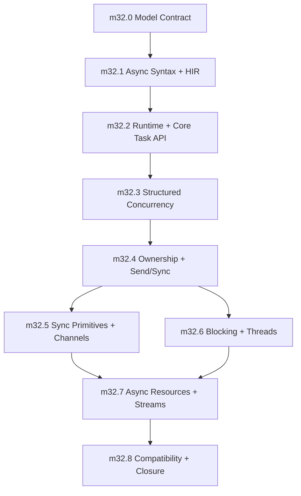

# Phase 32: Async and Concurrency Model

status: proposed

## Objective

Implement the canonical async and concurrency model defined in `internal_docs/async_concurrency_model.md`.

Phase 32 is not an ecosystem grab bag. It closes one coherent model:

- Python-shaped syntax: `async def`, `await`, `async with`, `async for`
- Rust-shaped safety: ownership-aware task boundaries, explicit sharing, no hidden thread-safety wrappers
- structured concurrency by default: parent scopes own child tasks
- typed cancellation, timeout, and cleanup behavior
- explicit offload for CPU-bound or blocking work
- blocking/CPU annotations that power diagnostics instead of hidden scheduling
- compatibility veneers only after the canonical model works

The phase is complete when practical async/concurrent Sifr programs run without user-managed event loops and without escaping Sifr's core guarantee: no user-triggerable runtime panics.

## Semantic Source Of Truth

`internal_docs/async_concurrency_model.md` is the authoritative semantic contract for this phase.

This file is the implementation plan. It records the milestone order, implementation responsibilities, validation goals, deferrals, and phase exit gate. If a detail conflicts with the model file, the model file wins and this phase file must be updated before implementation continues.

## Depends On

- Phase 10 borrow-by-default and ownership semantics.
- Phase 14 codegen structure.
- Phase 23 project graph and invocation isolation.
- Phase 27 runtime-safety and diagnostics contract.
- Phase 30 reliability, parity, and performance budgets.
- Phase 31 algorithmic compatibility hardening.

## Non-Goals And Deferrals

The following are not Phase 32 v1 exit criteria:

- web framework
- typed serialization and pydantic-like validation
- database clients
- full `asyncio` parity
- raw event-loop APIs and loop policies
- transports/protocols callback APIs
- public selectors module unless later low-level socket work proves it necessary
- `contextvars`
- multiprocessing
- process pools and `ProcessPoolExecutor`
- subprocess and signal APIs
- async generators and async comprehensions

`ProcessPoolExecutor`, multiprocessing, and hard interruption of CPU-bound work are blocked on the future Phase 40 typed data/IPC contract.

Subprocess and signal integration require a later model amendment. Older Phase 32 notes that listed subprocess or signal delivery as exit criteria are superseded by the model contract.

## Design Principles

- **One canonical async model:** user code should learn `async def`, `await`, `sifr.task`, and `sifr.sync`; not event-loop objects, loop policies, or callback orchestration.
- **Structured concurrency first:** child tasks belong to parent scopes. Fire-and-forget is absent in v1.
- **Async is for waiting:** CPU-bound and blocking work must use explicit offload APIs. The compiler never silently schedules work on another executor.
- **No implicit shared mutable memory:** cross-task/thread sharing requires explicit primitives. The compiler never invents `Arc`, `Mutex`, clones, or detached ownership on the user's behalf.
- **Cancellation is typed control flow:** active cancellation is scope-exit semantics, not a broad-catchable ordinary error. Materialized child cancellation is explicit evidence.
- **Compatibility is layered:** `sifr.asyncio` and `sifr.concurrent` can wrap the canonical model, but cannot define a second model.
- **Runtime is private:** the implementation may use Tokio or a compatible substrate, but public APIs remain runtime-neutral.

## Locked V1 Decisions

These are implementation constraints, not suggestions:

1. `scope.spawn` is the canonical v1 task creation API. Free-floating detached spawn is not exposed.
2. Active task cancellation is scope-exit semantics and is not catchable by ordinary `except Error`; `CancellationError` is materialized boundary evidence observed from outside the cancelled task.
3. `CancellationError` is not an `Error` subclass and is never matched by broad `except Error`.
4. `await Task[T, E]` produces `Result[T, E | CancellationError]` when observed by a non-cancelled task.
5. `try`/`except` auto-unwrap works on ordinary `E` errors; cancellation requires explicit handling or propagation.
6. `task.select` and `task.race` cancel losing tasks by default.
7. `task.gather` is fail-fast in v1. The first child error cancels unfinished children; later errors are secondary evidence.
8. `task.timeout` has deterministic race behavior: inner completion wins same-tick ties, timeout expiry cancels and awaits cleanup, and outer cancellation cancels the inner task.
9. `sync.Channel[T]` is multi-producer, multi-consumer. Bounded and unbounded constructors are separate.
10. `sync.Lock[T]` uses a synchronous Rust mutex internally in v1; lock guards cannot cross `await`.
11. Spawned tasks require sendable task boundaries in v1. Local non-Send task sets are deferred.
12. `sifr.asyncio` ships only as a compatibility veneer after the canonical model is complete.
13. Public selectors, contextvars, multiprocessing, process pools, raw event loops, and transport/protocol APIs are deferred.
14. `ProcessPoolExecutor` is blocked on the future typed IPC/serialization contract.
15. `@blocking_io` and `@cpu_bound` are diagnostic annotations, not implicit scheduling directives.
16. Subprocess and signal APIs are out of scope for Phase 32 v1 and require a later model amendment.
17. Cancellation suppression, shielding, cancellation counters, and graceful shutdown tokens are deferred; v1 graceful shutdown uses structured scope cancellation and explicit channels.

## Milestones

The milestones below intentionally match `milestone_async_0` through `milestone_async_8` in the model file. Implementation must execute them in order unless a later PR updates both files with reviewed rationale.

### milestone_async_0: Model Contract and Runtime Architecture Lock

status: proposed

**Goal:** Lock the async/concurrency semantic contract before adding compiler/runtime code.

**Scope:**

- Copy the canonical type, task, cancellation, timeout, lock, and runtime contracts into `internal_docs/architecture.md`.
- Decide and document the runtime substrate boundary:
  - public Sifr APIs are runtime-neutral,
  - implementation may use Tokio or the chosen Tokio-compatible substrate,
  - no public event-loop object exists in the primary model,
  - users do not configure or select runtimes in v1.
- Define initial public modules:
  - `sifr.task`
  - `sifr.sync`
  - `sifr.concurrent`
- Define initial public types:
  - `Task[T, E]`
  - `Task[T]`
  - `TaskScope`
  - `TaskGroup`
  - `CancellationError`
  - `TimeoutError`
  - `SecondaryError`
  - `Channel[T]`
  - `Lock[T]`
- Define async type-system additions:
  - task-handle type representation,
  - awaitable structural protocol representation,
  - async-callable representation,
  - `Task[T, E]` ordinary error constraint (`E: Error`),
  - `Task[T, E]` await result (`Result[T, E | CancellationError]`),
  - `AsyncFunction` not interchangeable with sync `Function`/`Callable`.
- Define HIR additions:
  - async function marker,
  - await expression,
  - async call representation,
  - task spawn representation,
  - async context-manager statement,
  - async iteration statement,
  - task/awaitable type representation,
  - spawn capture metadata for sendability, borrowing, and lifetimes.
- Define task container protocols:
  - `task.scope()` returns a `TaskScope`,
  - `TaskScope` is an async context manager,
  - `TaskScope.__aexit__` waits for all children or cancels unfinished children on abnormal exit,
  - `TaskScope` cannot be used outside its `async with` lifetime,
  - `TaskGroup` owns group error policy on top of task scopes.
- Define cancellation policy:
  - active cancellation is not caught by `except Error`,
  - materialized `CancellationError` is not an `Error` subclass,
  - timeouts cancel enclosed work and return `TimeoutError`,
  - cancellation waits for cleanup before scope exit,
  - cancellation suppression/shield/uncancel APIs are absent in v1.
- Define timeout API forms:
  - `task.timeout(task, duration)` wraps a task handle or awaitable operation,
  - `task.timeout(duration)` returns an async context manager usable as `async with task.timeout(duration):`,
  - both forms share the same completion-vs-deadline race policy,
  - the context-manager form is the canonical implementation target for `sifr.asyncio.timeout(duration)`.
- Define selection, channel, lock, annotation, and runtime-neutrality policies.
- Rewrite or explicitly replace older Phase 32 planning with this nine-milestone plan.
- Define validation fixture names and diagnostic families before implementation begins.

**Definition of done:**

- Architecture and phase docs reference the same semantic contract.
- There are no conflicting Phase 32 exit criteria in `internal_docs/phases/32_async_ecosystem.md`.
- All public modules/types for v1 are named and scoped.
- `Task`, `Awaitable`, `AsyncFunction`, cancellation, timeout, scope, lock, and channel semantics are specified enough for implementation PRs.
- Deferred surfaces are explicit and cannot be inferred from older notes.

**Validation planning goals:**

- Positive: documentation/architecture consistency check for all initial types and modules.
- Negative: review checklist rejects any plan that exposes raw event loops, detached spawn, process pools, subprocess/signal APIs, or raw Tokio types in public APIs.

**Demo:** none; this milestone is a design/architecture lock.

---

### milestone_async_1: Async Syntax, Awaitability, and HIR Substrate

status: proposed

**Goal:** Teach the compiler to understand async syntax as typed Sifr semantics without task scheduling.

**Depends on:** `milestone_async_0`

**Scope:**

- Parse and lower `async def`.
- Parse and lower `await`.
- Add HIR nodes for async functions and await expressions.
- Add awaitable/future/task type representation.
- Add await type checking:
  - `await x` is valid only when `x: Awaitable[T]`,
  - result type is `T`.
- Add structural awaitable protocol checking.
- Reject async function calls from sync functions. Sync code cannot call an async function and silently create an unawaited task handle.
- Reject `await` outside async functions.
- Reject awaiting non-awaitable values.
- Preserve `try`/`except` auto-unwrap behavior for `Result` values produced by await expressions.
- Add source-span plumbing for async diagnostics.
- Add initial codegen shape for async functions that do not spawn tasks.

**Definition of done:**

- `async def` is represented explicitly in HIR.
- `await` is represented explicitly in HIR.
- Type checking distinguishes awaitable and non-awaitable values.
- Awaiting `Task[T, E]` has the stable type `Result[T, E | CancellationError]`.
- Invalid async syntax/use fails before Rust compilation.
- The implementation does not introduce raw string fallback paths.

**Positive validation:**

- `async_basic.sifr`
- `await_chain.sifr`
- `async_result_auto_unwrap.sifr`

**Negative validation:**

- `await_outside_async.sifr`
- `await_non_awaitable.sifr`
- `async_return_type_mismatch.sifr`
- `async_call_without_await_from_sync_rejected.sifr`
- `cancelled_task_except_error_does_not_swallow.sifr`

**Demo:**

- `demos/m32_async_syntax_demo.sifr`

---

### milestone_async_2: Runtime Bootstrap and Core Task API

status: proposed

**Goal:** Make ordinary async programs run without user-managed runtime setup.

**Depends on:** `milestone_async_1`

**Scope:**

- Auto-detect async entrypoints.
- Generate runtime bootstrap for `async def main()`.
- Support `async def main() -> Result[None, E]` where `E: Error`.
- Wire runtime dependencies only when async is used.
- Implement `sifr.task.sleep`.
- Implement `sifr.task.timeout`.
- Define `task.timeout(task, duration)` race behavior:
  - inner completion before deadline returns the inner result and does not cancel it,
  - deadline first cancels the inner task, waits for cleanup, and returns `Err(TimeoutError)`,
  - same scheduler tick gives inner completion priority,
  - outer cancellation cancels the inner task unconditionally.
- Define `task.timeout(duration)` context-manager form:
  - usable as `async with task.timeout(duration):`,
  - applies the same completion-vs-deadline race policy to the enclosed block,
  - cancellation or timeout of the enclosed block awaits cleanup before scope exit,
  - this is the canonical implementation target for `sifr.asyncio.timeout(duration)`.
- Implement the minimal `sifr.task.scope` runtime container needed for scoped spawn.
- Implement `scope.spawn` returning a typed task handle.
- Implement task-handle `join`.
- Implement task-handle cancellation API.
- Translate obvious runtime/task-boundary failures into Sifr diagnostics.

**Definition of done:**

- Async programs run through `sifr run`.
- Sync programs do not gain async runtime dependencies.
- `scope.spawn` returns a handle that must be awaited, joined, or cancelled.
- There is no free-floating detached spawn in v1.
- `task.sleep` and `task.timeout` work.
- `task.timeout` has deterministic completion-vs-deadline tie-breaking.
- Cancelling a task produces typed, deterministic behavior.
- Runtime bootstrap does not require user-visible event-loop configuration.
- Public `sifr.task`, `sifr.sync`, and `sifr.concurrent` APIs do not expose runtime-specific implementation types.

**Positive validation:**

- `async_runtime_bootstrap.sifr`
- `scope_spawn_join.sifr`
- `task_sleep.sifr`
- `task_timeout_success.sifr`
- `task_timeout_completion_wins_tie.sifr`
- `task_timeout_context_manager.sifr`
- `task_cancel_basic.sifr`
- `runtime_leak_rejected.sifr`

**Negative validation:**

- `detached_spawn_not_available.sifr`
- `task_timeout_error_type.sifr`

**Demo:**

- `demos/m32_task_core_demo.sifr`

---

### milestone_async_3: Structured Concurrency and Cancellation Semantics

status: proposed

**Goal:** Make scoped concurrency the default composition model.

**Depends on:** `milestone_async_2`

**Scope:**

- Implement `task.scope`.
- Implement `task.TaskGroup`.
- Implement `scope.spawn`.
- Define orphaned task-handle rules:
  - every `scope.spawn` handle must be awaited, joined, explicitly cancelled, or moved into a tracked collection consumed before scope exit,
  - a moved handle is tracked only when the compiler proves the collection is drained, consumed, or dropped before task-scope exit,
  - a task handle reaching end-of-scope without consumption is a compile-time diagnostic,
  - there is no implicit fire-and-forget path,
  - `TaskScope.__aexit__` cancels and awaits any remaining unconsumed children as a runtime safety backstop.
- Implement deterministic scope exit:
  - all child tasks complete,
  - or unfinished children are cancelled,
  - and cleanup is awaited before exit.
- Implement sibling cancellation on first failure for task groups.
- Implement `task.gather` with deterministic success ordering and fail-fast error behavior:
  - first child error cancels unfinished children,
  - earliest handle in input order is the primary error if multiple failures surface during cancellation,
  - cleanup errors from cancelled children surface as `SecondaryError` values attached to the primary `gather` result,
  - later failures are secondary evidence,
  - collect-all semantics are deferred to a future API.
- Implement `task.select` and `task.race`.
- Cancel losing tasks by default for `select` and `race`.
- Define how cancellation composes with `Result`.
- Add diagnostics for leaked task handles and invalid scope escape.

**Definition of done:**

- Task scopes own child task lifetimes.
- Spawned tasks cannot escape with borrowed state that outlives the scope.
- Orphaned task handles are rejected before Rust compilation where statically knowable.
- Scope exit cancels/awaits any remaining children as a safety backstop.
- Task-group failure cancels unfinished siblings.
- Cancellation is observable through the Sifr type model without becoming broad-catchable ordinary errors.
- `gather` preserves input ordering for successes and has documented fail-fast cancellation behavior for errors.
- `select`/`race` deterministically cancel losers by default.
- Nested cancellation scopes propagate cancellation in a documented order.

**Positive validation:**

- `task_scope_basic.sifr`
- `task_group_basic.sifr`
- `task_group_error_cancels_siblings.sifr`
- `task_gather_ordered.sifr`
- `task_gather_cleanup_error_secondary.sifr`
- `task_handle_collection_consumed.sifr`
- `task_select_first_completion.sifr`
- `task_race_cancels_losers.sifr`
- `cancellation_scope_timeout.sifr`
- `cancellation_group_sibling.sifr`
- `cancellation_nested_scopes.sifr`
- `cancellation_cleanup_runs.sifr`

**Negative validation:**

- `task_escape_scope_rejected.sifr`
- `task_handle_unused_must_join_or_cancel.sifr`
- `cancelled_task_use_rejected.sifr`
- `task_handle_dropped_without_consumption_rejected.sifr`
- `task_group_unhandled_error_rejected.sifr`

**Demo:**

- `demos/m32_structured_concurrency_demo.sifr`

---

### milestone_async_4: Ownership, Borrowing, and Send/Sync Task Boundaries

status: proposed

**Goal:** Make task boundaries enforce Sifr ownership and Rust-like sendability with Sifr-native diagnostics.

**Depends on:** `milestone_async_3`

**Scope:**

- Implement Send/Sync-style trait derivation or equivalent type facts.
- Validate scoped spawn requirements and keep detached spawn unavailable in v1.
- Reject non-sendable captures crossing task boundaries.
- Reject borrowed values that can outlive their owner through task escape.
- Reject mutable borrow across `await` when the borrow would remain live.
- Allow immutable borrow across `await` only when lifetime and mutation rules prove it safe.
- Add Sifr diagnostics for:
  - non-sendable task capture,
  - borrowed value escaping task scope,
  - invalid borrow across await,
  - unsynchronized mutable state crossing task boundary.

**Definition of done:**

- Spawn captures are checked before Rust compilation.
- Ordinary awaited futures within the same task do not require Send unless they cross a spawn/thread boundary.
- Scoped spawn allows only lifetimes the scope can prove safe.
- Diagnostics point at the captured value or live borrow, not just the generated Rust error.
- No raw Rust Send/Sync errors leak as the primary user experience.

**Positive validation:**

- `spawn_owned_send_value.sifr`
- `spawn_scoped_borrow_ok.sifr`
- `spawn_capture_immutable_shared_ok.sifr`
- `await_without_live_borrow.sifr`

**Negative validation:**

- `spawn_non_send_field_rejected.sifr`
- `spawn_borrowed_value_escapes_rejected.sifr`
- `borrow_across_await_rejected.sifr`
- `spawn_mutable_alias_rejected.sifr`
- `spawn_self_with_non_send_field_rejected.sifr`

**Demo:**

- `demos/m32_ownership_concurrency_demo.sifr`

---

### milestone_async_5: Synchronization Primitives and Channels

status: proposed

**Goal:** Provide explicit primitives for sharing and coordination when concurrency requires it.

**Depends on:** `milestone_async_4`

**Scope:**

- Implement `sync.Shared[T]` for immutable shared ownership with atomic shared ownership (`Arc<T>`-style) semantics and no mutation API.
- Implement `sync.Lock[T]`.
- Implement `sync.RwLock[T]`.
- Implement `sync.Channel[T]`.
- Implement unbounded MPMC channels via `sync.channel[T]()`.
- Implement bounded MPMC channels via `sync.bounded_channel[T](capacity)`.
- Implement channel close semantics:
  - `channel.send(value)` on closed channel returns `Result[None, ClosedError]`,
  - `channel.receive()` returns `Result[Option[T], ClosedError]`,
  - `None` means graceful end-of-stream after close and drain,
  - `channel.close()` wakes pending senders and receivers deterministically,
  - cancellation while blocked on send/receive propagates cancellation,
  - bounded channels apply backpressure.
- Implement `sync.Semaphore`.
- Implement `sync.Notify`.
- Define sync primitive behavior in async and blocking contexts.
- Implement static lock-guard liveness analysis at await points.
- Reject live `LockGuard`/`RwLockGuard` across `await`.
- Add diagnostics for statically knowable lock misuse.

**Definition of done:**

- Shared immutable state works through `sync.Shared[T]`.
- Mutation requires `Lock`, `RwLock`, or message passing.
- Channels are the canonical queue-like concurrency primitive and are MPMC in v1.
- Channel close, receiver exhaustion, cancellation, and backpressure behavior are typed and deterministic.
- Lock guard liveness at await points is rejected at compile time.
- Lock guards cannot cross `await`.
- Semaphore and notify primitives support common coordination patterns.
- The compiler rejects unsynchronized shared mutable access.

**Positive validation:**

- `shared_basic.sifr`
- `lock_basic.sifr`
- `rwlock_readers.sifr`
- `channel_basic.sifr`
- `channel_backpressure.sifr`
- `channel_close.sifr`
- `channel_cancel_pending_receive.sifr`
- `semaphore_basic.sifr`
- `notify_basic.sifr`

**Negative validation:**

- `shared_mut_without_lock_rejected.sifr`
- `channel_send_wrong_type_rejected.sifr`
- `channel_non_send_element_rejected.sifr`
- `lock_guard_escape_rejected.sifr`
- `lock_guard_across_await_rejected.sifr`
- `lock_across_task_boundary_rejected.sifr`

**Demo:**

- `demos/m32_sync_channel_demo.sifr`

---

### milestone_async_6: Blocking I/O, CPU-Bound Work, and Thread Offload

status: proposed

**Goal:** Keep cooperative async tasks from becoming the accidental path for blocking or CPU-heavy work.

**Depends on:** `milestone_async_4`

**Scope:**

- Add `@blocking_io` and `@cpu_bound` annotations.
- Add diagnostics for calling annotated functions directly from async contexts.
- Implement `task.spawn_blocking`.
- Implement `sifr.concurrent.ThreadPoolExecutor`.
- Add `sifr.threading` as a thin compatibility veneer where it can stay canonical:
  - `Thread`
  - `Lock`
  - `Event`
  - `Condition`
- Define blocking-task return/error/cancellation behavior:
  - cancelling `task.spawn_blocking` or thread-pool work requests cancellation and drops/abandons the handle result,
  - v1 does not forcibly abort a running OS thread,
  - already-running blocking work may continue to completion,
  - hard interruption requires future process isolation/typed IPC.
- Ensure blocking work cannot occupy cooperative async workers where Sifr controls the path.
- Document when users should choose async tasks, channels, locks, or blocking offload.

**Definition of done:**

- Annotated blocking/CPU functions produce diagnostics in async contexts.
- Diagnostics suggest async alternatives or explicit offload.
- `spawn_blocking` works and returns typed results.
- `ThreadPoolExecutor` works as a compatibility layer.
- Cancellation behavior for blocking work is documented and tested.
- The compiler never silently offloads work.

**Positive validation:**

- `blocking_io_annotation_warning.sifr`
- `cpu_bound_annotation_warning.sifr`
- `spawn_blocking_basic.sifr`
- `thread_pool_executor_basic.sifr`

**Negative validation:**

- `blocking_call_in_async_diagnostic.sifr`
- `cpu_bound_call_in_async_diagnostic.sifr`
- `spawn_blocking_non_send_rejected.sifr`

**Demo:**

- `demos/m32_blocking_offload_demo.sifr`

---

### milestone_async_7: Async Context Managers, Async Iteration, and Resource Cleanup

status: proposed

**Goal:** Complete language-level async control flow without dragging in broad ecosystem APIs.

**Depends on:** `milestone_async_5` and `milestone_async_6`

**Scope:**

- Implement `async with`.
- Define and enforce the async context-manager protocol.
- Implement async iterable protocol.
- Implement `async for`.
- Define cancellation cleanup behavior for async context managers:
  - cleanup order is LIFO,
  - cancelling inside `async with` unwinds active async context managers,
  - async exit receives the cancellation cause,
  - async exit runs to completion unless the runtime is forcefully aborted,
  - errors from async exit during cancellation become `SecondaryError` evidence attached to the owning scope result,
  - panic-like failures from async exit are caught at the runtime/codegen boundary and surfaced as secondary errors,
  - parent cancellation triggers child cancellation, but each task unwinds its own cleanup independently.
- Define channel-backed async iteration.
- Keep async generators and async comprehensions deferred.

**Definition of done:**

- `async with` calls async enter/exit protocol methods correctly.
- Async resource cleanup runs under cancellation.
- If cleanup fails during cancellation, the original cancellation remains primary and cleanup failure is secondary evidence.
- `SecondaryError` never masks the primary result.
- Async exit cleanup order is LIFO.
- Panic-like failures in async exit do not become process-terminating double-panic paths.
- Nested cancellation is deterministic.
- `async for` works for channel/stream-like values.
- Non-async iterables are rejected in `async for`.
- Async comprehensions are explicitly deferred as sugar over stable `async for`.

**Positive validation:**

- `async_with_basic.sifr`
- `async_with_cancel_cleanup.sifr`
- `async_with_nested_cleanup_order.sifr`
- `async_for_channel.sifr`
- `async_for_stream_result.sifr`

**Negative validation:**

- `async_with_missing_protocol_rejected.sifr`
- `async_for_non_async_iterable_rejected.sifr`
- `async_resource_cleanup_error_typed.sifr`
- `async_with_cleanup_panic_secondary.sifr`

**Demo:**

- `demos/m32_async_resource_demo.sifr`

---

### milestone_async_8: Compatibility Veneers and Phase Closure

status: proposed

**Goal:** Expose limited compatibility surfaces only after the canonical model is proven.

**Depends on:** `milestone_async_7`

**Scope:**

- Add `sifr.asyncio` as a veneer over `sifr.task` and `sifr.sync`.
- Support only the curated `sifr.asyncio` subset:
  - `run`
  - `create_task`
  - `gather`
  - `TaskGroup`
  - `sleep`
  - `wait_for`
  - `timeout`
  - `Queue`
- Add `sifr.concurrent.Future` as an alias for `sifr.task.Task`, not a separate runtime primitive.
- Keep raw event loops, loop policies, transports/protocols, public selectors, contextvars, multiprocessing, and process pools deferred.
- Treat `ProcessPoolExecutor` as blocked on Phase 40 typed IPC/serialization.
- Add CPython-derived compatibility tests for the supported subset.
- Add CPython-derived negative/waiver tests for unsupported APIs.
- Document intentional divergences.
- Run full phase closure validation.

**Compatibility mapping:**

| Compatibility API | Canonical Sifr equivalent |
| --- | --- |
| `sifr.asyncio.run(fn)` | compatibility shim over direct async entrypoint bootstrap; not needed for new Sifr code |
| `sifr.asyncio.create_task(fn)` | `scope.spawn(fn)` inside an explicit task scope |
| `sifr.asyncio.gather(*tasks)` | `sifr.task.gather(*tasks)` |
| `sifr.asyncio.TaskGroup` | `sifr.task.TaskGroup` |
| `sifr.asyncio.sleep(delay)` | `sifr.task.sleep(delay)` |
| `sifr.asyncio.wait_for(task, timeout)` | `sifr.task.timeout(task, timeout)` |
| `sifr.asyncio.timeout(duration)` | `sifr.task.timeout(duration)` context-manager form |
| `sifr.asyncio.Queue` | `sifr.sync.Channel` / `sifr.sync.bounded_channel` |
| `sifr.concurrent.Future` | `sifr.task.Task` type alias |

**Definition of done:**

- Compatibility APIs are thin wrappers over canonical model types.
- No compatibility API introduces a second runtime model.
- `sifr.concurrent.Future` is an alias over task handles, not a second future implementation.
- Unsupported `asyncio` APIs fail with intentional diagnostics or remain absent from documented public surface.
- Intentional divergences are documented.
- The phase exit gate passes.

**Positive validation:**

- `asyncio_run_subset.sifr`
- `asyncio_create_task_subset.sifr`
- `asyncio_task_group_subset.sifr`
- `asyncio_wait_for_subset.sifr`
- `asyncio_queue_via_channel.sifr`
- `concurrent_future_subset.sifr`

**Negative validation:**

- `asyncio_loop_policy_not_supported.sifr`
- `asyncio_transport_protocol_not_supported.sifr`
- `selectors_public_api_deferred.sifr`
- `contextvars_deferred.sifr`
- `process_pool_not_available.sifr`

**Demo:**

- `demos/m32_async_concurrency_model_demo.sifr`

## Milestone Ordering



Implementation order:

- `milestone_async_0` first: lock semantics, architecture, and diagnostic names.
- `milestone_async_1` second: parser/HIR/type substrate.
- `milestone_async_2` third: runtime bootstrap and core task API.
- `milestone_async_3` fourth: structured concurrency and cancellation.
- `milestone_async_4` fifth: ownership and Send/Sync task boundaries.
- `milestone_async_5` and `milestone_async_6` can proceed after `milestone_async_4`, but must not write overlapping compiler/runtime internals without explicit coordination.
- `milestone_async_7` waits for both sync primitives and blocking offload.
- `milestone_async_8` closes compatibility only after the canonical model is validated.

## Quality Contract

### Entry Criteria

- Phase 31 exit gate is satisfied.
- Phase 27 non-regression baseline is green.
- `internal_docs/async_concurrency_model.md`, `internal_docs/architecture.md`, and this file agree on Phase 32 scope.
- No implementation PR begins before `milestone_async_0` closes the architecture contract.

### Non-Regression Invariants

These hold for every milestone:

- No user-triggerable panic paths.
- No data-dependent emitted `.unwrap()`, `.expect()`, or `panic!` in user runtime paths.
- Stable diagnostic contract: codes, spans, URLs, severity, suggestions, schema.
- Canonical/lossless `json` diagnostics with `human` and `compact` as renderer views only.
- Deterministic diagnostic recovery/ordering and stable exit-code behavior.
- No fallback, migration, or legacy compatibility architecture.
- No raw Tokio/runtime-specific public types.
- No hidden task detachment, shared-memory wrapping, cloning, or offload.
- Every milestone updates relevant docs and validation fixtures before closure.

### Required Local Validation

Every implementation PR should run at least:

```bash
scripts/run_all_tests.sh --profile quick
```

Milestone closure should run:

```bash
scripts/run_all_tests.sh
```

Additional targeted commands should be used when relevant:

```bash
cargo test -p sifr -- <test_name>
cargo run -q -p sifr -- check <fixture>.sifr
cargo run -q -p sifr -- emit <fixture>.sifr
scripts/run_e2e_pass.sh
cargo clippy --workspace -- -D warnings
cargo fmt --check
python3 scripts/check_hir_maintainability_guardrails.py
```

### Validation Families

The phase must add coverage for:

- async syntax pass/fail fixtures
- awaitability type-check fixtures
- runtime bootstrap fixtures
- task lifecycle fixtures
- cancellation determinism fixtures
- structured concurrency fixtures
- task-boundary ownership fixtures
- Send/Sync diagnostics fixtures
- synchronization primitive fixtures
- channel close/backpressure fixtures
- channel cancellation fixtures
- blocking offload fixtures
- blocking/CPU annotation diagnostics fixtures
- async context-manager fixtures
- async iteration fixtures
- compatibility veneer fixtures
- runtime-neutrality checks proving Tokio/runtime-specific types do not leak
- async cleanup panic-boundary fixtures
- generated-code panic sweep for async/runtime paths

### Milestone Evidence

Each milestone PR must record:

- milestone ID and scope items completed,
- positive validation fixtures added or updated,
- negative validation fixtures added or updated,
- commands run locally,
- any deferred item and its explicit reason,
- links to merged PRs in the relevant issue/phase tracker.

## Exit Gate

Phase 32 is complete only when all of these are true:

- `async def` and `await` are first-class typed Sifr constructs.
- Async entrypoints run without user-visible runtime setup.
- `sifr.task` supports scoped spawn, join, cancel, sleep, timeout, gather, select/race, `TaskGroup`, and `TaskScope` via `async with task.scope()`.
- Structured concurrency is the default successful path.
- Detached task behavior is absent in v1.
- Cancellation semantics are deterministic, typed, and not swallowed by broad `except Error`.
- Task-boundary Send/Sync and borrow rules are enforced by Sifr diagnostics.
- Explicit synchronization primitives exist for shared state.
- Channels are the canonical producer/consumer primitive.
- CPU-bound and blocking work has explicit offload APIs and diagnostics.
- `async with` and `async for` work for protocol-conforming values.
- Compatibility veneers do not define a second async model.
- Deferred APIs are documented with negative/waiver tests.
- No new user-triggerable generated panic paths exist.
- Full local validation passes.
- External/reviewer sign-off records the phase as implementation-ready.
