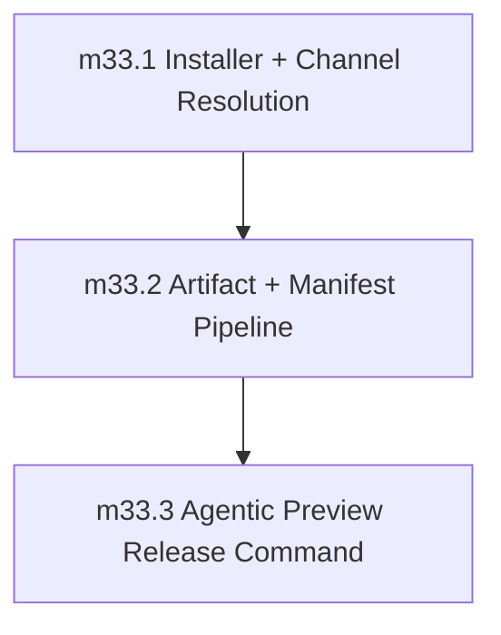

# Phase 33: Preview Distribution and Release Automation (`alpha`/`beta`)

status: refining

## Objective

Ship preview release channels early for adoption while keeping stable GA promotion gated for Phase 39.

Phase 33 is not a compiler-feature phase. It establishes the first canonical distribution path for preview binaries:

- a public installer entrypoint at `https://sifr.sh/install`,
- channel metadata for `alpha`, `beta`, and gated `stable`,
- reproducible multi-platform preview artifacts,
- checksum and signature verification before install,
- release automation for repeatable `alpha`/`beta` publication.

The phase is complete when a user can install an `alpha` or `beta` preview from the public installer and the project can cut another preview release through the documented automation without enabling stable GA promotion.

## Distribution Source Of Truth

This file is the authoritative contract for Phase 33 until implementation creates supporting docs. It records the channel protocol, artifact layout, milestone order, validation goals, deferrals, and phase exit gate. Implementation PRs may add a dedicated `internal_docs/distribution_pipeline.md`, but they must not introduce behavior that conflicts with this phase file unless a review PR updates this file first.

The Sifr site repository is part of this phase:

- Site repo: `/Users/yaseralnajjar/work/sifr/sifr-blog-website/`
- Public installer source: `apps/sifr-site/public/install`
- Public manifest roots: `apps/sifr-site/public/releases/channels/` and `apps/sifr-site/public/releases/versions/`
- Deployment target: the existing `sifr.sh` site deployment

The compiler repository owns release automation, artifact building, verification scripts, and the `/create-new-version` workflow.

## Depends On

- Phase 32 is completed. Current closure evidence: Phase 32 is marked `status: completed` in `internal_docs/phases/32_async_ecosystem.md`, with corrective follow-up completed on 2026-05-12.
- Phase 27 runtime-safety and diagnostics contracts remain green.
- The `sifr.sh` site repository can deploy static files from `apps/sifr-site/public/`.

## Non-Goals And Deferrals

The following are not Phase 33 exit criteria:

- Stable GA promotion.
- Package-manager distribution (`brew`, `apt`, `npm`, `pip`, `cargo install`, Windows package managers).
- Automatic runtime telemetry or update checks from installed binaries.
- Rollback and incident governance beyond preview manifest rollback mechanics; Phase 39 owns GA rollback governance.
- Windows installer support for `curl | bash`; Windows artifacts may be added later behind a separate installer contract.
- Long-term signing authority rotation policy; Phase 33 only locks the preview verification mechanism.

## Locked Preview Distribution Decisions

1. `alpha` and `beta` are the only installable moving channels in Phase 33.
2. `stable` channel metadata is allowed to exist, but it must be explicitly gated with `enabled: false` and no installer path may install from it before Phase 39.
3. Explicit `--version` pinning accepts only preview versions published in the version manifest tree, for example `0.1.0-alpha.1` or `0.1.0-beta.1`. Stable-looking versions without preview prerelease labels are rejected until Phase 39.
4. Channel resolution order is deterministic: `--version` wins over `--channel`; otherwise `--channel`; otherwise `SIFR_CHANNEL`; otherwise `beta`.
5. Invalid combinations are hard errors. `--version` with a conflicting `--channel` is rejected instead of silently choosing one.
6. The installer never compiles Sifr from source and never falls back to an alternate artifact if the resolved artifact is missing or invalid.
7. The installer validates checksum and signature before replacing or creating the installed binary.
8. The preview target set is initially:
   - `aarch64-apple-darwin`
   - `x86_64-apple-darwin`
   - `x86_64-unknown-linux-gnu`
   - `aarch64-unknown-linux-gnu`
9. Artifacts are published as GitHub Release assets in `sifr-lang/sifr`; the website hosts only installer and manifest files.
10. Checksums use SHA-256. Signatures use the selected repository-supported signing mechanism documented by the implementation PR before first real release; unsigned artifacts are never accepted by the installer.
11. Channel manifests point to immutable version manifests. Version manifests point to immutable artifact URLs and verification metadata.
12. Preview release automation must support dry-run and real-run modes with identical planning logic. Real-run is the dry-run plan plus authorized mutations.

## Manifest Contract

Channel manifests live at:

- `https://sifr.sh/releases/channels/alpha.json`
- `https://sifr.sh/releases/channels/beta.json`
- `https://sifr.sh/releases/channels/stable.json`

Each channel manifest contains:

- `schema_version`
- `channel`
- `enabled`
- `version`
- `version_manifest_url`
- `updated_at`

Version manifests live at `https://sifr.sh/releases/versions/<version>.json` and contain:

- `schema_version`
- `version`
- `channel`
- `git_sha`
- `created_at`
- `artifacts[]`

Each artifact entry contains:

- `target`
- `asset_url`
- `sha256`
- `signature_url`
- `archive_format`
- `binary_path`

The installer must reject unknown schema versions, disabled channels, missing fields, target mismatches, checksum mismatches, signature failures, unavailable manifests, and unavailable assets.

## `/create-new-version` Workflow Contract

The preview release command is implemented as `.cursor/commands/create-new-version.md` in the compiler repository.

Inputs:

- `--channel alpha|beta`
- `--version <semver-prerelease>`
- `--dry-run`
- `--real-run`
- optional `--base-ref <sha-or-branch>`

Dry-run behavior:

- Validate channel/version compatibility.
- Resolve the base commit.
- Compute artifact names and manifest changes for every target.
- Verify release notes source and checklist links.
- Verify that `stable` will not be changed.
- Print the exact GitHub Release, manifest, and site-deployment mutations that a real run would perform.
- Exit non-zero if any precondition fails.

Real-run behavior:

- Re-run the dry-run planner and require the same plan.
- Build and validate all target artifacts.
- Create or update the preview GitHub Release for the exact version.
- Upload artifacts, checksum files, and signatures.
- Update the immutable version manifest and the selected channel manifest.
- Open PRs for repository changes that must be reviewed before deployment.
- Trigger or document the `sifr.sh` deployment step for manifest publication.

Failure behavior:

- Any failed artifact, checksum, signature, or manifest validation aborts the release.
- A failed real run must leave a written recovery note with completed and incomplete mutations.
- The command must not update `stable` manifests or stable release metadata in Phase 33.

## Milestone Sequencing

Implementation must execute the milestones in order unless a later reviewed PR updates this file with rationale.

## Milestones

### milestone_33_1: Installer and Channel Resolution

**Goal:** Publish the installer entrypoint and lock deterministic channel/version resolution without requiring real release artifacts yet.

**Scope:**

- Add the `https://sifr.sh/install` static installer entrypoint in the site repo.
- Implement installer argument parsing for `--channel` and `--version`.
- Support `SIFR_CHANNEL`.
- Resolve channel metadata from the public manifest roots.
- Reject stable channel installs while preserving explicit stable metadata for Phase 39.
- Reject invalid channel names, conflicting channel/version inputs, unavailable manifests, unsupported platforms, and malformed manifests.

**Definition of done:**

- Installer resolution is deterministic for `alpha`, `beta`, gated `stable`, and explicit preview version pins.
- Installer does not install anything until a valid enabled preview manifest and supported target are resolved.
- The site repo deployment path for `/install` and preview manifests is documented in the PR.

**Positive validation:**

- `verification/distribution/install_default_beta_channel.sh`
- `verification/distribution/install_alpha_channel.sh`
- `verification/distribution/install_version_pin_preview.sh`
- `verification/distribution/install_stable_channel_gated.sh`

**Negative validation:**

- `verification/distribution/install_invalid_channel_rejected.sh`
- `verification/distribution/install_conflicting_channel_and_version_rejected.sh`
- `verification/distribution/install_stable_version_pin_rejected.sh`
- `verification/distribution/install_manifest_unavailable_rejected.sh`
- `verification/distribution/install_malformed_manifest_rejected.sh`

**Demo:** none yet; installer resolution uses mocked manifests until real artifacts exist.

### milestone_33_2: Artifact and Manifest Pipeline

**Goal:** Publish verifiable preview artifacts and wire installer installation to immutable version manifests.

**Depends on:** `milestone_33_1`

**Scope:**

- Add release artifact build automation for the preview target set.
- Publish GitHub Release assets for each target.
- Generate SHA-256 checksums and signatures.
- Generate immutable version manifests.
- Update channel manifests to point at the selected version manifest.
- Extend the installer to download, verify, extract, and install the matching artifact.
- Ensure failed verification never replaces an existing installed binary.

**Definition of done:**

- Installer validates checksum and signature before installation.
- Installer installs the artifact matching the local OS/architecture target.
- Channel manifests point to immutable version manifests.
- Stable manifest remains disabled and unmodified by preview publication.

**Positive validation:**

- `verification/distribution/artifact_manifest_all_preview_targets.sh`
- `verification/distribution/artifact_sha256_validated.sh`
- `verification/distribution/artifact_signature_validated.sh`
- `verification/distribution/install_matching_target_artifact.sh`
- `verification/distribution/channel_manifest_points_to_version_manifest.sh`

**Negative validation:**

- `verification/distribution/artifact_missing_target_rejected.sh`
- `verification/distribution/artifact_checksum_mismatch_rejected.sh`
- `verification/distribution/artifact_signature_failure_rejected.sh`
- `verification/distribution/artifact_target_mismatch_rejected.sh`
- `verification/distribution/stable_manifest_unchanged_by_preview_release.sh`

**Demo:** `demos/preview_distribution_demo/README.md` records a local mocked-manifest install walkthrough and the commands used to verify checksum/signature handling.

### milestone_33_3: Agentic Preview Release Command

**Goal:** Add repeatable preview release automation that can plan and execute `alpha`/`beta` releases without enabling stable GA.

**Depends on:** `milestone_33_2`

**Scope:**

- Add `.cursor/commands/create-new-version.md`.
- Implement the dry-run planner for `alpha` and `beta`.
- Implement the authorized real-run workflow for preview releases.
- Validate version/channel compatibility and reject stable releases.
- Produce a release checklist with artifact, manifest, installer, site deployment, and validation evidence.
- Record recovery information when a real run partially completes.

**Definition of done:**

- `/create-new-version --channel alpha --version <preview> --dry-run` produces the exact mutation plan without side effects.
- `/create-new-version --channel beta --version <preview> --real-run` can publish a validated preview release end to end after review.
- Stable release attempts fail before artifact or manifest mutation.
- The generated checklist maps every validation artifact to the phase exit gate.

**Positive validation:**

- `verification/distribution/create_new_version_alpha_dry_run.sh`
- `verification/distribution/create_new_version_beta_dry_run.sh`
- `verification/distribution/create_new_version_real_run_plan_reuse.sh`
- `verification/distribution/create_new_version_release_checklist.sh`

**Negative validation:**

- `verification/distribution/create_new_version_stable_rejected.sh`
- `verification/distribution/create_new_version_bad_semver_rejected.sh`
- `verification/distribution/create_new_version_missing_artifact_rejected.sh`
- `verification/distribution/create_new_version_site_manifest_drift_rejected.sh`

**Demo:** `demos/preview_release_lifecycle/README.md` captures a dry-run transcript and a mocked real-run transcript showing release planning, artifact verification, manifest publication, and stable gating.

## Quality Contract

- Entry criteria: Phase 32 is completed and async/runtime ecosystem primitives are stable.
- Phase 27 non-regression baseline is required at phase start and must remain green through completion.
- Phase 27 non-regression invariants that must hold in this phase include: no user-triggerable panic paths; no data-dependent emitted `.unwrap()` / `.expect()` / `panic!` in user runtime paths; stable diagnostic contract (codes, severity, spans, URLs, suggestions, schema); canonical/lossless `json` diagnostics with `human` and `compact` as renderer views only; enforced recovery limits with deterministic ordering; and enforced exit-code and CLI stability contracts (`0/1/2/3`, and unknown `--diagnostic-format` exits `2` before semantic work).
- Any milestone that regresses these invariants is incomplete, even if its local scope passes.
- Exit criteria: Preview release lifecycle works reliably without enabling stable GA promotion.
- Milestone quality checks:
  - No fallback, migration, or legacy compatibility code is allowed; implement the canonical architecture directly with clean code only.
  - No lazy or partial fixes are allowed; each milestone must resolve root causes completely, even when that requires significant rework.
  - All implementations must be production-grade release automation: deterministic behavior, explicit invariants, auditable mutations, and hard failure on ambiguity.
  - Every milestone in this phase must satisfy the scope and definition-of-done already documented in this file.
  - Validation evidence must be recorded in the phase execution checklist issue before merge.
  - Validation evidence for every milestone must include at least one positive-path case and one negative-path case mapped to the milestone validation planning goals.
- Validation planning goals:
  - `milestone_33_1` (Installer and Channel Resolution): validation goals cover installer entrypoint publication, channel/default/version resolution, stable gating, invalid input rejection, malformed manifest rejection, and unsupported target rejection.
  - `milestone_33_2` (Artifact and Manifest Pipeline): validation goals cover multi-platform artifact publication, immutable version manifests, channel manifest pointers, checksum validation, signature validation, target matching, and no stable manifest mutation.
  - `milestone_33_3` (Agentic Preview Release Command): validation goals cover dry-run planning, real-run plan reuse, release checklist generation, stable release rejection, malformed version rejection, missing artifact rejection, and site manifest drift rejection.
  - Exit-gate evidence explicitly demonstrates an end-to-end preview release lifecycle for `alpha` or `beta` and separately demonstrates that stable GA promotion remains impossible.

## Exit Gate

- `https://sifr.sh/install` resolves and installs a validated `alpha` or `beta` preview artifact on supported platforms.
- Explicit preview version pinning installs the exact requested version.
- All artifact downloads are checksum- and signature-validated before installation.
- Channel manifests point to immutable version manifests.
- `/create-new-version` dry-run and real-run flows are repeatable for preview releases.
- `stable` channel and stable-looking version pins are rejected before any artifact or manifest mutation.
- The site deployment path for installer and manifests has been exercised.
- Phase 27 non-regression contract remains green: panic-free user paths, no emitted data-dependent unwrap/expect/panic, and stable diagnostics/renderer/exit-code behavior.
