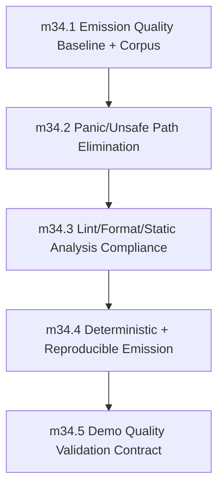

# Phase 34: Generated Code Quality and Production Readiness

status: planned

## Objective
Guarantee that emitted Rust is production-grade in safety, determinism, tooling compliance, and maintainability.

Phase 34 turns generated Rust from an incidental compiler output into a checked product artifact. The phase is complete only when generated Rust from the required corpus can be emitted, scanned, formatted, linted, compiled, rebuilt deterministically, and demonstrated with recorded evidence.

## Source Of Truth

This file is the authoritative contract for Phase 34 until implementation creates supporting docs. Implementation PRs may add `internal_docs/generated_code_quality.md`, but they must not introduce behavior that conflicts with this phase file unless a reviewed PR updates this file first.

## Depends On

- Phase 33 (`preview_distribution_and_release_automation`)
- Phase 27 runtime-safety and diagnostics invariants remain green.

## Feeds Into

- Phase 39 stable GA promotion must consume Phase 34 quality gates before stable artifacts are eligible for release.

## Non-Goals And Deferrals

- New language feature development.
- Runtime semantics redesign already covered by prior soundness phases.
- Package ecosystem expansion concerns.
- Replacing the existing e2e pass/fail harness.
- Adding generated-code optimizations whose only goal is smaller/faster output rather than safety, determinism, formatting, lint, or maintainability.
- Waiving generated-code lint violations through emitted `#[allow(...)]` attributes.
- Introducing fallback generated-code paths or legacy compatibility modes.

## Architecture Ownership

Generated-code quality is owned by `sifr_codegen` and orchestrated by `sifr_driver` / `sifr` tooling. Quality gates may inspect HIR-derived metadata, but they must not move generated-code policy into `sifr_hir` or the parser crates.

The driver owns transient generated-Rust project creation, invocation ordering, and evidence collection. Codegen owns emitted source shape, deterministic ordering, and avoiding forbidden user-path constructs.

## Verification Infrastructure

Phase 34 creates and owns `verification/generated_code_quality/`.

Required files:

- `verification/generated_code_quality/manifest.json` — version-controlled source of truth for the generated-code corpus.
- `verification/generated_code_quality/generated_code_quality_corpus.sh` — emits and checks the required corpus.
- `verification/generated_code_quality/generated_code_quality_panic_scan.sh` — blocks forbidden runtime constructs.
- `verification/generated_code_quality/generated_code_quality_clippy.sh` — runs the generated-code clippy profile.
- `verification/generated_code_quality/generated_code_quality_rustfmt.sh` — runs the generated-code rustfmt profile.
- `verification/generated_code_quality/generated_code_quality_determinism.sh` — verifies byte-stable repeated emission.
- `verification/generated_code_quality/generated_code_quality_demos.sh` — runs required demo quality evidence checks.

Scripts must be deterministic, local-first, and usable both directly and through `scripts/run_all_tests.sh --profile pr`.

## Generated Rust Compilation Pipeline

Generated Rust quality checks use a transient project model rather than ad hoc single-file `rustc` calls.

- Output root: `target/sifr_generated_code_quality/<run-id>/`.
- Each corpus entry emits into an isolated crate under the output root.
- Each isolated crate contains a minimal generated `Cargo.toml`, `src/main.rs` or `src/lib.rs`, and any generated module tree needed by project-mode inputs.
- `cargo check` is used for fast milestone feedback.
- `cargo build` is required by final milestone and phase exit validation.
- `rustfmt --check` runs on generated source files before clippy.
- `cargo clippy -- -D warnings` runs inside each generated crate.
- The pipeline must preserve generated files long enough to write failure evidence, then clean successful transient runs.
- No generated file may suppress lint, format, or safety gates through emitted allow attributes.

Forbidden construct scans operate on generated `.rs` files after emission and before format/lint checks. The scanner fails on `.unwrap(`, `.expect(`, `panic!`, `todo!`, `unimplemented!`, and `unsafe` in user runtime paths unless the occurrence is classified in a checked-in internal-invariant allowlist with owner, rationale, and removal criteria. Data-dependent user paths may not be allowlisted.

## Corpus Contract

The Phase 34 generated-code corpus is defined by `verification/generated_code_quality/manifest.json`.

The manifest must include these groups:

1. `e2e-pass-representative`: representative entries from `crates/sifr/tests/e2e/pass`, including control flow, ownership/borrowing, collections, generics, classes, modules/imports, stdlib I/O, bytes, decimal/integer, diagnostics-adjacent emit cases, async/concurrency, and project-mode dependencies.
2. `stdlib-flows`: fixtures mapped from `verification/stdlib/*_traceability.md` surfaces where emitted Rust exercises nontrivial stdlib/runtime codegen.
3. `multi-module-projects`: multi-file project inputs covering imports, dependency manifests, helper modules, and project-mode emit/build behavior.
4. `demos-required`: required demos listed in `milestone_34_5`.
5. `negative-seeds`: intentionally broken generated-code-quality fixtures used to prove scan, lint, format, and determinism gates fail when expected.

Coverage thresholds:

- At least 50 checked pass fixtures at phase exit.
- At least 10 stdlib-flow fixtures at phase exit.
- At least 5 multi-module/project fixtures at phase exit.
- At least one required fixture for each codegen surface listed above.
- Every manifest entry has a stable id, source path, group, expected command, and evidence category.

Corpus entries are version-controlled and discovered lexicographically by stable id. Any waiver or skipped corpus entry must be explicit, time-bounded, owner-assigned, and issue-linked.

## Panic Inventory Reference

Phase 27's `milestone_27_6` required a checked-in panic inventory covering parser, lowering, type-check, codegen, and driver paths reachable from user input.

Phase 34 lookup order:

1. Primary artifact: `verification/generated_code_quality/panic_inventory.md`, created or refreshed in `milestone_34_1`.
2. Historical Phase 27 execution checklist issue, if it contains a more complete inventory.
3. Any existing named panic inventory artifact under `verification/`.

`milestone_34_2` must use the refreshed Phase 34 inventory as the source of truth for user-triggerable panic patterns and generated user-path safety classification.

## Milestone Sequencing

Implementation must execute the milestones in order unless a later reviewed PR updates this file with rationale.

## Milestones

### milestone_34_1: Emission Quality Baseline and Corpus
- Scope:
  - Define generated-code quality profile and acceptance thresholds.
  - Add `verification/generated_code_quality/manifest.json`.
  - Build the representative corpus from stdlib flows, demos, e2e pass fixtures, and multi-module samples.
  - Add the generated Rust transient project pipeline.
  - Record the Phase 27 panic inventory location or create a current generated-code panic inventory if the Phase 27 artifact is missing or stale.
- Definition of done:
  - Corpus manifest is version-controlled, lexicographically reproducible, and meets the coverage thresholds in this file.
  - Transient generated-Rust projects can be emitted for every corpus entry.
  - `verification/generated_code_quality/generated_code_quality_corpus.sh` passes.
  - Phase 27 panic inventory linkage is recorded in the phase execution checklist issue.
  - Positive and negative validation evidence is recorded.

### milestone_34_2: Panic/Unsafe Path Elimination in Generated User Paths
- Scope:
  - Remove data-dependent emitted `.unwrap()` / `.expect()` / `panic!` in user runtime paths.
  - Remove emitted `todo!` / `unimplemented!` from production paths.
  - Block emitted `unsafe` in user runtime paths.
  - Add the generated-code forbidden construct scanner.
  - Classify any compiler-internal invariant occurrence in a checked-in allowlist with owner, rationale, and removal criteria.
- Definition of done:
  - User-facing generated paths are panic-safe by this contract.
  - Data-dependent user paths have zero `.unwrap(`, `.expect(`, `panic!`, `todo!`, `unimplemented!`, or `unsafe` occurrences.
  - `verification/generated_code_quality/generated_code_quality_panic_scan.sh` passes and fails on seeded violations.

### milestone_34_3: Lint/Format/Static Analysis Compliance
- Scope:
  - Enforce compile with `-D warnings` on generated corpus.
  - Enforce `rustfmt --check` on generated corpus with the repository rustfmt configuration.
  - Enforce generated-code clippy profile: `cargo clippy -- -D warnings` in each transient generated crate, using workspace defaults and no generated allowlist.
  - Ensure generated Rust compiles without warnings through `cargo check`.
- Definition of done:
  - `verification/generated_code_quality/generated_code_quality_rustfmt.sh` passes and fails on seeded format violations.
  - `verification/generated_code_quality/generated_code_quality_clippy.sh` passes and fails on seeded lint/warning violations.
  - Generated corpus passes compile/lint/format gates with zero unresolved violations.

### milestone_34_4: Deterministic and Reproducible Emission
- Scope:
  - Enforce byte-stable output for identical input/configuration.
  - Add repeat-run determinism checks.
  - Ensure deterministic module ordering, import/dependency ordering, helper emission ordering, diagnostic/evidence ordering, and manifest iteration ordering.
  - Integrate with existing report determinism policy without replacing `scripts/check_e2e_report_determinism.sh`.
- Definition of done:
  - Byte-stable generated Rust means source text is identical across repeated `emit` or generated-project emission runs for identical input and compiler configuration.
  - Build artifacts, timestamps, rustc metadata, and platform-specific binary contents are outside the byte-stable source guarantee.
  - `verification/generated_code_quality/generated_code_quality_determinism.sh` passes and fails on seeded nondeterministic ordering.
  - Existing e2e report determinism remains green.

### milestone_34_5: Demo Quality Validation Contract
- Scope:
  - Make required `demos/` runs part of phase quality gates.
  - Require milestone-level positive/negative validation plus demo evidence.
  - Add or update demo fixtures so generated-code quality is visible through normal user workflows.
  - Integrate required demo checks into `scripts/run_all_tests.sh --profile pr`.
- Required demos:
  - `demos/codegen_output/main.sifr`
  - `demos/codegen_structural_passes/main.sifr`
  - `demos/cargo_manifest/main.sifr`
  - `demos/dependency_manifest/main.sifr`
  - `demos/additional_modules/main.sifr`
  - One async/concurrency demo selected from `demos/async_generator_comprehension_demo/main.sifr` or `demos/blocking_offload_demo/main.sifr`, whichever is supported by the current corpus at milestone start.
- Definition of done:
  - Required demos pass generated-code quality checks.
  - `verification/generated_code_quality/generated_code_quality_demos.sh` records pass/fail evidence for each required demo.
  - Demo validation evidence is recorded in the phase execution checklist issue.

## Quality Contract

### Entry criteria
- Phase 33 exit gate is satisfied.
- Phase 34 generated-code corpus seed is defined in `verification/generated_code_quality/manifest.json`.
- Phase 27 non-regression baseline is required at phase start and must remain green through completion.
- Phase 27 non-regression invariants that must hold in this phase include: no user-triggerable panic paths; no data-dependent emitted `.unwrap()` / `.expect()` / `panic!` in user runtime paths; stable diagnostic contract (codes, severity, spans, URLs, suggestions, schema); canonical/lossless `json` diagnostics with `human` and `compact` as renderer views only; enforced recovery limits with deterministic ordering; and enforced exit-code and CLI stability contracts (`0/1/2/3`, and unknown `--diagnostic-format` exits `2` before semantic work).
- Phase 27 panic inventory is the starting source of truth for reachable user-triggerable panic paths. If the inventory cannot be located or is stale, `milestone_34_1` must create or refresh it before `milestone_34_2` starts.
- Any milestone that regresses these invariants is incomplete, even if its local scope passes.

### Milestone quality checks
- Local validation gates pass for each milestone before merge:
  - `scripts/run_all_tests.sh --profile quick`
  - milestone-specific `verification/generated_code_quality/generated_code_quality_*.sh`
- The authoritative pre-PR gate passes before phase-closing PRs:
  - `scripts/run_all_tests.sh --profile pr`
- Generated Rust compiles with `-D warnings` on defined corpus.
- No data-dependent emitted `.unwrap()` / `.expect()` / `panic!` in user runtime paths.
- No emitted `todo!` / `unimplemented!` in production paths.
- No emitted `unsafe` in user runtime paths.
- `rustfmt --check` and `cargo clippy -- -D warnings` pass for generated corpus.
- Generated output contains no gate-suppressing `#[allow(...)]` attributes.
- Determinism checks prove byte-stable source emission over repeated runs.
- Validation evidence is recorded in the phase execution checklist issue before merge.

### Validation planning goals
- `milestone_34_1`:
  - Positive: corpus generation succeeds for representative projects.
  - Negative: malformed corpus manifest entries, missing source paths, unsupported project shapes, and stale panic inventory linkage fail with expected diagnostics.
- `milestone_34_2`:
  - Positive: safe generated paths handle fallible flows without panic.
  - Negative: seeded `.unwrap(`, `.expect(`, `panic!`, `todo!`, `unimplemented!`, and user-path `unsafe` patterns are rejected by checks/regressions.
- `milestone_34_3`:
  - Positive: clean corpus passes compile/lint/format gates.
  - Negative: seeded lint/format violations fail gates as expected.
- `milestone_34_4`:
  - Positive: repeated runs produce identical outputs.
  - Negative: induced nondeterministic ordering is detected and fails checks.
- `milestone_34_5`:
  - Positive: required demos pass end-to-end quality gates.
  - Negative: intentionally broken demo path fails with expected gate signal.

### CI Integration

Generated-code quality checks must run in `scripts/run_all_tests.sh --profile pr` under a clearly named "Generated Code Quality Checks" step. Local validation and CI use the same commands. CI-only generated-code quality behavior is not allowed.

### Exit criteria
- All milestone DoDs are satisfied.
- All milestone quality checks pass with zero unresolved critical violations.
- Determinism is verified across repeated runs on required corpus.
- Required demos pass and have recorded validation evidence.
- `verification/generated_code_quality/generated_code_quality_corpus.sh` passes.
- `verification/generated_code_quality/generated_code_quality_panic_scan.sh` passes with zero forbidden user-path violations.
- `verification/generated_code_quality/generated_code_quality_rustfmt.sh` passes.
- `verification/generated_code_quality/generated_code_quality_clippy.sh` passes with zero warnings.
- `verification/generated_code_quality/generated_code_quality_determinism.sh` passes.
- `verification/generated_code_quality/generated_code_quality_demos.sh` passes.
- `scripts/run_all_tests.sh --profile pr` passes.
- Any waiver is explicit, time-bounded, owner-assigned, and issue-linked.

## Exit Gate
Generated Rust satisfies all Phase 34 quality guarantees with zero critical violations: corpus emission works through transient generated Rust projects, forbidden user-path constructs are blocked, `rustfmt --check` and `cargo clippy -- -D warnings` pass, deterministic repeated emission is byte-stable for generated source, and required demos pass quality gates with recorded evidence.
Phase 27 non-regression contract remains green: panic-free user paths, no emitted data-dependent unwrap/expect/panic, and stable diagnostics/renderer/exit-code behavior.
