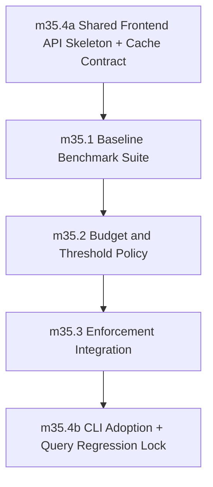

# Phase 35: Performance Benchmarking, Shared Analysis Query Architecture, and Budgets

status: completed

## Objective
Establish compiler-focused performance budgets for `check`, `build`, and local edit loops, and create the canonical reusable frontend analysis/query architecture consumed by the CLI and future tooling.

Phase 35 is complete only when compiler performance is measured through checked-in, reproducible benchmarks; regressions are blocked by local-first gates with explicit waiver governance; and parse/lower/type-check/diagnostic ownership lives behind one shared query API with deterministic module-level cache invalidation.

## Source Of Truth

This file is the authoritative contract for Phase 35 until implementation creates supporting docs. Implementation PRs may add `internal_docs/performance_budgets.md`, `internal_docs/syntax_architecture.md`, `internal_docs/frontend_query_architecture.md`, and `internal_docs/frontend_cache_invalidation.md`, but they must not introduce behavior that conflicts with this phase file unless a reviewed PR updates this file first.

`internal_docs/tooling_reuse_strategy.md` is the reviewed planning input for Phase 36's ty/Ruff reuse decisions. Phase 35 must leave syntax/frontend/diagnostics boundaries compatible with that strategy.

## Depends On

- Phase 34 (`generated_code_quality_and_production_readiness`)
- Phase 27 runtime-safety and diagnostics invariants remain green.
- The Sifr Ruff fork remains the canonical parser/AST/trivia/source-span substrate. Phase 35 wraps it for Sifr-owned compiler use; it must not adopt Ruff Server, ty, Pyright, or Python semantics as Sifr's semantic authority.
- The Sifr Ruff fork update/rebase policy is defined before Phase 35 exits. Upstream Ruff version bumps must be reviewed, validated against the `sifr_syntax` API surface, verified against all Phase 35 `sifr_syntax` fixtures and Phase 36 syntax-asset drift checks, and documented with the new upstream version/hash and migration rationale. Fork updates that change parser behavior, AST shape, trivia semantics, or token classification must trigger full Phase 35/36 syntax/tooling revalidation before the fork update merges. Automated checks must fail when the fork dependency pin advances without corresponding fixture revalidation evidence.
- Existing frontend logic under `crates/sifr_driver/src/frontend/` and project discovery/build orchestration remain the migration source, not an alternate long-term frontend API.
- Phase 19's process-local stdlib cache is existing infrastructure that must be preserved or explicitly integrated; Phase 35 must not create a second independent frontend cache with conflicting invalidation semantics.

## Feeds Into

- Phase 36 must consume the canonical Phase 35 frontend/query API for CLI/tooling parity.
- Phase 36 `milestone_36_1` enforces the no-split-brain rule by disallowing semantics reimplementation in tool-specific paths; Phase 35 provides the API and cache foundation that makes that enforcement possible.
- The split-brain guardrail mechanism created in this phase must be extendable by Phase 36 to reject Python semantic dependencies in tooling and LSP paths, including `ty_python_semantic`, `ty_project` Python project semantics, Python module-resolution semantics, and Python environment discovery.
- Phase 36 must add the editor-oriented analysis layer and native LSP adapter on top of this phase's syntax/frontend foundation.
- Later editor, automation, lint, VS Code, Neovim, Zed, Helix, and LSP surfaces must wrap the same API and must not reimplement parse/lower/type-check or semantic diagnostic derivation.

## Non-Goals And Deferrals

- Runtime performance optimization of emitted user programs.
- Binary size budgets, except where a benchmark fixture records emitted-project build latency and generated-code checks already cover buildability.
- Full persistent cross-process incremental compilation cache. Phase 35 v1 cache is process-local unless a reviewed PR updates this contract.
- A production LSP server or editor extension implementation; Phase 36 owns `sifr lsp`, editor-query parity, and VS Code extension architecture.
- New language semantics or diagnostic taxonomy redesign.
- CI-only benchmark behavior or cloud-only baseline generation.
- Fallback, migration, or legacy compatibility paths around the canonical query API.

## Architecture Ownership

The target owner for the stable Sifr-facing syntax API is `crates/sifr_syntax/`. It wraps the Ruff fork parser/AST/trivia/span crates and exposes only the syntax surface Sifr is willing to commit to. Most Sifr crates should depend on `sifr_syntax` instead of raw `sifr_python_ast` or `sifr_python_parser` once this phase exits, except for explicitly approved low-level migration shims.

`sifr_syntax` owns:

- parse entrypoints over Sifr source text
- stable source maps, file ids, text ranges, and byte/line/column conversion
- Sifr parameter-convention syntax mapping (borrow-by-default plus explicit `mut`, `own`, and `own mut`) from the Ruff fork AST into Sifr-owned syntax types
- token/trivia access needed by diagnostics, future formatters, syntax highlighting, and editor semantic-token alignment
- parser diagnostic category mapping before semantic lowering

`sifr_syntax` must not own:

- name resolution
- type checking
- ownership/move/borrow semantics
- `Result`/`Option` exhaustiveness semantics
- completion, hover, definition, references, or code action semantics
- codegen decisions

The target owner for the canonical frontend API is `crates/sifr_frontend/`. Phase 35 may create this crate or, if crate creation is intentionally deferred inside the phase, must first expose the same public contract from a clearly named `sifr_driver::frontend_query` facade and then migrate it to `sifr_frontend` before phase exit. Phase exit requires `sifr_frontend` as the consumer-facing crate.

`sifr_frontend` owns:

- project/context loading for one compilation unit or project root
- module graph identity and deterministic traversal order
- parse, lower, type-check, canonical diagnostics, warnings, and notes
- per-module and whole-project query result access
- process-local query cache keys, invalidation, and consistency guarantees

`sifr_driver` owns:

- CLI command orchestration
- build/run/test artifact creation
- rustc/cargo invocation
- stdlib bootstrap/cache plumbing
- routing CLI modes through `sifr_frontend` without reimplementing frontend semantics

`sifr_lowering` continues to own HIR data structures, lowering internals, type checking internals, ownership analysis, and semantic diagnostics. Phase 35 must not move CLI-specific policy into `sifr_lowering`.

`sifr_analysis` or `sifr_ide` is not implemented in Phase 35, but Phase 35 must leave an explicit extension boundary for it. Editor-oriented queries such as completion, hover, go-to-definition, references, document symbols, semantic tokens, and inlay hints belong above `sifr_frontend` and below `sifr_lsp`. They must consume `sifr_frontend` query results and approved HIR views; LSP handlers must not reach into `sifr_lowering` directly for semantic answers.

## Frontend Migration Path

Phase 35 migrates from today's `sifr_driver/src/frontend/` functions to crate-owned syntax and frontend APIs without behavior drift:

1. Create `crates/sifr_syntax/` as the stable wrapper around the Ruff fork parser/AST/trivia/span surface.
2. Create `crates/sifr_frontend/` with `FrontendContext`, `ModuleId`, `ModuleGraphView`, `QueryResult`, and diagnostics/query methods extracted from `sifr_driver/src/frontend/api.rs`, `module_lowering.rs`, and project frontend helpers.
3. During migration, `sifr_driver` may temporarily re-export or wrap `sifr_frontend` so callers can move incrementally, but the temporary facade must not own independent semantics.
4. Update `sifr_driver` CLI/project/test flows to call `sifr_frontend` directly.
5. Remove temporary `sifr_driver::frontend_query` shims and document any remaining raw `sifr_python_ast`/`sifr_python_parser` dependencies with owner and removal criteria.
6. Add a split-brain guardrail in `scripts/run_all_tests.sh --profile create-pr` that fails on new parser/lowering/type-check/semantic diagnostic entrypoints outside `sifr_syntax`, `sifr_frontend`, and approved `sifr_lowering` internals. The guardrail must be structured so Phase 36 can extend it to tooling dependency checks without rewriting the core mechanism.

## Shared Frontend API Contract

Phase 35 must define and implement the minimum API below. Names may change during implementation only if the final reviewed API preserves the same capability, ownership boundary, and deterministic behavior.

```rust
// Target crate: sifr_frontend

pub struct FrontendContext {
    pub fn load_single_file(input: FrontendInput) -> Result<Self, Vec<RenderedDiagnostic>>;
    pub fn load_project(root: ProjectRoot) -> Result<Self, Vec<RenderedDiagnostic>>;
    pub fn update_module_source(
        &mut self,
        module: ModuleId,
        source: SourceText,
        document_version: Option<DocumentVersion>,
    ) -> Result<InvalidationReport, Vec<RenderedDiagnostic>>;

    pub fn module_graph(&self) -> ModuleGraphView<'_>;
    pub fn source_map(&self) -> SourceMapView<'_>;
    pub fn parse_module(&mut self, module: ModuleId) -> QueryResult<ParsedModuleView<'_>>;
    pub fn lower_module(&mut self, module: ModuleId) -> QueryResult<LoweredModuleView<'_>>;
    pub fn type_check_module(&mut self, module: ModuleId) -> QueryResult<ModuleDiagnostics<'_>>;
    pub fn diagnostics_for_module(&mut self, module: ModuleId) -> QueryResult<ModuleDiagnostics<'_>>;
    pub fn diagnostics_for_project(&mut self) -> QueryResult<ProjectDiagnostics<'_>>;
    pub fn analysis_for_module(&mut self, module: ModuleId) -> QueryResult<ModuleAnalysisView<'_>>;
    pub fn analysis_for_project(&mut self) -> QueryResult<ProjectAnalysisView<'_>>;
}

pub struct FrontendInput {
    pub path: SourcePath,
    pub source: SourceText,
    pub mode: FrontendMode,
}

pub enum FrontendMode {
    SingleFile,
    ProjectEntrypoint,
}

pub struct ProjectRoot {
    pub root: SourcePath,
    pub entrypoint: SourcePath,
}

pub struct ModuleGraphView<'a> {
    pub modules: &'a [ModuleGraphNode],
    pub edges: &'a [ModuleGraphEdge],
    pub entrypoint: ModuleId,
    pub revision: GraphRevision,
}

pub struct ModuleGraphNode {
    pub id: ModuleId,
    pub file: FileId,
    pub canonical_path: SourcePath,
    pub source_hash: SourceHash,
}

pub struct SourceMapView<'a> {
    pub files: &'a [SourceFileView],
    pub revision: SourceRevision,
}

impl<'a> SourceMapView<'a> {
    pub fn text_position_to_span(
        &self,
        file: FileId,
        position: TextPosition,
        encoding: PositionEncoding,
    ) -> Option<SourceSpan>;

    pub fn span_to_text_range(
        &self,
        span: SourceSpan,
        encoding: PositionEncoding,
    ) -> Option<TextRange>;
}

pub struct SourceFileView {
    pub id: FileId,
    pub canonical_path: SourcePath,
    pub uri: Option<SourceUri>,
    pub source_hash: SourceHash,
    pub document_version: Option<DocumentVersion>,
}

pub enum PositionEncoding {
    UTF8,
    UTF16,
    UTF32,
}

pub struct ModuleGraphEdge {
    pub importer: ModuleId,
    pub imported: ModuleId,
}

pub struct InvalidationReport {
    pub previous_revision: GraphRevision,
    pub next_revision: GraphRevision,
    pub invalidated_modules: Vec<ModuleId>,
    pub invalidated_queries: Vec<QueryKind>,
    pub updated_documents: Vec<UpdatedDocumentInfo>,
}

pub struct UpdatedDocumentInfo {
    pub file: FileId,
    pub old_version: Option<DocumentVersion>,
    pub new_version: Option<DocumentVersion>,
    pub text_changed: bool,
}

pub enum QueryKind {
    Parse,
    Lower,
    TypeCheck,
    ModuleDiagnostics,
    ProjectDiagnostics,
    ModuleAnalysis,
    ProjectAnalysis,
}
```

API invariants:

- `ModuleId`, graph traversal, diagnostics, and query result ordering are deterministic for identical inputs.
- `FileId`, `ModuleId`, and `DefId` identities are stable within one `FrontendContext` revision and never reused for a different canonical file/module/definition inside the same long-running session.
- `QueryResult<T>` must be a typed result wrapper whose success value can expose cache-hit/cache-miss metadata without changing semantic output, and whose error variants represent frontend-internal query failures rather than user diagnostics. User diagnostics remain `RenderedDiagnostic` payloads returned by diagnostics queries.
- `diagnostics_for_*` returns canonical `RenderedDiagnostic` values before presentation rendering. `human`, `json`, and `compact` are renderer views only.
- Query failures are typed diagnostics or typed internal errors. User input must not trigger panics.
- CLI modes (`check`, `build`, `run`, `emit`, and project/test frontend paths) must consume this API before phase exit.
- Future tooling may add analysis and transport wrappers, but no consumer may derive semantic diagnostics by bypassing this API.
- LSP document-sync consumers must treat `InvalidationReport` as authoritative: every invalidated module/query is stale until recomputed through `sifr_frontend`.

## Editor Analysis Boundary For Phase 36

Phase 35 does not implement editor features, but it must expose enough stable data for Phase 36 to build them without bypassing compiler semantics.

Required Phase 35 exports for Phase 36:

- source maps with URI/path, document version, and byte/line/column conversion
- module graph nodes/edges with deterministic ids and revisions
- per-module parsed syntax views from `sifr_syntax`
- per-module lowered HIR views or approved read-only handles
- canonical diagnostics before renderer/protocol conversion
- stable symbol/definition ids, symbol kinds, declaration spans, definition spans, and reference-bearing HIR handles where already available from HIR, or a documented compiler gap that Phase 36 must close before references/rename implementation begins
- type-display views for inferred expression types, callable signatures, generic parameters, ownership/mutability facts, and symbol documentation hooks where available
- import/module resolution views sufficient for current-workspace completion, auto-import suggestions, workspace symbols, definition, references, and rename
- token/trivia/comment access sufficient for a production formatter, syntax-asset drift checks, folding ranges, selection ranges, document symbols, semantic tokens, and doc extraction
- checked-in `sifr_syntax` tokenization fixtures for representative corpus entries. These fixtures are the authoritative source of truth for generated or validated syntax assets, including TextMate grammar, Tree-sitter grammar/query assets, VS Code grammar contribution, and non-VS Code editor highlighting assets. Phase 36 editor integrations must use grammars generated from or validated against these fixtures; manually authored grammar rules without drift validation against `sifr_syntax` fixtures are forbidden.
- syntax-ancestry views for nested selection range expansion without requiring the LSP layer to traverse raw Ruff AST internals directly
- type-relation views for prepare-type-hierarchy, supertypes, and subtypes when Sifr has class/trait/interface-style relationships; if the language model has no meaningful hierarchy for a symbol, Phase 36 must return an empty/unsupported query result through `sifr_analysis` rather than approximating Python hierarchy semantics
- diagnostic ids, rule metadata hooks, structured suggestions, related spans, docs URLs, and fix applicability before renderer/protocol conversion
- codegen/source-map handoff data sufficient for Phase 36 generated-Rust preview without reimplementing lowering or codegen in tooling crates
- test discovery handoff data when CLI test-runner metadata exists, or a documented gap that Phase 36 must close before editor test commands are marked complete
- invalidation reports that identify stale modules and query classes after document changes

Additional production tooling views required for Phase 36:

```rust
pub struct TypeDisplayView<'a> {
    pub display: &'a str,
    pub qualified_display: &'a str,
    pub ownership: Option<OwnershipDisplay>,
    pub mutability: Option<MutabilityDisplay>,
}

pub struct SignatureView<'a> {
    pub callable: DefId,
    pub parameters: &'a [ParameterView<'a>],
    pub return_type: Option<TypeDisplayView<'a>>,
    pub docs: Option<&'a str>,
}

pub struct ParameterView<'a> {
    pub name: &'a str,
    pub type_display: TypeDisplayView<'a>,
    pub has_default: bool,
    pub convention: Option<ParamConventionView>,
}

pub struct SignatureHelpConfig {
    pub trigger_characters: Vec<char>,
    pub retrigger_characters: Vec<char>,
}

pub struct SemanticTokenLegend {
    pub token_types: Vec<SifrSemanticTokenType>,
    pub token_modifiers: Vec<SifrSemanticTokenModifier>,
}

pub enum SifrSemanticTokenType {
    Keyword,
    Type,
    Function,
    Method,
    Variable,
    Parameter,
    Property,
    Module,
    Comment,
    String,
    Number,
    Operator,
    Attribute,
    Mutable,
    Ownership,
    Deprecated,
    Unsafe,
}

pub enum SifrSemanticTokenModifier {
    Declaration,
    Definition,
    Reference,
    Mutability,
    Ownership,
    Static,
    Abstract,
    Async,
    ReadOnly,
    Deprecated,
    Modification,
    Documentation,
}

pub struct SymbolTableView<'a> {
    pub revision: SymbolRevision,
    pub definitions: &'a [SymbolDefinitionView<'a>],
    pub uses: &'a [SymbolUseView],
}

pub struct SymbolDefinitionView<'a> {
    pub id: DefId,
    pub name: &'a str,
    pub kind: SymbolKind,
    pub declaration_span: Option<SourceSpan>,
    pub definition_span: SourceSpan,
    pub module: ModuleId,
}

pub struct SymbolUseView {
    pub target: DefId,
    pub span: SourceSpan,
    pub module: ModuleId,
    pub is_definition_site: bool,
}

pub struct SelectionRangeView {
    pub ranges_outer_to_inner: Vec<SourceSpan>,
}

pub struct TypeHierarchyItemView<'a> {
    pub id: DefId,
    pub name: &'a str,
    pub detail: Option<&'a str>,
    pub definition_span: SourceSpan,
    pub selection_span: SourceSpan,
    pub module: ModuleId,
}

pub trait TypeHierarchyQuery {
    fn prepare_type_hierarchy(
        &mut self,
        file: FileId,
        position: TextPosition,
    ) -> QueryResult<Option<TypeHierarchyItemView<'_>>>;

    fn type_hierarchy_supertypes(
        &mut self,
        item: DefId,
    ) -> QueryResult<Vec<TypeHierarchyItemView<'_>>>;

    fn type_hierarchy_subtypes(
        &mut self,
        item: DefId,
    ) -> QueryResult<Vec<TypeHierarchyItemView<'_>>>;
}

pub trait CodegenPreviewQuery {
    fn generated_rust_for_span(
        &mut self,
        file: FileId,
        span: SourceSpan,
    ) -> QueryResult<GeneratedRustPreviewView>;

    fn generated_rust_for_module(
        &mut self,
        module: ModuleId,
    ) -> QueryResult<GeneratedRustPreviewView>;
}
```

The exact Rust names may change during implementation, but the final Phase 35 API must preserve the capability: Phase 36 must be able to render type/signature information, query all use sites for a symbol, perform current-workspace references and rename, expand syntax-aware selection ranges, answer type-hierarchy requests where Sifr semantics support them, and request generated Rust for a source span or module through compiler/codegen-owned paths.

Phase 36 must define `sifr_analysis` or `sifr_ide` as the only editor-query owner. Phase 35 must not add editor semantics directly to `sifr_lsp` or VS Code integration.

Phase 35 exit is incomplete if any Phase 36 production feature would require `sifr_lsp`, editor extensions, formatter/linter modules, or automation adapters to parse raw Ruff ASTs directly, traverse mutable HIR internals directly, run codegen independently, or derive diagnostics outside `sifr_frontend`/`sifr_diagnostics`.

## Source Map And Session Model

`FrontendContext` owns a process-local source map for one CLI invocation or one long-running tooling session. The source map is distinct from the query cache: updating source text advances `SourceRevision`, may advance `GraphRevision`, and invalidates affected queries, but it does not require rebuilding unrelated file identity.

`SourceFileView.uri` is optional because CLI/project dependency files may be path-only. For any file opened by a tooling session, `uri` must be `Some`; `None` is valid only for project dependencies that have not been opened by an editor client.

Concurrency model for Phase 35:

- `FrontendContext::update_module_source` takes `&mut self`; concurrent document changes are serialized by the caller.
- Long-running adapters such as `sifr lsp` must queue document updates and query requests so no query observes a partially applied edit.
- If cancellation lands before Phase 36, cancellation may abort recomputation but must not publish partial query results or corrupt cache state.
- Phase 35 does not need to expose live mutable frontend state to concurrent tooling. Phase 36 must implement an explicit snapshot discipline over `FrontendContext`/`AnalysisHost` for background LSP work. A snapshot must carry the source revision, graph revision, document versions, source text/source-map view, and query entrypoint used by one request; if a document update supersedes the snapshot, the LSP layer must return a deterministic cancellation/content-modified response or ignore the stale result. Stale snapshots must never publish diagnostics, edits, or navigation targets.

## Canonical Cache And Invalidation Rules

Phase 35 v1 query caching is process-local and module-granular.

Cache key components:

- compiler binary fingerprint
- relevant Cargo.lock/toolchain fingerprint for frontend dependencies
- frontend mode (`SingleFile` or `ProjectEntrypoint`)
- source map revision
- LSP/document version when present for open editor buffers
- canonical source path
- source content hash
- parser/lowering/type-check configuration hash
- dependency graph revision for queries that depend on imports
- stdlib interface fingerprint for queries that depend on stdlib symbols

Invalidation algorithm:

1. Canonicalize the updated path and compute the new source hash.
2. If the path is unknown, load it as a new module, rebuild the deterministic import graph, and invalidate project-level queries.
3. If the source hash is unchanged, preserve all query entries and emit an empty `InvalidationReport`.
4. If the source hash changed, invalidate parse/lower/type-check/diagnostic/analysis entries for that module.
5. Recompute imports for the changed module. If its import set changed, rebuild the graph revision and invalidate all downstream dependents in deterministic topological order.
6. If exported symbols, public type facts, or semantic diagnostic facts for the module changed, invalidate downstream type-check, diagnostics, and analysis entries.
7. Project-level diagnostics and project-level analysis are invalidated whenever any member module's parse/lower/type-check/diagnostic state changes.
8. Stdlib cache invalidation uses the same compiler/toolchain/interface fingerprint. Existing Phase 19 stdlib cache reuse may remain process-local, but it must be visible to the frontend query cache as an input fingerprint, not an independent hidden correctness dependency.

Consistency guarantees:

- A cache hit must be equivalent to recomputing the same query from the same source set, compiler fingerprint, frontend configuration, and dependency graph revision.
- Stale query results are never acceptable after `update_module_source` returns.
- Failed queries may be cached only when the cache key includes the input and dependency state that produced the failure.
- Cross-process cache sharing is out of scope for v1. Any future persistent cache must preserve the same key and invalidation semantics or update this phase contract through review.

## Verification Infrastructure

Phase 35 creates and owns `verification/performance/`.

Required files:

- `verification/performance/manifest.json` - version-controlled source of truth for benchmark cases, groups, commands, expected mode, and evidence category.
- `verification/performance/baselines.json` - checked-in baseline measurements and metadata produced by the approved baseline workflow.
- `verification/performance/budgets.json` - budget thresholds derived from baselines.
- `verification/performance/waivers.json` - active waiver registry with owner, issue link, rationale, affected benchmark ids, override, and expiry.
- `verification/performance/run_benchmarks.py` - local benchmark runner that emits machine-readable results under `target/performance/`.
- `verification/performance/check_budgets.py` - compares benchmark results to budgets and validates waivers.
- `verification/performance/lsp_query_budget_ids.md` - reserved Phase 36 LSP-query budget ids and naming rules so Phase 36 adds protocol benchmarks without inventing incompatible budget identifiers.
- `verification/performance/check_frontend_cache_contract.py` - focused contract checks for cache invalidation, stale-result rejection, deterministic graph revision behavior, and query ordering.
- `verification/performance/check_split_brain_guardrail.py` - rejects new parser/lowering/type-check/semantic diagnostic entrypoints outside approved syntax/frontend/HIR boundaries.
- `verification/performance/check_ruff_fork_update_contract.py` - rejects Sifr Ruff fork dependency-pin/version/hash updates without reviewed `sifr_syntax` fixture revalidation evidence and recorded migration rationale.
- `verification/performance/sifr_syntax_token_fixtures/` - checked-in representative token/trivia fixtures produced through `sifr_syntax` and consumed by Phase 36 syntax-asset drift checks.
- `verification/performance/negative_seeds/` - seed inputs or result fixtures proving budget and waiver gates fail when expected.

Negative seeds include JSON fixtures consumed by `check_budgets.py` that inject known-regression benchmark results and malformed waiver/budget states to verify gate failure behavior.

Benchmark harnesses may use Rust `criterion` where statistical microbenchmarks are appropriate, but the phase must provide script-level runners because CLI latency, `cargo build`, and local edit-loop timings need whole-command measurement. All benchmark and budget scripts must be deterministic, local-first, and usable both directly and through `scripts/run_all_tests.sh`.

## Benchmark Corpus Contract

`verification/performance/manifest.json` must include these groups:

1. `check-single-file`: representative single-file `cargo run -q -p sifr -- check <file>` fixtures.
2. `check-project`: project-mode fixtures with imports, workspace discovery, local modules, and stdlib imports.
3. `build-single-file`: representative `build` latency fixtures that include generated-code quality corpus overlap.
4. `build-project`: multi-module project builds that exercise dependency ordering and generated transient cargo work.
5. `incremental-local-loop`: edit-loop scenarios using `FrontendContext::update_module_source` for unchanged file, leaf module change, imported module change, public API change, and parse/type-check failure recovery.
6. `interactive-tooling-foundation`: in-process frontend workloads needed by future LSP/editor use, including cold context load, warm diagnostics query, unchanged-file update, changed-file invalidation, and source-map position lookup.
7. `phase27-non-regression`: compact fixtures proving diagnostics, renderer, exit-code, recovery-limit, and panic-free contracts remain green while the benchmark/query infrastructure runs.

Phase 36 extends this taxonomy with protocol-level `lsp-query` cases once `sifr lsp` exists. Phase 35 must reserve compatible budget ids for LSP cold-start, completion, hover, definition, semantic-token, and document-sync latency in `verification/performance/lsp_query_budget_ids.md` so Phase 36 does not retrofit performance policy after the server is built.

Minimum corpus thresholds at phase exit:

- at least 10 `check-single-file` cases
- at least 5 `check-project` cases
- at least 10 `build-single-file` cases
- at least 5 `build-project` cases
- at least 5 `incremental-local-loop` cases
- at least 5 `interactive-tooling-foundation` cases
- at least 3 negative budget/waiver seeds

The corpus must reuse representative Phase 34 generated-code-quality entries where possible (for example, entries from `verification/generated_code_quality/manifest.json`) so quality and performance gates do not drift onto unrelated fixture sets. Every benchmark case has a stable id, source path or project root, command or query scenario, warmup count, measured count, timeout, budget id, and evidence category.

## Measurement Protocol

Baseline measurements:

- run on a clean worktree after Phase 34 gates pass
- record host OS, architecture, Rust toolchain, compiler binary fingerprint, Cargo.lock hash, and runner version
- use one cold run for setup evidence and at least five warm measured samples for each command-level benchmark
- use at least twenty measured iterations for in-process query/cache scenarios
- discard explicit warmup samples that were run only to prepare caches or stabilize the process; warm measured samples remain part of the reported dataset
- report median, p95, median absolute deviation, coefficient of variation, peak RSS where available, cache hit/miss counts, and timeout status
- fail baseline capture if coefficient of variation exceeds the configured stability limit for a case; the default limit is `0.10` unless `verification/performance/budgets.json` records a stricter case-specific value with rationale

Budget derivation:

- default latency budget: `max(baseline_median * 1.10, baseline_median + 25ms)` for command-level checks
- default p95 budget: `max(baseline_p95 * 1.15, baseline_p95 + 50ms)`
- default peak RSS budget: `max(baseline_peak_rss * 1.10, baseline_peak_rss + 32MiB)`
- local edit-loop unchanged-file queries must have a stricter no-regression policy derived from baseline and must prove cache hit behavior
- any benchmark-specific threshold that differs from defaults must be recorded in `verification/performance/budgets.json` with rationale

Budget enforcement must compare against checked-in baselines and budgets, not against moving CI history. CI may publish trend artifacts, but trend history is advisory only unless a reviewed phase update makes it authoritative.

## Waiver Policy

Waivers are explicit, time-bounded, owner-assigned, and issue-linked entries in `verification/performance/waivers.json`.

Each waiver must include:

- `id`
- `owner`
- `issue`
- `created`
- `expires`
- `benchmark_ids`
- `budget_ids`
- `override`
- `rationale`
- `removal_criteria`

`verification/performance/check_budgets.py` must reject:

- expired waivers
- waivers without linked issues
- waivers without owners
- waivers that apply to unknown benchmark or budget ids
- waivers that mask correctness, diagnostics, cache-consistency, or panic-safety failures

Waivers may permit a measured performance regression to pass temporarily. They may not permit stale analysis results, split-brain semantics, data-dependent panics, diagnostic schema drift, renderer divergence, or exit-code contract regressions.

LSP-query budget waivers follow the same policy as CLI benchmark waivers. Phase 36 adds `lsp-query` budget ids to `verification/performance/budgets.json`, and `check_budgets.py` must enforce them under the same owner, issue, expiry, override, and correctness-non-waiver rules.

## Milestone Sequencing

Implementation must execute the milestones in order unless a later reviewed PR updates this file with rationale.



`milestone_35_4` is listed as one milestone for roadmap continuity, but implementation must split it into an early API/cache-contract slice before benchmarking and a final CLI-adoption/regression-lock slice after enforcement. Benchmarks must measure the canonical frontend path, not ad hoc compiler paths.

## Milestones

### milestone_35_4a: Shared Frontend API Skeleton and Cache Contract
- Scope:
  - Before implementation, audit `crates/sifr_driver/src/frontend/` and adjacent project frontend helpers to confirm the extraction surface is mechanically clean. If coupling to driver-local build/artifact state is tighter than planned, split this milestone into reviewed `m35.4a-1` (`sifr_syntax`) and `m35.4a-2` (`sifr_frontend`) slices before editing behavior.
  - Create `crates/sifr_syntax/` as the Sifr-owned wrapper around the Ruff fork parser/AST/trivia/span substrate.
  - Create `crates/sifr_frontend/` with the API surface described in this file, or create the temporary `sifr_driver::frontend_query` facade only as an internal stepping stone that is removed before phase exit.
  - Move or wrap existing `sifr_driver/src/frontend/` parse/lower/type-check/diagnostics entrypoints behind the canonical context/query model.
  - Define `FileId`, `ModuleId`, `ModuleGraphView`, `SourceMapView`, `FrontendContext`, query result wrappers, and deterministic graph ordering.
  - Implement process-local module-level query cache keys and invalidation reports.
  - Integrate Phase 19 stdlib cache fingerprinting so stdlib reuse is an explicit query input.
  - Add representative `sifr_syntax` token/trivia fixtures and the Sifr Ruff fork update/rebase contract check.
  - Add the split-brain guardrail script and wire it into the create-pr validation lane.
- Definition of done:
  - `sifr_syntax` compiles and wraps parse/source-map/token/trivia surfaces without owning semantics.
  - The frontend API compiles and has unit tests for single-file load, project load, parse, lower, type-check, diagnostics, graph inspection, source-map inspection, and per-module/project analysis queries.
  - Cache invalidation tests cover unchanged source, leaf edit, imported-module edit, public API edit, removed import, added import, parse failure recovery, and type-check failure recovery.
  - Token/trivia fixtures exist for representative syntax corpus entries and the fork update contract check fails on a seeded fork pin update without fixture revalidation evidence.
  - Repeated identical queries prove deterministic module graph and diagnostic ordering.
  - The split-brain guardrail fails on seeded new parse/lower/type-check/semantic diagnostic entrypoints outside approved boundaries.
  - No CLI mode has been allowed to create a new semantics-bearing path outside this API.

### milestone_35_1: Baseline Benchmark Suite
- Scope:
  - Add `verification/performance/manifest.json`.
  - Add `verification/performance/run_benchmarks.py`.
  - Define benchmark suites for `check`, `build`, and incremental local loops using the corpus groups and measurement protocol in this file.
  - Capture initial `verification/performance/baselines.json` from the canonical benchmark runner.
  - Reuse representative Phase 34 generated-code-quality fixtures where possible.
  - Include `interactive-tooling-foundation` cases and reserve protocol-level `lsp-query` budget ids for Phase 36.
- Definition of done:
  - Baselines are versioned, reproducible locally, and include host/toolchain/compiler metadata.
  - The benchmark runner emits stable JSON under `target/performance/`.
  - Positive validation proves representative benchmarks run and produce required metrics.
  - Negative validation proves malformed manifest entries, missing benchmark inputs, timeout results, and unstable high-variance baselines fail with actionable diagnostics.

### milestone_35_2: Budget and Threshold Policy
- Scope:
  - Add `verification/performance/budgets.json`.
  - Add `verification/performance/waivers.json`.
  - Add `verification/performance/check_budgets.py`.
  - Encode default median, p95, peak RSS, edit-loop cache-hit, and timeout budget rules from this file.
  - Document the policy in `internal_docs/performance_budgets.md`.
- Definition of done:
  - Performance budget policy is documented and testable.
  - `check_budgets.py` accepts clean benchmark output and rejects seeded median, p95, RSS, timeout, missing-result, unknown-id, and malformed-result regressions.
  - Waiver validation accepts only active, owner-assigned, issue-linked waivers and rejects expired or malformed waivers.
  - Waivers cannot suppress cache-correctness, diagnostics, runtime-safety, or split-brain failures.

### milestone_35_3: Enforcement Integration
- Scope:
  - Add a clearly named "Performance Budget Checks" step to `scripts/run_all_tests.sh`.
  - Wire budget checks into `scripts/run_all_tests.sh --profile merge`.
  - Keep `create-pr` fast by running manifest/schema/negative-seed budget checks and a minimal representative query-cache scenario rather than the full benchmark corpus.
  - Add optional `nightly` or `release` coverage for broader benchmark sampling if the existing validation lane policy supports it.
  - Ensure local and CI commands are the same; CI-only performance behavior is forbidden.
- Definition of done:
  - Regressions fail local gates unless a valid waiver exists.
  - `scripts/run_all_tests.sh --profile create-pr` exercises budget schema, waiver schema, negative seeds, and minimal cache-contract checks.
  - `scripts/run_all_tests.sh --profile merge` runs the authoritative budget gate on the required benchmark corpus or a reviewed deterministic representative subset whose full-corpus counterpart is separately documented.
  - Failure output points to benchmark id, budget id, measured value, threshold, and waiver status.

### milestone_35_4b: CLI Adoption and Query Regression Lock
- Scope:
  - Make compiler CLI modes consume the `sifr_frontend` analysis/query ownership model for `check`, `build`, `run`, `emit`, project compilation, and test-runner frontend flows.
  - Remove temporary duplicate frontend semantics from `sifr_driver`.
  - Add `verification/performance/check_frontend_cache_contract.py` and Rust tests proving no split-brain frontend path remains.
  - Add a reviewed split-brain guardrail. Prefer a code-level constraint when practical; otherwise use a focused script-level guardrail that fails on new parser/lowering/type-check/semantic diagnostic entrypoints outside `sifr_frontend` and approved `sifr_lowering` internals.
  - Document final architecture in `internal_docs/frontend_query_architecture.md` and `internal_docs/frontend_cache_invalidation.md`.
  - Document final syntax wrapper architecture in `internal_docs/syntax_architecture.md`.
- Definition of done:
  - Shared analysis/query design and cache contracts are explicit, deterministic, and regression-covered.
  - The anti-split-brain foundation is in place before standalone tooling surfaces begin.
  - The minimum API surface is documented clearly enough that Phase 36 can consume it without inventing new semantics-bearing entrypoints.
  - CLI mode parity tests prove equivalent diagnostics and exit outcomes before and after routing through `sifr_frontend`.
  - Static or scripted guardrails catch new parse/lower/type-check/semantic diagnostic paths added outside `sifr_frontend` or approved HIR internals.

## Quality Contract

### Entry criteria
- Phase 34 exit gate is satisfied.
- Phase 34 generated-code quality gates are enforced in `scripts/run_all_tests.sh --profile merge`.
- Phase 27 non-regression baseline is required at phase start and must remain green through completion.
- Phase 27 non-regression invariants that must hold in this phase include: no user-triggerable panic paths; no data-dependent emitted `.unwrap()` / `.expect()` / `panic!` in user runtime paths; stable diagnostic contract (codes, severity, spans, URLs, suggestions, schema); canonical/lossless `json` diagnostics with `human` and `compact` as renderer views only; enforced recovery limits with deterministic ordering; and enforced exit-code and CLI stability contracts (`0/1/2/3`, and unknown `--diagnostic-format` exits `2` before semantic work).
- Any milestone that regresses these invariants is incomplete, even if its local scope passes.

### Milestone quality checks
- Local validation gates pass for each milestone before merge:
  - `scripts/run_all_tests.sh --profile create-pr`
  - milestone-specific `verification/performance/*.py` checks added by the milestone
- The authoritative pre-PR gate passes before phase-closing PRs:
  - `scripts/run_all_tests.sh --profile merge`
- No benchmark, budget, waiver, or cache contract uses CI-only behavior.
- No stale query result may be returned after source update.
- No semantic diagnostics may be generated outside `sifr_frontend` plus approved `sifr_lowering` internals.
- Raw Ruff fork parser/AST dependencies outside `sifr_syntax`, `sifr_frontend`, and approved `sifr_lowering` migration paths require documented owner and removal criteria.
- No fallback, migration, or legacy compatibility code is allowed; implement the canonical architecture directly with clean code only.
- No lazy or partial fixes are allowed; each milestone must resolve root causes completely, even when that requires significant rework.
- All implementations must be production-grade compiler code: strict typing, deterministic behavior, explicit invariants, and unforgiving correctness standards, with architecture cleaned up toward the target design.
- Validation evidence must be recorded in the phase execution checklist issue before merge.
- Validation evidence for every milestone must include at least one positive-path case and one negative-path case mapped to the milestone validation planning goals.

### Validation planning goals
- `milestone_35_4a`:
  - Positive: parse through `sifr_syntax`, load a single file and a project, query parse/lower/type-check/diagnostics/analysis, inspect source maps, and get deterministic graph/query ordering across repeated runs.
  - Negative: changed source invalidates affected module queries, public API edits invalidate dependents, removed imports update the graph, failed parse/type-check states do not poison later successful queries, stale cache hits are rejected, and seeded split-brain entrypoints fail the guardrail.
- `milestone_35_1`:
  - Positive: benchmark runner executes representative `check`, `build`, incremental query, and interactive-tooling-foundation scenarios and writes complete JSON metrics.
  - Negative: malformed manifest entries, missing input paths, missing metric fields, timeout results, and unstable high-variance samples fail baseline capture.
- `milestone_35_2`:
  - Positive: clean benchmark output within median, p95, RSS, timeout, and cache-hit budgets passes.
  - Negative: seeded median regression, p95 regression, RSS regression, timeout, missing result, unknown budget id, expired waiver, malformed waiver, and attempted correctness waiver fail.
- `milestone_35_3`:
  - Positive: `scripts/run_all_tests.sh --profile create-pr` and `scripts/run_all_tests.sh --profile merge` invoke the expected performance checks for their lanes.
  - Negative: injected regression seed fails the gate locally with benchmark id, threshold, measured value, and waiver status in output.
- `milestone_35_4b`:
  - Positive: CLI `check`, `build`, `run`, `emit`, project build/check, and test-runner frontend flows consume `sifr_frontend` and preserve diagnostics/exit behavior.
  - Negative: a guardrail detects a new semantics-bearing parse/lower/type-check path outside `sifr_frontend`; CLI/tooling parity tests fail on diagnostic divergence; cache contract tests fail on stale dependent results.
- Exit-gate evidence explicitly demonstrates: performance regressions are systematically detected and controlled, and the canonical shared analysis/query foundation is established.

### CI Integration

Performance budget checks must run in `scripts/run_all_tests.sh --profile merge` under a clearly named "Performance Budget Checks" step. Local validation and CI use the same commands. CI-only performance behavior is not allowed.

## Exit criteria

- All milestone DoDs are satisfied.
- `crates/sifr_frontend/` exists and owns the canonical frontend query API.
- `crates/sifr_syntax/` exists and owns the Sifr-facing Ruff fork syntax wrapper.
- CLI frontend flows consume `sifr_frontend` without duplicate semantics-bearing paths.
- `verification/performance/manifest.json` is checked in and meets corpus thresholds.
- `verification/performance/baselines.json` and `verification/performance/budgets.json` are checked in and reproducible locally.
- `verification/performance/waivers.json` is either empty or contains only active, owner-assigned, issue-linked, time-bounded waivers.
- `verification/performance/run_benchmarks.py` passes on the required corpus.
- `verification/performance/check_budgets.py` passes and fails on seeded regressions.
- `verification/performance/check_frontend_cache_contract.py` passes and fails on seeded stale-result or invalidation violations.
- `verification/performance/check_split_brain_guardrail.py` passes and fails on seeded split-brain entrypoints.
- `scripts/run_all_tests.sh --profile create-pr` passes.
- `scripts/run_all_tests.sh --profile merge` passes.
- Phase 27 non-regression contract remains green.
- Validation evidence is recorded in the phase execution checklist issue before merge.

## Exit Gate

Performance regressions are systematically detected and controlled by checked-in local-first benchmark, budget, and waiver infrastructure; the canonical `sifr_frontend` analysis/query foundation is established and consumed by CLI frontend flows; module-level query caching has deterministic invalidation and stale-result regression coverage; and Phase 27 non-regression guarantees remain green: panic-free user paths, no emitted data-dependent unwrap/expect/panic, stable diagnostics/renderer behavior, and stable exit-code behavior.
