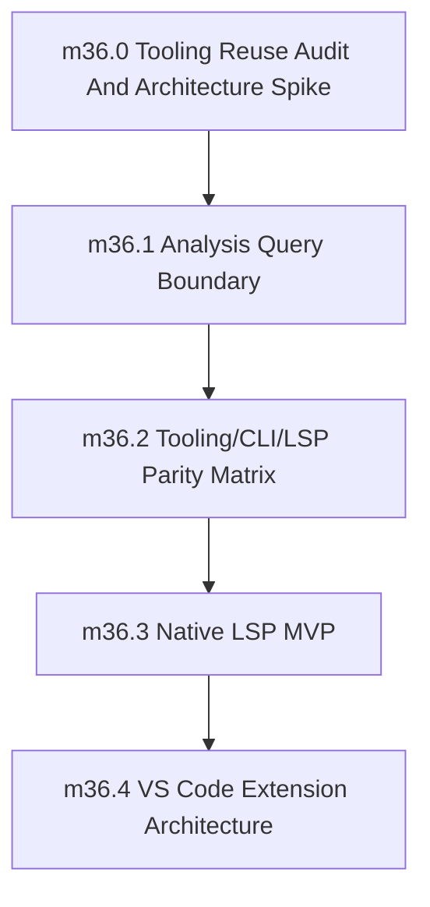

# Phase 36: Developer Tooling, Native LSP, and Ecosystem Hooks

status: planned

## Objective
Deliver the first production-grade Sifr tooling foundation: editor-oriented analysis queries, a native Rust LSP server launched through `sifr lsp`, parity gates proving tooling and CLI share the same compiler brain, and a VS Code extension architecture that delegates semantics to the language server.

Phase 36 is complete only when tooling consumers can ask Sifr for diagnostics and core editor intelligence without reimplementing parser, lowering, type-check, ownership, or diagnostic semantics.

## Source Of Truth

This file is the authoritative contract for Phase 36 until implementation creates supporting docs. Implementation PRs may add `internal_docs/tooling_reuse_strategy.md`, `internal_docs/tooling_analysis.md`, `internal_docs/lsp_server.md`, and `internal_docs/vscode_extension.md`, but they must not introduce behavior that conflicts with this phase file unless a reviewed PR updates this file first.

## Depends On

- Phase 35 is completed.
- `crates/sifr_syntax/` wraps the Sifr Ruff fork parser/AST/trivia/span substrate.
- `crates/sifr_frontend/` owns canonical parse/lower/type-check/diagnostics/project graph/query cache contracts.
- Phase 35 performance/query/cache/split-brain guardrails are enforced in local validation.
- Phase 27 runtime-safety and diagnostics invariants remain green.

## Feeds Into

- A publishable VS Code extension, whether in this repository initially or in a later `sifr-lang/sifr-vscode` repository.
- Neovim, Zed, Helix, Emacs, and other editor integrations through standard LSP plus syntax/highlighting packages.
- Future `sifr_fmt`, `sifr_lint`, code-action, rename, references, test explorer, and generated-Rust-preview work.

## Non-Goals And Deferrals

- Using Ruff Server, ty, Pyright, or Python language-server semantics as Sifr's semantic authority.
- A custom public tsserver-style protocol. The external editor protocol is LSP.
- Marketplace publication of the VS Code extension. Phase 36 defines the architecture and launch/test contract; packaging/publishing may happen in a follow-up PR or repository.
- Full workspace-wide rename, auto-import, advanced code actions, test explorer integration, and generated-Rust preview. These require the Phase 36 foundations but are not mandatory for phase exit.
- A production formatter or linter. Phase 36 may define how future formatter/linter surfaces consume `sifr_syntax` and `sifr_frontend`, but must not ship a parallel semantic implementation.
- Mature Tree-sitter distribution for every editor. Phase 36 must define syntax-highlighting strategy and source-of-truth constraints, but editor-specific grammar polish may continue later.

## Architecture Ownership

`sifr_syntax` owns syntax substrate access to the Sifr Ruff fork. It is the only approved syntax/parser/trivia/token source for Sifr tooling. Editor packages may use generated syntax assets, but those assets must be derived from or validated against `sifr_syntax`/the Sifr Ruff fork and must not become a second parser.

`sifr_frontend` owns project loading, source maps, module graph state, parse/lower/type-check/diagnostics queries, invalidation, and cache consistency.

`sifr_analysis` or `sifr_ide` owns editor-oriented semantic queries derived from `sifr_frontend` and approved HIR views:

- completion items
- hover/type display
- go-to-definition targets
- find-references data
- document symbols
- workspace symbols, if implemented in this phase
- semantic tokens
- inlay hints, if implemented in this phase
- diagnostic-to-code-action suggestions, if implemented in this phase

The final crate name must be chosen by `milestone_36_1` and used consistently. This phase document uses `sifr_analysis` as the placeholder name.

`sifr_lsp` owns only the LSP protocol adapter:

- JSON-RPC/LSP handshake and message dispatch
- document synchronization transport
- conversion between LSP positions/ranges/URIs and Sifr source maps
- conversion from `sifr_analysis` results to LSP response payloads
- cancellation and request lifecycle behavior

`sifr_lsp` must use `lsp-server` and `lsp-types` as the direct LSP protocol foundation. These crates are generic protocol/data-type dependencies, carry no Python semantics, and are already used by the Sifr Ruff fork's `ty_server`. The open reuse question for this phase is not whether to use LSP protocol crates; it is whether audited `ty_server` session, document, request-queue, cancellation, diagnostics-publication, logging, and test-shell patterns can be adapted cleanly without importing Python semantic or project assumptions.

`sifr_lsp` must not own parser logic, type checking, HIR construction, symbol-table construction, diagnostic derivation, or Sifr semantic rules.

Forbidden production dependencies for `sifr_lsp` and `sifr_analysis` include `ty_python_semantic`, Python module-resolution semantics from `ty_project`, Python environment discovery, Python diagnostic rules, and any `ruff_server`/`ty_server` path that answers semantic questions using Python rather than Sifr.

`crates/sifr` owns the CLI command surface. Phase 36 adds:

```bash
sifr lsp --stdio
```

`--stdio` is the required transport for phase exit. TCP/port transports are deferred unless a reviewed PR expands this contract.

VS Code extension ownership:

- language id: `sifr`
- file extensions: `.sifr`
- grammar/filetype registration and language configuration
- LSP launcher and settings UI
- commands that call `sifr lsp` or other Sifr CLI subcommands
- no type checker, parser, HIR traversal, or diagnostic derivation inside extension TypeScript/JavaScript

## Editor Query Contract

Phase 36 must define and implement the minimum editor query API below. Names may change during implementation only if the final reviewed API preserves the same capability and ownership boundary.

```rust
// Target crate: sifr_analysis, final name decided in milestone_36_1.

pub struct AnalysisHost {
    pub fn open_project(root: ProjectRoot) -> Result<Self, Vec<RenderedDiagnostic>>;
    pub fn open_single_file(input: FrontendInput) -> Result<Self, Vec<RenderedDiagnostic>>;
    pub fn update_document(
        &mut self,
        file: FileId,
        version: DocumentVersion,
        text: SourceText,
    ) -> Result<InvalidationReport, Vec<RenderedDiagnostic>>;

    pub fn diagnostics(&mut self, file: FileId) -> QueryResult<Vec<RenderedDiagnostic>>;
    pub fn completion(&mut self, file: FileId, position: TextPosition) -> QueryResult<CompletionItems>;
    pub fn hover(&mut self, file: FileId, position: TextPosition) -> QueryResult<Option<HoverInfo>>;
    pub fn definition(&mut self, file: FileId, position: TextPosition) -> QueryResult<Vec<Location>>;
    pub fn references(&mut self, file: FileId, position: TextPosition) -> QueryResult<Vec<Location>>;
    pub fn document_symbols(&mut self, file: FileId) -> QueryResult<Vec<DocumentSymbol>>;
    pub fn semantic_tokens(&mut self, file: FileId) -> QueryResult<Vec<SemanticToken>>;
    pub fn inlay_hints(&mut self, file: FileId) -> QueryResult<Vec<InlayHint>>;
}
```

Required MVP semantics:

- Completion covers locals, functions, classes/types, module imports, stdlib items, fields/methods when type information is available, and contextual keywords where syntax permits.
- Hover shows the inferred Sifr type and symbol kind. It may include docs when doc extraction exists, but docs are not required for phase exit.
- Definition covers local variables, functions, classes/types, modules, imported symbols, and stdlib symbols when source spans are available.
- References may be local/project-level for phase exit; workspace-wide indexing can defer.
- Semantic tokens classify at least keyword, type, function, variable, parameter, property/field, module, comment, string, number, and operator/token categories supported by LSP.
- Inlay hints may be implemented in this phase only if the type-display contract is stable enough. If deferred, the API must return an empty supported result and the deferral must be documented.

Anti-split-brain rules:

- `sifr_analysis` may call `sifr_frontend` and approved HIR read-only views.
- `sifr_lsp` handlers call `sifr_analysis`; they do not traverse HIR directly for semantic answers.
- VS Code/Neovim/Zed/Helix packages call LSP or syntax-highlighting assets; they do not implement Sifr semantics.
- Any new tooling path that parses, lowers, type-checks, or derives semantic diagnostics outside approved crates fails the split-brain guardrail.

## LSP Server Contract

The external protocol target is LSP 3.17 over stdio.

Required `sifr lsp --stdio` capabilities for phase exit:

- `initialize`
- `initialized`
- `shutdown`
- `exit`
- `textDocument/didOpen`
- `textDocument/didChange`
- `textDocument/didClose`
- `textDocument/publishDiagnostics`
- `textDocument/completion`
- `textDocument/hover`
- `textDocument/definition`
- `textDocument/documentSymbol`
- `textDocument/semanticTokens/full`

Optional if the corresponding `sifr_analysis` query is stable before phase exit:

- `textDocument/references`
- `textDocument/inlayHint`
- `textDocument/codeAction`
- `textDocument/formatting`

Document sync model:

- Phase 36 uses full-document sync for MVP correctness.
- Incremental sync may be added only after `sifr_frontend` invalidation reports are proven correct under partial edits.
- Each LSP diagnostic publication includes the latest known document version when the client supplies one.
- LSP handlers must ignore stale query results for superseded document versions.

Cancellation and concurrency:

- Request handling may be single-threaded in the MVP, but document updates and query requests must be serialized so no query observes a partially applied edit.
- Cancellation may abort pending editor queries, but it must not publish partial diagnostics or corrupt frontend/analysis cache state.
- Internal errors are reported through LSP error responses and compiler diagnostics according to the Phase 27 exit-code/diagnostic contract where applicable.
- The single-threaded MVP is an explicit correctness-first limitation. Multi-threaded request handling and per-file task isolation are deferred until query-cache memory ownership and cancellation safety are reviewed.

## VS Code Extension Contract

Phase 36 defines the VS Code extension architecture and may include a minimal launcher scaffold if it stays in this repository. A separate repository such as `sifr-lang/sifr-vscode` is acceptable and preferred before marketplace publication if it keeps release/versioning cleaner.

The extension owns:

- `package.json` language contribution for `.sifr`
- TextMate grammar or Tree-sitter-backed grammar contribution for basic syntax highlighting before the LSP starts
- language configuration: comments, brackets, indentation, auto-closing pairs
- LSP client launcher for `sifr lsp --stdio`
- user settings under `sifr.*`
- commands such as restart language server, show server logs, and locate Sifr binary

The extension must not own:

- type checking
- ownership/move analysis
- diagnostics derivation
- Sifr symbol analysis
- generated Rust decisions

Binary discovery:

- default command: `sifr`
- default args: `["lsp", "--stdio"]`
- setting: `sifr.lsp.path` overrides the binary path
- setting: `sifr.lsp.trace.server` controls protocol tracing
- extension startup must fail with an actionable message if no Sifr binary is found

Syntax highlighting strategy:

- Basic highlighting must not depend on the LSP being ready.
- The grammar may be TextMate first for VS Code velocity, Tree-sitter first for multi-editor reuse, or both if generated from the same source.
- The grammar/token queries must be generated from or validated against `sifr_syntax`/the Sifr Ruff fork tokenization fixtures. Manually authored grammar rules are allowed only if a checked-in validation test catches drift from parser tokenization.
- LSP semantic tokens layer meaning-aware highlighting on top of basic syntax.

Required documentation:

- `internal_docs/tooling_reuse_strategy.md` documents audited `ty_server`, `ty_ide`, `ty_project`, and `ruff_server` reuse decisions and forbidden dependency boundaries.
- `internal_docs/vscode_extension.md` documents repo boundary, launch settings, grammar strategy, testing strategy, and marketplace publication deferrals.

## Verification Infrastructure

Phase 36 creates and owns `verification/tooling/`.

Required files:

- `verification/tooling/parity_manifest.json` - source of truth for diagnostics and editor-query parity cases.
- `verification/tooling/run_tooling_parity.py` - compares CLI/frontend/analysis/LSP results for manifest entries.
- `verification/tooling/lsp_protocol_smoke.py` - launches `sifr lsp --stdio`, performs initialize/open/change/query/shutdown, and validates JSON-RPC behavior.
- `verification/tooling/check_lsp_split_brain.py` - verifies LSP handlers do not import or traverse forbidden semantic internals directly.
- `verification/tooling/editor_query_snapshots/` - checked-in deterministic expected results for editor queries.
- `verification/tooling/vscode_extension_contract.json` - extension settings, language id, command, and repository-boundary contract, even if the extension implementation lives elsewhere.

Phase 36 extends Phase 35 `verification/performance/` with protocol-level `lsp-query` benchmark cases:

- `lsp-cold-start`: process spawn to initialized response
- `lsp-did-open-diagnostics`: open document to first diagnostics publication
- `lsp-did-change-diagnostics`: full document change to refreshed diagnostics
- `lsp-completion`: request/response at representative local and member positions
- `lsp-hover`: request/response for local, function, type, and imported symbol
- `lsp-definition`: request/response for local and imported definitions
- `lsp-semantic-tokens`: full semantic token request on representative files

Default interactive budgets unless Phase 35 `budgets.json` records stricter values with rationale:

- cold start median <= 1000ms on local baseline hardware
- diagnostics after `didOpen` median <= 500ms for representative files
- diagnostics after `didChange` median <= 250ms for representative files
- completion median <= 200ms
- hover median <= 100ms
- definition median <= 150ms
- semantic tokens median <= 250ms

These are phase-start defaults. Final budgets must be derived from checked-in baselines and recorded in `verification/performance/budgets.json`.

## Milestone Sequencing

Implementation must execute milestones in order unless a later reviewed PR updates this file with rationale.



## Milestones

### milestone_36_0: Tooling Reuse Audit And Architecture Spike
- Scope:
  - Audit `third_party/ruff/crates/ty_server/src/session.rs` for session state, document index, workspace/project state, request queue ownership, and Python project coupling.
  - Audit `third_party/ruff/crates/ty_server/src/server.rs` and `third_party/ruff/crates/ty_server/src/server/` for initialization, capability negotiation, main loop, scheduling, cancellation, diagnostics publication, and protocol error handling.
  - Audit `third_party/ruff/crates/ty_server/src/document/` for document sync, document-version handling, position encoding, and source-map conversion patterns.
  - Audit `third_party/ruff/crates/ty_ide/src/` for completion, hover, goto, references, semantic-token, inlay-hint, document-symbol, code-action, ranking, and snapshot/test patterns.
  - Audit `third_party/ruff/crates/ty_project/` for project discovery, module resolution, settings, watch behavior, and Salsa database structure; Python project semantics are presumed rejected unless the audit proves a narrow generic utility is separable.
  - Audit `third_party/ruff/crates/ruff_server/` only for generic LSP/session/testing patterns; Ruff diagnostics, fixes, and formatting must not become Sifr semantic authority.
  - Classify audited code into `reuse-direct`, `reference-only`, or `reject`. `reuse-direct` means the code can be adapted into Sifr-owned crates with clean ownership and no Python semantic dependency. `reference-only` means the implementation pattern is useful but Sifr must implement independently. `reject` means Python semantic/project/runtime assumptions make the code unsuitable for production reuse.
  - Create `internal_docs/tooling_reuse_strategy.md` as the first Phase 36 artifact. It must contain the decision matrix, evidence for each classification, accepted dependency graph, forbidden dependency graph, and follow-up implementation plan.
  - Build a short-lived spike that wires a mock or minimal Sifr `AnalysisHost` through the selected LSP shell path for document open, query dispatch, LSP response conversion, and shutdown. The spike must specifically test whether the chosen shell path can be separated from `ty_python_semantic`, Python project semantics, and Python environment discovery.
  - Remove the spike or convert it into clean production code before phase exit; no throwaway spike path may remain as fallback behavior.
- Definition of done:
  - The reviewed decision matrix chooses one of: adapt selected `ty_server` shell code, implement a Sifr-native shell using `ty_server`/`ruff_server` as references, or defer reuse because extraction is not clean.
  - The spike proves or disproves clean separation of the selected LSP shell path from Python semantic/project/runtime assumptions.
  - `internal_docs/tooling_reuse_strategy.md` records the rationale, accepted code ownership, rejected dependencies, and test evidence.
  - The forbidden dependency graph is documented and covers `ty_python_semantic`, `ty_project` Python project semantics, Python module-resolution semantics, Python environment discovery, Python diagnostic rules, and Ruff Server semantic authority.
  - `verification/tooling/check_lsp_split_brain.py` or the Phase 35 guardrail extension plan explicitly covers forbidden Python semantic dependencies before `milestone_36_3` begins.

### milestone_36_1: Analysis Query Boundary
- Scope:
  - Create `crates/sifr_analysis/` or the final reviewed crate name for editor-oriented queries.
  - Choose the final crate name within the first three working days of this milestone and record the rationale in the milestone tracking issue.
  - Apply the `milestone_36_0` reuse decision before designing public `sifr_analysis` or `sifr_lsp` handoff types. Reuse decisions may shape protocol shell internals, but they must not shape Sifr semantic ownership.
  - Define `AnalysisHost` over `sifr_frontend` with diagnostics, completion, hover, definition, references, document symbols, semantic tokens, and inlay-hint APIs.
  - Make `internal_docs/tooling_analysis.md` the first supporting artifact, covering the `AnalysisHost` API, required `sifr_frontend` data, derived analysis data, approved HIR view contracts, and any explicit Phase 36 data gaps.
  - Adopt the canonical `sifr_frontend` API for all compiler CLI modes if any remaining mode still bypasses it.
  - Disallow semantics reimplementation in tooling paths, including `sifr_lsp`, `sifr_lint`, editor adapters, automation adapters, and CLI-only analysis shims.
  - Add the first split-brain guardrail for analysis/LSP boundaries.
- Definition of done:
  - Compiler modes and analysis queries consume the same frontend contracts that editor integrations must use.
  - The editor-query API is documented in `internal_docs/tooling_analysis.md`.
  - Positive tests cover diagnostics, completion, hover, definition, document symbols, and semantic tokens for at least one single-file and one multi-file project case.
  - Negative tests prove LSP/analysis code cannot introduce a separate parser/type-check/diagnostic path.

### milestone_36_2: Tooling/CLI/LSP Parity Matrix
- Scope:
  - Add `verification/tooling/parity_manifest.json`.
  - Add `verification/tooling/run_tooling_parity.py`.
  - Compare tooling-facing analysis results vs compiler CLI/frontend results for equivalent inputs.
  - Define the minimum required diagnostics parity corpus explicitly:
    - one parse diagnostic
    - one type-check diagnostic
    - one warning diagnostic
    - one diagnostic carrying `Help`
    - one diagnostic carrying a structured suggestion
    - one multi-file diagnostic
    - one recovery case that emits multiple diagnostics deterministically
  - Define the minimum required editor-query parity corpus explicitly:
    - one completion case for locals/functions/types
    - one completion case for member access or stdlib symbols
    - one hover case showing inferred type
    - one go-to-definition case for a local symbol
    - one go-to-definition case for an imported symbol
    - one document-symbol outline case
    - one semantic-token sequence case
    - one stale-document-version case proving older results are not published
  - Cover diagnostics codes, URLs, spans, child note/help payloads, structured suggestion payloads, renderer outputs, type-check outcomes, symbol kinds, definition spans, semantic-token ordering, and LSP severity mapping.
- Definition of done:
  - Divergence between tooling, LSP, and compiler behavior is automatically detected before merge.
  - The required parity corpus is snapshot- or fixture-backed and runs locally.
  - The parity runner emits deterministic JSON evidence for each case.

### milestone_36_3: Native LSP MVP
- Scope:
  - Add `crates/sifr_lsp/` or an equivalent reviewed module boundary.
  - Add `sifr lsp --stdio` to the CLI.
  - Implement the required LSP 3.17 capabilities listed in this file.
  - Implement full-document sync, diagnostics publication, completion, hover, definition, document symbols, and semantic tokens through `sifr_analysis`.
  - Add `verification/tooling/lsp_protocol_smoke.py`.
  - Add `verification/tooling/check_lsp_split_brain.py`.
  - Add Phase 35 `lsp-query` performance cases and budget evidence for implemented LSP requests.
- Definition of done:
  - `sifr lsp --stdio` responds to initialize/shutdown and handles open/change/query flows in the smoke test.
  - LSP diagnostics match canonical frontend diagnostics after protocol conversion.
  - Required editor queries use `sifr_analysis` and pass parity snapshots.
  - Split-brain guardrails fail on seeded direct HIR traversal or parser/type-check bypass inside LSP handlers.
  - LSP query performance budgets are recorded and enforced through the Phase 35 performance gate.

### milestone_36_4: VS Code Extension Architecture
- Scope:
  - Add `internal_docs/vscode_extension.md`.
  - Define whether the first extension implementation lives in this repository or a separate `sifr-lang/sifr-vscode` repository.
  - Define VS Code language id, extension id, grammar strategy, settings keys, LSP launcher command, logging/trace behavior, and test strategy.
  - Add `verification/tooling/vscode_extension_contract.json`.
  - If a scaffold is created in this repository, keep it launcher/grammar/settings-only and delegate semantics to `sifr lsp --stdio`.
- Definition of done:
  - Extension architecture is documented enough to implement without inventing semantics.
  - Extension contract validation proves the launcher points to `sifr lsp --stdio` and no extension-owned type checker/parser setting exists.
  - Syntax-highlighting source-of-truth and drift-check strategy are documented.
  - Marketplace publication and separate-repo migration, if deferred, have explicit follow-up criteria.

## Quality Contract

### Entry criteria
- Phase 35 is completed and compiler performance/query contracts plus the shared syntax/frontend/query foundation are enforced.
- Phase 27 non-regression baseline is required at phase start and must remain green through completion.
- Phase 27 non-regression invariants that must hold in this phase include: no user-triggerable panic paths; no data-dependent emitted `.unwrap()` / `.expect()` / `panic!` in user runtime paths; stable diagnostic contract (codes, severity, spans, URLs, suggestions, schema); canonical/lossless `json` diagnostics with `human` and `compact` as renderer views only; enforced recovery limits with deterministic ordering; and enforced exit-code and CLI stability contracts (`0/1/2/3`, and unknown `--diagnostic-format` exits `2` before semantic work).
- Any milestone that regresses these invariants is incomplete, even if its local scope passes.

### Milestone quality checks
- Local validation gates pass for each milestone before merge:
  - `scripts/run_all_tests.sh --profile quick`
  - milestone-specific `verification/tooling/*.py` checks added by the milestone
- The authoritative pre-PR gate passes before phase-closing PRs:
  - `scripts/run_all_tests.sh --profile pr`
- No tooling path uses CI-only behavior.
- No LSP or extension code reimplements parser, lowering, type-check, ownership, or semantic diagnostic logic.
- No `sifr_lsp` or `sifr_analysis` production path depends on Python semantic/project/runtime authority from `ty_python_semantic`, Python module resolution in `ty_project`, Python environment discovery, Python diagnostic rules, or `ruff_server` semantic behavior.
- LSP JSON-RPC output is deterministic for equivalent request sequences.
- LSP and analysis conversions preserve diagnostic codes, severities, spans, URLs, help, child notes, and structured suggestions.
- No fallback, migration, or legacy compatibility code is allowed; implement the canonical architecture directly with clean code only.
- No lazy or partial fixes are allowed; each milestone must resolve root causes completely, even when that requires significant rework.
- All implementations must be production-grade compiler/tooling code: deterministic behavior, explicit invariants, cancellation-safe state updates, strict protocol handling, and clean ownership boundaries.
- Validation evidence must be recorded in the phase execution checklist issue before merge.
- Validation evidence for every milestone must include at least one positive-path case and one negative-path case mapped to the milestone validation planning goals.

### Validation planning goals
- `milestone_36_0`:
  - Positive: reuse audit records at least one concrete `reuse-direct` or `reference-only` decision for LSP/session infrastructure and proves a mock or minimal Sifr `AnalysisHost` can be wired through the selected shell path.
  - Negative: seeded imports or transitive dependencies on `ty_python_semantic`, Python project semantics, Python environment discovery, or Ruff Server semantic authority fail the documented dependency guardrail.
- `milestone_36_1`:
  - Positive: `sifr_analysis` returns diagnostics, completion, hover, definition, document symbols, and semantic tokens through `sifr_frontend` for single-file and multi-file projects.
  - Negative: seeded direct parser/type-check/HIR semantic bypass in analysis/LSP code fails the guardrail.
- `milestone_36_2`:
  - Positive: parity runner shows matching CLI/frontend/analysis/LSP diagnostics and editor-query results for required fixtures.
  - Negative: seeded diagnostic severity drift, span drift, completion drift, hover type drift, definition target drift, semantic-token ordering drift, and stale-version publication fail the parity gate.
- `milestone_36_3`:
  - Positive: LSP smoke test initializes, opens a `.sifr` document, receives diagnostics, answers completion/hover/definition/documentSymbol/semanticTokens, handles didChange, and shuts down cleanly.
  - Negative: malformed JSON-RPC, unsupported request, stale document version, cancellation, and direct semantic bypass cases fail with deterministic protocol errors or guardrail failures.
- `milestone_36_4`:
  - Positive: VS Code extension contract validates language id, file extension, LSP launch command, settings, and grammar source-of-truth strategy.
  - Negative: extension-owned parser/type-checker setting, missing binary discovery fallback, missing launch args, or grammar strategy without drift validation fails the contract check.
- Exit-gate evidence explicitly demonstrates: tooling integration is split-brain-resistant, renderer/protocol-stable, editor-query-capable, and regression-covered against compiler behavior.

### CI Integration

Tooling checks must run in `scripts/run_all_tests.sh --profile pr` under a clearly named "Developer Tooling Checks" step. Local validation and CI use the same commands. CI-only tooling behavior is not allowed.

## Exit criteria

- All milestone DoDs are satisfied.
- `internal_docs/tooling_reuse_strategy.md` exists and records the audited reuse decision before LSP implementation.
- `crates/sifr_analysis/` or the reviewed final crate name exists and owns editor-oriented queries.
- `crates/sifr_lsp/` or the reviewed final module boundary exists.
- `sifr lsp --stdio` launches a native Rust LSP 3.17 server.
- Required LSP capabilities pass protocol smoke tests.
- Diagnostics, completion, hover, definition, document symbols, and semantic tokens are parity-covered.
- VS Code extension architecture is documented and contract-checked.
- Phase 35 `lsp-query` performance cases exist for implemented LSP capabilities and pass or have explicit reviewed waivers.
- `verification/tooling/run_tooling_parity.py` passes and fails on seeded divergences.
- `verification/tooling/lsp_protocol_smoke.py` passes and fails on seeded protocol failures.
- `verification/tooling/check_lsp_split_brain.py` passes and fails on seeded split-brain violations.
- `scripts/run_all_tests.sh --profile quick` passes.
- `scripts/run_all_tests.sh --profile pr` passes.
- Phase 27 non-regression contract remains green.
- Validation evidence is recorded in the phase execution checklist issue before merge.

## Exit Gate

Sifr has one compiler/tooling brain: syntax comes from the Sifr Ruff fork through `sifr_syntax`; semantics and diagnostics come from `sifr_frontend`; editor intelligence comes from `sifr_analysis`; `sifr lsp --stdio` is a thin native Rust LSP adapter; VS Code extension architecture delegates all semantics to the LSP; and parity, protocol, performance, and split-brain guardrails prove the editor cannot drift away from compiler behavior.
