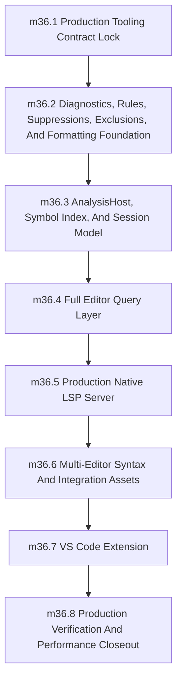

# Phase 36: Production Developer Tooling and Editor Ecosystem

status: planned

## Objective
Deliver the complete production-grade Sifr developer tooling stack for the current workspace/project model: editor-oriented analysis queries, diagnostics policy infrastructure, formatter and policy-rule surfaces, a native Rust LSP server launched through `sifr lsp --stdio`, a packageable VS Code extension, multi-editor syntax/integration assets, and parity gates proving tooling and CLI share one compiler brain.

Phase 36 is complete only when editors can provide Sifr diagnostics, navigation, completion, formatting, code actions, rename, semantic highlighting, generated-Rust preview, and test/developer commands without reimplementing parser, lowering, type-check, ownership, diagnostic, or codegen semantics.

Phase 36 is not an MVP phase. Every capability listed in this file is required for phase exit unless a later reviewed planning PR explicitly changes the contract before implementation reaches that milestone.

## Source Of Truth

This file is the authoritative implementation contract for Phase 36 until implementation creates supporting docs. `internal_docs/tooling_reuse_strategy.md` is the reviewed reuse audit and decision matrix for ty/Ruff/LSP infrastructure. Implementation PRs must add or update:

- `internal_docs/tooling_analysis.md`
- `internal_docs/lsp_server.md`
- `internal_docs/vscode_extension.md`
- `internal_docs/editor_integrations.md`
- `internal_docs/tooling_verification.md`

Those documents support this phase file; they must not introduce behavior that conflicts with this phase file or the reuse strategy unless a reviewed PR updates the relevant planning file first.

## Depends On

- Phase 35 is completed.
- `crates/sifr_syntax/` wraps the Sifr Ruff fork parser/AST/trivia/span substrate.
- `crates/sifr_frontend/` owns canonical parse/lower/type-check/diagnostics/project graph/query cache contracts.
- Phase 35 performance/query/cache/split-brain guardrails are enforced in local validation.
- Phase 35 exposes the symbol, source-map, type-display, formatting-trivia, diagnostic, and codegen-handoff data called out in its "Editor Analysis Boundary For Phase 36" section.
- `internal_docs/tooling_reuse_strategy.md` has been reviewed and is the source of truth for what is reused, adapted, referenced, or rejected from ty/Ruff infrastructure.
- Phase 27 runtime-safety and diagnostics invariants remain green.

## Feeds Into

- Package-aware external dependency intelligence after Phase 37 package management.
- Public documentation and editor installation guides in Phase 38.
- Stable release governance and marketplace publication mechanics in Phase 39.
- Future ecosystem integrations that consume the same LSP/editor assets without adding new semantics.

## Strict Non-Goals

- Using Ruff Server, ty, Pyright, or Python language-server semantics as Sifr's semantic authority.
- A custom public tsserver-style protocol. The external editor protocol is LSP 3.17.
- Package registry resolution, lockfile dependency intelligence, or third-party package auto-import across package registries. Phase 36 must be production-grade for the current workspace/project model; Phase 37 extends that model to package-managed dependencies.
- Notebook support unless a later reviewed language/product phase makes notebooks part of Sifr's production editor target.
- Marketplace account operations that require credentials or release approvals outside the repository. Phase 36 must produce packageable and publication-ready extension artifacts, manifests, docs, and checks.
- Fallback editor implementations that duplicate semantics when `sifr lsp` is missing. Extensions must fail with actionable setup errors.

## Architecture Ownership

`sifr_syntax` owns syntax substrate access to the Sifr Ruff fork. It is the only approved syntax/parser/trivia/token source for Sifr tooling. Editor packages may use generated syntax assets, but those assets must be derived from or validated against `sifr_syntax`/the Sifr Ruff fork and must not become a second parser.

`sifr_frontend` owns project loading, source maps, module graph state, parse/lower/type-check/diagnostics queries, invalidation, cache consistency, and compiler-owned analysis views.

`sifr_diagnostics` owns canonical diagnostic shape, diagnostic codes, renderer parity, structured suggestions, policy-rule metadata, suppression diagnostics, and hard-correctness vs policy-rule classification.

`sifr_format` or the final reviewed formatter module owns formatting over `sifr_syntax` token/trivia/source maps. Formatting must not lower, type-check, or derive semantic diagnostics.

`sifr_lint` or the final reviewed policy-rule module owns configurable policy rules over `sifr_frontend` and approved read-only HIR/syntax views. Hard correctness diagnostics stay in the compiler/frontend and are never suppressible.

`sifr_analysis` or `sifr_ide` owns editor-oriented semantic queries derived from `sifr_frontend`, `sifr_diagnostics`, `sifr_format`, and approved HIR/codegen views:

- diagnostics
- completion
- hover/type display
- signature help
- go-to-definition targets
- declaration targets where distinct from definition
- type-definition targets where meaningful
- find-references data
- prepare-rename and rename edits
- document symbols
- workspace symbols for the current workspace/project
- semantic tokens
- inlay hints
- document highlights
- folding ranges
- code actions from Sifr diagnostic suggestions and safe refactors
- formatting and range-formatting requests
- generated Rust preview query/command data
- explain-diagnostic query/command data
- test discovery, test command metadata, and editor test explorer metadata where Sifr test fixtures are supported by the CLI

The final crate/module names must be chosen by `milestone_36_1` and used consistently. This phase document uses `sifr_analysis`, `sifr_format`, and `sifr_lint` as placeholder names.

`sifr_lsp` owns only the LSP protocol adapter:

- JSON-RPC/LSP handshake and message dispatch
- client capability negotiation
- document synchronization transport
- workspace configuration transport
- conversion between LSP positions/ranges/URIs and Sifr source maps
- conversion from `sifr_analysis` results to LSP response payloads
- cancellation, request scheduling, stale-version rejection, and protocol error behavior

`sifr_lsp` must use `lsp-server` and `lsp-types` as the direct LSP protocol foundation. These crates are generic protocol/data-type dependencies, carry no Python semantics, and are already used by the Sifr Ruff fork's `ty_server`. Audited `ty_server` session, document, request-queue, cancellation, diagnostics-publication, logging, and test-shell patterns may be adapted only when the final implementation is Sifr-owned and cleaned of Python semantic/project assumptions.

`sifr_lsp` must not own parser logic, type checking, HIR construction, symbol-table construction, diagnostic derivation, policy-rule derivation, formatting decisions, generated Rust decisions, or Sifr semantic rules.

Forbidden production dependencies for `sifr_lsp` and `sifr_analysis` include `ty_python_semantic`, Python module-resolution semantics from `ty_project`, Python environment discovery, Python diagnostic rules, and any `ruff_server`/`ty_server` path that answers semantic questions using Python rather than Sifr.

The reuse decisions in `internal_docs/tooling_reuse_strategy.md` are binding for Phase 36 implementation:

- `lsp-server` and `lsp-types` are `reuse-direct`.
- `ty_server` initialization, capability negotiation, request dispatch, document sync, range conversion, diagnostics lifecycle, and scheduler patterns are `adapt` or `adapt-with-review`.
- `ty_ide` query surface and completion-quality evaluation are `reference-only` or pattern adaptation; semantic query code is not reused directly.
- `ty_project` as a project database and `ty_python_semantic` as a semantic/rule engine are rejected production dependencies.
- Ruff parser/AST/trivia/text crates remain `reuse-direct` only through `sifr_syntax`.

`crates/sifr` owns the CLI command surface. Phase 36 adds:

```bash
sifr lsp --stdio
sifr fmt [--check] <path-or-project>
sifr lint <path-or-project>
```

The exact CLI spelling may change during `milestone_36_1` only if the final reviewed command set preserves the same capabilities. `--stdio` is the required LSP transport for phase exit.

VS Code extension ownership:

- language id: `sifr`
- file extensions: `.sifr`
- grammar/filetype registration and language configuration
- LSP launcher and settings UI
- commands and test explorer integration that call `sifr lsp`, `sifr fmt`, `sifr lint`, `sifr check`, `sifr test`, or generated-Rust preview commands
- no type checker, parser, HIR traversal, diagnostic derivation, formatter, linter, or codegen logic inside extension TypeScript/JavaScript

## Editor Query Contract

Phase 36 must define and implement the editor query API below. Names may change during implementation only if the final reviewed API preserves the same capability and ownership boundary.

```rust
// Target crate: sifr_analysis, final name decided in milestone_36_1.

pub struct AnalysisHost {
    pub fn open_project(root: ProjectRoot) -> Result<Self, Vec<RenderedDiagnostic>>;
    pub fn open_single_file(input: FrontendInput) -> Result<Self, Vec<RenderedDiagnostic>>;
    pub fn update_document(
        &mut self,
        file: FileId,
        version: DocumentVersion,
        text: SourceText,
    ) -> Result<InvalidationReport, Vec<RenderedDiagnostic>>;

    pub fn diagnostics(&mut self, file: FileId) -> QueryResult<Vec<RenderedDiagnostic>>;
    pub fn workspace_diagnostics(&mut self) -> QueryResult<Vec<FileDiagnostics>>;
    pub fn completion(&mut self, file: FileId, position: TextPosition) -> QueryResult<CompletionItems>;
    pub fn hover(&mut self, file: FileId, position: TextPosition) -> QueryResult<Option<HoverInfo>>;
    pub fn signature_help(&mut self, file: FileId, position: TextPosition) -> QueryResult<Option<SignatureHelp>>;
    pub fn definition(&mut self, file: FileId, position: TextPosition) -> QueryResult<Vec<Location>>;
    pub fn declaration(&mut self, file: FileId, position: TextPosition) -> QueryResult<Vec<Location>>;
    pub fn type_definition(&mut self, file: FileId, position: TextPosition) -> QueryResult<Vec<Location>>;
    pub fn references(&mut self, file: FileId, position: TextPosition) -> QueryResult<Vec<Location>>;
    pub fn prepare_rename(&mut self, file: FileId, position: TextPosition) -> QueryResult<Option<RenameTarget>>;
    pub fn rename(&mut self, file: FileId, position: TextPosition, new_name: SymbolName) -> QueryResult<WorkspaceEdit>;
    pub fn document_symbols(&mut self, file: FileId) -> QueryResult<Vec<DocumentSymbol>>;
    pub fn workspace_symbols(&mut self, query: SymbolQuery) -> QueryResult<Vec<WorkspaceSymbol>>;
    pub fn semantic_tokens(&mut self, file: FileId, range: Option<TextRange>) -> QueryResult<Vec<SemanticToken>>;
    pub fn inlay_hints(&mut self, file: FileId, range: Option<TextRange>) -> QueryResult<Vec<InlayHint>>;
    pub fn document_highlights(&mut self, file: FileId, position: TextPosition) -> QueryResult<Vec<DocumentHighlight>>;
    pub fn folding_ranges(&mut self, file: FileId) -> QueryResult<Vec<FoldingRange>>;
    pub fn code_actions(&mut self, file: FileId, range: TextRange, context: CodeActionContext) -> QueryResult<Vec<CodeAction>>;
    pub fn format_document(&mut self, file: FileId, options: FormatOptions) -> QueryResult<TextEdits>;
    pub fn format_range(&mut self, file: FileId, range: TextRange, options: FormatOptions) -> QueryResult<TextEdits>;
    pub fn generated_rust_preview(&mut self, file: FileId, range: Option<TextRange>) -> QueryResult<GeneratedRustPreview>;
    pub fn explain_diagnostic(&mut self, diagnostic: DiagnosticId) -> QueryResult<DiagnosticExplanation>;
    pub fn discover_tests(&mut self) -> QueryResult<Vec<TestItem>>;
    pub fn test_command(&mut self, test: TestItemId) -> QueryResult<TestCommand>;
}
```

Required production semantics:

- Completion covers locals, functions, types, modules, imports, stdlib items, fields/methods when type information is available, enum/union variants, contextual keywords, snippets only where semantically valid, and current-workspace auto-import candidates. Package-registry auto-import lands after Phase 37.
- Hover shows inferred Sifr type, symbol kind, mutability/ownership-relevant facts where applicable, and docs when doc comments are available.
- Signature help covers Sifr functions, methods, constructors, generic parameters, and active parameter selection.
- Definition/declaration/type-definition cover local variables, functions, methods, classes/types, modules, imported symbols, current-workspace symbols, and stdlib symbols when source spans are available.
- References and rename are workspace-wide for the current workspace/project graph and must reject unsafe or ambiguous rename targets.
- Document symbols and workspace symbols are deterministic and stable across equivalent inputs.
- Semantic tokens classify at least keyword, type, function, method, variable, parameter, property/field, module, comment, string, number, operator, decorator/attribute where applicable, mutable binding, ownership-sensitive parameter convention, deprecated symbol, and unsafe/error-prone operation categories supported by LSP.
- Inlay hints include inferred variable types, parameter names, generic type parameters where useful, and ownership/borrow hints only where the type checker can state them precisely.
- Code actions expose Sifr diagnostic suggestions, safe import insertion, suppression insertion only for suppressible policy rules, organize imports, and safe rename/format-related fixes.
- Formatting preserves comments/trivia, is idempotent, and matches `sifr fmt --check`.
- Generated Rust preview uses compiler/codegen APIs and source maps; it must not reimplement lowering or codegen in the LSP or extension.
- Test discovery and editor test explorer metadata must use CLI/test-runner metadata when available and must fail closed when a project has no test surface rather than guessing from Python semantics.

Anti-split-brain rules:

- `sifr_analysis` may call `sifr_frontend`, `sifr_diagnostics`, `sifr_format`, `sifr_lint`, and approved HIR/codegen read-only views.
- `sifr_lsp` handlers call `sifr_analysis`; they do not traverse HIR directly for semantic answers.
- VS Code/Neovim/Zed/Helix/Emacs packages call LSP, CLI commands, or syntax-highlighting assets; they do not implement Sifr semantics.
- Any new tooling path that parses, lowers, type-checks, formats through a separate parser, codegens through an editor-specific path, or derives semantic diagnostics outside approved crates fails the split-brain guardrail.

## LSP Server Contract

The external protocol target is LSP 3.17 over stdio.

Required `sifr lsp --stdio` capabilities for phase exit:

- `initialize`
- `initialized`
- `shutdown`
- `exit`
- `workspace/didChangeConfiguration`
- `workspace/symbol`
- `workspace/executeCommand`
- `textDocument/didOpen`
- `textDocument/didChange`
- `textDocument/didSave`
- `textDocument/didClose`
- `textDocument/publishDiagnostics`
- `textDocument/diagnostic` where the client supports pull diagnostics
- `workspace/diagnostic` where the client supports pull diagnostics
- `textDocument/completion`
- `completionItem/resolve` when completion details are lazily computed
- `textDocument/hover`
- `textDocument/signatureHelp`
- `textDocument/definition`
- `textDocument/declaration`
- `textDocument/typeDefinition`
- `textDocument/references`
- `textDocument/prepareRename`
- `textDocument/rename`
- `textDocument/documentSymbol`
- `workspace/symbol`
- `textDocument/semanticTokens/full`
- `textDocument/semanticTokens/range`
- `textDocument/inlayHint`
- `textDocument/documentHighlight`
- `textDocument/foldingRange`
- `textDocument/codeAction`
- `codeAction/resolve` when action edits are lazily computed
- `textDocument/formatting`
- `textDocument/rangeFormatting`

Required workspace commands:

- restart language server
- show server logs
- explain diagnostic
- show generated Rust for current file or selection
- run Sifr check for current workspace
- run Sifr tests where the CLI exposes test metadata

Document sync model:

- Phase 36 supports both full-document and incremental sync.
- Incremental sync must be proven against partial insert/delete/replace edits, multi-byte characters, UTF-8/UTF-16/UTF-32 client position encodings, stale versions, and parse/type-check recovery.
- Each LSP diagnostic publication includes the latest known document version when the client supplies one.
- LSP handlers must ignore stale query results for superseded document versions.
- Open editor buffers override on-disk content for analysis until closed or saved according to LSP sync semantics.

Cancellation and concurrency:

- Document updates are serialized so no query observes a partially applied edit.
- Latency-sensitive requests such as completion, hover, signature help, and definition must not be blocked behind full workspace diagnostics when a valid snapshot exists.
- Cancellation may abort pending editor queries, but it must not publish partial diagnostics or corrupt frontend/analysis cache state.
- The LSP session must use explicit snapshots or equivalent revision discipline so each request sees a coherent source graph.
- Internal errors are reported through LSP error responses and compiler diagnostics according to the Phase 27 exit-code/diagnostic contract where applicable.
- Request scheduling, cancellation, and stale-version handling must have negative protocol tests.

## Diagnostics, Rules, Suppressions, And Exclusions

Sifr keeps `crates/sifr_diagnostics/` as the canonical diagnostic model. Phase 36 may adapt ty/Ruff UX concepts from `internal_docs/tooling_reuse_strategy.md`, but it must not replace Sifr diagnostic codes, rendered JSON schema, renderer parity, child note/help behavior, structured suggestions, or Phase 27 exit-code contracts with Ruff/ty diagnostic types.

Phase 36 must implement and document this diagnostic split:

- hard correctness diagnostics are not suppressible and cannot be downgraded: parse errors, soundness-critical type errors, ownership/move/borrow errors, `Result`/`Option` safety errors, runtime-panic-prevention errors, and workspace/import errors that would make compilation ambiguous or unsound
- policy rules are configurable when they do not affect Sifr's core guarantee: unused code/imports, unreachable-code warnings, migration advisories, style-adjacent static analysis, optional strictness checks, and tooling-quality advisories

Rules and suppression requirements:

- Adopt ty's `ignore`/`warn`/`error` rule-level product concept only for Sifr-owned policy rules.
- Rule metadata belongs in Sifr-owned diagnostics or a Sifr-owned policy-rule registry, not in `ty_python_semantic`.
- Suppression syntax is Sifr-specific: `# sifr: ignore[rule-id]`.
- Bare blanket suppressions are not allowed.
- Unknown suppression rule ids and unused suppression comments produce deterministic diagnostics.
- Python `type: ignore` comments must not suppress Sifr diagnostics by default. Compatibility may be added only for an explicit Sifr-prefixed form such as `type: ignore[sifr:rule-id]`.
- LSP code actions may insert suppressions only for suppressible policy rules and must never offer suppression for hard correctness diagnostics.

Exclusion requirements:

- Include/exclude behavior adapts ty's product model: project include roots, exclude globs, default ignored directories, respect for `.gitignore`/`.ignore`, and explicit CLI targets overriding excludes.
- Generic glob matching may be extracted from `ty_project` only if moved behind a Sifr-owned API and cleaned of Python project assumptions.
- Exclusions affect project discovery scope; they must not silently change semantics for files explicitly passed to `sifr check`, `sifr build`, `sifr fmt`, `sifr lint`, or `sifr lsp`.

LSP diagnostics mode:

- Phase 36 supports `off`, `open-files`, and `workspace` diagnostics modes for editor publication.
- `off` only disables editor publication; it does not change CLI compiler behavior.
- `open-files` mode publishes diagnostics for open documents and their directly required context.
- `workspace` mode publishes project diagnostics for the current workspace/project graph within Phase 35 performance budgets.
- Push and pull diagnostics must agree on codes, severity, ranges, related information, tags, and structured suggestions.

## Formatting And Policy-Rule Contract

Formatting is part of Phase 36.

Formatter requirements:

- `sifr fmt --check` exits nonzero on non-idempotent formatting drift and prints deterministic diagnostics.
- `sifr fmt` produces stable, idempotent output.
- LSP document/range formatting returns text edits equivalent to `sifr fmt`.
- Formatting preserves comments, meaningful blank lines, string contents, source spans needed by diagnostics, and Sifr-specific parameter-convention syntax.
- Formatting tests include round-trip parse checks and drift checks against `sifr_syntax` fixtures.

Policy-rule requirements:

- `sifr lint` runs suppressible policy diagnostics without changing hard compiler diagnostics.
- Policy-rule configuration uses Sifr-owned rule ids and deterministic severity resolution.
- Policy diagnostics share the canonical `sifr_diagnostics` shape and renderer behavior.
- LSP diagnostics, code actions, and CLI lint output use the same rule engine and suppression/exclusion behavior.

## VS Code Extension Contract

Phase 36 must implement and package the VS Code extension. A separate repository such as `sifr-lang/sifr-vscode` is acceptable only if the phase PR records the repository boundary and the validation commands are still reproducible from this repository or from a pinned sibling checkout.

The concrete execution checklist is `issues/phase36-vscode-extension-production-execution.md`. The default recommendation is a separate `sifr-lang/sifr-vscode` repository; `milestone_36_1` may choose an in-repo extension only with reviewed rationale and equivalent validation/release-boundary guarantees. This is a required Phase 36 milestone, not an ad hoc phase after Phase 36.

The extension owns:

- `package.json` language contribution for `.sifr`
- TextMate grammar and/or Tree-sitter-backed grammar contribution for basic syntax highlighting before the LSP starts
- language configuration: comments, brackets, indentation, auto-closing pairs
- LSP client launcher for `sifr lsp --stdio`
- user settings under `sifr.*`
- commands: restart server, show server logs, locate Sifr binary, run check, run tests, format document, show generated Rust, explain diagnostic
- VS Code Test Explorer integration backed by Sifr test discovery and CLI test commands
- `.vsix` packaging and extension test workflow

The extension must not own:

- type checking
- ownership/move analysis
- diagnostics derivation
- Sifr symbol analysis
- formatter logic
- linter/policy-rule logic
- generated Rust decisions

Binary discovery:

- default command: `sifr`
- default args: `["lsp", "--stdio"]`
- setting: `sifr.lsp.path` overrides the binary path
- setting: `sifr.lsp.trace.server` controls protocol tracing
- extension startup must fail with an actionable message if no Sifr binary is found
- the extension must not silently fall back to Python tooling

Syntax highlighting strategy:

- Basic highlighting must not depend on the LSP being ready.
- The grammar may be TextMate first for VS Code velocity, Tree-sitter first for multi-editor reuse, or both if generated from the same source.
- The grammar/token queries must be generated from or validated against `sifr_syntax`/the Sifr Ruff fork tokenization fixtures. Manually authored grammar rules are allowed only if a checked-in validation test catches drift from parser tokenization.
- LSP semantic tokens layer meaning-aware highlighting on top of basic syntax.

Publication readiness:

- Phase 36 must produce a packageable extension artifact and publication checklist.
- Actual marketplace upload may be performed by Phase 39 release governance if credentials or release approvals are required.

## Multi-Editor Integration Contract

Phase 36 must deliver checked-in editor integration assets or contribution-ready docs for:

- Neovim: LSP config, filetype detection, and Tree-sitter/TextMate strategy notes.
- Zed: language extension metadata or contribution-ready config using `sifr lsp --stdio`.
- Helix: language configuration using `sifr lsp --stdio` and syntax asset instructions.
- Emacs: LSP client configuration and filetype mode guidance.

These integrations must delegate semantics to `sifr lsp --stdio`. Syntax/highlighting assets must be validated against `sifr_syntax` fixtures or generated from the same source-of-truth grammar.

## Verification Infrastructure

Phase 36 creates and owns `verification/tooling/`.

Required files:

- `verification/tooling/parity_manifest.json` - source of truth for diagnostics and editor-query parity cases.
- `verification/tooling/run_tooling_parity.py` - compares CLI/frontend/analysis/LSP results for manifest entries.
- `verification/tooling/lsp_protocol_smoke.py` - launches `sifr lsp --stdio`, performs initialize/open/change/query/shutdown, and validates JSON-RPC behavior.
- `verification/tooling/lsp_protocol_stress.py` - validates cancellation, stale versions, incremental sync, request interleaving, malformed JSON-RPC, and workspace diagnostics behavior.
- `verification/tooling/check_lsp_split_brain.py` - verifies LSP handlers do not import or traverse forbidden semantic internals directly.
- `verification/tooling/check_tooling_dependency_boundaries.py` - verifies forbidden ty/Ruff/Python semantic dependencies are not introduced.
- `verification/tooling/check_formatter_contract.py` - verifies idempotence, range-formatting, parser round trips, and formatter/LSP equivalence.
- `verification/tooling/check_rule_suppression_contract.py` - verifies hard-vs-policy diagnostics, suppression, unknown suppression, unused suppression, severity config, and exclusions.
- `verification/tooling/check_editor_assets.py` - verifies syntax assets, extension metadata, editor configs, and drift checks.
- `verification/tooling/check_vscode_extension.py` - verifies extension build/test/package and contract behavior.
- `verification/tooling/completion_quality/` - completion ranking/evaluation fixtures inspired by `ty_completion_eval`.
- `verification/tooling/editor_query_snapshots/` - checked-in deterministic expected results for editor queries.
- `verification/tooling/vscode_extension_contract.json` - extension settings, language id, command, and repository-boundary contract.

Phase 36 extends Phase 35 `verification/performance/` with protocol-level `lsp-query` benchmark cases:

- `lsp-cold-start`: process spawn to initialized response
- `lsp-did-open-diagnostics`: open document to first diagnostics publication
- `lsp-did-change-diagnostics`: full and incremental document changes to refreshed diagnostics
- `lsp-workspace-diagnostics`: workspace diagnostics publication or pull response
- `lsp-completion`: request/response at representative local, member, import, and auto-import positions
- `lsp-hover`: request/response for local, function, type, ownership-sensitive parameter, and imported symbol
- `lsp-signature-help`: request/response inside calls and generic invocations
- `lsp-definition`: request/response for local and imported definitions
- `lsp-references`: workspace reference query
- `lsp-rename`: prepare and workspace edit generation
- `lsp-semantic-tokens`: full and range semantic token requests
- `lsp-inlay-hints`: representative file/range request
- `lsp-code-actions`: diagnostic and organize-import actions
- `lsp-formatting`: document and range formatting requests
- `lsp-generated-rust-preview`: preview command latency

Default interactive budgets unless Phase 35 `budgets.json` records stricter values with rationale:

- cold start median <= 1000ms on local baseline hardware
- diagnostics after `didOpen` median <= 500ms for representative files
- diagnostics after `didChange` median <= 250ms for representative files
- workspace diagnostics p95 <= 2000ms for representative projects
- completion median <= 200ms
- hover median <= 100ms
- signature help median <= 150ms
- definition/declaration/type-definition median <= 150ms
- references median <= 500ms for representative projects
- rename prepare median <= 150ms; rename edit generation median <= 750ms
- semantic tokens median <= 250ms
- inlay hints median <= 250ms
- code actions median <= 250ms
- formatting median <= 500ms for representative files
- generated Rust preview median <= 750ms for representative selections

These are phase-start defaults. Final budgets must be derived from checked-in baselines and recorded in `verification/performance/budgets.json`.

## Milestone Sequencing

Implementation must execute milestones in order unless a later reviewed PR updates this file with rationale. The ty/Ruff reuse audit has already been performed in `internal_docs/tooling_reuse_strategy.md`; implementation milestones must follow that strategy rather than reopen the audit as exploratory work.



No Phase 36 milestone may depend on parallel work. Ad hoc PR slices are allowed only inside the active milestone and must not require later milestones to repair incomplete contracts from earlier ones.

## Milestones

### milestone_36_1: Production Tooling Contract Lock
- Scope:
  - Choose final crate/module names for `sifr_analysis`, formatter, policy-rule/lint, and LSP boundaries.
  - Decide whether the VS Code extension implementation lives in the recommended separate `sifr-lang/sifr-vscode` repository or in this repository, and record the validation checkout/release boundary.
  - Update `issues/phase36-vscode-extension-production-execution.md` with the final repository decision and any reviewed deviations from its default separate-repo plan.
  - Lock the LSP capability matrix, command set, diagnostics modes, settings schema, semantic token legend, code-action kinds, generated-Rust preview command shape, test explorer command shape, syntax asset source of truth, and package-management boundary.
  - Create `internal_docs/tooling_analysis.md`, `internal_docs/lsp_server.md`, `internal_docs/vscode_extension.md`, `internal_docs/editor_integrations.md`, and `internal_docs/tooling_verification.md`.
  - Confirm Phase 35 exports are sufficient for references, rename, signature help, semantic tokens, formatting, generated-Rust preview, test discovery, and editor test explorer metadata. Any missing export must be fixed in this milestone before feature implementation continues.
  - Apply `internal_docs/tooling_reuse_strategy.md` before designing public `sifr_analysis` or `sifr_lsp` handoff types.
  - Define the Sifr-owned diagnostics/rules/suppression/exclusion handoff for editor tooling.
  - Extend split-brain guardrails to reject semantics reimplementation in `sifr_lsp`, `sifr_lint`, formatter paths, editor adapters, automation adapters, and CLI-only analysis shims.
- Definition of done:
  - Supporting architecture docs exist and agree with this phase file.
  - Extension repository boundary and validation commands are settled.
  - The complete production LSP/editor feature list is represented in contracts and tests-to-add.
  - Missing Phase 35 exports are either implemented in this milestone or recorded as blockers that prevent moving to `milestone_36_2`.
  - Negative guardrail seeds prove forbidden parser/type-check/diagnostic/codegen paths fail validation.

### milestone_36_2: Diagnostics, Rules, Suppressions, Exclusions, And Formatting Foundation
- Scope:
  - Implement Sifr-owned policy-rule metadata, severity resolution, and hard-correctness vs policy-rule classification.
  - Implement `# sifr: ignore[rule-id]`, unknown suppression diagnostics, unused suppression diagnostics, and no-blanket-suppression enforcement.
  - Implement include/exclude discovery behavior and editor diagnostics modes: `off`, `open-files`, and `workspace`.
  - Implement formatter foundation over `sifr_syntax`, including document formatting, range formatting, idempotence checks, parser round trips, and `sifr fmt --check`.
  - Implement `sifr lint` or the final reviewed policy-rule CLI surface.
  - Add `check_formatter_contract.py` and `check_rule_suppression_contract.py`.
- Definition of done:
  - Hard correctness diagnostics cannot be suppressed or downgraded.
  - Policy diagnostics are configurable, suppressible only with explicit rule ids, and rendered through `sifr_diagnostics`.
  - Exclusions affect discovery but never explicit CLI targets.
  - Formatter output is deterministic, idempotent, parser-round-tripped, and equivalent between CLI and analysis/LSP formatting APIs.
  - Formatter verification uses `sifr_syntax` tokenization fixtures before later milestones rely on formatter output in editor/LSP paths.
  - Positive and negative contract checks run locally.

### milestone_36_3: AnalysisHost, Symbol Index, And Session Model
- Scope:
  - Create `crates/sifr_analysis/` or the final reviewed crate name for editor-oriented queries.
  - Implement `AnalysisHost` over `sifr_frontend` with project/open-file session state, coherent source snapshots, document versions, invalidation reports, and stale-result rejection.
  - Implement current-workspace symbol index, definition/reference identity, rename target validation, source-map handoff, type-display contract, doc comment extraction where available, generated-Rust preview handoff, test discovery handoff, and test command handoff.
  - Implement completion ranking/evaluation infrastructure inspired by `ty_completion_eval`.
  - Add first parity fixtures for single-file and multi-file projects.
- Definition of done:
  - `AnalysisHost` compiles and exposes every query listed in this phase file, even if feature logic lands in `milestone_36_4`.
  - Symbol identity is stable within one analysis revision and safe for references/rename.
  - Stale document versions and invalidated snapshots are rejected deterministically.
  - The analysis crate owns editor queries and does not bypass `sifr_frontend`.
  - Positive tests cover session load/update/query plumbing; negative tests cover stale versions, direct semantic bypass, and forbidden ty/Ruff Python semantic dependencies.

### milestone_36_4: Full Editor Query Layer
- Scope:
  - Implement diagnostics, workspace diagnostics, completion, hover, signature help, definition, declaration, type definition, references, prepare rename, rename, document symbols, workspace symbols, semantic tokens, inlay hints, document highlights, folding ranges, code actions, formatting queries, generated Rust preview, explain diagnostic, test discovery, and test command metadata through `sifr_analysis`.
  - Add `verification/tooling/parity_manifest.json`, `run_tooling_parity.py`, `editor_query_snapshots/`, and `completion_quality/`.
  - Cover diagnostics codes, URLs, spans, child note/help payloads, structured suggestion payloads, renderer outputs, type-check outcomes, symbol kinds, rename edits, code actions, generated Rust mappings, semantic-token ordering, inlay hints, and LSP severity mapping.
- Definition of done:
  - Divergence between compiler/frontend/analysis behavior is automatically detected before merge.
  - Every editor query listed in the contract has positive and negative fixture coverage.
  - Completion ranking has checked-in quality evidence and regression thresholds.
  - Generated Rust preview is source-mapped and codegen-backed.
  - Rename/reference behavior is workspace-wide for the current workspace/project graph and rejects ambiguous edits.

### milestone_36_5: Production Native LSP Server
- Scope:
  - Add `crates/sifr_lsp/` or an equivalent reviewed module boundary.
  - Add `sifr lsp --stdio` to the CLI.
  - Implement all required LSP 3.17 capabilities listed in this file through `sifr_analysis`.
  - Implement full and incremental sync, push and pull diagnostics, workspace configuration, workspace commands, cancellation, request scheduling, stale-version rejection, deterministic protocol errors, tracing/logging, and snapshot discipline.
  - Add `lsp_protocol_smoke.py`, `lsp_protocol_stress.py`, `check_lsp_split_brain.py`, and `check_tooling_dependency_boundaries.py`.
  - Add Phase 35 `lsp-query` performance cases and budget evidence for every implemented LSP request family.
- Definition of done:
  - `sifr lsp --stdio` responds to initialize/shutdown and handles open/change/save/close/query flows in smoke and stress tests.
  - LSP diagnostics match canonical frontend/analysis diagnostics after protocol conversion.
  - Every required LSP capability passes parity snapshots.
  - Split-brain guardrails fail on seeded direct HIR traversal, parser/type-check bypass, forbidden ty/Ruff semantic dependency, or extension-owned semantic path.
  - LSP query performance budgets are recorded and enforced through the Phase 35 performance gate.

### milestone_36_6: Multi-Editor Syntax And Integration Assets
- Scope:
  - Deliver checked-in or contribution-ready Neovim, Zed, Helix, and Emacs configs using `sifr lsp --stdio`.
  - Deliver TextMate and/or Tree-sitter assets required by the VS Code and non-VS Code editor targets.
  - Add syntax asset drift checks against `sifr_syntax` tokenization fixtures.
  - Add `check_editor_assets.py`.
- Definition of done:
  - Each target editor has documented setup, filetype detection, LSP launch configuration, and syntax/highlighting strategy.
  - Syntax assets are validated against parser/token fixtures.
  - No editor integration duplicates Sifr semantic logic.

### milestone_36_7: VS Code Extension
- Scope:
  - Implement the VS Code extension in the chosen repository boundary after the shared syntax assets are validated, following `issues/phase36-vscode-extension-production-execution.md`.
  - Add language id, file extension, grammar, language configuration, LSP launcher, settings, commands, trace/logging, binary discovery, generated Rust preview, explain diagnostic, check/test commands, VS Code Test Explorer integration, format command, restart server, and server log access.
  - Add `.vsix` packaging, extension integration tests, and `vscode_extension_contract.json`.
  - Ensure extension tests can launch the locally built `sifr lsp --stdio`.
- Definition of done:
  - The extension builds, tests, and packages locally.
  - Extension contract validation proves the launcher points to `sifr lsp --stdio` and no extension-owned type checker/parser/formatter/linter setting exists.
  - Missing Sifr binary behavior is actionable and does not fall back to Python tooling.
  - Generated Rust preview, explain diagnostic, check/test, Test Explorer, and format commands call Sifr CLI/LSP surfaces rather than extension-owned logic.
  - Publication checklist and versioning/repository-boundary notes are documented.

### milestone_36_8: Production Verification And Performance Closeout
- Scope:
  - Finalize `internal_docs/tooling_verification.md`.
  - Ensure every Phase 36 verification script is wired into local validation.
  - Finalize LSP/editor performance baselines, budgets, waivers, and negative seeds.
  - Run full parity, protocol, stress, dependency-boundary, formatter, rule/suppression/exclusion, editor asset, VS Code package, completion quality, performance, and split-brain checks.
  - Audit implementation against `internal_docs/tooling_reuse_strategy.md`.
- Definition of done:
  - `scripts/run_all_tests.sh --profile quick` passes.
  - `scripts/run_all_tests.sh --profile pr` passes.
  - Every required Phase 36 feature has positive and negative evidence.
  - Production validation evidence is recorded in the phase execution checklist issue.
  - No open deferrals remain inside the Phase 36 contract except package-registry intelligence after Phase 37 and release-governance publication mechanics after Phase 39.

## Quality Contract

### Entry criteria
- Phase 35 is completed and compiler performance/query contracts plus the shared syntax/frontend/query foundation are enforced.
- Phase 27 non-regression baseline is required at phase start and must remain green through completion.
- Phase 27 non-regression invariants that must hold in this phase include: no user-triggerable panic paths; no data-dependent emitted `.unwrap()` / `.expect()` / `panic!` in user runtime paths; stable diagnostic contract (codes, severity, spans, URLs, suggestions, schema); canonical/lossless `json` diagnostics with `human` and `compact` as renderer views only; enforced recovery limits with deterministic ordering; and enforced exit-code and CLI stability contracts (`0/1/2/3`, and unknown `--diagnostic-format` exits `2` before semantic work).
- Any milestone that regresses these invariants is incomplete, even if its local scope passes.

### Milestone quality checks
- Local validation gates pass for each milestone before merge:
  - `scripts/run_all_tests.sh --profile quick`
  - milestone-specific `verification/tooling/*.py` checks added by the milestone
- The authoritative pre-PR gate passes before phase-closing PRs:
  - `scripts/run_all_tests.sh --profile pr`
- No tooling path uses CI-only behavior.
- No LSP or extension code reimplements parser, lowering, type-check, ownership, semantic diagnostic logic, formatter logic, linter logic, or codegen logic.
- No `sifr_lsp` or `sifr_analysis` production path depends on Python semantic/project/runtime authority from `ty_python_semantic`, Python module resolution in `ty_project`, Python environment discovery, Python diagnostic rules, or `ruff_server` semantic behavior.
- LSP JSON-RPC output is deterministic for equivalent request sequences.
- LSP and analysis conversions preserve diagnostic codes, severities, spans, URLs, help, child notes, structured suggestions, related information, tags, and fix applicability.
- No fallback, migration, or legacy compatibility code is allowed; implement the canonical architecture directly with clean code only.
- No partial fixes are allowed; each milestone must resolve root causes completely, even when that requires significant rework.
- All implementations must be production-grade compiler/tooling code: deterministic behavior, explicit invariants, cancellation-safe state updates, strict protocol handling, strict dependency boundaries, and clean ownership.
- Validation evidence must be recorded in the phase execution checklist issue before merge.
- Validation evidence for every milestone must include at least one positive-path case and one negative-path case mapped to the milestone validation planning goals.

### Validation planning goals
- `milestone_36_1`:
  - Positive: supporting docs lock crate names, repo boundary, LSP capability matrix, diagnostic/rule policy, formatter/lint strategy, syntax asset strategy, and package-management boundary.
  - Negative: seeded missing Phase 35 export, forbidden Python semantic dependency, or extension-owned semantic path fails the guardrail.
- `milestone_36_2`:
  - Positive: formatter, rule, suppression, exclusion, and diagnostics-mode checks pass for representative projects.
  - Negative: hard diagnostic suppression, unknown suppression, unused suppression, non-idempotent formatting, parser-round-trip drift, and explicit-target exclusion misuse fail validation.
- `milestone_36_3`:
  - Positive: `AnalysisHost` loads and updates single-file and project sessions with stable symbols, snapshots, and document versions.
  - Negative: stale versions, invalidated snapshots, direct parser/type-check/HIR semantic bypass, and forbidden ty/Ruff Python semantic dependencies fail validation.
- `milestone_36_4`:
  - Positive: analysis returns every required editor query through `sifr_frontend` for single-file and multi-file projects.
  - Negative: seeded diagnostic severity drift, span drift, completion drift, hover type drift, signature drift, definition/reference target drift, rename edit drift, generated Rust mapping drift, semantic-token ordering drift, code-action drift, and stale-version publication fail the parity gate.
- `milestone_36_5`:
  - Positive: LSP smoke and stress tests initialize, open/change/save/close `.sifr` documents, publish/pull diagnostics, answer every required request, execute required commands, handle cancellation, and shut down cleanly.
  - Negative: malformed JSON-RPC, unsupported request, stale document version, cancellation, incremental edit mismatch, workspace diagnostics drift, and direct semantic bypass fail with deterministic protocol errors or guardrail failures.
- `milestone_36_6`:
  - Positive: Neovim/Zed/Helix/Emacs configs use `sifr lsp --stdio` and syntax assets validate against parser/token fixtures.
  - Negative: editor config with Python tooling fallback, semantic implementation, or unvalidated syntax asset fails validation.
- `milestone_36_7`:
  - Positive: VS Code extension builds, tests, packages, launches local `sifr lsp --stdio`, exposes required commands/settings, and drives Test Explorer through Sifr test metadata.
  - Negative: extension-owned parser/type-checker/formatter/linter setting, missing binary discovery error, missing launch args, failed generated-Rust preview command, failed Test Explorer command, or grammar strategy without drift validation fails the contract check.
- `milestone_36_8`:
  - Positive: all tooling verification and performance gates pass locally.
  - Negative: seeded split-brain, protocol, formatter, rule, suppression, extension, editor asset, completion-quality, and performance regressions fail the appropriate checks.
- Exit-gate evidence explicitly demonstrates: tooling integration is split-brain-resistant, renderer/protocol-stable, editor-query-complete, formatter/lint-capable, extension-packageable, multi-editor-ready, performance-budgeted, and regression-covered against compiler behavior.

### CI Integration

Tooling checks must run in `scripts/run_all_tests.sh --profile pr` under a clearly named "Developer Tooling Checks" step. Local validation and CI use the same commands. CI-only tooling behavior is not allowed.

## Exit criteria

- All milestone DoDs are satisfied.
- `internal_docs/tooling_reuse_strategy.md` remains consistent with implementation, or any strategy changes have been reviewed before implementation diverges.
- `crates/sifr_analysis/` or the reviewed final crate name exists and owns editor-oriented queries.
- `sifr_format` and `sifr_lint` or reviewed equivalent module/crate boundaries exist.
- `crates/sifr_lsp/` or the reviewed final module boundary exists.
- `sifr lsp --stdio` launches a native Rust LSP 3.17 server.
- `sifr fmt --check` and `sifr lint` or reviewed equivalent CLI commands exist.
- Required LSP capabilities pass protocol smoke and stress tests.
- Diagnostics, workspace diagnostics, completion, hover, signature help, definition, declaration, type definition, references, rename, document symbols, workspace symbols, semantic tokens, inlay hints, document highlights, folding ranges, code actions, formatting, generated Rust preview, explain diagnostic, test discovery, and test command metadata are parity-covered.
- Neovim, Zed, Helix, and Emacs integration assets/docs exist and are syntax/LSP contract-checked.
- VS Code extension builds, tests, packages, integrates with VS Code Test Explorer, and delegates semantics to `sifr lsp --stdio` plus Sifr CLI commands.
- Phase 35 `lsp-query` performance cases exist for every required LSP capability family and pass or have explicit reviewed waivers.
- `verification/tooling/run_tooling_parity.py` passes and fails on seeded divergences.
- `verification/tooling/lsp_protocol_smoke.py` and `verification/tooling/lsp_protocol_stress.py` pass and fail on seeded protocol failures.
- `verification/tooling/check_lsp_split_brain.py` and `check_tooling_dependency_boundaries.py` pass and fail on seeded split-brain violations.
- `verification/tooling/check_formatter_contract.py` passes and fails on seeded formatting drift.
- `verification/tooling/check_rule_suppression_contract.py` passes and fails on seeded rule/suppression/exclusion drift.
- `verification/tooling/check_editor_assets.py` and `check_vscode_extension.py` pass and fail on seeded extension/editor asset drift.
- Completion quality fixtures pass configured ranking thresholds and fail on seeded regressions.
- `scripts/run_all_tests.sh --profile quick` passes.
- `scripts/run_all_tests.sh --profile pr` passes.
- Phase 27 non-regression contract remains green.
- Validation evidence is recorded in the phase execution checklist issue before merge.

## Exit Gate

Sifr has one compiler/tooling brain: syntax comes from the Sifr Ruff fork through `sifr_syntax`; semantics and diagnostics come from `sifr_frontend` and `sifr_diagnostics`; formatter and policy-rule surfaces are Sifr-owned; editor intelligence comes from `sifr_analysis`; `sifr lsp --stdio` is a thin native Rust LSP adapter; VS Code and other editor integrations delegate all semantics to the LSP/CLI; and parity, protocol, performance, packaging, syntax-asset, formatter, rule/suppression, and split-brain guardrails prove the editor ecosystem cannot drift away from compiler behavior.
