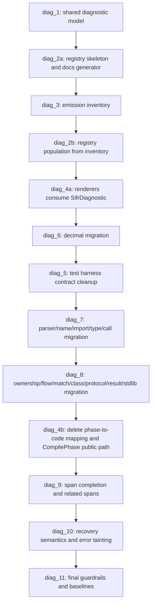

# Ad-Hoc Phase: Semantic Diagnostic Code Taxonomy and Structured HIR Diagnostics

## Objective

Replace the current phase-level `SIFR-TYPE-0001` diagnostic bucket with a precise, structured, stable diagnostic system across parser, HIR/lowering/type-check, ownership, import, control-flow, decimal, codegen, build, and workspace errors.

Sifr is not production-released yet. This phase intentionally does not preserve old diagnostic-code compatibility. The goal is the clean target architecture for an elegant language and compiler, not a migration layer around historical behavior.

## Phase Closure Summary

Phase 31.7 is closed as of 2026-05-03 after replacing phase-derived semantic diagnostic buckets with canonical `SIFR-<FAMILY>-dddd` codes, deleting raw HIR `ctx.error(...)` transport, and adding guardrails for diagnostic code coverage, docs/schema sync, baseline hygiene, cancel usage, and retired transport cleanup. A post-closure review on 2026-05-04 found keyword-normalized list/dict method range regressions and a missing `sifr_hir` test invocation in the full validation gate; the follow-up slice below tracks those closure hardening fixes.

## Execution Status

Current wave: `milestone_diag_11` final guardrails and baseline regeneration is complete through raw HIR diagnostic migration. Phase-closure documentation and full-implementation review are tracked in the final closure slice.

- [x] `milestone_diag_11` post-closure review hardening slice implemented and reviewer-satisfied: threaded keyword argument ranges for `list.sort(reverse=...)` and `dict.get/pop/setdefault(default=...)`, added HIR regressions for keyword-default type mismatches, added `cargo test -p sifr_hir -- --skip test_e2e_pass` to `scripts/run_all_tests.sh`, and cleaned the final inventory drift found by review pass 2. Review rounds: `reviews/semantic-diagnostic-code-taxonomy-phase-closure-review-pass-2.md`, `reviews/semantic-diagnostic-code-taxonomy-phase-closure-review-pass-3.md`. Local validation passed: focused HIR keyword-range regressions, original CLI panic repros now emit structured type diagnostics, full `cargo test -p sifr_hir -- --skip test_e2e_pass` (`417 passed, 1 ignored`), diagnostic guardrails, `cargo clippy -p sifr_hir -- -D warnings`, and `scripts/run_all_tests.sh --profile quick` (`report_signature=e1bf653aaa770517`, `wall_time=76.13s`; group-skew advisory emitted). PR: https://github.com/sifr-lang/sifr/pull/1787.
- [x] `milestone_diag_11` guardrail-audit slice implemented and reviewer-satisfied: added diagnostic code coverage, baseline hygiene, and cancel-usage guardrail scripts; wired them into `scripts/run_all_tests.sh`; removed stale active `SIFR-STDLIB-0002` and `SIFR-CODEGEN-0002` entries/docs because they had no non-test compiler emission path; and repointed warning/note representative fixtures to existing structured diagnostic tests. PR: https://github.com/sifr-lang/sifr/pull/1753. Review round: `reviews/semantic-diagnostic-code-taxonomy-diag-11-guardrail-audit-review-pass-1.md`. Local validation passed: `cargo fmt --check`, `python3 scripts/check_diagnostic_schema_sync.py`, `python3 scripts/check_diagnostic_docs_sync.py`, `python3 scripts/check_diagnostic_code_coverage.py`, `python3 scripts/check_diagnostic_baseline_hygiene.py`, `python3 scripts/check_diagnostic_cancel_usage.py`, `cargo test -p sifr_diagnostics`, `cargo test -p sifr_driver tests::diagnostics -- --nocapture`, `cargo test -p sifr test_compact_renderer_snapshot_multi_severity_group_order -- --nocapture`, `cargo clippy -p sifr_diagnostics -p sifr_driver -p sifr -- -D warnings`, and `scripts/run_all_tests.sh --profile quick` (`report_signature=e1bf653aaa770517`, `wall_time=52.71s`; group-skew advisory emitted).
- [x] `milestone_diag_11` HIR diagnostic transport cleanup slice implemented and reviewer-satisfied: removed the residual `LoweringError` symbol by renaming the HIR lowering diagnostic transport to `HirDiagnostic`, updated the driver adapter/tests to matching `hir_diagnostic_*` terminology, and added a transport cleanup guardrail that rejects retired diagnostic transport symbols in tracked Rust source. PR: https://github.com/sifr-lang/sifr/pull/1754. Review round: `reviews/semantic-diagnostic-code-taxonomy-diag-11-hir-transport-cleanup-review-pass-1.md`. Local validation passed: `cargo fmt --check`, `cargo check -p sifr_hir -p sifr_driver`, `python3 scripts/check_diagnostic_transport_cleanup.py`, `cargo test -p sifr_hir diagnostic_transport_tests -- --nocapture`, `cargo test -p sifr_driver frontend::module_lowering -- --nocapture`, `cargo test -p sifr_hir -- --skip test_e2e_pass`, `python3 scripts/check_diagnostic_code_coverage.py && python3 scripts/check_diagnostic_baseline_hygiene.py && python3 scripts/check_diagnostic_cancel_usage.py && python3 scripts/check_diagnostic_transport_cleanup.py`, `cargo clippy -p sifr_hir -p sifr_driver -- -D warnings`, and `scripts/run_all_tests.sh --profile quick` (`report_signature=e1bf653aaa770517`, `wall_time=68.98s`; warm-cache hit-rate and group-skew advisories emitted).
- [x] `milestone_diag_11` builtin raw HIR diagnostic migration slice implemented and reviewer-satisfied: migrated `crates/sifr_hir/src/lower/builtin_calls.rs` from raw `ctx.error(String)` emissions to explicit structured `DiagnosticCode` paths for call arity, keyword, type-mismatch, protocol, and unsupported stdlib-surface diagnostics; extended the transport cleanup guardrail to reject raw `ctx.error(...)` regressions in that migrated file. PR: https://github.com/sifr-lang/sifr/pull/1755. Review round: `reviews/semantic-diagnostic-code-taxonomy-diag-11-builtin-raw-error-review-pass-1.md`. Local validation passed: `cargo fmt --check`, `cargo check -p sifr_hir`, `python3 scripts/check_diagnostic_transport_cleanup.py`, focused HIR builtin/defaultdict/range/zip tests, `cargo test -p sifr_hir -- --skip test_e2e_pass`, `cargo clippy -p sifr_hir -- -D warnings`, and `scripts/run_all_tests.sh --profile quick` (`report_signature=e1bf653aaa770517`, `wall_time=64.84s`; group-skew advisory emitted).
- [x] `milestone_diag_11` byte-method raw HIR diagnostic migration slice implemented and reviewer-satisfied: migrated `crates/sifr_hir/src/lower/bytes_methods.rs` from raw `ctx.error(String)` emissions to explicit structured diagnostic codes, threaded method argument ranges into byte-method diagnostics, added HIR code/range coverage for `str.encode(1)` and `bytes.decode(1)`, and extended the transport cleanup guardrail to keep the migrated file raw-error free. PR: https://github.com/sifr-lang/sifr/pull/1756. Review round: `reviews/semantic-diagnostic-code-taxonomy-diag-11-bytes-method-raw-error-review-pass-1.md`. Local validation passed: `cargo fmt --check`, `cargo check -p sifr_hir`, `python3 scripts/check_diagnostic_transport_cleanup.py`, focused byte HIR/e2e tests, `cargo test -p sifr_hir -- --skip test_e2e_pass`, `cargo clippy -p sifr_hir -- -D warnings`, and `scripts/run_all_tests.sh --profile quick` (`report_signature=e1bf653aaa770517`, `wall_time=59.35s`; group-skew advisory emitted).
- [x] `milestone_diag_11` decimal-method raw HIR diagnostic migration slice implemented and reviewer-satisfied: migrated `crates/sifr_hir/src/lower/decimal_methods.rs` method-surface raw errors to explicit `CALL_WRONG_POSITIONAL_COUNT` and `STDLIB_UNSUPPORTED_SURFACE` diagnostics, preserved decimal-specific scale/literal diagnostics, added HIR code/range coverage for `decimal.sqrt(1)` and `decimal.magnitude()`, and extended the transport cleanup guardrail to keep the migrated file raw-error free. PR: https://github.com/sifr-lang/sifr/pull/1757. Review round: `reviews/semantic-diagnostic-code-taxonomy-diag-11-decimal-method-raw-error-review-pass-1.md`. Local validation passed: `cargo fmt --check`, `cargo check -p sifr_hir`, `python3 scripts/check_diagnostic_transport_cleanup.py`, focused decimal HIR tests, `cargo test -p sifr_hir -- --skip test_e2e_pass`, `cargo clippy -p sifr_hir -- -D warnings`, and `scripts/run_all_tests.sh --profile quick` (`report_signature=e1bf653aaa770517`, `wall_time=76.10s`; warm-cache hit-rate and group-skew advisories emitted).
- [x] `milestone_diag_11` method-call-args raw HIR diagnostic migration slice implemented and reviewer-satisfied: migrated `crates/sifr_hir/src/lower/method_call_args.rs` from raw `ctx.error(String)` emissions to explicit structured codes for unpacked method keywords and list/dict/set iterable/type validation, threaded precise argument ranges through method type validation, and extended the transport cleanup guardrail to keep the migrated file raw-error free. PR: https://github.com/sifr-lang/sifr/pull/1758. Review rounds: `reviews/semantic-diagnostic-code-taxonomy-diag-11-method-call-args-raw-error-review-pass-1.md`, `reviews/semantic-diagnostic-code-taxonomy-diag-11-method-call-args-raw-error-review-pass-2.md`. Local validation passed: `cargo fmt --check`, `git diff --check`, `python3 scripts/check_hir_maintainability_guardrails.py`, `python3 scripts/check_diagnostic_transport_cleanup.py`, `cargo check -p sifr_hir`, focused HIR method-call-args diagnostics tests, `cargo test -p sifr_hir -- --skip test_e2e_pass`, `cargo clippy -p sifr_hir -- -D warnings`, and `scripts/run_all_tests.sh --profile quick` (`report_signature=e1bf653aaa770517`, `wall_time=81.40s`; group-skew advisory emitted).
- [x] `milestone_diag_11` subscript-type raw HIR diagnostic migration slice implemented and reviewer-satisfied: migrated `crates/sifr_hir/src/lower/subscript_type.rs` tuple-index and unsupported-subscript diagnostics from raw `ctx.error(String)` emissions to `TYPE_MISMATCH` diagnostics with primary ranges on the tuple slice or full subscript expression, and extended the transport cleanup guardrail to keep the migrated file raw-error free. PR: https://github.com/sifr-lang/sifr/pull/1759. Review round: `reviews/semantic-diagnostic-code-taxonomy-diag-11-subscript-type-raw-error-review-pass-1.md`. Local validation passed: `cargo fmt --check`, `git diff --check`, `python3 scripts/check_hir_maintainability_guardrails.py`, `python3 scripts/check_diagnostic_transport_cleanup.py`, `cargo check -p sifr_hir`, focused HIR subscript diagnostics tests, `cargo test -p sifr_hir -- --skip test_e2e_pass`, `cargo clippy -p sifr_hir -- -D warnings`, and `scripts/run_all_tests.sh --profile quick` (`report_signature=e1bf653aaa770517`, `wall_time=57.34s`; group-skew advisory emitted).
- [x] `milestone_diag_11` tuple-unpack raw HIR diagnostic migration slice implemented and reviewer-satisfied: migrated `crates/sifr_hir/src/lower/tuple_unpack.rs` tuple/star target-shape diagnostics from raw `ctx.error(String)` emissions to `TYPE_UNPACK_SHAPE_MISMATCH` diagnostics with primary ranges, removed the previous dummy star-unpack continuation, and extended the transport cleanup guardrail to keep the migrated file raw-error free. PR: https://github.com/sifr-lang/sifr/pull/1760. Review round: `reviews/semantic-diagnostic-code-taxonomy-diag-11-tuple-unpack-raw-error-review-pass-1.md`. Local validation passed: `cargo fmt --check`, `git diff --check`, `python3 scripts/check_hir_maintainability_guardrails.py`, `python3 scripts/check_diagnostic_transport_cleanup.py`, `cargo check -p sifr_hir`, focused HIR tuple/star unpack diagnostics tests, `cargo test -p sifr_hir -- --skip test_e2e_pass`, `cargo clippy -p sifr_hir -- -D warnings`, and `scripts/run_all_tests.sh --profile quick` (`report_signature=e1bf653aaa770517`, `wall_time=63.96s`; warm-cache hit-rate and group-skew advisories emitted).
- [x] `milestone_diag_11` container-specialization raw HIR diagnostic migration slice implemented and reviewer-satisfied: migrated `crates/sifr_hir/src/lower/container_literal_specialization.rs` subscript assignment and augmented-subscript assignment diagnostics from raw `ctx.error(String)` emissions to `TYPE_MISMATCH` diagnostics with primary ranges, threaded augmented-subscript target ranges through validation, and extended the transport cleanup guardrail to keep the migrated file raw-error free. PR: https://github.com/sifr-lang/sifr/pull/1761. Review round: `reviews/semantic-diagnostic-code-taxonomy-diag-11-container-specialization-raw-error-review-pass-1.md`. Local validation passed: `cargo fmt`, `cargo fmt --check`, `git diff --check`, `python3 scripts/check_hir_maintainability_guardrails.py`, `python3 scripts/check_diagnostic_transport_cleanup.py`, `cargo check -p sifr_hir`, focused HIR subscript assignment diagnostics tests, `cargo test -p sifr_hir -- --skip test_e2e_pass`, `cargo clippy -p sifr_hir -- -D warnings`, and `scripts/run_all_tests.sh --profile quick` (`report_signature=e1bf653aaa770517`, `wall_time=57.80s`; group-skew advisory emitted).
- [x] `milestone_diag_11` augmented-assignment raw HIR diagnostic migration slice implemented and reviewer-satisfied: migrated `crates/sifr_hir/src/lower/aug_assign_lowering.rs` unsupported-operator and invalid target-shape diagnostics from raw `ctx.error(String)` emissions to structured `TYPE_UNSUPPORTED_OPERATOR` and `TYPE_MISMATCH` diagnostics with primary ranges, added focused matrix/complex-target HIR coverage, and extended the transport cleanup guardrail to keep the migrated file raw-error free. PR: https://github.com/sifr-lang/sifr/pull/1762. Review round: `reviews/semantic-diagnostic-code-taxonomy-diag-11-aug-assign-raw-error-review-pass-1.md`. Local validation passed: `cargo fmt`, `cargo fmt --check`, `git diff --check`, `python3 scripts/check_hir_maintainability_guardrails.py`, `python3 scripts/check_diagnostic_transport_cleanup.py`, `cargo check -p sifr_hir`, focused HIR augmented-assignment diagnostics tests, `cargo test -p sifr_hir -- --skip test_e2e_pass`, `cargo clippy -p sifr_hir -- -D warnings`, and `scripts/run_all_tests.sh --profile quick` (`report_signature=e1bf653aaa770517`, `wall_time=56.32s`; group-skew advisory emitted).
- [x] `milestone_diag_11` min/max raw HIR diagnostic migration slice implemented and reviewer-satisfied: migrated `crates/sifr_hir/src/lower/min_max_validation.rs` optional-operand and incompatible-operand diagnostics from raw `ctx.error(String)` emissions to `TYPE_MISMATCH` diagnostics with primary ranges, threaded original AST argument ranges into min/max validation without growing `expressions.rs`, added focused HIR code/range coverage, and extended the transport cleanup guardrail to keep the migrated file raw-error free. PR: https://github.com/sifr-lang/sifr/pull/1763. Review round: `reviews/semantic-diagnostic-code-taxonomy-diag-11-min-max-raw-error-review-pass-1.md`. Local validation passed: `cargo fmt`, `cargo fmt --check`, `git diff --check`, `python3 scripts/check_hir_maintainability_guardrails.py`, `python3 scripts/check_diagnostic_transport_cleanup.py`, `cargo check -p sifr_hir`, focused HIR min/max diagnostics tests, `cargo test -p sifr_hir -- --skip test_e2e_pass`, `cargo clippy -p sifr_hir -- -D warnings`, and `scripts/run_all_tests.sh --profile quick` (`report_signature=e1bf653aaa770517`, `wall_time=58.82s`; group-skew advisory emitted).
- [x] `milestone_diag_11` type-alias raw HIR diagnostic migration slice implemented and reviewer-satisfied: migrated `crates/sifr_hir/src/lower/type_aliases.rs` invalid alias-name and ill-formed recursive-alias diagnostics from raw `ctx.error(String)` emissions to `TYPE_INVALID_ANNOTATION` diagnostics with primary ranges, threaded alias value ranges through recursive-alias validation, added focused HIR code/range coverage, and extended the transport cleanup guardrail to keep the migrated file raw-error free. PR: https://github.com/sifr-lang/sifr/pull/1764. Review round: `reviews/semantic-diagnostic-code-taxonomy-diag-11-type-alias-raw-error-review-pass-1.md`. Local validation passed: `cargo fmt`, `cargo fmt --check`, `git diff --check`, `python3 scripts/check_hir_maintainability_guardrails.py`, `python3 scripts/check_diagnostic_transport_cleanup.py`, `cargo check -p sifr_hir`, focused HIR recursive type-alias diagnostics tests, `cargo test -p sifr_hir -- --skip test_e2e_pass`, `cargo clippy -p sifr_hir -- -D warnings`, and `scripts/run_all_tests.sh --profile quick` (`report_signature=e1bf653aaa770517`, `wall_time=64.35s`; group-skew advisory emitted).
- [x] `milestone_diag_11` module-function-registry raw HIR diagnostic migration slice implemented and reviewer-satisfied: migrated duplicate module-function definition diagnostics from raw `ctx.error(String)` emissions to the new `NAME_DUPLICATE_DEFINITION` / `SIFR-NAME-0005` diagnostic with a primary range on the duplicate function name, added representative fixture/docs coverage, and extended the transport cleanup guardrail to keep the migrated file raw-error free. PR: https://github.com/sifr-lang/sifr/pull/1765. Review round: `reviews/semantic-diagnostic-code-taxonomy-diag-11-module-function-registry-raw-error-review-pass-1.md`. Local validation passed: `cargo fmt`, `cargo fmt --check`, `git diff --check`, diagnostic docs/schema/code-coverage checks, `python3 scripts/check_hir_maintainability_guardrails.py`, `python3 scripts/check_diagnostic_transport_cleanup.py`, focused HIR and e2e duplicate-function diagnostics tests, `cargo check -p sifr_hir -p sifr_diagnostics`, `cargo test -p sifr_hir -- --skip test_e2e_pass`, `cargo test -p sifr_diagnostics`, `cargo clippy -p sifr_hir -p sifr_diagnostics -- -D warnings`, and `scripts/run_all_tests.sh --profile quick` (`report_signature=e1bf653aaa770517`, `wall_time=55.49s`; group-skew advisory emitted).
- [x] `milestone_diag_11` singleton raw HIR diagnostic migration slice implemented and reviewer-satisfied: migrated generator return inference callback diagnostics in `typing_and_functions.rs` and `statements.rs` to structured `TYPE_MISMATCH` diagnostics with return-annotation primary ranges, migrated nested ambiguous return inference in `nested_function_inference.rs` to `TYPE_MISSING_ANNOTATION` with a function-name primary range, removed the legacy raw-transport unit test, added e2e/HIR coverage, and extended the transport cleanup guardrail for the now raw-error-free files. PR: https://github.com/sifr-lang/sifr/pull/1766. Review round: `reviews/semantic-diagnostic-code-taxonomy-diag-11-singleton-raw-error-review-pass-1.md`. Local validation passed: `cargo fmt`, `cargo fmt --check`, `git diff --check`, `python3 scripts/check_hir_maintainability_guardrails.py`, `python3 scripts/check_diagnostic_transport_cleanup.py`, `python3 scripts/check_diagnostic_code_coverage.py`, focused HIR and e2e generator/nested-return diagnostics tests, `cargo check -p sifr_hir`, `cargo test -p sifr_hir -- --skip test_e2e_pass`, `cargo clippy -p sifr_hir -- -D warnings`, and `scripts/run_all_tests.sh --profile quick` (`report_signature=e1bf653aaa770517`, `wall_time=55.97s`; group-skew advisory emitted).
- [x] `milestone_diag_11` module/classes raw HIR diagnostic migration slice implemented and reviewer-satisfied: added `IMPORT_UNSUPPORTED_FORM` / `SIFR-IMPORT-0003`, `IMPORT_PRIVATE_MEMBER` / `SIFR-IMPORT-0004`, `CLASS_INVALID_BASE` / `SIFR-CLASS-0005`, and `CLASS_UNSUPPORTED_DECLARATION` / `SIFR-CLASS-0006`; migrated all raw `ctx.error(String)` sites in `mod.rs` and `classes.rs` to structured code/range diagnostics; preserved existing stdlib private-helper import compatibility while keeping the local-module private import diagnostic structured; updated CLI/driver message assertions, generated docs, focused HIR/e2e coverage, and transport cleanup guardrails. PR: https://github.com/sifr-lang/sifr/pull/1767. Review rounds: `reviews/semantic-diagnostic-code-taxonomy-diag-11-module-classes-raw-error-review-pass-1.md`, `reviews/semantic-diagnostic-code-taxonomy-diag-11-module-classes-raw-error-review-pass-2.md`, `reviews/semantic-diagnostic-code-taxonomy-diag-11-module-classes-raw-error-review-pass-3.md`. Local validation passed: `cargo fmt`, `cargo fmt --check`, `git diff --check`, diagnostic docs/schema/code-coverage checks, `python3 scripts/check_diagnostic_transport_cleanup.py`, focused HIR import/class diagnostics tests, focused e2e import/class fail fixtures, focused CLI/driver import-message tests, `cargo check -p sifr_hir -p sifr_diagnostics`, `cargo test -p sifr_hir -- --skip test_e2e_pass`, `cargo test -p sifr_diagnostics`, `cargo clippy -p sifr_hir -p sifr_diagnostics -- -D warnings`, and `scripts/run_all_tests.sh --profile quick` (`report_signature=e1bf653aaa770517`, `wall_time=55.68s`; group-skew advisory emitted).
- [x] `milestone_diag_11` statements raw HIR diagnostic migration slice implemented and reviewer-satisfied: added `NAME_UNINITIALIZED_VARIABLE` / `SIFR-NAME-0006`, `FLOW_UNSUPPORTED_STATEMENT_FORM` / `SIFR-FLOW-0006`, `FLOW_INVALID_ASSIGNMENT_TARGET` / `SIFR-FLOW-0007`, `FLOW_INVALID_ITERATION` / `SIFR-FLOW-0008`, `MATCH_INVALID_PATTERN_FORM` / `SIFR-MATCH-0004`, `RESULT_UNKNOWN_EXCEPT_TYPE` / `SIFR-RESULT-0004`, `RESULT_UNCOVERED_TRY_ERRORS` / `SIFR-RESULT-0005`, and `RESULT_INVALID_EXCEPT_TYPE` / `SIFR-RESULT-0006`; migrated all raw `ctx.error(String)` sites in `statements.rs` to structured code/range diagnostics; fixed non-name `except` type expressions so they emit an explicit Result diagnostic instead of falling through as catch-all handlers; added focused HIR/e2e coverage, generated docs, and transport cleanup guardrails. PR: https://github.com/sifr-lang/sifr/pull/1768. Review rounds: `reviews/semantic-diagnostic-code-taxonomy-diag-11-statements-raw-error-review-pass-1.md`, `reviews/semantic-diagnostic-code-taxonomy-diag-11-statements-raw-error-review-pass-2.md`. Local validation passed: `cargo fmt`, `cargo fmt --check`, `git diff --check`, diagnostic docs/schema/code-coverage checks, `python3 scripts/check_diagnostic_transport_cleanup.py`, focused HIR statement diagnostics tests, focused e2e statement fail fixtures, `cargo check -p sifr_hir -p sifr_diagnostics`, `cargo test -p sifr_hir -- --skip test_e2e_pass`, `cargo test -p sifr_diagnostics`, `cargo clippy -p sifr_hir -p sifr_diagnostics -- -D warnings`, and `scripts/run_all_tests.sh --profile quick` (`report_signature=e1bf653aaa770517`, `wall_time=67.00s`; warm-cache hit-rate and group-skew advisories emitted).
- [x] `milestone_diag_11` expression/operator raw HIR diagnostic migration slice implemented and reviewer-satisfied: added `TYPE_UNSUPPORTED_EXPRESSION_FORM` / `SIFR-TYPE-0012`; migrated the top expression fallback, matrix binary operator, membership operator type errors, and unsupported comparison operator diagnostics to structured code/range transport; split operator lowering into `expression_operators.rs` to keep HIR lowering within maintainability guardrails; added focused HIR/e2e coverage, generated docs, and review artifacts. PR: https://github.com/sifr-lang/sifr/pull/1769. Review rounds: `reviews/semantic-diagnostic-code-taxonomy-diag-11-expressions-operators-review-pass-1.md`, `reviews/semantic-diagnostic-code-taxonomy-diag-11-expressions-operators-review-pass-2.md`. Local validation passed: `cargo fmt`, focused HIR expression/operator diagnostics tests, focused e2e `unsupported_yield_expression`, diagnostic docs/schema/code-coverage checks, `cargo check -p sifr_hir -p sifr_diagnostics`, `cargo clippy -p sifr_hir -p sifr_diagnostics -- -D warnings`, `python3 scripts/check_hir_maintainability_guardrails.py`, and `scripts/run_all_tests.sh --profile quick` (`report_signature=e1bf653aaa770517`, `wall_time=68.45s`; warm-cache hit-rate and group-skew advisories emitted).
- [x] `milestone_diag_11` expression-call raw HIR diagnostic migration slice implemented and reviewer-satisfied: migrated non-simple call targets plus `iter`, `next`, and `pow` keyword/arity/type diagnostics from raw `ctx.error(String)` emissions to structured `CALL_NOT_CALLABLE_OR_ARITY`, `CALL_UNEXPECTED_KEYWORD`, `CALL_WRONG_POSITIONAL_COUNT`, and `TYPE_MISMATCH` diagnostics with primary ranges; added focused HIR code/range coverage and review artifact. PR: https://github.com/sifr-lang/sifr/pull/1770. Review round: `reviews/semantic-diagnostic-code-taxonomy-diag-11-expression-calls-review-pass-1.md`. Local validation passed: `cargo fmt`, focused HIR expression-call diagnostics tests, `cargo check -p sifr_hir`, `cargo clippy -p sifr_hir -- -D warnings`, `python3 scripts/check_hir_maintainability_guardrails.py`, `git diff --check`, and `scripts/run_all_tests.sh --profile quick` (`report_signature=e1bf653aaa770517`, `wall_time=56.88s`; group-skew advisory emitted).
- [x] `milestone_diag_11` expression scalar/conversion builtin raw HIR diagnostic migration slice implemented and reviewer-satisfied: migrated `abs`, `hash`, `round`, `repr`, `int`, `bigint`, `float`, and `bool` arity, keyword, and scalar type-shape diagnostics from raw `ctx.error(String)` emissions to structured `CALL_WRONG_POSITIONAL_COUNT`, `CALL_UNEXPECTED_KEYWORD`, and `TYPE_MISMATCH` diagnostics with primary ranges; added explicit keyword rejection and table-driven HIR coverage. PR: https://github.com/sifr-lang/sifr/pull/1771. Review round: `reviews/semantic-diagnostic-code-taxonomy-diag-11-expression-builtins-a-review-pass-1.md`. Local validation passed: `cargo fmt`, focused scalar/conversion builtin diagnostics tests, `cargo check -p sifr_hir`, `cargo clippy -p sifr_hir -- -D warnings`, `python3 scripts/check_hir_maintainability_guardrails.py`, `git diff --check`, and `scripts/run_all_tests.sh --profile quick` (`report_signature=e1bf653aaa770517`, `wall_time=59.65s`; group-skew advisory emitted).
- [x] `milestone_diag_11` expression min/max raw HIR diagnostic migration slice implemented and reviewer-satisfied: migrated `min`/`max` keyword, missing-argument, and single-argument non-iterable diagnostics from raw `ctx.error(String)` emissions to structured `CALL_UNEXPECTED_KEYWORD`, `CALL_WRONG_POSITIONAL_COUNT`, and `TYPE_MISMATCH` diagnostics with primary ranges while preserving existing variadic operand validation. PR: https://github.com/sifr-lang/sifr/pull/1772. Review round: `reviews/semantic-diagnostic-code-taxonomy-diag-11-expression-minmax-review-pass-1.md`. Local validation passed: `cargo fmt`, focused min/max diagnostics tests, `cargo check -p sifr_hir`, `cargo clippy -p sifr_hir -- -D warnings`, `python3 scripts/check_hir_maintainability_guardrails.py`, `git diff --check`, and `scripts/run_all_tests.sh --profile quick` (`report_signature=e1bf653aaa770517`, `wall_time=59.18s`; group-skew advisory emitted).
- [x] `milestone_diag_11` expression sum/sorted raw HIR diagnostic migration slice implemented and reviewer-satisfied: migrated `sum` and `sorted` keyword, arity, duplicate-argument, key-callable, and iterable/type-shape diagnostics from raw `ctx.error(String)` emissions to structured `CALL_UNEXPECTED_KEYWORD`, `CALL_WRONG_POSITIONAL_COUNT`, `CALL_DUPLICATE_ARGUMENT`, `CALL_NOT_CALLABLE_OR_ARITY`, and `TYPE_MISMATCH` diagnostics with primary ranges; split the lowering into `expression_sum_sorted.rs` to keep expression lowering within maintainability guardrails. PR: https://github.com/sifr-lang/sifr/pull/1773. Review round: `reviews/semantic-diagnostic-code-taxonomy-diag-11-expression-sum-sorted-review-pass-1.md`. Local validation passed: `cargo fmt`, focused sum/sorted diagnostics tests, `cargo check -p sifr_hir`, `cargo clippy -p sifr_hir -- -D warnings`, `python3 scripts/check_hir_maintainability_guardrails.py`, `git diff --check`, and `scripts/run_all_tests.sh --profile quick` (`report_signature=e1bf653aaa770517`, `wall_time=61.37s`; group-skew advisory emitted).
- [x] `milestone_diag_11` expression iterator-builtin raw HIR diagnostic migration slice implemented and reviewer-satisfied: migrated `reversed` and `enumerate` arity, keyword, duplicate-argument, iterable/type-shape, start-type, and reversible-bound diagnostics to structured `CALL_WRONG_POSITIONAL_COUNT`, `CALL_UNEXPECTED_KEYWORD`, `CALL_DUPLICATE_ARGUMENT`, `TYPE_MISMATCH`, `PROTO_INVALID_ITERATOR_SIGNATURE`, and `PROTO_BOUND_NOT_SATISFIED` diagnostics with primary ranges; split the lowering into `expression_iter_builtins.rs` and made reversible-argument validation return the proven element type rather than requiring a fallback check. PR: https://github.com/sifr-lang/sifr/pull/1774. Review round: `reviews/semantic-diagnostic-code-taxonomy-diag-11-expression-iter-builtins-review-pass-1.md`. Local validation passed: `cargo fmt`, focused reversed/enumerate diagnostics tests, `cargo test -p sifr_hir -- --skip test_e2e_pass`, `cargo check -p sifr_hir`, `cargo clippy -p sifr_hir -- -D warnings`, `python3 scripts/check_hir_maintainability_guardrails.py`, `git diff --check`, and `scripts/run_all_tests.sh --profile quick` (`report_signature=e1bf653aaa770517`, `wall_time=68.60s`; group-skew advisory emitted).
- [x] `milestone_diag_11` expression functional-builtin raw HIR diagnostic migration slice implemented and reviewer-satisfied: migrated `zip`, `any`, `all`, `map`, and `filter` arity, keyword, iterable/type-shape, callable, callable-arity, and filter-return diagnostics from raw `ctx.error(String)` emissions to structured `CALL_WRONG_POSITIONAL_COUNT`, `CALL_UNEXPECTED_KEYWORD`, `CALL_NOT_CALLABLE_OR_ARITY`, and `TYPE_MISMATCH` diagnostics with primary ranges; split the lowering into `expression_functional_builtins.rs` for maintainability. PR: https://github.com/sifr-lang/sifr/pull/1775. Review round: `reviews/semantic-diagnostic-code-taxonomy-diag-11-expression-functional-builtins-review-pass-1.md`. Local validation passed: `cargo fmt`, focused zip/any/all/map/filter diagnostics tests, `cargo test -p sifr_hir -- --skip test_e2e_pass`, `cargo check -p sifr_hir`, `cargo clippy -p sifr_hir -- -D warnings`, `python3 scripts/check_hir_maintainability_guardrails.py`, `git diff --check`, and `scripts/run_all_tests.sh --profile quick` (`report_signature=e1bf653aaa770517`, `wall_time=66.70s`; group-skew advisory emitted).
- [x] `milestone_diag_11` expression open/callable-call raw HIR diagnostic migration slice implemented and reviewer-satisfied: migrated `open()` missing path, Callable-typed variable call arity/type, and the non-simple callable-object guard from raw `ctx.error(String)` emissions to structured `CALL_MISSING_REQUIRED_ARGUMENT`, `CALL_NOT_CALLABLE_OR_ARITY`, and `TYPE_MISMATCH` diagnostics with primary ranges; added the shared expression diagnostic helper for missing required arguments. PR: https://github.com/sifr-lang/sifr/pull/1776. Review round: `reviews/semantic-diagnostic-code-taxonomy-diag-11-expression-open-file-calls-review-pass-1.md`. Local validation passed: `cargo fmt`, focused open/callable-call diagnostics tests, `cargo check -p sifr_hir`, `cargo clippy -p sifr_hir -- -D warnings`, `python3 scripts/check_hir_maintainability_guardrails.py`, `git diff --check`, and `scripts/run_all_tests.sh --profile quick` (`report_signature=e1bf653aaa770517`, `wall_time=61.49s`; group-skew advisory emitted).
- [x] `milestone_diag_11` expression dict/slice raw HIR diagnostic migration slice implemented and reviewer-satisfied: migrated dict unpacking, tuple slice overflow/out-of-range/dynamic-index diagnostics, and unsupported slice receiver diagnostics from raw `ctx.error(String)` emissions to structured `TYPE_MISMATCH` diagnostics with primary ranges while preserving tuple slicing recovery behavior. PR: https://github.com/sifr-lang/sifr/pull/1777. Review rounds: `reviews/semantic-diagnostic-code-taxonomy-diag-11-expression-subscript-slices-review-pass-1.md`, `reviews/semantic-diagnostic-code-taxonomy-diag-11-expression-subscript-slices-review-pass-2.md`. Local validation passed: `cargo fmt`, focused dict/slice diagnostics tests, `cargo check -p sifr_hir`, `cargo clippy -p sifr_hir -- -D warnings`, `python3 scripts/check_hir_maintainability_guardrails.py`, `git diff --check`, and `scripts/run_all_tests.sh --profile quick` (`report_signature=e1bf653aaa770517`, `wall_time=63.31s`; group-skew advisory emitted).
- [x] `milestone_diag_11` expression attribute/super raw HIR diagnostic migration slice implemented and reviewer-satisfied: migrated enum missing-attribute, unsupported attribute-as-expression, invalid `super()`, and missing class/static method diagnostics from raw `ctx.error(String)` emissions to structured class/type diagnostics with primary ranges. PR: https://github.com/sifr-lang/sifr/pull/1778. Review round: `reviews/semantic-diagnostic-code-taxonomy-diag-11-expression-attribute-super-review-pass-1.md`. Local validation passed: `cargo fmt`, focused attribute/super diagnostics tests, `cargo check -p sifr_hir`, `cargo clippy -p sifr_hir -- -D warnings`, `python3 scripts/check_hir_maintainability_guardrails.py`, `git diff --check`, and `scripts/run_all_tests.sh --profile quick` (`report_signature=e1bf653aaa770517`, `wall_time=81.31s`; warm-cache hit-rate and group-skew advisories emitted).
- [x] `milestone_diag_11` expression list-method raw HIR diagnostic migration slice implemented and reviewer-satisfied: migrated list method arity, sort/pop/index type, and missing-method diagnostics from raw `ctx.error(String)` emissions to structured call/type/stdlib diagnostics with primary ranges. PR: https://github.com/sifr-lang/sifr/pull/1779. Review round: `reviews/semantic-diagnostic-code-taxonomy-diag-11-expression-list-methods-review-pass-1.md`. Local validation passed: `cargo fmt`, focused list-method diagnostics tests, `cargo check -p sifr_hir`, `cargo clippy -p sifr_hir -- -D warnings`, `python3 scripts/check_hir_maintainability_guardrails.py`, `git diff --check`, and `scripts/run_all_tests.sh --profile quick` (`report_signature=e1bf653aaa770517`, `wall_time=67.44s`; warm-cache hit-rate and group-skew advisories emitted).
- [x] `milestone_diag_11` expression dict-method raw HIR diagnostic migration slice implemented and reviewer-satisfied: migrated dict method arity, key/default/value type, and missing-method diagnostics from raw `ctx.error(String)` emissions to structured call/type/stdlib diagnostics with primary ranges. PR: https://github.com/sifr-lang/sifr/pull/1780. Review round: `reviews/semantic-diagnostic-code-taxonomy-diag-11-expression-dict-methods-review-pass-1.md`. Local validation passed: `cargo fmt`, focused dict-method diagnostics tests, `cargo check -p sifr_hir`, `cargo clippy -p sifr_hir -- -D warnings`, `python3 scripts/check_hir_maintainability_guardrails.py`, `git diff --check`, and `scripts/run_all_tests.sh --profile quick` (`report_signature=e1bf653aaa770517`, `wall_time=63.16s`; group-skew advisory emitted).
- [x] `milestone_diag_11` expression set-method raw HIR diagnostic migration slice implemented and reviewer-satisfied: migrated set method arity and missing-method diagnostics from raw `ctx.error(String)` emissions to structured call/stdlib diagnostics with primary ranges while preserving existing structured iterable validation. PR: https://github.com/sifr-lang/sifr/pull/1781. Review round: `reviews/semantic-diagnostic-code-taxonomy-diag-11-expression-set-methods-review-pass-1.md`. Local validation passed: `cargo fmt`, focused set-method diagnostics tests, `cargo check -p sifr_hir`, `cargo clippy -p sifr_hir -- -D warnings`, `python3 scripts/check_hir_maintainability_guardrails.py`, `git diff --check`, and `scripts/run_all_tests.sh --profile quick` (`report_signature=e1bf653aaa770517`, `wall_time=66.03s`; warm-cache hit-rate and group-skew advisories emitted).
- [x] `milestone_diag_11` expression str-method raw HIR diagnostic migration slice implemented and reviewer-satisfied: migrated string method arity, `split`/`replace` type, and missing-method diagnostics from raw `ctx.error(String)` emissions to structured call/type/stdlib diagnostics with primary ranges, including keyword-normalized `split`/`replace` argument range transport. PR: https://github.com/sifr-lang/sifr/pull/1782. Review rounds: `reviews/semantic-diagnostic-code-taxonomy-diag-11-expression-str-methods-review-pass-1.md`, `reviews/semantic-diagnostic-code-taxonomy-diag-11-expression-str-methods-review-pass-2.md`. Local validation passed: `cargo fmt`, focused str-method diagnostics tests, focused `str_replace_invalid_count` e2e fail fixture, `cargo check -p sifr_hir`, `cargo clippy -p sifr_hir -- -D warnings`, `python3 scripts/check_hir_maintainability_guardrails.py`, `git diff --check`, and `scripts/run_all_tests.sh --profile quick` (`report_signature=e1bf653aaa770517`, `wall_time=57.21s`; group-skew advisory emitted).
- [x] `milestone_diag_11` expression tuple/class method raw HIR diagnostic migration slice implemented and reviewer-satisfied: migrated tuple, class, callable-field, protocol, newtype, enum, bigint, and default method diagnostics from raw `ctx.error(String)` emissions to structured call/type/class/protocol/stdlib diagnostics with primary ranges. PR: https://github.com/sifr-lang/sifr/pull/1783. Review rounds: `reviews/semantic-diagnostic-code-taxonomy-diag-11-expression-tuple-class-methods-review-pass-1.md`, `reviews/semantic-diagnostic-code-taxonomy-diag-11-expression-tuple-class-methods-review-pass-2.md`. Local validation passed: `cargo fmt`, focused tuple/class/protocol/enum/bigint method diagnostics tests, `cargo check -p sifr_hir`, `cargo clippy -p sifr_hir -- -D warnings`, `python3 scripts/check_hir_maintainability_guardrails.py`, `git diff --check`, and `scripts/run_all_tests.sh --profile quick` (`report_signature=e1bf653aaa770517`, `wall_time=77.74s`; warm-cache hit-rate and group-skew advisories emitted).
- [x] `milestone_diag_11` expression comprehension/generator/walrus raw HIR diagnostic migration slice implemented and reviewer-satisfied: migrated list/set/dict comprehension, generator-expression, and walrus invalid-target diagnostics from raw `ctx.error(String)` emissions to structured flow/type diagnostics with primary ranges; tightened dict comprehension tuple target validation to require simple names; removed the now-unused raw `LowerCtx::error` transport; and verified `rg -n "ctx\\.error\\(" crates/sifr_hir/src -g'*.rs'` has no matches. PR: https://github.com/sifr-lang/sifr/pull/1784. Review round: `reviews/semantic-diagnostic-code-taxonomy-diag-11-expression-comprehensions-review-pass-1.md`. Local validation passed: `cargo fmt`, focused comprehension/generator/walrus diagnostics tests, `cargo check -p sifr_hir`, `cargo clippy -p sifr_hir -- -D warnings`, `python3 scripts/check_hir_maintainability_guardrails.py`, `python3 scripts/check_diagnostic_transport_cleanup.py`, `git diff --check`, and `scripts/run_all_tests.sh --profile quick` (`report_signature=e1bf653aaa770517`, `wall_time=68.10s`; warm-cache hit-rate and group-skew advisories emitted).
- [x] `milestone_diag_11` final phase-closure slice implemented and reviewer-satisfied: marked roadmap phase 31.7 completed, updated the diagnostic emission inventory with the May 3, 2026 closure snapshot, archived the full implementation review, refreshed the decimal-invalid-literal verification baselines now that the diagnostic includes a primary span, and reran the full PR validation profile. PR: https://github.com/sifr-lang/sifr/pull/1785. Review round: `reviews/semantic-diagnostic-code-taxonomy-phase-closure-review-pass-1.md`. Local validation passed: full `scripts/run_all_tests.sh` (`report_signature=2161ea8c3fd4e3df`, `wall_time=111.88s`; phase-29 hardening `variants=28 failures=0`; warm-cache hit-rate and group-skew advisories emitted).
- [x] `milestone_diag_10` reveal-type overflow slice implemented and reviewer-satisfied: recovery-cap omission summaries now declare and render `omitted_kind`, reveal-only overflow reports omitted `reveal_type` results explicitly, mixed top-level overflow reports the omitted reveal-type count, and similar-group reveal overflow has focused coverage while preserving `SIFR-INTERNAL-0002` deduplication by `cap_kind`. PR: https://github.com/sifr-lang/sifr/pull/1752. Review rounds: `reviews/semantic-diagnostic-code-taxonomy-diag-10-reveal-overflow-review-pass-1.md`, `reviews/semantic-diagnostic-code-taxonomy-diag-10-reveal-overflow-review-pass-2.md`. Local validation passed: `cargo fmt --check`, `python3 scripts/check_diagnostic_docs_sync.py`, `python3 scripts/check_diagnostic_schema_sync.py`, `cargo test -p sifr_driver tests::diagnostics -- --nocapture`, `cargo test -p sifr test_check_entrypoint_reveal_type_notes_obey_recovery_cap -- --nocapture`, `cargo clippy -p sifr_driver -p sifr_diagnostics -p sifr -- -D warnings`, and `scripts/run_all_tests.sh --profile quick` (`report_signature=e1bf653aaa770517`, `wall_time=54.25s`; group-skew advisory emitted).
- [x] `milestone_diag_10` error-tainting slice implemented and reviewer-satisfied: failed initializer recovery now records poisoned bindings only with proof of an emitted diagnostic, poisoned bindings suppress follow-on unary/binary operator cascades without hiding normal type flow, empty collection hint adoption no longer pre-seeds direct empty literals from non-nested inference, and remaining list/dict recovery paths emit canonical typed diagnostics instead of code-less lowering errors. PR: https://github.com/sifr-lang/sifr/pull/1751. Review rounds: `reviews/semantic-diagnostic-code-taxonomy-diag-10-error-tainting-review-pass-1.md`, `reviews/semantic-diagnostic-code-taxonomy-diag-10-error-tainting-review-pass-2.md`. Local validation passed: `cargo fmt --check`, `python3 scripts/check_hir_maintainability_guardrails.py`, `cargo test -p sifr_hir poisoned_initializer -- --nocapture`, `cargo test -p sifr_hir -- --skip test_e2e_pass`, `cargo clippy -p sifr_hir -- -D warnings`, and `scripts/run_all_tests.sh --profile quick` (`report_signature=e1bf653aaa770517`, `wall_time=78.95s`; warm-cache hit-rate and group-skew advisories emitted).
- [x] Proposal reviewed through final loop and accepted for implementation.
- [x] Added `crates/sifr_diagnostics` as the canonical leaf crate for diagnostic codes, source spans/source map, model builders, sink emission, rendering, and JSON schema generation.
- [x] Added workspace dependencies so parser-adjacent crates, HIR, type system, codegen, driver, and CLI can depend on the shared diagnostic model without cycles.
- [x] Added checked-in `docs/schemas/diagnostics.schema.json` plus `scripts/check_diagnostic_schema_sync.py`, wired into `scripts/run_all_tests.sh`.
- [x] Updated `internal_docs/architecture.md`, `internal_docs/phases/27_diagnostics_error_recovery_and_stability_contract.md`, and `internal_docs/roadmap.md` to record this ad-hoc phase as the corrective Phase 27 diagnostic-contract amendment.
- [x] Claude review for `milestone_diag_1` completed and all actionable findings addressed. Review rounds: `reviews/semantic-diagnostic-code-taxonomy-diag-1-review-pass-1.md`, `reviews/semantic-diagnostic-code-taxonomy-diag-1-review-pass-2.md`, `reviews/semantic-diagnostic-code-taxonomy-diag-1-review-pass-3.md`.
- [x] `milestone_diag_1` PR opened and merged: https://github.com/sifr-lang/sifr/pull/1667.
- [x] Added the checked-in diagnostic registry skeleton and registry validation tests.
- [x] Added generated diagnostic-code docs plus docs drift validation.
- [x] Claude review for `milestone_diag_2a` completed and all actionable findings addressed. Review rounds: `reviews/semantic-diagnostic-code-taxonomy-diag-2a-review-pass-1.md`, `reviews/semantic-diagnostic-code-taxonomy-diag-2a-review-pass-2.md`.
- [x] `milestone_diag_2a` PR opened and merged: https://github.com/sifr-lang/sifr/pull/1668.
- [x] Inventoried raw HIR `ctx.error(...)` call sites, `CompileError` construction paths, `sifr_type_system::TypeError`/`TypeErrorKind` variants, and e2e expectation/baseline code surfaces in `internal_docs/diagnostic_emission_inventory.md`.
- [x] Assigned each current user-facing diagnostic category to a target family/code and fixture plan in `internal_docs/diagnostic_emission_inventory.md`.
- [x] Identified wrong-layer diagnostics, related-span/source-map needs, and recovery behavior expectations in `internal_docs/diagnostic_emission_inventory.md`.
- [x] Claude review for `milestone_diag_3` completed and all actionable findings addressed. Review rounds: `reviews/semantic-diagnostic-code-taxonomy-diag-3-review-pass-1.md`, `reviews/semantic-diagnostic-code-taxonomy-diag-3-review-pass-2.md`.
- [x] `milestone_diag_3` PR opened and merged: https://github.com/sifr-lang/sifr/pull/1669.
- [x] Populated active diagnostic registry entries and future reservations from the checked-in inventory. Pre-1.0 legacy catch-all code entries are not preserved as public retired-code metadata.
- [x] Added generated active-code documentation pages and internal registry metadata for owner modules, message templates, declared args, dedupe args, and representative fixture plans.
- [x] Reviewed existing `SIFR-WORKSPACE-0001..0103` codes against the identity policy and kept them as active precise workspace diagnostics.
- [x] Claude review for `milestone_diag_2b` completed and all actionable findings addressed. Review rounds: `reviews/semantic-diagnostic-code-taxonomy-diag-2b-review-pass-1.md`, `reviews/semantic-diagnostic-code-taxonomy-diag-2b-review-pass-2.md`, `reviews/semantic-diagnostic-code-taxonomy-diag-2b-review-pass-3.md`.
- [x] `milestone_diag_2b` PR opened and merged: https://github.com/sifr-lang/sifr/pull/1670.
- [x] `milestone_diag_4a` slice 1 merged: canonical renderer presentation helpers plus explicit workspace diagnostic identity transport. PR: https://github.com/sifr-lang/sifr/pull/1671.
- [x] `milestone_diag_4a` slice 2a merged: additive HIR `LoweringError` structured diagnostic-code transport plumbing. PR: https://github.com/sifr-lang/sifr/pull/1672.
- [x] `milestone_diag_4a` slice 2b.1 merged: decimal-family HIR/type-system call-site migration to active `SIFR-DECIMAL-*` codes with fixture and verification baseline re-keying. PR: https://github.com/sifr-lang/sifr/pull/1673.
- [x] `milestone_diag_4a` slice 2b.2 merged: type-system operator diagnostic migration to active `SIFR-TYPE-0005` and `SIFR-TYPE-0006` codes with fixture re-keying. PR: https://github.com/sifr-lang/sifr/pull/1674.
- [x] `milestone_diag_4a` slice 2b.3 merged: HIR expected/actual and if-expression branch type-mismatch migration to active `SIFR-TYPE-0002` and `SIFR-TYPE-0003` codes with fixture re-keying. PR: https://github.com/sifr-lang/sifr/pull/1675.
- [x] `milestone_diag_4a` slice 2b.4 merged: HIR reassignment type-mismatch and tuple-unpack shape diagnostics migration to active `SIFR-TYPE-0002` and `SIFR-TYPE-0009` codes with fixture coverage. PR: https://github.com/sifr-lang/sifr/pull/1676.
- [x] `milestone_diag_4a` slice 2b.5 merged: HIR for-loop tuple destructuring and star-unpack list-shape diagnostics migration to active `SIFR-TYPE-0009` with fixture coverage. PR: https://github.com/sifr-lang/sifr/pull/1677.
- [x] `milestone_diag_4a` slice 2b.6 merged: `SIFR-TYPE-0009` registry hygiene for representative fixture and message-template alignment after unpack-shape migrations. PR: https://github.com/sifr-lang/sifr/pull/1678.
- [x] `milestone_diag_4a` slice 2b.7 merged: HIR missing type-annotation diagnostics migration to active `SIFR-TYPE-0004` with fixture coverage. PR: https://github.com/sifr-lang/sifr/pull/1679.
- [x] `milestone_diag_4a` slice 2b.8 merged: HIR invalid type-annotation shape diagnostics migration to active `SIFR-TYPE-0007` with fixture coverage. PR: https://github.com/sifr-lang/sifr/pull/1680.
- [x] `milestone_diag_4a` slice 2b.9 merged: HIR container literal element/key/value conflict diagnostics migration to active `SIFR-TYPE-0008` with fixture coverage. PR: https://github.com/sifr-lang/sifr/pull/1681.
- [x] `milestone_diag_4a` slice 2b.10 merged: TypeVar bound/constraint declaration shape diagnostics migration to active `SIFR-TYPE-0007` with fixture coverage. PR: https://github.com/sifr-lang/sifr/pull/1682.
- [x] `milestone_diag_4a` slice 2b.11 merged: enum, protocol, and newtype method missing parameter annotation diagnostics migration to active `SIFR-TYPE-0004` with fixture coverage. PR: https://github.com/sifr-lang/sifr/pull/1683.
- [x] `milestone_diag_4a` slice 2b.12 merged: unknown simple and generic type annotation diagnostics migration to active `SIFR-NAME-0003` with fixture coverage. PR: https://github.com/sifr-lang/sifr/pull/1684.
- [x] `milestone_diag_4a` slice 2b.13 merged: generic type alias and class annotation arity/surface diagnostics migration to active `SIFR-TYPE-0007` with fixture coverage. PR: https://github.com/sifr-lang/sifr/pull/1685.
- [x] `milestone_diag_4a` slice 2b.14 merged: Result-family diagnostics migration to active `SIFR-RESULT-0001`, `SIFR-RESULT-0002`, and `SIFR-RESULT-0003` with fixture coverage. PR: https://github.com/sifr-lang/sifr/pull/1686.
- [x] `milestone_diag_4a` slice 2b.15 merged: ownership move, borrow-conflict, borrow-escape, and loop-move diagnostics migration to active `SIFR-OWN-0001` through `SIFR-OWN-0004` with fixture coverage. PR: https://github.com/sifr-lang/sifr/pull/1687.
- [x] `milestone_diag_4a` slice 2b.16 merged: flow-control and invalid nonlocal/nested-function diagnostics migration to active `SIFR-FLOW-0001` through `SIFR-FLOW-0003` with fixture coverage. PR: https://github.com/sifr-lang/sifr/pull/1688.
- [x] `milestone_diag_4a` slice 2b.17 merged: immutable parameter mutation and reassignment diagnostics migration to active `SIFR-OWN-0005` and `SIFR-OWN-0006` with fixture coverage. PR: https://github.com/sifr-lang/sifr/pull/1689.
- [x] `milestone_diag_4a` slice 2b.18 merged: match exhaustiveness, guard, and class-pattern-field diagnostics migration to active `SIFR-MATCH-0001` through `SIFR-MATCH-0003` with fixture coverage. PR: https://github.com/sifr-lang/sifr/pull/1690.
- [x] `milestone_diag_4a` slice 2b.19 merged: name and import diagnostics migration to active `SIFR-NAME-0001`, `SIFR-NAME-0002`, `SIFR-NAME-0004`, `SIFR-IMPORT-0001`, and `SIFR-IMPORT-0002` with fixture coverage. PR: https://github.com/sifr-lang/sifr/pull/1691.
- [x] `milestone_diag_4a` slice 2b.20 merged: protocol-bound diagnostics migration to active `SIFR-PROTO-0001` with fixture coverage. PR: https://github.com/sifr-lang/sifr/pull/1692.
- [x] `milestone_diag_4a` slice 2b.21 merged: context-manager protocol diagnostics migration to active `SIFR-PROTO-0003` with fixture coverage. PR: https://github.com/sifr-lang/sifr/pull/1693.
- [x] `milestone_diag_4a` slice 2b.22 merged: iterator and reversible protocol signature return diagnostics migration to active `SIFR-PROTO-0002` with fixture coverage. PR: https://github.com/sifr-lang/sifr/pull/1694.
- [x] `milestone_diag_4a` slice 2b.23 merged: TypeVar constraint application diagnostics migration to active `SIFR-TYPE-0010` with fixture coverage. PR: https://github.com/sifr-lang/sifr/pull/1695.
- [x] `milestone_diag_4a` slice 2b.24 merged: class initializer, field-order, enum duplicate-value, and missing-field diagnostics migration to active `SIFR-CLASS-0001` through `SIFR-CLASS-0004` with fixture coverage. PR: https://github.com/sifr-lang/sifr/pull/1696.
- [x] `milestone_diag_4a` slice 2b.25 merged: unsupported `defaultdict()` keyword constructor diagnostic migration to active `SIFR-STDLIB-0001` with fixture coverage. PR: https://github.com/sifr-lang/sifr/pull/1697.
- [x] `milestone_diag_4a` slice 2b.26 merged: builtin call arity, unexpected keyword, duplicate argument, and map callable arity diagnostics migration to active `SIFR-CALL-0001`, `SIFR-CALL-0002`, `SIFR-CALL-0003`, and `SIFR-CALL-0005` with fixture coverage. PR: https://github.com/sifr-lang/sifr/pull/1698.
- [x] `milestone_diag_4a` slice 2b.27 merged: `hash()` hashability protocol diagnostic migration to active `SIFR-PROTO-0004` with fixture coverage. PR: https://github.com/sifr-lang/sifr/pull/1699.
- [x] `milestone_diag_4a` slice 2b.28 merged: shared wrong positional argument count diagnostic migration to active `SIFR-CALL-0001` with stdlib fixture coverage. PR: https://github.com/sifr-lang/sifr/pull/1700.
- [x] `milestone_diag_4a` slice 2b.29 merged: shared missing required argument diagnostic migration to active `SIFR-CALL-0004` with fixture and registry representative coverage. PR: https://github.com/sifr-lang/sifr/pull/1701.
- [x] `milestone_diag_4a` slice 2b.30 merged: shared unexpected keyword argument diagnostic migration to active `SIFR-CALL-0002` with fixture and method-helper coverage. PR: https://github.com/sifr-lang/sifr/pull/1702.
- [x] `milestone_diag_4a` slice 2b.31 merged: builtin `zip()`, `range()`, and `enumerate()` unexpected keyword diagnostics migration to active `SIFR-CALL-0002` with fixture and HIR coverage. PR: https://github.com/sifr-lang/sifr/pull/1703.
- [x] `milestone_diag_4a` slice 2b.32 merged: builtin `sorted()` and `range()` missing required argument diagnostics migration to active `SIFR-CALL-0004` with fixture and HIR coverage. PR: https://github.com/sifr-lang/sifr/pull/1704.
- [x] `milestone_diag_4a` slice 2b.33 implementation complete and reviewer-satisfied: remove pre-1.0 retired catch-all registry/docs metadata, delete the phase-derived diagnostic-code bridge, require `CompileError` to carry an active diagnostic code, and migrate the remaining exercised HIR codeless fixture paths to active semantic codes. PR: https://github.com/sifr-lang/sifr/pull/1705.
- [x] Deferred `CompilePhase::TypeCheck => "SIFR-TYPE-0001"` bridge deletion was superseded by slice 2b.33 after the pre-1.0 no-compatibility decision.
- [x] `milestone_diag_4b` slice 1 implementation complete and reviewer-satisfied: deleted the public `CompilePhase` enum and phase field from `CompileError`, removed phase-derived panic-boundary plumbing, and preserved legacy human labels through canonical diagnostic-code families instead of phases. PR: https://github.com/sifr-lang/sifr/pull/1706.
- [x] `milestone_diag_4b` slice 2 implementation complete and reviewer-satisfied: deleted the public `CompileError` diagnostic abstraction and moved driver/CLI APIs to the existing transitional `CompilerDiagnostic` transport while keeping active `SIFR-*` identity explicit at construction. PR: https://github.com/sifr-lang/sifr/pull/1707.
- [x] `milestone_diag_4b` slice 3 implementation complete and reviewer-satisfied: deleted the remaining custom `CompilerDiagnostic` transport and driver diagnostic model re-export surface by carrying canonical `sifr_diagnostics::RenderedDiagnostic` through the driver/CLI boundary directly. PR: https://github.com/sifr-lang/sifr/pull/1708.
- [x] `milestone_diag_6` slice 1 implementation complete and reviewer-satisfied: removed `[E25xx]` pseudo-code text from decimal diagnostic messages, decimal e2e expectations, demos/docs, and decimal verification baselines while preserving top-level `SIFR-DECIMAL-*` identities and adding a decimal fixture guardrail. PR: https://github.com/sifr-lang/sifr/pull/1709.
- [x] `milestone_diag_5` slice 1 implementation complete and reviewer-satisfied: tightened e2e `expect-error` parsing to canonical registry-backed `SIFR-<FAMILY>-dddd` codes only, rejected `[Edddd]` and message-substring expectations, stopped extracting secondary codes from diagnostic messages, made duplicate-code expectations consume distinct emitted failures, and rewrote fail fixtures to code-only assertions. PR: https://github.com/sifr-lang/sifr/pull/1710.
- [x] `milestone_diag_5` slice 2 implementation complete and reviewer-satisfied: added verification harness duplicate-baseline artifact path detection before command execution or blessing, normalized baseline artifact identity to resolved repo-contained paths, added manifest-shape failures for duplicate formats and invalid entries, and wired regression self-tests into the authoritative local validation lane. PR: https://github.com/sifr-lang/sifr/pull/1711.
- [x] `milestone_diag_5` slice 3 implementation complete and reviewer-satisfied: added e2e fixture expectation contradiction detection so overlapping explicit `expect-error[col=N]` assertion locations cannot claim incompatible diagnostic codes, kept unqualified markers as code-existence assertions only, and loaded all fail-fixture expectation contracts before compiling the fail corpus. PR: https://github.com/sifr-lang/sifr/pull/1712.
- [x] `milestone_diag_5` slice 4 implementation complete and reviewer-satisfied: refactored CLI diagnostic rendering so human, JSON, and compact formats consume one canonical sorted-and-capped diagnostic stream, and added a focused regression test proving all three outputs derive from that same stream. PR: https://github.com/sifr-lang/sifr/pull/1713.
- [x] `milestone_diag_7` slice 1 implementation complete and reviewer-satisfied: parser diagnostics now classify Ruff parse and unsupported-syntax categories to active `SIFR-PARSE-0002..0009` codes with registry-aligned templates, declared args, `parser_category` JSON context, project/test child-note context, and representative e2e fixtures for every active parse code. PR: https://github.com/sifr-lang/sifr/pull/1714.
- [x] `milestone_diag_7` slice 2 implementation complete and reviewer-satisfied: deleted the transitional `sifr_type_system::TypeError`/`TypeErrorKind` symbols, replaced the operator-helper error boundary with required-code `TypeCheckDiagnostic { code, message }`, and documented the residual transport cleanup target. PR: https://github.com/sifr-lang/sifr/pull/1715.
- [x] Claude implementation review for `milestone_diag_7` slice 2 completed and reviewer is satisfied. Review rounds: `reviews/semantic-diagnostic-code-taxonomy-diag-7-typecheck-diagnostic-symbol-deletion-review-pass-1.md`, `reviews/semantic-diagnostic-code-taxonomy-diag-7-typecheck-diagnostic-symbol-deletion-review-pass-2.md`, `reviews/semantic-diagnostic-code-taxonomy-diag-7-typecheck-diagnostic-symbol-deletion-review-pass-3.md`. Local validation passed: `cargo fmt --check`, `cargo test -p sifr_type_system`, `cargo test -p sifr_hir diagnostic_transport_tests -- --nocapture`, `cargo clippy -p sifr_type_system -p sifr_hir --no-deps -- -D warnings`, `cargo test -p sifr --test e2e test_e2e_fail -- --nocapture`, and `scripts/run_all_tests.sh --profile quick` (`report_signature=e1bf653aaa770517`, `wall_time=708.22s`; warm wall-time, warm-cache hit-rate, and group-skew advisories emitted).
- [x] `milestone_diag_7` slice 3 implementation complete and reviewer-satisfied: deleted the residual `TypeCheckDiagnostic` adapter and `LowerCtx::type_check_diagnostic` shim, made type-system operator helpers return direct `(DiagnosticCode, message)` failure data, and added HIR regression coverage for coded aug-assign/subscript operator errors. PR: https://github.com/sifr-lang/sifr/pull/1716.
- [x] Claude implementation review for `milestone_diag_7` slice 3 completed and reviewer is satisfied. Review rounds: `reviews/semantic-diagnostic-code-taxonomy-diag-7-typecheck-adapter-deletion-review-pass-1.md`, `reviews/semantic-diagnostic-code-taxonomy-diag-7-typecheck-adapter-deletion-review-pass-2.md`. Local validation passed: `cargo fmt --check`, `cargo test -p sifr_type_system`, `cargo test -p sifr_hir diagnostic_transport_tests -- --nocapture`, `cargo test -p sifr_hir augassign_type_error_keeps_code -- --nocapture`, `cargo test -p sifr_hir augassign_lowers -- --nocapture`, `cargo clippy -p sifr_type_system -p sifr_hir --no-deps -- -D warnings`, `cargo test -p sifr --test e2e test_e2e_fail -- --nocapture`, and `scripts/run_all_tests.sh --profile quick` (`report_signature=e1bf653aaa770517`, `wall_time=866.64s`; warm wall-time, warm-cache hit-rate, and group-skew advisories emitted).
- [x] `milestone_diag_7` slice 4 implementation complete and reviewer-satisfied: added helper-specific e2e fixture coverage for the operator-helper `SIFR-TYPE-0002` equality-comparison mismatch path and retired the corresponding inventory pending note. PR: https://github.com/sifr-lang/sifr/pull/1717.
- [x] Claude implementation review for `milestone_diag_7` slice 4 completed and reviewer is satisfied. Review rounds: `reviews/semantic-diagnostic-code-taxonomy-diag-7-type-mismatch-comparison-fixture-review-pass-1.md`, `reviews/semantic-diagnostic-code-taxonomy-diag-7-type-mismatch-comparison-fixture-review-pass-2.md`. Local validation passed: `cargo fmt --check`, `cargo test -p sifr --test e2e test_e2e_fail -- type_comparison_mismatch --nocapture`, `cargo test -p sifr --test e2e test_e2e_fail -- --nocapture`, `cargo clippy --workspace -- -D warnings`, and `scripts/run_all_tests.sh --profile quick` (`report_signature=e1bf653aaa770517`, `wall_time=387.44s`; warm wall-time, warm-cache hit-rate, and group-skew advisories emitted).
- [x] `milestone_diag_7` slice 5 implementation complete and reviewer-satisfied: retired stale parser fixture-pending inventory notes now that `SIFR-PARSE-0002..0009` fixtures exist, and aligned the active `SIFR-TYPE-0002` fixture inventory with the Type System Surface row, including the slice-4 helper-specific comparison fixture. PR: https://github.com/sifr-lang/sifr/pull/1718.
- [x] Claude implementation review for `milestone_diag_7` slice 5 completed and reviewer is satisfied. Review rounds: `reviews/semantic-diagnostic-code-taxonomy-diag-7-inventory-fixture-cleanup-review-pass-1.md`, `reviews/semantic-diagnostic-code-taxonomy-diag-7-inventory-fixture-cleanup-review-pass-2.md`. Local validation passed: `cargo fmt --check`, parser/type fixture path existence checks, no stale parser pending-note search matches, and `scripts/run_all_tests.sh --profile quick` (`report_signature=e1bf653aaa770517`, `wall_time=352.83s`; warm wall-time and group-skew advisories emitted).
- [x] `milestone_diag_8` slice 1 implementation complete and reviewer-satisfied: migrated return-completeness diagnostics from raw `ctx.error(...)` transport to a dedicated `SIFR-FLOW-0004` helper, registry entry, generated docs, HIR regression assertion, and e2e fail fixture. PR: https://github.com/sifr-lang/sifr/pull/1719.
- [x] Claude implementation review for `milestone_diag_8` slice 1 completed and reviewer is satisfied. Review rounds: `reviews/semantic-diagnostic-code-taxonomy-diag-8-return-completeness-review-pass-1.md`, `reviews/semantic-diagnostic-code-taxonomy-diag-8-return-completeness-review-pass-2.md`. Local validation passed: `cargo fmt --check`, `cargo run -q -p sifr_diagnostics --bin gen-error-docs`, `cargo test -p sifr_diagnostics`, `cargo test -p sifr_hir test_non_none_return_annotation_requires_exhaustive_returns -- --nocapture`, `cargo test -p sifr --test e2e test_e2e_fail -- missing_return_value --nocapture`, `cargo run -q -p sifr -- check crates/sifr/tests/e2e/fail/missing_return_value.sifr`, `cargo clippy -p sifr_diagnostics -p sifr_hir --no-deps -- -D warnings`, and `scripts/run_all_tests.sh --profile quick` (`report_signature=e1bf653aaa770517`, `wall_time=974.30s`; warm wall-time and group-skew advisories emitted).
- [x] `milestone_diag_8` slice 2 implementation complete and reviewer-satisfied: migrated if/while control-flow condition type diagnostics from raw `ctx.error(...)` transport to a dedicated `SIFR-FLOW-0005` helper, registry entry, generated docs, HIR regression assertions, and e2e fail fixture. PR: https://github.com/sifr-lang/sifr/pull/1720.
- [x] Claude implementation review for `milestone_diag_8` slice 2 completed and reviewer is satisfied. Review rounds: `reviews/semantic-diagnostic-code-taxonomy-diag-8-control-flow-condition-review-pass-1.md`. Local validation passed: `cargo run -q -p sifr_diagnostics --bin gen-error-docs`, `cargo fmt --check`, `cargo test -p sifr_diagnostics`, `cargo test -p sifr_hir condition_rejects_numeric_truthiness -- --nocapture`, `cargo test -p sifr --test e2e test_e2e_fail -- if_condition_numeric_truthiness --nocapture`, `cargo run -q -p sifr -- check crates/sifr/tests/e2e/fail/if_condition_numeric_truthiness.sifr`, `cargo clippy -p sifr_diagnostics -p sifr_hir --no-deps -- -D warnings`, and `scripts/run_all_tests.sh --profile quick` (`report_signature=e1bf653aaa770517`, `wall_time=992.37s`; warm wall-time and group-skew advisories emitted).
- [x] `milestone_diag_8` slice 3 implementation complete and reviewer-satisfied: migrated bare `raise` diagnostics from raw `ctx.error(...)` transport to the existing `SIFR-RESULT-0003` invalid-raise helper path, centralized invalid-raise statement emissions in a result-family helper, and added HIR/e2e fixture coverage. PR: https://github.com/sifr-lang/sifr/pull/1721.
- [x] Claude implementation review for `milestone_diag_8` slice 3 completed and reviewer is satisfied. Review rounds: `reviews/semantic-diagnostic-code-taxonomy-diag-8-bare-raise-review-pass-1.md`. Local validation passed: `cargo fmt --check`, `git diff --check`, `cargo test -p sifr_hir bare_raise_has_result_invalid_raise_code -- --nocapture`, `cargo test -p sifr --test e2e test_e2e_fail -- error_raise_bare --nocapture`, `cargo run -q -p sifr -- check crates/sifr/tests/e2e/fail/error_raise_bare.sifr`, `cargo clippy -p sifr_hir --no-deps -- -D warnings`, and `scripts/run_all_tests.sh --profile quick` (`report_signature=e1bf653aaa770517`, `wall_time=804.70s`; warm wall-time and group-skew advisories emitted).
- [x] `milestone_diag_8` slice 4 implementation complete and reviewer-satisfied: migrated residual context-manager protocol diagnostics for partial and non-class `with` expressions from raw `ctx.error(...)` transport to the existing `SIFR-PROTO-0003` helper path and added HIR/e2e fixture coverage. PR: https://github.com/sifr-lang/sifr/pull/1722.
- [x] Claude implementation review for `milestone_diag_8` slice 4 completed and reviewer is satisfied. Review rounds: `reviews/semantic-diagnostic-code-taxonomy-diag-8-context-manager-protocol-review-pass-1.md`. Local validation passed: `cargo fmt --check`, `git diff --check`, `cargo test -p sifr_hir context_manager_has_proto_code -- --nocapture`, `cargo test -p sifr --test e2e test_e2e_fail -- with_partial_context_manager --nocapture`, `cargo test -p sifr --test e2e test_e2e_fail -- with_non_context_manager --nocapture`, `cargo run -q -p sifr -- check crates/sifr/tests/e2e/fail/with_partial_context_manager.sifr`, `cargo clippy -p sifr_hir --no-deps -- -D warnings`, and `scripts/run_all_tests.sh --profile quick` (`report_signature=e1bf653aaa770517`, `wall_time=658.15s`; warm wall-time, cache-hit, and group-skew advisories emitted).
- [x] `milestone_diag_8` slice 5 implementation complete and reviewer-satisfied: migrated residual iterator/reversible protocol parameter and element-mismatch diagnostics from raw `ctx.error(...)` transport to the existing `SIFR-PROTO-0002` helper path, suppressed duplicate return-signature cascades after parameter-shape failures, and added HIR/e2e fixture coverage. PR: https://github.com/sifr-lang/sifr/pull/1723.
- [x] Claude implementation review for `milestone_diag_8` slice 5 completed and reviewer is satisfied. Review rounds: `reviews/semantic-diagnostic-code-taxonomy-diag-8-iterator-protocol-review-pass-1.md`. Local validation passed: `cargo fmt --check`, `git diff --check`, `cargo test -p sifr_hir protocol_diagnostics::tests -- --nocapture`, `cargo test -p sifr --test e2e test_e2e_fail -- invalid_iter_parameter_signature --nocapture`, `cargo run -q -p sifr -- check crates/sifr/tests/e2e/fail/invalid_iter_parameter_signature.sifr`, `cargo clippy -p sifr_hir --no-deps -- -D warnings`, and `scripts/run_all_tests.sh --profile quick` (`report_signature=e1bf653aaa770517`, `wall_time=674.70s`; warm wall-time and group-skew advisories emitted).
- [x] `milestone_diag_8` slice 6 implementation complete and reviewer-satisfied: added `SIFR-OWN-0007` and `SIFR-OWN-0008` for immutable `bytes` subscript and augmented-subscript assignment diagnostics, migrated raw assignment emitters to ownership helpers, split augmented assignment into a distinct active code after review, and locked bytes fail fixtures to active codes. PR: https://github.com/sifr-lang/sifr/pull/1724.
- [x] Claude implementation review for `milestone_diag_8` slice 6 completed and reviewer is satisfied. Review rounds: `reviews/semantic-diagnostic-code-taxonomy-diag-8-bytes-immutability-review-pass-1.md`, `reviews/semantic-diagnostic-code-taxonomy-diag-8-bytes-immutability-review-pass-2.md`. Local validation passed: `cargo run -q -p sifr_diagnostics --bin gen-error-docs`, `cargo fmt --check`, `git diff --check`, `python3 scripts/check_diagnostic_docs_sync.py`, `cargo test -p sifr_diagnostics`, `cargo test -p sifr_hir bytes_subscript_assignment_has_ownership_code -- --nocapture`, `cargo test -p sifr_hir test_bytes_augmented_subscript_assignment_has_ownership_code -- --nocapture`, `cargo test -p sifr --test e2e test_e2e_fail -- bytes_subscript_assignment_unsupported --nocapture`, `cargo test -p sifr --test e2e test_e2e_fail -- bytes_augmented_subscript_assignment_unsupported --nocapture`, `cargo run -q -p sifr -- check crates/sifr/tests/e2e/fail/bytes_subscript_assignment_unsupported.sifr`, `cargo run -q -p sifr -- check crates/sifr/tests/e2e/fail/bytes_augmented_subscript_assignment_unsupported.sifr`, `cargo clippy -p sifr_diagnostics -p sifr_hir --no-deps -- -D warnings`, and `scripts/run_all_tests.sh --profile quick` (`report_signature=e1bf653aaa770517`, `wall_time=611.23s`; warm wall-time, cache-hit, and group-skew advisories emitted).
- [x] `milestone_diag_9` slice 1 implementation complete and reviewer-satisfied: added primary `TextRange` transport to `LoweringError`, routed `SIFR-FLOW-0005` if/elif/while condition diagnostics through ranged helpers, and locked the newly covered `elif` condition path with focused HIR/e2e coverage. PR: https://github.com/sifr-lang/sifr/pull/1725.
- [x] Claude implementation review for `milestone_diag_9` slice 1 completed and reviewer is satisfied. Review rounds: `reviews/semantic-diagnostic-code-taxonomy-diag-9-control-flow-primary-ranges-review-pass-1.md`. Local validation passed: `cargo fmt --check`, `git diff --check`, `cargo test -p sifr_hir diagnostic_transport_tests -- --nocapture`, `cargo test -p sifr_hir condition_rejects_numeric_truthiness -- --nocapture`, `cargo test -p sifr_driver frontend::module_lowering -- --nocapture`, `cargo test -p sifr --test e2e test_e2e_fail -- elif_condition_numeric_truthiness --nocapture`, `cargo clippy -p sifr_hir -p sifr_driver --no-deps -- -D warnings`, and `scripts/run_all_tests.sh --profile quick` (`report_signature=e1bf653aaa770517`, `wall_time=535.54s`; warm wall-time and group-skew advisories emitted).
- [x] `milestone_diag_9` slice 2 implementation complete and reviewer-satisfied: rendered HIR primary ranges through the single-file frontend diagnostic path using the canonical source-map renderer, preserved existing rangeless project diagnostics for later source-context slices, and asserted the `elif` flow-condition fixture column end to end. PR: https://github.com/sifr-lang/sifr/pull/1726.
- [x] Claude implementation review for `milestone_diag_9` slice 2 completed and reviewer is satisfied. Review rounds: `reviews/semantic-diagnostic-code-taxonomy-diag-9-single-file-span-rendering-review-pass-1.md`. Local validation passed: `cargo fmt --check`, `git diff --check`, `cargo test -p sifr_driver test_check_reports_primary_span_for_ranged_hir_diagnostic -- --nocapture`, `cargo test -p sifr_driver frontend::module_lowering -- --nocapture`, `cargo test -p sifr --test e2e test_e2e_fail -- elif_condition_numeric_truthiness --nocapture`, `cargo clippy -p sifr_driver --no-deps -- -D warnings`, and `scripts/run_all_tests.sh --profile quick` (`report_signature=e1bf653aaa770517`, `wall_time=714.40s`; warm wall-time and group-skew advisories emitted).
- [x] `milestone_diag_9` slice 3 implementation complete and reviewer-satisfied: carried parsed source text and display paths through project and test-runner module discovery so project-mode HIR diagnostics render canonical primary spans with originating files instead of spanless module-prefixed diagnostics. PR: https://github.com/sifr-lang/sifr/pull/1727. Review round: `reviews/semantic-diagnostic-code-taxonomy-diag-9-project-span-rendering-review-pass-1.md`. Local validation passed: `cargo fmt --check`, `git diff --check`, `cargo test -p sifr_driver test_check_project_reports_primary_span_for_ranged_hir_diagnostic -- --nocapture`, `cargo test -p sifr_driver test_run_tests_frontend_type_errors_use_single_path_prefix -- --nocapture`, `cargo test -p sifr_driver test_project_and_test_discovery_share_import_closure_membership -- --nocapture`, `cargo clippy -p sifr_driver --no-deps -- -D warnings`, and `scripts/run_all_tests.sh --profile quick` (`report_signature=e1bf653aaa770517`, `wall_time=661.70s`; warm wall-time and group-skew advisories emitted).
- [x] `milestone_diag_9` slice 4 implementation complete and reviewer-satisfied: attached primary ranges to centralized name/import diagnostics (`SIFR-NAME-0001`, `SIFR-NAME-0002`, `SIFR-NAME-0004`, `SIFR-IMPORT-0001`, and `SIFR-IMPORT-0002`) using AST ranges at the existing helper call sites, with e2e column anchors for representative fixtures. PR: https://github.com/sifr-lang/sifr/pull/1728. Review round: `reviews/semantic-diagnostic-code-taxonomy-diag-9-name-import-primary-ranges-review-pass-1-retry.md`. Local validation passed: `cargo fmt --check`, `git diff --check`, `cargo test -p sifr_hir name_import_diagnostics_tests -- --nocapture`, `cargo test -p sifr --test e2e test_e2e_fail -- undefined_var undefined_function import_nonexistent_local import_intrinsic stdlib_missing_function stdlib_invalid_module stdlib_intrinsic_direct_import --nocapture`, `cargo clippy -p sifr_hir --no-deps -- -D warnings`, and `scripts/run_all_tests.sh --profile quick` (`report_signature=e1bf653aaa770517`, `wall_time=689.91s`; warm wall-time, warm-cache hit-rate, and group-skew advisories emitted).
- [x] `milestone_diag_9` slice 5 implementation complete and reviewer-satisfied: attached primary ranges to `SIFR-FLOW-0001` and `SIFR-FLOW-0002` for `break`/`continue` statements outside loops, with e2e column anchors for both fixtures. PR: https://github.com/sifr-lang/sifr/pull/1729. Review round: `reviews/semantic-diagnostic-code-taxonomy-diag-9-flow-break-continue-primary-ranges-review-pass-1-retry.md`. Local validation passed: `cargo fmt --check`, `git diff --check`, `cargo test -p sifr_hir outside_loop -- --nocapture`, `cargo test -p sifr --test e2e test_e2e_fail -- break_outside_loop continue_outside_loop --nocapture`, `cargo clippy -p sifr_hir --no-deps -- -D warnings`, and `scripts/run_all_tests.sh --profile quick` (`report_signature=e1bf653aaa770517`, `wall_time=645.04s`; warm wall-time and group-skew advisories emitted).
- [x] `milestone_diag_9` slice 6 implementation complete and reviewer-satisfied: attached primary ranges to ownership diagnostics (`SIFR-OWN-0001` through `SIFR-OWN-0008`) across move-use, borrow exclusivity, borrowed-parameter escape, loop-move, immutable parameter mutation/reassignment, and immutable bytes subscript paths, with HIR primary-range assertions and e2e column anchors for ownership fixtures. PR: https://github.com/sifr-lang/sifr/pull/1730.
- [x] Claude implementation review for `milestone_diag_9` slice 6 completed and reviewer is satisfied. Review rounds: `reviews/semantic-diagnostic-code-taxonomy-diag-9-ownership-primary-ranges-review-pass-1.md`, `reviews/semantic-diagnostic-code-taxonomy-diag-9-ownership-primary-ranges-review-pass-2.md`. Local validation passed: `cargo fmt --check`, `python3 scripts/check_hir_maintainability_guardrails.py`, `cargo test -p sifr_hir own_mut_semantics_tests -- --nocapture`, focused HIR ownership expression primary-range tests, `cargo test -p sifr --test e2e test_e2e_fail -- --nocapture`, `cargo clippy -p sifr_hir --no-deps -- -D warnings`, and `scripts/run_all_tests.sh --profile quick` (`report_signature=e1bf653aaa770517`, `wall_time=52.94s`; group-skew advisory emitted).
- [x] `milestone_diag_9` slice 7 implementation complete and reviewer-satisfied: attached primary ranges to remaining flow diagnostics (`SIFR-FLOW-0003`, `SIFR-FLOW-0004`, and the residual `SIFR-FLOW-0005` condition helper), removed the optional span fallback from condition validation, and added HIR/e2e column coverage for nonlocal and missing-return flow paths. PR: https://github.com/sifr-lang/sifr/pull/1731.
- [x] Claude implementation review for `milestone_diag_9` slice 7 completed and reviewer is satisfied. Review round: `reviews/semantic-diagnostic-code-taxonomy-diag-9-flow-remaining-primary-ranges-review-pass-1.md`. Local validation passed: `cargo fmt --check`, `python3 scripts/check_hir_maintainability_guardrails.py`, `cargo test -p sifr_hir condition_rejects_numeric_truthiness -- --nocapture`, `cargo test -p sifr_hir nested_function_tests -- --nocapture`, `cargo test -p sifr_hir test_non_none_return_annotation_requires_exhaustive_returns -- --nocapture --test-threads=1`, `cargo test -p sifr --test e2e test_e2e_fail -- missing_return_value nested_function_recursive_nonlocal_unsupported elif_condition_numeric_truthiness --nocapture`, `cargo clippy -p sifr_hir --no-deps -- -D warnings`, and `scripts/run_all_tests.sh --profile quick` (`report_signature=e1bf653aaa770517`, `wall_time=52.13s`; group-skew advisory emitted).
- [x] `milestone_diag_9` slice 8 implementation complete and reviewer-satisfied: attached primary ranges to match diagnostics (`SIFR-MATCH-0001` through `SIFR-MATCH-0003`), split match-statement lowering out of `statements.rs` to satisfy HIR maintainability guardrails, and added HIR primary-range assertions plus e2e column anchors for match fixtures. PR: https://github.com/sifr-lang/sifr/pull/1732.
- [x] Claude implementation review for `milestone_diag_9` slice 8 completed and reviewer is satisfied. Review round: `reviews/semantic-diagnostic-code-taxonomy-diag-9-match-primary-ranges-review-pass-1.md`. Local validation passed: `cargo fmt --check`, `git diff --check`, `python3 scripts/check_hir_maintainability_guardrails.py`, `cargo test -p sifr_hir match_diagnostics -- --nocapture --test-threads=1`, `cargo test -p sifr --test e2e test_e2e_fail -- match_non_exhaustive_optional match_invalid_field_name enum_match_non_exhaustive match_non_exhaustive_union match_type_mismatch_guard match_non_exhaustive_literal --nocapture`, `cargo clippy -p sifr_hir --no-deps -- -D warnings`, and `scripts/run_all_tests.sh --profile quick` (`report_signature=e1bf653aaa770517`, `wall_time=62.80s`; warm-cache hit-rate and group-skew advisories emitted).
- [x] `milestone_diag_9` slice 9 implementation complete and reviewer-satisfied: attached primary ranges to class diagnostics (`SIFR-CLASS-0001` through `SIFR-CLASS-0004`) using class-name, required-field, duplicate-enum-variant, and missing-member attribute ranges, carried enum variant source ranges through collection, and added HIR/e2e column coverage for class fixtures. PR: https://github.com/sifr-lang/sifr/pull/1733.
- [x] Claude implementation review for `milestone_diag_9` slice 9 completed and reviewer is satisfied. Review rounds: `reviews/semantic-diagnostic-code-taxonomy-diag-9-class-primary-ranges-review-pass-1.md`, `reviews/semantic-diagnostic-code-taxonomy-diag-9-class-primary-ranges-review-pass-2.md`. Local validation passed: `cargo fmt --check`, `git diff --check`, `python3 scripts/check_hir_maintainability_guardrails.py`, `cargo test -p sifr_hir class_code -- --nocapture --test-threads=1`, `cargo test -p sifr_hir enum_duplicate -- --nocapture --test-threads=1`, `cargo test -p sifr --test e2e test_e2e_fail -- auto_init_inheritance_missing_super auto_init_required_after_default enum_duplicate_value missing_field --nocapture`, `cargo clippy -p sifr_hir --no-deps -- -D warnings`, and `scripts/run_all_tests.sh --profile quick` (`report_signature=e1bf653aaa770517`, `wall_time=53.17s`; group-skew advisory emitted).
- [x] `milestone_diag_9` slice 10 implementation complete and reviewer-satisfied: attached primary ranges to protocol diagnostics (`SIFR-PROTO-0001` through `SIFR-PROTO-0003`) using generic-call, context-expression, iterator method-name, and protocol-mismatch class-name ranges, with HIR primary-range assertions and e2e column anchors for representative protocol fixtures. PR: https://github.com/sifr-lang/sifr/pull/1734.
- [x] Claude implementation review for `milestone_diag_9` slice 10 completed and reviewer is satisfied. Review round: `reviews/semantic-diagnostic-code-taxonomy-diag-9-protocol-primary-ranges-review-pass-1.md`. Local validation passed: `cargo fmt --check`, `git diff --check`, `python3 scripts/check_hir_maintainability_guardrails.py`, `cargo test -p sifr_hir protocol_diagnostics -- --nocapture --test-threads=1`, focused protocol e2e fixture selection, `cargo clippy -p sifr_hir --no-deps -- -D warnings`, and `scripts/run_all_tests.sh --profile quick` (`report_signature=e1bf653aaa770517`, `wall_time=56.35s`; group-skew advisory emitted).
- [x] `milestone_diag_9` slice 11 implementation complete and reviewer-satisfied: attached primary ranges to result diagnostics (`SIFR-RESULT-0001` through `SIFR-RESULT-0003`) using discarded-result expression, invalid `Result[T, E]` error-type slot, raised-expression, and bare-raise statement ranges, with HIR primary-range assertions and e2e column anchors for result fixtures. PR: https://github.com/sifr-lang/sifr/pull/1735.
- [x] Claude implementation review for `milestone_diag_9` slice 11 completed and reviewer is satisfied. Review round: `reviews/semantic-diagnostic-code-taxonomy-diag-9-result-primary-ranges-review-pass-1.md`. Local validation passed: `cargo fmt --check`, `git diff --check`, `python3 scripts/check_hir_maintainability_guardrails.py`, `cargo test -p sifr_hir result_diagnostics -- --nocapture --test-threads=1`, `cargo test -p sifr --test e2e test_e2e_fail -- unused_result error_str_not_allowed error_raise_str error_raise_non_error error_raise_bare --nocapture`, `cargo clippy -p sifr_hir --no-deps -- -D warnings`, and `scripts/run_all_tests.sh --profile quick` (`report_signature=e1bf653aaa770517`, `wall_time=53.02s`; group-skew advisory emitted).
- [x] `milestone_diag_9` slice 12 implementation complete and reviewer-satisfied: attached primary ranges to call diagnostics (`SIFR-CALL-0001` through `SIFR-CALL-0005`) across function, method, and builtin call argument paths, carried keyword-name ranges through call normalization, migrated the adjacent `enumerate(..., start=...)` duplicate-start path to structured call diagnostics, and added HIR/e2e column coverage for call fixtures. PR: https://github.com/sifr-lang/sifr/pull/1736.
- [x] Claude implementation review for `milestone_diag_9` slice 12 completed and reviewer is satisfied. Review rounds: `reviews/semantic-diagnostic-code-taxonomy-diag-9-call-primary-ranges-review-pass-1.md`, `reviews/semantic-diagnostic-code-taxonomy-diag-9-call-primary-ranges-review-pass-2.md`. Local validation passed: `cargo fmt --check`, `git diff --check`, `python3 scripts/check_hir_maintainability_guardrails.py`, `cargo test -p sifr_hir "call_code" -- --nocapture --test-threads=1`, `cargo test -p sifr_hir "keyword" -- --nocapture --test-threads=1`, focused call e2e fixture selection including `enumerate_duplicate_start_keyword`, `cargo clippy -p sifr_hir --no-deps -- -D warnings`, and `scripts/run_all_tests.sh --profile quick` (`report_signature=e1bf653aaa770517`, `wall_time=53.27s`; group-skew advisory emitted).
- [x] `milestone_diag_9` slice 13 implementation complete and reviewer-satisfied: attached primary ranges to decimal diagnostics (`SIFR-DECIMAL-0001` through `SIFR-DECIMAL-0008`) across Decimal/BigDecimal constructors, decimal/bigdecimal method scale checks, float conversion rejections, and decimal mixed-operator paths, with e2e column anchors for decimal fixtures. PR: https://github.com/sifr-lang/sifr/pull/1737.
- [x] Claude implementation review for `milestone_diag_9` slice 13 completed and reviewer is satisfied. Review round: `reviews/semantic-diagnostic-code-taxonomy-diag-9-decimal-primary-ranges-review-pass-1.md`. Local validation passed: `cargo fmt --check`, `git diff --check`, `python3 scripts/check_hir_maintainability_guardrails.py`, focused decimal e2e fixture selection, `cargo clippy -p sifr_hir --no-deps -- -D warnings`, and `scripts/run_all_tests.sh --profile quick` (`report_signature=e1bf653aaa770517`, `wall_time=61.83s`; group-skew advisory emitted).
- [x] `milestone_diag_9` slice 14 implementation complete and reviewer-satisfied: attached primary ranges to stdlib unsupported-surface diagnostics (`SIFR-STDLIB-0001`) for dynamic tuple construction and `defaultdict()` keyword constructor paths, including the unpacked-keyword branch, with HIR primary-range assertions and e2e column anchors. PR: https://github.com/sifr-lang/sifr/pull/1738.
- [x] Claude implementation review for `milestone_diag_9` slice 14 completed and reviewer is satisfied. Review round: `reviews/semantic-diagnostic-code-taxonomy-diag-9-stdlib-primary-ranges-review-pass-1.md`. Local validation passed: `cargo fmt --check`, `git diff --check`, `python3 scripts/check_hir_maintainability_guardrails.py`, `cargo clippy --workspace -- -D warnings`, `cargo test -p sifr_hir "defaultdict" -- --nocapture --test-threads=1`, `cargo test -p sifr_hir "tuple_constructor_rejects_dynamic_list_shape" -- --nocapture --test-threads=1`, `cargo test -p sifr --test e2e test_e2e_fail -- defaultdict_keyword_constructor_unsupported tuple_dynamic_list_shape --nocapture`, and `scripts/run_all_tests.sh --profile quick` (`report_signature=e1bf653aaa770517`, `wall_time=80.34s`; group-skew advisory emitted).
- [x] `milestone_diag_9` slice 15 implementation complete and reviewer-satisfied: attached primary ranges to missing type annotation diagnostics (`SIFR-TYPE-0004`) for regular function parameters, varargs, keyword-only parameters, nested-function inference failures, and class/protocol/enum/newtype method parameters, with HIR primary-range assertions and e2e column anchors. PR: https://github.com/sifr-lang/sifr/pull/1739.
- [x] Claude implementation review for `milestone_diag_9` slice 15 completed and reviewer is satisfied. Review round: `reviews/semantic-diagnostic-code-taxonomy-diag-9-missing-annotation-primary-ranges-review-pass-1.md`. Local validation passed: `cargo fmt --check`, `git diff --check`, `python3 scripts/check_hir_maintainability_guardrails.py`, `cargo clippy --workspace -- -D warnings`, `cargo test -p sifr_hir "missing" -- --nocapture --test-threads=1`, focused missing-annotation e2e fixture selection, and `scripts/run_all_tests.sh --profile quick` (`report_signature=e1bf653aaa770517`, `wall_time=56.91s`; group-skew advisory emitted).
- [x] `milestone_diag_9` slice 16 implementation complete and reviewer-satisfied: attached primary ranges to invalid type annotation diagnostics (`SIFR-TYPE-0007`) emitted by `resolve_annotation_expr` for invalid literals, unsupported annotation bases/expressions, malformed `dict`/`Result`/`Callable` annotation shapes, generic alias/class arity mismatches, and non-generic class subscripts, with HIR primary-range assertions and e2e column anchors. PR: https://github.com/sifr-lang/sifr/pull/1740.
- [x] Claude implementation review for `milestone_diag_9` slice 16 completed and reviewer is satisfied. Review round: `reviews/semantic-diagnostic-code-taxonomy-diag-9-invalid-annotation-primary-ranges-review-pass-1.md`. Local validation passed: `cargo fmt --check`, `git diff --check`, `python3 scripts/check_hir_maintainability_guardrails.py`, `cargo clippy --workspace -- -D warnings`, focused invalid-annotation HIR tests, focused invalid-annotation e2e fixture selection, and `scripts/run_all_tests.sh --profile quick` (`report_signature=e1bf653aaa770517`, `wall_time=54.19s`; group-skew advisory emitted).
- [x] `milestone_diag_9` slice 17 implementation complete and reviewer-satisfied: attached primary ranges to TypeVar bound/constraint shape diagnostics (`SIFR-TYPE-0007`), anchored bound/constraints conflicts on the offending keyword, and split TypeVar annotation helpers out of `lower/mod.rs` to satisfy HIR guardrails, with HIR primary-range assertions and e2e column anchors. PR: https://github.com/sifr-lang/sifr/pull/1741.
- [x] Claude implementation review for `milestone_diag_9` slice 17 completed and reviewer is satisfied. Review round: `reviews/semantic-diagnostic-code-taxonomy-diag-9-typevar-annotation-primary-ranges-review-pass-1.md`. Local validation passed: `cargo fmt --check`, `git diff --check`, `python3 scripts/check_hir_maintainability_guardrails.py`, `cargo clippy --workspace -- -D warnings`, `cargo test -p sifr_hir "typevar" -- --nocapture --test-threads=1`, focused TypeVar e2e fixture selection, and `scripts/run_all_tests.sh --profile quick` (`report_signature=e1bf653aaa770517`, `wall_time=54.32s`; group-skew advisory emitted).
- [x] `milestone_diag_9` slice 18 implementation complete and reviewer-satisfied: attached primary ranges to unsupported default argument expression diagnostics (`SIFR-TYPE-0011`) for free functions, keyword-only parameters, constructors, and class methods, with HIR primary-range assertions and an e2e column anchor. PR: https://github.com/sifr-lang/sifr/pull/1742.
- [x] Claude implementation review for `milestone_diag_9` slice 18 completed and reviewer is satisfied. Review round: `reviews/semantic-diagnostic-code-taxonomy-diag-9-default-arg-primary-ranges-review-pass-1.md`. Local validation passed: `cargo fmt --check`, `git diff --check`, `python3 scripts/check_hir_maintainability_guardrails.py`, `cargo clippy --workspace -- -D warnings`, `cargo test -p sifr_hir "unsupported" -- --nocapture --test-threads=1`, `cargo test -p sifr --test e2e test_e2e_fail -- unsupported_default_expr_call --nocapture`, and `scripts/run_all_tests.sh --profile quick` (`report_signature=e1bf653aaa770517`, `wall_time=60.24s`; warm-cache hit-rate and group-skew advisories emitted).
- [x] `milestone_diag_9` slice 19 implementation complete and reviewer-satisfied: attached primary ranges to unknown type annotation diagnostics (`SIFR-NAME-0003`) for simple and generic annotation names, with HIR primary-range assertions and e2e column anchors. PR: https://github.com/sifr-lang/sifr/pull/1743.
- [x] Claude implementation review for `milestone_diag_9` slice 19 completed and reviewer is satisfied. Review round: `reviews/semantic-diagnostic-code-taxonomy-diag-9-unknown-type-primary-ranges-review-pass-1.md`. Local validation passed: `cargo fmt --check`, `git diff --check`, `python3 scripts/check_hir_maintainability_guardrails.py`, `cargo clippy --workspace -- -D warnings`, focused unknown-type HIR tests, focused unknown-type e2e fixture selection, and `scripts/run_all_tests.sh --profile quick` (`report_signature=e1bf653aaa770517`, `wall_time=57.12s`; group-skew advisory emitted).
- [x] `milestone_diag_9` slice 20 implementation complete and reviewer-satisfied: attached primary ranges to type mismatch, if-expression branch mismatch, container literal conflict, TypeVar constraint application, augmented-assignment operator-helper, `iter()` heterogeneous tuple, and `hash()` hashability diagnostics, split shared range/diagnostic helpers out of `expressions.rs` to satisfy HIR guardrails, and added HIR primary-range assertions plus e2e column anchors for representative fixtures. PR: https://github.com/sifr-lang/sifr/pull/1744.
- [x] Claude implementation review for `milestone_diag_9` slice 20 completed and reviewer is satisfied. Review round: `reviews/semantic-diagnostic-code-taxonomy-diag-9-type-mismatch-primary-ranges-review-pass-1.md`. Local validation passed: `cargo fmt --check`, `git diff --check`, `python3 scripts/check_hir_maintainability_guardrails.py`, `cargo clippy --workspace -- -D warnings`, focused HIR primary-range and augassign tests, focused type-mismatch/container/TypeVar e2e fixture selection, and `scripts/run_all_tests.sh --profile quick` (`report_signature=e1bf653aaa770517`, `wall_time=55.42s`; group-skew advisory emitted).
- [x] `milestone_diag_9` slice 21 implementation complete and reviewer-satisfied: attached primary ranges to tuple unpack, star unpack, for-loop tuple target shape, and tuple-unpack reassignment diagnostics, removed the now-unused spanless `LowerCtx::error_with_code` helper, and added HIR primary-range assertions plus e2e column anchors for unpack fixtures. PR: https://github.com/sifr-lang/sifr/pull/1745.
- [x] Claude implementation review for `milestone_diag_9` slice 21 completed and reviewer is satisfied. Review round: `reviews/semantic-diagnostic-code-taxonomy-diag-9-unpack-primary-ranges-review-pass-1.md`. Local validation passed: `cargo fmt --check`, `git diff --check`, `python3 scripts/check_hir_maintainability_guardrails.py`, `cargo clippy --workspace -- -D warnings`, `cargo test -p sifr_hir "unpack" -- --nocapture --test-threads=1`, `cargo test -p sifr_hir diagnostic_transport_tests -- --nocapture`, focused unpack e2e fixture selection, and `scripts/run_all_tests.sh --profile quick` (`report_signature=e1bf653aaa770517`, `wall_time=56.42s`; group-skew advisory emitted).
- [x] `milestone_diag_10` slice 1 implementation complete and reviewer-satisfied: activated `SIFR-INTERNAL-0002` for structured recovery-cap omission summaries, made similar-diagnostic and top-level cap overflow emit that note instead of cloning ordinary diagnostics, and updated generated registry/docs metadata. PR: https://github.com/sifr-lang/sifr/pull/1746.
- [x] Claude implementation review for `milestone_diag_10` slice 1 completed and reviewer is satisfied. Review round: `reviews/semantic-diagnostic-code-taxonomy-diag-10-recovery-limit-summaries-review-pass-1.md`. Local validation passed: `cargo run -q -p sifr_diagnostics --bin gen-error-docs`, `cargo fmt --check`, `git diff --check`, `python3 scripts/check_hir_maintainability_guardrails.py`, `python3 scripts/check_diagnostic_docs_sync.py`, `python3 scripts/check_diagnostic_schema_sync.py`, `cargo test -p sifr_diagnostics -p sifr_driver --lib --tests`, `cargo test -p sifr expected_error_contract -- --nocapture`, `cargo test -p sifr test_diagnostic_formats_share_canonical_sorted_capped_stream -- --nocapture`, `cargo clippy --workspace -- -D warnings`, and `scripts/run_all_tests.sh --profile quick` (`report_signature=e1bf653aaa770517`, `wall_time=52.46s`; group-skew advisory emitted).
- [x] `milestone_diag_10` slice 2 implementation complete and reviewer-satisfied: ensured non-error diagnostic streams, including future structured `reveal_type(...)` notes and warnings, keep successful CLI exit semantics instead of being treated as user errors. PR: https://github.com/sifr-lang/sifr/pull/1747.
- [x] Claude implementation review for `milestone_diag_10` slice 2 completed and reviewer is satisfied. Review round: `reviews/semantic-diagnostic-code-taxonomy-diag-10-non-error-exit-semantics-review-pass-1.md`. Local validation passed: `cargo fmt --check`, `git diff --check`, `cargo test -p sifr test_diagnostic_exit_code_contract_user_vs_internal -- --nocapture`, `cargo clippy -p sifr -- -D warnings`, and `scripts/run_all_tests.sh --profile quick` (`report_signature=e1bf653aaa770517`, `wall_time=70.63s`; group-skew advisory emitted).
- [x] `milestone_diag_10` slice 3 implementation complete and reviewer-satisfied: converted `reveal_type(...)` lowering output from ad hoc strings into structured `SIFR-TYPE-0902` note diagnostics with `revealed_type` args, source spans for source-backed checks, canonical non-error exit behavior, and more-than-50 reveal-note recovery-cap coverage. PR: https://github.com/sifr-lang/sifr/pull/1748.
- [x] Claude implementation review for `milestone_diag_10` slice 3 completed and reviewer is satisfied. Review rounds: `reviews/semantic-diagnostic-code-taxonomy-diag-10-structured-reveal-type-notes-review-pass-1.md`, `reviews/semantic-diagnostic-code-taxonomy-diag-10-structured-reveal-type-notes-review-pass-2.md`. Local validation passed: `cargo fmt --check`, `git diff --check`, `python3 scripts/check_hir_maintainability_guardrails.py`, `cargo test -p sifr_hir guarded_index -- --nocapture`, `cargo test -p sifr_driver --lib --tests`, `cargo test -p sifr -- reveal_type -- --nocapture`, `cargo clippy --workspace -- -D warnings`, and `scripts/run_all_tests.sh --profile quick` (`report_signature=e1bf653aaa770517`, `wall_time=52.71s`; group-skew advisory emitted).
- [x] `milestone_diag_10` slice 4 implementation complete and reviewer-satisfied: converted HIR compiler warnings from ad hoc strings into structured `SIFR-TYPE-0901` and `SIFR-FLOW-0901` warning diagnostics with source spans, canonical warning/note human labels, source-backed API coverage, and fail-closed internal CFG validation instead of skipped-validation fallback. PR: https://github.com/sifr-lang/sifr/pull/1749.
- [x] Claude implementation review for `milestone_diag_10` slice 4 completed and reviewer is satisfied. Review rounds: `reviews/semantic-diagnostic-code-taxonomy-diag-10-structured-hir-warnings-review-pass-1.md`, `reviews/semantic-diagnostic-code-taxonomy-diag-10-structured-hir-warnings-review-pass-2.md`. Local validation passed: `cargo fmt --check`, `git diff --check`, `python3 scripts/check_hir_maintainability_guardrails.py`, `cargo test -p sifr_driver warning -- --nocapture`, `cargo test -p sifr -- warning -- --nocapture`, `cargo test -p sifr_driver --lib --tests`, `cargo clippy --workspace -- -D warnings`, and `scripts/run_all_tests.sh --profile quick` (`report_signature=e1bf653aaa770517`, `wall_time=57.17s`; warm-cache hit-rate and group-skew advisories emitted).
- [x] `milestone_diag_10` slice 5 implementation complete and reviewer-satisfied: split exact recovery deduplication from similar-diagnostic cap grouping, using code, message template, primary byte range, and registry-declared dedupe args as the duplicate key while preserving first emission and canonical JSON arg identity. PR: https://github.com/sifr-lang/sifr/pull/1750.
- [x] Claude implementation review for `milestone_diag_10` slice 5 completed and reviewer is satisfied. Review rounds: `reviews/semantic-diagnostic-code-taxonomy-diag-10-recovery-deduplication-review-pass-1.md`, `reviews/semantic-diagnostic-code-taxonomy-diag-10-recovery-deduplication-review-pass-2.md`. Local validation passed: `cargo fmt --check`, `git diff --check`, `python3 scripts/check_hir_maintainability_guardrails.py`, `cargo test -p sifr_driver diagnostics -- --nocapture`, `cargo test -p sifr test_check_entrypoint_reveal_type_notes_obey_recovery_cap -- --nocapture`, `cargo test -p sifr test_diagnostic_formats_share_canonical_sorted_capped_stream -- --nocapture`, `cargo test -p sifr_driver --lib --tests`, `cargo clippy --workspace -- -D warnings`, and `scripts/run_all_tests.sh --profile quick` (`report_signature=e1bf653aaa770517`, `wall_time=52.11s`; group-skew advisory emitted).
- [x] `milestone_diag_10` reveal-type overflow slice implementation complete and reviewer-satisfied: recovery-cap omission summaries now carry structured omitted-kind context, reveal-only overflow says omitted `reveal_type` results, mixed top-level overflow includes the omitted reveal-type count, and similar-group reveal overflow is covered without widening `SIFR-INTERNAL-0002` dedupe identity. PR: https://github.com/sifr-lang/sifr/pull/1752.
- [x] Claude implementation review for `milestone_diag_10` reveal-type overflow slice completed and reviewer is satisfied. Review rounds: `reviews/semantic-diagnostic-code-taxonomy-diag-10-reveal-overflow-review-pass-1.md`, `reviews/semantic-diagnostic-code-taxonomy-diag-10-reveal-overflow-review-pass-2.md`. Local validation passed: `cargo fmt --check`, `git diff --check`, `python3 scripts/check_diagnostic_docs_sync.py`, `python3 scripts/check_diagnostic_schema_sync.py`, `cargo test -p sifr_driver tests::diagnostics -- --nocapture`, `cargo test -p sifr test_check_entrypoint_reveal_type_notes_obey_recovery_cap -- --nocapture`, `cargo clippy -p sifr_driver -p sifr_diagnostics -p sifr -- -D warnings`, and `scripts/run_all_tests.sh --profile quick` (`report_signature=e1bf653aaa770517`, `wall_time=54.25s`; group-skew advisory emitted).
- [x] `milestone_diag_11` guardrail-audit slice implementation complete and reviewer-satisfied: added code coverage, baseline hygiene, and cancel-usage scripts; wired them into the authoritative validation lane; removed stale active `SIFR-STDLIB-0002` and `SIFR-CODEGEN-0002` registry/docs entries; and repointed warning/note representative fixtures to existing structured diagnostic tests. PR: https://github.com/sifr-lang/sifr/pull/1753.
- [x] Claude implementation review for `milestone_diag_11` guardrail-audit slice completed and reviewer is satisfied. Review round: `reviews/semantic-diagnostic-code-taxonomy-diag-11-guardrail-audit-review-pass-1.md`. Local validation passed: `cargo fmt --check`, `git diff --check`, `python3 scripts/check_diagnostic_schema_sync.py`, `python3 scripts/check_diagnostic_docs_sync.py`, `python3 scripts/check_diagnostic_code_coverage.py`, `python3 scripts/check_diagnostic_baseline_hygiene.py`, `python3 scripts/check_diagnostic_cancel_usage.py`, `cargo test -p sifr_diagnostics`, `cargo test -p sifr_driver tests::diagnostics -- --nocapture`, `cargo test -p sifr test_compact_renderer_snapshot_multi_severity_group_order -- --nocapture`, `cargo clippy -p sifr_diagnostics -p sifr_driver -p sifr -- -D warnings`, and `scripts/run_all_tests.sh --profile quick` (`report_signature=e1bf653aaa770517`, `wall_time=52.71s`; group-skew advisory emitted).
- [x] `milestone_diag_11` HIR diagnostic transport cleanup slice implementation complete and reviewer-satisfied: removed the residual `LoweringError` symbol from HIR/driver/test surfaces by renaming the transport to `HirDiagnostic` and added `scripts/check_diagnostic_transport_cleanup.py` to keep retired diagnostic transport symbols out of tracked Rust source. PR: https://github.com/sifr-lang/sifr/pull/1754.
- [x] Claude implementation review for `milestone_diag_11` HIR diagnostic transport cleanup slice completed and reviewer is satisfied. Review round: `reviews/semantic-diagnostic-code-taxonomy-diag-11-hir-transport-cleanup-review-pass-1.md`. Local validation passed: `cargo fmt --check`, `git diff --check`, `cargo check -p sifr_hir -p sifr_driver`, `python3 scripts/check_diagnostic_transport_cleanup.py`, `cargo test -p sifr_hir diagnostic_transport_tests -- --nocapture`, `cargo test -p sifr_driver frontend::module_lowering -- --nocapture`, `cargo test -p sifr_hir -- --skip test_e2e_pass`, `python3 scripts/check_diagnostic_code_coverage.py && python3 scripts/check_diagnostic_baseline_hygiene.py && python3 scripts/check_diagnostic_cancel_usage.py && python3 scripts/check_diagnostic_transport_cleanup.py`, `cargo clippy -p sifr_hir -p sifr_driver -- -D warnings`, and `scripts/run_all_tests.sh --profile quick` (`report_signature=e1bf653aaa770517`, `wall_time=68.98s`; warm-cache hit-rate and group-skew advisories emitted).
- [x] `milestone_diag_11` builtin raw HIR diagnostic migration slice implementation complete and reviewer-satisfied: migrated `builtin_calls.rs` raw user diagnostic emissions to explicit `DiagnosticCode` paths and extended the transport cleanup guardrail to keep that migrated file raw-`ctx.error` free. PR: https://github.com/sifr-lang/sifr/pull/1755.
- [x] Claude implementation review for `milestone_diag_11` builtin raw HIR diagnostic migration slice completed and reviewer is satisfied. Review round: `reviews/semantic-diagnostic-code-taxonomy-diag-11-builtin-raw-error-review-pass-1.md`. Local validation passed: `cargo fmt --check`, `git diff --check`, `cargo check -p sifr_hir`, `python3 scripts/check_diagnostic_transport_cleanup.py`, `cargo test -p sifr_hir "builtin" -- --nocapture --test-threads=1`, `cargo test -p sifr_hir "defaultdict" -- --nocapture --test-threads=1`, `cargo test -p sifr_hir "range" -- --nocapture --test-threads=1`, `cargo test -p sifr_hir "zip" -- --nocapture --test-threads=1`, `cargo test -p sifr_hir -- --skip test_e2e_pass`, `cargo clippy -p sifr_hir -- -D warnings`, and `scripts/run_all_tests.sh --profile quick` (`report_signature=e1bf653aaa770517`, `wall_time=64.84s`; group-skew advisory emitted).
- [x] `milestone_diag_11` byte-method raw HIR diagnostic migration slice implementation complete and reviewer-satisfied: migrated `bytes_methods.rs` raw user diagnostic emissions to explicit structured codes, threaded argument ranges from method lowering into byte method validation, and extended the transport cleanup guardrail to keep that migrated file raw-`ctx.error` free. PR: https://github.com/sifr-lang/sifr/pull/1756.
- [x] Claude implementation review for `milestone_diag_11` byte-method raw HIR diagnostic migration slice completed and reviewer is satisfied. Review round: `reviews/semantic-diagnostic-code-taxonomy-diag-11-bytes-method-raw-error-review-pass-1.md`. Local validation passed: `cargo fmt --check`, `git diff --check`, `cargo check -p sifr_hir`, `python3 scripts/check_diagnostic_transport_cleanup.py`, `cargo test -p sifr_hir test_bytes_codec_type_errors_have_structured_codes -- --nocapture --test-threads=1`, `cargo test -p sifr_hir "bytes" -- --nocapture --test-threads=1`, `cargo test -p sifr --test e2e test_e2e_fail -- bytes_encode_non_string_codec bytes_decode_non_string_codec bytes_append_unsupported --nocapture`, `cargo test -p sifr_hir -- --skip test_e2e_pass`, `cargo clippy -p sifr_hir -- -D warnings`, and `scripts/run_all_tests.sh --profile quick` (`report_signature=e1bf653aaa770517`, `wall_time=59.35s`; group-skew advisory emitted).
- [x] `milestone_diag_11` decimal-method raw HIR diagnostic migration slice implementation complete and reviewer-satisfied: migrated `decimal_methods.rs` raw method-surface diagnostics to explicit structured codes and extended the transport cleanup guardrail to keep that migrated file raw-`ctx.error` free. PR: https://github.com/sifr-lang/sifr/pull/1757.
- [x] Claude implementation review for `milestone_diag_11` decimal-method raw HIR diagnostic migration slice completed and reviewer is satisfied. Review round: `reviews/semantic-diagnostic-code-taxonomy-diag-11-decimal-method-raw-error-review-pass-1.md`. Local validation passed: `cargo fmt --check`, `git diff --check`, `cargo check -p sifr_hir`, `python3 scripts/check_diagnostic_transport_cleanup.py`, `cargo test -p sifr_hir test_decimal_method_surface_errors_have_structured_codes -- --nocapture --test-threads=1`, `cargo test -p sifr_hir "decimal" -- --nocapture --test-threads=1`, `cargo test -p sifr_hir -- --skip test_e2e_pass`, `cargo clippy -p sifr_hir -- -D warnings`, and `scripts/run_all_tests.sh --profile quick` (`report_signature=e1bf653aaa770517`, `wall_time=76.10s`; warm-cache hit-rate and group-skew advisories emitted).
- [x] `milestone_diag_11` method-call-args raw HIR diagnostic migration slice implementation complete and reviewer-satisfied: migrated `method_call_args.rs` raw method keyword and collection validation diagnostics to explicit structured codes, threaded exact method argument ranges through list/dict/set validation, and extended the transport cleanup guardrail to keep that migrated file raw-`ctx.error` free. PR: https://github.com/sifr-lang/sifr/pull/1758.
- [x] Claude implementation review for `milestone_diag_11` method-call-args raw HIR diagnostic migration slice completed and reviewer is satisfied. Review rounds: `reviews/semantic-diagnostic-code-taxonomy-diag-11-method-call-args-raw-error-review-pass-1.md`, `reviews/semantic-diagnostic-code-taxonomy-diag-11-method-call-args-raw-error-review-pass-2.md`. Local validation passed: `cargo fmt --check`, `git diff --check`, `python3 scripts/check_hir_maintainability_guardrails.py`, `python3 scripts/check_diagnostic_transport_cleanup.py`, `cargo check -p sifr_hir`, `cargo test -p sifr_hir test_unpacked_method_keyword_has_call_code -- --nocapture`, `cargo test -p sifr_hir test_list_extend_non_iterable_has_protocol_code -- --nocapture`, `cargo test -p sifr_hir test_dict_update_keyword_value_mismatch_has_type_code -- --nocapture`, `cargo test -p sifr_hir -- --skip test_e2e_pass`, `cargo clippy -p sifr_hir -- -D warnings`, and `scripts/run_all_tests.sh --profile quick` (`report_signature=e1bf653aaa770517`, `wall_time=81.40s`; group-skew advisory emitted).
- [x] `milestone_diag_11` subscript-type raw HIR diagnostic migration slice implementation complete and reviewer-satisfied: migrated `subscript_type.rs` raw tuple-index and unsupported-subscript diagnostics to explicit `TYPE_MISMATCH` codes and extended the transport cleanup guardrail to keep that migrated file raw-`ctx.error` free. PR: https://github.com/sifr-lang/sifr/pull/1759.
- [x] Claude implementation review for `milestone_diag_11` subscript-type raw HIR diagnostic migration slice completed and reviewer is satisfied. Review round: `reviews/semantic-diagnostic-code-taxonomy-diag-11-subscript-type-raw-error-review-pass-1.md`. Local validation passed: `cargo fmt --check`, `git diff --check`, `python3 scripts/check_hir_maintainability_guardrails.py`, `python3 scripts/check_diagnostic_transport_cleanup.py`, `cargo check -p sifr_hir`, `cargo test -p sifr_hir test_tuple_index_out_of_range_has_type_code -- --nocapture`, `cargo test -p sifr_hir test_invalid_subscript_receiver_has_type_code -- --nocapture`, `cargo test -p sifr_hir -- --skip test_e2e_pass`, `cargo clippy -p sifr_hir -- -D warnings`, and `scripts/run_all_tests.sh --profile quick` (`report_signature=e1bf653aaa770517`, `wall_time=57.34s`; group-skew advisory emitted).
- [x] `milestone_diag_11` tuple-unpack raw HIR diagnostic migration slice implementation complete and reviewer-satisfied: migrated `tuple_unpack.rs` raw tuple/star target-shape diagnostics to explicit `TYPE_UNPACK_SHAPE_MISMATCH` codes, removed the dummy star-unpack continuation, and extended the transport cleanup guardrail to keep that migrated file raw-`ctx.error` free. PR: https://github.com/sifr-lang/sifr/pull/1760.
- [x] Claude implementation review for `milestone_diag_11` tuple-unpack raw HIR diagnostic migration slice completed and reviewer is satisfied. Review round: `reviews/semantic-diagnostic-code-taxonomy-diag-11-tuple-unpack-raw-error-review-pass-1.md`. Local validation passed: `cargo fmt --check`, `git diff --check`, `python3 scripts/check_hir_maintainability_guardrails.py`, `python3 scripts/check_diagnostic_transport_cleanup.py`, `cargo check -p sifr_hir`, focused tuple/star unpack diagnostics tests, `cargo test -p sifr_hir -- --skip test_e2e_pass`, `cargo clippy -p sifr_hir -- -D warnings`, and `scripts/run_all_tests.sh --profile quick` (`report_signature=e1bf653aaa770517`, `wall_time=63.96s`; warm-cache hit-rate and group-skew advisories emitted).
- [x] `milestone_diag_11` container-specialization raw HIR diagnostic migration slice implementation complete and reviewer-satisfied: migrated `container_literal_specialization.rs` raw subscript assignment and augmented-subscript assignment diagnostics to explicit `TYPE_MISMATCH` codes, threaded augmented-subscript target ranges through validation, and extended the transport cleanup guardrail to keep that migrated file raw-`ctx.error` free. PR: https://github.com/sifr-lang/sifr/pull/1761.
- [x] Claude implementation review for `milestone_diag_11` container-specialization raw HIR diagnostic migration slice completed and reviewer is satisfied. Review round: `reviews/semantic-diagnostic-code-taxonomy-diag-11-container-specialization-raw-error-review-pass-1.md`. Local validation passed: `cargo fmt`, `cargo fmt --check`, `git diff --check`, `python3 scripts/check_hir_maintainability_guardrails.py`, `python3 scripts/check_diagnostic_transport_cleanup.py`, `cargo check -p sifr_hir`, focused HIR subscript assignment diagnostics tests, `cargo test -p sifr_hir -- --skip test_e2e_pass`, `cargo clippy -p sifr_hir -- -D warnings`, and `scripts/run_all_tests.sh --profile quick` (`report_signature=e1bf653aaa770517`, `wall_time=57.80s`; group-skew advisory emitted).
- [x] `milestone_diag_11` augmented-assignment raw HIR diagnostic migration slice implementation complete and reviewer-satisfied: migrated `aug_assign_lowering.rs` raw unsupported-operator and invalid target-shape diagnostics to explicit structured codes/ranges and extended the transport cleanup guardrail to keep that migrated file raw-`ctx.error` free. PR: https://github.com/sifr-lang/sifr/pull/1762.
- [x] Claude implementation review for `milestone_diag_11` augmented-assignment raw HIR diagnostic migration slice completed and reviewer is satisfied. Review round: `reviews/semantic-diagnostic-code-taxonomy-diag-11-aug-assign-raw-error-review-pass-1.md`. Local validation passed: `cargo fmt`, `cargo fmt --check`, `git diff --check`, `python3 scripts/check_hir_maintainability_guardrails.py`, `python3 scripts/check_diagnostic_transport_cleanup.py`, `cargo check -p sifr_hir`, focused HIR augmented-assignment diagnostics tests, `cargo test -p sifr_hir -- --skip test_e2e_pass`, `cargo clippy -p sifr_hir -- -D warnings`, and `scripts/run_all_tests.sh --profile quick` (`report_signature=e1bf653aaa770517`, `wall_time=56.32s`; group-skew advisory emitted).
- [x] `milestone_diag_11` min/max raw HIR diagnostic migration slice implementation complete and reviewer-satisfied: migrated `min_max_validation.rs` raw optional-operand and incompatible-operand diagnostics to explicit `TYPE_MISMATCH` codes/ranges, threaded original AST argument ranges into validation without growing `expressions.rs`, and extended the transport cleanup guardrail to keep that migrated file raw-`ctx.error` free. PR: https://github.com/sifr-lang/sifr/pull/1763.
- [x] Claude implementation review for `milestone_diag_11` min/max raw HIR diagnostic migration slice completed and reviewer is satisfied. Review round: `reviews/semantic-diagnostic-code-taxonomy-diag-11-min-max-raw-error-review-pass-1.md`. Local validation passed: `cargo fmt`, `cargo fmt --check`, `git diff --check`, `python3 scripts/check_hir_maintainability_guardrails.py`, `python3 scripts/check_diagnostic_transport_cleanup.py`, `cargo check -p sifr_hir`, focused HIR min/max diagnostics tests, `cargo test -p sifr_hir -- --skip test_e2e_pass`, `cargo clippy -p sifr_hir -- -D warnings`, and `scripts/run_all_tests.sh --profile quick` (`report_signature=e1bf653aaa770517`, `wall_time=58.82s`; group-skew advisory emitted).
- [x] `milestone_diag_11` type-alias raw HIR diagnostic migration slice implementation complete and reviewer-satisfied: migrated `type_aliases.rs` raw alias-name and recursive-alias diagnostics to explicit `TYPE_INVALID_ANNOTATION` codes/ranges and extended the transport cleanup guardrail to keep that migrated file raw-`ctx.error` free. PR: https://github.com/sifr-lang/sifr/pull/1764.
- [x] Claude implementation review for `milestone_diag_11` type-alias raw HIR diagnostic migration slice completed and reviewer is satisfied. Review round: `reviews/semantic-diagnostic-code-taxonomy-diag-11-type-alias-raw-error-review-pass-1.md`. Local validation passed: `cargo fmt`, `cargo fmt --check`, `git diff --check`, `python3 scripts/check_hir_maintainability_guardrails.py`, `python3 scripts/check_diagnostic_transport_cleanup.py`, `cargo check -p sifr_hir`, focused HIR recursive type-alias diagnostics tests, `cargo test -p sifr_hir -- --skip test_e2e_pass`, `cargo clippy -p sifr_hir -- -D warnings`, and `scripts/run_all_tests.sh --profile quick` (`report_signature=e1bf653aaa770517`, `wall_time=64.35s`; group-skew advisory emitted).
- [x] `milestone_diag_11` module-function-registry raw HIR diagnostic migration slice implementation complete and reviewer-satisfied: added `SIFR-NAME-0005` / `NAME_DUPLICATE_DEFINITION`, migrated the duplicate function registry diagnostic to structured code/range transport, added representative fixture/docs coverage, and extended the transport cleanup guardrail to keep `module_function_registry.rs` raw-`ctx.error` free. PR: https://github.com/sifr-lang/sifr/pull/1765.
- [x] Claude implementation review for `milestone_diag_11` module-function-registry raw HIR diagnostic migration slice completed and reviewer is satisfied. Review round: `reviews/semantic-diagnostic-code-taxonomy-diag-11-module-function-registry-raw-error-review-pass-1.md`. Local validation passed: `cargo fmt`, `cargo fmt --check`, `git diff --check`, diagnostic docs/schema/code-coverage checks, `python3 scripts/check_hir_maintainability_guardrails.py`, `python3 scripts/check_diagnostic_transport_cleanup.py`, focused HIR and e2e duplicate-function diagnostics tests, `cargo check -p sifr_hir -p sifr_diagnostics`, `cargo test -p sifr_hir -- --skip test_e2e_pass`, `cargo test -p sifr_diagnostics`, `cargo clippy -p sifr_hir -p sifr_diagnostics -- -D warnings`, and `scripts/run_all_tests.sh --profile quick` (`report_signature=e1bf653aaa770517`, `wall_time=55.49s`; group-skew advisory emitted).
- [x] `milestone_diag_11` singleton raw HIR diagnostic migration slice implementation complete and reviewer-satisfied: migrated the function return inference callback raw diagnostics and nested ambiguous return inference raw diagnostic to structured code/range transport, removed the legacy raw-transport test, added representative fail/HIR coverage, and extended transport cleanup guardrails for the migrated files. PR: https://github.com/sifr-lang/sifr/pull/1766.
- [x] Claude implementation review for `milestone_diag_11` singleton raw HIR diagnostic migration slice completed and reviewer is satisfied. Review round: `reviews/semantic-diagnostic-code-taxonomy-diag-11-singleton-raw-error-review-pass-1.md`. Local validation passed: `cargo fmt`, `cargo fmt --check`, `git diff --check`, `python3 scripts/check_hir_maintainability_guardrails.py`, `python3 scripts/check_diagnostic_transport_cleanup.py`, `python3 scripts/check_diagnostic_code_coverage.py`, focused HIR and e2e generator/nested-return diagnostics tests, `cargo check -p sifr_hir`, `cargo test -p sifr_hir -- --skip test_e2e_pass`, `cargo clippy -p sifr_hir -- -D warnings`, and `scripts/run_all_tests.sh --profile quick` (`report_signature=e1bf653aaa770517`, `wall_time=55.97s`; group-skew advisory emitted).
- [x] `milestone_diag_11` module/classes raw HIR diagnostic migration slice implementation complete and reviewer-satisfied: added structured IMPORT/CLASS diagnostics for unsupported import forms, local private member imports, invalid class bases, and unsupported class declarations; removed raw `ctx.error` transport from `mod.rs` and `classes.rs`; preserved stdlib private helper import compatibility; and extended docs/tests/guardrails. PR: https://github.com/sifr-lang/sifr/pull/1767.
- [x] Claude implementation review for `milestone_diag_11` module/classes raw HIR diagnostic migration slice completed and reviewer is satisfied. Review rounds: `reviews/semantic-diagnostic-code-taxonomy-diag-11-module-classes-raw-error-review-pass-1.md`, `reviews/semantic-diagnostic-code-taxonomy-diag-11-module-classes-raw-error-review-pass-2.md`, `reviews/semantic-diagnostic-code-taxonomy-diag-11-module-classes-raw-error-review-pass-3.md`. Local validation passed: `cargo fmt`, `cargo fmt --check`, `git diff --check`, diagnostic docs/schema/code-coverage checks, `python3 scripts/check_diagnostic_transport_cleanup.py`, focused HIR import/class diagnostics tests, focused e2e import/class fail fixtures, focused CLI/driver import-message tests, `cargo check -p sifr_hir -p sifr_diagnostics`, `cargo test -p sifr_hir -- --skip test_e2e_pass`, `cargo test -p sifr_diagnostics`, `cargo clippy -p sifr_hir -p sifr_diagnostics -- -D warnings`, and `scripts/run_all_tests.sh --profile quick` (`report_signature=e1bf653aaa770517`, `wall_time=55.68s`; group-skew advisory emitted).
- [x] `milestone_diag_11` statements raw HIR diagnostic migration slice implementation complete and reviewer-satisfied: migrated `statements.rs` raw statement-form, assignment-target, match-pattern, iteration, uninitialized-variable, and try/except diagnostics to structured code/range transport, added explicit rejection for non-name `except` type expressions, and extended docs/tests/guardrails. PR: https://github.com/sifr-lang/sifr/pull/1768.
- [x] Claude implementation review for `milestone_diag_11` statements raw HIR diagnostic migration slice completed and reviewer is satisfied. Review rounds: `reviews/semantic-diagnostic-code-taxonomy-diag-11-statements-raw-error-review-pass-1.md`, `reviews/semantic-diagnostic-code-taxonomy-diag-11-statements-raw-error-review-pass-2.md`. Local validation passed: `cargo fmt`, `cargo fmt --check`, `git diff --check`, diagnostic docs/schema/code-coverage checks, `python3 scripts/check_diagnostic_transport_cleanup.py`, focused HIR statement diagnostics tests, focused e2e statement fail fixtures, `cargo check -p sifr_hir -p sifr_diagnostics`, `cargo test -p sifr_hir -- --skip test_e2e_pass`, `cargo test -p sifr_diagnostics`, `cargo clippy -p sifr_hir -p sifr_diagnostics -- -D warnings`, and `scripts/run_all_tests.sh --profile quick` (`report_signature=e1bf653aaa770517`, `wall_time=67.00s`; warm-cache hit-rate and group-skew advisories emitted).
- [x] `milestone_diag_11` expression/operator raw HIR diagnostic migration slice implementation complete and reviewer-satisfied: added `SIFR-TYPE-0012` for unsupported expression forms, migrated the current top raw expression/operator diagnostics to structured code/range transport, and moved operator lowering into `expression_operators.rs` for maintainability. PR: https://github.com/sifr-lang/sifr/pull/1769.
- [x] Claude implementation review for `milestone_diag_11` expression/operator raw HIR diagnostic migration slice completed and reviewer is satisfied. Review rounds: `reviews/semantic-diagnostic-code-taxonomy-diag-11-expressions-operators-review-pass-1.md`, `reviews/semantic-diagnostic-code-taxonomy-diag-11-expressions-operators-review-pass-2.md`. Local validation passed: `cargo fmt`, focused HIR expression/operator diagnostics tests, focused e2e `unsupported_yield_expression`, diagnostic docs/schema/code-coverage checks, `cargo check -p sifr_hir -p sifr_diagnostics`, `cargo clippy -p sifr_hir -p sifr_diagnostics -- -D warnings`, `python3 scripts/check_hir_maintainability_guardrails.py`, and `scripts/run_all_tests.sh --profile quick` (`report_signature=e1bf653aaa770517`, `wall_time=68.45s`; warm-cache hit-rate and group-skew advisories emitted).
- [x] `milestone_diag_11` expression-call raw HIR diagnostic migration slice implementation complete and reviewer-satisfied: migrated non-simple call target and `iter`/`next`/`pow` raw diagnostics to structured call/type diagnostics with primary ranges. PR: https://github.com/sifr-lang/sifr/pull/1770.
- [x] Claude implementation review for `milestone_diag_11` expression-call raw HIR diagnostic migration slice completed and reviewer is satisfied. Review round: `reviews/semantic-diagnostic-code-taxonomy-diag-11-expression-calls-review-pass-1.md`. Local validation passed: `cargo fmt`, focused HIR expression-call diagnostics tests, `cargo check -p sifr_hir`, `cargo clippy -p sifr_hir -- -D warnings`, `python3 scripts/check_hir_maintainability_guardrails.py`, `git diff --check`, and `scripts/run_all_tests.sh --profile quick` (`report_signature=e1bf653aaa770517`, `wall_time=56.88s`; group-skew advisory emitted).
- [x] `milestone_diag_11` expression scalar/conversion builtin raw HIR diagnostic migration slice implementation complete and reviewer-satisfied: migrated `abs`/`hash`/`round`/`repr`/`int`/`bigint`/`float`/`bool` raw diagnostics to structured call/type diagnostics with primary ranges. PR: https://github.com/sifr-lang/sifr/pull/1771.
- [x] Claude implementation review for `milestone_diag_11` expression scalar/conversion builtin raw HIR diagnostic migration slice completed and reviewer is satisfied. Review round: `reviews/semantic-diagnostic-code-taxonomy-diag-11-expression-builtins-a-review-pass-1.md`. Local validation passed: `cargo fmt`, focused scalar/conversion builtin diagnostics tests, `cargo check -p sifr_hir`, `cargo clippy -p sifr_hir -- -D warnings`, `python3 scripts/check_hir_maintainability_guardrails.py`, `git diff --check`, and `scripts/run_all_tests.sh --profile quick` (`report_signature=e1bf653aaa770517`, `wall_time=59.65s`; group-skew advisory emitted).
- [x] `milestone_diag_11` expression min/max raw HIR diagnostic migration slice implementation complete and reviewer-satisfied: migrated `min`/`max` raw keyword, missing-argument, and single-argument non-iterable diagnostics to structured call/type diagnostics with primary ranges. PR: https://github.com/sifr-lang/sifr/pull/1772.
- [x] Claude implementation review for `milestone_diag_11` expression min/max raw HIR diagnostic migration slice completed and reviewer is satisfied. Review round: `reviews/semantic-diagnostic-code-taxonomy-diag-11-expression-minmax-review-pass-1.md`. Local validation passed: `cargo fmt`, focused min/max diagnostics tests, `cargo check -p sifr_hir`, `cargo clippy -p sifr_hir -- -D warnings`, `python3 scripts/check_hir_maintainability_guardrails.py`, `git diff --check`, and `scripts/run_all_tests.sh --profile quick` (`report_signature=e1bf653aaa770517`, `wall_time=59.18s`; group-skew advisory emitted).
- [x] `milestone_diag_11` expression sum/sorted raw HIR diagnostic migration slice implementation complete and reviewer-satisfied: migrated `sum`/`sorted` raw keyword, arity, duplicate-argument, callable-key, and iterable/type-shape diagnostics to structured call/type diagnostics with primary ranges, and moved the lowering into `expression_sum_sorted.rs`. PR: https://github.com/sifr-lang/sifr/pull/1773.
- [x] Claude implementation review for `milestone_diag_11` expression sum/sorted raw HIR diagnostic migration slice completed and reviewer is satisfied. Review round: `reviews/semantic-diagnostic-code-taxonomy-diag-11-expression-sum-sorted-review-pass-1.md`. Local validation passed: `cargo fmt`, focused sum/sorted diagnostics tests, `cargo check -p sifr_hir`, `cargo clippy -p sifr_hir -- -D warnings`, `python3 scripts/check_hir_maintainability_guardrails.py`, `git diff --check`, and `scripts/run_all_tests.sh --profile quick` (`report_signature=e1bf653aaa770517`, `wall_time=61.37s`; group-skew advisory emitted).
- [x] `milestone_diag_11` expression iterator-builtin raw HIR diagnostic migration slice implementation complete and reviewer-satisfied: migrated `reversed`/`enumerate` raw arity, keyword, duplicate-argument, iterable/type-shape, start-type, and reversible-bound diagnostics to structured call/type/protocol diagnostics with primary ranges, and moved the lowering into `expression_iter_builtins.rs`. PR: https://github.com/sifr-lang/sifr/pull/1774.
- [x] Claude implementation review for `milestone_diag_11` expression iterator-builtin raw HIR diagnostic migration slice completed and reviewer is satisfied. Review round: `reviews/semantic-diagnostic-code-taxonomy-diag-11-expression-iter-builtins-review-pass-1.md`. Local validation passed: `cargo fmt`, focused reversed/enumerate diagnostics tests, `cargo test -p sifr_hir -- --skip test_e2e_pass`, `cargo check -p sifr_hir`, `cargo clippy -p sifr_hir -- -D warnings`, `python3 scripts/check_hir_maintainability_guardrails.py`, `git diff --check`, and `scripts/run_all_tests.sh --profile quick` (`report_signature=e1bf653aaa770517`, `wall_time=68.60s`; group-skew advisory emitted).
- [x] `milestone_diag_11` expression functional-builtin raw HIR diagnostic migration slice implementation complete and reviewer-satisfied: migrated `zip`/`any`/`all`/`map`/`filter` raw arity, keyword, iterable/type-shape, callable, callable-arity, and filter-return diagnostics to structured call/type diagnostics with primary ranges, and moved the lowering into `expression_functional_builtins.rs`. PR: https://github.com/sifr-lang/sifr/pull/1775.
- [x] Claude implementation review for `milestone_diag_11` expression functional-builtin raw HIR diagnostic migration slice completed and reviewer is satisfied. Review round: `reviews/semantic-diagnostic-code-taxonomy-diag-11-expression-functional-builtins-review-pass-1.md`. Local validation passed: `cargo fmt`, focused zip/any/all/map/filter diagnostics tests, `cargo test -p sifr_hir -- --skip test_e2e_pass`, `cargo check -p sifr_hir`, `cargo clippy -p sifr_hir -- -D warnings`, `python3 scripts/check_hir_maintainability_guardrails.py`, `git diff --check`, and `scripts/run_all_tests.sh --profile quick` (`report_signature=e1bf653aaa770517`, `wall_time=66.70s`; group-skew advisory emitted).
- [x] `milestone_diag_11` expression open/callable-call raw HIR diagnostic migration slice implementation complete and reviewer-satisfied: migrated `open()` missing path, Callable-typed variable call arity/type, and the non-simple callable-object guard to structured call/type diagnostics with primary ranges. PR: https://github.com/sifr-lang/sifr/pull/1776.
- [x] Claude implementation review for `milestone_diag_11` expression open/callable-call raw HIR diagnostic migration slice completed and reviewer is satisfied. Review round: `reviews/semantic-diagnostic-code-taxonomy-diag-11-expression-open-file-calls-review-pass-1.md`. Local validation passed: `cargo fmt`, focused open/callable-call diagnostics tests, `cargo check -p sifr_hir`, `cargo clippy -p sifr_hir -- -D warnings`, `python3 scripts/check_hir_maintainability_guardrails.py`, `git diff --check`, and `scripts/run_all_tests.sh --profile quick` (`report_signature=e1bf653aaa770517`, `wall_time=61.49s`; group-skew advisory emitted).
- [x] `milestone_diag_11` expression dict/slice raw HIR diagnostic migration slice implementation complete and reviewer-satisfied: migrated dict unpacking and tuple/unsupported slice raw diagnostics to structured `TYPE_MISMATCH` diagnostics with primary ranges while preserving tuple slicing recovery. PR: https://github.com/sifr-lang/sifr/pull/1777.
- [x] Claude implementation review for `milestone_diag_11` expression dict/slice raw HIR diagnostic migration slice completed and reviewer is satisfied after addressing the pass-1 primary-range finding. Review rounds: `reviews/semantic-diagnostic-code-taxonomy-diag-11-expression-subscript-slices-review-pass-1.md`, `reviews/semantic-diagnostic-code-taxonomy-diag-11-expression-subscript-slices-review-pass-2.md`. Local validation passed: `cargo fmt`, focused dict/slice diagnostics tests, `cargo check -p sifr_hir`, `cargo clippy -p sifr_hir -- -D warnings`, `python3 scripts/check_hir_maintainability_guardrails.py`, `git diff --check`, and `scripts/run_all_tests.sh --profile quick` (`report_signature=e1bf653aaa770517`, `wall_time=63.31s`; group-skew advisory emitted).
- [x] `milestone_diag_11` expression attribute/super raw HIR diagnostic migration slice implementation complete and reviewer-satisfied: migrated enum missing-attribute, unsupported attribute-as-expression, invalid `super()`, and missing class/static method diagnostics to structured class/type diagnostics with primary ranges. PR: https://github.com/sifr-lang/sifr/pull/1778.
- [x] Claude implementation review for `milestone_diag_11` expression attribute/super raw HIR diagnostic migration slice completed and reviewer is satisfied. Review round: `reviews/semantic-diagnostic-code-taxonomy-diag-11-expression-attribute-super-review-pass-1.md`. Local validation passed: `cargo fmt`, focused attribute/super diagnostics tests, `cargo check -p sifr_hir`, `cargo clippy -p sifr_hir -- -D warnings`, `python3 scripts/check_hir_maintainability_guardrails.py`, `git diff --check`, and `scripts/run_all_tests.sh --profile quick` (`report_signature=e1bf653aaa770517`, `wall_time=81.31s`; warm-cache hit-rate and group-skew advisories emitted).
- [x] `milestone_diag_11` expression list-method raw HIR diagnostic migration slice implementation complete and reviewer-satisfied: migrated list method arity, sort/pop/index type, and missing-method diagnostics to structured call/type/stdlib diagnostics with primary ranges. PR: https://github.com/sifr-lang/sifr/pull/1779.
- [x] Claude implementation review for `milestone_diag_11` expression list-method raw HIR diagnostic migration slice completed and reviewer is satisfied. Review round: `reviews/semantic-diagnostic-code-taxonomy-diag-11-expression-list-methods-review-pass-1.md`. Local validation passed: `cargo fmt`, focused list-method diagnostics tests, `cargo check -p sifr_hir`, `cargo clippy -p sifr_hir -- -D warnings`, `python3 scripts/check_hir_maintainability_guardrails.py`, `git diff --check`, and `scripts/run_all_tests.sh --profile quick` (`report_signature=e1bf653aaa770517`, `wall_time=67.44s`; warm-cache hit-rate and group-skew advisories emitted).
- [x] `milestone_diag_11` expression dict-method raw HIR diagnostic migration slice implementation complete and reviewer-satisfied: migrated dict method arity, key/default/value type, and missing-method diagnostics to structured call/type/stdlib diagnostics with primary ranges. PR: https://github.com/sifr-lang/sifr/pull/1780.
- [x] Claude implementation review for `milestone_diag_11` expression dict-method raw HIR diagnostic migration slice completed and reviewer is satisfied. Review round: `reviews/semantic-diagnostic-code-taxonomy-diag-11-expression-dict-methods-review-pass-1.md`. Local validation passed: `cargo fmt`, focused dict-method diagnostics tests, `cargo check -p sifr_hir`, `cargo clippy -p sifr_hir -- -D warnings`, `python3 scripts/check_hir_maintainability_guardrails.py`, `git diff --check`, and `scripts/run_all_tests.sh --profile quick` (`report_signature=e1bf653aaa770517`, `wall_time=63.16s`; group-skew advisory emitted).
- [x] `milestone_diag_11` expression set-method raw HIR diagnostic migration slice implementation complete and reviewer-satisfied: migrated set method arity and missing-method diagnostics to structured call/stdlib diagnostics with primary ranges while preserving existing structured iterable validation. PR: https://github.com/sifr-lang/sifr/pull/1781.
- [x] Claude implementation review for `milestone_diag_11` expression set-method raw HIR diagnostic migration slice completed and reviewer is satisfied. Review round: `reviews/semantic-diagnostic-code-taxonomy-diag-11-expression-set-methods-review-pass-1.md`. Local validation passed: `cargo fmt`, focused set-method diagnostics tests, `cargo check -p sifr_hir`, `cargo clippy -p sifr_hir -- -D warnings`, `python3 scripts/check_hir_maintainability_guardrails.py`, `git diff --check`, and `scripts/run_all_tests.sh --profile quick` (`report_signature=e1bf653aaa770517`, `wall_time=66.03s`; warm-cache hit-rate and group-skew advisories emitted).
- [x] `milestone_diag_11` expression str-method raw HIR diagnostic migration slice implementation complete and reviewer-satisfied: migrated string method arity, `split`/`replace` type, and missing-method diagnostics to structured call/type/stdlib diagnostics with primary ranges, including keyword-normalized `split`/`replace` argument range transport. PR: https://github.com/sifr-lang/sifr/pull/1782.
- [x] Claude implementation review for `milestone_diag_11` expression str-method raw HIR diagnostic migration slice completed and reviewer is satisfied after addressing the keyword-normalized `replace(count=...)` range panic found by quick validation. Review rounds: `reviews/semantic-diagnostic-code-taxonomy-diag-11-expression-str-methods-review-pass-1.md`, `reviews/semantic-diagnostic-code-taxonomy-diag-11-expression-str-methods-review-pass-2.md`. Local validation passed: `cargo fmt`, focused str-method diagnostics tests, focused `str_replace_invalid_count` e2e fail fixture, `cargo check -p sifr_hir`, `cargo clippy -p sifr_hir -- -D warnings`, `python3 scripts/check_hir_maintainability_guardrails.py`, `git diff --check`, and `scripts/run_all_tests.sh --profile quick` (`report_signature=e1bf653aaa770517`, `wall_time=57.21s`; group-skew advisory emitted).
- [x] `milestone_diag_11` expression tuple/class method raw HIR diagnostic migration slice implementation complete and reviewer-satisfied: migrated tuple, class, callable-field, protocol, newtype, enum, bigint, and default method diagnostics to structured call/type/class/protocol/stdlib diagnostics with primary ranges. PR: https://github.com/sifr-lang/sifr/pull/1783.
- [x] Claude implementation review for `milestone_diag_11` expression tuple/class method raw HIR diagnostic migration slice completed and reviewer is satisfied after addressing the protocol wrong-arity fall-through found in pass 1. Review rounds: `reviews/semantic-diagnostic-code-taxonomy-diag-11-expression-tuple-class-methods-review-pass-1.md`, `reviews/semantic-diagnostic-code-taxonomy-diag-11-expression-tuple-class-methods-review-pass-2.md`. Local validation passed: `cargo fmt`, focused tuple/class/protocol/enum/bigint method diagnostics tests, `cargo check -p sifr_hir`, `cargo clippy -p sifr_hir -- -D warnings`, `python3 scripts/check_hir_maintainability_guardrails.py`, `git diff --check`, and `scripts/run_all_tests.sh --profile quick` (`report_signature=e1bf653aaa770517`, `wall_time=77.74s`; warm-cache hit-rate and group-skew advisories emitted).
- [x] `milestone_diag_11` expression comprehension/generator/walrus raw HIR diagnostic migration slice implementation complete and reviewer-satisfied: migrated the final raw expression lowering diagnostics to structured flow/type diagnostics, removed raw `LowerCtx::error`, and verified no `ctx.error(...)` calls remain under `crates/sifr_hir/src`. PR: https://github.com/sifr-lang/sifr/pull/1784.
- [x] Claude implementation review for `milestone_diag_11` expression comprehension/generator/walrus raw HIR diagnostic migration slice completed and reviewer is satisfied. Review round: `reviews/semantic-diagnostic-code-taxonomy-diag-11-expression-comprehensions-review-pass-1.md`. Local validation passed: `cargo fmt`, focused comprehension/generator/walrus diagnostics tests, `cargo check -p sifr_hir`, `cargo clippy -p sifr_hir -- -D warnings`, `python3 scripts/check_hir_maintainability_guardrails.py`, `python3 scripts/check_diagnostic_transport_cleanup.py`, `git diff --check`, and `scripts/run_all_tests.sh --profile quick` (`report_signature=e1bf653aaa770517`, `wall_time=68.10s`; warm-cache hit-rate and group-skew advisories emitted).
- [x] `milestone_diag_11` final phase-closure slice implementation complete and reviewer-satisfied: updated closure docs and roadmap status, cleaned stale inventory pending labels, refreshed the decimal invalid literal verification baselines for primary-span output, and archived the full implementation review. PR: https://github.com/sifr-lang/sifr/pull/1785.
- [x] Claude full implementation review for the semantic diagnostic taxonomy phase completed and reviewer is satisfied. Review round: `reviews/semantic-diagnostic-code-taxonomy-phase-closure-review-pass-1.md`. Local validation passed: full `scripts/run_all_tests.sh` (`report_signature=2161ea8c3fd4e3df`, `wall_time=111.88s`; phase-29 hardening `variants=28 failures=0`; warm-cache hit-rate and group-skew advisories emitted).
- [x] Claude post-closure full-phase review pass 2 completed and found closure-hardening blockers for keyword-normalized method ranges and the full validation gate. Review round: `reviews/semantic-diagnostic-code-taxonomy-phase-closure-review-pass-2.md`. Fix validation passed: focused HIR keyword-range regressions, original CLI panic repros, full `cargo test -p sifr_hir -- --skip test_e2e_pass`, diagnostic guardrails, `cargo clippy -p sifr_hir -- -D warnings`, and `scripts/run_all_tests.sh --profile quick` (`report_signature=e1bf653aaa770517`, `wall_time=76.13s`). Fix PR: https://github.com/sifr-lang/sifr/pull/1787.
- [x] Claude post-closure full-phase review pass 3 completed and reviewer is satisfied with no blocking findings. Review round: `reviews/semantic-diagnostic-code-taxonomy-phase-closure-review-pass-3.md`. Fix PR: https://github.com/sifr-lang/sifr/pull/1787.
- [x] Claude pre-implementation review for `milestone_diag_4a` slice 2 completed: `reviews/semantic-diagnostic-code-taxonomy-diag-4a-slice2-preimplementation-review-pass-1.md`.
- [x] Claude implementation review for `milestone_diag_4a` slice 2a completed and all actionable findings addressed. Review rounds: `reviews/semantic-diagnostic-code-taxonomy-diag-4a-slice2a-transport-review-pass-1.md`, `reviews/semantic-diagnostic-code-taxonomy-diag-4a-slice2a-transport-review-pass-2.md`.
- [x] Claude implementation review for `milestone_diag_4a` slice 2b.1 completed and reviewer is satisfied. Review rounds: `reviews/semantic-diagnostic-code-taxonomy-diag-4a-decimal-review-pass-1.md`, `reviews/semantic-diagnostic-code-taxonomy-diag-4a-decimal-review-pass-2.md`.
- [x] Claude implementation review for `milestone_diag_4a` slice 2b.2 completed and reviewer is satisfied: `reviews/semantic-diagnostic-code-taxonomy-diag-4a-type-system-operators-review-pass-1.md`.
- [x] Claude implementation review for `milestone_diag_4a` slice 2b.3 completed and reviewer is satisfied: `reviews/semantic-diagnostic-code-taxonomy-diag-4a-type-mismatch-review-pass-1.md`. Local validation passed: `cargo fmt --check`, `python3 scripts/check_hir_maintainability_guardrails.py`, `cargo test -p sifr_hir diagnostic_transport_tests`, `cargo test -p sifr -- --skip test_e2e_pass`, `cargo clippy --workspace -- -D warnings`, and `scripts/run_all_tests.sh --profile quick` (`report_signature=e1bf653aaa770517`, `wall_time=71.41s`).
- [x] Claude implementation review for `milestone_diag_4a` slice 2b.4 completed and reviewer is satisfied. Review rounds: `reviews/semantic-diagnostic-code-taxonomy-diag-4a-assignment-shape-review-pass-1.md`, `reviews/semantic-diagnostic-code-taxonomy-diag-4a-assignment-shape-review-pass-2.md`. Local validation passed: `cargo fmt --check`, `python3 scripts/check_hir_maintainability_guardrails.py`, `cargo test -p sifr_hir diagnostic_transport_tests`, `cargo test -p sifr -- --skip test_e2e_pass`, `cargo clippy --workspace -- -D warnings`, and `scripts/run_all_tests.sh --profile quick` (`report_signature=e1bf653aaa770517`, `wall_time=55.20s`).
- [x] Claude implementation review for `milestone_diag_4a` slice 2b.5 completed and reviewer is satisfied: `reviews/semantic-diagnostic-code-taxonomy-diag-4a-unpack-loop-shape-review-pass-1.md`. Local validation passed: `cargo fmt --check`, `python3 scripts/check_hir_maintainability_guardrails.py`, `cargo test -p sifr_hir diagnostic_transport_tests`, `cargo test -p sifr -- --skip test_e2e_pass`, `cargo clippy --workspace -- -D warnings`, and `scripts/run_all_tests.sh --profile quick` (`report_signature=e1bf653aaa770517`, `wall_time=70.76s`).
- [x] Claude implementation review for `milestone_diag_4a` slice 2b.6 completed and reviewer is satisfied: `reviews/semantic-diagnostic-code-taxonomy-diag-4a-type9-registry-review-pass-1.md`. Local validation passed: `cargo run -q -p sifr_diagnostics --bin gen-error-docs`, `cargo fmt --check`, `python3 scripts/check_diagnostic_docs_sync.py`, `python3 scripts/check_diagnostic_schema_sync.py`, `cargo test -p sifr_diagnostics`, `cargo clippy --workspace -- -D warnings`, and `scripts/run_all_tests.sh --profile quick` (`report_signature=e1bf653aaa770517`, `wall_time=101.38s`).
- [x] Claude implementation review for `milestone_diag_4a` slice 2b.7 completed and reviewer is satisfied: `reviews/semantic-diagnostic-code-taxonomy-diag-4a-missing-annotations-review-pass-1.md`. Local validation passed: `cargo fmt --check`, `python3 scripts/check_hir_maintainability_guardrails.py`, `cargo test -p sifr_hir diagnostic_transport_tests`, `cargo test -p sifr -- --skip test_e2e_pass`, `cargo clippy --workspace -- -D warnings`, and `scripts/run_all_tests.sh --profile quick` (`report_signature=e1bf653aaa770517`, `wall_time=71.17s`).
- [x] Claude implementation review for `milestone_diag_4a` slice 2b.8 completed and reviewer is satisfied. Review rounds: `reviews/semantic-diagnostic-code-taxonomy-diag-4a-invalid-annotations-review-pass-1.md`, `reviews/semantic-diagnostic-code-taxonomy-diag-4a-invalid-annotations-review-pass-2.md`. Local validation passed: `cargo test -p sifr --test e2e -- test_e2e_fail`, `cargo fmt --check`, `python3 scripts/check_hir_maintainability_guardrails.py`, `cargo test -p sifr_hir diagnostic_transport_tests`, `cargo test -p sifr -- --skip test_e2e_pass`, `cargo clippy --workspace -- -D warnings`, and `scripts/run_all_tests.sh --profile quick` (`report_signature=e1bf653aaa770517`, `wall_time=75.13s`).
- [x] Claude implementation review for `milestone_diag_4a` slice 2b.9 completed and reviewer is satisfied: `reviews/semantic-diagnostic-code-taxonomy-diag-4a-container-conflicts-review-pass-1.md`. Local validation passed: `cargo test -p sifr --test e2e -- test_e2e_fail`, `cargo fmt --check`, `python3 scripts/check_hir_maintainability_guardrails.py`, `cargo test -p sifr_hir diagnostic_transport_tests`, `cargo test -p sifr -- --skip test_e2e_pass`, `cargo clippy --workspace -- -D warnings`, and `scripts/run_all_tests.sh --profile quick` (`report_signature=e1bf653aaa770517`, `wall_time=71.04s`).
- [x] Claude implementation review for `milestone_diag_4a` slice 2b.10 completed and reviewer is satisfied: `reviews/semantic-diagnostic-code-taxonomy-diag-4a-typevar-shape-review-pass-1.md`. Local validation passed: `cargo test -p sifr --test e2e -- test_e2e_fail`, `cargo fmt --check`, `python3 scripts/check_hir_maintainability_guardrails.py`, `cargo test -p sifr_hir diagnostic_transport_tests`, `cargo test -p sifr -- --skip test_e2e_pass`, `cargo clippy --workspace -- -D warnings`, and `scripts/run_all_tests.sh --profile quick` (`report_signature=e1bf653aaa770517`, `wall_time=75.98s`).
- [x] Claude implementation review for `milestone_diag_4a` slice 2b.11 completed and reviewer is satisfied. Review rounds: `reviews/semantic-diagnostic-code-taxonomy-diag-4a-class-member-annotations-review-pass-1.md`, `reviews/semantic-diagnostic-code-taxonomy-diag-4a-class-member-annotations-review-pass-2.md`. Local validation passed: `cargo test -p sifr --test e2e -- test_e2e_fail`, `cargo fmt --check`, `python3 scripts/check_hir_maintainability_guardrails.py`, `cargo test -p sifr_hir diagnostic_transport_tests`, `cargo test -p sifr -- --skip test_e2e_pass`, `cargo clippy --workspace -- -D warnings`, and `scripts/run_all_tests.sh --profile quick` (`report_signature=e1bf653aaa770517`, `wall_time=60.09s`).
- [x] Claude implementation review for `milestone_diag_4a` slice 2b.12 completed and reviewer is satisfied: `reviews/semantic-diagnostic-code-taxonomy-diag-4a-unknown-types-review-pass-1.md`. Local validation passed: `cargo test -p sifr --test e2e -- test_e2e_fail`, `cargo fmt --check`, `python3 scripts/check_hir_maintainability_guardrails.py`, `cargo test -p sifr_hir diagnostic_transport_tests`, `cargo test -p sifr -- --skip test_e2e_pass`, `cargo clippy --workspace -- -D warnings`, and `scripts/run_all_tests.sh --profile quick` (`report_signature=e1bf653aaa770517`, `wall_time=102.73s`).
- [x] Claude implementation review for `milestone_diag_4a` slice 2b.13 completed and reviewer is satisfied: `reviews/semantic-diagnostic-code-taxonomy-diag-4a-generic-annotation-arity-review-pass-1.md`. Local validation passed: `cargo test -p sifr --test e2e -- test_e2e_fail`, `cargo fmt --check`, `python3 scripts/check_hir_maintainability_guardrails.py`, `cargo test -p sifr_hir generic_type_alias_wrong_arity`, `cargo test -p sifr_hir generic_class_subscript`, `cargo test -p sifr_hir diagnostic_transport_tests`, `cargo test -p sifr -- --skip test_e2e_pass`, `cargo clippy --workspace -- -D warnings`, and `scripts/run_all_tests.sh --profile quick` (`report_signature=e1bf653aaa770517`, `wall_time=109.50s`).
- [x] Claude implementation review for `milestone_diag_4a` slice 2b.14 completed and reviewer is satisfied: `reviews/semantic-diagnostic-code-taxonomy-diag-4a-result-diagnostics-review-pass-1.md`. Local validation passed: `cargo test -p sifr --test e2e -- test_e2e_fail`, `cargo fmt --check`, `python3 scripts/check_hir_maintainability_guardrails.py`, `cargo test -p sifr_hir diagnostic_transport_tests`, `cargo test -p sifr -- --skip test_e2e_pass`, `cargo clippy --workspace -- -D warnings`, and `scripts/run_all_tests.sh --profile quick` (`report_signature=e1bf653aaa770517`, `wall_time=199.30s`).
- [x] Claude implementation review for `milestone_diag_4a` slice 2b.15 completed and reviewer is satisfied. Review rounds: `reviews/semantic-diagnostic-code-taxonomy-diag-4a-ownership-diagnostics-review-pass-1.md`, `reviews/semantic-diagnostic-code-taxonomy-diag-4a-ownership-diagnostics-review-pass-2.md`. Local validation passed: `cargo run -q -p sifr_diagnostics --bin gen-error-docs`, `cargo fmt --check`, `python3 scripts/check_diagnostic_docs_sync.py`, `python3 scripts/check_diagnostic_schema_sync.py`, `python3 scripts/check_hir_maintainability_guardrails.py`, `cargo test -p sifr_diagnostics`, `cargo test -p sifr_hir test_use_after_move`, `cargo test -p sifr_hir borrow_has_ownership_code`, `cargo test -p sifr_hir loop_move_has_ownership_code`, `cargo test -p sifr_hir own_mut_semantics_tests`, `cargo test -p sifr_hir diagnostic_transport_tests`, `cargo test -p sifr --test e2e -- test_e2e_fail`, `cargo clippy --workspace -- -D warnings`, `cargo test -p sifr -- --skip test_e2e_pass`, and `scripts/run_all_tests.sh --profile quick` (`report_signature=e1bf653aaa770517`, `wall_time=131.20s`).
- [x] Claude implementation review for `milestone_diag_4a` slice 2b.16 completed and reviewer is satisfied. Review rounds: `reviews/semantic-diagnostic-code-taxonomy-diag-4a-flow-diagnostics-review-pass-1.md`, `reviews/semantic-diagnostic-code-taxonomy-diag-4a-flow-diagnostics-review-pass-2.md`. Local validation passed: `cargo run -q -p sifr_diagnostics --bin gen-error-docs`, `cargo fmt --check`, `python3 scripts/check_diagnostic_docs_sync.py`, `python3 scripts/check_diagnostic_schema_sync.py`, `python3 scripts/check_hir_maintainability_guardrails.py`, `cargo test -p sifr_diagnostics`, `cargo test -p sifr_hir test_break_outside_loop`, `cargo test -p sifr_hir test_continue_outside_loop`, `cargo test -p sifr_hir nonlocal`, `cargo test -p sifr_hir diagnostic_transport_tests`, `cargo test -p sifr --test e2e -- test_e2e_fail`, `cargo test -p sifr -- --skip test_e2e_pass`, `cargo clippy --workspace -- -D warnings`, and `scripts/run_all_tests.sh --profile quick` (`report_signature=e1bf653aaa770517`, `wall_time=279.98s`).
- [x] Claude implementation review for `milestone_diag_4a` slice 2b.17 completed and reviewer is satisfied. Review rounds: `reviews/semantic-diagnostic-code-taxonomy-diag-4a-mutability-diagnostics-review-pass-1.md`, `reviews/semantic-diagnostic-code-taxonomy-diag-4a-mutability-diagnostics-review-pass-2.md`. Local validation passed: `cargo run -q -p sifr_diagnostics --bin gen-error-docs`, `cargo fmt --check`, `python3 scripts/check_diagnostic_docs_sync.py`, `python3 scripts/check_diagnostic_schema_sync.py`, `python3 scripts/check_hir_maintainability_guardrails.py`, `cargo test -p sifr_diagnostics`, `cargo test -p sifr_hir own_mut_semantics_tests`, `cargo test -p sifr --test e2e -- test_e2e_fail`, `cargo test -p sifr -- --skip test_e2e_pass`, `cargo clippy --workspace -- -D warnings`, and `scripts/run_all_tests.sh --profile quick` (`report_signature=e1bf653aaa770517`, `wall_time=181.03s`).
- [x] Claude implementation review for `milestone_diag_4a` slice 2b.18 completed and reviewer is satisfied. Review rounds: `reviews/semantic-diagnostic-code-taxonomy-diag-4a-match-diagnostics-review-pass-1.md`, `reviews/semantic-diagnostic-code-taxonomy-diag-4a-match-diagnostics-review-pass-2.md`. Local validation passed: `cargo run -q -p sifr_diagnostics --bin gen-error-docs`, `cargo fmt --check`, `python3 scripts/check_diagnostic_docs_sync.py`, `python3 scripts/check_diagnostic_schema_sync.py`, `python3 scripts/check_hir_maintainability_guardrails.py`, `cargo test -p sifr_diagnostics`, `cargo test -p sifr_hir match_diagnostics_tests`, `cargo test -p sifr --test e2e -- test_e2e_fail`, `cargo test -p sifr -- --skip test_e2e_pass`, `cargo clippy --workspace -- -D warnings`, and `scripts/run_all_tests.sh --profile quick` (`report_signature=e1bf653aaa770517`, `wall_time=213.77s`).
- [x] Claude implementation review for `milestone_diag_4a` slice 2b.19 completed and reviewer is satisfied. Review rounds: `reviews/semantic-diagnostic-code-taxonomy-diag-4a-name-import-diagnostics-review-pass-1.md`, `reviews/semantic-diagnostic-code-taxonomy-diag-4a-name-import-diagnostics-review-pass-2.md`. Local validation passed: `cargo run -q -p sifr_diagnostics --bin gen-error-docs`, `cargo fmt --check`, `python3 scripts/check_diagnostic_docs_sync.py`, `python3 scripts/check_diagnostic_schema_sync.py`, `python3 scripts/check_hir_maintainability_guardrails.py`, `cargo test -p sifr_diagnostics`, `cargo test -p sifr_hir name_import_diagnostics_tests`, `cargo test -p sifr_driver --lib`, `cargo test -p sifr --test e2e -- test_e2e_fail`, `cargo test -p sifr -- --skip test_e2e_pass`, `cargo clippy --workspace -- -D warnings`, and `scripts/run_all_tests.sh --profile quick` (`report_signature=e1bf653aaa770517`, `wall_time=254.43s`).
- [x] Claude implementation review for `milestone_diag_4a` slice 2b.20 completed and reviewer is satisfied. Review rounds: `reviews/semantic-diagnostic-code-taxonomy-diag-4a-protocol-bound-diagnostics-review-pass-1.md`, `reviews/semantic-diagnostic-code-taxonomy-diag-4a-protocol-bound-diagnostics-review-pass-2.md`. Local validation passed: `cargo run -q -p sifr_diagnostics --bin gen-error-docs`, `cargo fmt --check`, `python3 scripts/check_diagnostic_docs_sync.py`, `python3 scripts/check_diagnostic_schema_sync.py`, `python3 scripts/check_hir_maintainability_guardrails.py`, `cargo test -p sifr_diagnostics`, `cargo test -p sifr_hir protocol_diagnostics`, `cargo test -p sifr --test e2e -- test_e2e_fail`, `cargo test -p sifr -- --skip test_e2e_pass`, `cargo clippy --workspace -- -D warnings`, and `scripts/run_all_tests.sh --profile quick` (`report_signature=e1bf653aaa770517`, `wall_time=277.48s`).
- [x] Claude implementation review for `milestone_diag_4a` slice 2b.21 completed and reviewer is satisfied. Review rounds: `reviews/semantic-diagnostic-code-taxonomy-diag-4a-context-manager-diagnostics-review-pass-1.md`, `reviews/semantic-diagnostic-code-taxonomy-diag-4a-context-manager-diagnostics-review-pass-2.md`. Local validation passed: `cargo run -q -p sifr_diagnostics --bin gen-error-docs`, `cargo fmt --check`, `python3 scripts/check_diagnostic_docs_sync.py`, `python3 scripts/check_diagnostic_schema_sync.py`, `python3 scripts/check_hir_maintainability_guardrails.py`, `cargo test -p sifr_diagnostics`, `cargo test -p sifr_hir protocol_diagnostics`, `cargo test -p sifr --test e2e -- test_e2e_fail`, `cargo test -p sifr -- --skip test_e2e_pass`, `cargo clippy --workspace -- -D warnings`, and `scripts/run_all_tests.sh --profile quick` (`report_signature=e1bf653aaa770517`, `wall_time=286.13s`).
- [x] Claude implementation review for `milestone_diag_4a` slice 2b.22 completed and reviewer is satisfied. Review rounds: `reviews/semantic-diagnostic-code-taxonomy-diag-4a-protocol-signature-diagnostics-review-pass-1.md`, `reviews/semantic-diagnostic-code-taxonomy-diag-4a-protocol-signature-diagnostics-review-pass-2.md`. Local validation passed: `cargo run -q -p sifr_diagnostics --bin gen-error-docs`, `cargo fmt --check`, `python3 scripts/check_diagnostic_docs_sync.py`, `python3 scripts/check_diagnostic_schema_sync.py`, `python3 scripts/check_hir_maintainability_guardrails.py`, `cargo test -p sifr_diagnostics`, `cargo test -p sifr_hir protocol_diagnostics`, `cargo test -p sifr --test e2e -- test_e2e_fail`, `cargo test -p sifr -- --skip test_e2e_pass`, `cargo clippy --workspace -- -D warnings`, and `scripts/run_all_tests.sh --profile quick` (`report_signature=e1bf653aaa770517`, `wall_time=366.69s`).
- [x] Claude implementation review for `milestone_diag_4a` slice 2b.23 completed and reviewer is satisfied. Review rounds: `reviews/semantic-diagnostic-code-taxonomy-diag-4a-typevar-constraint-diagnostics-review-pass-1.md`, `reviews/semantic-diagnostic-code-taxonomy-diag-4a-typevar-constraint-diagnostics-review-pass-2.md`. Local validation passed: `cargo run -q -p sifr_diagnostics --bin gen-error-docs`, `cargo fmt --check`, `python3 scripts/check_diagnostic_docs_sync.py`, `python3 scripts/check_diagnostic_schema_sync.py`, `python3 scripts/check_hir_maintainability_guardrails.py`, `cargo test -p sifr_diagnostics`, `cargo test -p sifr_hir typevar_constraints_violation`, `cargo test -p sifr --test e2e -- test_e2e_fail`, `cargo test -p sifr -- --skip test_e2e_pass`, `cargo clippy --workspace -- -D warnings`, and `scripts/run_all_tests.sh --profile quick` (`report_signature=e1bf653aaa770517`, `wall_time=301.38s`).
- [x] Claude implementation review for `milestone_diag_4a` slice 2b.24 completed and reviewer is satisfied. Review rounds: `reviews/semantic-diagnostic-code-taxonomy-diag-4a-class-diagnostics-review-pass-1.md`, `reviews/semantic-diagnostic-code-taxonomy-diag-4a-class-diagnostics-review-pass-2.md`. Local validation passed: `cargo run -q -p sifr_diagnostics --bin gen-error-docs`, `cargo fmt --check`, `python3 scripts/check_diagnostic_docs_sync.py`, `python3 scripts/check_diagnostic_schema_sync.py`, `python3 scripts/check_hir_maintainability_guardrails.py`, `cargo test -p sifr_diagnostics`, `cargo test -p sifr_hir class_code`, `cargo test -p sifr --test e2e -- test_e2e_fail`, `cargo test -p sifr -- --skip test_e2e_pass`, `cargo clippy --workspace -- -D warnings`, and `scripts/run_all_tests.sh --profile quick` (`report_signature=e1bf653aaa770517`, `wall_time=1112.75s`; warm wall-time advisory exceeded).
- [x] Claude implementation review for `milestone_diag_4a` slice 2b.25 completed and reviewer is satisfied: `reviews/semantic-diagnostic-code-taxonomy-diag-4a-stdlib-surface-diagnostics-review-pass-1.md`. Local validation passed: `cargo run -q -p sifr_diagnostics --bin gen-error-docs`, `cargo fmt --check`, `python3 scripts/check_diagnostic_docs_sync.py`, `python3 scripts/check_diagnostic_schema_sync.py`, `python3 scripts/check_hir_maintainability_guardrails.py`, `cargo test -p sifr_hir defaultdict_keyword_constructor_unsupported`, `cargo test -p sifr_hir class_code`, `cargo test -p sifr --test e2e -- test_e2e_fail`, `cargo test -p sifr -- --skip test_e2e_pass`, `cargo clippy --workspace -- -D warnings`, and `scripts/run_all_tests.sh --profile quick` (`report_signature=e1bf653aaa770517`, `wall_time=1016.32s`; warm wall-time advisory exceeded).
- [x] Claude implementation review for `milestone_diag_4a` slice 2b.26 completed and reviewer is satisfied: `reviews/semantic-diagnostic-code-taxonomy-diag-4a-call-shape-diagnostics-review-pass-1.md`. Local validation passed: `cargo run -q -p sifr_diagnostics --bin gen-error-docs`, `cargo fmt --check`, `python3 scripts/check_diagnostic_docs_sync.py`, `python3 scripts/check_diagnostic_schema_sync.py`, `python3 scripts/check_hir_maintainability_guardrails.py`, `cargo test -p sifr_hir call_code`, `cargo test -p sifr --test e2e -- test_e2e_fail`, `cargo test -p sifr_diagnostics`, `cargo test -p sifr -- --skip test_e2e_pass`, `cargo clippy --workspace -- -D warnings`, and `scripts/run_all_tests.sh --profile quick` (`report_signature=e1bf653aaa770517`, `wall_time=446.46s`; warm wall-time advisory exceeded).
- [x] Claude implementation review for `milestone_diag_4a` slice 2b.27 completed and reviewer is satisfied: `reviews/semantic-diagnostic-code-taxonomy-diag-4a-proto-hashability-diagnostics-review-pass-1.md`. Local validation passed: `cargo run -q -p sifr_diagnostics --bin gen-error-docs`, `cargo fmt --check`, `python3 scripts/check_diagnostic_docs_sync.py`, `python3 scripts/check_diagnostic_schema_sync.py`, `python3 scripts/check_hir_maintainability_guardrails.py`, `cargo test -p sifr_hir hash_unhashable_argument`, `cargo test -p sifr --test e2e -- test_e2e_fail`, `cargo test -p sifr_diagnostics`, `cargo test -p sifr -- --skip test_e2e_pass`, `cargo clippy --workspace -- -D warnings`, and `scripts/run_all_tests.sh --profile quick` (`report_signature=e1bf653aaa770517`, `wall_time=767.62s`; warm wall-time advisory exceeded).
- [x] Claude implementation review for `milestone_diag_4a` slice 2b.28 completed and reviewer is satisfied: `reviews/semantic-diagnostic-code-taxonomy-diag-4a-call-arity-diagnostics-review-pass-1.md`. Local validation passed: `cargo fmt --check`, `python3 scripts/check_hir_maintainability_guardrails.py`, `cargo test -p sifr_hir function_wrong_arg_count`, `cargo test -p sifr --test e2e -- test_e2e_fail`, `cargo test -p sifr -- --skip test_e2e_pass`, `cargo clippy --workspace -- -D warnings`, and `scripts/run_all_tests.sh --profile quick` (`report_signature=e1bf653aaa770517`, `wall_time=731.49s`; warm wall-time advisory exceeded).
- [x] Claude implementation review for `milestone_diag_4a` slice 2b.29 completed and reviewer is satisfied: `reviews/semantic-diagnostic-code-taxonomy-diag-4a-missing-arg-diagnostics-review-pass-1.md`. Local validation passed: `cargo run -q -p sifr_diagnostics --bin gen-error-docs`, `cargo fmt --check`, `python3 scripts/check_diagnostic_docs_sync.py`, `python3 scripts/check_diagnostic_schema_sync.py`, `python3 scripts/check_hir_maintainability_guardrails.py`, `cargo test -p sifr_hir missing_required_argument_has_call_code`, `cargo test -p sifr --test e2e -- test_e2e_fail`, `cargo test -p sifr_diagnostics`, `cargo test -p sifr -- --skip test_e2e_pass`, `cargo clippy --workspace -- -D warnings`, and `scripts/run_all_tests.sh --profile quick` (`report_signature=e1bf653aaa770517`, `wall_time=745.60s`; warm wall-time advisory exceeded).
- [x] Claude implementation review for `milestone_diag_4a` slice 2b.30 completed and reviewer is satisfied: `reviews/semantic-diagnostic-code-taxonomy-diag-4a-unexpected-keyword-diagnostics-review-pass-1.md`. Local validation passed: `cargo fmt --check`, `python3 scripts/check_hir_maintainability_guardrails.py`, `cargo test -p sifr_hir unexpected_keyword`, `cargo test -p sifr_hir unexpected_method_keyword`, `cargo test -p sifr --test e2e -- test_e2e_fail`, `cargo test -p sifr -- --skip test_e2e_pass`, `cargo clippy --workspace -- -D warnings`, and `scripts/run_all_tests.sh --profile quick` (`report_signature=e1bf653aaa770517`, `wall_time=632.17s`; warm wall-time advisory exceeded).
- [x] Claude implementation review for `milestone_diag_4a` slice 2b.31 completed and reviewer is satisfied: `reviews/semantic-diagnostic-code-taxonomy-diag-4a-builtin-unexpected-keyword-diagnostics-review-pass-1.md`. Local validation passed: `cargo fmt --check`, `python3 scripts/check_hir_maintainability_guardrails.py`, `cargo test -p sifr_hir test_zip_keyword_diagnostics_are_stable`, `cargo test -p sifr_hir test_range_and_enumerate_unexpected_keywords_have_call_code`, `cargo test -p sifr --test e2e -- test_e2e_fail`, `cargo test -p sifr -- --skip test_e2e_pass`, `cargo clippy --workspace -- -D warnings`, and `scripts/run_all_tests.sh --profile quick` (`report_signature=e1bf653aaa770517`, `wall_time=856.53s`; warm wall-time, cache-hit, and group-skew advisories emitted).
- [x] Claude implementation review for `milestone_diag_4a` slice 2b.32 completed and reviewer is satisfied: `reviews/semantic-diagnostic-code-taxonomy-diag-4a-builtin-missing-arg-diagnostics-review-pass-1.md`. Local validation passed: `cargo fmt --check`, `python3 scripts/check_hir_maintainability_guardrails.py`, `cargo test -p sifr_hir test_sorted_and_range_missing_required_argument_have_call_code`, `cargo test -p sifr --test e2e -- test_e2e_fail`, `cargo test -p sifr -- --skip test_e2e_pass`, `cargo clippy --workspace -- -D warnings`, and `scripts/run_all_tests.sh --profile quick` (`report_signature=e1bf653aaa770517`, `wall_time=664.36s`; warm wall-time and group-skew advisories emitted).
- [x] Claude implementation review for `milestone_diag_4a` slice 2b.33 completed and reviewer is satisfied. Review rounds: `reviews/semantic-diagnostic-code-taxonomy-diag-4a-remove-retired-fallbacks-review-pass-1.md`, `reviews/semantic-diagnostic-code-taxonomy-diag-4a-remove-retired-fallbacks-review-pass-2.md`. Local validation passed: `cargo fmt --check`, `python3 scripts/check_hir_maintainability_guardrails.py`, `cargo test -p sifr_hir diagnostic_transport_tests`, `cargo test -p sifr_diagnostics -p sifr_driver --lib --tests`, `cargo run -q -p sifr_diagnostics --bin gen-error-docs -- --check`, `cargo test -p sifr --test e2e test_e2e_fail`, `cargo test -p sifr -- --skip test_e2e_pass`, `cargo clippy --workspace -- -D warnings`, manual CLI user-error exit check for `stdlib_wrong_type.sifr`, and `scripts/run_all_tests.sh --profile quick` (`report_signature=e1bf653aaa770517`, `wall_time=1478.57s`; warm wall-time and group-skew advisories emitted).
- [x] Claude implementation review for `milestone_diag_4b` slice 1 completed and reviewer is satisfied. Review rounds: `reviews/semantic-diagnostic-code-taxonomy-diag-4b-phase-mapping-retirement-review-pass-1.md`, `reviews/semantic-diagnostic-code-taxonomy-diag-4b-phase-mapping-retirement-review-pass-2-retry.md`. Local validation passed: `cargo fmt --check`, `git diff --check`, `cargo test -p sifr_driver --lib --tests`, `cargo test -p sifr --test e2e test_e2e_fail`, `cargo test -p sifr -- --skip test_e2e_pass`, `cargo clippy --workspace -- -D warnings`, and `scripts/run_all_tests.sh --profile quick` (`report_signature=e1bf653aaa770517`, `wall_time=1649.50s`; warm wall-time and group-skew advisories emitted).
- [x] Claude implementation review for `milestone_diag_4b` slice 2 completed and reviewer is satisfied. Review rounds: `reviews/semantic-diagnostic-code-taxonomy-diag-4b-compile-error-retirement-review-pass-1.md`, `reviews/semantic-diagnostic-code-taxonomy-diag-4b-compile-error-retirement-review-pass-2.md`. Local validation passed: `cargo check -p sifr_driver -p sifr`, `cargo fmt --check`, `git diff --check`, `cargo test -p sifr_driver --lib --tests`, `cargo test -p sifr_driver --lib --tests test_run_tests_frontend_type_errors_use_single_path_prefix`, `cargo test -p sifr --test e2e test_e2e_fail`, `cargo test -p sifr -- --skip test_e2e_pass`, `cargo clippy --workspace -- -D warnings`, and `scripts/run_all_tests.sh --profile quick` (`report_signature=e1bf653aaa770517`, `wall_time=932.05s`; warm wall-time, cache-hit, and group-skew advisories emitted).
- [x] Claude implementation review for `milestone_diag_4b` slice 3 completed and reviewer is satisfied. Review rounds: `reviews/semantic-diagnostic-code-taxonomy-diag-4b-rendered-diagnostic-retirement-review-pass-1.md`, `reviews/semantic-diagnostic-code-taxonomy-diag-4b-rendered-diagnostic-retirement-review-pass-2.md`. Local validation passed: `cargo check -p sifr_driver -p sifr`, `cargo fmt --check`, `git diff --check`, `cargo test -p sifr_driver --lib --tests`, `python3 scripts/run_verification_hardening.py --suite diagnostics --suite project`, `cargo test -p sifr test_json_diagnostic_format_uses_canonical_rendered_schema`, `cargo test -p sifr --test e2e test_e2e_fail`, `cargo test -p sifr -- --skip test_e2e_pass`, `cargo clippy --workspace -- -D warnings`, and `scripts/run_all_tests.sh --profile quick` (`report_signature=e1bf653aaa770517`, `wall_time=534.69s`; warm wall-time, cache-hit, and group-skew advisories emitted).
- [x] Claude implementation review for `milestone_diag_6` slice 1 completed and reviewer is satisfied. Review rounds: `reviews/semantic-diagnostic-code-taxonomy-diag-6-decimal-pseudocode-removal-review-pass-1.md`, `reviews/semantic-diagnostic-code-taxonomy-diag-6-decimal-pseudocode-removal-review-pass-2.md`, `reviews/semantic-diagnostic-code-taxonomy-diag-6-decimal-pseudocode-removal-review-pass-3.md`. Local validation passed: `cargo fmt --check`, `git diff --check`, `cargo test -p sifr_type_system`, `cargo test -p sifr --test e2e test_e2e_fail`, `python3 scripts/run_verification_hardening.py --suite diagnostics`, `cargo test -p sifr_hir decimal`, `cargo test -p sifr test_decimal_fail_fixtures_do_not_emit_legacy_pseudo_codes`, `cargo clippy --workspace -- -D warnings`, and `scripts/run_all_tests.sh --profile quick` (`report_signature=e1bf653aaa770517`, `wall_time=1295.31s`; warm wall-time, cache-hit, and group-skew advisories emitted).
- [x] Claude implementation review for `milestone_diag_5` slice 1 completed and reviewer is satisfied. Review rounds: `reviews/semantic-diagnostic-code-taxonomy-diag-5-harness-contract-review-pass-1.md`, `reviews/semantic-diagnostic-code-taxonomy-diag-5-harness-contract-review-pass-2.md`, `reviews/semantic-diagnostic-code-taxonomy-diag-5-harness-contract-review-pass-3.md`. Local validation passed: `cargo fmt --check`, `git diff --check`, `cargo test -p sifr expected_error_contract`, `cargo test -p sifr failure_matching_consumes`, `cargo test -p sifr rendered_diagnostic_column`, `cargo test -p sifr smoke_fuzz_valid_expectation_extractors`, `cargo test -p sifr --test e2e test_e2e_fail`, `cargo test -p sifr -- --skip test_e2e_pass`, `cargo test -p sifr_diagnostics`, `cargo clippy --workspace -- -D warnings`, and `scripts/run_all_tests.sh --profile quick` (`report_signature=e1bf653aaa770517`, `wall_time=647.31s`; warm wall-time, cache-hit, and group-skew advisories emitted).
- [x] Claude implementation review for `milestone_diag_5` slice 2 completed and reviewer is satisfied. Review rounds: `reviews/semantic-diagnostic-code-taxonomy-diag-5-baseline-guardrails-review-pass-1.md`, `reviews/semantic-diagnostic-code-taxonomy-diag-5-baseline-guardrails-review-pass-2.md`, `reviews/semantic-diagnostic-code-taxonomy-diag-5-baseline-guardrails-review-pass-3.md`. Local validation passed: `python3 -m py_compile scripts/run_verification_hardening.py`, `python3 scripts/run_verification_hardening.py --self-test`, `git diff --check`, `python3 scripts/run_verification_hardening.py --suite diagnostics`, `python3 scripts/run_verification_hardening.py --suite project`, and `scripts/run_all_tests.sh --profile quick` (`report_signature=e1bf653aaa770517`, `wall_time=872.83s`; warm wall-time, cache-hit, and group-skew advisories emitted).
- [x] Claude implementation review for `milestone_diag_5` slice 3 completed and reviewer is satisfied. Review rounds: `reviews/semantic-diagnostic-code-taxonomy-diag-5-expectation-contradictions-review-pass-1.md`, `reviews/semantic-diagnostic-code-taxonomy-diag-5-expectation-contradictions-review-pass-2.md`, `reviews/semantic-diagnostic-code-taxonomy-diag-5-expectation-contradictions-review-pass-3.md`, `reviews/semantic-diagnostic-code-taxonomy-diag-5-expectation-contradictions-review-pass-4.md`. Local validation passed: `cargo fmt --check`, `git diff --check`, `cargo test -p sifr --test e2e test_expectation_parsing_contract`, `cargo test -p sifr expected_error_contract`, `cargo test -p sifr --test e2e test_e2e_fail`, `cargo test -p sifr failure_matching_consumes`, `cargo test -p sifr smoke_fuzz_valid_expectation_extractors`, and `scripts/run_all_tests.sh --profile quick` (`report_signature=e1bf653aaa770517`, `wall_time=73.14s`; group-skew advisory emitted).
- [x] Claude implementation review for `milestone_diag_5` slice 4 completed and reviewer is satisfied. Review rounds: `reviews/semantic-diagnostic-code-taxonomy-diag-5-render-stream-contract-review-pass-1-minimal.md`, `reviews/semantic-diagnostic-code-taxonomy-diag-5-render-stream-contract-review-pass-2.md`. Local validation passed: `cargo fmt --check`, `git diff --check`, `cargo test -p sifr test_diagnostic_formats_share_canonical_sorted_capped_stream`, `cargo test -p sifr -- --skip test_e2e_pass`, `cargo clippy -p sifr -- -D warnings`, `python3 scripts/run_verification_hardening.py --suite diagnostics`, and `scripts/run_all_tests.sh --profile quick` (`report_signature=e1bf653aaa770517`, `wall_time=78.03s`; group-skew advisory emitted).
- [x] Claude pre-implementation review for `milestone_diag_4a` completed: `reviews/semantic-diagnostic-code-taxonomy-diag-4a-preimplementation-review-pass-1.md`.
- [x] Claude implementation review for `milestone_diag_4a` slice 1 completed and all actionable findings addressed. Review rounds: `reviews/semantic-diagnostic-code-taxonomy-diag-4a-renderer-workspace-review-pass-1.md`, `reviews/semantic-diagnostic-code-taxonomy-diag-4a-renderer-workspace-review-pass-2.md`, `reviews/semantic-diagnostic-code-taxonomy-diag-4a-renderer-workspace-review-pass-3.md`.

Validation evidence for `milestone_diag_2a`:

- `cargo test -p sifr_diagnostics` passed.
- `python3 scripts/check_diagnostic_schema_sync.py` passed.
- `python3 scripts/check_diagnostic_docs_sync.py` passed.
- `cargo fmt --check` passed.
- `cargo check --workspace` passed.
- `cargo clippy -p sifr_diagnostics --all-targets -- -D warnings` passed.
- `scripts/run_all_tests.sh --profile quick` passed with report signature `e1bf653aaa770517` on the `milestone_diag_2a` branch.

Validation evidence for `milestone_diag_3`:

- `scripts/run_all_tests.sh --profile quick` passed with report signature `e1bf653aaa770517` on the inventory-only branch.

Validation evidence for `milestone_diag_2b`:

- `cargo test -p sifr_diagnostics` passed.
- `python3 scripts/check_diagnostic_docs_sync.py` passed.
- `python3 scripts/check_diagnostic_schema_sync.py` passed.
- `cargo fmt --check -p sifr_diagnostics` passed.
- `cargo clippy -p sifr_diagnostics --all-targets -- -D warnings` passed.
- `scripts/run_all_tests.sh --profile quick` passed with report signature `e1bf653aaa770517` on the `milestone_diag_2b` branch.

Validation evidence for current `milestone_diag_4a` slice 1:

- `cargo fmt --check` passed.
- `python3 scripts/check_diagnostic_schema_sync.py` passed.
- `python3 scripts/check_diagnostic_docs_sync.py` passed.
- `cargo test -p sifr_diagnostics` passed.
- `cargo test -p sifr_driver diagnostics` passed.
- `cargo test -p sifr --no-run` passed.
- `cargo clippy -p sifr_diagnostics -p sifr_driver -p sifr -- -D warnings` passed.
- `scripts/run_all_tests.sh --profile quick` passed with report signature `e1bf653aaa770517` and wall time `79.70s`.

Validation evidence for current `milestone_diag_4a` slice 2a:

- `cargo fmt --check` passed.
- `python3 scripts/check_hir_maintainability_guardrails.py` passed.
- `cargo test -p sifr_hir diagnostic_transport_tests` passed.
- `cargo test -p sifr_driver frontend::module_lowering::tests` passed.
- `cargo test -p sifr_driver` passed.
- `cargo clippy -p sifr_hir -p sifr_driver -- -D warnings` passed.
- `cargo clippy --workspace -- -D warnings` passed.
- `scripts/run_all_tests.sh --profile quick` passed with report signature `e1bf653aaa770517` and wall time `86.73s`.

Validation evidence for current `milestone_diag_4a` slice 2b.1:

- `cargo fmt --check` passed.
- `python3 scripts/check_hir_maintainability_guardrails.py` passed.
- `cargo check -p sifr_type_system -p sifr_hir -p sifr_driver -p sifr` passed.
- `cargo test -p sifr_hir diagnostic_transport_tests` passed.
- `cargo test -p sifr_driver frontend::module_lowering::tests` passed.
- `cargo test -p sifr_type_system` passed.
- `cargo test -p sifr -- --skip test_e2e_pass` passed.
- `cargo clippy -p sifr_type_system -p sifr_hir -p sifr_driver -p sifr -- -D warnings` passed.
- `cargo clippy --workspace -- -D warnings` passed.
- `scripts/run_all_tests.sh --profile quick` passed with report signature `e1bf653aaa770517` and wall time `84.52s`.
- `scripts/run_e2e_pass.sh` was also attempted; it failed in the PR-profile pass corpus on unrelated generated Rust/codegen failures (`map`/`list`/`filter` missing plus borrow/mutability errors), while the authoritative quick lane and diagnostic fail-corpus gate passed.

Validation evidence for current `milestone_diag_4a` slice 2b.2:

- `cargo fmt --check` passed.
- `python3 scripts/check_hir_maintainability_guardrails.py` passed.
- `cargo test -p sifr_type_system` passed.
- `cargo test -p sifr -- --skip test_e2e_pass` passed.
- `cargo clippy --workspace -- -D warnings` passed.
- `scripts/run_all_tests.sh --profile quick` passed with report signature `e1bf653aaa770517` and wall time `172.32s`.

## Relationship to Existing Roadmap

This ad-hoc phase is a corrective addendum to Phase 27, especially `milestone_27_4` (structured diagnostic schema quality) and `milestone_27_5` (bounded multi-error recovery).

Phase 27 is currently documented as completed, but the implementation still has string-oriented HIR diagnostics, phase-derived public codes, message-prefix classifiers, and spanless frontend semantic diagnostics. This phase should explicitly amend the Phase 27 exit gate rather than pretending it is independent work.

Required roadmap/doc treatment:

- Update `internal_docs/phases/27_diagnostics_error_recovery_and_stability_contract.md` to state that this ad-hoc phase completes the corrected diagnostic-code taxonomy and structured HIR diagnostic contract.
- Update `internal_docs/roadmap.md` so Phase 27 stays completed but is explicitly marked as amended by this ad-hoc phase. Do not reopen Phase 27; this phase is a corrective addendum that re-closes the diagnostic contract without invalidating later completed work.
- Update `internal_docs/architecture.md` to replace the older `E####`/`W####` diagnostic-code contract with the `SIFR-<FAMILY>-dddd` contract defined here.
- Any later phase depending on stable diagnostics must treat this ad-hoc phase as the prerequisite, not the current incomplete Phase 27 state.

## Problem

Today, almost every frontend semantic failure is reported as:

```text
SIFR-TYPE-0001
```

That includes unrelated failures such as:

- Type mismatches
- Undefined variables and functions
- Invalid imports
- Use-after-move
- Borrow escape
- Non-exhaustive matches
- Invalid decimal literals
- Wrong call arity
- Missing fields
- Invalid iterator protocol methods
- Break/continue outside loops
- Result/Option misuse
- Stdlib static API contract errors

The original implementation root cause was architectural:

- HIR lowering emitted mostly string diagnostics through `LoweringError { message, line, col }`.
- The driver wrapped every HIR lowering error as `CompilePhase::TypeCheck`.
- `CompilePhase::TypeCheck` mapped to `SIFR-TYPE-0001`.
- Decimal-specific pseudo-codes such as `[E2501]` were embedded in the message instead of being the top-level diagnostic identity.

This makes diagnostic codes too coarse for:

- Stable error documentation.
- LSP and editor tooling.
- Structured quick fixes.
- Diagnostic analytics.
- Precise regression locking.
- User searchability.
- Compact/json/human renderer equivalence.

## Design Principle

A diagnostic code identifies the kind of user-facing compiler error, not merely the compiler phase that noticed it.

`SIFR-TYPE-0001` must not remain a general semantic fallback. If a diagnostic is emitted, it must carry a specific code at the emission site or through a typed diagnostic helper that encodes the category.

## Diagnostic Identity Policy

Codes should be stable, specific, and useful without becoming one-code-per-wording.

Use a distinct code when any of these are true:

- The user action required to fix the error is materially different.
- Documentation should explain a different language rule.
- Tooling or LSP behavior would branch differently.
- Recovery or follow-on diagnostic suppression should treat the condition differently.
- The diagnostic belongs to a different semantic subsystem.

Do not create a distinct code only because:

- The rendered sentence has different dynamic values.
- The same language rule appears in a different syntactic form.
- The same call validation failure happens for a different stdlib function.

Examples:

- `undefined variable` and `undefined function` should be separate if the compiler can reliably distinguish value lookup from callable lookup and provide different help.
- `wrong argument count` can be one `SIFR-CALL-*` code across functions, with structured fields for callable name, expected shape, and actual count.
- `use after move`, `double mutable borrow`, and `borrowed parameter escape` must be separate ownership codes because the fix strategies differ.
- `non-exhaustive enum match` and `non-exhaustive union match` may share a code only if the docs, related spans, and fix strategy are intentionally identical; otherwise split them.

The canonical diagnostic identity is the string value `SIFR-<FAMILY>-dddd`, for example `SIFR-TYPE-0002`. Rust constants use descriptive `UPPER_SNAKE_CASE` names such as `DiagnosticCode::TYPE_ASSIGNMENT_MISMATCH`. The constant name encodes the rule, not the number; validation checks that each constant's `code() -> &'static str` accessor returns the registry id. Constants exist only for `Active` codes. `Reserved` codes remain in the registry/docs but have no active emission constant. Pre-1.0 superseded codes are removed rather than kept as compatibility aliases or retired public metadata.

## Non-Goals

- Preserve current `SIFR-TYPE-0001` compatibility.
- Preserve message-embedded pseudo-codes such as `[E2501]`.
- Add a string-prefix-to-code classifier.
- Add compatibility aliases for old codes.
- Keep old baselines as accepted alternatives.
- Keep phase-derived public diagnostic identity.

## Proposed Diagnostic Families

Use stable code families by semantic domain. The family prefix is the namespace; the four-digit suffix is local to that family and does not reserve or consume a global numeric range.

| Family | Local range | Domain |
| --- | --- | --- |
| `SIFR-PARSE-*` | `0000..9999` | Syntax/parser errors |
| `SIFR-NAME-*` | `0000..9999` | Name resolution, undefined symbols, module member lookup |
| `SIFR-IMPORT-*` | `0000..9999` | Import form and intrinsic import policy errors |
| `SIFR-TYPE-*` | `0000..9999` | Type mismatch, annotation mismatch, union narrowing, generic constraints |
| `SIFR-DECIMAL-*` | `0000..9999` | Decimal and bigdecimal exact numeric diagnostics |
| `SIFR-CALL-*` | `0000..9999` | Arity, keyword, callable shape, argument convention errors |
| `SIFR-OWN-*` | `0000..9999` | Move, borrow, escape, mutability, ownership diagnostics |
| `SIFR-FLOW-*` | `0000..9999` | Break/continue, reachable flow, return completeness |
| `SIFR-MATCH-*` | `0000..9999` | Pattern matching, exhaustiveness, invalid fields, guards |
| `SIFR-PROTO-*` | `0000..9999` | Protocol implementation, iterator, reversible, context-manager contracts |
| `SIFR-CLASS-*` | `0000..9999` | Class fields, constructors, inheritance, auto-init diagnostics |
| `SIFR-RESULT-*` | `0000..9999` | Result/Option handling, unused Result, invalid error types, raise semantics |
| `SIFR-STDLIB-*` | `0000..9999` | Stdlib-specific static API contract errors |
| `SIFR-WORKSPACE-*` | `0000..9999` | Workspace/project discovery and module graph |
| `SIFR-CODEGEN-*` | `0000..9999` | HIR-to-Rust/codegen failures |
| `SIFR-BUILD-*` | `0000..9999` | Rustc/build/materialization failures |
| `SIFR-INTERNAL-*` | `0000..9999` | Internal compiler failures after panic/error boundaries |

`SIFR-TYPE-*` should remain only for real type-system failures. It must not be used for imports, ownership, name resolution, class initialization, protocol checks, or stdlib API contract failures unless the category is genuinely type-system-specific.

New families are added by introducing a new `SIFR-<FAMILY>-*` namespace in the registry. This does not require finding unused space in a global `0000..9999` range.

Family names are uppercase ASCII letters, 3-12 characters, with no digits. Abbreviations should be avoided unless they are part of the initial allowlist: `PARSE`, `NAME`, `IMPORT`, `TYPE`, `DECIMAL`, `CALL`, `OWN`, `FLOW`, `MATCH`, `PROTO`, `CLASS`, `RESULT`, `STDLIB`, `WORKSPACE`, `CODEGEN`, `BUILD`, and `INTERNAL`. New families require a registry PR that adds the family entry, reserves the local `0000` base, and introduces at least one active code with a fixture.

The full diagnostic string is the identity. Numeric suffixes are family-local and intentionally human-readable; uniqueness is required only for the complete `SIFR-<FAMILY>-dddd` code.

Existing workspace codes such as `SIFR-WORKSPACE-0101` can remain if they describe the target rule cleanly. They no longer need renumbering merely to fit a global range.

Per-family numbering convention:

- The family base is reserved and not used for an active diagnostic.
- The first active code in a family is usually `0001`, for example `SIFR-NAME-0001`.
- Reserved codes remain in the registry so structural gaps are intentional. Pre-1.0 removed codes do not need a public retired-code entry.
- A family can reserve semantic sub-ranges locally, for example `SIFR-STDLIB-0100..0149` for one stdlib module. These local sub-ranges have no meaning outside that family.

Family ownership rules for overlaps:

- Callable arity, duplicate argument, unexpected keyword, and parameter-convention errors are `SIFR-CALL-*` regardless of whether the callable is a free function, method, constructor, or stdlib function.
- Missing or malformed protocol methods are `SIFR-PROTO-*`; ordinary missing class fields or constructors are `SIFR-CLASS-*`.
- Generic bound/conformance failures are `SIFR-PROTO-*` when the failure is about satisfying a protocol, and `SIFR-TYPE-*` when the failure is about ordinary type compatibility.
- Stdlib static API errors are `SIFR-STDLIB-*` only when the rule is specific to a stdlib module contract; ordinary type or call errors inside stdlib calls use `SIFR-TYPE-*` or `SIFR-CALL-*`.
- Module resolution diagnostics use `SIFR-IMPORT-*` when the failure is about import statement form, imported symbol selection, or import policy. They use `SIFR-WORKSPACE-*` when the failure is about workspace/project layout, module graph construction, package roots, or filesystem discovery.
- Each stdlib module should receive a reserved contiguous local sub-range, preferably 50 codes at a time, tracked in the diagnostic registry.

Generic examples:

- `def f[T: Comparable](x: T)` called with a non-`Comparable` class is `SIFR-PROTO-*`.
- `def f(x: int)` called with `str` is `SIFR-TYPE-*`.
- A generic instantiation conflict, such as `T` inferred as `str` but a branch returning `int`, is `SIFR-TYPE-*` unless the failure is specifically a protocol-bound violation.

Existing code renumbering:

| Existing code | New code policy |
| --- | --- |
| `SIFR-PARSE-0001` | Removed as the legacy opaque parser phase bucket before public stability. Parser diagnostics use active category codes such as `SIFR-PARSE-0002..0009`; generic upstream recovery context folds into `SIFR-PARSE-0002` with a parser-category JSON arg. |
| `SIFR-TYPE-0001` | Removed as the semantic catch-all before public stability. New type diagnostics start at later local codes such as `SIFR-TYPE-0002`. |
| `SIFR-CODEGEN-0001` | Removed as the broad code-generation catch-all before public stability; replaced by specific `SIFR-CODEGEN-xxxx` codes assigned from the inventory. Broad unclassified failures use `SIFR-INTERNAL-*`. |
| `SIFR-BUILD-0001` | Removed as the broad build catch-all before public stability; replaced by specific `SIFR-BUILD-xxxx` operation codes. |
| `SIFR-WORKSPACE-0001..0103` | Each existing code must be reviewed during registry population. It remains active only if it describes a precise workspace rule; otherwise it is replaced within the `SIFR-WORKSPACE-*` namespace before public stability. |
| Message-embedded `[E25xx]` | Removed; converted to top-level `SIFR-DECIMAL-xxxx` codes. |

## Documentation URL Policy

Use one canonical URL form:

```text
https://sifr.sh/docs/errors/<CODE>
```

The URL is derived from the code and must not be hand-written at emission sites. Documentation URLs and filenames use the canonical uppercase code form, for example `https://sifr.sh/docs/errors/SIFR-NAME-0001` and `docs/errors/SIFR-NAME-0001.md`. The URL is case-sensitive; generated filenames must match canonical code casing even on case-insensitive filesystems. The docs-sync check must inspect directory entries and compare exact filename strings, not rely only on metadata lookup, so casing-only drift is caught on macOS/APFS. Any historical `sifr.dev` references should be updated or removed as part of this phase.

## Decimal Code Migration

The existing decimal pseudo-code intent should become real top-level diagnostic codes:

| New code | Meaning |
| --- | --- |
| `SIFR-DECIMAL-0001` | Invalid `Decimal(...)` exact literal |
| `SIFR-DECIMAL-0002` | Invalid `BigDecimal(...)` exact literal |
| `SIFR-DECIMAL-0003` | Float mixed with decimal numeric type |
| `SIFR-DECIMAL-0004` | Decimal and bigdecimal mixed arithmetic |
| `SIFR-DECIMAL-0005` | Decimal float construction/conversion forbidden |
| `SIFR-DECIMAL-0006` | BigDecimal float construction/conversion forbidden |
| `SIFR-DECIMAL-0007` | Decimal scale argument invalid |
| `SIFR-DECIMAL-0008` | Bigdecimal scale/context invalid |

The rendered message must not include `[E2501]`-style secondary codes after this migration.

## Target Architecture

Introduce one canonical diagnostic model that is available before driver rendering and shared by the parser adapter, type system, HIR, codegen, driver, CLI, and future tooling.

Required placement:

```text
crates/sifr_diagnostics
```

Do not place the canonical diagnostic model in `sifr_driver`, `sifr_hir`, or the planned-but-not-yet-present `sifr_frontend` crate.

Keep the new crate decomposed from the start:

```text
crates/sifr_diagnostics/src/source_map/
crates/sifr_diagnostics/src/codes/
crates/sifr_diagnostics/src/model/
crates/sifr_diagnostics/src/render/
crates/sifr_diagnostics/src/schema/
```

This follows the same broad separation used by rustc's `rustc_span` and `rustc_errors` without creating extra Sifr crates prematurely. `source_map` owns source registration and span lookup primitives; `codes` owns the registry and typed code constants; `model` owns diagnostics, children, related spans, and suggestions; `render` owns human/compact/JSON lowering; `schema` owns generated JSON schema output.

`sifr_diagnostics` owns canonical infrastructure only. Domain-specific diagnostic constructors should live in the crate/module that owns the semantic rule, for example parser diagnostics near the parser adapter, type diagnostics near type checking, ownership diagnostics near ownership tracking, and workspace diagnostics near project discovery. Domain helpers may use `DiagnosticCode` constants and model builders from `sifr_diagnostics`, but `sifr_diagnostics` must not become a monolithic semantic helper crate.

The model should distinguish source diagnostics from internal diagnostics so source-originated diagnostics cannot silently omit spans:

```rust
pub enum SifrDiagnostic {
    Source(SourceDiagnostic),
    Internal(InternalDiagnostic),
}

pub struct SourceDiagnostic {
    pub(crate) code: DiagnosticCode,
    pub(crate) severity: Severity,
    pub(crate) message: String,
    pub(crate) message_template: &'static str,
    pub(crate) args: BTreeMap<String, DiagnosticArg>,
    pub(crate) primary_span: SourceSpan,
    pub(crate) related_spans: Vec<RelatedSpan>,
    pub(crate) children: Vec<DiagnosticChild>,
    pub(crate) help: Option<String>,
    pub(crate) suggestions: Vec<DiagnosticSuggestion>,
}

pub struct InternalDiagnostic {
    pub(crate) code: DiagnosticCode,
    pub(crate) severity: Severity,
    pub(crate) message: String,
    pub(crate) message_template: &'static str,
    pub(crate) args: BTreeMap<String, DiagnosticArg>,
    pub(crate) children: Vec<DiagnosticChild>,
    pub(crate) help: Option<String>,
}

pub struct DiagnosticChild {
    pub severity: ChildSeverity,
    pub message: String,
}

pub struct RelatedSpan {
    pub span: SourceSpan,
    pub label: Option<String>,
    pub kind: RelatedKind,
}

pub enum RelatedKind {
    Label,
    Note,
    Origin,
    ReplacementTarget,
}

pub struct DiagnosticSuggestion {
    pub message: String,
    pub applicability: SuggestionApplicability,
    pub edits: Vec<SuggestionEdit>,
}

pub struct SuggestionEdit {
    pub span: SourceSpan,
    pub replacement: String,
}

pub enum SuggestionApplicability {
    MachineApplicable,
    MaybeIncorrect,
    HasPlaceholders,
    Unspecified,
}

pub enum DiagnosticArg {
    String(String),
    Signed(i64),
    Unsigned(u64),
    Float(f64),
    Bool(bool),
}

pub enum ChildSeverity {
    Note,
    Help,
}
```

`SourceDiagnostic` and `InternalDiagnostic` are constructed only through `DiagnosticBuilder`; their fields are crate-private to `sifr_diagnostics`. Public read accessors expose `code()`, `severity()`, `message()`, `message_template()`, `args()`, spans, children, help, and suggestions for renderers and tests without exposing struct-literal construction outside the diagnostics crate.

`SifrDiagnostic` itself is `#[must_use]`, non-`Clone`, and consumed by `DiagnosticSink::emit(...)` or `DiagnosticSink::emit_error(...)` unless it is returned to a caller that owns emission. Dropping a constructed diagnostic without emission, return, or explicit test/internal cancellation through `SifrDiagnostic::cancel(self)` is a programmer bug with the same debug/release behavior as dropping a live builder. This prevents `DiagnosticBuilder::build()` from becoming a silent discard escape hatch.

`DiagnosticCode` should be a typed enum or strict newtype with named constants. It must not be a loose string passed around unchecked at arbitrary call sites.

Sifr intentionally does not model TypeScript-style nested coded diagnostic chains. Each top-level `SifrDiagnostic` owns exactly one `DiagnosticCode`. Layered explanation is expressed through `RelatedSpan` values and `DiagnosticChild` values, where children are uncoded `Note`/`Help` messages. This keeps compact grouping, recovery deduplication, and JSON shape one-code-per-diagnostic.

Related spans and children are distinct. `RelatedSpan` with `RelatedKind::Note` carries a source span and optional label, so it points at code. `DiagnosticChild` with `ChildSeverity::Note` carries free text without a span. A note that needs both source location and free explanation should use a related span with a precise label, a child note, or both, depending on which part benefits from source anchoring.

Internal diagnostics do not expose panic backtraces, HIR node ids, or compiler implementation provenance as dedicated JSON fields. Release-mode internal diagnostics use only the canonical `InternalDiagnostic` fields. Debug-only renderers may attach implementation context as `ChildSeverity::Note` children, but that context is not a stable JSON contract.

`message` is the rendered user-facing text. `message_template` is the stable grouping key for recovery and compact rendering. It must not contain dynamic identifiers, type names, counts, paths, or literal values. This prevents compact grouping and recovery limits from depending on incidental user-specific strings.

`message` is rendered by `DiagnosticBuilder::build()` from `message_template` and `args` using one canonical placeholder substitution function. Domain helpers do not pass pre-rendered message strings. This keeps rendered text, template validation, JSON args, and compact grouping tied to one source of truth.

Suggestions are modeled as one logical suggestion with one or more replacement edits. Only `MachineApplicable` suggestions may be auto-applied by future tooling; `MaybeIncorrect`, `HasPlaceholders`, and `Unspecified` require user review. Multipart suggestion emission is not required in `milestone_diag_1`, but the type and JSON schema must support it so the model does not need to change later.

Example:

```rust
DiagnosticBuilder::source(
    DiagnosticCode::TYPE_ASSIGNMENT_MISMATCH,
    Severity::Error,
    span,
)
.message_template("type mismatch: expected {expected}, got {actual}")
.arg("expected", "int")
.arg("actual", "str")
.build()
```

`message_template` uses named braces such as `{expected}` and `{actual}`. Literal braces are escaped as `{{` and `}}`. `args` stores scalar named dynamic values so JSON consumers can re-render or inspect diagnostics without parsing `message`.

Template syntax is intentionally small: a placeholder is `{<name>}` where `<name>` matches `[a-z][a-z0-9_]*`. Formatting specifiers, positional placeholders, nested placeholders, and whitespace inside braces are not supported. A name may appear multiple times. Registry loading validates that every placeholder has a matching scalar `args` key and that every declared arg is either used in the template or explicitly marked as JSON-only metadata. `DiagnosticArg::Float` values must be finite so JSON output and ordering are deterministic.

JSON output should use a versioned envelope:

```json
{
  "version": 1,
  "diagnostics": []
}
```

The checked-in schema must describe the envelope and the diagnostic payloads. The envelope version is the only schema version; individual diagnostics do not carry a second version number.

HIR should stop exposing:

```rust
pub struct LoweringError {
    pub message: String,
    pub line: Option<u32>,
    pub col: Option<u32>,
}
```

and instead use an accumulator model that supports bounded multi-error recovery:

```rust
pub struct LoweringOutcome {
    pub result: LoweringResult,
    pub diagnostics: Vec<SifrDiagnostic>,
}
```

`LowerCtx::emit(...)` collects diagnostics while lowering continues through recoverable errors. The driver decides whether to continue to codegen by checking whether the accumulated diagnostics contain `Severity::Error`.

The diagnostic sink should also produce an unforgeable proof when an error diagnostic is emitted:

```rust
#[derive(Copy, Clone, Debug)]
pub struct ErrorEmitted(());

impl DiagnosticSink {
    /// Emit a warning or note diagnostic. Severity must be Warning or Note.
    pub fn emit(&mut self, diag: SifrDiagnostic);

    /// Emit an error diagnostic and return an unforgeable proof.
    /// Severity must be Error.
    pub fn emit_error(&mut self, diag: SifrDiagnostic) -> ErrorEmitted {
        // validates Severity::Error, records the diagnostic, returns the proof
    }
}
```

`ErrorEmitted` is constructible only by `DiagnosticSink::emit_error(...)`. Tainted HIR values, poisoned bindings, and other cascade-suppression values should carry this proof so a later pass cannot create an error placeholder without first emitting a real diagnostic.

`LowerCtx::emit(...)` accepts any `SifrDiagnostic` and dispatches by severity: `Severity::Error` routes to `DiagnosticSink::emit_error(...)` and intentionally discards the proof, while `Severity::Warning` and `Severity::Note` route to `DiagnosticSink::emit(...)`. `LowerCtx::emit_error(...)` returns `ErrorEmitted` and is required when the caller will construct a tainted value, poisoned binding, or any other cascade-suppression value. Cap-omission summary diagnostics are `Severity::Note` diagnostics and are emitted through `DiagnosticSink::emit(...)`.

Diagnostic construction should use a typed builder owned by `sifr_diagnostics`:

```rust
#[must_use]
pub struct DiagnosticBuilder {
    // private fields
}

impl DiagnosticBuilder {
    pub fn source(
        code: DiagnosticCode,
        severity: Severity,
        primary_span: SourceSpan,
    ) -> Self;

    pub fn internal(code: DiagnosticCode, severity: Severity) -> Self;
    pub fn message_template(self, template: &'static str) -> Self;
    pub fn arg(self, name: &'static str, value: impl Into<DiagnosticArg>) -> Self;
    pub fn related(self, span: SourceSpan, kind: RelatedKind, label: Option<String>) -> Self;
    pub fn child(self, severity: ChildSeverity, message: impl Into<String>) -> Self;
    pub fn help(self, help: impl Into<String>) -> Self;
    pub fn suggestion(self, suggestion: DiagnosticSuggestion) -> Self;
    pub fn build(self) -> SifrDiagnostic;
    pub fn cancel(self);
}
```

`cancel(self)` is the only legal way to discard a builder without building, emitting, or returning a diagnostic, and is limited to tests/internal probes. Dropping a builder without `build`, `emit`, return, or `cancel` follows the diagnostic emission discipline below.

The driver must stop assigning public codes from `CompilePhase`. `CompilePhase` and the phase-derived `Display` implementation should be retired, not preserved as a public diagnostic abstraction.

`CompileError` should not remain a public diagnostic abstraction. The target shape is:

- pass functions that need to short-circuit after an emitted diagnostic return `Result<T, ErrorEmitted>`;
- canonical diagnostics are read from `DiagnosticSink` or returned through `LoweringOutcome`;
- the driver/CLI reports the canonical diagnostics directly;
- any temporary driver abort type is internal, carries `ErrorEmitted`, does not implement user-facing `Display`, and never derives a diagnostic code.

This avoids a second public error wrapper such as `CompileError { diagnostic: SifrDiagnostic }` becoming a hidden code source.

## Existing Surface Inventory

Before migration starts, build an explicit inventory of every current diagnostic emission surface:

- `LowerCtx::error(...)` call sites in `crates/sifr_hir/src/lower/`.
- `LoweringError` construction and tests in `crates/sifr_hir`.
- `sifr_type_system::TypeError` and `TypeErrorKind`.
- Decimal pseudo-code strings emitted by `sifr_type_system::check`.
- Parser-to-`CompileError` conversion paths in `sifr_driver`.
- Project/workspace discovery diagnostics.
- Workspace diagnostic code inference in `CompileError::workspace_diagnostic_code`.
- Build/materialization/rustc diagnostics.
- Codegen panic and error boundaries.
- Test-runner diagnostics.
- CLI renderer tests that manually construct canonical rendered diagnostics.
- E2E expectation parsing that currently accepts `[Edddd]` message pseudo-codes.
- Verification baselines under `crates/sifr/tests/verification`.

Each inventory row should record:

- Current source file and call site.
- Current message shape.
- New diagnostic code.
- Diagnostic family.
- Span source.
- Related-span opportunities.
- Whether recovery should continue after the diagnostic.
- Fixture/baseline that locks it.

This inventory is not a compatibility table. It is a migration worklist used to ensure no raw diagnostic path survives.

## Dependency Ownership

Add `sifr_diagnostics` as a leaf crate that depends only on serialization and source-position primitives:

```text
sifr_diagnostics
  <- sifr_type_system
  <- sifr_hir
  <- sifr_codegen
  <- sifr_driver
  <- sifr
```

Expected dependency updates:

- Add `crates/sifr_diagnostics` to the workspace.
- Add `sifr_diagnostics` as a workspace dependency.
- Make `sifr_type_system`, `sifr_hir`, `sifr_codegen`, `sifr_driver`, and the CLI depend on it.
- Re-export diagnostic types from `sifr_driver` only as a temporary internal convenience during the same phase, not as the owning definition. Any re-exports must be removed by `diag_4b`.
- Do not make `sifr_diagnostics` depend on HIR, codegen, driver, parser, or CLI crates.

`sifr_diagnostics` may depend on `serde` and `ruff_text_size` if spans carry byte ranges. The `ruff_text_size` version must be workspace-pinned to the same Ruff generation used by `sifr_python_parser` so a Ruff upgrade cannot silently change diagnostic `TextRange` semantics. `sifr_diagnostics` should not depend on `sifr_python_ast`; AST-specific span extraction belongs in frontend/HIR adapters.

## Type System Integration

`sifr_type_system` is in scope for this phase.

The existing `TypeError` and `TypeErrorKind` are already a partial typed diagnostic model, but they lack spans, stable public codes, and the canonical renderer schema. They should be deleted in favor of direct `SifrDiagnostic` emission from type-system helpers.

Acceptable implementation shapes:

- Type-checking helpers return `Result<T, SifrDiagnostic>` when the caller owns emission, or `Result<T, ErrorEmitted>` when the helper emits into a `DiagnosticSink`.
- Type-checking helpers accept a `DiagnosticSink` and emit `SifrDiagnostic` values directly.

Do not add `impl From<TypeError> for SifrDiagnostic` as the long-term design. That recreates a hidden classifier layer and conflicts with the no-fallback rule. A short-lived mechanical adapter is acceptable only inside a single migration PR and must be deleted before the milestone is complete.

## Diagnostic Builder API

HIR lowering should emit diagnostics through typed helpers close to the checker code:

```rust
ctx.emit(sifr_hir::name_resolution::diagnostics::undefined_variable(name, span));
ctx.emit(sifr_type_system::diagnostics::type_mismatch(expected, actual, span));
ctx.emit(sifr_hir::calls::diagnostics::wrong_arg_count(callable, expected, actual, span));
ctx.emit(sifr_hir::ownership::diagnostics::use_after_move(name, span));
ctx.emit(sifr_hir::ownership::diagnostics::borrow_escape_return(name, span));
ctx.emit(sifr_hir::pattern_matching::diagnostics::non_exhaustive_match(subject_type, uncovered, span));
```

The end state is that a generic `ctx.error(String)` does not exist for user-facing diagnostics. If a helper is missing, the implementation should add the helper and assign the code deliberately.

The examples above are shape examples. The actual helper is owned by the semantic module that knows the rule and recovery behavior. A helper body uses `DiagnosticCode` constants and builders from `sifr_diagnostics`, fills `message_template`, scalar args, primary/related spans, suggestions, and dedupe args, then consumes the builder to produce a `SifrDiagnostic`. Shared helper modules are acceptable only when they remove real duplication inside one diagnostic domain.

`sifr_diagnostics` exposes `DiagnosticBuilder`, `DiagnosticCode` constants, `DiagnosticSink`, source-span primitives, severity/applicability enums, registry metadata, schema, and renderer plumbing. It must not expose cross-domain semantic helpers such as `Diagnostic::type_mismatch(...)` or `Diagnostic::undefined_variable(...)`.

## Diagnostic Emission Discipline

Diagnostic construction should make dropped diagnostics difficult to write accidentally.

Target API properties:

- A diagnostic builder or `Diag` value is `#[must_use]`.
- It is not `Clone`.
- It is consumed by `DiagnosticSink::emit(...)`, converted into a returned `SifrDiagnostic`, or explicitly cancelled in tests/internal probes.
- Dropping a constructed diagnostic without emitting, returning, or cancelling it is a programmer bug. In debug builds this should panic. In release builds it should be surfaced at the nearest compiler error boundary as `SIFR-INTERNAL-*`, not silently ignored and not converted into a user-facing fallback diagnostic.

This borrows rustc's emission discipline without requiring rustc's full diagnostic context architecture.

### Pending Domain Objects

Do not add a general stashed-diagnostic mechanism in this phase. If later context is needed before a diagnostic can be emitted, keep an explicit pending domain object that is not a `SifrDiagnostic` yet, then construct the final diagnostic once all required spans, related spans, args, and recovery metadata are known.

Pending domain objects are domain-crate-owned values, for example `PendingMoveError { name, primary, prior_move }`. They do not flow through `DiagnosticSink`, do not implement `Display` or renderer traits, and cannot surface directly to users. The finalize step constructs one `SifrDiagnostic` and emits or returns it once. Partial finalization is forbidden.

A constructed `SifrDiagnostic` is immutable evidence ready for emission or return, not a partially completed object waiting for later mutation. Invariant checks such as "this path must have emitted an error" should inspect the sink or require an `ErrorEmitted` proof rather than relying on stashed diagnostics.

## Span Policy

Source-originated semantic diagnostics should have source spans.

Policy:

- Parser diagnostics must carry parse source location where available.
- HIR/lowering/type-check diagnostics must carry `primary_span` when emitted from an AST node with a range.
- Workspace diagnostics should carry file paths where known.
- Codegen diagnostics should preserve original source mapping where available.
- Internal compiler diagnostics may omit source spans only when no source mapping exists.

Current `primary_span: null` output for frontend semantic errors is incomplete and should be fixed as part of this phase.

## Grouping and Deduplication Keys

Compact grouping and recovery deduplication are separate policies.

Compact grouping is a renderer concern introduced in `milestone_diag_4a`. It groups diagnostics by:

```text
(severity, code, message_template, primary display file)
```

Recovery deduplication is a lowering/type-check concern finalized in `milestone_diag_10`. It suppresses duplicate emissions of the same underlying problem and uses:

```text
(code, message_template, primary SourceSpan range, dedupe args)
```

`dedupe args` is an explicit subset of `DiagnosticArg` keys declared by the diagnostic helper or registry entry. It must not be inferred by parsing the rendered message.

Both policies use `message_template`, never fully rendered `message`. This follows TypeScript's lesson that a canonical diagnostic head is needed when optional context changes the rendered message but not the underlying problem.

## Diagnostic Ordering Policy

Diagnostic ordering is a separate policy from compact grouping and recovery deduplication.

At the driver or sink-flush boundary, before applying the top-level recovery cap and before rendering human, compact, or JSON output, the compiler should sort the canonical diagnostic stream by a total deterministic key:

```text
(primary display path, primary byte_start, primary byte_end, severity_rank, diagnostic_kind_rank, code, message_template, args, insertion_order)
```

Where:

- `primary display path` is the source-map display path, compared lexicographically. Source diagnostics always have a display path; sources such as stdin use a policy-defined display path such as `<stdin>`. Internal diagnostics sort after source diagnostics.
- `primary byte_start` and `primary byte_end` use the primary source span when present. Diagnostics without source spans sort after diagnostics with source spans for the same display-path bucket.
- `severity_rank` is `Error`, then `Warning`, then `Note`.
- `diagnostic_kind_rank` sorts source diagnostics before internal diagnostics when all earlier fields tie.
- `code` is compared lexicographically on canonical `SIFR-<FAMILY>-dddd` form.
- `args` are compared as canonical JSON bytes: keys in `BTreeMap` order, values serialized by their JSON representation, and the resulting byte string compared lexicographically. Because `DiagnosticArg::Float` must be finite, the JSON representation is stable.
- `insertion_order` is a monotonic sequence assigned by `DiagnosticSink` when it accepts a diagnostic. It is an internal tiebreaker and is not serialized in JSON.

JSON, human, and compact renderers consume the same sorted stream. The compact renderer may group after sorting, but it must not reorder diagnostics through hash-map iteration. This keeps fixture baselines, recovery caps, and editor consumers deterministic across machines, module traversal order, and hash seeds.

Sorting and deduplication are separate passes with separate keys. The ordering policy never decides whether two diagnostics are duplicates; recovery deduplication remains the `milestone_diag_10` concern defined above.

## Source Mapping Architecture

Do not store only line and column in semantic diagnostics. The compiler should preserve byte ranges from the parser and derive line/column at render or serialization boundaries.

Target representation:

```rust
pub struct SourceId; // Opaque, cheaply cloneable implementation detail.

pub struct SourceSpan {
    pub source_id: SourceId,
    pub range: TextRange,
    pub lowered_from: Option<Box<SourceSpan>>,
}

pub struct DiagnosticSpan {
    pub file: Option<String>,
    pub byte_start: u32,
    pub byte_end: u32,
    pub line: Option<u32>,
    pub column: Option<u32>,
    pub end_line: Option<u32>,
    pub end_column: Option<u32>,
    pub is_primary: bool,
    pub label: Option<String>,
    pub lines: Vec<DiagnosticSpanLine>,
}

pub struct DiagnosticSpanLine {
    pub text: String,
    pub highlight_start: u32,
    pub highlight_end: u32,
}
```

`SourceSpan` is the internal representation. `DiagnosticSpan` is a render/JSON boundary product derived from `SourceSpan` by the source map.

The frontend/driver should own a source map for each compilation session:

- Source text.
- Session-local `SourceId`, allocated from a monotonic store so ids remain valid for the entire compilation.
- Canonical path when available.
- Display path after diagnostic path-remapping policy. Every registered source must have one; virtual sources use policy-defined display paths such as `<stdin>`.
- Module name.
- Source content hash.
- Line-start table.
- Optional normalization table if Sifr ever normalizes source text.
- Ruff `SourceFile` or equivalent line-index data.

HIR diagnostics should carry `SourceSpan` where possible. The driver should lower `SourceSpan` to serialized `DiagnosticSpan` with line/column and end-line/end-column. This keeps HIR independent from file-system rendering while preserving exact source ranges.

For project compilation, source ids must remain module-specific so imported module diagnostics point at the imported file, not the entrypoint.

Byte offsets are canonical internally and in JSON. For the current Sifr scope, source text is stored verbatim and not normalized, so JSON `byte_start` and `byte_end` are on-disk byte offsets. If source normalization is introduced later, the source map must store a `NormalizedPos`-equivalent table and map JSON byte offsets back to on-disk offsets at the serialization boundary.

JSON lines and columns are 1-based UTF-8 character offsets within the line. Display columns, tab width, and wide-character rendering are human-renderer concerns and must not change the JSON column contract. Span end byte offsets are exclusive; end line/column represent the position immediately after the highlighted range.

Serialized diagnostics use one flat `spans` array per diagnostic. The primary span and related spans are serialized as `DiagnosticSpan` entries with `is_primary` and optional `label` fields, so consumers can render all spans uniformly. `DiagnosticSpan.lines` contains the source text lines needed to render the highlight without re-reading files from disk.

Synthesized HIR nodes inherit the `SourceSpan` of their nearest parser-origin ancestor and may carry `lowered_from` to preserve a lowering-origin chain for desugared constructs. The parser-to-HIR adapter must guarantee a real source span before lowering emits user-facing diagnostics. Diagnostics that truly have no real source mapping are internal compiler diagnostics and use `SIFR-INTERNAL-*`; do not fabricate a source span.

Codegen diagnostics with source mappings are `SourceDiagnostic` values. Codegen failures without a source mapping are treated as internal failures and use `SIFR-INTERNAL-*`, with the codegen context included as a child note where useful.

Diagnostic path display must be policy-driven. Human and JSON output use the source map's display path, not raw absolute paths, unless an explicit diagnostic mode requests absolute paths. This avoids accidental local-path leakage and matches the path-remapping lesson from rustc.

`SourceSpan::new(source_id, range)` should validate the range against the registered source in debug builds. Render/JSON lowering validates every `SourceSpan` against the source map before producing a `DiagnosticSpan` and returns `SIFR-INTERNAL-*` if a compiler bug produced an invalid span in release mode. Span validation tests in `milestone_diag_1` cover both construction and render-boundary validation behavior.

## Milestones

### milestone_diag_1: Shared Diagnostic Model

Scope:

- Add `crates/sifr_diagnostics`.
- Move or recreate the canonical diagnostic structures there.
- Define `DiagnosticCode`, `Severity`, spans, related spans, children, help, and structured suggestions.
- Derive documentation URLs from the diagnostic code.
- Make JSON serialization lossless for the canonical model.
- Add `SourceId`, `SourceSpan`, and range-preserving span primitives.
- Add a source-map owner that registers source text once, allocates stable session-local source ids, stores line starts/content hashes/display paths, validates source spans, and lowers spans to JSON/render spans only at output boundaries.
- Add a versioned JSON envelope `{ "version": 1, "diagnostics": [...] }`.
- Add a checked-in JSON Schema generated from the canonical Rust types, using `schemars` or equivalent.
- Restrict diagnostic children to `Note` and `Help` through a `ChildSeverity` type.
- Define the canonical top-level `Severity` enum exactly as `Error | Warning | Note`. `SIFR-INTERNAL-*` codes carry the severity declared by their registry entry: ICE-class internal diagnostics such as `SIFR-INTERNAL-0001` declare `Error`, while structured compiler-state notes such as `SIFR-INTERNAL-0002` declare `Note`. Help text is represented through `help` fields or `ChildSeverity::Help`, not as standalone top-level diagnostics.
- Add the canonical `LoweringOutcome` and `DiagnosticSink` types alongside the existing `LoweringError`. `LoweringError` becomes private transitional plumbing only, is removed from user-facing paths in `milestone_diag_4a`, and is fully deleted by residual cleanup in `milestone_diag_11`.
- Add `DiagnosticBuilder` with the target surface described above, including `source`, `internal`, `message_template`, `arg`, `related`, `child`, `help`, `suggestion`, `build`, and `cancel`.
- Add `#[must_use]` non-clone diagnostic builder/emission discipline.
- Add `ErrorEmitted` as an unforgeable proof returned only by `DiagnosticSink::emit_error(...)`.
- Define `DiagnosticSink::emit(...)` for warnings/notes and `DiagnosticSink::emit_error(...)` for errors, with `LowerCtx` wrappers that make proof-returning emission explicit where tainting needs it.
- Make `DiagnosticSink` assign a monotonic insertion sequence to every accepted diagnostic for deterministic ordering ties. This sequence is internal and not part of JSON output.

Definition of done:

- `crates/sifr_diagnostics` is a workspace member with workspace lints and no Sifr-internal dependencies.
- Parser adapters, `sifr_type_system`, HIR, codegen, driver, and CLI can depend on the shared diagnostic model without dependency cycles.
- The driver no longer owns the only structured diagnostic type.
- URL derivation is centralized.
- The diagnostic model includes a stable grouping key distinct from rendered messages.
- The diagnostic model preserves source byte ranges before line/column rendering.
- Lossless JSON means round-trip identity for diagnostics, explicit `null` fields where applicable, deny-unknown-fields deserialization for consumed payloads, and a schema-regeneration check.
- The checked-in JSON Schema has an explicit sync check that fails when generated schema output drifts from the Rust model.
- `DiagnosticBuilder::cancel(self)` is the only legal non-emitting consumption path and is limited to tests/internal probes.
- `SifrDiagnostic::cancel(self)` exists only for tests/internal probes and is the only legal non-emitting cancellation path after `build()`.
- Source diagnostics cannot be constructed without a `SourceSpan`.
- Top-level diagnostics cannot use `Severity::Help`.
- Tainted HIR values and poisoned bindings that suppress cascades can carry `ErrorEmitted` rather than an untyped marker.
- Warning and note diagnostics have a declared sink emission path through `DiagnosticSink::emit(...)`.
- `DiagnosticSink` records deterministic insertion order for every accepted diagnostic.
- A unit test proves `DiagnosticBuilder::cancel(self)` consumes a builder without emitting and without tripping debug-mode drop discipline.
- A unit test proves diagnostics differing only in `args` sort by canonical JSON arg bytes.
- Add a decidable guardrail, for example `scripts/check_diagnostic_cancel_usage.py`, that rejects `.cancel()` calls in non-test compiler source outside an explicit internal-probe allowlist.
- JSON spans include byte offsets, 1-based character line/column positions, source snippet lines, primary/related-span labeling, and suggestion applicability.
- Source-map unit tests cover multibyte UTF-8 columns, multiline spans, zero-length spans, EOF spans, invalid span rejection, and byte/line/column consistency.

### milestone_diag_2a: Diagnostic Registry Skeleton

Scope:

- Add a checked-in diagnostic registry.
- Define code family namespaces, the per-family local `0000..9999` convention, and initial reserved codes.
- Define the registry record shape.
- Make `crates/sifr_diagnostics/src/codes.rs` the source of truth.
- Add documentation generation from the code registry rather than hand-maintaining divergent docs.
- Add the generator binary `cargo run -p sifr_diagnostics --bin gen-error-docs`.
- Add or define the docs drift check, for example `scripts/check_diagnostic_docs_sync.py`.
- The initial generated docs may contain only family reservations and skeleton output; active code pages are populated in `milestone_diag_2b`.

Recommended files:

```text
internal_docs/diagnostic_codes.md
docs/errors/diagnostic-codes.md
crates/sifr_diagnostics/src/codes.rs
```

Definition of done:

- The registry skeleton exists with families, the per-family numbering convention, state machine, and reserved family bases (`0000` per family).
- The registry skeleton reserves `SIFR-INTERNAL-0001` for unclassified compiler panics. `SIFR-INTERNAL-0002` is activated in `milestone_diag_10` for structured recovery-cap omission summaries.
- Registry and code constants cannot silently diverge.
- The registry records `id`, `family`, `summary`, `state` (`Active | Reserved`), docs path, representative fixture path, message template, owner module, declared args, dedupe args, and optional tooling metadata.
- `DiagnosticCode::code() -> &'static str` returns the canonical registry id and is the only accessor used for JSON, docs URLs, sorting, and registry checks.
- Tooling metadata is optional reservation-only in this phase and has documented defaults: `tool_actions` defaults to empty, `fix_all_eligible` defaults to false, and machine-applicable suggestion availability is derived from emitted suggestion applicability rather than authored manually. No LSP or code-action validation is implemented in this phase.
- The docs generator writes `docs/errors/<CODE>.md`, `docs/errors/diagnostic-codes.md`, and `internal_docs/diagnostic_codes.md` from `crates/sifr_diagnostics/src/codes.rs`.
- A build-time validation test in `sifr_diagnostics` checks template placeholders against declared args, JSON-only arg declarations, docs-page presence for active codes, constant/registry sync, canonical code forms, registry state validity, and registry-declared severity constraints.
- The `milestone_diag_2a` validation test must pass for a skeleton registry with zero active codes. Registry-internal active-code checks such as docs-page presence, template/arg validation, and constant/registry sync become non-vacuous in `milestone_diag_2b` when active entries are populated.
- Non-test emission-presence checks activate per family in the milestone that migrates that family and are enforced globally in `milestone_diag_11`.
- CI or local validation can run the generator and fail on drift with `git diff --exit-code`.

### milestone_diag_3: Diagnostic Emission Inventory

Scope:

- Inventory every current diagnostic emission surface.
- Assign each current user-facing diagnostic to a new code family and proposed code.
- Identify diagnostics that are currently emitted from the wrong layer.
- Identify diagnostics that need related spans or source-map work.
- Identify tests and baselines that must change.
- Identify expected recovery behavior for each diagnostic category.

Definition of done:

- The inventory covers all raw HIR `ctx.error(...)` call sites.
- The inventory covers all `CompileError` construction paths.
- The inventory covers all `sifr_type_system::TypeError` and `TypeErrorKind` variants.
- The inventory covers e2e expectation parsing and verification baselines.
- No diagnostic category is migrated without a known target code and fixture plan.

### milestone_diag_2b: Diagnostic Registry Population

Scope:

- Populate active registry entries from the diagnostic emission inventory.
- Add docs metadata, message templates, owner modules, and planned fixture paths for active codes.
- Mark intentionally future codes as reserved and remove previously superseded pre-1.0 codes.
- Review each existing `SIFR-WORKSPACE-0001..0103` code against the diagnostic identity policy. Keep precise workspace rules active; replace any code that fails the policy with a precise code in the same family before public stability.

Definition of done:

- Every emitted code exists in the registry.
- Every active registry code records a representative fixture path; reserved codes are explicitly marked `Reserved` and are exempt. The fixture file itself may land in the milestone that migrates the emitting family.
- Every active code has a docs page under `docs/errors/<CODE>.md`; reserved codes are exempt.
- Every active code has a corresponding `DiagnosticCode` constant.
- Domain diagnostic helpers may exist only for active codes. A future/reserved diagnostic remains a registry reservation without a `DiagnosticCode` constant or helper until the code becomes active.
- The registry population matches the checked-in inventory.
- Every existing workspace code has either an active registry entry with a precise rule and docs page, or has been replaced before public stability.

### milestone_diag_4a: Renderer Integration

Scope:

- Update human, compact, and JSON renderers to consume `SifrDiagnostic`.
- Any still-unmigrated legacy path is explicitly temporary, tracked by the inventory, and blocked from gaining new emission sites.
- Keep exit-code behavior stable, but base rendering on diagnostic identity.
- Ensure compact grouping uses `(severity, code, message_template, primary display file)`.
- Ensure all renderers consume the same deterministically sorted canonical post-admission diagnostic stream before compact grouping. Admission is a no-op pass in `milestone_diag_4a`; the 50-cap rule and summary generation activate in `milestone_diag_10`.
- Remove workspace message-prefix code inference such as `message.starts_with("could not resolve import ")`.
- Delete `CompilePhase::TypeCheck => "SIFR-TYPE-0001"` in this milestone. Any still-unmigrated TypeCheck path must use an inventory-assigned canonical code through `SifrDiagnostic` transport or fail to compile; it must not fall back to a phase bucket until `milestone_diag_7` or `milestone_diag_8`.
- Perform the mechanical transport migration of every previously `CompilePhase::TypeCheck`-routed HIR and type-system call site to inventory-assigned `SifrDiagnostic` emission. `milestone_diag_7` and `milestone_diag_8` then refine those migrations with category-specific helpers, related spans, dedupe args, and fixture coverage.
- Migrate parser adapters, workspace/project discovery, codegen boundaries, build/materialization/rustc diagnostics, and test-runner diagnostics that are already covered by the inventory into `SifrDiagnostic` transport.
- Replace user-facing `LoweringError { message, line, col }` paths with `LoweringOutcome` and `DiagnosticSink`.

This milestone is expected to land as multiple reviewable PRs:

1. Renderer integration and removal of message-based code inference.
2. User-facing `LoweringError` replacement with `LoweringOutcome`/`DiagnosticSink`.
3. Parser, workspace, codegen, build, rustc-boundary, and test-runner transport migration.
4. `CompilePhase::TypeCheck` deletion plus HIR/type-system mechanical transport migration.

Definition of done:

- All renderers operate on `SifrDiagnostic` exclusively.
- Renderers do not parse messages to recover codes.
- JSON, human, and compact render from the same canonical diagnostics.
- JSON, human, and compact output share the same deterministic ordering policy before format-specific presentation.
- HIR user-facing diagnostics no longer leave HIR as `LoweringError { message, line, col }`.
- `CompilePhase::TypeCheck` no longer assigns `SIFR-TYPE-0001` to any diagnostic path.
- No HIR or type-system call site emits diagnostics through `LowerCtx::error(String)` or any pre-`SifrDiagnostic` transport after this milestone.

### milestone_diag_5: Test Harness Contract Cleanup

Scope:

- This milestone lands after `milestone_diag_6` so decimal pseudo-code emission has already moved to canonical `SIFR-DECIMAL-*` codes.
- Update e2e expectation parsing to accept only canonical `SIFR-<FAMILY>-dddd` codes.
- Remove acceptance of bare `[Edddd]` pseudo-codes.
- Update failure aggregation and diagnostics comparison to use structured diagnostic codes.
- Update renderer unit tests so hand-built diagnostics use real new-family codes.
- Add a negative unit test proving `[E2507]` is rejected as an expectation code.
- Validate fixture-asserted codes against the registry at harness load time, not by regex alone. Unknown codes fail loudly with the unknown code and a closest-match hint.
- Centralize diagnostic baseline normalization in the test harness. Path normalization and display-path remapping are harness-level policies, not fixture-local regex replacements.
- Detect duplicate baseline names at harness startup. Two fixtures must not generate the same baseline artifact path.
- Detect fixture-grammar contradictions at harness load time. Within one fixture, two `expect-error` annotations on overlapping spans must not assert incompatible codes for the same diagnostic location.
- Declare the expectation grammar precisely:

```text
expect-error: SIFR-<FAMILY>-dddd
expect-error[col=<1-based-column>]: SIFR-<FAMILY>-dddd
```

The `col` qualifier is required only when one source line intentionally expects multiple diagnostics and the code alone is not enough to disambiguate the expected location. Message-substring matchers are not part of the grammar.

- Ensure JSON, compact, and human diagnostic baselines are produced from one sorted-and-capped `Vec<SifrDiagnostic>`.

Definition of done:

- Tests cannot accidentally bless message-embedded pseudo-codes.
- E2E fail fixtures must assert only top-level code strings, never message-embedded pseudo-codes.
- The harness no longer normalizes or extracts secondary codes from diagnostic messages.
- Diagnostic baselines do not depend on absolute local paths, hash-map iteration, or fixture-local regex normalization.
- Duplicate baseline names and contradictory diagnostic expectations fail loudly before test execution.
- The expectation grammar accepts canonical top-level codes only and rejects message substrings, unknown forms, and unknown registry codes.
- A fixture-level test proves JSON, compact, and human renderers consume the same sorted-and-capped diagnostic stream.
- No transitional `[Edddd]` expectation remains after this milestone, and this milestone must not introduce new `SIFR-TYPE-0001` expectations to replace decimal pseudo-code expectations.

### milestone_diag_6: Decimal Diagnostics First Migration

Scope:

- Convert existing decimal pseudo-codes to real top-level `SIFR-DECIMAL-000x` codes per the Decimal Code Migration table.
- Remove `[E25xx]` from messages.
- Update decimal e2e expectations and verification baselines.
- Replace decimal pseudo-code emission in `sifr_type_system::check`, especially mixed decimal arithmetic checks.

Definition of done:

- No decimal diagnostic emits `SIFR-TYPE-0001`.
- No decimal diagnostic message embeds `[E25xx]`.
- Existing decimal negative cases preserve message clarity and become structurally identifiable by code.
- Decimal e2e fixtures and verification baselines are updated in this milestone, not deferred.

### milestone_diag_7: Parser, Name, Import, Type, and Call Diagnostics

Scope:

- Map upstream Ruff-fork parser error categories to distinct `SIFR-PARSE-*` codes where the parser exposes a condition category.
- Replace broad parser emission with category-specific codes for all parser conditions identified in `milestone_diag_3`.
- Keep `SIFR-PARSE-0001` removed before public stability; parser diagnostics use category-specific `SIFR-PARSE-0002..0009` codes and a `parser_category` JSON arg for upstream recovery context.
- Convert common frontend semantic errors to structured diagnostics:
  - Undefined variable/function.
  - Unknown generic type.
  - Missing module member.
  - Unsupported import forms.
  - Intrinsic import policy violation.
  - Type mismatch.
  - Return type mismatch.
  - Assignment type mismatch.
  - Generic bound and constraint failures.
  - Wrong argument count.
  - Unexpected keyword.
  - Duplicate keyword/positional argument.
  - Callable arity mismatch.
- Delete `sifr_type_system::TypeError` and `TypeErrorKind`. Any short-lived adapter from `TypeError` to `SifrDiagnostic` must be deleted in this milestone.

Definition of done:

- The largest parser/name/import/type/call e2e fail categories use category-specific helpers and fixtures rather than the mechanical inventory-assigned transport from `milestone_diag_4a`.
- Each category has a distinct code and registry entry.
- Parser diagnostics covered by the inventory use specific `SIFR-PARSE-*` codes rather than a default parser bucket.
- The type-system adapter path is gone; type-checking code emits or returns canonical diagnostics directly.
- `sifr_type_system::TypeError` and `TypeErrorKind` symbols no longer exist.
- E2E fixtures and verification baselines touched by this milestone are updated in the same milestone.

### milestone_diag_8: Ownership, Flow, Match, Class, Protocol, Result, and Stdlib Diagnostics

Scope:

- Convert remaining HIR semantic diagnostics by domain:
  - Move and borrow diagnostics.
  - Borrow escape diagnostics.
  - Mutability diagnostics.
  - Break/continue outside loop.
  - Return completeness.
  - Match exhaustiveness and guard diagnostics.
  - Class field, constructor, auto-init, inheritance diagnostics.
  - Protocol/conformance diagnostics.
  - Iterator/reversible/context-manager contract diagnostics.
  - Result/Option/raise/error-type diagnostics.
  - Stdlib static API contract diagnostics.

Definition of done:

- No user-facing semantic diagnostic remains in a generic phase bucket.
- Category names and code families match actual semantics.
- Ownership, flow, match, class, protocol, result, and stdlib diagnostics use domain-specific helpers and fixtures rather than the mechanical inventory-assigned transport from `milestone_diag_4a`.
- `LoweringError` has no remaining internal semantic-diagnostic callers after this milestone; any leftover symbol is residual cleanup only and cannot carry user-facing diagnostic text.
- `milestone_diag_9` and `milestone_diag_10` must not introduce new `LoweringError` callers. The residual symbol may be deleted in `milestone_diag_9`, `milestone_diag_10`, or `milestone_diag_11`, but it cannot regain diagnostic ownership.
- E2E fixtures and verification baselines touched by this milestone are updated in the same milestone.

### milestone_diag_4b: Phase-Mapping Retirement

Scope:

- Delete the remaining phase-derived public diagnostic-code mapping. The `CompilePhase::TypeCheck => "SIFR-TYPE-0001"` arm was already deleted in `milestone_diag_4a`.
- Retire `CompilePhase` and the phase-derived `Display` label path from public diagnostic rendering.
- Delete `CompileError` as a public diagnostic abstraction. Driver short-circuiting uses `Result<T, ErrorEmitted>` plus the canonical `DiagnosticSink`; any temporary driver abort type is internal, carries `ErrorEmitted`, does not implement user-facing `Display`, and never derives a diagnostic code.
- Remove transitional `sifr_driver` re-exports of `sifr_diagnostics` types.
- Migrate any remaining non-HIR emission surface still using phase-derived codes. This milestone is residual cleanup only; new family migrations must not be deferred here.

Definition of done:

- No public diagnostic code is assigned from `CompilePhase`.
- `CompilePhase` is not a public diagnostic display source.
- `CompileError` is not a public code source and no public `CompileError` diagnostic abstraction remains.
- `sifr_driver` no longer re-exports canonical diagnostic types.

### milestone_diag_9: Source Span Completion

Scope:

- Thread AST ranges into diagnostic helpers.
- Populate `primary_span` for source-originated HIR diagnostics.
- Add related spans where they materially help, for example:
  - Previous move location.
  - Borrow origin.
  - Conflicting duplicate enum value.
  - Function parameter declaration.
  - Uncovered match variants or pattern locations.

Definition of done:

- HIR diagnostics have `primary_span` when source exists.
- Span policy is documented and regression-tested.
- JSON baselines assert spans where stable.
- Multi-file project diagnostics preserve the originating module/file.
- Rendered spans include start and end positions where source ranges are available.

This milestone completes span coverage. The source-span primitives and source-map ownership are established in `milestone_diag_1` and used by every migration milestone; this milestone closes remaining span holes rather than introducing span support late.

### milestone_diag_10: Recovery Semantics and Error Tainting

Scope:

- Preserve bounded multi-error recovery while moving to structured diagnostics.
- Define which diagnostics produce a typed error expression or poisoned binding to prevent cascades.
- Define recovery deduplication and prioritization in terms of diagnostic code, `message_template`, primary `SourceSpan`, and declared dedupe args.
- Ensure follow-on diagnostics do not hide the root cause or flood compact/json output.
- Define cap-overflow behavior for notes and warnings, including `reveal_type(...)`.
- Activate `SIFR-INTERNAL-0002` for structured recovery-cap omission summaries.

Definition of done:

- Recovery behavior is explicitly encoded for name, type, call, ownership, match, and stdlib diagnostics.
- Multi-error fixtures still report useful independent errors.
- Cascading diagnostics caused only by earlier invalid expressions are suppressed or demoted by policy.
- Existing recovery hard limits remain enforced using structured diagnostic identity.
- Recovery-cap omission summaries are structured `Severity::Note` diagnostics with `SIFR-INTERNAL-0002`.
- Recovery deduplication and compact grouping remain separate, explicitly tested policies.
- A fixture with more than 50 `reveal_type(...)` calls proves the chosen overflow behavior.

### milestone_diag_11: Guardrails and Baseline Regeneration

Scope:

- Update all e2e fail annotations.
- Update all verification baselines.
- Add guardrail tests.
- Update architecture and phase docs.
- Add or update `scripts/check_diagnostic_code_coverage.py`.
- Add registry/docs sync enforcement.
- Add schema sync enforcement.

Required guardrails:

- No user-facing semantic diagnostic may use `SIFR-TYPE-0001` as a catch-all.
- No diagnostic message may begin with or include a message-embedded `[Edddd]` pseudo-code.
- Every emitted diagnostic code must exist in the registry.
- Every emitted diagnostic must derive a deterministic docs URL from its code.
- Every active registry code must have representative fixture coverage; reserved codes are explicitly marked `Reserved` and are exempt.
- Every active registry code must appear through its canonical `DiagnosticCode::...` constant in non-test compiler source outside `sifr_diagnostics` itself. Textual presence is the decidable emission-path check; codes found only in tests or only in the registry crate must be marked `Reserved` or deleted.
- HIR user diagnostics must not be emitted through raw `ctx.error(String)`.
- No renderer or driver code may infer diagnostic codes from message prefixes.
- No compact/recovery grouping may use fully rendered messages when a `message_template` is available.
- JSON, human, and compact diagnostic outputs must be generated from the shared deterministic ordering policy.
- Parser/HIR/codegen diagnostics with a source range must serialize non-null primary spans.
- JSON span tests must prove byte offsets match on-disk byte offsets, columns are 1-based UTF-8 character offsets rather than byte offsets, end byte positions are exclusive, and multibyte characters such as 4-byte emoji preserve distinct byte and character positions.
- Path-remapping tests must prove human and JSON output use display paths by default and do not leak absolute local paths unless explicitly requested.
- The e2e harness must reject `[Edddd]` expectation codes.
- The e2e harness must reject fixture-local diagnostic regex normalization unless a future reviewed issue introduces an explicit exception mechanism.
- The e2e harness must reject message-substring diagnostic expectations; fixture expectations assert canonical top-level codes only.
- `.cancel()` on diagnostic builders or diagnostics must not appear in non-test compiler source outside the explicit internal-probe allowlist.
- The codebase must have no user-facing `LoweringError { message, line, col }` style path.
- The `LoweringError` symbol does not exist in the workspace after residual cleanup.
- `sifr_type_system::TypeError` and `TypeErrorKind` symbols do not exist.
- `crates/sifr/tests/e2e.rs` no longer has `is_message_error_code` or `diagnostic_error_code`.
- Active registry codes have representative fixture coverage.
- Active registry codes have generated docs pages.
- JSON suggestion output must not duplicate replacement edits as `Help` child text. Replacement text lives in `DiagnosticSuggestion::edits`; `Help` children may explain but must not carry literal edit payloads.
- The JSON schema is checked in and synchronized with the Rust model.

Definition of done:

- The full local validation gate passes.
- Baselines reflect only the new diagnostic architecture.
- No compatibility tests assert old code behavior.

## Sequencing



The sequencing graph is authoritative. `diag_2b` intentionally follows `diag_3` because registry population depends on the completed inventory, and `diag_6` intentionally lands before `diag_5` so test-harness cleanup does not need a transitional `[Edddd]` or `SIFR-TYPE-0001` fixture state. `diag_4a` deletes the `CompilePhase::TypeCheck => "SIFR-TYPE-0001"` public mapping before broad semantic migration, so any missed TypeCheck path becomes a build or validation failure instead of silently using a fallback bucket.

No migration milestone is complete until its fixtures, verification baselines, and focused tests are green with the new codes. The final guardrail milestone should contain residual cleanup and new enforcement checks, not defer all fixture churn.

## Initial Code Examples

Examples of desired code assignment:

| Current message shape | New code |
| --- | --- |
| `undefined variable: 'x'` | `SIFR-NAME-0001` |
| `undefined function: 'foo'` | `SIFR-NAME-0002` |
| `unknown generic type: 'UnknownType'` | `SIFR-NAME-0003` |
| `module 'sifr.math' has no member 'nonexistent_func'` | `SIFR-NAME-0004` |
| `cannot import from '_sifr.io' ...` | `SIFR-IMPORT-0001` |
| `type mismatch: expected 'int', got 'str'` | `SIFR-TYPE-0002` |
| `if expression branches have incompatible types...` | `SIFR-TYPE-0003` |
| `type 'Blob' does not implement protocol 'Comparable'...` | `SIFR-PROTO-0001` |
| `sqrt() takes at most 1 argument(s), got 2` | `SIFR-CALL-0001` |
| `got an unexpected keyword argument` | `SIFR-CALL-0002` |
| `use of moved value: 's'` | `SIFR-OWN-0001` |
| `cannot borrow ... as mutable more than once` | `SIFR-OWN-0002` |
| `cannot return borrowed parameter...` | `SIFR-OWN-0003` |
| `'break' outside of loop` | `SIFR-FLOW-0001` |
| `'continue' outside of loop` | `SIFR-FLOW-0002` |
| `non-exhaustive match...` | `SIFR-MATCH-0001` |
| `match guard must be a bool expression...` | `SIFR-MATCH-0002` |
| `class has fields but no __init__...` | `SIFR-CLASS-0001` |
| `unused Result value...` | `SIFR-RESULT-0001` |
| `` `str` is not a valid error type in Result `` | `SIFR-RESULT-0002` |

These exact numbers are the proposed starting point. They can be adjusted during `milestone_diag_2b`, but the final registry must be internally consistent and directly implemented without compatibility aliases.

## Validation Plan

Run focused checks while developing:

```bash
cargo test -p sifr_driver diagnostics
cargo test -p sifr -- test_e2e_fail
cargo run -q -p sifr -- --diagnostic-format json check crates/sifr/tests/e2e/fail/type_mismatch.sifr
cargo run -q -p sifr -- --diagnostic-format compact check crates/sifr/tests/e2e/fail/type_mismatch.sifr
cargo run -p sifr_diagnostics --bin gen-error-docs -- --check
python3 scripts/check_diagnostic_docs_sync.py
python3 scripts/check_diagnostic_code_coverage.py
python3 scripts/check_diagnostic_baseline_hygiene.py
python3 scripts/check_diagnostic_schema_sync.py
python3 scripts/check_diagnostic_cancel_usage.py
```

Before considering the phase complete:

```bash
scripts/run_all_tests.sh --profile quick
scripts/run_all_tests.sh
cargo clippy --workspace -- -D warnings
cargo fmt --check
python3 scripts/check_hir_maintainability_guardrails.py
python3 scripts/check_diagnostic_docs_sync.py
python3 scripts/check_diagnostic_code_coverage.py
python3 scripts/check_diagnostic_baseline_hygiene.py
python3 scripts/check_diagnostic_schema_sync.py
python3 scripts/check_diagnostic_cancel_usage.py
```

The diagnostic docs, coverage, baseline-hygiene, schema-sync, and cancel-usage checks must be wired into `scripts/run_all_tests.sh` so local validation and CI stay identical.

`scripts/check_diagnostic_code_coverage.py` must enforce decidable registry hygiene rather than attempting whole-program reachability: every emitted code is registered, every `Active` code has fixture proof once its family migration milestone lands, every `Active` code's canonical constant appears in non-test compiler source outside `sifr_diagnostics` once that family migration milestone lands, and `Reserved` codes are not required to emit. The global form of this check is mandatory in `milestone_diag_11`.

## Required Documentation Updates

| File | Required update |
| --- | --- |
| `internal_docs/architecture.md` | Replace the old `E####`/`W####` diagnostic code contract with `SIFR-<FAMILY>-dddd`; document `sifr_diagnostics`; clarify that `sifr_frontend` is separate future query architecture. |
| `internal_docs/phases/27_diagnostics_error_recovery_and_stability_contract.md` | Mark this ad-hoc phase as the corrective completion for structured diagnostic code taxonomy and HIR diagnostics. |
| `internal_docs/roadmap.md` | Keep Phase 27 completed but mark it as amended by this ad-hoc phase after completion. |
| `internal_docs/diagnostic_codes.md` | Generated or synchronized from the registry source of truth. |
| `docs/errors/diagnostic-codes.md` | Generated or synchronized from the registry source of truth. |
| `docs/errors/<CODE>.md` | One generated or checked-in page for every active diagnostic code. |
| `docs/schemas/diagnostics.schema.json` | Generated or synchronized from the canonical Rust diagnostic model. |
| `issues/ad-hoc-semantic-diagnostic-code-taxonomy-and-structured-hir-diagnostics.md` | Keep milestone status and validation evidence current while work proceeds. |

## Stability Policy

Pre-1.0 stability means diagnostic codes can be renamed, split, or removed through an explicit registry change accompanied by fixture, baseline, and docs updates in the same milestone. No compatibility aliases or public retired-code docs are required before public release.

Post-1.0 stability begins at the first documented stable Sifr release, expected to align with Phase 39 stable-channel GA. After that point, active diagnostic codes are immutable public API. A retired-code lifecycle can be introduced when there are stable users to protect; until then, removed pre-1.0 codes are not public compatibility artifacts.

## Hard Rules

- Do not preserve `SIFR-TYPE-0001` compatibility.
- Do not embed secondary codes in messages.
- Do not map strings to codes after the fact.
- Do not infer codes from message prefixes.
- Do not add generic fallback diagnostics for user errors.
- Do not use removed catch-all codes such as `SIFR-PARSE-0001`, `SIFR-CODEGEN-0001`, or `SIFR-BUILD-0001`, and do not add any active non-`INTERNAL` `0001` code as a family-default catch-all.
- Do not allow spanless HIR diagnostics when the AST node has a source location.
- Do not keep old baselines as accepted alternatives.
- Do not add a historical migration layer.
- Do not use rendered diagnostic messages as stable machine identity.
- Do not define public diagnostic types outside `crates/sifr_diagnostics`.
- Do not add a diagnostic helper without a registry entry in the same PR.
- Do not add a diagnostic helper or `DiagnosticCode` constant for a `Reserved` code; helpers and constants are active-code-only.
- Do not allow an `expect-error` fixture annotation to use a code absent from the registry.
- Do not construct diagnostic codes with `format!` or raw strings at emission sites.
- Do not allow `Severity::Error` as a child diagnostic severity.
- Do not allow top-level `Severity::Help`; help belongs on a parent diagnostic.
- Do not use `Option<TextRange>` for parser/HIR source diagnostics when a source range exists.
- Do not add fixture-local diagnostic regex normalization as a way to make baselines pass.

Internal compiler failure boundaries are the only place where a broad code is acceptable. Those diagnostics must use `SIFR-INTERNAL-*`, must not be described as user-fixable, and must not mask a known user-input error that should have a specific code.

Internal code allocation policy:

- `SIFR-INTERNAL-0001` is the stable catch-all for unclassified compiler panics after a panic boundary.
- `SIFR-INTERNAL-0002` is active for structured recovery-cap omission summaries in `milestone_diag_10`.
- Dedicated `SIFR-INTERNAL-*` codes should be added for recurring known internal failure families.
- Known user-input failures must never be routed through `SIFR-INTERNAL-*`.

## Non-Error Diagnostics

`reveal_type(...)` output and compiler warnings must not remain as ad hoc stderr strings.

This phase uses one diagnostic stream for errors, warnings, and notes. Help remains attached to diagnostics through `help` fields or `ChildSeverity::Help` children:

- `reveal_type(...)` emits a `SifrDiagnostic` with `Severity::Note`.
- Compiler warnings emit `SifrDiagnostic` values with `Severity::Warning`.
- Warnings and notes appear in the same JSON envelope as errors.
- Warnings and notes participate in compact grouping by `(severity, code, message_template, primary display file)`.
- Warnings do not affect the exit code; invocations with warnings only exit `0`.
- Exit-code behavior is computed from the unfiltered diagnostic sink before cap omission. Any top-level `Severity::Error` makes the invocation fail even if rendering later omits that diagnostic because of a cap summary.
- The 50 top-level recovery cap applies to source diagnostics in the canonical path-first sorted stream through a severity-aware admission pass. The driver first sorts once using the Diagnostic Ordering Policy, then admits source errors in canonical order, then source warnings in canonical order, then source notes in canonical order until 50 top-level source diagnostics are admitted. The admitted source diagnostics are rendered in canonical path-first order; renderers do not re-sort.
- Internal diagnostics are not subject to the source diagnostic recovery cap. They are rendered in addition to the admitted source diagnostics and keep their canonical ordering position after source diagnostics.
- The cap intentionally applies to `reveal_type(...)` notes as well; explicit reveal output is still bounded to avoid unbounded diagnostic floods.
- When diagnostics are omitted because of the cap, the cap-admission step emits structured `Severity::Note` summaries through `DiagnosticSink::emit(...)` using `SIFR-INTERNAL-0002` with omission counts per severity bucket, such as `3 additional errors omitted by recovery cap` and `10 additional reveal_type results omitted by recovery cap`. The driver then performs a final canonical sort over the admitted source diagnostics, internal diagnostics, and cap summaries before rendering. Renderers consume that final sorted stream and do not re-sort. For `reveal_type(...)`, the summary must say how many explicit reveal results were omitted rather than silently dropping them.

This removes another side channel from frontend lowering while keeping top-level severity small and explicit.

## Phase Definition of Done

This ad-hoc phase is complete when:

- No e2e fail fixture expects `SIFR-TYPE-0001` as a catch-all.
- No JSON diagnostic uses message-embedded `[Edddd]` codes.
- Every user-facing diagnostic has a specific stable code.
- Every emitted code has a deterministic docs URL.
- HIR diagnostics are structured at emission time.
- Semantic diagnostics have primary spans where source exists.
- Compact/json/human renderers consume the same canonical diagnostic model.
- Guardrail tests prevent reintroducing phase-bucket diagnostics.
- JSON, human, and compact output are deterministic and share the same canonical diagnostic ordering policy.
- Recovery limits and compact grouping use `message_template`, not rendered text.
- Workspace, parser, HIR, codegen, build, and internal diagnostics all have explicit typed code assignment.
- Warnings and `reveal_type` output are structured diagnostics in the canonical diagnostic stream.
- `sifr_diagnostics` is the only public owner of diagnostic types.
- `sifr_type_system::TypeError`, `TypeErrorKind`, and `LoweringError` symbols are deleted.
- Public `CompileError` diagnostic abstraction is deleted; driver short-circuiting uses `ErrorEmitted` plus the canonical sink.
- `CompileError::workspace_diagnostic_code` and all message-prefix code classifiers are deleted.
- The e2e fixture grammar no longer accepts message pseudo-codes.
- A JSON Schema and versioned JSON envelope are checked in.
- Registry/docs synchronization is enforced.
- Diagnostic schema synchronization is enforced.
- Active diagnostic-code fixture coverage is enforced.
- Active diagnostic-code emission coverage is enforced.
- Diagnostic baseline hygiene is enforced, including centralized path normalization and duplicate baseline/expectation detection.
- Phase 27 status in roadmap/docs reflects this corrective amendment.
- Full local validation passes.

## Risk Register

| Risk | Mitigation |
| --- | --- |
| Migration grows too large and stalls | Use the inventory as a worklist and land by diagnostic family, but keep the phase contract strict: no old-code compatibility or raw diagnostic paths after completion. |
| New taxonomy overfits current messages | Apply the diagnostic identity policy: split by rule/fix/tooling behavior, not by sentence wording. |
| Spans are deferred too late | Add source-span primitives in `milestone_diag_1`; `milestone_diag_9` only completes remaining coverage. |
| Compact grouping becomes noisy with dynamic messages | Use `message_template`, not rendered `message`, for grouping and recovery limits. |
| Diagnostics become nondeterministic across machines or traversal order | Sort the canonical diagnostic stream before applying caps and before all renderers; add baseline-hygiene checks for duplicates and path normalization. |
| Driver keeps hidden message-prefix classifiers | Add guardrails forbidding renderer/driver code from inferring codes from message text. |
| Test harness continues accepting pseudo-codes | Clean up e2e expectation parsing before broad fixture migration. |
| Internal failures get confused with user errors | Restrict broad fallback-like codes to `SIFR-INTERNAL-*` after panic/error boundaries only. |
