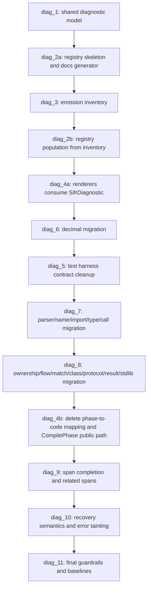

# Ad-Hoc Phase: Semantic Diagnostic Code Taxonomy and Structured HIR Diagnostics

## Objective

Replace the current phase-level `SIFR-TYPE-0001` diagnostic bucket with a precise, structured, stable diagnostic system across parser, HIR/lowering/type-check, ownership, import, control-flow, decimal, codegen, build, and workspace errors.

Sifr is not production-released yet. This phase intentionally does not preserve old diagnostic-code compatibility. The goal is the clean target architecture for an elegant language and compiler, not a migration layer around historical behavior.

## Relationship to Existing Roadmap

This ad-hoc phase is a corrective addendum to Phase 27, especially `milestone_27_4` (structured diagnostic schema quality) and `milestone_27_5` (bounded multi-error recovery).

Phase 27 is currently documented as completed, but the implementation still has string-oriented HIR diagnostics, phase-derived public codes, message-prefix classifiers, and spanless frontend semantic diagnostics. This phase should explicitly amend the Phase 27 exit gate rather than pretending it is independent work.

Required roadmap/doc treatment:

- Update `internal_docs/phases/27_diagnostics_error_recovery_and_stability_contract.md` to state that this ad-hoc phase completes the corrected diagnostic-code taxonomy and structured HIR diagnostic contract.
- Update `internal_docs/roadmap.md` so Phase 27 stays completed but is explicitly marked as amended by this ad-hoc phase. Do not reopen Phase 27; this phase is a corrective addendum that re-closes the diagnostic contract without invalidating later completed work.
- Update `internal_docs/architecture.md` to replace the older `E####`/`W####` diagnostic-code contract with the `SIFR-<FAMILY>-dddd` contract defined here.
- Any later phase depending on stable diagnostics must treat this ad-hoc phase as the prerequisite, not the current incomplete Phase 27 state.

## Problem

Today, almost every frontend semantic failure is reported as:

```text
SIFR-TYPE-0001
```

That includes unrelated failures such as:

- Type mismatches
- Undefined variables and functions
- Invalid imports
- Use-after-move
- Borrow escape
- Non-exhaustive matches
- Invalid decimal literals
- Wrong call arity
- Missing fields
- Invalid iterator protocol methods
- Break/continue outside loops
- Result/Option misuse
- Stdlib static API contract errors

The implementation root cause is architectural:

- HIR lowering emits mostly string diagnostics through `LoweringError { message, line, col }`.
- The driver wraps every HIR lowering error as `CompilePhase::TypeCheck`.
- `CompilePhase::TypeCheck` maps to `SIFR-TYPE-0001`.
- Decimal-specific pseudo-codes such as `[E2501]` are embedded in the message instead of being the top-level diagnostic identity.

This makes diagnostic codes too coarse for:

- Stable error documentation.
- LSP and editor tooling.
- Structured quick fixes.
- Diagnostic analytics.
- Precise regression locking.
- User searchability.
- Compact/json/human renderer equivalence.

## Design Principle

A diagnostic code identifies the kind of user-facing compiler error, not merely the compiler phase that noticed it.

`SIFR-TYPE-0001` must not remain a general semantic fallback. If a diagnostic is emitted, it must carry a specific code at the emission site or through a typed diagnostic helper that encodes the category.

## Diagnostic Identity Policy

Codes should be stable, specific, and useful without becoming one-code-per-wording.

Use a distinct code when any of these are true:

- The user action required to fix the error is materially different.
- Documentation should explain a different language rule.
- Tooling or LSP behavior would branch differently.
- Recovery or follow-on diagnostic suppression should treat the condition differently.
- The diagnostic belongs to a different semantic subsystem.

Do not create a distinct code only because:

- The rendered sentence has different dynamic values.
- The same language rule appears in a different syntactic form.
- The same call validation failure happens for a different stdlib function.

Examples:

- `undefined variable` and `undefined function` should be separate if the compiler can reliably distinguish value lookup from callable lookup and provide different help.
- `wrong argument count` can be one `SIFR-CALL-*` code across functions, with structured fields for callable name, expected shape, and actual count.
- `use after move`, `double mutable borrow`, and `borrowed parameter escape` must be separate ownership codes because the fix strategies differ.
- `non-exhaustive enum match` and `non-exhaustive union match` may share a code only if the docs, related spans, and fix strategy are intentionally identical; otherwise split them.

## Non-Goals

- Preserve current `SIFR-TYPE-0001` compatibility.
- Preserve message-embedded pseudo-codes such as `[E2501]`.
- Add a string-prefix-to-code classifier.
- Add compatibility aliases for old codes.
- Keep old baselines as accepted alternatives.
- Keep phase-derived public diagnostic identity.

## Proposed Diagnostic Families

Use stable code families by semantic domain. The family prefix is the namespace; the four-digit suffix is local to that family and does not reserve or consume a global numeric range.

| Family | Local range | Domain |
| --- | --- | --- |
| `SIFR-PARSE-*` | `0000..9999` | Syntax/parser errors |
| `SIFR-NAME-*` | `0000..9999` | Name resolution, undefined symbols, module member lookup |
| `SIFR-IMPORT-*` | `0000..9999` | Import form and intrinsic import policy errors |
| `SIFR-TYPE-*` | `0000..9999` | Type mismatch, annotation mismatch, union narrowing, generic constraints |
| `SIFR-DECIMAL-*` | `0000..9999` | Decimal and bigdecimal exact numeric diagnostics |
| `SIFR-CALL-*` | `0000..9999` | Arity, keyword, callable shape, argument convention errors |
| `SIFR-OWN-*` | `0000..9999` | Move, borrow, escape, mutability, ownership diagnostics |
| `SIFR-FLOW-*` | `0000..9999` | Break/continue, reachable flow, return completeness |
| `SIFR-MATCH-*` | `0000..9999` | Pattern matching, exhaustiveness, invalid fields, guards |
| `SIFR-PROTO-*` | `0000..9999` | Protocol implementation, iterator, reversible, context-manager contracts |
| `SIFR-CLASS-*` | `0000..9999` | Class fields, constructors, inheritance, auto-init diagnostics |
| `SIFR-RESULT-*` | `0000..9999` | Result/Option handling, unused Result, invalid error types, raise semantics |
| `SIFR-STDLIB-*` | `0000..9999` | Stdlib-specific static API contract errors |
| `SIFR-WORKSPACE-*` | `0000..9999` | Workspace/project discovery and module graph |
| `SIFR-CODEGEN-*` | `0000..9999` | HIR-to-Rust/codegen failures |
| `SIFR-BUILD-*` | `0000..9999` | Rustc/build/materialization failures |
| `SIFR-INTERNAL-*` | `0000..9999` | Internal compiler failures after panic/error boundaries |

`SIFR-TYPE-*` should remain only for real type-system failures. It must not be used for imports, ownership, name resolution, class initialization, protocol checks, or stdlib API contract failures unless the category is genuinely type-system-specific.

New families are added by introducing a new `SIFR-<FAMILY>-*` namespace in the registry. This does not require finding unused space in a global `0000..9999` range.

Family names are uppercase ASCII letters, 3-12 characters, with no digits. Abbreviations should be avoided unless they are part of the initial allowlist: `PARSE`, `NAME`, `IMPORT`, `TYPE`, `DECIMAL`, `CALL`, `OWN`, `FLOW`, `MATCH`, `PROTO`, `CLASS`, `RESULT`, `STDLIB`, `WORKSPACE`, `CODEGEN`, `BUILD`, and `INTERNAL`. New families require a registry PR that adds the family entry, reserves the local `0000` base, and introduces at least one active code with a fixture. Retired families remain documented in the registry; a retired family is never reused for a different domain.

The full diagnostic string is the identity. Numeric suffixes are family-local and intentionally human-readable; uniqueness is required only for the complete `SIFR-<FAMILY>-dddd` code.

Existing workspace codes such as `SIFR-WORKSPACE-0101` can remain if they describe the target rule cleanly. They no longer need renumbering merely to fit a global range.

Per-family numbering convention:

- The family base is reserved and not used for an active diagnostic.
- The first active code in a family is usually `0001`, for example `SIFR-NAME-0001`.
- Reserved and retired codes remain in the registry so the gap is intentional.
- A family can reserve semantic sub-ranges locally, for example `SIFR-STDLIB-0100..0149` for one stdlib module. These local sub-ranges have no meaning outside that family.

Family ownership rules for overlaps:

- Callable arity, duplicate argument, unexpected keyword, and parameter-convention errors are `SIFR-CALL-*` regardless of whether the callable is a free function, method, constructor, or stdlib function.
- Missing or malformed protocol methods are `SIFR-PROTO-*`; ordinary missing class fields or constructors are `SIFR-CLASS-*`.
- Generic bound/conformance failures are `SIFR-PROTO-*` when the failure is about satisfying a protocol, and `SIFR-TYPE-*` when the failure is about ordinary type compatibility.
- Stdlib static API errors are `SIFR-STDLIB-*` only when the rule is specific to a stdlib module contract; ordinary type or call errors inside stdlib calls use `SIFR-TYPE-*` or `SIFR-CALL-*`.
- Module resolution diagnostics use `SIFR-IMPORT-*` when the failure is about import statement form, imported symbol selection, or import policy. They use `SIFR-WORKSPACE-*` when the failure is about workspace/project layout, module graph construction, package roots, or filesystem discovery.
- Each stdlib module should receive a reserved contiguous local sub-range, preferably 50 codes at a time, tracked in the diagnostic registry.

Generic examples:

- `def f[T: Comparable](x: T)` called with a non-`Comparable` class is `SIFR-PROTO-*`.
- `def f(x: int)` called with `str` is `SIFR-TYPE-*`.
- A generic instantiation conflict, such as `T` inferred as `str` but a branch returning `int`, is `SIFR-TYPE-*` unless the failure is specifically a protocol-bound violation.

Existing code renumbering:

| Existing code | New code policy |
| --- | --- |
| `SIFR-PARSE-0001` | Reserved meaning only: opaque parser error with no upstream classification. It must not be used when a more specific parser condition is detectable, and guardrails must reject it as a default parser emission code. |
| `SIFR-TYPE-0001` | Retired as a public catch-all and never reused. New type diagnostics start at later local codes such as `SIFR-TYPE-0002`. |
| `SIFR-CODEGEN-0001` | Retired if it is only a broad catch-all; replaced by specific `SIFR-CODEGEN-xxxx` codes assigned from the inventory. Broad unclassified failures use `SIFR-INTERNAL-*`. |
| `SIFR-BUILD-0001` | Retired if it is only a broad catch-all; replaced by specific `SIFR-BUILD-xxxx` codes assigned from the inventory. Broad unclassified failures use `SIFR-INTERNAL-*`. |
| `SIFR-WORKSPACE-0001..0103` | Each existing code must be reviewed during registry population. It remains active only if it describes a precise workspace rule; otherwise it is retired and replaced within the `SIFR-WORKSPACE-*` namespace. |
| Message-embedded `[E25xx]` | Retired; converted to top-level `SIFR-DECIMAL-xxxx` codes. |

## Documentation URL Policy

Use one canonical URL form:

```text
https://sifr.sh/docs/errors/<CODE>
```

The URL is derived from the code and must not be hand-written at emission sites. Documentation URLs and filenames use the canonical uppercase code form, for example `https://sifr.sh/docs/errors/SIFR-NAME-0001` and `docs/errors/SIFR-NAME-0001.md`. The URL is case-sensitive; generated filenames must match canonical code casing even on case-insensitive filesystems. Any historical `sifr.dev` references should be updated or removed as part of this phase.

## Decimal Code Migration

The existing decimal pseudo-code intent should become real top-level diagnostic codes:

| New code | Meaning |
| --- | --- |
| `SIFR-DECIMAL-0001` | Invalid `Decimal(...)` exact literal |
| `SIFR-DECIMAL-0002` | Invalid `BigDecimal(...)` exact literal |
| `SIFR-DECIMAL-0003` | Float mixed with decimal numeric type |
| `SIFR-DECIMAL-0004` | Decimal and bigdecimal mixed arithmetic |
| `SIFR-DECIMAL-0005` | Decimal float construction/conversion forbidden |
| `SIFR-DECIMAL-0006` | BigDecimal float construction/conversion forbidden |
| `SIFR-DECIMAL-0007` | Decimal scale argument invalid |
| `SIFR-DECIMAL-0008` | Bigdecimal scale/context invalid |

The rendered message must not include `[E2501]`-style secondary codes after this migration.

## Target Architecture

Introduce one canonical diagnostic model that is available before driver rendering and shared by the parser adapter, type system, HIR, codegen, driver, CLI, and future tooling.

Required placement:

```text
crates/sifr_diagnostics
```

Do not place the canonical diagnostic model in `sifr_driver`, `sifr_hir`, or the planned-but-not-yet-present `sifr_frontend` crate.

The model should distinguish source diagnostics from internal diagnostics so source-originated diagnostics cannot silently omit spans:

```rust
pub enum SifrDiagnostic {
    Source(SourceDiagnostic),
    Internal(InternalDiagnostic),
}

pub struct SourceDiagnostic {
    pub code: DiagnosticCode,
    pub severity: Severity,
    pub message: String,
    pub message_template: &'static str,
    pub args: BTreeMap<String, DiagnosticArg>,
    pub primary_span: SourceSpan,
    pub related_spans: Vec<RelatedSpan>,
    pub children: Vec<DiagnosticChild>,
    pub help: Option<String>,
    pub suggestions: Vec<DiagnosticSuggestion>,
}

pub struct InternalDiagnostic {
    pub code: DiagnosticCode,
    pub severity: Severity,
    pub message: String,
    pub message_template: &'static str,
    pub args: BTreeMap<String, DiagnosticArg>,
    pub children: Vec<DiagnosticChild>,
    pub help: Option<String>,
}

pub struct DiagnosticChild {
    pub severity: ChildSeverity,
    pub message: String,
}

pub enum DiagnosticArg {
    String(String),
    Signed(i64),
    Unsigned(u64),
    Float(f64),
    Bool(bool),
}

pub enum ChildSeverity {
    Note,
    Help,
}
```

`DiagnosticCode` should be a typed enum or strict newtype with named constants. It must not be a loose string passed around unchecked at arbitrary call sites.

`message` is the rendered user-facing text. `message_template` is the stable grouping key for recovery and compact rendering. It must not contain dynamic identifiers, type names, counts, paths, or literal values. This prevents compact grouping and recovery limits from depending on incidental user-specific strings.

Example:

```rust
SifrDiagnostic::Source(SourceDiagnostic {
    code: DiagnosticCode::TYPE_ASSIGNMENT_MISMATCH,
    severity: Severity::Error,
    message: "type mismatch: expected 'int', got 'str'".to_string(),
    message_template: "type mismatch: expected {expected}, got {actual}",
    args: BTreeMap::from([
        ("expected".to_string(), DiagnosticArg::String("int".to_string())),
        ("actual".to_string(), DiagnosticArg::String("str".to_string())),
    ]),
    primary_span: span,
    related_spans: Vec::new(),
    children: Vec::new(),
    help: None,
    suggestions: Vec::new(),
})
```

`message_template` uses named braces such as `{expected}` and `{actual}`. Literal braces are escaped as `{{` and `}}`. `args` stores scalar named dynamic values so JSON consumers can re-render or inspect diagnostics without parsing `message`.

Template syntax is intentionally small: a placeholder is `{<name>}` where `<name>` matches `[a-z][a-z0-9_]*`. Formatting specifiers, positional placeholders, nested placeholders, and whitespace inside braces are not supported. A name may appear multiple times. Registry loading validates that every placeholder has a matching scalar `args` key and that every declared arg is either used in the template or explicitly marked as JSON-only metadata.

JSON output should use a versioned envelope:

```json
{
  "version": 1,
  "diagnostics": []
}
```

The checked-in schema must describe the envelope and the diagnostic payloads. The envelope version is the only schema version; individual diagnostics do not carry a second version number.

HIR should stop exposing:

```rust
pub struct LoweringError {
    pub message: String,
    pub line: Option<u32>,
    pub col: Option<u32>,
}
```

and instead use an accumulator model that supports bounded multi-error recovery:

```rust
pub struct LoweringOutcome {
    pub result: LoweringResult,
    pub diagnostics: Vec<SifrDiagnostic>,
}
```

`LowerCtx::emit(...)` collects diagnostics while lowering continues through recoverable errors. The driver decides whether to continue to codegen by checking whether the accumulated diagnostics contain `Severity::Error`.

The driver must stop assigning public codes from `CompilePhase`. `CompilePhase` and the phase-derived `Display` implementation should be retired, not preserved as a public diagnostic abstraction.

## Existing Surface Inventory

Before migration starts, build an explicit inventory of every current diagnostic emission surface:

- `LowerCtx::error(...)` call sites in `crates/sifr_hir/src/lower/`.
- `LoweringError` construction and tests in `crates/sifr_hir`.
- `sifr_type_system::TypeError` and `TypeErrorKind`.
- Decimal pseudo-code strings emitted by `sifr_type_system::check`.
- Parser-to-`CompileError` conversion paths in `sifr_driver`.
- Project/workspace discovery diagnostics.
- Workspace diagnostic code inference in `CompileError::workspace_diagnostic_code`.
- Build/materialization/rustc diagnostics.
- Codegen panic and error boundaries.
- Test-runner diagnostics.
- CLI renderer tests that manually construct `CompilerDiagnostic`.
- E2E expectation parsing that currently accepts `[Edddd]` message pseudo-codes.
- Verification baselines under `crates/sifr/tests/verification`.

Each inventory row should record:

- Current source file and call site.
- Current message shape.
- New diagnostic code.
- Diagnostic family.
- Span source.
- Related-span opportunities.
- Whether recovery should continue after the diagnostic.
- Fixture/baseline that locks it.

This inventory is not a compatibility table. It is a migration worklist used to ensure no raw diagnostic path survives.

## Dependency Ownership

Add `sifr_diagnostics` as a leaf crate that depends only on serialization and source-position primitives:

```text
sifr_diagnostics
  <- sifr_type_system
  <- sifr_hir
  <- sifr_codegen
  <- sifr_driver
  <- sifr
```

Expected dependency updates:

- Add `crates/sifr_diagnostics` to the workspace.
- Add `sifr_diagnostics` as a workspace dependency.
- Make `sifr_type_system`, `sifr_hir`, `sifr_codegen`, `sifr_driver`, and the CLI depend on it.
- Re-export diagnostic types from `sifr_driver` only as a temporary internal convenience during the same phase, not as the owning definition. Any re-exports must be removed by `diag_4b`.
- Do not make `sifr_diagnostics` depend on HIR, codegen, driver, parser, or CLI crates.

`sifr_diagnostics` may depend on `serde` and `ruff_text_size` if spans carry byte ranges. It should not depend on `sifr_python_ast`; AST-specific span extraction belongs in frontend/HIR adapters.

## Type System Integration

`sifr_type_system` is in scope for this phase.

The existing `TypeError` and `TypeErrorKind` are already a partial typed diagnostic model, but they lack spans, stable public codes, and the canonical renderer schema. They should be retired in favor of direct `SifrDiagnostic` emission from type-system helpers.

Acceptable implementation shapes:

- Type-checking helpers return `Result<T, SifrDiagnostic>`.
- Type-checking helpers accept a `DiagnosticSink` and emit `SifrDiagnostic` values directly.

Do not add `impl From<TypeError> for SifrDiagnostic` as the long-term design. That recreates a hidden classifier layer and conflicts with the no-fallback rule. A short-lived mechanical adapter is acceptable only inside a single migration PR and must be deleted before the milestone is complete.

## Diagnostic Builder API

HIR lowering should emit diagnostics through typed helpers close to the checker code:

```rust
ctx.emit(Diagnostic::undefined_variable(name, span));
ctx.emit(Diagnostic::type_mismatch(expected, actual, span));
ctx.emit(Diagnostic::wrong_arg_count(callable, expected, actual, span));
ctx.emit(Diagnostic::use_after_move(name, span));
ctx.emit(Diagnostic::borrow_escape_return(name, span));
ctx.emit(Diagnostic::non_exhaustive_match(subject_type, uncovered, span));
```

The end state is that a generic `ctx.error(String)` does not exist for user-facing diagnostics. If a helper is missing, the implementation should add the helper and assign the code deliberately.

## Span Policy

Source-originated semantic diagnostics should have source spans.

Policy:

- Parser diagnostics must carry parse source location where available.
- HIR/lowering/type-check diagnostics must carry `primary_span` when emitted from an AST node with a range.
- Workspace diagnostics should carry file paths where known.
- Codegen diagnostics should preserve original source mapping where available.
- Internal compiler diagnostics may omit source spans only when no source mapping exists.

Current `primary_span: null` output for frontend semantic errors is incomplete and should be fixed as part of this phase.

## Source Mapping Architecture

Do not store only line and column in semantic diagnostics. The compiler should preserve byte ranges from the parser and derive line/column at render or serialization boundaries.

Target representation:

```rust
pub struct SourceId; // Opaque, cheaply cloneable implementation detail.

pub struct SourceSpan {
    pub source_id: SourceId,
    pub range: TextRange,
}

pub struct DiagnosticSpan {
    pub file: Option<String>,
    pub byte_start: u32,
    pub byte_end: u32,
    pub line: Option<u32>,
    pub column: Option<u32>,
    pub end_line: Option<u32>,
    pub end_column: Option<u32>,
}
```

The frontend/driver should own a source map for each compilation unit:

- Source text.
- Canonical file path when available.
- Module name.
- `SourceId`.
- Ruff `SourceFile` or equivalent line-index data.

HIR diagnostics should carry `SourceSpan` where possible. The driver should lower `SourceSpan` to serialized `DiagnosticSpan` with line/column and end-line/end-column. This keeps HIR independent from file-system rendering while preserving exact source ranges.

For project compilation, source ids must remain module-specific so imported module diagnostics point at the imported file, not the entrypoint.

Synthesized HIR nodes inherit the `SourceSpan` of their nearest parser-origin ancestor. The parser-to-HIR adapter must guarantee a real source span before lowering emits user-facing diagnostics. Diagnostics that truly have no real source mapping are internal compiler diagnostics and use `SIFR-INTERNAL-*`; do not fabricate a source span.

Codegen diagnostics with source mappings are `SourceDiagnostic` values. Codegen failures without a source mapping are treated as internal failures and use `SIFR-INTERNAL-*`, with the codegen context included as a child note where useful.

## Milestones

### milestone_diag_1: Shared Diagnostic Model

Scope:

- Add `crates/sifr_diagnostics`.
- Move or recreate the canonical diagnostic structures there.
- Define `DiagnosticCode`, `Severity`, spans, related spans, children, help, and structured suggestions.
- Derive documentation URLs from the diagnostic code.
- Make JSON serialization lossless for the canonical model.
- Add `SourceId`, `SourceSpan`, and range-preserving span primitives.
- Add a versioned JSON envelope `{ "version": 1, "diagnostics": [...] }`.
- Add a checked-in JSON Schema generated from the canonical Rust types, using `schemars` or equivalent.
- Restrict diagnostic children to `Note` and `Help` through a `ChildSeverity` type.
- Define the canonical top-level `Severity` enum exactly as `Error | Warning | Note`; internal diagnostics use `Severity::Error`. Help text is represented through `help` fields or `ChildSeverity::Help`, not as standalone top-level diagnostics.
- Add the canonical `LoweringOutcome` and `DiagnosticSink` types alongside the existing `LoweringError`. `LoweringError` becomes private transitional plumbing only and is removed from user-facing paths in `milestone_diag_4a`.

Definition of done:

- `crates/sifr_diagnostics` is a workspace member with workspace lints and no Sifr-internal dependencies.
- Parser adapters, `sifr_type_system`, HIR, codegen, driver, and CLI can depend on the shared diagnostic model without dependency cycles.
- The driver no longer owns the only structured diagnostic type.
- URL derivation is centralized.
- The diagnostic model includes a stable grouping key distinct from rendered messages.
- The diagnostic model preserves source byte ranges before line/column rendering.
- Lossless JSON means round-trip identity for diagnostics, explicit `null` fields where applicable, deny-unknown-fields deserialization for consumed payloads, and a schema-regeneration check.
- Source diagnostics cannot be constructed without a `SourceSpan`.
- Top-level diagnostics cannot use `Severity::Help`.

### milestone_diag_2a: Diagnostic Registry Skeleton

Scope:

- Add a checked-in diagnostic registry.
- Define code family namespaces, the per-family local `0000..9999` convention, and initial reserved codes.
- Define the registry record shape.
- Make `crates/sifr_diagnostics/src/codes.rs` the source of truth.
- Add documentation generation from the code registry rather than hand-maintaining divergent docs.
- Add the generator binary `cargo run -p sifr_diagnostics --bin gen-error-docs`.
- Add or define the docs drift check, for example `scripts/check_diagnostic_docs_sync.py`.
- The initial generated docs may contain only family reservations and skeleton output; active code pages are populated in `milestone_diag_2b`.

Recommended files:

```text
internal_docs/diagnostic_codes.md
docs/errors/diagnostic-codes.md
crates/sifr_diagnostics/src/codes.rs
```

Definition of done:

- The registry skeleton exists with families, the per-family numbering convention, state machine, and reserved family bases (`0000` per family).
- Registry and code constants cannot silently diverge.
- The registry records `id`, `family`, `summary`, `state` (`Active | Reserved | Retired`), docs path, representative fixture path, message template, and owner module.
- The docs generator writes `docs/errors/<CODE>.md`, `docs/errors/diagnostic-codes.md`, and `internal_docs/diagnostic_codes.md` from `crates/sifr_diagnostics/src/codes.rs`.
- CI or local validation can run the generator and fail on drift with `git diff --exit-code`.

### milestone_diag_3: Diagnostic Emission Inventory

Scope:

- Inventory every current diagnostic emission surface.
- Assign each current user-facing diagnostic to a new code family and proposed code.
- Identify diagnostics that are currently emitted from the wrong layer.
- Identify diagnostics that need related spans or source-map work.
- Identify tests and baselines that must change.
- Identify expected recovery behavior for each diagnostic category.

Definition of done:

- The inventory covers all raw HIR `ctx.error(...)` call sites.
- The inventory covers all `CompileError` construction paths.
- The inventory covers all `sifr_type_system::TypeError` and `TypeErrorKind` variants.
- The inventory covers e2e expectation parsing and verification baselines.
- No diagnostic category is migrated without a known target code and fixture plan.

### milestone_diag_2b: Diagnostic Registry Population

Scope:

- Populate active codes from the diagnostic emission inventory.
- Add docs metadata, message templates, owner modules, and fixture paths for active codes.
- Mark intentionally future codes as reserved and previously superseded codes as retired.
- Review each existing `SIFR-WORKSPACE-0001..0103` code against the diagnostic identity policy. Mark any code that fails the policy as retired and replace it with a precise code in the same family.

Definition of done:

- Every emitted code exists in the registry.
- Every active registry code has a fixture or is explicitly marked reserved.
- Every active code has a docs page under `docs/errors/<CODE>.md`; reserved codes are exempt.
- The registry population matches the checked-in inventory.
- Every existing workspace code has either an active registry entry with a precise rule and docs page, or a retired registry entry with its replacement code recorded.

### milestone_diag_4a: Renderer Integration

Scope:

- Update human, compact, and JSON renderers to consume `SifrDiagnostic`.
- Any still-unmigrated legacy path is explicitly temporary, tracked by the inventory, and blocked from gaining new emission sites.
- Keep exit-code behavior stable, but base rendering on diagnostic identity.
- Ensure compact grouping uses `(severity, code, message_template, primary file)`.
- Remove workspace message-prefix code inference such as `message.starts_with("could not resolve import ")`.
- Migrate parser adapters, workspace/project discovery, codegen boundaries, build/materialization/rustc diagnostics, and test-runner diagnostics that are already covered by the inventory into `SifrDiagnostic` transport.
- Replace user-facing `LoweringError { message, line, col }` paths with `LoweringOutcome` and `DiagnosticSink`.

Definition of done:

- All renderers operate on `SifrDiagnostic` exclusively.
- Renderers do not parse messages to recover codes.
- JSON, human, and compact render from the same canonical diagnostics.
- HIR user-facing diagnostics no longer leave HIR as `LoweringError { message, line, col }`.

### milestone_diag_5: Test Harness Contract Cleanup

Scope:

- This milestone lands after `milestone_diag_6` so decimal pseudo-code emission has already moved to canonical `SIFR-DECIMAL-*` codes.
- Update e2e expectation parsing to accept only canonical `SIFR-<FAMILY>-dddd` codes.
- Remove acceptance of bare `[Edddd]` pseudo-codes.
- Update failure aggregation and diagnostics comparison to use structured diagnostic codes.
- Update renderer unit tests so hand-built diagnostics use real new-family codes.
- Add a negative unit test proving `[E2507]` is rejected as an expectation code.
- Validate fixture-asserted codes against the registry at harness load time, not by regex alone. Unknown codes fail loudly with the unknown code and a closest-match hint.

Definition of done:

- Tests cannot accidentally bless message-embedded pseudo-codes.
- E2E fail fixtures must assert only top-level code strings, never message-embedded pseudo-codes.
- The harness no longer normalizes or extracts secondary codes from diagnostic messages.
- No transitional `[Edddd]` expectation remains after this milestone, and this milestone must not introduce new `SIFR-TYPE-0001` expectations to replace decimal pseudo-code expectations.

### milestone_diag_6: Decimal Diagnostics First Migration

Scope:

- Convert existing decimal pseudo-codes to real top-level `SIFR-DECIMAL-000x` codes per the Decimal Code Migration table.
- Remove `[E25xx]` from messages.
- Update decimal e2e expectations and verification baselines.
- Replace decimal pseudo-code emission in `sifr_type_system::check`, especially mixed decimal arithmetic checks.

Definition of done:

- No decimal diagnostic emits `SIFR-TYPE-0001`.
- No decimal diagnostic message embeds `[E25xx]`.
- Existing decimal negative cases preserve message clarity and become structurally identifiable by code.
- Decimal e2e fixtures and verification baselines are updated in this milestone, not deferred.

### milestone_diag_7: Parser, Name, Import, Type, and Call Diagnostics

Scope:

- Map upstream Ruff-fork parser error categories to distinct `SIFR-PARSE-*` codes where the parser exposes a condition category.
- Replace broad parser emission with category-specific codes for all parser conditions identified in `milestone_diag_3`.
- Keep `SIFR-PARSE-0001` only for the reserved opaque-parser-error meaning, and guardrail it against use as a default parser code.
- Convert common frontend semantic errors to structured diagnostics:
  - Undefined variable/function.
  - Unknown generic type.
  - Missing module member.
  - Unsupported import forms.
  - Intrinsic import policy violation.
  - Type mismatch.
  - Return type mismatch.
  - Assignment type mismatch.
  - Generic bound and constraint failures.
  - Wrong argument count.
  - Unexpected keyword.
  - Duplicate keyword/positional argument.
  - Callable arity mismatch.
- Retire `sifr_type_system::TypeError` and `TypeErrorKind`. Any short-lived adapter from `TypeError` to `SifrDiagnostic` must be deleted in this milestone.

Definition of done:

- The largest e2e fail categories no longer use `SIFR-TYPE-0001`.
- Each category has a distinct code and registry entry.
- Parser diagnostics covered by the inventory use specific `SIFR-PARSE-*` codes rather than a default parser bucket.
- The type-system adapter path is gone; type-checking code emits or returns canonical diagnostics directly.
- E2E fixtures and verification baselines touched by this milestone are updated in the same milestone.

### milestone_diag_8: Ownership, Flow, Match, Class, Protocol, Result, and Stdlib Diagnostics

Scope:

- Convert remaining HIR semantic diagnostics by domain:
  - Move and borrow diagnostics.
  - Borrow escape diagnostics.
  - Mutability diagnostics.
  - Break/continue outside loop.
  - Return completeness.
  - Match exhaustiveness and guard diagnostics.
  - Class field, constructor, auto-init, inheritance diagnostics.
  - Protocol/conformance diagnostics.
  - Iterator/reversible/context-manager contract diagnostics.
  - Result/Option/raise/error-type diagnostics.
  - Stdlib static API contract diagnostics.

Definition of done:

- No user-facing semantic diagnostic remains in a generic phase bucket.
- Category names and code families match actual semantics.
- E2E fixtures and verification baselines touched by this milestone are updated in the same milestone.

### milestone_diag_4b: Phase-Mapping Retirement

Scope:

- Delete `CompilePhase::TypeCheck => "SIFR-TYPE-0001"` and the rest of the phase-derived public diagnostic-code mapping.
- Retire `CompilePhase` and the phase-derived `Display` label path from public diagnostic rendering.
- Convert `CompileError` into either a structured diagnostic wrapper or an internal boundary error that already carries `SifrDiagnostic`.
- Remove transitional `sifr_driver` re-exports of `sifr_diagnostics` types.
- Migrate any remaining non-HIR emission surface still using phase-derived codes. This milestone is residual cleanup only; new family migrations must not be deferred here.

Definition of done:

- No public diagnostic code is assigned from `CompilePhase`.
- `CompilePhase` is not a public diagnostic display source.
- `CompileError` is not a public code source.
- `sifr_driver` no longer re-exports canonical diagnostic types.

### milestone_diag_9: Source Span Completion

Scope:

- Thread AST ranges into diagnostic helpers.
- Populate `primary_span` for source-originated HIR diagnostics.
- Add related spans where they materially help, for example:
  - Previous move location.
  - Borrow origin.
  - Conflicting duplicate enum value.
  - Function parameter declaration.
  - Uncovered match variants or pattern locations.

Definition of done:

- HIR diagnostics have `primary_span` when source exists.
- Span policy is documented and regression-tested.
- JSON baselines assert spans where stable.
- Multi-file project diagnostics preserve the originating module/file.
- Rendered spans include start and end positions where source ranges are available.

This milestone completes span coverage. The source-span primitives and source-map ownership are established in `milestone_diag_1` and used by every migration milestone; this milestone closes remaining span holes rather than introducing span support late.

### milestone_diag_10: Recovery Semantics and Error Tainting

Scope:

- Preserve bounded multi-error recovery while moving to structured diagnostics.
- Define which diagnostics produce a typed error expression or poisoned binding to prevent cascades.
- Define deduplication and prioritization in terms of diagnostic code and `message_template`.
- Ensure follow-on diagnostics do not hide the root cause or flood compact/json output.
- Define cap-overflow behavior for notes and warnings, including `reveal_type(...)`.

Definition of done:

- Recovery behavior is explicitly encoded for name, type, call, ownership, match, and stdlib diagnostics.
- Multi-error fixtures still report useful independent errors.
- Cascading diagnostics caused only by earlier invalid expressions are suppressed or demoted by policy.
- Existing recovery hard limits remain enforced using structured diagnostic identity.
- A fixture with more than 50 `reveal_type(...)` calls proves the chosen overflow behavior.

### milestone_diag_11: Guardrails and Baseline Regeneration

Scope:

- Update all e2e fail annotations.
- Update all verification baselines.
- Add guardrail tests.
- Update architecture and phase docs.
- Add or update `scripts/check_diagnostic_code_coverage.py`.
- Add registry/docs sync enforcement.

Required guardrails:

- No user-facing semantic diagnostic may use `SIFR-TYPE-0001` as a catch-all.
- No diagnostic message may begin with or include a message-embedded `[Edddd]` pseudo-code.
- Every emitted diagnostic code must exist in the registry.
- Every emitted diagnostic must derive a deterministic docs URL from its code.
- Every active registry code must have fixture coverage or be explicitly marked reserved.
- HIR user diagnostics must not be emitted through raw `ctx.error(String)`.
- No renderer or driver code may infer diagnostic codes from message prefixes.
- No compact/recovery grouping may use fully rendered messages when a `message_template` is available.
- Parser/HIR/codegen diagnostics with a source range must serialize non-null primary spans.
- The e2e harness must reject `[Edddd]` expectation codes.
- The codebase must have no user-facing `LoweringError { message, line, col }` style path.
- `crates/sifr/tests/e2e.rs` no longer has `is_message_error_code` or `diagnostic_error_code`.
- Active registry codes have representative fixture coverage.
- Active registry codes have generated docs pages.
- The JSON schema is checked in and synchronized with the Rust model.

Definition of done:

- The full local validation gate passes.
- Baselines reflect only the new diagnostic architecture.
- No compatibility tests assert old code behavior.

## Sequencing



The sequencing graph is authoritative. `diag_2b` intentionally follows `diag_3` because registry population depends on the completed inventory, and `diag_6` intentionally lands before `diag_5` so test-harness cleanup does not need a transitional `[Edddd]` or `SIFR-TYPE-0001` fixture state.

No migration milestone is complete until its fixtures, verification baselines, and focused tests are green with the new codes. The final guardrail milestone should contain residual cleanup and new enforcement checks, not defer all fixture churn.

## Initial Code Examples

Examples of desired code assignment:

| Current message shape | New code |
| --- | --- |
| `undefined variable: 'x'` | `SIFR-NAME-0001` |
| `undefined function: 'foo'` | `SIFR-NAME-0002` |
| `unknown generic type: 'UnknownType'` | `SIFR-NAME-0003` |
| `module 'sifr.math' has no member 'nonexistent_func'` | `SIFR-NAME-0004` |
| `cannot import from '_sifr.io' ...` | `SIFR-IMPORT-0001` |
| `type mismatch: expected 'int', got 'str'` | `SIFR-TYPE-0002` |
| `if expression branches have incompatible types...` | `SIFR-TYPE-0003` |
| `type 'Blob' does not implement protocol 'Comparable'...` | `SIFR-PROTO-0001` |
| `sqrt() takes at most 1 argument(s), got 2` | `SIFR-CALL-0001` |
| `got an unexpected keyword argument` | `SIFR-CALL-0002` |
| `use of moved value: 's'` | `SIFR-OWN-0001` |
| `cannot borrow ... as mutable more than once` | `SIFR-OWN-0002` |
| `cannot return borrowed parameter...` | `SIFR-OWN-0003` |
| `'break' outside of loop` | `SIFR-FLOW-0001` |
| `'continue' outside of loop` | `SIFR-FLOW-0002` |
| `non-exhaustive match...` | `SIFR-MATCH-0001` |
| `match guard must be a bool expression...` | `SIFR-MATCH-0002` |
| `class has fields but no __init__...` | `SIFR-CLASS-0001` |
| `unused Result value...` | `SIFR-RESULT-0001` |
| `` `str` is not a valid error type in Result `` | `SIFR-RESULT-0002` |

These exact numbers are the proposed starting point. They can be adjusted during `milestone_diag_2b`, but the final registry must be internally consistent and directly implemented without compatibility aliases.

## Validation Plan

Run focused checks while developing:

```bash
cargo test -p sifr_driver diagnostics
cargo test -p sifr -- test_e2e_fail
cargo run -q -p sifr -- --diagnostic-format json check crates/sifr/tests/e2e/fail/type_mismatch.sifr
cargo run -q -p sifr -- --diagnostic-format compact check crates/sifr/tests/e2e/fail/type_mismatch.sifr
cargo run -p sifr_diagnostics --bin gen-error-docs -- --check
python3 scripts/check_diagnostic_docs_sync.py
python3 scripts/check_diagnostic_code_coverage.py
```

Before considering the phase complete:

```bash
scripts/run_all_tests.sh --profile quick
scripts/run_all_tests.sh
cargo clippy --workspace -- -D warnings
cargo fmt --check
python3 scripts/check_hir_maintainability_guardrails.py
python3 scripts/check_diagnostic_docs_sync.py
python3 scripts/check_diagnostic_code_coverage.py
```

The diagnostic docs and coverage checks must be wired into `scripts/run_all_tests.sh` so local validation and CI stay identical.

## Required Documentation Updates

| File | Required update |
| --- | --- |
| `internal_docs/architecture.md` | Replace the old `E####`/`W####` diagnostic code contract with `SIFR-<FAMILY>-dddd`; document `sifr_diagnostics`; clarify that `sifr_frontend` is separate future query architecture. |
| `internal_docs/phases/27_diagnostics_error_recovery_and_stability_contract.md` | Mark this ad-hoc phase as the corrective completion for structured diagnostic code taxonomy and HIR diagnostics. |
| `internal_docs/roadmap.md` | Keep Phase 27 completed but mark it as amended by this ad-hoc phase after completion. |
| `internal_docs/diagnostic_codes.md` | Generated or synchronized from the registry source of truth. |
| `docs/errors/diagnostic-codes.md` | Generated or synchronized from the registry source of truth. |
| `docs/errors/<CODE>.md` | One generated or checked-in page for every active diagnostic code. |
| `issues/ad-hoc-semantic-diagnostic-code-taxonomy-and-structured-hir-diagnostics.md` | Keep milestone status and validation evidence current while work proceeds. |

## Stability Policy

Pre-1.0 stability means diagnostic codes can be renamed, split, or retired only through an explicit registry change accompanied by fixture, baseline, and docs updates in the same milestone. No compatibility aliases are required before public release.

Post-1.0 stability begins at the first documented stable Sifr release, expected to align with Phase 39 stable-channel GA. After that point, active diagnostic codes are immutable public API. Retired codes remain documented as retired, and new categories receive new codes.

## Hard Rules

- Do not preserve `SIFR-TYPE-0001` compatibility.
- Do not embed secondary codes in messages.
- Do not map strings to codes after the fact.
- Do not infer codes from message prefixes.
- Do not add generic fallback diagnostics for user errors.
- Do not use `SIFR-PARSE-0001`, `SIFR-CODEGEN-0001`, `SIFR-BUILD-0001`, or any other `0001` code as a family-default catch-all unless the registry gives it a precise, guardrailed meaning.
- Do not allow spanless HIR diagnostics when the AST node has a source location.
- Do not keep old baselines as accepted alternatives.
- Do not add a historical migration layer.
- Do not use rendered diagnostic messages as stable machine identity.
- Do not define public diagnostic types outside `crates/sifr_diagnostics`.
- Do not add a diagnostic helper without a registry entry in the same PR.
- Do not allow an `expect-error` fixture annotation to use a code absent from the registry.
- Do not construct diagnostic codes with `format!` or raw strings at emission sites.
- Do not allow `Severity::Error` as a child diagnostic severity.
- Do not allow top-level `Severity::Help`; help belongs on a parent diagnostic.
- Do not use `Option<TextRange>` for parser/HIR source diagnostics when a source range exists.

Internal compiler failure boundaries are the only place where a broad code is acceptable. Those diagnostics must use `SIFR-INTERNAL-*`, must not be described as user-fixable, and must not mask a known user-input error that should have a specific code.

Internal code allocation policy:

- `SIFR-INTERNAL-0001` is the stable catch-all for unclassified compiler panics after a panic boundary.
- Dedicated `SIFR-INTERNAL-*` codes should be added for recurring known internal failure families.
- Known user-input failures must never be routed through `SIFR-INTERNAL-*`.

## Non-Error Diagnostics

`reveal_type(...)` output and compiler warnings must not remain as ad hoc stderr strings.

This phase uses one diagnostic stream for errors, warnings, and notes. Help remains attached to diagnostics through `help` fields or `ChildSeverity::Help` children:

- `reveal_type(...)` emits a `SifrDiagnostic` with `Severity::Note`.
- Compiler warnings emit `SifrDiagnostic` values with `Severity::Warning`.
- Warnings and notes appear in the same JSON envelope as errors.
- Warnings and notes participate in compact grouping by `(severity, code, message_template, primary file)`.
- Warnings do not affect the exit code; invocations with warnings only exit `0`.
- The 50 top-level recovery cap applies to all top-level diagnostics after severity ordering, while the existing user-error exit behavior remains based on whether any top-level diagnostic has `Severity::Error`.
- The cap intentionally applies to `reveal_type(...)` notes as well; explicit reveal output is still bounded to avoid unbounded diagnostic floods.
- When diagnostics are omitted because of the cap, rendering appends one structured `Severity::Note` summary such as `10 additional diagnostics omitted by recovery cap`. For `reveal_type(...)`, the summary must say how many explicit reveal results were omitted rather than silently dropping them.

This removes another side channel from frontend lowering while keeping top-level severity small and explicit.

## Phase Definition of Done

This ad-hoc phase is complete when:

- No e2e fail fixture expects `SIFR-TYPE-0001` as a catch-all.
- No JSON diagnostic uses message-embedded `[Edddd]` codes.
- Every user-facing diagnostic has a specific stable code.
- Every emitted code has a deterministic docs URL.
- HIR diagnostics are structured at emission time.
- Semantic diagnostics have primary spans where source exists.
- Compact/json/human renderers consume the same canonical diagnostic model.
- Guardrail tests prevent reintroducing phase-bucket diagnostics.
- Recovery limits and compact grouping use `message_template`, not rendered text.
- Workspace, parser, HIR, codegen, build, and internal diagnostics all have explicit typed code assignment.
- Warnings and `reveal_type` output are structured diagnostics in the canonical diagnostic stream.
- `sifr_diagnostics` is the only public owner of diagnostic types.
- `sifr_type_system::TypeError` and `TypeErrorKind` are retired or fully replaced by canonical diagnostics.
- `CompileError::workspace_diagnostic_code` and all message-prefix code classifiers are deleted.
- The e2e fixture grammar no longer accepts message pseudo-codes.
- A JSON Schema and versioned JSON envelope are checked in.
- Registry/docs synchronization is enforced.
- Active diagnostic-code fixture coverage is enforced.
- Phase 27 status in roadmap/docs reflects this corrective amendment.
- Full local validation passes.

## Risk Register

| Risk | Mitigation |
| --- | --- |
| Migration grows too large and stalls | Use the inventory as a worklist and land by diagnostic family, but keep the phase contract strict: no old-code compatibility or raw diagnostic paths after completion. |
| New taxonomy overfits current messages | Apply the diagnostic identity policy: split by rule/fix/tooling behavior, not by sentence wording. |
| Spans are deferred too late | Add source-span primitives in `milestone_diag_1`; `milestone_diag_9` only completes remaining coverage. |
| Compact grouping becomes noisy with dynamic messages | Use `message_template`, not rendered `message`, for grouping and recovery limits. |
| Driver keeps hidden message-prefix classifiers | Add guardrails forbidding renderer/driver code from inferring codes from message text. |
| Test harness continues accepting pseudo-codes | Clean up e2e expectation parsing before broad fixture migration. |
| Internal failures get confused with user errors | Restrict broad fallback-like codes to `SIFR-INTERNAL-*` after panic/error boundaries only. |
