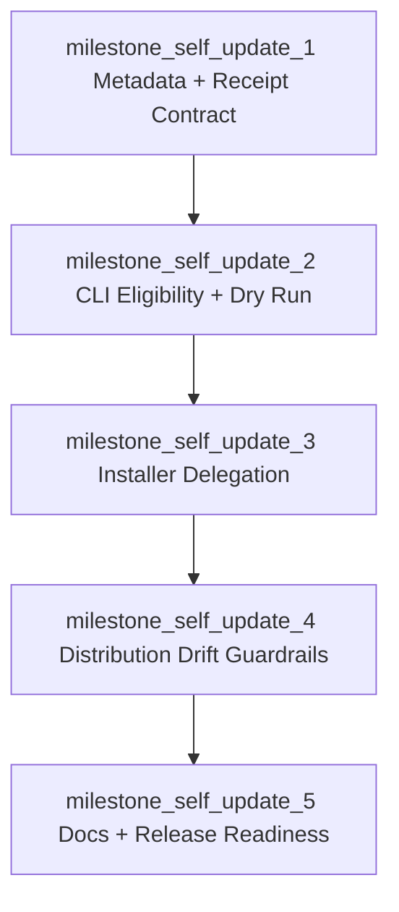

# Ad Hoc Phase: Sifr Self Update

Context: ad hoc distribution follow-up after Phase 33 preview installers and before Phase 39 stable-channel GA promotion.

Status: in progress

## Execution Status

- [x] `milestone_self_update_1` Metadata And Receipt Contract — merged in [PR #2274](https://github.com/sifr-lang/sifr/pull/2274); review artifacts: `reviews/self-update-m1-review-pass-1.md`, `reviews/self-update-m1-review-pass-2.md`, `reviews/self-update-m1-review-pass-3.md`.
- [ ] `milestone_self_update_2` CLI Eligibility And Dry Run — implementation in progress on `ad-hoc-self-update-m2`.
- [ ] `milestone_self_update_3` Installer Delegation.
- [ ] `milestone_self_update_4` Distribution Drift Guardrails.
- [ ] `milestone_self_update_5` Docs And Release Readiness.

## Objective

Add a first-class `sifr self update` workflow that lets users update a standalone-installed Sifr binary from inside the installed CLI without teaching the CLI to become a second artifact installer.

The phase is complete when a user who installed Sifr through the official standalone installer can run:

```bash
sifr self update
sifr self update --channel alpha
sifr self update --version 0.1.0-beta.2
sifr self update --dry-run
```

and get deterministic update behavior that reuses the same immutable installer and checksum validation path already owned by the distribution pipeline.

## Current State

Phase 33 shipped the installer substrate:

- public dispatchers under `https://sifr.sh/install`,
- immutable version installers under `https://sifr.sh/install/versions/<version>`,
- checksum-verified artifacts published as GitHub Release assets,
- install-state recording in `install.json`,
- atomic binary replacement by staging a temporary binary and moving it into place.

This supports updates when the user re-runs an installer. It does not provide a CLI-native update command, latest-version resolution, dry-run planning, or installed-binary eligibility diagnostics.

Astral uv's self-update flow has the product shape Sifr adopts:

- expose a `self update` command and a small `self version` command,
- require a standalone-install receipt,
- verify that the current executable is the executable described by the receipt,
- resolve latest or explicit versions before mutating,
- support dry-run output,
- delegate final installation to the standalone installer rather than duplicating all install logic.

Sifr adopts the product shape and safety properties, without copying uv implementation code.

## Source Of Truth

This file is the implementation contract for the ad hoc self-update phase until it is promoted into a numbered phase or superseded by Phase 39 stable governance.

Milestone 1 must update `internal_docs/distribution_pipeline.md` with the exact metadata, receipt, installer-lock, TLS, and CLI command contract from this file. Implementation PRs must not diverge from this file; any intended divergence requires a reviewed planning PR that changes this file before implementation.

## Depends On

- Phase 33 preview distribution and release automation.
- Existing generated installer checksum validation and atomic replacement.
- Current CLI command model in `crates/sifr`.
- Phase 39 stable-channel governance remains incomplete; stable update behavior must remain explicitly gated.

## Non-Goals And Deferrals

- Stable channel self-update before Phase 39.
- Package-manager updates for Homebrew, Cargo, apt, npm, pip, or OS package managers.
- Background update checks, telemetry, or automatic update prompts.
- Reimplementing artifact target selection, checksum verification, extraction, or shell profile editing inside the Rust CLI.
- Windows self-update support before Sifr has a Windows standalone installer contract.
- A rollback policy beyond refusing unsafe downgrades by default.
- Copying or adapting uv source code.

## Locked Product Decisions

1. The command namespace is `sifr self`.
2. The primary update command is `sifr self update`.
3. `sifr self update` only works for official standalone installs created by Sifr's installer.
4. If Sifr was installed by Cargo, Homebrew, another package manager, or an unknown manual copy, the command exits with a clear diagnostic telling the user to use that installation channel.
5. Self-update resolves a target immutable installer, then runs that installer. The CLI must not download and replace release archives directly.
6. The default update channel is the channel recorded in the install receipt. Receipts without an explicit channel are invalid for self-update.
7. `stable` and stable-looking versions remain rejected until Phase 39 changes the stable-channel contract.
8. `--dry-run` performs the same target resolution and eligibility checks as a real update, but does not run the installer.
9. Reinstalling the same version is a no-op unless `--force` is provided.
10. Downgrading requires `--force`.
11. The command must preserve the installed path from the receipt; it must not update whichever `sifr` happens to appear first on `PATH` unless that binary is the receipt-owned executable.
12. PATH modification behavior is preserved from the install receipt. Receipts without an explicit `modify_path` value are invalid for self-update.
13. Switching channels with `--channel` when the requested channel differs from the receipt channel requires `--force`.
14. Metadata must never provide executable URLs. The Rust CLI derives installer URLs from compile-time trusted base constants and resolved version strings.

## Command Contract

```text
sifr self update [--channel alpha|beta] [--version <preview-version>] [--dry-run] [--format text|json] [--force]
sifr self version [--short] [--format text|json]
```

`sifr self update` inputs:

- `--channel alpha|beta`: resolve the current version for a moving preview channel.
- `--version <preview-version>`: resolve exactly one immutable version installer.
- `--dry-run`: print the planned source version, target version, channel, installer URL, and install directory without mutation.
- `--format text|json`: format dry-run output. The flag is accepted only with `--dry-run`; real updates always preserve installer stdout/stderr as human output.
- `--dry-run` does not acquire the install lock because it performs no mutation. It can report a stale plan if a real update is running concurrently, but the real update remains protected by the install lock.
- `--force`: allow same-version reinstall or downgrade.

Invalid combinations:

- `--channel` with `--version` is rejected.
- `--format text|json` without `--dry-run` is rejected.
- `stable`, `--channel stable`, and stable-looking versions are rejected until Phase 39.
- `rc` channels and `-rc.N` version pins are rejected before Phase 39.
- Unknown channels are rejected before network requests.
- Missing or mismatched install receipts are rejected before network requests.

Successful dry-run JSON output is schema-versioned and deterministic. Dry-run obeys the same force rules as a real update, so same-version reinstall, downgrade, or channel switch plans that require `--force` fail before output when `--force` is absent.

```json
{
  "schema_version": 1,
  "current_version": "0.1.0-beta.1",
  "target_version": "0.1.0-beta.2",
  "receipt_channel": "beta",
  "requested_channel": null,
  "resolved_channel": "beta",
  "install_dir": "/Users/example/.sifr/bin",
  "binary_path": "/Users/example/.sifr/bin/sifr",
  "installer_url": "https://sifr.sh/install/versions/0.1.0-beta.2",
  "action": "update",
  "force": false,
  "would_run_installer": true,
  "warnings": []
}
```

Dry-run JSON field requirements:

- `schema_version` is exactly `1` until a reviewed output-schema bump changes this contract.
- `requested_channel` is `null` only when no `--channel` flag was provided; absent-vs-null behavior is snapshot-tested.
- `action` is one of `no_op`, `update`, `reinstall`, `downgrade`, or `channel_switch`.
- `would_run_installer` is `false` only for `no_op`; every other successful action would invoke the immutable installer in a non-dry-run execution.
- Field names, field ordering, field types, warning ordering, and absent-vs-null behavior are snapshot-tested.

`sifr self version` reports:

- current executable version,
- install receipt version,
- install directory,
- channel,
- target triple,
- whether the current executable matches the receipt.

M2 decision: `sifr self version` is part of the standalone self-update surface and therefore requires the same managed install receipt as `sifr self update`. Unmanaged installs should use `sifr --version` for the raw build version until M5 public troubleshooting docs cover package-manager installs.

The text format must be concise for humans. `--short` prints only the current executable version in text mode. `--short --format json` is rejected so the JSON contract has one stable shape.

JSON format is schema-versioned and deterministic. This `schema_version` describes the `self version` JSON output schema; it is independent of the install receipt `schema_version`.

```json
{
  "schema_version": 1,
  "current_executable": "/Users/example/.sifr/bin/sifr",
  "current_version": "0.1.0-beta.2",
  "receipt_version": "0.1.0-beta.2",
  "install_dir": "/Users/example/.sifr/bin",
  "binary_path": "/Users/example/.sifr/bin/sifr",
  "channel": "beta",
  "target": "aarch64-apple-darwin",
  "matches_receipt": true,
  "warnings": []
}
```

The JSON output test must snapshot field names, field ordering, field types, warning ordering, and absent-vs-null behavior.

## Install Receipt Contract

The generated installer must write a new schema-versioned `install.json` receipt. Existing unstable preview installs are allowed to break; users can re-run the new installer to enter the self-update-managed install contract.

Required receipt fields after this phase:

```json
{
  "schema_version": 1,
  "name": "sifr",
  "version": "0.1.0-beta.2",
  "channel": "beta",
  "target": "aarch64-apple-darwin",
  "install_dir": "/Users/example/.sifr/bin",
  "binary_path": "/Users/example/.sifr/bin/sifr",
  "artifact": "sifr-0.1.0-beta.2-aarch64-apple-darwin.tar.gz",
  "modify_path": true
}
```

Receipt validity:

- `schema_version` is required and must be exactly `1` until a reviewed schema bump changes the contract.
- All fields shown above are required. The schema file at `verification/distribution/self_update_install_receipt.schema.json` is the authoritative enumeration.
- The CLI must not infer missing receipt fields.
- Unknown receipt fields are rejected.
- Malformed, partial, or pre-schema receipts are treated as unmanaged installs and fail before network access.

Schema ownership:

- The receipt schema lives in `verification/distribution/self_update_install_receipt.schema.json`.
- The generated installer receipt writer and the Rust receipt parser must both be validated against that schema.
- Milestone 1 must include a generator-output snapshot and a Rust round-trip test for the schema-versioned shape.

Receipt discovery order:

1. `SIFR_INSTALL_MANIFEST_DIR/install.json`, if set.
2. `<current_exe_parent>/install.json`.
3. `~/.sifr/install.json` only when same-file metadata or canonicalized absolute paths prove the current executable is `~/.sifr/bin/sifr`.

Discovery must fail closed. It must not scan arbitrary parent directories or guess based on `PATH`.

Rule 3 is a diagnostic-quality affordance for the default installer layout, not an additional trust anchor. The same executable/receipt equality check is still required.

Eligibility check:

- canonicalize the receipt `binary_path` at install time before writing it when the platform can resolve the final path,
- canonicalize the current executable path during self-update and reject eligibility if canonicalization fails,
- on Unix, compare device and inode metadata after following symlinks; path-string equality alone is not enough,
- on platforms without stable inode metadata, use canonicalized absolute path equality and record the limitation in the implementation docs,
- require `name == "sifr"`,
- require the target to be supported by the current distribution channel,
- reject if the receipt install path points elsewhere.

## Update Metadata Contract

Self-update needs machine-readable resolution metadata. The CLI must not parse shell dispatchers to discover versions.

Add one Sifr-owned metadata file generated by the same release automation that updates dispatchers:

```text
https://sifr.sh/install/metadata/channels.json
```

`channels.json` records only channel-to-version resolution:

```json
{
  "schema_version": 1,
  "channels": {
    "alpha": "0.1.0-alpha.2",
    "beta": "0.1.0-beta.2"
  }
}
```

No URL fields are permitted in channel metadata. Self-update derives the installer URL from trusted constants:

```text
INSTALL_BASE_URL = "https://sifr.sh/install"
installer_url = "${INSTALL_BASE_URL}/versions/${version}"
```

The only permitted `INSTALL_BASE_URL` override is a compile-time or `cfg(test)` path used by tests. Production runtime environment variables must not change the installer URL, and production runtime configuration must not accept arbitrary installer URLs from metadata or receipts.

The metadata file is resolution metadata only. It does not authorize the CLI to bypass the immutable installer. Checksums remain embedded in the immutable installer and verified by the installer.

The CLI must reject the entire metadata document before resolution if it contains:

- a `stable` channel,
- any stable-looking version,
- any channel outside the pre-Phase-39 allowlist. The pre-Phase-39 allowlist is exactly `alpha` and `beta`,
- any value that is not an exact accepted preview version string.

Release automation must generate dispatchers, immutable installers, and metadata from one plan so they cannot drift.

## Rust CLI Architecture

Add a focused self-update module under `crates/sifr/src/` without expanding `cli_model_and_entrypoint.rs` into a monolith.

`cli_model_and_entrypoint.rs` is already close to the 900-line hand-maintained file-size guardrail. This phase must keep `Self` command argument structs, receipt types, metadata types, and runner logic outside that file; the entrypoint file must receive only minimal enum registration and dispatch glue.

Required module boundaries:

- `self_update_cli.rs`: clap argument structs, command dispatch helpers, output formatting.
- `self_update_receipt.rs`: receipt schema, discovery, and eligibility checks.
- `self_update_metadata.rs`: channel/version metadata parsing and target resolution.
- `self_update_runner.rs`: installer download, temporary file handling, process execution, error mapping.

The runner must:

- download only the immutable installer script,
- derive the immutable installer URL from the trusted install base URL and resolved version,
- use an HTTP client with normal TLS certificate verification enabled; insecure certificate bypasses are forbidden,
- write it to a temporary directory,
- finish the download to a temporary file and atomically rename it before execution,
- reject downloads smaller than 1024 bytes and files whose first line does not start with `#!` before execution,
- acquire an exclusive update lock at `<install_dir>/.sifr-update.lock` before invoking the installer,
- run it with `SIFR_INSTALL_DIR` from the receipt,
- pass `SIFR_INSTALL_MANIFEST_DIR` when the receipt was discovered outside the default manifest path for the install directory by canonicalized path comparison. The default path is `<install_dir>/install.json`, except the default `~/.sifr/bin` install keeps the Phase 33 manifest path `~/.sifr/install.json`,
- pass `SIFR_NO_MODIFY_PATH=1` when the receipt says `modify_path == false`,
- pass `--force` only when requested,
- preserve installer stdout/stderr and exit status in human mode,
- convert expected failures into structured Sifr diagnostics.

Do not introduce an updater background process, daemon, or persistent cache.

## Diagnostics

Self-update diagnostics use `SIFR-BUILD-09xx` in this phase. A dedicated CLI diagnostic family is out of scope for this ad hoc phase and requires a later reviewed planning change.

Required cases:

- standalone receipt missing,
- receipt exists but predates the schema-versioned self-update contract,
- receipt is partial or malformed,
- receipt belongs to a different executable,
- unsupported install source,
- invalid channel,
- stable channel gated,
- release-candidate channels or `-rc.N` version pins unsupported before Phase 39,
- invalid or stable-looking version,
- metadata unavailable,
- metadata malformed,
- metadata contains stable or unknown channels,
- target unsupported by resolved version,
- update not needed,
- downgrade requires `--force`,
- channel switch requires `--force`,
- installer download failed,
- installer execution failed.

Human diagnostics must point to the exact remediation:

- use `cargo install --force sifr` or the package-manager command when the install source is known,
- re-run `curl -LsSf https://sifr.sh/install | sh` when no receipt exists and the user wants standalone management,
- re-run `curl -LsSf https://sifr.sh/install | sh` when the receipt predates the schema-versioned self-update contract,
- use `--channel alpha|beta` or a supported preview version when an `rc` channel or `-rc.N` pin is rejected before Phase 39,
- use `--force` for intentional reinstall or downgrade,
- use `--channel alpha|beta` or `--version <preview>` while stable is gated.

## Validation Contract

Unit tests:

- receipt parsing for the schema-versioned shape,
- receipt schema rejects empty files, invalid JSON, wrong field types, unknown fields in schema-versioned receipts, and unsupported schema versions,
- receipt discovery order,
- current-executable mismatch rejection,
- symlinked or hardlinked current-executable eligibility where the platform supports same-file metadata,
- channel metadata parsing,
- preview semver validation,
- stable-looking version rejection,
- release-candidate channel and `-rc.N` version rejection before Phase 39,
- update-needed comparison,
- dry-run output in text and JSON formats,
- `sifr self update --format text|json` without `--dry-run` rejection,
- `self version --short --format json` rejection.

Integration tests:

- local HTTP fixture serving `channels.json` and immutable installer scripts,
- dry-run latest update from an older schema-versioned release using synthetic local fixture versions,
- no-op when already current,
- same-version reinstall requires `--force`,
- downgrade requires `--force`,
- channel switch requires `--force`,
- mismatched receipt fails before network access,
- missing receipt fails before network access,
- metadata containing stable or unknown channels is rejected,
- installer receives the expected `SIFR_INSTALL_DIR`, `SIFR_INSTALL_MANIFEST_DIR`, `SIFR_NO_MODIFY_PATH`, and `--force` arguments,
- concurrent update attempts serialize on the install lock and cannot produce a binary/receipt mismatch.
- manual installer invocation and self-update invocation serialize on the same install lock and cannot produce a binary/receipt mismatch.

Distribution validation:

- metadata generated from the same release plan as dispatchers,
- dispatcher and metadata channel versions match,
- immutable version installer embedded `APP_VERSION`, metadata channel version, dispatcher target, and GitHub release tag agree,
- generated receipt output conforms to `verification/distribution/self_update_install_receipt.schema.json`,
- generated receipt output writes `binary_path` as the canonicalized installed binary path when the platform can resolve it,
- generated receipt output records `channel` derived from the installer version's semver prerelease label,
- generated receipt output records `modify_path` from the requested installer behavior instead of hardcoding `true`,
- generated installer writes `install.json` through an atomic temporary-file-and-rename path while holding the same install lock used by self-update,
- metadata is absent for stable until Phase 39,
- `scripts/run_distribution_validation.sh` includes self-update metadata drift checks.

Local closure gate:

```bash
cargo fmt --check
cargo clippy --workspace -- -D warnings
cargo test -p sifr -- self_update
scripts/run_distribution_validation.sh
scripts/run_all_tests.sh --profile quick
```

Before PR merge, run the repository's authoritative local validation:

```bash
scripts/run_all_tests.sh
```

## Milestone Sequencing

Implementation must execute the milestones in order unless a reviewed planning PR updates this file.



## Milestones

### milestone_self_update_1: Metadata And Receipt Contract

Scope:

- Extend generated installer receipts with `schema_version`, `channel`, `binary_path`, and `modify_path`.
- Derive receipt `channel` from the installer version's semver prerelease label.
- Persist receipt `modify_path` from the actual installer request, including `SIFR_NO_MODIFY_PATH`.
- Add `--force` flag handling to the immutable installer template so same-version reinstall, downgrade, and channel-switch self-update can delegate force semantics instead of reimplementing installation.
- Move generated installer manifest writes to an atomic temporary-file-and-rename path guarded by the install lock.
- Add `verification/distribution/self_update_install_receipt.schema.json`.
- Generate channel metadata from the release plan.
- Update `internal_docs/distribution_pipeline.md` with the receipt, metadata, fail-closed schema-versioning, and TLS policy contract.
- Add distribution validation that fails on dispatcher/metadata/version-installer drift.
- Reject pre-schema receipts with a clear unmanaged-install diagnostic.

Definition of done:

- Existing installer tests still pass.
- New metadata files are generated deterministically.
- Receipt schema validation covers generated installer output and Rust parser expectations.
- Receipt validation proves `binary_path` is the canonical installed binary path in generated installer output where the platform supports canonicalization.
- Receipt validation proves `channel` and `modify_path` reflect the installer version and request.
- Immutable installer tests prove `--force` is accepted and preserves existing force semantics.
- Manual installer and self-update locking use the same lock path.
- Drift checks fail on seeded channel/version mismatches.
- Pre-schema receipt tests prove the CLI fails before network access and points users to re-run the standalone installer.

### milestone_self_update_2: CLI Eligibility And Dry Run

Scope:

- Add `sifr self update` and `sifr self version`.
- Implement receipt discovery and current-executable eligibility checks.
- Implement channel and explicit-version resolution.
- Implement dry-run output.
- Add stable gating and downgrade/same-version/channel-switch planning rules.
- Define `--short` interaction with JSON output by rejecting `--short --format json`.

Definition of done:

- `sifr self update --dry-run` performs no mutation.
- Missing and mismatched receipts fail before network access.
- Stable channel and stable-looking version pins are rejected.
- `rc` channels and `-rc.N` version pins are rejected before Phase 39.
- No-argument update uses only the explicit receipt channel.
- Text and JSON output are deterministic.

### milestone_self_update_3: Installer Delegation

Scope:

- Download the resolved immutable installer into a temporary directory.
- Acquire an install lock before installer execution.
- Pass `--force` through to the immutable installer when requested, relying on the immutable installer template support added in milestone 1.
- Execute the installer with receipt-derived environment.
- Preserve installer output and exit status.
- Map expected installer failures into structured diagnostics.
- Ensure the CLI never downloads or replaces release archives directly.

Definition of done:

- Integration fixtures prove the installer receives the expected environment and arguments.
- The command updates only the receipt-owned install directory.
- Same-version reinstall, downgrade, and channel switch work only with `--force`.
- Concurrent update tests cannot produce a binary/receipt mismatch.
- Installer failures are surfaced without hiding stdout/stderr evidence.

### milestone_self_update_4: Distribution Drift Guardrails

Scope:

- Wire metadata checks into `scripts/run_distribution_validation.sh`.
- Add fixture scripts for channel metadata and immutable installer agreement.
- Ensure `/create-new-version` updates dispatchers, metadata, and immutable installers from one plan.
- Reject stable metadata generation until Phase 39.

Definition of done:

- Distribution validation catches every seeded drift class.
- Drift validation extracts the immutable installer's embedded `APP_VERSION` and checks it against metadata and dispatcher state.
- Preview release dry-run prints metadata mutations.
- Preview release real-run writes metadata alongside dispatchers and immutable installers.

### milestone_self_update_5: Docs And Release Readiness

Scope:

- Verify `internal_docs/distribution_pipeline.md` still matches the contract in this file after implementation.
- Add public docs for `sifr self update`.
- Add troubleshooting docs for package-manager installs and receipt mismatch.
- Add a milestone demo or recorded CLI transcript showing install, dry-run, update, no-op, and forced downgrade behavior against local fixtures.
- Run full local validation.

Definition of done:

- Public docs describe preview channel limits and stable gating.
- Internal docs describe metadata, receipt, and self-update architecture.
- Full local validation passes.
- The phase execution issue records merged PR links and review artifacts.

## Quality Bar

This phase is intentionally narrow. The elegant design is to add just enough Rust CLI logic to identify the installed binary, resolve an immutable installer, and delegate installation to the existing verified installer path.

Any implementation that starts duplicating artifact extraction, checksum verification, target mapping, or shell profile edits inside `sifr self update` must be rejected unless a reviewed planning PR updates this phase with rationale first.
