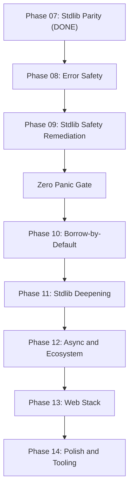

# Revised Sifr Roadmap: Phases 08-14

## Situation Analysis

After Phase 07 (Stdlib Parity), five audits reveal a clear picture:

- **Safety is systematically violated:** ~59 CPython exception paths exist in the 37 stdlib modules; only 2 (3.4%) are correctly handled. ~40+ intrinsics panic via `.unwrap()`. The "if it compiles, it works" promise is broken.
- **Error type infrastructure is missing:** All existing code uses `Result[T, str]`. No built-in error classes exist. No exhaustiveness checking on `except` arms. The error handling model described in architecture.md contract #3 is unimplemented.
- **Borrow-by-default is still pending:** Phase 05 was never executed. Zero stdlib functions use `mut` or `own` parameters. The ownership model is only half-proven.
- **Stdlib coverage is ~38% average** across 34 CPython-named modules. Many modules have critical API gaps.
- **Codegen has 7 known borrow-related regressions** from the borrowing audit (58% pass rate).

The key insight: **the error safety foundation must come before borrow-by-default, which must come before ecosystem features.** Each layer depends on the one below it. Rushing to async/web without fixing safety and ownership would create a house of cards.

## Revised Phase Sequence

---

## Phase 08: Error Safety (Compiler Infrastructure)

**Why first:** Every subsequent phase depends on proper error types. You cannot make stdlib safe without error classes. You cannot do exhaustiveness checking without the compiler infrastructure. This is the [milestone_error_safety](issues/milestone_error_safety.md) issue, which is the enabler for everything.

### milestone_error_safety: Error Class Enforcement and Exhaustiveness Checking

As defined in [issues/milestone_error_safety.md](issues/milestone_error_safety.md):

1. **Define built-in error classes** (`Error`, `IOError`, `ParseError`, `ValueError`, `DivisionError`, `KeyError`, `JSONDecodeError`, `TOMLDecodeError`, `RegexError`) as compiler built-ins
2. **Enforce `E` in `Result[T, E]` must extend `Error**` -- `Result[T, str]` becomes a compile error
3. **Implement exhaustiveness checking** on `except` arms -- collect error types from `try` body, verify coverage
4. **Update `raise` to require Error class instances** -- `raise "message"` becomes a compile error
5. **Migrate all existing E2E tests** from `Result[T, str]` to proper error classes
6. **Update codegen** for multi-error-type `try` blocks (local error enum generation)

### milestone_error_safety_stdlib_types: Module-Specific Error Types

After the compiler infrastructure is in place, define and export module-specific error types from stdlib `.sifr` files:

- `StatisticsError` for `sifr.statistics`
- `CycleError` for `sifr.graphlib`
- Validate the error type export pipeline from stdlib `.sifr` files (this was explicitly deferred in Phase 07)
- E2E tests proving error types can be imported and caught by user code

---

## Phase 09: Stdlib Safety Remediation

**Why before borrow-by-default:** The safety audit found ~45+ `.unwrap()` panic paths in intrinsics. These must be fixed before changing the parameter passing convention, because borrow-by-default will touch the same codegen paths. Fixing safety first means borrow-by-default works on a stable, non-panicking foundation.

### milestone_io_safety: File I/O Safety (Priority 1 -- Critical)

The most critical safety violation. 5 modules, ~15 intrinsics.

- Change intrinsic type signatures in `stdlib.rs` to return `Result[T, IOError]`: `read_text`, `write_text`, `read_lines`, `append_text`, `mkdir`, `rmdir`, `remove_file`, `rename`, `copy_file`, `rmdir_all`, `listdir`, `getcwd`
- Update codegen to emit `Result::Ok(...)` / `Result::Err(IOError {...})` instead of `.unwrap()`
- Update stdlib wrappers (`io.sifr`, `os.sifr`, `shutil.sifr`, `pathlib.sifr`, `tempfile.sifr`, `tomllib.sifr`) to propagate `Result`
- E2E tests for both success and error paths

### milestone_parse_safety: Parse/Decode Safety (Priority 2 -- Critical)

5 modules, ~8 intrinsics. Uses the specific error types defined in Phase 08 -- not generic `ParseError` -- so that exhaustiveness checking can distinguish between different parse failure sources in the same `try` block.

- `json_loads` -> `Result[str, JSONDecodeError]`
- `toml_parse` -> `Result[str, TOMLDecodeError]`
- `base64_decode` / `urlsafe_b64decode` -> `Result[str, ParseError]` (generic is fine here -- no module-specific error type needed for base64)
- `decode_utf8` / `bytes_from_hex` -> `Result[str, ParseError]`
- Regex intrinsics (`re_match`, `re_replace`, `re_findall`, `re_split`) -> `Result[T, RegexError]`
- Update all `.sifr` wrappers and E2E tests

### milestone_collection_safety: Collection, Math, and Built-in Safety (Priority 3 -- High)

4 modules, ~15 functions, plus built-in function safety and math domain error policy.

- `statistics.mean/median/variance/stdev/mode/harmonic_mean` -> `Result[float, StatisticsError]` on empty input
- `heapq.heappop` -> `Option[T]` on empty heap
- `heapq.heapreplace` -> `Result[T, ValueError]` on empty heap
- `collections.set_pop` -> `Option[str]` on empty set
- `math.factorial(-1)` -> `Result[int, ValueError]`; `factorial(large_n)` -> overflow check
- `list.remove()` / `list.index()` -> `Option`/`Result` instead of panic
- `min()` / `max()` on empty -> `Option[T]` (CPython raises `ValueError`, which would be Rule 1 / `Result[T, ValueError]`, but the semantics here are "no value exists" -- absence, not failure -- consistent with the spirit of Rules 2-3. This is a deliberate divergence from Rule 1; document in `architecture.md` Python Divergences.)
- `sorted()` with floats -> use `total_cmp` instead of `partial_cmp().unwrap()`
- **Math domain errors (design decision required):** `sqrt(-1)`, `log(0)`, `log(-1)`, `asin(2)`, `acos(2)` currently return NaN/inf silently (matching Rust's `f64` behavior). CPython raises `ValueError`. The architecture's Rule 1 says "Where CPython raises an exception, Sifr returns `Result[T, E]`." Decide one of: (a) return `Result[float, ValueError]` for domain errors (matching architecture/CPython), or (b) document as an explicit divergence ("Sifr follows Rust's IEEE 754 behavior for math domain errors") and add to the Python Divergences table in `architecture.md`. Either choice is valid -- document whichever is chosen. This decision affects `math`'s safety score and the zero-panic gate threshold.

### milestone_edge_case_safety: Edge Case Validation (Priority 4 -- Moderate)

- `random.randint(5, 3)` -> validate a <= b
- `secrets.randbelow(0)` -> validate n > 0
- `textwrap.wrap(text, 0)` -> validate width > 0
- `itertools.batched(data, 0)` -> validate n > 0
- `graphlib.topological_sort(cyclic)` -> detect cycles, return `Result[list[int], CycleError]`
- `uuid.UUID(invalid_hex)` -> return `Result`
- `ipaddress.ip_to_int(invalid)` -> return `Result`
- `datetime.from_timestamp(invalid)` -> return `Result`
- `SubscriptAssign` (`x[i] = val`) -> bounds check instead of panic

### milestone_zero_panic_gate: Safety Verification Gate

Systematic verification that the safety remediation is complete. This is a hard quality gate -- Phase 10 cannot start until this passes.

- Audit all codegen intrinsic emission paths in `crates/sifr_codegen/src/lib.rs` -- assert zero panic-inducing patterns on user-facing operations. This includes `.unwrap()`, `.expect(`, `panic!(`, `unreachable!(`, and unchecked indexing (`[i as usize]` without bounds check). The only acceptable panic-path code is on compiler-internal invariants that cannot fail.
- Add a CI lint that scans intrinsic codegen blocks for all panic-inducing patterns (`.unwrap()`, `.expect(`, `panic!(`, `unreachable!(`, raw indexing on user data) and fails if any are found on user-facing operations (file I/O, parsing, collection access, subscript assignment)
- Run the full stdlib safety audit script against all 37 modules and produce an updated safety score -- every module must score 7/10 or higher (up from the current state where 12 modules score below 5/10). Modules with documented divergences (e.g., math domain errors if option (b) is chosen in `milestone_collection_safety`) are scored against the documented behavior, not the CPython behavior -- a deliberate, documented design choice does not count as a safety violation.
- E2E test: a program that calls every fallible stdlib function with invalid input must compile and run without panicking, handling all errors via `try`/`except`
- Update `audits/STDLIB_PARITY_MASTER_REPORT.md` with post-remediation safety scores

---

## Phase 10: Borrow-by-Default

**Why now:** Safety remediation is done. The codegen no longer panics. Now we can safely change the parameter passing convention without worrying about interacting with broken safety paths.

### milestone_borrow_default: Borrow-by-Default Parameter Passing

As defined in [05_borrow_by_default.md](internal_docs/phases/05_borrow_by_default.md):

- Add `ParamConvention` enum (`Borrow`, `MutBorrow`, `Own`)
- Parse `mut`/`own` soft keywords
- Delete `borrows_args` hardcoded list
- Update all call paths (regular, Callable, method) to convention-aware logic
- Codegen emits `&T` / `&mut T` / `T` based on convention

### milestone_borrow_hardening: Exclusivity, Escape Analysis, and Diagnostics

- Mutable borrow exclusivity tracking
- Escape analysis enforcement: returning or storing a borrowed parameter produces a compiler error with actionable diagnostic ("use `own` or `.clone()`"), not a silent `.clone()` insertion
- Validate consuming-self method receiver patterns: methods that consume `self` (builder pattern) must correctly emit `self` (move) in codegen, and calling a consuming method on a variable must invalidate it
- **For-loop element semantics:** Resolve and document whether `for x in items` borrows elements (Rust-like `&T` iteration) or clones them (Python-like independent copies). Architecture contract #2 says "for-loop elements: borrow by default" -- implement this, and add E2E tests proving that mutating `x` inside the loop does not mutate the collection, and that storing `x` beyond the loop body produces a compiler error (escape analysis). Document the final semantics in `architecture.md` under the Borrow/Lifetime contract.
- Clear error messages for all borrow violations
- Update all 50 borrowing audit tests
- New E2E pass/fail tests (including escape-analysis, consuming-self, and for-loop element cases)
- Multi-module convention tests
- Fix the 7 known codegen regressions from the borrowing audit

### milestone_borrow_stdlib: Stdlib Ownership Patterns

Exercise `mut` and `own` in the stdlib to prove the model works in real code:

- Convert `heapq` to use `mut` parameters (in-place mutation, O(n) heapify)
- Convert `bisect.insort_*` to use `mut` parameters
- Add at least one `own` parameter stdlib function (e.g., `itertools.chain`)
- Fix generator + borrow interaction (generator state machine captures borrowed parameters)
- Replace `Counter` JSON workaround with native `dict[str, int]` field

---

## Phase 11: Stdlib Deepening

**Why before ecosystem:** The stdlib is at ~38% average parity. Deepening it now means ecosystem features (async, web, db) build on a mature stdlib. This phase also adds critical missing modules that the ecosystem needs.

### milestone_stdlib_pure_expansion: Pure Sifr Function Additions

High-ROI, no new intrinsics needed:

- `math`: `acosh`, `asinh`, `atanh`, `isqrt`, `dist`, `fsum`
- `statistics`: `quantiles`, `multimode`, `covariance`, `correlation`, `linear_regression`
- `random`: `shuffle`, `sample`, `randrange`, `gauss`
- `functools`: `reduce`
- `collections`: `Counter.update`, `Counter.subtract`, `Counter.elements`, `Counter.__add__`/`__sub__`
- `itertools`: `accumulate`, `compress`, `dropwhile`, `takewhile`, `filterfalse`, `zip_longest`, `count`, `cycle`
- **Cleanup:** Remove any non-CPython functions that were added during Phase 07 for convenience (e.g., extra helpers in `functools` or `itertools` that don't exist in CPython). The stdlib must expose only CPython-equivalent functionality -- no invented API surface. (Naming divergences forced by Rust keyword conflicts are acceptable and documented separately below.)
- **Document API naming divergences in `architecture.md`:** Several stdlib functions intentionally diverge from CPython names due to Rust keyword conflicts (e.g., `sifr.shutil.move_file` instead of `sifr.shutil.move` because `move` is a Rust keyword). Audit all such cases across the stdlib, collect them into a table in the Python Divergences section of `architecture.md` with the format: `| sifr name | CPython name | reason |`. This makes the divergences discoverable and prevents future contributors from "fixing" them or introducing inconsistent workarounds.

### milestone_new_modules: Critical Missing Modules

Placed second because several of these modules (`subprocess`, `sys`, `gzip`, `zipfile`) are needed by subsequent milestones and by ecosystem phases. Delivering them early unblocks downstream work.

- `sifr.subprocess` (wraps `std::process`) -- sync `run(cmd) -> Result[CompletedProcess, Error]` (async Popen added in Phase 12's `milestone_networking_stdlib`)
- `sifr.sys` -- `argv`, `exit(code)`, `platform`, `version`, `maxsize`
- `sifr.html` -- `escape(s)`, `unescape(s)`
- `sifr.configparser` -- `ConfigParser` class
- `sifr.gzip` -- `compress(data)`, `decompress(data)` (wraps `flate2`)
- `sifr.zipfile` -- `ZipFile` class (wraps `zip`)
- `sifr.calendar` -- `isleap`, `weekday`, `monthrange`
- `sifr.operator` -- `add`, `sub`, `mul`, `itemgetter`

### milestone_stdlib_intrinsic_expansion: New Intrinsics for Existing Modules

- `math`: `erf`, `erfc`, `gamma`, `lgamma`, `frexp`, `ldexp`, `modf`, `nextafter`, `ulp`
- `os`: `chdir`, `getpid`, `cpu_count`, `stat`, `sep`, `linesep`, `name`
- `hashlib`: `sha224`, `sha384`, `blake2b`, `blake2s`
- `platform`: `node`, `release`, `version`, `processor`
- `time`: `strptime`, `gmtime`, `localtime`
- `base64`: `b32encode`, `b32decode`
- `shutil`: `which`, `disk_usage`

### milestone_stdlib_class_deepening: Class API Enhancements

- `open()` built-in with file object protocol (`read`, `write`, `readline`, context manager support) -- prerequisite for `csv.reader`/`csv.writer` and `logging.FileHandler`
- `collections.deque` class
- `datetime`: full `datetime` class (not string-based), `date`, `time`, `timezone` classes
- `pathlib.Path`: add `resolve`, `glob`, `rglob`, `iterdir`, `unlink`, `rmdir`, `touch`, `with_name`, `with_suffix`
- `re`: `compile` -> `Pattern` class, `match`, `fullmatch`, flags support
- `logging`: `basicConfig`, `FileHandler`, `Formatter`, level constants
- `csv`: `reader`/`writer` objects, `DictReader`/`DictWriter`

---

## Phase 12: Async and Ecosystem Foundation

**Why now:** Safety is solid, ownership model is proven, stdlib is deep. The async runtime can be built on a stable foundation.

### milestone_async: Async Runtime

As defined in the original [08_ecosystem.md](internal_docs/phases/08_ecosystem.md):

- `async def` / `await` -> Rust `async fn` / `.await`
- Tokio runtime auto-bundled
- `sifr.task`: spawn, sleep, timeouts
- `sifr.net`: TCP/UDP sockets (async)
- `async with`, async generators
- `sifr.sync`: Lock, Channel, Semaphore
- Send/Sync checking at spawn boundaries (leverages borrow-by-default from Phase 10)

### milestone_networking_stdlib: Networking Standard Library

- `sifr.subprocess` -- async Popen API (extends the sync `run()` from Phase 11's `milestone_new_modules` with async process management)
- `sifr.socket` -- TCP/UDP
- `sifr.http` -- HTTP client (wraps `reqwest`)
- `sifr.url` -- URL parsing

### milestone_typed_serde_core: Typed Serialization (Core)

Web-independent typed serialization. This does NOT include web extractors -- those depend on the web framework and are delivered in Phase 13.

- Auto-derive `Serialize`/`Deserialize` on all classes
- `dumps(obj)` serializes any class to JSON string
- `loads(s, T)` deserializes JSON string to typed class, returns `Result[T, JSONDecodeError]`
- Nested classes, lists, dicts, optionals, unions serialize correctly
- E2E tests for typed JSON roundtrip independent of any web framework

---

## Phase 13: Web Stack

### milestone_web_db: Web Framework and Database

- `sifr.web` (wraps `axum`) -- routing, request/response, middleware
- `sifr.db.sqlite` (wraps `rusqlite`) -- embedded SQLite
- `sifr.db` (wraps `sqlx`) -- async PostgreSQL/MySQL/SQLite

### milestone_typed_web_extractors: Typed Web Extractors

Depends on both `milestone_web_db` (web framework must exist) and `milestone_typed_serde_core` (auto-serde must exist). This is the web-dependent half of typed serialization.

- `Json[T]`, `Path[T]`, `Query[T]`, `Form[T]` extractors
- `UploadFile`, `Multipart` file uploads
- Validation errors -> 422

### milestone_crypto_auth: Cryptography and Authentication

- Password hashing (Argon2id), JWT, AES-256-GCM encryption, HMAC

### milestone_web_production: Production Web Features

- JSON structured logging, request tracing, rate limiting, CORS

### milestone_web_services: External Services

- `sifr.redis` -- Redis client
- `sifr.storage` -- S3-compatible object storage
- `sifr.email` -- SMTP email

### milestone_data_processing: Data Processing

- `sifr.data` (wraps `polars`) -- DataFrame library

---

## Phase 14: Polish and Tooling

### milestone_metaprogramming: Compile-Time Decorators

- `@dataclass`, custom decorators, positional-only parameters

### milestone_ffi: Foreign Function Interface

- Rust FFI, C FFI, `unsafe` keyword

### milestone_package_mgmt: Package Management

- `sifr.toml`, `sifr.lock`, dependency resolution, `sifr add`/`remove`

### milestone_dev_tooling: Developer Tooling

- LSP server, formatter (`sifr fmt`), linter (`sifr lint`), doc generator (`sifr doc`)

### milestone_ecosystem: Package Ecosystem

- Package registry (`sifr.sh`), incremental compilation, REPL

---

## Rationale for the Ordering

**Phase 08 (Error Safety) before Phase 09 (Stdlib Safety Remediation):** You cannot make intrinsics return `Result[T, IOError]` if the compiler doesn't enforce that `IOError` extends `Error`, doesn't do exhaustiveness checking, and all existing tests use `Result[T, str]`. The compiler infrastructure must come first.

**Phase 09 (Stdlib Safety Remediation) before Phase 10 (Borrow-by-Default):** Both touch the same codegen paths (`stdlib.rs`, `lib.rs`). Fixing safety first means borrow-by-default works on non-panicking code. Also, borrow-by-default will change how stdlib wrappers pass arguments -- it's cleaner to fix safety on the current convention, then change the convention. The zero-panic gate at the end of Phase 09 ensures no safety regressions leak into subsequent phases.

**Phase 10 (Borrow-by-Default) before Phase 11 (Stdlib Deepening):** New stdlib functions should be written with the final ownership model from day one. Writing 50+ new functions with move-by-default and then retrofitting `mut`/`own` is wasteful.

**Phase 11 (Stdlib Deepening) before Phase 12 (Async):** The async runtime and web framework will use stdlib functions heavily. Having a deep, safe, correctly-owned stdlib means fewer surprises when building async features on top.

**Phase 12 (Async) before Phase 13 (Web Stack):** The web framework requires async I/O. Typed serde core (auto-derive `Serialize`/`Deserialize`, typed `dumps`/`loads`) is web-independent and lands here. Web-specific extractors (`Json[T]`, `Path[T]`, etc.) depend on the web framework and land in Phase 13.

**Phase 13 (Web Stack) before Phase 14 (Polish):** The web stack is the primary use case. Tooling and ecosystem features are polish that benefits from a stable, feature-complete language.

## Error Taxonomy Policy

Phase 08 defines error types at two levels. The policy for which to use and where they live:

- **Core compiler built-in error types** (`Error`, `IOError`, `ParseError`, `ValueError`, `DivisionError`, `KeyError`, `JSONDecodeError`, `TOMLDecodeError`, `RegexError`) are registered in the compiler's type system like `int`, `str`, `bool`. Available without imports. Defined in `milestone_error_safety`.
- **Module-specific error types** (`StatisticsError`, `CycleError`, and future module-level errors) are defined and exported from their respective stdlib `.sifr` files (e.g., `StatisticsError` from `sifr.statistics`). These require an import to use. Defined in `milestone_error_safety_stdlib_types`, which also validates the export pipeline.
- **Generic error types** (`ParseError`, `ValueError`, `IOError`) are used for operations where the failure mode is common across domains (e.g., base64 decoding, hex parsing, string-to-number conversion) and fine-grained distinction adds no value.
- **Rule of thumb:** if two different fallible calls in the same `try` block could fail with the same error type but the user would want to handle them differently, they need distinct error types.

## Key Differences from Original Roadmap

| Original                                 | Revised                                  | Reason                                                        |
| ---------------------------------------- | ---------------------------------------- | ------------------------------------------------------------- |
| Phase 05 (Borrow-by-Default) was skipped | Moved to Phase 10, after safety          | Safety must be fixed first; borrow changes touch same codegen |
| Phase 08 jumped straight to Async/Web    | Phase 08 is now Error Safety             | Cannot build ecosystem on panicking stdlib                    |
| Stdlib safety was not a phase            | Phase 09 is dedicated to it + zero-panic gate | 40+ panic paths is a critical gap; gate prevents regressions  |
| Stdlib deepening was not planned         | Phase 11 adds it                         | 38% parity is too low for ecosystem work                      |
| 2 ecosystem phases (08, 09)              | 3 phases (12, 13, 14)                    | More granular; async foundation separate from web stack       |
| typed_serde was monolithic               | Split: core (Phase 12) + web extractors (Phase 13) | Core serde is web-independent; extractors depend on web framework |

