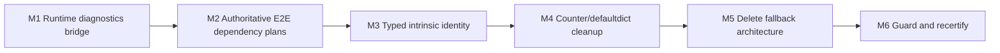

# Ad Hoc Phase: Stdlib and Compiler Boundary Rearchitecture

## Status

Research complete and implementation-ready. This is a new phase following the
native-boundary migration. The prior implementation remains historical input;
this phase owns the final compiler/stdlib boundary architecture and its local
recertification.

Implementation is in progress. M1 routes runtime diagnostics through the
private `sifr_stdlib` boundary and is merged in
[PR #2921](https://github.com/sifr-lang/sifr/pull/2921) after focused
production-path check/emit/build/run coverage, the create-PR gate, and two
satisfied Claude Opus review rounds. M2 is in progress; its checked former-rule
inventory is recorded in
[`ad-hoc-stdlib-compiler-boundary-m2-inventory.md`](ad-hoc-stdlib-compiler-boundary-m2-inventory.md).
The implementation has passed three Claude Opus rounds: pass 1 was satisfied,
pass 2 found and blocked on the 900-line file-size guard, and pass 3 was
satisfied after responsibility-based cache extraction. M2 is in the local
create-PR gate. The gate passed with every blocking lane green, including
crate tests at 502,431 ms / 600,000 ms and 129/129 selected E2E fixtures at
406,818 ms / 600,000 ms. M2 is ready for its milestone PR.

## Why This Phase Exists

The sysroot and private Rust bridge migration is real, but the final closeout
accepted several transitional mechanisms as permanent:

- a standalone `sifr build` regression for `sifr.runtime` diagnostics,
- generated dependency inference in the E2E harness that masks production
  dependency-planning defects,
- 19 fallback signature modules containing about 180 duplicate signatures,
- eight dead Counter intrinsics after `Counter[T]` moved to checked Sifr source,
- raw function-name intrinsic dispatch that bypasses checked source functions,
- unused or legacy Rust adapters that appear migrated but do not implement the
  active public surface, and
- guardrails that freeze these artifacts instead of rejecting them.

The phase is deliberately architectural. It does not preserve internal
intrinsic names, fallback tables, compatibility aliases, or legacy helper APIs.

## Reproduced Evidence

Research was performed against `main` at `a5c3993183` on 2026-07-10.

| Finding | Evidence | Decision |
| --- | --- | --- |
| Standalone runtime diagnostics build is broken | `cargo run -q -p sifr -- build crates/sifr/tests/e2e/pass/runtime_diagnostics_tracing.sifr` fails with unresolved direct `metrics` and `tracing` references in generated `main.rs`. | Migrate the operation to `_sifr.runtime` -> `sifr_stdlib::runtime_observability`; generated code must not reference either third-party crate. |
| E2E validation masks the defect | `compile_fixture` and `build_and_run_capture_with_deps` call `infer_dependencies` over generated Rust; the custom grouped Cargo generator then adds dependencies absent from production compiler metadata. | Delete source scanning and the duplicate E2E dependency planner. E2E consumes the production `SysrootDependencyPlan` unchanged. |
| Bootstrap fallbacks are not ordering necessities | Private declaration modules are loaded before public modules, and `scripts/check_stdlib_bootstrap_ordering.py` passes with `private=31`, `public=61`. Fallback lookup is reached only when compiled declarations are missing. | Remove every fallback-resolution path and delete `sifr_retained_intrinsics`. |
| Fallback surface is large duplicate state | The manifest freezes 19 modules. The crate contains about 180 function signatures across 2,083 lines, including fully migrated math, URL, UUID, regex, Unicode, i18n, JSON, TOML, calendar, compression, and datetime modules. | Declaration source is unconditionally authoritative. No fallback-signature module remains. |
| Counter intrinsics are dead | `Counter[T]`, `from_list`, and all Counter methods are implemented in `stdlib/sifr/collections.sifr`; none of the eight `counter_*` intrinsic names is imported or called by stdlib source. | Delete all eight signatures, dispatch arms, codegen implementations, tests that exercise the dead path, and the direct Serde JSON requirement. |
| Calls are intercepted by raw name | Codegen attempts `lower_intrinsic(func, args)` for ordinary `HirExpr::Call` values. Emitting a fixture that imports `sifr.test.assert_eq` includes the checked source function but replaces its calls with `assert_eq!`. The same collision exists for four public `sifr.bytes` functions. | Add typed compiler-intrinsic identity to HIR. Ordinary calls never enter intrinsic dispatch. Add collision tests for user/local functions with former intrinsic names. |
| Test-helper rationale is only partly true today | Test helpers benefit from caller-local macro expansion, but the current path carries neither a typed intrinsic identity nor Sifr call/argument spans; it relies only on the function name. | Retain seven test helpers, but declare them explicitly in sysroot source and carry callsite metadata through HIR. Do not emit unused source bodies. |
| Runtime Rust implementation is bypassed | `crates/sifr_stdlib/src/runtime_observability.rs` exists, but generated diagnostics inline a different compiler implementation with additional metrics behavior. | Replace both implementations with one bridge target in `sifr_stdlib`. |
| Legacy serialized defaultdict adapters are not the active defaultdict | `defaultdict_new/get/set` have no consumers outside their declarations, implementation tests, and migration tests. The supported `defaultdict(...)` surface is compiler-lowered typed language semantics. | Delete the JSON-string helper APIs end to end. Retain only the typed defaultdict language lowering and classify it separately from Counter. |
| Existing guards report success despite the defects | The bootstrap, manifest, and allowlist guards all pass with `exact_intrinsics=27` and `fallback_signature_modules=19`. | Rewrite the guards around the final architecture instead of updating frozen counts. |

## Final Architecture

There are exactly two valid implementation paths:

```text
stdlib behavior
  user call
    -> stdlib/sifr/*.sifr
    -> stdlib/_sifr/*.sifr @rust declaration
    -> sifr_stdlib
    -> sifr_runtime only for reusable substrate

language/compiler behavior
  syntax or a source-declared retained compiler callable
    -> typed CompilerIntrinsicId in HIR
    -> compiler codegen
    -> sifr_runtime only when language substrate is required
```

The following paths do not exist in the final state:

- fallback signature tables,
- missing-declaration recovery,
- raw string/name intrinsic dispatch,
- generated-Rust dependency scanning,
- E2E-only Cargo dependency inference,
- handwritten duplicate stdlib feature maps in the E2E harness,
- compiler implementations of stdlib behavior,
- emitted checked-source functions whose calls are silently replaced, or
- legacy adapters kept only because they were previously exposed internally.

## Locked Design Decisions

### 1. Runtime diagnostics are stdlib behavior

`runtime_emit_diagnostic(level, target, name, message)` is an exact-shape,
monomorphic bridge call. `_sifr.runtime` declares it with
`@rust(sifr_stdlib.runtime_observability.emit_diagnostic)`. The Rust function:

- accepts string level/metadata inputs,
- returns `Result<(), String>`, mapped to `DiagnosticError`,
- emits the existing five tracing levels,
- increments the existing accepted/rejected metrics with the same bounded
  labels,
- rejects unsupported levels with the existing message, and
- contains no user-data-dependent panic path.

`sifr.runtime` selects the `sifr_stdlib` `runtime-observability` feature. Metrics
and tracing remain transitive sysroot-crate implementation dependencies, never
direct generated-project dependencies for this surface.

### 2. Compiler intrinsic identity is typed, never inferred from a name

Add `CompilerIntrinsicId` to the shared HIR model and add an explicit intrinsic
call expression carrying:

- the intrinsic ID,
- lowered arguments,
- result type,
- call range, and
- argument ranges needed by assertion diagnostics.

Codegen dispatches only this HIR variant. `HirExpr::Call { func: String, ... }`
always means an ordinary resolved callable.

Intrinsic identity is callable metadata, not part of the general type system:

- `CompilerIntrinsicId` and `HirFunction.compiler_intrinsic` live in `sifr_ir`;
- `ExternalDefs.compiler_intrinsics` maps canonical module/name pairs to IDs;
- `LowerCtx.compiler_intrinsics` maps resolved local callable names, including
  import aliases, to IDs; and
- `ReExportMaps.compiler_intrinsics` copies IDs with callable re-exports; and
- call lowering reads that metadata and emits `HirExpr::IntrinsicCall`.

`FunctionType` remains signature-only. This prevents intrinsic identity from
becoming a second signature representation while allowing canonical imports
and import aliases to retain identity.

Internal intrinsic IDs are renamed by responsibility rather than preserving
the current user-colliding strings. No compatibility aliases remain.

### 3. Retained callable intrinsics are declared in source

Introduce a sysroot-only `@compiler_intrinsic(<id>)` declaration form. It is
accepted only for canonical resolved-sysroot stdlib source, requires an
ellipsis-only body, exports its checked source signature, and records its typed
ID in external callable metadata. User/package use is rejected with a
structured diagnostic.

This form is used for:

- the seven `sifr.test` assertion helpers, and
- `sifr.task.current_context`.

The assertions remain compiler-owned harness glue because caller-local
expansion can preserve values and callsite metadata. Their current checked
function bodies are removed rather than emitted and bypassed. Other `sifr.test`
helpers remain ordinary checked Sifr source: they compose or delegate to the
seven retained forms and do not require their own caller-local value capture.
Import aliases are supported because they retain callable metadata. Treating a
compiler-intrinsic callable as a first-class value—assignment, argument,
return, container storage, or closure capture—is rejected with a structured
diagnostic because the declaration has no runtime function body.

Task context remains compiler/runtime language glue because generated task
machinery owns ambient propagation. Its public callable signature is declared
once in `stdlib/sifr/task.sifr`; the empty `_sifr.task` placeholder and its
fallback signature disappear.

### 4. Primitive operations remain compiler-owned but are not source callables

The following operations are synthesized directly by lowering as typed HIR
intrinsics:

- shadowable builtin binary/text `open`,
- `bytes` construction from hex,
- `bytes` construction from integers,
- sized `bytes` construction,
- string encode with default/explicit encoding, and
- bytes decode with default/explicit encoding.

Public `sifr.bytes` wrappers remain normal source functions. Calls to those
wrappers are never intercepted; their bodies invoke primitive syntax/methods,
which lower to the intrinsic HIR variant.

`bytes_to_hex_strict` is not a primitive constructor or method requirement. It
becomes an explicit `sifr_stdlib::bytes` adapter declared in `_sifr.bytes` and
is removed from compiler dispatch.

### 5. Counter is source; defaultdict is a distinct language surface

Counter has no retained compiler intrinsic. Delete all eight `counter_*`
entries and their JSON/Serde codegen.

Typed `defaultdict(int|list|set[, mapping])` remains compiler/type-system
semantics because it refines generic storage and indexing behavior. Rename its
manifest row to describe defaultdict only and enumerate its lowering/codegen
files directly. It has no fallback signatures and no `counter_*` neighbors.

The unrelated JSON-string `defaultdict_new/get/set` public/private/Rust helpers
are deleted. They are not the documented typed defaultdict object model and
have no production consumers.

### 6. Production dependency metadata is the only dependency authority

The E2E harness keeps the typed `HashSet<StdlibFeature>` returned by the driver,
resolves the same `SysrootDependencyPlan` used by `sifr build`, and uses its:

- sysroot crate dependency lines,
- selected crate features,
- retained direct dependencies,
- vendor mode/config,
- toolchain identity, and
- cache/dependency fingerprints.

Batching is allowed only for fixtures with identical resolved dependency-plan
identity. There is no unioning, rescanning, or repair of missing metadata.

The E2E harness may add only dependencies required by the harness executable
itself, through a typed harness-owned input that is independent of fixture
source. It may not infer fixture dependencies from generated Rust.

### 7. The retained manifest is an exception ledger, not a freezer for debt

The final manifest:

- removes `retained-fallback-signature-glue`,
- removes `_sifr.runtime::observability_glue`,
- removes Counter exact intrinsics,
- removes `bytes_to_hex_strict`,
- retains source-declared test/task callable IDs,
- retains only primitive/open HIR intrinsic IDs,
- splits defaultdict language semantics from Counter, and
- records the relevant lowering/codegen implementation files, not only the
  central dispatch modules.

The guard derives the active intrinsic ID set from the typed enum/dispatcher and
the source-declared `@compiler_intrinsic` set from compiled sysroot metadata. It
requires an exact match with the manifest.

## Target Retained Exact-Intrinsic Set

The current set has 27 names. The target has 17 typed IDs:

| Group | Current | Target | Resolution |
| --- | ---: | ---: | --- |
| Test assertions | 7 | 7 | Retain through source declaration and typed HIR identity. |
| Builtin open | 2 | 2 | Retain as synthesized language operations. |
| Bytes constructors/strict formatting | 4 | 3 | Retain three constructors; migrate strict formatting to `sifr_stdlib`. |
| String/bytes encoding glue | 4 | 4 | Retain as primitive method operations. |
| Task current context | 1 | 1 | Retain through source declaration and typed HIR identity. |
| Runtime diagnostics | 1 | 0 | Migrate to `sifr_stdlib`. |
| Counter | 8 | 0 | Delete as dead source-migration residue. |
| **Total** | **27** | **17** | No raw-name lookup and no fallback signature tables. |

## Ordered Implementation Plan

Each milestone is one reviewable item. It is planned, implemented, validated,
reviewed, merged, and documented before the next begins.

### M1. Runtime Observability Boundary and Standalone Regression

Tasks:

- Implement the exact diagnostics behavior in
  `sifr_stdlib::runtime_observability`.
- Add the `_sifr.runtime` Rust declaration and route `sifr.runtime` through it.
- Delete the compiler runtime lowerer, dispatch arm, feature requirement, and
  retained fallback signature.
- Remove the runtime exact-intrinsic manifest entry and fallback-module entry.
- Remove direct generated metrics/tracing requirements that existed only for
  this intrinsic.
- Remove `metrics` and `tracing` from
  `generated-feature-planning-glue.retained_direct_dependency_packages`; no
  retained typed intrinsic requires them after this migration.
- Remove their corresponding entries from
  `crates/sifr_stdlib_manifest/src/features/dependency_plan.rs::retained_dependency_specs`.
- Add a production-path standalone build-and-run regression for
  `runtime_diagnostics_tracing.sifr`.
- Assert emitted user-project Rust contains a `sifr_stdlib` call and contains no
  direct `metrics::` or `tracing::` reference.

Acceptance:

- `sifr check`, `sifr emit`, `sifr build`, and `sifr run` all succeed for the
  runtime diagnostics fixture in isolation.
- Accepted/rejected event semantics and metrics labels are unchanged.
- The only production implementation is in `sifr_stdlib`.

### M2. Authoritative E2E Dependency Planning

Tasks:

- Preserve typed compiler feature metadata in `CompiledCase`.
- Resolve and store the production `SysrootDependencyPlan` for each fixture.
- Key batch groups and caches by the resolved plan identity.
- Generate grouped Cargo inputs from the plan instead of module/crate string
  switch statements.
- Delete `infer_dependencies` and every generated-Rust dependency scan.
- Delete the duplicate E2E stdlib/runtime feature and dependency maps.
- Inventory every inference rule before deletion and either prove the
  production plan already supplies it from typed source/compiler metadata or
  repair that production metadata in M2. The bounded inventory is:
  - inferred modules `_bigint`, `_sifr.fs`, `_sifr.net`, `_sifr.tls`,
    `_sifr.http`, and `_sifr.signal`;
  - inferred runtime crate `sifr_runtime`; and
  - inferred direct crates `regex`, `rand`, `rand_distr`, `chrono`, `md5`,
    `uuid`, `toml`, `flate2`, `zip`, `base64`, `sha1`, `sha2`, `blake2`,
    `rust_decimal`, `bigdecimal`, `tracing`, `metrics`, `postcard`, `url`,
    `percent-encoding`, `http`, `bytes`, `h2`, `http-body`, `http-body-util`,
    `hyper`, `hyper-util`, `tower-service`, and `cookie`.
- Use the resolved sysroot Cargo config/vendor mode for grouped builds.
- Add harness tests proving missing compiler metadata is exposed as a build
  failure and cannot be repaired by another fixture or by source scanning.

Acceptance:

- A fixture that passes grouped E2E has the same dependency plan it receives
  under standalone production build.
- No E2E source file recognizes fixture dependencies by searching Rust text.
- Cache fingerprints change when the production dependency plan changes.
- Every former inference rule has a checked evidence row naming its typed
  production metadata source or the production metadata repair made in M2.

### M3. Typed Intrinsic Identity and Source-Declared Retained Callables

Tasks:

- Add `CompilerIntrinsicId`, intrinsic HIR calls, and callsite metadata.
- Add `HirFunction.compiler_intrinsic`,
  `ExternalDefs.compiler_intrinsics`, and `LowerCtx.compiler_intrinsics` as the
  single metadata route described in the locked design; do not add intrinsic
  fields to `FunctionType`.
- Extend `ReExportMaps` and stdlib bootstrap re-export processing to preserve
  compiler-intrinsic identity, with a synthetic sysroot re-export test even
  though the initial eight retained declarations live in their public modules.
- Update every exhaustive HIR consumer for the new variant, including CFG and
  effect analysis, traversal/query helpers, ownership/nonlocal rewriting,
  editor semantics, source/error mapping, snapshots, runtime-needs analysis,
  and codegen expression/statement walkers.
- Add checked sysroot-only `@compiler_intrinsic` declaration lowering.
- Export intrinsic identity alongside callable signature metadata.
- Convert test assertion helpers to declarations and delete their emitted
  implementation bodies.
- Convert task current-context to a public source declaration and remove the
  `_sifr.task` import/placeholder requirement.
- Before disabling raw-name dispatch, publish
  `sifr_stdlib::bytes::bytes_to_hex_strict`, declare it in `_sifr.bytes`, route
  the live `stdlib/sifr/hashlib.sifr` caller through that declaration, and
  delete its fallback signature and compiler dispatch arm. The public Rust
  adapter is documented as the `_sifr.bytes.bytes_to_hex_strict` bridge target.
- Convert every lowering site that synthesizes one of the 17 retained names to
  emit typed intrinsic HIR calls directly. The current sites include:
  - bytes constructors in
    `sifr_lowering/src/lower/builtin_calls/bytes_len_range.rs` and the related
    constructor paths in `builtin_calls/constructors.rs`;
  - string encode and bytes decode in
    `lower/expressions/methods_lambdas_and_comprehensions.rs`; and
  - shadowable binary/text open in
    `lower/expressions/call_shadowable_builtins.rs`.
- Make codegen dispatch exhaustive over `CompilerIntrinsicId`.
- Remove the attempt to lower every ordinary function call as an intrinsic.
- Add same-name local function, alias, nested function, method, and imported
  callable collision tests for former intrinsic names.

Acceptance:

- Ordinary calls cannot reach intrinsic codegen by spelling.
- Test/task aliases preserve intrinsic identity.
- Re-exported compiler-intrinsic callables preserve identity without a
  name-based lookup or duplicate declaration.
- First-class value use of a source-declared compiler intrinsic is rejected
  with a structured diagnostic; import/name alias calls remain supported.
- User/package `@compiler_intrinsic` is rejected.
- Test failures retain caller-local values and Sifr call/argument ranges.
- `hashlib.sifr` checks, emits, builds, and runs after M3 with no raw-name
  intrinsic dispatch or fallback signature.
- No lowering path constructs a string-named `HirExpr::Call` for any of the 17
  typed IDs.

### M4. Collections Residue Removal

Tasks:

- Delete all eight Counter signatures, dispatch arms, lowerers, feature
  requirements, and registry-only tests.
- Remove `serde` and `serde_json` from
  `generated-feature-planning-glue.retained_direct_dependency_packages`; no
  retained typed intrinsic requires them after Counter deletion.
- Remove their corresponding entries from
  `crates/sifr_stdlib_manifest/src/features/dependency_plan.rs::retained_dependency_specs`.
- Delete the Counter intrinsic registry modules if no live code remains.
- Prove all Counter behavior routes through `stdlib/sifr/collections.sifr`.
- Delete serialized `defaultdict_new/get/set` source declarations, public
  helpers, Rust implementations, and tests.
- Split/rename the manifest entry to typed defaultdict language semantics only.
- Keep M4's manifest update within the existing schema: correct the semantic
  row and current codegen-relative file fields. M6 owns the schema extension
  that can enumerate cross-crate lowering and codegen files exactly.
- Rename the retained bytes manifest row to primitive bytes constructors and
  remove `bytes_to_hex_strict` from its exact set; its bridge migration is
  completed in M3.
- Prove public `sifr.bytes` wrappers execute their checked source bodies and
  reach primitive intrinsic HIR only inside those bodies.

Acceptance:

- No `counter_*` intrinsic identifier or Serde JSON Counter implementation
  remains.
- No JSON-string defaultdict helper remains.
- Generic Counter and typed defaultdict fixtures retain their supported
  behavior.
- No public source function is emitted and then bypassed by raw-name codegen.

### M5. Fallback Signature Architecture Deletion

Tasks:

- Remove every fallback resolution path: the missing-module branch and
  `re_export_intrinsic_fallbacks` in `sifr_driver/src/stdlib/bootstrap.rs`,
  `resolve_retained_fallback` in
  `sifr_lowering/src/lower/private_stdlib_imports.rs`, and the independent
  `get_intrinsic_module` branch in `sifr_lowering/src/lower/mod_impl.rs`.
- Delete the populated `_sifr.io => intrinsic_io()` fallback branch together
  with the empty `_sifr.io` source placeholder; neither has a live importer.
- Delete `crates/sifr_retained_intrinsics` and all Cargo dependencies on it.
- Delete the empty `_sifr.test` placeholder unconditionally; the repository
  inventory has no importer. `_sifr.io` is removed with its fallback branch
  above, and `_sifr.task` is removed by M3.
- Remove `fallback_signature_modules` from the manifest schema and delete the
  fallback-glue surface.
- Add a bootstrap test that every private import resolves to a compiled source
  declaration and reports a structured bootstrap diagnostic otherwise.
- Add a permanent repository guard rejecting the deleted crate, fallback APIs,
  and fallback manifest fields.

Acceptance:

- `rg 'sifr_retained_intrinsics' crates Cargo.toml Cargo.lock` finds no match.
- Every stdlib callable signature has one source declaration.
- Missing private declarations fail deterministically; no recovery path exists.
- The fallback module count is zero.

### M6. Reachability Guard, Documentation, and Final Recertification

Tasks:

- Add a native-adapter reachability guard: each production `sifr_stdlib` public
  adapter is an active `@rust` target, an explicitly documented cross-module
  substrate, or removed/made private.
- Make the retained-intrinsic guard compare source declarations, typed HIR IDs,
  dispatch implementations, manifest entries, and owned files exactly.
- Extend the retained-manifest schema with explicit lowering/codegen ownership
  fields, then backfill every retained surface. This is the final mechanism for
  cross-crate file enumeration deferred from M4.
- Require every retained direct dependency package to have a corresponding
  live typed-intrinsic feature requirement; reject orphan package rows.
- Add explicit negative self-tests for user/package `@compiler_intrinsic`,
  user/local declarations using former intrinsic names, removed `_sifr.*`
  fallback imports, first-class value use of retained compiler callables, a
  missing private source declaration, orphan retained dependency packages, and
  each deleted fallback API/schema field.
- Update the sysroot/stdlib architecture, retained manifest, roadmap, original
  phase docs, dependency snapshots, and traceability reports.
- Record every merged PR and final checklist state in this issue.
- Run installed/source-tree sysroot certification for representative retained
  intrinsic and migrated bridge surfaces.
- Run the full local merge gate.

Acceptance:

- The original native-boundary issue can truthfully return to completed status.
- No review finding is represented only by prose; each architectural invariant
  has executable enforcement.
- Source-tree and installed sysroot builds produce the same dependency and
  behavior results.

## Dependency Order



M1 precedes M2 because M2 removes the validation mask that hides the known M1
production defect; landing M2 first would block its own validation. M3 migrates
the live `bytes_to_hex_strict` caller before disabling raw-name dispatch and
gives every retained callable explicit identity. M4 then removes dead
collections residue. M4 precedes fallback deletion so no remaining private
import depends on the old tables. M6 runs only after the architecture is
already final.

## Validation Matrix

Every milestone runs focused tests plus:

```bash
cargo fmt --check
cargo clippy --workspace -- -D warnings
python3 scripts/check_hir_maintainability_guardrails.py
python3 scripts/check_file_size_guardrails.py
python3 scripts/check_stdlib_bootstrap_ordering.py
python3 scripts/check_stdlib_manifest_schema.py
python3 scripts/check_stdlib_native_intrinsic_allowlist.py
scripts/run_all_tests.sh --profile create-pr
```

M1 additionally runs standalone diagnostics check/emit/build/run. M2 runs the
E2E harness with cache disabled and a dependency-sensitive fixture selection.
M3-M5 run focused HIR/lowering/codegen/bootstrap tests and migration guard
self-tests. M6 additionally runs:

```bash
scripts/run_all_tests.sh
```

## Research Review Record

- [Round 1](../../reviews/active/stdlib-compiler-boundary-rearchitecture-review-round1.md):
  `NEEDS_REVISION`; identified five milestone-breaking or underspecified
  decisions, all incorporated before round 2.
- [Round 2](../../reviews/active/stdlib-compiler-boundary-rearchitecture-review-round2.md):
  `SATISFIED`; independently confirmed all round-1 blockers were resolved.
- [Round 3](../../reviews/active/stdlib-compiler-boundary-rearchitecture-review-round3.md):
  `SATISFIED`; confirmed architecture, crate direction, sequencing, counts, and
  executable acceptance criteria.
- [Round 4](../../reviews/active/stdlib-compiler-boundary-rearchitecture-review-round4.md):
  `SATISFIED`; confirmed the final re-export, `_sifr.io`, and milestone-label
  refinements introduced no new issue.

## Closeout Checklist

- [x] Standalone regression reproduced.
- [x] Validation masking path identified.
- [x] All 27 current exact intrinsics classified.
- [x] All 19 fallback modules classified as removable.
- [x] Counter/defaultdict ownership split decided.
- [x] Runtime diagnostics target ownership decided.
- [x] Typed intrinsic identity and source-declaration model decided.
- [x] No-fallback target and PR sequence decided.
- [x] M1 merged and documented ([PR #2921](https://github.com/sifr-lang/sifr/pull/2921)).
- [ ] M2 merged and documented.
- [ ] M3 merged and documented.
- [ ] M4 merged and documented.
- [ ] M5 merged and documented.
- [ ] M6 merged and documented.
- [ ] Full local merge gate passes on final `main`.
