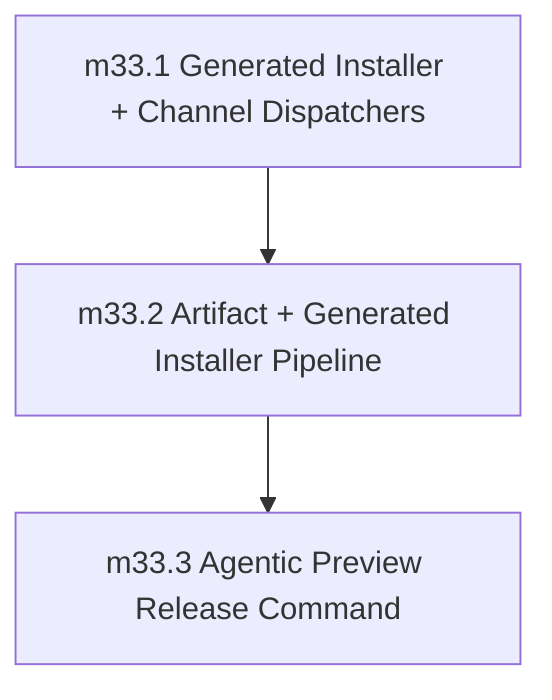

# Phase 33: Preview Distribution and Release Automation (`alpha`/`beta`)

status: completed

Completed on 2026-05-12. Closure evidence is recorded in `../issues/archive/phase-33-preview-distribution-execution.md`, including corrective public release publication evidence for `0.1.0-alpha.1` and `0.1.0-beta.1`.

## Objective

Ship preview release channels early for adoption while keeping stable GA promotion gated for Phase 39.

Phase 33 establishes the first public distribution path for preview binaries with the least custom release infrastructure that still satisfies Sifr's safety bar:

- public installer entrypoints under `https://sifr.sh/install`,
- immutable generated installer scripts for each preview version,
- thin `alpha`/`beta` channel dispatchers that point at immutable version installers,
- reproducible multi-platform preview artifacts,
- checksum verification before install,
- repeatable release automation for `alpha`/`beta` publication.

The phase is complete when a user can install an `alpha` or `beta` preview from the public installer and the project can cut another preview release through the documented automation without enabling stable GA promotion.

## Distribution Source Of Truth

This file is the authoritative contract for Phase 33 until implementation creates supporting docs. It records the installer model, channel behavior, artifact layout, milestone order, validation goals, deferrals, and phase exit gate. Implementation PRs may add a dedicated `internal_docs/distribution_pipeline.md`, but they must not introduce behavior that conflicts with this phase file unless a review PR updates this file first.

The Sifr site repository is part of this phase:

- Site repo: `/Users/yaseralnajjar/work/sifr/sifr-blog-website/`
- Public default installer source: `apps/sifr-site/public/install`
- Public channel installer sources: `apps/sifr-site/public/install/alpha` and `apps/sifr-site/public/install/beta`
- Public pinned installer roots: `apps/sifr-site/public/install/versions/`
- Deployment target: the existing `sifr.sh` site deployment

The compiler repository owns release automation, artifact building, generated installer creation, verification scripts, and the `/create-new-version` workflow.

## Depends On

- Phase 32 is completed. Current closure evidence: Phase 32 is marked `status: completed` in `plans/phases/32_async_ecosystem.md`, with corrective follow-up completed on 2026-05-12.
- Phase 27 runtime-safety and diagnostics contracts remain green.
- The `sifr.sh` site repository can deploy static files from `apps/sifr-site/public/`.

## Non-Goals And Deferrals

The following are not Phase 33 exit criteria:

- Stable GA promotion.
- Custom channel manifest and version manifest schemas, unless generated installer entrypoints cannot satisfy a concrete Phase 33 requirement.
- Package-manager distribution (`brew`, `apt`, `npm`, `pip`, `cargo install`, Windows package managers).
- Automatic runtime telemetry or update checks from installed binaries.
- Rollback and incident governance beyond reverting preview channel pointers; Phase 39 (`plans/phases/39_stable_channel_ga_promotion_and_release_governance.md`) owns GA rollback governance.
- Windows installer support for `curl | bash`; Windows artifacts may be added later behind a separate installer contract.
- Long-term signing authority rotation policy.

## Generated Installer Baseline And Attribution

Phase 33 starts from a generated-installer model rather than a bespoke hand-written artifact resolver. The baseline is the same shape used by Astral's uv installer at `https://astral.sh/uv/install.sh`: a shell installer generated from release metadata that embeds the app version, release asset URLs, target-to-archive mapping, SHA-256 checksums, platform detection, download, verification, extraction, and install-path handling.

The generated installer should also follow uv's default PATH ergonomics: after installing the binary, it updates shell profiles through an env script so users do not need a separate persistent `PATH` setup step. Users can opt out with `SIFR_NO_MODIFY_PATH=1` or `--no-modify-path`.

Implementation should prefer `cargo-dist` or an equivalent generator so Sifr owns release metadata and generated output, not a manually maintained 2,000-line installer fork.

If any code is copied or adapted from the Astral uv installer or the `astral-sh/uv` repository, the implementation PR must:

- retain the complete MIT license header, including both the copyright notice and the permission notice, in the copied/adapted file,
- add explicit attribution to `astral-sh/uv` as the source project,
- pin to a specific installer version, release tag, or git commit SHA and never use `/latest/` URLs or auto-redirecting URLs as the recorded source,
- record the exact pinned source URL and pinned reference used,
- document why that pinned source was chosen over other available versions,
- keep the Sifr-specific delta reviewable,
- record why generation alone was insufficient.

This attribution requirement applies even if the adapted code is later checked in under a generated file path.

## Locked Preview Distribution Decisions

1. `alpha` and `beta` are the only installable moving channels in Phase 33.
2. `stable` has no installable public entrypoint in Phase 33. Any `stable` channel request is rejected before download or installation.
3. Each preview version has an immutable generated installer script under `https://sifr.sh/install/versions/<version>`.
4. The default `https://sifr.sh/install` entrypoint resolves to the current `beta` preview.
5. `https://sifr.sh/install/alpha` resolves to the current `alpha` preview, and `https://sifr.sh/install/beta` resolves to the current `beta` preview.
6. `--version <preview>` selects the immutable generated installer for that preview version. Stable-looking versions without preview prerelease labels are rejected until Phase 39.
7. `SIFR_CHANNEL` and `--channel` are thin dispatcher inputs only. They select `alpha` or `beta` and then delegate to the immutable generated installer for the selected channel. They must not implement independent artifact resolution.
8. Invalid combinations are hard errors. `--version` with a conflicting `--channel` or `SIFR_CHANNEL` is rejected instead of silently choosing one.
9. The installer never compiles Sifr from source and never falls back to an alternate artifact if the resolved artifact is missing or invalid.
10. The generated version installer validates SHA-256 before replacing or creating the installed binary. Detached signatures may be added if supported by the generator, but Phase 33 does not require a custom signature layer on top of generated installers.
11. The preview target set is initially:
    - `aarch64-apple-darwin`
    - `x86_64-apple-darwin`
    - `x86_64-unknown-linux-gnu`
    - `aarch64-unknown-linux-gnu`
12. Artifacts are published as GitHub Release assets in `sifr-lang/sifr`; the website hosts only dispatcher scripts and immutable generated installer scripts.
13. Preview release automation must support dry-run and real-run modes with identical planning logic. Real-run is the dry-run plan plus authorized mutations.

## Stable-Looking Version Detection Rules

The installer and release command must reject stable-looking versions using these rules:

1. Versions matching `X.Y.Z` without prerelease labels, for example `1.0.0` or `2.0.0`, are rejected.
2. Versions with `-alpha.N`, `-beta.N`, or `-rc.N` prerelease labels, for example `1.0.0-alpha.1` or `2.0.0-beta.2`, are accepted as preview versions.
3. Versions matching `0.X.Y` without prerelease labels are treated as stable-looking. Phase 33 does not define 0.x preview semantics without explicit prerelease labels.
4. Stable-looking versions remain rejected regardless of what Phase 39 later permits.

## Artifact Format Specification

Preview artifacts are published with these conventions:

- Archive format: `.tar.gz` (gzip-compressed tar).
- Naming convention: `sifr-<version>-<target>.tar.gz`.
- Target mapping:
  - `aarch64-apple-darwin` maps to `sifr-<version>-aarch64-apple-darwin.tar.gz`.
  - `x86_64-apple-darwin` maps to `sifr-<version>-x86_64-apple-darwin.tar.gz`.
  - `x86_64-unknown-linux-gnu` maps to `sifr-<version>-x86_64-unknown-linux-gnu.tar.gz`.
  - `aarch64-unknown-linux-gnu` maps to `sifr-<version>-aarch64-unknown-linux-gnu.tar.gz`.
- Archive contents: a single `sifr` binary at the archive root with no nested directory required for extraction.
- Checksum file: `sifr-<version>-<target>.tar.gz.sha256` is published alongside each artifact.
- Generated installer behavior: the generated version installer embeds the SHA-256 checksum inline and verifies it before extraction.

## Installer Entrypoint Contract

Phase 33 uses shell entrypoints instead of a custom JSON channel manifest protocol:

- `https://sifr.sh/install`
- `https://sifr.sh/install/alpha`
- `https://sifr.sh/install/beta`
- `https://sifr.sh/install/versions/<version>`

The channel entrypoints are small Sifr-owned dispatchers. They may be static scripts rewritten during release or redirects served by the site deployment, but their behavior is intentionally narrow:

- resolve exactly one preview version,
- reject disabled or unknown channels,
- reject stable,
- optionally map `SIFR_CHANNEL`, `--channel`, and `--version` to another public entrypoint,
- download or exec the immutable generated version installer,
- preserve generated installer output and exit status.

The generated version installer owns:

- platform detection,
- artifact URL selection,
- archive format selection,
- SHA-256 verification,
- extraction,
- binary installation,
- install-path messaging.

Any implementation that reintroduces a custom JSON manifest protocol must first update this phase file with reviewed rationale showing why generated installers and static dispatchers are insufficient.

## `/create-new-version` Workflow Contract

The preview release command is implemented as `.cursor/commands/create-new-version.md` in the compiler repository.

Inputs:

- `--channel alpha|beta`
- `--version <semver-prerelease>`
- `--dry-run`
- `--real-run`
- optional `--base-ref <sha-or-branch>`

Dry-run behavior:

- Validate channel/version compatibility.
- Resolve the base commit.
- Compute artifact names for every target.
- Generate or preview the immutable version installer for the requested version.
- Compute the site dispatcher changes for the selected channel.
- Verify release notes source and checklist links.
- Verify that no stable entrypoint, stable pointer, or stable-looking version is changed.
- Print the exact GitHub Release, installer, site-deployment, and repository mutations that a real run would perform.
- Exit non-zero if any precondition fails.

Real-run behavior:

- Re-run the dry-run planner and require the same plan.
- Build and validate all target artifacts.
- Generate the immutable version installer.
- Create or update the preview GitHub Release for the exact version.
- Upload artifacts and checksum evidence.
- Open PRs for site dispatcher and generated installer changes that must be reviewed before deployment.
- Trigger or document the `sifr.sh` deployment step for installer publication.

Failure behavior:

- Any failed artifact, checksum, generated installer, or dispatcher validation aborts the release.
- A failed real run must leave a written recovery note with completed and incomplete mutations.
- The command must not update stable entrypoints or stable release metadata in Phase 33.

### Attribution Checklist Contract

When uv-derived installer code is used, the attribution checklist must record:

- which files contain copied or adapted uv code,
- the complete MIT license header text retained in each file,
- the pinned source URL, which must not use `/latest/` or auto-redirecting URLs,
- the pinned reference used, either installer version, release tag, or git commit SHA,
- the date the adaptation was performed,
- the rationale for why generated installers alone were insufficient for that component,
- confirmation that the MIT permission notice and copyright notice are both retained verbatim.

## Milestone Sequencing

Implementation must execute the milestones in order unless a later reviewed PR updates this file with rationale.

## Milestones

### milestone_33_1: Generated Installer and Channel Dispatchers

**Goal:** Lock the generated-installer baseline and publish deterministic channel dispatch behavior without requiring real release artifacts yet.

**Scope:**

- Decide and document the installer generator path: `cargo-dist`, equivalent generator, or attributed uv-derived adaptation.
- If uv code is adapted, add attribution and license-retention requirements directly to the implementation PR.
- Add public dispatcher entrypoints for `/install`, `/install/alpha`, and `/install/beta` in the site repo.
- Implement dispatcher argument handling for `--channel`, `--version`, and `SIFR_CHANNEL`.
- Reject stable channel installs and stable-looking version pins.
- Reject invalid channel names, conflicting channel/version inputs, unavailable generated installers, unsupported platforms, and malformed dispatcher configuration.

**Definition of done:**

- Dispatcher resolution is deterministic for default `beta`, explicit `alpha`, explicit `beta`, gated `stable`, and explicit preview version pins.
- Dispatchers delegate to immutable generated version installers instead of resolving artifacts themselves.
- The site repo deployment path for `/install` entrypoints is documented in the PR.
- Any copied/adapted installer code is attributed to `astral-sh/uv` with MIT license notice retained.

**Positive validation:**

- `verification/distribution/install_default_beta_dispatcher.sh`
- `verification/distribution/install_alpha_dispatcher.sh`
- `verification/distribution/install_version_pin_dispatcher.sh`
- `verification/distribution/install_stable_channel_gated.sh`

**Negative validation:**

- `verification/distribution/install_invalid_channel_rejected.sh`
- `verification/distribution/install_conflicting_channel_and_version_rejected.sh`
- `verification/distribution/install_stable_version_pin_rejected.sh`
- `verification/distribution/install_missing_generated_installer_rejected.sh`
- `verification/distribution/install_dispatcher_malformed_config_rejected.sh`

**Demo:** none yet; dispatcher validation uses mocked generated installers until real artifacts exist.

### milestone_33_2: Artifact and Generated Installer Pipeline

**Goal:** Publish verifiable preview artifacts and immutable generated installers.

**Depends on:** `milestone_33_1`

**Scope:**

- Add release artifact build automation for the preview target set.
- Publish GitHub Release assets for each target.
- Generate SHA-256 checksums.
- Generate immutable version installers that embed artifact names, target mappings, and checksums.
- Update channel dispatchers to point at the selected immutable version installer.
- Ensure failed verification never replaces an existing installed binary.

**Definition of done:**

- The generated version installer validates SHA-256 before installation.
- The generated version installer installs the artifact matching the local OS/architecture target.
- Channel dispatchers point to immutable version installers.
- Stable entrypoints remain absent or rejected and are unmodified by preview publication.

**Positive validation:**

- `verification/distribution/artifact_generated_installer_all_preview_targets.sh`
- `verification/distribution/artifact_sha256_validated.sh`
- `verification/distribution/install_matching_target_artifact.sh`
- `verification/distribution/channel_dispatcher_points_to_generated_installer.sh`

**Negative validation:**

- `verification/distribution/artifact_missing_target_rejected.sh`
- `verification/distribution/artifact_checksum_mismatch_rejected.sh`
- `verification/distribution/artifact_target_mismatch_rejected.sh`
- `verification/distribution/stable_entrypoints_unchanged_by_preview_release.sh`

**Demo:** `demos/preview_distribution_demo/README.md` records a local mocked-installer walkthrough and the commands used to verify checksum handling.

### milestone_33_3: Agentic Preview Release Command

**Goal:** Add repeatable preview release automation that can plan and execute `alpha`/`beta` releases without enabling stable GA.

**Depends on:** `milestone_33_2`

**Scope:**

- Add `.cursor/commands/create-new-version.md`.
- Implement the dry-run planner for `alpha` and `beta`.
- Implement the authorized real-run workflow for preview releases.
- Validate version/channel compatibility and reject stable releases.
- Produce a release checklist with artifact, generated installer, dispatcher, site deployment, attribution, and validation evidence.
- Record recovery information when a real run partially completes.

**Definition of done:**

- `/create-new-version --channel alpha --version <preview> --dry-run` produces the exact mutation plan without side effects.
- `/create-new-version --channel beta --version <preview> --real-run` can publish a validated preview release end to end after review.
- Stable release attempts fail before artifact, installer, or dispatcher mutation.
- The generated checklist maps every validation artifact to the phase exit gate.
- The checklist confirms whether uv-derived code was used and, if so, where attribution and license retention live.

**Positive validation:**

- `verification/distribution/create_new_version_alpha_dry_run.sh`
- `verification/distribution/create_new_version_beta_dry_run.sh`
- `verification/distribution/create_new_version_real_run_plan_reuse.sh`
- `verification/distribution/create_new_version_release_checklist.sh`
- `verification/distribution/create_new_version_attribution_checklist.sh`

**Negative validation:**

- `verification/distribution/create_new_version_stable_rejected.sh`
- `verification/distribution/create_new_version_bad_semver_rejected.sh`
- `verification/distribution/create_new_version_missing_artifact_rejected.sh`
- `verification/distribution/create_new_version_site_dispatcher_drift_rejected.sh`

**Demo:** `demos/preview_release_lifecycle/README.md` captures a dry-run transcript and a mocked real-run transcript showing release planning, artifact verification, generated installer publication, dispatcher publication, stable gating, and attribution evidence when applicable.

## Quality Contract

- Entry criteria: Phase 32 is completed and async/runtime ecosystem primitives are stable.
- Phase 27 non-regression baseline is required at phase start and must remain green through completion.
- Phase 27 non-regression invariants that must hold in this phase include: no user-triggerable panic paths; no data-dependent emitted `.unwrap()` / `.expect()` / `panic!` in user runtime paths; stable diagnostic contract (codes, severity, spans, URLs, suggestions, schema); canonical/lossless `json` diagnostics with `human` and `compact` as renderer views only; enforced recovery limits with deterministic ordering; and enforced exit-code and CLI stability contracts (`0/1/2/3`, and unknown `--diagnostic-format` exits `2` before semantic work).
- Phase 27 invariants apply to the preview compiler binaries being distributed. Installer shell code is validated under the distribution checks in this phase, not under compiler diagnostic invariants.
- Any milestone that regresses these invariants is incomplete, even if its local scope passes.
- Exit criteria: Preview release lifecycle works reliably without enabling stable GA promotion.
- Milestone quality checks:
  - No fallback, migration, or legacy compatibility code is allowed; implement the canonical generated-installer architecture directly with clean code only.
  - No lazy or partial fixes are allowed; each milestone must resolve root causes completely, even when that requires significant rework.
  - All implementations must be production-grade release automation: deterministic behavior, explicit invariants, auditable mutations, license-compliant attribution, and hard failure on ambiguity.
  - Every milestone in this phase must satisfy the scope and definition-of-done already documented in this file.
  - Validation evidence must be recorded in the phase execution checklist issue before merge.
  - Validation evidence for every milestone must include at least one positive-path case and one negative-path case mapped to the milestone validation planning goals.
- Validation planning goals:
  - `milestone_33_1` (Generated Installer and Channel Dispatchers): validation goals cover installer generator selection, attribution requirements, dispatcher publication, channel/default/version resolution, stable gating, invalid input rejection, missing generated installer rejection, and unsupported target rejection.
  - `milestone_33_2` (Artifact and Generated Installer Pipeline): validation goals cover multi-platform artifact publication, immutable generated installers, channel dispatcher pointers, checksum validation, target matching, and no stable entrypoint mutation.
  - `milestone_33_3` (Agentic Preview Release Command): validation goals cover dry-run planning, real-run plan reuse, release checklist generation, attribution checklist generation, stable release rejection, malformed version rejection, missing artifact rejection, and site dispatcher drift rejection.
  - Exit-gate evidence explicitly demonstrates an end-to-end preview release lifecycle for `alpha` or `beta` and separately demonstrates that stable GA promotion remains impossible.

## Exit Gate

- `https://sifr.sh/install` resolves and installs a validated `beta` preview artifact on supported platforms.
- `https://sifr.sh/install/alpha` resolves and installs a validated `alpha` preview artifact on supported platforms.
- Explicit preview version pinning installs the exact requested immutable version installer.
- All artifact downloads are SHA-256 validated before installation.
- Channel dispatchers point to immutable generated version installers.
- `/create-new-version` dry-run and real-run flows are repeatable for preview releases.
- `stable` channel and stable-looking version pins are rejected before any artifact, installer, or dispatcher mutation.
- If uv-derived installer code is used, attribution to `astral-sh/uv` and the MIT license notice are present in the copied/adapted file and release checklist.
- The site deployment path for installer dispatchers and immutable generated installers has been exercised.
- Phase 27 non-regression contract remains green: panic-free user paths, no emitted data-dependent unwrap/expect/panic, and stable diagnostics/renderer/exit-code behavior.
