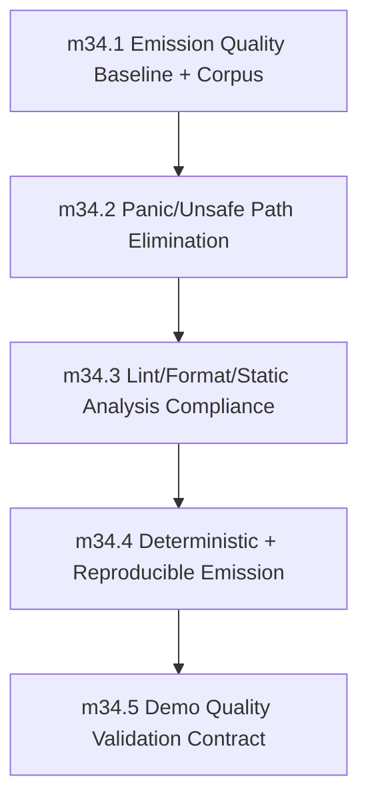

# Phase 34: Generated Code Quality and Production Readiness

status: completed and merged

Merged PR: https://github.com/sifr-lang/sifr/pull/2114

## Objective
Guarantee that emitted Rust is production-grade in safety, determinism, tooling compliance, and maintainability.

Phase 34 turns generated Rust from an incidental compiler output into a checked product artifact. The phase is complete only when generated Rust from the required corpus can be emitted, scanned, formatted, linted, compiled, rebuilt deterministically, and demonstrated with recorded evidence.

## Source Of Truth

This file is the authoritative contract for Phase 34 until implementation creates supporting docs. Implementation PRs may add `internal_docs/generated_code_quality.md`, but they must not introduce behavior that conflicts with this phase file unless a reviewed PR updates this file first.

## Depends On

- Phase 33 (`preview_distribution_and_release_automation`)
- Phase 27 runtime-safety and diagnostics invariants remain green.

## Feeds Into

- Phase 40 stable GA promotion must consume Phase 34 quality gates before stable artifacts are eligible for release.

## Non-Goals And Deferrals

- New language feature development.
- Runtime semantics redesign already covered by prior soundness phases.
- Package ecosystem expansion concerns.
- Replacing the existing e2e pass/fail harness.
- Adding generated-code optimizations whose only goal is smaller/faster output rather than safety, determinism, formatting, lint, or maintainability.
- Waiving generated-code lint violations through emitted `#[allow(...)]` attributes.
- Introducing fallback generated-code paths or legacy compatibility modes.

## Architecture Ownership

Generated-code quality is owned by `sifr_codegen` and orchestrated by `sifr_driver` / `sifr` tooling. Quality gates may inspect HIR-derived metadata, but they must not move generated-code policy into `sifr_lowering` or the parser crates.

The driver owns transient generated-Rust project creation, invocation ordering, and evidence collection. Codegen owns emitted source shape, deterministic ordering, and avoiding forbidden user-path constructs.

## Verification Infrastructure

Phase 34 owns the `generated_code_quality` verification area under
`verification/areas/generated_code_quality/`.

Required files:

- `verification/areas/generated_code_quality/manifest.json` — area-level suite manifest.
- `verification/areas/generated_code_quality/data/corpus_manifest.json` — version-controlled source of truth for the generated-code corpus.
- `verification/areas/generated_code_quality/generated_code_quality.py` — emits and checks corpus, panic-scan, rustfmt, clippy, determinism, and demo gates.
- `verification/areas/generated_code_quality/runner.py` — maps `sifr_verify` area suites to the generated-code quality gate modes.

The area runner must be deterministic, local-first, and usable both directly and
through `scripts/run_all_tests.sh --profile merge`.

## Generated Rust Compilation Pipeline

Generated Rust quality checks use a transient project model rather than ad hoc single-file `rustc` calls.

- Output root: `target/sifr_generated_code_quality/<run-id>/`.
- Each corpus entry emits into an isolated crate under the output root.
- Each isolated crate contains a minimal generated `Cargo.toml`, `src/main.rs` or `src/lib.rs`, and any generated module tree needed by project-mode inputs.
- `cargo check` is used for fast milestone feedback.
- `cargo build` is required by final milestone and phase exit validation.
- `rustfmt --check` runs on generated source files before clippy.
- `cargo clippy -- -D warnings` runs inside each generated crate with an
  explicit command-line allowlist for currently-known generated-code style debt.
- The pipeline must preserve generated files long enough to write failure evidence, then clean successful transient runs.
- No generated file may suppress lint, format, or safety gates through emitted allow attributes.

Forbidden construct scans operate on generated `.rs` files after emission and before format/lint checks. The scanner fails on `.unwrap(`, `.expect(`, `panic!`, `todo!`, `unimplemented!`, and `unsafe` in user runtime paths unless the occurrence is classified in a checked-in internal-invariant allowlist with owner, rationale, and removal criteria. Data-dependent user paths may not be allowlisted.

## Corpus Contract

The Phase 34 generated-code corpus is defined by `verification/areas/generated_code_quality/data/corpus_manifest.json`.

The manifest must include these groups:

1. `e2e-pass-representative`: representative entries from `crates/sifr/tests/e2e/pass`, including control flow, ownership/borrowing, collections, generics, classes, modules/imports, stdlib I/O, bytes, decimal/integer, diagnostics-adjacent emit cases, async/concurrency, and project-mode dependencies.
2. `stdlib-flows`: fixtures mapped from `verification/areas/stdlib_parity/reports/*_traceability.md` surfaces where emitted Rust exercises nontrivial stdlib/runtime codegen.
3. `multi-module-projects`: multi-file project inputs covering imports, dependency manifests, helper modules, and project-mode emit/build behavior.
4. `demos-required`: required demos listed in `milestone_34_5`.
5. `negative-seeds`: intentionally broken generated-code-quality fixtures used to prove scan, lint, format, and determinism gates fail when expected.

Coverage thresholds:

- At least 50 checked pass fixtures at phase exit.
- At least 10 stdlib-flow fixtures at phase exit.
- At least 5 multi-module/project fixtures at phase exit.
- At least one required fixture for each codegen surface listed above.
- Every manifest entry has a stable id, source path, group, expected command, and evidence category.

Corpus entries are version-controlled and discovered lexicographically by stable id. Any waiver or skipped corpus entry must be explicit, time-bounded, owner-assigned, and issue-linked.

## Panic Inventory Reference

Phase 27's `milestone_27_6` required a checked-in panic inventory covering parser, lowering, type-check, codegen, and driver paths reachable from user input.

Phase 34 lookup order:

1. Primary artifact: `verification/areas/generated_code_quality/panic_inventory.md`, created or refreshed in `milestone_34_1`.
2. Historical Phase 27 execution checklist issue, if it contains a more complete inventory.
3. Any existing named panic inventory artifact under `verification/`.

`milestone_34_2` must use the refreshed Phase 34 inventory as the source of truth for user-triggerable panic patterns and generated user-path safety classification.

## Milestone Sequencing

Implementation must execute the milestones in order unless a later reviewed PR updates this file with rationale.

## Milestones

### milestone_34_1: Emission Quality Baseline and Corpus
- Scope:
  - Define generated-code quality profile and acceptance thresholds.
  - Add `verification/areas/generated_code_quality/data/corpus_manifest.json`.
  - Build the representative corpus from stdlib flows, demos, e2e pass fixtures, and multi-module samples.
  - Add the generated Rust transient project pipeline.
  - Record the Phase 27 panic inventory location or create a current generated-code panic inventory if the Phase 27 artifact is missing or stale.
- Definition of done:
  - Corpus manifest is version-controlled, lexicographically reproducible, and meets the coverage thresholds in this file.
  - Transient generated-Rust projects can be emitted for every corpus entry.
  - `uv run --project verification --locked python -m sifr_verify areas run --area generated_code_quality --suite corpus` passes.
  - Phase 27 panic inventory linkage is recorded in the phase execution checklist issue.
  - Positive and negative validation evidence is recorded.

### milestone_34_2: Panic/Unsafe Path Elimination in Generated User Paths
- Scope:
  - Remove data-dependent emitted `.unwrap()` / `.expect()` / `panic!` in user runtime paths.
  - Remove emitted `todo!` / `unimplemented!` from production paths.
  - Block emitted `unsafe` in user runtime paths.
  - Add the generated-code forbidden construct scanner.
  - Classify any compiler-internal invariant occurrence in a checked-in allowlist with owner, rationale, and removal criteria.
- Definition of done:
  - User-facing generated paths are panic-safe by this contract.
  - Data-dependent user paths have zero `.unwrap(`, `.expect(`, `panic!`, `todo!`, `unimplemented!`, or `unsafe` occurrences.
  - `uv run --project verification --locked python -m sifr_verify areas run --area generated_code_quality --suite panic-scan` passes and fails on seeded violations.

### milestone_34_3: Lint/Format/Static Analysis Compliance
- Scope:
  - Enforce compile with `-D warnings` on generated corpus.
  - Enforce `rustfmt --check` on generated corpus with the repository rustfmt configuration.
  - Enforce generated-code clippy profile: `cargo clippy -- -D warnings` in each transient generated crate, using workspace defaults plus an explicit generated-code style-debt allowlist.
  - Ensure generated Rust compiles without warnings through `cargo check`.
- Definition of done:
  - `uv run --project verification --locked python -m sifr_verify areas run --area generated_code_quality --suite rustfmt` passes and fails on seeded format violations.
  - `uv run --project verification --locked python -m sifr_verify areas run --area generated_code_quality --suite clippy` passes and fails on seeded lint/warning violations.
  - Generated corpus passes compile/lint/format gates with zero unresolved violations.

### milestone_34_4: Deterministic and Reproducible Emission
- Scope:
  - Enforce byte-stable output for identical input/configuration.
  - Add repeat-run determinism checks.
  - Ensure deterministic module ordering, import/dependency ordering, helper emission ordering, diagnostic/evidence ordering, and manifest iteration ordering.
  - Integrate with existing report determinism policy without replacing `scripts/check_e2e_report_determinism.sh`.
- Definition of done:
  - Byte-stable generated Rust means source text is identical across repeated `emit` or generated-project emission runs for identical input and compiler configuration.
  - Build artifacts, timestamps, rustc metadata, and platform-specific binary contents are outside the byte-stable source guarantee.
  - `uv run --project verification --locked python -m sifr_verify areas run --area generated_code_quality --suite determinism` passes and fails on seeded nondeterministic ordering.
  - Existing e2e report determinism remains green.

### milestone_34_5: Demo Quality Validation Contract
- Scope:
  - Make required `demos/` runs part of phase quality gates.
  - Require milestone-level positive/negative validation plus demo evidence.
  - Add or update demo fixtures so generated-code quality is visible through normal user workflows.
  - Integrate required demo checks into `scripts/run_all_tests.sh --profile merge`.
- Required demos:
  - `demos/codegen_output/main.sifr`
  - `demos/codegen_structural_passes/main.sifr`
  - `demos/cargo_manifest/main.sifr`
  - `demos/dependency_manifest/main.sifr`
  - `demos/additional_modules/main.sifr`
  - One async/concurrency demo selected from `demos/async_generator_comprehension_demo/main.sifr` or `demos/blocking_offload_demo/main.sifr`, whichever is supported by the current corpus at milestone start.
- Definition of done:
  - Required demos pass generated-code quality checks.
  - `uv run --project verification --locked python -m sifr_verify areas run --area generated_code_quality --suite demos` records pass/fail evidence for each required demo.
  - Demo validation evidence is recorded in the phase execution checklist issue.

## Quality Contract

### Entry criteria
- Phase 33 exit gate is satisfied.
- Phase 34 generated-code corpus seed is defined in `verification/areas/generated_code_quality/data/corpus_manifest.json`.
- Phase 27 non-regression baseline is required at phase start and must remain green through completion.
- Phase 27 non-regression invariants that must hold in this phase include: no user-triggerable panic paths; no data-dependent emitted `.unwrap()` / `.expect()` / `panic!` in user runtime paths; stable diagnostic contract (codes, severity, spans, URLs, suggestions, schema); canonical/lossless `json` diagnostics with `human` and `compact` as renderer views only; enforced recovery limits with deterministic ordering; and enforced exit-code and CLI stability contracts (`0/1/2/3`, and unknown `--diagnostic-format` exits `2` before semantic work).
- Phase 27 panic inventory is the starting source of truth for reachable user-triggerable panic paths. If the inventory cannot be located or is stale, `milestone_34_1` must create or refresh it before `milestone_34_2` starts.
- Any milestone that regresses these invariants is incomplete, even if its local scope passes.

### Milestone quality checks
- Local validation gates pass for each milestone before merge:
  - `scripts/run_all_tests.sh --profile create-pr`
  - milestone-specific `uv run --project verification --locked python -m sifr_verify areas run --area generated_code_quality --suite <suite>`
- The authoritative pre-PR gate passes before phase-closing PRs:
  - `scripts/run_all_tests.sh --profile merge`
- Generated Rust compiles with `-D warnings` on defined corpus.
- No data-dependent emitted `.unwrap()` / `.expect()` / `panic!` in user runtime paths.
- No emitted `todo!` / `unimplemented!` in production paths.
- No emitted `unsafe` in user runtime paths.
- `rustfmt --check` and the generated clippy profile pass for generated corpus.
- Generated output contains no gate-suppressing `#[allow(...)]` attributes.
- Determinism checks prove byte-stable source emission over repeated runs.
- Validation evidence is recorded in the phase execution checklist issue before merge.

### Validation planning goals
- `milestone_34_1`:
  - Positive: corpus generation succeeds for representative projects.
  - Negative: malformed corpus manifest entries, missing source paths, unsupported project shapes, and stale panic inventory linkage fail with expected diagnostics.
- `milestone_34_2`:
  - Positive: safe generated paths handle fallible flows without panic.
  - Negative: seeded `.unwrap(`, `.expect(`, `panic!`, `todo!`, `unimplemented!`, and user-path `unsafe` patterns are rejected by checks/regressions.
- `milestone_34_3`:
  - Positive: clean corpus passes compile/lint/format gates.
  - Negative: seeded lint/format violations fail gates as expected.
- `milestone_34_4`:
  - Positive: repeated runs produce identical outputs.
  - Negative: induced nondeterministic ordering is detected and fails checks.
- `milestone_34_5`:
  - Positive: required demos pass end-to-end quality gates.
  - Negative: intentionally broken demo path fails with expected gate signal.

### CI Integration

Generated-code quality checks must run in `scripts/run_all_tests.sh --profile merge` under a clearly named "Generated Code Quality Checks" step. Local validation and CI use the same commands. CI-only generated-code quality behavior is not allowed.

### Exit criteria
- All milestone DoDs are satisfied.
- All milestone quality checks pass with zero unresolved critical violations.
- Determinism is verified across repeated runs on required corpus.
- Required demos pass and have recorded validation evidence.
- `uv run --project verification --locked python -m sifr_verify areas run --area generated_code_quality --suite corpus` passes.
- `uv run --project verification --locked python -m sifr_verify areas run --area generated_code_quality --suite panic-scan` passes with zero forbidden user-path violations.
- `uv run --project verification --locked python -m sifr_verify areas run --area generated_code_quality --suite rustfmt` passes.
- `uv run --project verification --locked python -m sifr_verify areas run --area generated_code_quality --suite clippy` passes with
  `-D warnings` and an explicit generated-code style-debt allowlist.
- `uv run --project verification --locked python -m sifr_verify areas run --area generated_code_quality --suite determinism` passes.
- `uv run --project verification --locked python -m sifr_verify areas run --area generated_code_quality --suite demos` passes.
- `scripts/run_all_tests.sh --profile merge` passes.
- Any waiver is explicit, time-bounded, owner-assigned, and issue-linked.

## Exit Gate
Generated Rust satisfies all Phase 34 quality guarantees with zero critical violations: corpus emission works through transient generated Rust projects, forbidden user-path constructs are blocked, `rustfmt --check` passes, generated clippy runs with `-D warnings` plus an explicit generated-code style-debt allowlist, deterministic repeated emission is byte-stable for generated source, and required demos pass quality gates with recorded evidence.
Phase 27 non-regression contract remains green: panic-free user paths, no emitted data-dependent unwrap/expect/panic, and stable diagnostics/renderer/exit-code behavior.

## Post-Closure Emitted Corpus Audit (2026-05-14)

Follow-up audit scope:

- Every non-negative `demos/**/main.sifr` entry was checked one by one with emitted generated Rust build, forbidden construct scan, official `cargo fmt`, `cargo fmt --check`, and the generated-code clippy profile.
- Every `verification/areas/algorithmic_compatibility/corpora/leetcode/src/*.sifr` fixture was checked one by one with the same emitted-code quality sequence.
- Review rounds completed with generated-code audit findings resolved.

Demo audit evidence:

- Full sweep report: `target/full_emitted_quality/demos-full-final3-1778757911/report.jsonl`.
- Current failed-subset recheck: `target/full_emitted_quality/demos-failed-subset-final-1778759486/report.jsonl`.
- The full sweep recorded 256 passing demos and 16 build failures. The failed-subset recheck, run after final mutability fixes, moved `demos/collections_and_argparse/main.sifr` to pass, leaving 257 demos whose emitted Rust reaches and passes the quality gates.
- The remaining 15 demos fail before emitted Rust quality can be evaluated, with frontend/type/demo-contract issues including bytes `uint8` optional typing, exact integer-to-float conversion requirements, `Result` arithmetic shape, `Result[str, IOError]` versus `str` expectations, and pure-stdlib inference gaps.

LeetCode audit evidence:

- Full sweep report: `target/full_emitted_quality/leetcode-1778753354/report.jsonl`.
- Current failed-subset recheck: `target/full_emitted_quality/leetcode-failed-subset-final-1778756628/report.jsonl`.
- The full sweep recorded 347 passing fixtures, 49 build failures, 13 clippy failures, and 2 emit failures. The failed-subset recheck under the final implementation moved 16 former failures to pass, proving the earlier emit, rustfmt, clippy, and stale build failures were fixed or stale.
- The remaining 48 LeetCode failures fail before emitted Rust quality can be evaluated, dominated by exact numeric conversion contracts, `Result[int, DivisionError]` arithmetic, `Any`/`None` indexing, and class/object lowering gaps.

Phase 34 interpretation:

- The required Phase 34 corpus and required demos remain the formal phase exit gate.
- This follow-up audit expands confidence beyond the required corpus: every demo and every LeetCode fixture that currently reaches generated Rust passes forbidden construct, format, lint, and build gates.
- The remaining demo and LeetCode failures are not generated-code quality violations; they are tracked as frontend/type-system/stdlib compatibility work for later phases or continuation issues.

### Audit Wave 2 (2026-05-14)

Second-round emitted-code review removed additional generated Rust artifacts that
were previously tolerated by the generated clippy allowlist:

- `while true` generated from `while True` now optimizes to native Rust `loop`.
- No-op `.skip(0)` iterator calls are removed during IR optimization.
- Empty string print lowering now emits `println!()` instead of `println!("")`.
- Fallible bytes constructors now emit typed `Ok::<Vec<u8>, ...>(...)` results
  so generated Rust remains inferable even when the result is ignored.
- The generated-code clippy allowlist no longer includes `while_true`,
  `clippy::iter_skip_zero`, or `clippy::println_empty_string`.

Wave 2 evidence:

- Demos post-patch sweep: `target/full_emitted_quality/demos-wave2-postpatch-1778765101/report.jsonl`.
- Demos failed-subset recheck after `pure_stdlib` demo cleanup: `target/full_emitted_quality/demos-wave2-failed-subset-after-pure-1778768309/report.jsonl`.
- Demos failed-subset recheck after bytes constructor typing: `target/full_emitted_quality/demos-wave2-failed-subset-after-bytes-1778769453/report.jsonl`.
- LeetCode post-patch sweep: `target/full_emitted_quality/leetcode-wave2-postpatch-1778766274/report.jsonl`.
- Reduced-allowlist clippy gate: `target/sifr_generated_code_quality/evidence/clippy-1778769689-83126.json`.
- Review rounds completed with wave 2 generated-code audit findings resolved.

Wave 2 result:

- Demos: 259 entries reach generated Rust and pass build, forbidden scan, `cargo fmt`, `cargo fmt --check`, and generated clippy; 13 entries remain pre-emitted-code frontend/type/demo-contract failures.
- LeetCode: 377 entries reach generated Rust and pass the same emitted-code gates; 34 entries remain pre-emitted-code frontend/type/lowering compatibility failures.

### Audit Wave 3 (2026-05-14)

Third-round emitted-code review expanded the demo audit to every
`demos/**/main.sifr` entry and removed two more generated Rust artifacts:

- Known `Decimal::checked_div(...).map_or_else(default, |value| value)` calls
  now optimize to `unwrap_or_else(default)` without rewriting unknown receivers.
- Boolean literal comparisons now simplify during IR optimization.
- The generated-code clippy allowlist no longer includes
  `clippy::bool_comparison`.

Wave 3 evidence:

- All-demo pre-patch sweep: `target/full_emitted_quality/demos-wave3-all-1778776830/report.jsonl`.
- Demo failed-subset recheck after optimizer cleanup: `target/full_emitted_quality/demos-wave3-failed-subset-post-bool-map-1778779394/report.jsonl`.
- LeetCode full sweep: `target/full_emitted_quality/leetcode-wave3-all-1778778208/report.jsonl`.
- LeetCode boolean-comparison subset recheck: `target/full_emitted_quality/leetcode-wave3-bool-subset-post-bool-map-1778779466/report.jsonl`.
- Reduced-allowlist clippy gate: `target/sifr_generated_code_quality/evidence/clippy-1778780702-5147.json`.

Wave 3 result:

- Demos: 261 entries reach generated Rust and pass build, forbidden scan, `cargo fmt`, `cargo fmt --check`, and generated clippy; 49 entries remain pre-emitted-code expected negative diagnostics or frontend/type/demo-contract failures.
- LeetCode: 377 entries reach generated Rust and pass the same emitted-code gates; 34 entries remain pre-emitted-code frontend/type/lowering compatibility failures. The 29 fixtures that previously emitted boolean literal comparisons were rechecked and now have zero remaining boolean-literal comparison occurrences.

### Audit Wave 4: NeetCode Group Review (2026-05-14)

Fourth-round emitted-code review followed the NeetCode README problem groups one
group at a time, then reran full demo and LeetCode emitted-code scans.

Group-by-group review:

- Arrays & Hashing and Two Pointers were reviewed individually with agent.
- Groups 3 through 18 were audited sequentially in NeetCode README order.
- The JavaScript README group has no mapped Sifr fixtures and was recorded as
  not applicable for emitted Rust quality.
- The Trees group exposed one real generated Rust blocker in
  `0894_all_possible_full_binary_trees.sifr`: `map(treeToString, nodes)`
  emitted a direct `.map(treeToString)` even though `treeToString` accepts
  `TreeNode | None` and lowers to `&Option<TreeNode>`.

Compiler improvement:

- Simple `map` lowering now adapts typed single-argument callables with an
  explicit closure when the callable parameter requires optional widening or
  borrowing. The Trees fixture now emits
  `.map(|__sifr_map_item| treeToString(&Some(__sifr_map_item)))`.
- Regression coverage was added for named callable map optional widening.

Wave 4 evidence:

- Arrays & Hashing review completed.
- Two Pointers review completed.
- Groups 3 through 18 review completed.
- Trees fix review completed.
- Final closing review completed.
- Trees post-fix group rerun:
  `target/neetcode_group_quality/trees-post-map-1778787311/report.jsonl`.
- Final demos full scan:
  `target/full_emitted_quality/demos-neetcode-final-1778787559/report.jsonl`.
- Final LeetCode full scan:
  `target/full_emitted_quality/leetcode-neetcode-final-1778788537/report.jsonl`.

Wave 4 result:

- Trees group: 32 fixtures reach generated Rust and pass build, forbidden scan,
  `cargo fmt`, `cargo fmt --check`, generated clippy, and fixed-pattern
  regression scans.
- Demos: 261 entries reach generated Rust and pass the full emitted-code gate;
  49 entries remain pre-emission build/type/negative-demo failures.
- LeetCode: 378 fixtures reach generated Rust and pass the full emitted-code
  gate; 33 fixtures remain pre-emission frontend/type/lowering failures.
- Final fixed-pattern scans are zero for boolean literal comparisons,
  identity `map_or_else`, `while true`, `.skip(0)`, and `println!("")`.

### Positive Demo Contract Repair (2026-05-15)

Follow-up review split the 49 Wave 4 demo failures into expected negative demos
and positive demo contract gaps. The 13 positive demo failures were repaired in
the demo sources without changing compiler behavior:

- Bytes demos now use the canonical `bytes` contract: indexing and direct
  iteration expose `uint8`, and demos widen to `int` explicitly through
  `to_ints()` when summing byte values.
- Arithmetic demos now express float division with `float` operands, and the
  ergonomics `divmod` helper guards unproven zero divisors before `%` and `//`.
- Filesystem/iterator demos no longer rely on `run_command` inside `finally`
  cleanup blocks; cleanup is handled through explicit `try`/`except` blocks
  that match the current supported error contract.
- Iterator demos preserve ownership of cleanup paths by constructing `Path`
  from an evaluated string expression instead of consuming the cleanup base
  binding.

Repair evidence:

- Targeted type-check and run pass for all 13 repaired demos.
- Full positive-demo run sweep:
  `target/demo_positive_run_check/report-1778803647.jsonl`.
- Full positive-demo run summary:
  `target/demo_positive_run_check/summary-1778803647.json` recorded 272 passed,
  0 failed.
- Reviewer handoff completed for the positive-demo failure fix.
- Required generated-code demo gate:
  `target/sifr_generated_code_quality/evidence/corpus-1778804298-40476.json`.
- Local validation:
  `scripts/run_all_tests.sh --profile create-pr` and `scripts/run_all_tests.sh`
  passed on 2026-05-15.

Positive-demo result:

- All 272 non-negative `demos/**/main.sifr` entries now run successfully.

### Integer Model Division Follow-Up (2026-05-15)

Follow-up review corrected the demo repair that had converted some integer
division examples to float operands. The compiler now accepts the safe subset
of exact `int / int` true division only when both operands have reliable
compile-time integer facts, the divisor is nonzero, and both integer operands
are exactly representable as `float`. Runtime-dependent exact `int / int`
failed closed at that time with `SIFR-INT-0006`. This is historical evidence:
the later exact-integer architecture retired that diagnostic and now represents
runtime-dependent true division through typed `Result` error channels.

Follow-up PR: https://github.com/sifr-lang/sifr/pull/2121

Integer-model hardening:

- Local const-integer facts are tracked through HIR lowering and cleared or
  conservatively merged across reassignment, augmented assignment, branches,
  `while`, and `for` loops.
- The generic type-system contract remains unchanged: unproven `int / int`
  still requires explicit handling for possible overflow or precision loss.
- `demos/code_generation/main.sifr` again demonstrates proven-safe integer
  true division, and `demos/optional_arithmetic/main.sifr` demonstrates the
  same contract through optional narrowing.

Follow-up evidence:

- Focused HIR regression coverage originally included the now-retired
  `SIFR-INT-0006` path, plus large exact integers, branch/loop/augassign fact
  clearing, and narrowed optional constants. Current coverage uses typed
  division errors and contextual type diagnostics instead.
- Targeted demo checks and runs pass for `demos/code_generation/main.sifr` and
  `demos/optional_arithmetic/main.sifr`.
- Reviewer handoff completed for integer-model division follow-up.
- Generated-code quality evidence:
  `target/sifr_generated_code_quality/evidence/corpus-1778843374-68801.json`,
  `target/sifr_generated_code_quality/evidence/panic-scan-1778843687-2237.json`,
  `target/sifr_generated_code_quality/evidence/rustfmt-1778844934-23425.json`,
  `target/sifr_generated_code_quality/evidence/clippy-1778849008-49051.json`,
  `target/sifr_generated_code_quality/evidence/determinism-1778850320-82439.json`,
  and `target/sifr_generated_code_quality/evidence/corpus-1778850957-90134.json`
  from the required demo quality gate.
- Local validation: `scripts/run_all_tests.sh --profile create-pr` passed, and
  `scripts/run_all_tests.sh` passed with merge-profile report
  `target/validation_lane_reports/merge.latest.json` on 2026-05-15. The full
  run exceeded the warm-time target but had zero blocking failures and zero
  hardening failures.
- Remaining demo failures are expected negative demos, not positive
  pre-emission demo-contract failures.
