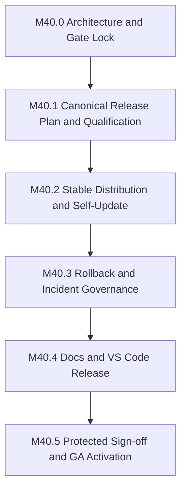

# Phase 40: Stable Channel GA Promotion and Release Governance

status: in-progress

## Objective

Promote Sifr to a public stable channel only through one deterministic,
auditable, locally qualified, and incident-recoverable release system.

Phase 40 owns the complete GA release surface:

- stable release qualification and artifact eligibility,
- the canonical stable release plan and governed release index,
- stable installer entrypoints and immutable version assets,
- stable-channel support in `sifr self update`,
- release sign-off and protected publication,
- rollback, withdrawal, incident recovery, and release retention,
- stable documentation and support claims,
- VS Code extension qualification and Marketplace publication governance.

The phase is complete only when the exact artifacts qualified by the local
release gate are the artifacts published, installed through
`https://sifr.sh/install`, consumed by `sifr self update`, documented publicly,
and paired with the qualified VS Code extension.

## Upstream Handoffs

Phase 40 consumes these completed or canonical upstream contracts:

- Phase 30 reliability and stdlib parity evidence.
- Phase 33 preview distribution's site layout at
  `apps/sifr-site/public/install/`. The former
  `sifr-lang/sifr-blog-website` remote now resolves to the verified canonical
  identity `sifr-lang/sifr-website`.
- Phase 34 generated-code quality and production-readiness gates.
- Phase 35 performance budgets and waiver policy.
- Phase 36 production developer tooling, especially the `editor_integrations`
  submodule and its `vscode/` package at `editor_integrations/vscode`, plus the
  main-repository `developer_tooling` `editor-release` validation suite.
- Phase 37 package and Cargo-backed toolchain contracts.
- Ad Hoc Sifr Self Update
  (`../issues/archive/ad-hoc-sifr-self-update.md`) as the preview implementation
  substrate. The live implementation and
  `internal_docs/distribution_pipeline.md` are authoritative where the archived
  plan is stale.
- Phase 38 documentation topology and quality-gate goals. Phase 40 owns all
  stable-release-specific documentation and must add any missing executable
  documentation checks needed for GA; completion of unrelated Phase 38 scope
  is not an entry prerequisite.
- Phase 39 Rust interop, including the machine-readable compatibility matrix
  and its distinction between `supported`, `supported-through-bridge`,
  `unsupported-by-design`, and `future-owned-by-separate-phase`.
- The release-facing prerequisites in
  `plans/issues/archive/rust-interop-verification-matrix-hardening.md`
  (`hardening_1` through `hardening_4`) and
  `plans/issues/active/rust-interop-runtime-ecosystem-certification.md`
  (merged Track A certifications 0 through 14, completed by
  [PR #3083](https://github.com/sifr-lang/sifr/pull/3083)). The hardening items are consumed
  by `milestone_40_0`. Before stable qualification in `milestone_40_1`,
  `certification_0` created
  `verification/areas/rust_interop/data/stable_support_claims.json` plus its
  stable-candidate validator. `certification_0` also registers that validator
  as the `rust_interop` `stable-candidate` suite and selects it in create-PR,
  merge, nightly, and release. Phase 40 consumes the registered suite and its
  result. The
  Rust-interop profile contract requires every registered suite in every
  authoritative profile; Phase 40 must not make `stable-candidate`
  release-only or substitute prose checks for it. The four hardening
  implementation items are merged through
  [PR #3023](https://github.com/sifr-lang/sifr/pull/3023);
  certification prerequisites and the stable claims contract are merged through
  [PR #3026](https://github.com/sifr-lang/sifr/pull/3026);
  the remaining Track A certifications subsequently resolved every current
  deferred row with passing evidence and completed the final stable-gate
  closeout. Track B remains dormant until an
  external bridge-version 2 package-resource substrate exists and is not a
  Phase 40 blocker while absent and unadvertised.

Phase 40 does not infer Rust ecosystem support from prose. It may advertise
only the exact Rust interop surfaces accepted by the current compatibility
matrix, `stable_support_claims.json`, and the stable-candidate validator.

## Canonical Cutover Policy

Sifr has no installed-user compatibility obligation before GA. Phase 40 must
implement the canonical stable architecture directly.

- Do not publish parallel old/new metadata.
- Do not add schema migration, compatibility shims, legacy readers, fallback
  URLs, or fallback installers.
- Do not preserve self-update behavior for binaries built before the canonical
  Phase 40 cutover.
- Update every producer, consumer, validator, fixture, workflow, and document
  to the canonical contract in one governed cutover.
- Alpha and beta remain intentional preview channels after GA, but they use the
  same canonical release index as stable. They are not legacy paths.

## Stable Product Contract

### Channels and entrypoints

- `https://sifr.sh/install` defaults to `stable`.
- `https://sifr.sh/install/stable` explicitly selects `stable`.
- `https://sifr.sh/install/alpha` and `/install/beta` remain explicit preview
  entrypoints.
- `--channel alpha|beta|stable` and `SIFR_CHANNEL=alpha|beta|stable` use the
  same resolver.
- Exact stable versions use `X.Y.Z`. Alpha and beta use
  `X.Y.Z-alpha.N` and `X.Y.Z-beta.N`.
- `rc` is not a public channel in Phase 40. Public dispatchers, release
  metadata, receipts, workflows, generated installers, and self-update reject
  `rc` channel selection and `X.Y.Z-rc.N` versions.

### Supported release targets

GA publishes exactly these standalone targets:

- `aarch64-apple-darwin`,
- `x86_64-apple-darwin`,
- `aarch64-unknown-linux-gnu`,
- `x86_64-unknown-linux-gnu`.

Windows installers and package-manager distribution are out of scope.
Public documentation must state the supported targets and the minimum
macOS/Linux ABI or OS floor established by the release builders.

### Canonical governed release index

Phase 40 replaces the preview-only `channels.json` contract with the single
GA governance epoch, `schema_version: 2`. Every machine-readable contract
owned by Phase 40 uses that same schema version. The exact JSON Schemas are
checked in under
`verification/areas/distribution_release/schemas/`.

The schema contains only data, never executable URLs:

- a monotonically increasing `generation`,
- a one-way `ga_status` of `preview` or `active`,
- required `channels` mappings for `alpha` and `beta`, plus a conditionally
  required `stable` mapping,
- a `releases` map keyed by exact version,
- for each release: channel, status, source commit, installer SHA-256, and the
  required target artifact SHA-256 and sysroot-content SHA-256 values,
- an optional incident identifier only when status is `withdrawn`.

Allowed release statuses are `active` and `withdrawn`.

Invariants:

- While `ga_status` is `preview`, `stable` is absent and stable channel or exact
  stable-version selection is rejected. Activation changes `ga_status` to
  `active` once; it never returns to `preview`.
- While `ga_status` is `active`, `stable` is required.
- Every present channel points to an `active` release of the matching version
  class.
- Exact version pins resolve only versions present in `releases`.
- Fresh installs and version pins reject `withdrawn` versions.
- Metadata never supplies an installer or artifact URL. Trusted code derives
  GitHub URLs from repository constants and the validated version.
- Dispatchers and `sifr self update` verify the downloaded immutable
  installer's SHA-256 from the governed release index before execution.
- The immutable installer verifies the selected target artifact and sysroot
  against the same release record before replacement.
- A metadata update must present the expected previous generation and digest.
  The single metadata-mutation workflow reacquires and verifies both after
  entering its repository-wide publication concurrency group and immediately
  before replacement; stale mutation attempts fail before mutation. Candidate
  stable plans do not pin this whole-index value.
- The GitHub `channels` release is the governance release. It contains the
  mutable current `channels.json` plus uniquely named, write-once
  `channels-generation-<N>.json` history and versioned sign-off records.
- `<N>` is the proposed new generation, allocated as one greater than the
  maximum generation in the current index and all retained generation
  snapshots. Generations are strictly increasing but need not be contiguous.
  Publishing the snapshot reserves that generation. If replacement then fails,
  that never-activated generation remains as attempt evidence and a retry uses
  the next generation; it never deletes or overwrites the orphaned snapshot.

### Single schema epoch and ownership

`schema_version: 2` identifies the canonical Phase 40 release-governance
epoch, not a compatibility option. Every checked-in Phase 40 JSON Schema
requires that exact value with no default. Every producer emits it, and every
consumer or validator rejects a missing, non-integer, or non-`2` value before
using any other field.

- `channels.json`, `stable-release-plan.json`,
  `stable-release-signoff.json`, official install receipts,
  `sifr self version --format json`, self-update plan JSON,
  `qualification-artifact-index.json`, `stable-site-release-facts.json`,
  `site-publication-facts.json`, `stable-incident-request.json`,
  `stable-incident-signoff.json`, and `release-profile-report.json` all use
  `schema_version: 2`.
- Receipt, CLI-version, and self-update-plan producers and consumers are
  replaced atomically with the canonical alpha/beta/stable field and enum
  definitions. `rc` is deleted rather than retained beside stable.
- `stable-site-release-facts.json` is generated during publication from the
  governed index and approved plan. It binds the realized generation, active
  stable version, withdrawal/incident facts, source plan digest, and dispatcher
  digests consumed by `sifr-lang/sifr-website`; it is not a second release
  authority. Its realized payload and digest are post-approval evidence recorded
  in sign-off, not candidate-plan inputs.
- `site-publication-facts.json` is the schema-v2 cross-repository binding for
  each preview publication attempt. It binds exact source/site commits, plan
  and release-index identity, the GA-aware site default, and all four generated
  dispatcher digests before the paired site workflow is dispatched.
- `stable-incident-request.json` defines `rollback` and
  `incident-roll-forward`. It binds the incident id, trigger,
  affected active version and approved plan digest, requested operation,
  withdrawal reason/evidence, and—when rolling back—the active target version
  and approved plan digest.
- `stable-incident-signoff.json` references the immutable incident-request
  digest and records the protected
  attempts/approvers, realized index mutation and generation, site
  reconciliation, validation, communication, and closure.
- `release-profile-report.json` records a stable report identifier, clean
  source commit and recursive
  submodules, resolved profile-manifest digest, command/toolchain, overall
  pass/fail status, every required lane step/suite result, and result-artifact
  digests. Canonical JSON bytes are SHA-256-bound externally by the release
  plan; the report contains no self-referential digest.

Schema v1 is discarded preview state. Phase 40 deletes v1 fixtures, readers,
writers, validators, and documentation in the same cutover. There is no
version negotiation, schema autodetection, migration, dual read/write,
compatibility adapter, or fallback. Phase 40-only contracts start at version 2
so every governed payload belongs unambiguously to the same GA epoch.

The known release-profile digest is the SHA-256 of canonical JSON bytes from
`verification/profiles/release.json` at the report's source commit after schema
validation. The report also records the runner's fully expanded selected
areas/suites so profile selection cannot drift behind the manifest digest.

New incident requests enter custody through evidence-only PRs at
`plans/releases/incidents/<incident-id>/stable-incident-request.json`. Workflow
dispatch accepts only an evidence commit SHA, repository-relative artifact
path, and expected digest—never raw plan/request JSON or a workstation path.
- Generated installers derive `APP_CHANNEL=stable` explicitly for `X.Y.Z`;
  prerelease-suffix derivation is used only for alpha and beta.

## Stable Release Plan

Every candidate stable release is represented by one machine-readable
`stable-release-plan.json`. A checked-in JSON Schema and validator own this
contract. The planner generates it in a release work directory at the already
resolved release commit. The work directory is outside the repository checkout
so generated evidence cannot dirty the qualified source tree. The exact plan
and canonical release-profile report then enter custody through an evidence-only
PR under `plans/releases/candidates/<version>/`. That evidence commit is not the
release source commit: the plan continues to bind the earlier clean source
commit.
After evidence review, changing either file requires a new evidence commit,
digest, and approval. Publication copies the same bytes to write-once
version-release assets. The plan binds:

- stable version and immutable source commit SHA,
- recursive submodule SHAs,
- `Cargo.lock` digest and the release toolchain identity,
- the expected stable predecessor version/status (`none` for first GA) and the
  desired stable release record, without binding unrelated alpha/beta
  generations,
- the four supported targets and their builder identities,
- binary, sysroot, archive, checksum, and installer digests,
- `sifr --version`, installer `APP_VERSION`, receipt version/channel, and
  sysroot version/target agreement,
- canonical local `release` profile report identifier and digest,
- qualification workflow run/artifact identifiers, digests, and expiry for
  every candidate binary, installer, sysroot, VSIX, and other transported
  artifact,
- the Rust interop compatibility-matrix digest,
  `stable_support_claims.json` digest, exact advertised claim identifiers, and
  stable-candidate validation report,
- the `documentation` `ga-release` suite report,
- the exact `sifr-lang/sifr-website` base commit, generated dispatcher
  digests, and site-release-facts schema/generator source digests; the plan does
  not bind the generation-dependent realized facts payload,
- the `vscode/` package path within the already-recorded recursive
  `editor_integrations` submodule, package version, VSIX digest, compiler
  compatibility range, and validation report,
- release notes, transition kind, and `rollback_target`:
  - first GA uses `ga-activation` and `none`,
  - a normal later release uses `normal` and the exact active stable
    predecessor,
  - governed incident recovery uses `incident-roll-forward` and `none`, plus the
    approved `stable-incident-request.json` digest and desired successor release
    record. The incident request owns the incident identifier, affected active
    version, and withdrawal reason/evidence.

The candidate plan is immutable once approved. Publication produces a separate
`stable-release-signoff.json` that references the candidate plan digest and
records an `attempts` list with each initial/resume run, mode, approver, status,
and mutations, plus published asset digests, Marketplace identity, channel
generation, and post-publication smoke.
The sign-off record has its own checked-in schema and validator; post-approval
evidence never rewrites the approved candidate plan.

The release workflow resolves a requested ref to one commit before building.
Every platform builder and publisher verifies that exact commit and submodule
set. A moving branch name is never recorded as release provenance.

All alpha, beta, and stable version releases and their assets are write-once:

- initial publication fails if the version tag, archive, checksum, installer,
  or release-plan asset already exists,
- version-asset publication never uses `--clobber`,
- rebuilds use a new version,
- `channels.json` is the only mutable release asset and is replaced only by the
  canonical main-repository `.github/workflows/release-publication.yml`,
- alpha, beta, stable, and rollback mutations use the shared
  `sifr-release-index` concurrency group.

The protected stable workflow has explicit `initial` and `resume` modes.
`resume` requires the same approved plan digest and a fresh protected approval.
It inventories remote state before writing:

- an already-published version asset is reused only when its name, SHA-256, and
  release-plan provenance exactly match the approved plan;
- missing planned assets may be uploaded, but mismatched or unattributable
  existing assets fail; nothing is overwritten;
- in either mode, an already-published Marketplace version is downloaded
  through the Gallery API's raw
  `Microsoft.VisualStudio.Services.VSIXPackage` asset and reused only when its
  VSIX digest and metadata match the plan; otherwise publication fails;
- completed steps are skipped, and the sign-off records every initial and
  resume workflow run.

This is idempotent completion of one approved publication, not a second
artifact path. Any artifact or package-version change requires a new version
and a newly qualified plan.

GitHub release assets do not provide atomic compare-and-swap. Phase 40 therefore
has exactly one enforcement path: every release-index mutation runs in the
canonical main-repository `.github/workflows/release-publication.yml` under the
`sifr-release-index` concurrency group, and that workflow rechecks the expected
generation and digest immediately before replacing `channels.json`. Existing
local `--real-run` publication paths become plan/dry-run only, and preview
publication must call the canonical workflow rather than upload metadata
independently.

After acquiring the concurrency group, the workflow reads the live index,
validates the plan's expected stable predecessor, preserves the live alpha/beta
records, allocates the next generation, and constructs an internal mutation
request with the live previous generation and digest. Unrelated preview
publication does not invalidate an approved stable plan; a changed stable
predecessor does.

Phase 40 does not introduce a separate artifact-signing or notarization system.
Its GA integrity boundary is the protected GitHub publication environment,
write-once version assets, SHA-256-bound release metadata, exact source
provenance, and installer-side checksum enforcement. Public docs must not claim
cryptographic signing or notarization.

## Milestone Sequencing

Milestones execute in order. Each milestone is one reviewable PR unless its
execution issue records an approved smaller split or an ordered
cross-repository PR sequence.



## Milestones

### milestone_40_0: Architecture and Gate Lock

**Goal:** Turn the stable contract into one owned implementation and
verification inventory before mutation-capable work begins.

**Scope:**

- Check in the release-index, stable-release-plan,
  stable-release-signoff, and qualification-artifact-index schemas.
- Check in the derived `stable-site-release-facts.json` schema and generator.
- Check in the stable-incident-request and stable-incident-signoff schemas,
  generators, and validators.
- Check in the canonical release-profile-report schema and add a profile-runner
  `--release-report-out <path>` mode. It requires a clean source tree, writes
  canonical JSON to a caller-selected fresh directory outside the repository
  checkout, fails if the output exists, and includes source/profile identity
  plus an overall verdict. The existing overwriteable
  `<profile>.latest.*` developer reports are never valid release evidence.
- Perform the one atomic schema cutover: require `schema_version: 2` in every
  Phase 40 schema, fixture, generated artifact, CLI JSON response, and
  validation entrypoint. This milestone replaces the existing install-receipt,
  `sifr self version --format json`, and self-update-plan schemas, producers,
  consumers, fixtures, and tests alongside the governance contracts above.
  Delete every v1 fixture and code path in the same change; do not retain
  conversion tests or transitional readers.
- The v2 schemas define the final alpha/beta/stable enum during this cutover,
  but schema acceptance does not activate stable behavior. Stable resolution,
  and installation remain unavailable until `milestone_40_2`; the non-mutating
  dry-run stable planner arrives in `milestone_40_1`; and no publication
  workflow accepts stable until `milestone_40_5`.
- Extend `scripts/run_all_tests.sh` to pass that explicit report-output option
  through to the profile runner without changing ordinary profile behavior.
- Add repository checks for the evidence-only candidate/incident directories:
  each evidence commit names one immutable source/request, validates all
  schemas/digests, and cannot mix compiler-source changes with release
  evidence.
- Register those checks as the `distribution_release` `evidence-custody` suite
  and add it to the durable release profile.
- Confirm the upstream stable-candidate validator is registered in the
  Rust-interop manifest as the `stable-candidate` suite.
- Create `verification/areas/documentation/manifest.json` and register its
  manifest owner in `verification/owners.json`. Its initial `structure` suite
  validates the docs inventory, check registration, and mutation-test harness
  without requiring GA wording before `milestone_40_4`.
- Extend the existing release-profile facade configured under the internal
  `legacy_facade` manifest key in
  `verification/runner/sifr_verify/profile_runner.py` with an executable
  `documentation_checks` step. That key names existing runner plumbing; it is
  not a product compatibility surface, and Phase 40 must not add a second
  facade. Add self-tests that fail when a selected documentation suite is
  omitted or emits no result. Preserve the 900-line source cap; split
  profile-step execution by responsibility before adding the inherited Rust
  and documentation steps if the combined file approaches it.
- Confirm that the durable release profile's existing
  `legacy_facade.tooling_suites=["full"]` expands to and executes
  `editor-release`; do not add a duplicate `editor-release` selection.
- Confirm `rust_interop` `stable-candidate` is present in the inherited
  executable Rust-interop step in create-PR, merge, nightly, and release.
  Confirm, rather than re-add, the existing `distribution_release` `full`
  execution and the four structural Rust-interop suites. The governed release
  report remains the stable-candidate authority for a concrete release, but
  suite registration must preserve the all-profiles Rust-interop contract. Do
  not create a Phase-40-only profile.
- Inventory every current stable gate in workflows, distribution scripts,
  dispatchers, Rust self-update code, receipt validation, docs, and tests.
- Record the canonical owner and target disposition for every gate.
- Define the exact GA version, supported OS/ABI floors, release owner, incident
  owner, and protected-environment reviewer policy in the execution issue.
- Confirm the Rust-interop hardening prerequisites have merged. Validate the
  separately delivered initial `stable_support_claims.json` against the
  Phase 39 compatibility matrix before `milestone_40_1` qualification.
- Add the Phase 40 execution checklist issue and map every later validation
  artifact to a milestone and exit-gate requirement.

**Definition of done:**

- Schema validators reject missing fields, unknown fields, invalid version
  classes, channel/release mismatch, missing targets, zero hashes, duplicate
  releases, non-monotonic generation, withdrawn channel targets, invalid
  `ga_status`, preview metadata with `stable`, active metadata without `stable`,
  an active-to-preview transition, `ga-activation` with a non-`none` rollback
  target, a `normal` later plan with a missing/mismatched active-predecessor
  target, an `incident-roll-forward` plan without `rollback_target: none` or
  a matching approved incident-request digest/successor record, an incident
  request whose affected version is not the live expected stable predecessor,
  an incident id on an `active` release, a rollback request with an inactive or
  mismatched target/plan digest, an incident mutation that does not atomically
  withdraw the named affected version while activating its successor, site
  facts that disagree with the governed index, or release/incident sign-off
  attempts missing run, mode, approver, status, or mutation evidence.
- Every validator rejects an absent schema version and every value other than
  integer `2`; repository search checks fail if a Phase 40 schema, fixture,
  producer, or consumer still names schema v1 or implements version
  negotiation.
- The report validator rejects a dirty/unresolved source, source/submodule
  mismatch, unknown profile digest, missing required step/suite, non-pass
  overall status, noncanonical JSON, or result-artifact digest mismatch.
- The evidence-custody suite rejects a commit that mixes source and release
  evidence, contains more than one candidate/incident request, uses an invalid
  path, or differs from any recorded artifact digest.
- The stable-gate inventory has no unowned entry.
- Create-PR, merge, nightly, and release visibly execute the Rust-interop step
  with all four structural suites. `milestone_40_1` adds `stable-candidate`
  before qualification, and the governed `release` report then records the
  concrete stable-candidate verdict.
- The release report contains passing `full/editor-release:*` case evidence
  exactly once. A runner self-test selects `documentation` `structure` and
  proves that
  `name=documentation_checks ... status=pass` is emitted; selected-but-unrun
  documentation suites fail the runner self-test.
- No publication workflow can accept stable yet.

**Positive validation:**

- Valid schema-v2 alpha/beta/stable metadata and every other governed
  schema-v2 artifact pass.

**Negative validation:**

- Seeded invalid metadata and release plans fail before any mutation.
- Existing stable publication attempts remain gated.

**Demo:** A local dry run renders the canonical release plan and validates it
without network access or repository mutation.

### milestone_40_1: Canonical Release Plan and Qualification

**Depends on:** `milestone_40_0`

**Goal:** Ensure the exact source and artifacts selected for GA have complete
local qualification and drift-free provenance.

**Scope:**

- Implement one dry-run-first stable release planner that resolves the source
  ref once, validates complete fixture-backed plan inputs, and performs no
  mutation. The real candidate plan is materialized in `milestone_40_4` after
  its documentation and VSIX inputs exist.
- Add `.github/workflows/release-qualification.yml` as a build/upload-only
  stable-candidate workflow. It accepts an exact 40-hex source commit and stable
  version, checks out that commit with recursive submodules, has
  `contents: read` / `actions: read` only, and has no release, package,
  Marketplace, site, environment, or metadata-mutation permission.
- Use the existing runner matrix exactly:
  - `aarch64-apple-darwin` on `macos-15`,
  - `x86_64-apple-darwin` on `macos-15-intel`,
  - `x86_64-unknown-linux-gnu` on `ubuntu-24.04`,
  - `aarch64-unknown-linux-gnu` on `ubuntu-24.04-arm`.
- Each matrix job builds, packages, installs, and smokes its matching stable
  binary/sysroot; an assemble job verifies the complete matrix and produces the
  aggregate installer/checksums. An editor job runs the recorded
  `editor_integrations/vscode` qualification and packages the VSIX without
  publishing it.
- Upload artifacts with names
  `sifr-stable-candidate-<version>-<source-sha>-<target-or-kind>`,
  `overwrite: false`, and `retention-days: 30`. A final read-only collector
  queries the run artifacts and emits canonical
  `qualification-artifact-index.json` containing workflow run id, source and
  submodule SHAs, artifact ids/names/kinds/targets, SHA-256 values, and exact
  expiry. Its upload-artifact id is exposed in the run summary.
- Extend artifact generation to stable SemVer without adding an alternate
  builder.
- Build on each supported target with locked dependencies.
- Execute the produced `sifr` and installed sysroot on the matching host.
- Verify binary version, sysroot manifest, archive contents, artifact digest,
  installer digest, target, and release-plan agreement.
- Wire stable qualification into `distribution_release`.
- Verify that the inherited Rust interop `matrix`, `tiers`,
  `compatibility-matrix`, `stale-drafts`, and `stable-candidate` suites run
  through the release profile, and consume the stable-candidate result in the
  qualification record.
- Run the stable-candidate validator against
  `stable_support_claims.json`; it fails if a stable public claim is absent
  from the claims file, disagrees with its matrix execution scope, is
  `future-owned-by-separate-phase`, or promotes contract-only evidence to a
  runtime-support claim.
- Register the separately delivered stable-candidate validator in the
  Rust-interop manifest and add it to the inherited executable Rust-interop
  step in create-PR, merge, nightly, and release before qualification.
- Make the planner require a passing
  `scripts/run_all_tests.sh --profile release` report for the same source
  commit represented by its inputs. The run uses `--release-report-out` to
  create the canonical report in the fresh release work directory; the planner
  validates and hashes those exact bytes.

**Definition of done:**

- A fixture-backed dry run produces a byte-deterministic, schema-complete plan
  for identical inputs.
- Changing any commit, submodule, lockfile, version, target, artifact, sysroot,
  installer, or Rust-claim input owned by this milestone changes the fixture
  plan digest.
- A passing plan references a passing release-profile report for the same
  source commit.
- The report identifier/digest is stable after evidence review, and another
  ordinary `release` profile run cannot overwrite its bytes.
- A passing plan references the exact compatibility matrix, stable claims file,
  and stable-candidate report that governed qualification.
- The qualification index lists all four target bundles, aggregate installer,
  checksums, and VSIX; every recorded id resolves to an unexpired,
  overwrite-disabled artifact whose digest and source identity match the index.

**Positive validation:**

- All four target artifacts install and run on matching hosts.
- Repeated dry runs over identical inputs produce identical plans.

**Negative validation:**

- Floating or mismatched refs, cross-target artifacts, stale reports, missing
  target evidence, a qualification run for another source commit, an
  expired/missing artifact, and version/digest drift fail qualification.

**Demo:** A local planner run consumes fixture-backed docs and VSIX evidence
plus a newly built host artifact, emits a schema-complete unapproved plan,
installs the artifact in an isolated directory, and runs `sifr --version`,
`sifr check`, and `sifr self version`.

### milestone_40_2: Stable Distribution and Self-Update

**Depends on:** `milestone_40_1`

**Goal:** Implement stable fresh install and self-update through the canonical
release index and immutable installer.

**Scope:**

- Add stable channel and version behavior only to the already-canonical
  schema-v2 producers and consumers cut over in `milestone_40_0`; this milestone
  does not introduce another schema transition or retain an earlier format.
- Add stable version parsing and total ordering to dispatchers, installers,
  receipts, and Rust self-update.
- Remove `rc` from the remaining non-JSON runtime and workflow surfaces:
  installer `APP_CHANNEL` derivation, dispatcher exact-pin parsing, and
  `preview-release.yml` inputs, plus their tests and docs. The schema, receipt,
  CLI, self-update-plan, and fixture removals already occurred in the atomic
  `milestone_40_0` cutover. The preview workflow accepts only alpha and beta;
  stable is accepted only by the protected stable path introduced in
  `milestone_40_5`.
- Generate `/install`, `/install/stable`, `/install/alpha`, and `/install/beta`
  from one dispatcher generator; `/install` defaults to stable.
- Require installer SHA-256 verification before executing a downloaded
  installer.
- Require exact stable pins to be active governed releases.
- Preserve receipt eligibility before network access, trusted URL derivation,
  install locking, atomic replacement, and installer-owned extraction.
- Keep Rust self-update free of archive extraction and binary replacement.
- Create `.github/workflows/release-publication.yml` as the sole reusable
  mutation workflow, using the `sifr-release-index` concurrency group. It
  initially exposes only alpha and beta operations; no rollback or
  stable-changing input exists until `milestone_40_5`.
- From its first alpha/beta mutation, the workflow applies the canonical
  max-generation allocator and publishes the write-once generation snapshot
  before replacing `channels.json`; snapshot history is not deferred to the
  rollback milestone.
- Add a paired deployment workflow in `sifr-lang/sifr-website`. The main
  publication workflow dispatches it with the exact Sifr source commit, release
  plan digest, publication-attempt identifier, release-index generation, site
  base commit, and generated dispatcher/release-fact digests. The site workflow
  checks out those exact inputs, regenerates into
  `apps/sifr-site/public/install/`, verifies the digests, deploys through the
  existing `sifr.sh` deployment, and exposes a correlated terminal run result
  that the main workflow polls and verifies.
- Land the `sifr-lang/sifr-website` workflow PR before the main-repository
  M40.2 PR that pins and dispatches it; record both PRs in the execution issue.
- Authenticate that cross-repository dispatch with a protected GitHub App or
  fine-grained token scoped only to the required Actions/contents operations on
  `sifr-lang/sifr-website`; no workstation credential is a release
  mechanism.
- Order site deployment strictly after successful `channels.json` replacement.
  The main workflow retains the `sifr-release-index` concurrency lease while it
  waits for and verifies the correlated site run, but the poll has a hard
  20-minute deadline. On expiry the main workflow requests cancellation,
  records a terminal failed attempt, exits, and releases the lease. The
  downstream site workflow is not a second release-index writer and never
  uploads channel metadata.
- Dispatch the reviewed workflow through an immutable tag because GitHub's
  workflow-dispatch API accepts only a branch or tag ref. Resolve that tag to
  the exact reviewed protected-main commit both before any release mutation and
  again immediately before dispatch. Require an active exact-name repository
  ruleset with no bypass actors to prohibit updates and deletion of the tag,
  and revalidate that ruleset at both boundaries.
- Immediately before site commit/deploy, the downstream workflow re-fetches the
  governed index and requires its generation and digest to match the dispatched
  payload. A timed-out or superseded run therefore cannot deploy after a
  rollback.
- Refactor `preview-release.yml` and the local
  `scripts/distribution/create_new_version.sh` path so version assets are
  write-once, all channel mutations call `release-publication.yml`, and local
  execution can only render and validate a plan.
- Treat `channels.json` as the sole intentionally replaced asset. Remove
  version-asset `--clobber`, reject an existing version release or asset, and
  delete any local top-level `channels.json` shadow path so schema-v1 residue
  cannot override the canonical fetched index.
- Define channel switching uniformly: switching between alpha, beta, and stable
  requires `--force`; ordinary newer-version updates within the receipt channel
  do not.

**Definition of done:**

- Against an isolated schema-v2 fixture with `ga_status: active`, fresh stable
  install, stable-to-stable update, stable no-op, exact stable pin, and forced
  preview-to-stable switch work. No public stable publication occurs.
- Invalid stable versions, unlisted versions, withdrawn versions, bad installer
  digests, mismatched receipts, stale metadata generations, and `rc` requests
  fail before installer execution.
- Alpha and beta pass the same schema-v2 integrity rules.
- Every v1, version-less, version-negotiated, or dual-format payload is rejected
  before resolution, installer execution, evidence acceptance, or mutation.
- Repository checks prove that no receipt/workflow/installer/dispatcher/self-
  update surface accepts `rc`, no local command can publish, and no version
  asset upload uses `--clobber`.
- A fixture-backed cross-repository test rejects a moving site ref, mismatched
  dispatcher digest, stale generation, or site run not attributable to the
  protected main-repository publication run.

**Positive validation:**

- Fixture-backed fresh stable install and every supported stable update path
  complete through the delegated immutable installer.

**Negative validation:**

- Metadata URL injection, installer digest mismatch, artifact digest mismatch,
  version/channel conflict, and receipt/binary mismatch are rejected.

**Demo:** An isolated mock index with `ga_status: active` performs
beta-to-stable `--force`, then a normal stable-to-stable update, showing the
receipt and sysroot move together while the public workflow still rejects
stable input.

### milestone_40_3: Rollback and Incident Governance

**Depends on:** `milestone_40_2`

**Goal:** Make stable promotion recoverable through the same governed release
surface without mutating released assets.

**Scope:**

- Define rollback triggers, release and incident owners, approval authority,
  acknowledgement target, communication locations, and closure evidence.
  The acknowledgement target must exceed the 20-minute site-wait deadline.
- Implement rollback as a new release-index generation that:
  - marks the affected version `withdrawn`,
  - points `stable` at the approved active rollback version,
  - records an incident identifier,
  - preserves immutable version assets and evidence.
- Permit rollback only when a `normal` plan names an active stable predecessor.
- Define the `incident-roll-forward` plan and mutation. Its approved plan binds
  an approved incident-request digest, desired qualified successor record, and
  `rollback_target: none`. The request binds the incident identifier, affected
  currently active version/plan digest, and withdrawal reason/evidence. The
  workflow cross-validates both artifacts, publishes the successor, then
  atomically activates it and withdraws the named affected version in one new
  index generation. The next normal stable release may restore rollback
  eligibility by naming that still-active successor as its rollback target.
- Make rollback validate an approved incident request before mutation. The
  request names the affected current version/plan and the active target
  version/plan; protected approval applies to its digest.
- Generate each incident request in a clean work directory, then land it through
  an evidence-only incident PR. Repository checks reject source changes,
  schema/digest drift, or unrelated incident files in that evidence commit.
- Implement rollback and `incident-roll-forward` as pure mutation
  planners/validators plus a network-disabled verification harness. The harness
  accepts only an explicit temporary filesystem index, release-asset
  directory, Marketplace stub, and non-deploying site-repository fixture. It
  has no GitHub/Marketplace/site credentials, no `gh`/real `vsce`/repository
  dispatch adapter, and no production repository input.
- Do not add rollback or `incident-roll-forward` workflow inputs or write
  permissions in this milestone. `milestone_40_5` alone wires the tested core
  into protected production operations.
- The shared rollback core models the post-index site dispatch, deadline,
  generation/digest recheck, cancellation, and resume contract through the
  non-deploying site fixture. `milestone_40_5` wires its production adapter.
- Keep downgrade consent explicit: an affected stable install refuses the older
  target without `--force`, emits the recovery command, and delegates the
  forced downgrade to the immutable installer.
- Provide an out-of-band recovery command through `/install/stable --force`
  for an affected `sifr` binary that cannot run self-update.
- Serialize rollback and preview/stable publication through the same metadata
  concurrency group and expected-generation check.
- Define retry behavior for failures before version publication, after partial
  or complete version/Marketplace publication but before channel activation,
  after activation during site deployment/smoke/sign-off, and during channel
  rollback.
- GitHub concurrency retains at most one pending run per group. The release
  preflight refuses a new preview/stable submission while a rollback is pending;
  any cancelled pending operation is recorded and must be explicitly
  resubmitted after the rollback.
- Retain every version tag and asset, candidate evidence commit, approved
  release plan, canonical release-profile report, sign-off record,
  release-index generation snapshot, incident request/evidence commit, and
  incident sign-off for the lifetime of the repository, including withdrawn
  releases. No automated pruning is allowed. Before an incident mutation, the
  canonical workflow publishes the approved request as a uniquely named
  write-once governance-release asset. It publishes each
  `channels-generation-<N>.json` snapshot as a uniquely named write-once asset
  in the governance release before replacing the current `channels.json`.
  Realized site-release-facts payloads and versioned sign-off records are
  published there after their respective generation and post-publication smoke
  exist; incident operations use `stable-incident-signoff.json`.
- Implement the post-rollback reconciliation mechanism against fixture-backed
  site and extension metadata: the site deployment payload derives the active
  stable version and withdrawal notice from the new governed index, while the
  extension-range validator requires the rollback target to remain covered.
  Marketplace metadata states a range, never an exact active stable version; a
  rollback target outside that range is ineligible. The range check is skipped
  when `ga-activation` or `incident-roll-forward` correctly records
  `rollback_target: none`. Public assertions wait for the real docs/range in
  `milestone_40_4` and publication in `milestone_40_5`.

**Definition of done:**

- Rollback is tested for fresh installs, working affected self-update clients,
  and out-of-band recovery.
- A fixture-backed first-GA incident proves the sole stable version cannot be
  withdrawn alone, an approved `incident-roll-forward` plan names every
  mutation, and roll-forward activates a qualified successor while withdrawing
  the affected version atomically.
- Withdrawn versions cannot be selected by channel or exact pin.
- A failed or racing rollback cannot silently overwrite a newer metadata
  generation.
- An immutable validated incident request authorizes each incident mutation;
  its incident sign-off records request digest, attempts/approvers, mutations,
  communication, validation, and closure.
- Retention checks prove that rollback and withdrawal add evidence without
  deleting or overwriting any version asset or prior generation snapshot.
- Failure after reserving generation `N` but before index replacement leaves
  `N` retained and inactive; protected resume verifies and reuses exact existing
  version/Marketplace state, then activates `N+1` or later. Failure after index
  replacement resumes any remaining dispatcher/docs deployment, smoke, and
  sign-off without a second index mutation.
- Site wait timeout is a terminal, lease-releasing failure. Resume mode verifies
  that the current generation/digest still equals the intended activated index,
  skips index mutation, and dispatches a new correlated site attempt. Once the
  lease is released, rollback may proceed and supersedes/cancels any outstanding
  site attempt.
- Fixture-backed reconciliation proves rollback changes the generated site
  release facts to the rolled-back active version and incident, and rejects
  extension metadata whose range excludes that version.
- Repository checks prove `release-publication.yml` exposes neither rollback
  nor `incident-roll-forward`, the harness has no network-capable adapter or
  production credential input, and no M40.3 test can mutate a GitHub release,
  Marketplace listing, or deployed site.

**Positive validation:**

- Against a two-stable-version fixture, an approved rollback moves fresh
  installs immediately and allows an affected install to downgrade with
  `--force`.

**Negative validation:**

- Unapproved rollback, missing incident id, a `rollback` operation whose active
  stable release records `rollback_target: none`, non-active target, stale
  generation, rollback without required force, or any production endpoint in
  the fixture harness are rejected.

**Demo:** A local two-stable-version mutation harness publishes a mock bad
stable generation, withdraws it, rolls back, and recovers both a
self-update-capable and a broken mock installation. A separate one-version
fixture demonstrates first-GA roll-forward. `milestone_40_5` reruns both
against the protected non-production path before activation.

### milestone_40_4: Stable Documentation and VS Code Release

**Depends on:** `milestone_40_3`

**Goal:** Publish one truthful GA product surface across compiler docs,
install/update guidance, Rust interop claims, and the VS Code extension.

**Scope:**

- Update public installation, self-update, CLI, compatibility, support,
  troubleshooting, and release documentation for stable.
- Add executable docs checks for required GA sections, internal/public drift,
  supported target claims, stable command examples, release version, and
  release-index schema references in the `documentation` `ga-release` suite;
  add that suite to the release profile's executable `documentation_checks`
  step.
- Generate and validate Rust interop support wording from
  `stable_support_claims.json`, cross-checked with the compatibility matrix;
  run the stable-candidate mode so future-owned and contract-only overclaims
  fail mechanically.
- Consume `editor_integrations/vscode` as the authoritative extension checkout.
- Keep extension SemVer independent from compiler SemVer, but require the
  extension release notes and Marketplace metadata to name the supported stable
  compiler range. The range must contain the candidate stable version and any
  non-`none` release-plan rollback target, and must not claim one exact active
  stable version.
- Run `npm ci`, lint, typecheck, unit tests, extension smoke tests, packaging,
  `sifr lsp --stdio` smoke with the exact stable candidate, and the main-repo
  `developer_tooling` `editor-release` suite.
- Remove stale committed VSIX files from `editor_integrations/vscode/dist`;
  `dist/` remains ignored and every candidate starts from an empty output
  directory.
- Land required `editor_integrations` package cleanup and metadata changes in
  its upstream repository first, then update the main-repository submodule
  pointer. The execution issue records this coordinated two-PR exception to the
  normal one-PR milestone rule.
- Produce exactly one VSIX from the recorded `editor_integrations` submodule
  SHA.
- Run `scripts/run_all_tests.sh --profile release --release-report-out
  <release-work-dir>/release-profile-report.json` for the exact final source
  commit.
- After docs, Rust claims, candidate artifacts, and the VSIX are final, invoke
  the planner to materialize `stable-release-plan.json` and bind the docs suite
  report, release-profile report, package version, VSIX SHA-256, compatibility
  range, and validation evidence.
- Record the exact qualification workflow run/artifact ids, digests, and expiry
  in the plan. Artifacts are uploaded with immutable names and overwrite
  disabled; expiry before publication invalidates the candidate and requires
  requalification.
- Evidence approval and protected publication must begin with at least seven
  full days remaining in the 30-day artifact-retention window. Falling below
  that floor invalidates the candidate and requires a new qualification run and
  evidence review; artifact identity is never substituted. For the `0.1.0`
  candidate, whose qualification expires at `2026-08-28T02:17:30Z`, protected
  GA prepare must therefore begin before `2026-08-21T02:17:30Z`; the later
  temporary-waiver expiry does not extend that candidate deadline.
- Open the evidence-only candidate PR containing the exact plan and canonical
  profile report. Its checks prohibit source changes, validate all referenced
  artifacts/digests, and display the source commit, plan digest, report id, and
  report digest for review.
- Keep the extension package pipeline build/test/package-only. Marketplace
  publication is owned solely by the main-repository protected stable workflow
  in `milestone_40_5`, which must consume the recorded VSIX without rebuilding.

**Definition of done:**

- Docs, release plan, compiler behavior, compatibility matrix, and extension
  metadata agree.
- The recorded VSIX installs and launches the exact stable candidate LSP.
- A Marketplace publication plan binds the protected main-repository workflow
  to the recorded VSIX and package version without rebuilding. The
  credentialed dry run and publication evidence are realized and checked in
  `milestone_40_5`, where that workflow exists.
- Changing any final docs, Rust-claim, package-version, VSIX, compatibility, or
  extension-validation input changes the candidate-plan digest; an unchanged
  input set reproduces it byte-for-byte.
- The real GA docs render their active version/withdrawal facts from the
  governed release payload, and the packaged extension range passes the
  rollback-target validator introduced in `milestone_40_3`.
- The approved evidence commit contains byte-identical plan/report files, no
  compiler-source change, and only unexpired exact-digest candidate artifacts.
- Marketplace failure leaves the stable channel unactivated.

**Positive validation:**

- Packaged and installed VSIX completes editor activation, diagnostics, and
  formatting smoke against the stable candidate. Generated-Rust preview in the
  packaged candidate is a non-prerequisite tooling follow-up recorded in
  [`adhoc_packaged_candidate_generated_rust.md`](../issues/active/adhoc_packaged_candidate_generated_rust.md); GA docs explicitly record the
  affected action as outside the packaged `0.1.0` qualified surface.
- The exact-source release profile remains blocking while consuming the
  indexed, expiry-bound
  [`ALG-CORPUS`](../issues/active/ad-hoc-algorithmic-full-corpus-preexisting-failures.md)
  and
  [`GENC-NAN`](../issues/active/adhoc_generated_nan_constant_clippy_quality.md)
  non-prerequisite records.
  Release keeps the representative algorithm subset plus taxonomy self-test,
  and runs every full generated-code gate and corpus entry while requiring the
  three `GENC-NAN` entries to reproduce only their recorded Clippy lint.
  Nightly retains both unmodified full suites; neither record permits a test
  skip, broad allow, threshold change, or source fallback.

**Negative validation:**

- Compiler-range drift, extension-version drift, missing VSIX, VSIX digest
  mismatch, a non-`none` rollback target outside the advertised compiler range,
  stale Rust support claims, and preview-only docs fail the gate.

**Demo:** Install the candidate compiler and recorded VSIX into isolated
locations, open a Sifr fixture, demonstrate diagnostics and formatting through
the native LSP, and exercise linting, check, and tests through the exact
candidate compiler. Packaged-candidate generated Rust is the non-prerequisite
ad hoc follow-up named above.

### milestone_40_5: Protected Sign-off and GA Activation

**Depends on:** `milestone_40_4`

**Goal:** Publish stable only after the immutable candidate set and governance
evidence are complete.

**Scope:**

- Before stable activation, perform the one-time protected schema-epoch
  bootstrap in the same publication workflow. Publish fresh, qualified
  alpha/beta releases whose immutable assets and sysroot identities can
  truthfully populate schema-v2 release records, then replace the public
  schema-v1 preview index with a canonical schema-v2 `preview` generation.
  Bootstrap cannot add `stable`, cannot activate GA, and cannot retain or add a
  schema-v1 reader, migration producer, fallback, or synthesized digest for an
  old binary-only preview release. Its prepare summary, protected approval,
  immutable snapshot, exact asset digests, and public smoke are retained as
  publication evidence.
- Make installed-sysroot self-update qualification consume an isolated
  schema-v2 fixture through an explicit test-only endpoint override. Keep the
  protected post-publication public smoke as the separate proof against the
  real channel endpoint, so the authoritative local release profile is not
  coupled to mutable public network state.
- Enable the `ga-activation`, `normal`, `rollback`, and
  `incident-roll-forward` operations in the existing
  `.github/workflows/release-publication.yml`. Route every stable-changing
  operation through one `publish` job attached to the protected production
  environment. Do not add a second mutation workflow.
- Add a `prepare` job with read-only permissions and no protected environment.
  Dispatch supplies only the evidence commit SHA, candidate/incident path, and
  expected digest. `prepare` checks out that exact commit, rejects raw JSON or
  workstation paths, validates the plan/report/request schemas and digests,
  downloads the recorded unexpired qualification artifacts, verifies every
  digest/source identity, and emits a job summary with the operation, source
  commit, evidence commit, plan/request/report digests, intended mutations, and
  candidate expiry. It passes those exact digests as job outputs.
- Make `publish` depend on `prepare`. The protected-environment reviewer
  approves the run only after inspecting the prepare summary. After approval,
  `publish` re-fetches the exact evidence commit and transported artifacts and
  recomputes all digests before any mutation step. A changed/missing byte,
  expired artifact, different evidence commit, or output mismatch fails before
  mutation.
- Add a protected `drill` job in a distinct credential-free
  `stable-release-drill` environment. It invokes the exact shared orchestration
  core with only test adapters: a temporary filesystem governance
  release/index, immutable-asset directory, local Gallery/Marketplace stub, and
  temporary non-deploying site Git repository. The job has read-only repository
  permissions, receives no production publication/site credentials, blocks
  external network access, and cannot select a production operation target.
  Production adapter contract tests validate request/response and read-only
  verification separately; no drill calls `gh release`, real `vsce publish`, or
  repository dispatch.
- Make GA activation the one-way `ga_status: preview` to `active` transition;
  the same mutation adds the first governed stable channel mapping.
- Require a recorded `publish` approval distinct from the workflow initiator.
  Grant write permissions only to that job and only after approval.
- User-directed temporary exception: while the repository has one maintainer,
  the canonical `plans/releases/single-maintainer-approval-waiver.json` may
  authorize the initiating owner to approve only `bootstrap-alpha`,
  `bootstrap-index`, and first `ga-activation`. The exception expires on
  2026-08-27, still requires a GitHub-recorded `stable-release` approval,
  disables admin bypass, and binds its digest into retained evidence. It never
  authorizes normal, rollback, or incident roll-forward publication. Restoring
  a distinct reviewer is owned by
  [`ad-hoc-distinct-release-reviewer-restoration.md`](../issues/active/ad-hoc-distinct-release-reviewer-restoration.md).
- The live schema-bootstrap recovery is pinned to publication attempt
  `30443929353-1`, failed site run `30445065348`, source
  `94a5fec67b7bef51cae0034c84386c57d9ff1785`, generation-1 index
  `04edacb8ef64706e2285ec241fc23f7d5f2b80199bb1c2bac5889c48e8485964`,
  plan
  `979d469cb21675e4df6943220deb0f6453d4d1f8c3fb2056c108b8b7ec98f43f`,
  site facts
  `f3f03dd9366d61269d83f06d43c7d29b89edbe756207a40af0895ddb9ccf8dc1`,
  site base `ff472f2af59255c8031b1a6f9b9b294c4b820496`, default channel `beta`,
  stable site facts `none`, and dispatcher index/stable/alpha/beta digests
  `93a40ff1224a038402ed4952d968404ee503368d368b43166809db86ec562cc4`,
  `4dc2fde3dcc5deb8aa390900c3e8ef606e9ef46f6c1c3b2471a1caa3c29a73ae`,
  `afbe013b87273e8b7aa0f676ff658ad82159434cfe5339369b1ae9ad63a69bac`,
  and
  `5885601276c1aa157146b5262ea505ba57c3081513dbe4338b09df2477d35481`.
  Its original prepare summary is retained canonically in-repository with
  SHA-256
  `f45c012c17d2908bc2ef227f202e1037343c63d1f1881ca7913f22628f62a086`;
  the source artifact expiry `2026-08-28T10:46:13Z` is therefore no longer a
  recovery dependency. The temporary approval waiver expires
  `2026-08-27T00:00:00Z`, so protected recovery must precede that deadline
  unless a distinct reviewer is configured. Recovery must complete and retain
  the generation-1 bootstrap evidence before `ga-activation` is dispatched:
  advancing the live index to generation 2 first intentionally invalidates the
  recovery precondition and cannot be repaired by another recovery attempt.
  The qualified `0.1.0` GA activation has the earlier effective start deadline
  `2026-08-21T02:17:30Z` because prepare requires seven full days of remaining
  qualification lifetime.
- Revalidate the release-plan digest, source SHA, release-profile report,
  artifacts, installer, live stable predecessor, index schema, docs, Rust
  claims, and VSIX before mutation.
- Release-profile report revalidation means schema validation, canonical-byte
  digest verification, clean source/submodule/profile identity agreement,
  overall `pass`, and presence of every mandatory passing lane step/suite. The
  protected workflow does not replace the authoritative local gate with a
  CI-only rerun.
- For `rollback`, validate and protected-approve the immutable incident-request
  digest and both referenced approved plans. For `incident-roll-forward`,
  validate and approve both the incident-request and successor release-plan
  digests; the affected version must equal the live expected stable
  predecessor.
- In `initial` mode, publish the write-once version release and assets first.
  In `resume` mode, verify and reuse exact matching published state, upload only
  missing planned assets, and reject any mismatch before continuing.
- Verify the published assets by downloading and hashing them.
- Publish and verify the recorded VS Code extension from the main-repository
  protected workflow using `vsce publish` only when the recorded version is
  absent. Both `initial` and `resume` verify and reuse an exact matching
  Marketplace version; a mismatch fails. No submodule workflow or local command
  may publish to the Marketplace.
- Publish the next governed release-index generation, then dispatch the pinned
  `sifr-lang/sifr-website` workflow to deploy the generated stable-default
  dispatcher and release facts. Wait for terminal success and verify
  `https://sifr.sh/install` plus `/install/stable`; never deploy the
  stable-default dispatcher before the stable index entry exists.
- Append a sign-off attempt containing run, mode, approver, status, and
  mutations, then record published asset URLs/digests, Marketplace identity,
  metadata generation, correlated site workflow run and deployed commit,
  realized site-release-facts digest, public dispatcher digests, and
  post-publication smoke results in `stable-release-signoff.json`, which
  references the immutable candidate plan digest.
- Rollback publishes `stable-incident-signoff.json`; incident roll-forward
  publishes both release and incident sign-offs, cross-referenced by request,
  plan, attempt, and generation.
- Immediately before activation, publish the immutable
  `channels-generation-<N>.json` snapshot without `--clobber`; after activation
  and public smoke, publish the versioned sign-off to the governance release
  without `--clobber`.

**Definition of done:**

- The public governance asset belongs to schema epoch 2 before GA activation,
  contains truthful fresh alpha/beta release records, remains in
  `ga_status: preview`, and has no stable mapping. The isolated installed
  sysroot qualification reproduces that contract without public network
  access.
- No stable mutation occurs without protected approval and a fully passing
  release plan.
- Every approval is attributable to one read-only prepare summary and exact
  evidence commit/path/digests; publish revalidation reproduces those values.
- The published assets are byte-identical to the qualified assets.
- `https://sifr.sh/install`, `/install/stable`, stable exact pinning, stable
  self-update, public docs, GitHub release, release index, and Marketplace
  extension all agree.
- Pre-publication qualification builds, packages, and verifies each of the four
  supported targets on its native runner: exact-archive checksum and archive
  verification, extraction into a clean root, `sifr --version`, a compile
  smoke, and `sifr self version` receipt validation. Installed-sysroot
  self-update is certified separately against an isolated schema-v2 fixture in
  the authoritative local release profile. Post-publication verification
  downloads and digest-checks every published target asset against those
  qualified bytes, while live installer fresh-install and
  `sifr self update --dry-run` execute on the protected workflow runner's
  matching target.
- The rollback drill remains green against the published workflow contract.
- A protected non-production drill proves rollback/site reconciliation with two
  stable fixture versions. A separate first-GA drill proves the public incident
  playbook uses `incident-roll-forward` and remains roll-forward-only until a
  later normal stable release establishes an eligible rollback target; neither
  drill can mutate live version tags/assets, the Marketplace listing,
  `sifr-lang/sifr-website`, `sifr.sh`, or the live GA index.

**Positive validation:**

- A fully approved mock publication follows the exact mutation order and emits
  complete sign-off evidence.

**Negative validation:**

- Missing approval, changed plan, mismatched or unattributable existing assets,
  changed stable predecessor before index mutation, stale internal mutation
  request, failed Marketplace verification, failed or unattributable site
  deployment, failed target smoke, and any digest drift prevent sign-off.
  Exact matching prior version-release publication is accepted only in
  protected `resume` mode; the independently versioned exact Marketplace
  package may be reused in either mode. A failure after index replacement
  resumes the exact pinned site deployment without another index mutation.
- The drill fails if it receives a write permission, a production secret,
  external network access, a non-temporary repository/index path, or any
  production adapter invocation.
- Prepare/publish fails for raw JSON input, a workstation path, unapproved or
  changed evidence bytes, evidence/source mixing, report/source mismatch,
  expired/missing qualification artifacts, or a digest different from the
  reviewer-visible summary.

**Demo:** The stable release governance demo records a real GA dry run,
protected approval evidence, the public stable install/update flow, VS Code
Marketplace installation, the non-production rollback drill, and
`workflow_dispatch operation=incident-roll-forward`. Its filename is
capability-based and does not include a phase or milestone identifier.

## Validation Contract

Every milestone PR must pass the normal create-PR gate and the available Phase
40 cross-surface suites directly:

```bash
scripts/run_all_tests.sh --profile create-pr
uv run --project verification --locked python -m sifr_verify areas run --area distribution_release --suite full --suite evidence-custody
uv run --project verification --locked python -m sifr_verify areas run --area developer_tooling --suite editor-release
uv run --project verification --locked python -m sifr_verify areas run --area rust_interop --suite matrix --suite tiers --suite compatibility-matrix --suite stale-drafts
uv run --project verification --locked python -m sifr_verify areas run --area documentation --suite structure
```

Starting with `milestone_40_1`, every PR also runs the separately delivered
stable-claim validator:

```bash
uv run --project verification --locked python -m sifr_verify areas run --area rust_interop --suite stable-candidate
```

Before each milestone closes:

```bash
scripts/run_all_tests.sh --profile merge
```

Starting with `milestone_40_4`, every PR and milestone close also runs:

```bash
uv run --project verification --locked python -m sifr_verify areas run --area documentation --suite ga-release
```

The final candidate and any change to release qualification, publication,
metadata, installer, self-update, docs, Rust claims, or VS Code release
governance must pass:

```bash
scripts/run_all_tests.sh --profile release
uv run --project verification --locked python -m sifr_verify areas run --area rust_interop --suite stable-candidate
```

Local validation is authoritative. GitHub publication adds protected approval
and public post-publication smoke; it does not replace any local gate.

Every milestone records:

- at least one positive and one negative case named above,
- the exact commands and result artifacts,
- reviewer sign-off,
- the merged PR link,
- execution-checklist status.

## Quality Contract

- Phase 27 remains green: no user-triggerable panic paths, no data-dependent
  emitted `.unwrap()` / `.expect()` / `panic!`, stable diagnostics, canonical
  JSON, deterministic recovery, and stable `0/1/2/3` exit behavior.
- Stable qualification has no waiver for a missing supported target, failed
  release-profile gate, checksum mismatch, stale plan, or missing approval.
- Performance waivers that cover a stable-advertised path block promotion.
- Public Rust interop claims never exceed the compatibility matrix.
- Stable Rust claims exist only in `stable_support_claims.json` and pass the
  stable-candidate validator; prose is not an independent claim source.
- The extension remains a thin client of the native Sifr LSP and contains no
  parser, type checker, formatter, linter, code generator, or fallback language
  server.
- No fallback, migration, legacy compatibility, parallel metadata, or
  alternate installer architecture is allowed.
- No CI-only semantic validation is allowed.
- Only the canonical main-repository publication workflow can initiate release
  state mutation. Its pinned site workflow may mutate only the verified site
  checkout for the dispatched generation. All local tooling is deterministic,
  fail-closed, plan/dry-run only, and emits recovery evidence.
- Hand-maintained touched source files remain under 900 lines and all
  repository maintainability guardrails pass.

## Exit Gate

Phase 40 closes only when:

- the stable release plan binds one immutable source commit to all qualified
  compiler, sysroot, installer, metadata, documentation, Rust-claim, and VS Code
  artifacts;
- the release profile and all named phase-specific suites pass for that commit;
- protected sign-off publishes or verifies write-once assets, activates the
  stable index only after artifact and Marketplace qualification, and then
  verifies the pinned site deployment;
- public stable assets for all four supported targets are byte-identical to the
  per-target qualified artifacts, and live public installer fresh-install and
  self-update smoke pass on the protected workflow runner's matching target;
- exact pins accept only active governed releases and all installer/artifact
  digests are verified;
- rollback, withdrawal, stale-generation rejection, and out-of-band recovery
  are tested;
- first-GA and later incident roll-forward recovery are tested, and later
  `normal` stable plans cannot omit their active-predecessor rollback target;
- version assets, evidence commits, canonical profile reports, approved plans,
  realized site facts, sign-offs, incident evidence, and every release-index
  generation snapshot satisfy the no-pruning retention policy;
- a burned pre-activation generation is retained and skipped on retry, while
  protected resume reuses only exact plan-matching published state and
  post-activation retry resumes evidence collection without remutating the
  index;
- `/install` defaults to stable while alpha and beta continue through the same
  canonical schema-v2 system;
- public docs name the current active stable version, and VS Code Marketplace
  metadata truthfully covers the active version and any non-`none` governed
  rollback target;
- Rust interop claims match both `stable_support_claims.json` and the current
  compatibility matrix, and stable-candidate validation passes;
- Phase 27 safety and diagnostic contracts remain green;
- there are no compatibility shims, migration paths, fallback paths, or
  unresolved GA governance gaps.
