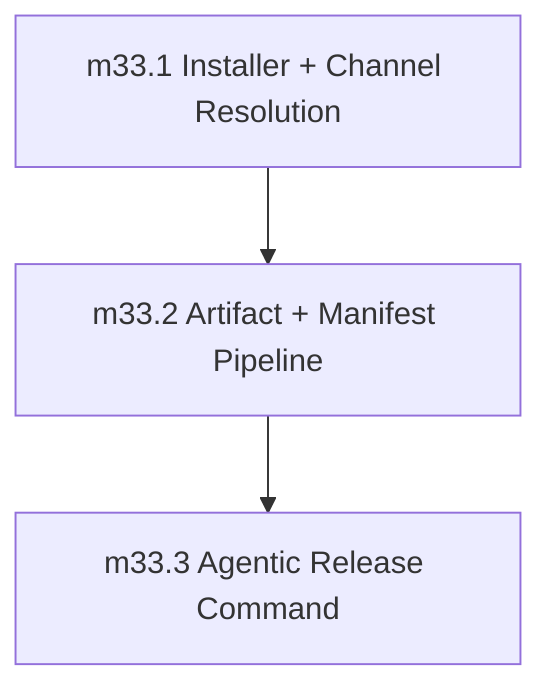

Based on my review of the Phase 33 document alongside Phase 32 (completed), Phase 39 (GA promotion), Phase 34 (depends on 33), Phase 38 (docs), and the broader roadmap, here is my assessment:

---

## Verdict: NOT READY

---

## Blocking Issues (ordered by severity)

### 1. Critical: No Installer/Artifact Architecture Document
Phase 33 references `https://sifr.sh/install | bash`, multi-platform artifacts, checksums, signatures, and channel manifests — but none of this infrastructure is defined anywhere in the codebase or documented. Before implementation, the following must be documented:

- Where does the installer script live? (own repo? embedded in docs? CI-generated?)
- What is the channel manifest schema? (JSON? TOML? hosted where?)
- How does version pinning work at the protocol level?
- What is the multi-platform target list? (aarch64-apple-darwin, x86_64-unknown-linux-gnu, etc.)
- What checksum algorithm? (SHA256? SHA512?)
- What signature mechanism? (GPG? Sigstore? cosign?)
- Where are artifacts published? (GitHub Releases? S3? A package registry?)
- How does `SIFR_CHANNEL` / `--channel` resolve to a specific version?

**Fix**: Add a reference to a new architecture document (e.g., `internal_docs/distribution_pipeline.md`) that defines the installer contract, channel resolution protocol, and artifact pipeline before any implementation begins.

### 2. Critical: "/create-new-version" Workflow Is Underspecified
The third milestone references a `/create-new-version` workflow with no description of:
- What it actually does (creates a Linear issue? creates GitHub Release? updates a manifest?)
- Which Linear entities it manages (version, release, milestone?)
- What the dry-run path validates vs. what the real path does
- What triggers it (manual? CI on tag push? commit message convention?)
- What rollback looks like if it fails

Without this, milestone_33_3 is not executable as written.

**Fix**: Add a dedicated section defining the `/create-new-version` workflow contract, inputs, outputs, dry-run semantics, and failure modes.

### 3. Critical: No Sequencing or Dependency Between Milestones
The phase lists three milestones but does not define:
- Whether they have ordering dependencies (e.g., does milestone_33_2 need milestone_33_1's installer to validate?)
- Whether they can run in parallel
- What the canonical implementation order is

**Fix**: Add a milestone ordering section and/or mermaid diagram (as Phase 32 does) showing explicit dependencies.

### 4. High: No Validation Fixtures Defined
Every completed phase in this repo specifies named fixtures (positive and negative paths) that constitute validation evidence. Phase 33 specifies validation *goals* but provides no fixture names, making it impossible to:
- Know what "passing" looks like
- Create regression tests
- Verify milestone completion

Phase 32's thorough fixture naming (e.g., `async_basic.sifr`, `await_outside_async.sifr`) sets the expected standard.

**Fix**: Add explicit fixture names for each milestone's positive and negative validation paths. Example for milestone_33_1: `install_alpha_channel.sifr`, `install_beta_channel.sifr`, `install_version_pin.sifr`, `install_invalid_channel_rejected.sifr`, `install_checksum_mismatch_rejected.sifr`.

### 5. High: No Stable GA Promotion Gate Mechanism Defined
The exit gate says "without enabling stable GA promotion" but the phase provides no mechanism for how stable promotion is *prevented*. Is it:
- A code path that doesn't exist yet?
- A feature flag that is explicitly set to `false`?
- A separate release workflow that isn't wired up?
- An environment variable not shipped?

Without defining the gate mechanism, "without enabling" is an aspiration, not a verified property.

**Fix**: Document how the stable promotion gate is enforced (e.g., the installer rejects `SIFR_CHANNEL=stable` until a future flag is set, or stable resolution points to a not-yet-populated endpoint).

### 6. Medium: Missing Cross-Repo/Docs Dependency
The installer entrypoint `https://sifr.sh/install` implies the docs website already exists. Phase 33 doesn't reference a docs dependency, but Phase 38 (Docs and Documentation) doesn't appear to be referenced in the phase ordering either. The installer URL being live suggests docs infrastructure is a prerequisite for Phase 33 to have a working end-to-end path.

**Fix**: Clarify whether `https://sifr.sh` infrastructure exists as a Phase 33 prerequisite or if the installer points to a placeholder URL that gets wired up in Phase 38.

### 7. Medium: No Milestone-Level Demo Requirements
Phase 32 specifies demos (e.g., `demos/async_syntax_demo/main.sifr`) for each milestone. Phase 33 has no demo requirements, which makes it harder to verify the installer works end-to-end.

**Fix**: Add a demo section per milestone, or at minimum a final phase demo that exercises the full preview release lifecycle.

### 8. Medium: Roadmap Phase 32 Status May Be Stale
The roadmap table shows "Phase 32: completed" but there's no date stamp in the phase document header (only a `status: completed` line and a corrective follow-up note). Phase 33's entry criteria states "Phase 32 is completed and async/runtime ecosystem primitives are stable" — this is a blocking condition that needs an explicit Phase 32 closure date or checkpoint reference.

**Fix**: Add a Phase 32 closure date to the phase document header and confirm Phase 33 entry criteria are met.

---

## Concrete Recommended Edits to Phase MD

```markdown
## Semantic Source of Truth
`internal_docs/distribution_pipeline.md` is the authoritative contract for this phase.
This file records milestone order, implementation responsibilities, validation goals, deferrals, and phase exit gate.
If a detail conflicts with the distribution_pipeline doc, the distribution_pipeline doc wins and this phase file must be updated before implementation continues.

## Installer and Artifact Architecture (Pre-requisite)
Before any implementation begins, `internal_docs/distribution_pipeline.md` must be authored and reviewed, defining:
- Installer script location and hosting
- Channel manifest schema (JSON/TOML hosted endpoint)
- Multi-platform target list and artifact naming convention
- Checksum algorithm (SHA256) and signature mechanism
- `SIFR_CHANNEL`/`--channel` resolution protocol
- `--version` pinning semantics
- Stable promotion gate: how stable is prevented from resolving until Phase 39 gates pass
```

Then add after the Quality Contract section:

```markdown
## Milestone Sequencing



Implementation order: milestone_33_1 first (installer entrypoint, channel resolution), then milestone_33_2 (artifact publishing, checksum/signature validation), then milestone_33_3 (release automation workflow).

## /create-new-version Workflow Contract
[New section defining: trigger, inputs, dry-run behavior, real-run behavior, Linear entities managed, failure modes, rollback]
```

And update each milestone to add:

```markdown
### milestone_33_1: Installer and Channel Resolution
[existing scope]

**Positive validation:**
- `install_alpha_channel.sifr`
- `install_beta_channel.sifr`
- `install_version_pin.sifr`
- `install_stable_blocked.sifr`

**Negative validation:**
- `install_invalid_channel_rejected.sifr`
- `install_checksum_mismatch_rejected.sifr`
- `install_manifest_unavailable_rejected.sifr`

**Demo:** `demos/install_demo/` [or similar]

[Similar additions for milestone_33_2 and milestone_33_3]
```

---

## Compact Checklist for Next Review

To make me satisfied in the next review, the phase MD must have all of:

- [ ] A reference to `internal_docs/distribution_pipeline.md` (or equivalent architecture doc) as the semantic source of truth, authored before implementation begins
- [ ] The `/create-new-version` workflow fully described: trigger, dry-run vs. real-run, Linear entities, failure modes
- [ ] Milestone sequencing diagram showing 33_1 → 33_2 → 33_3 order
- [ ] Named validation fixtures for each milestone (positive AND negative paths, fixture names listed explicitly)
- [ ] Stable promotion gate mechanism documented (how is stable prevented from resolving?)
- [ ] Phase 32 closure date/evidence confirming entry criteria are met
- [ ] Docs/website infrastructure dependency clarified (does `https://sifr.sh` exist as a prerequisite?)
- [ ] At least one end-to-end demo or integration test covering the full preview release lifecycle
- [ ] Exit gate evidence checklist that explicitly maps to "Preview release lifecycle works reliably without enabling stable GA promotion"
