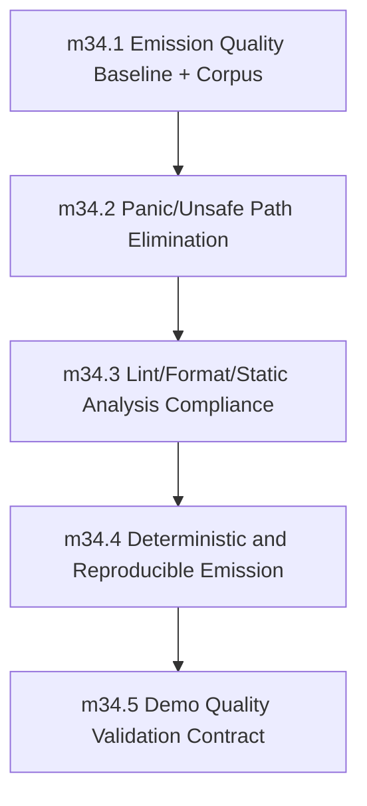

# Phase 34 Readiness Review — Pass 1

Date: 2026-05-14
Reviewer: agent
Branch: `codex/review-phase-34-readiness`

---

## Verdict: NOT READY

Phase 34 has a structurally sound objective but the current document is insufficiently specific to serve as an implementation contract. The gap between Phase 33's lock-level precision and Phase 34's placeholder-level description is large. Several items require concrete decisions before another agent can implement cleanly.

---

## Blocking Gaps

### 1. Corpus definition is not actionable (affects all milestones)

**Gap:** `milestone_34_1` says "representative corpus from stdlib flows, demos, and multi-module samples." Phase 33 names 31 validation scripts with exact paths. Phase 34 names nothing. This makes `milestone_34_1`'s "coverage targets are explicit and met" unfalsifiable.

**Why it blocks:** Every other milestone (34_2 through 34_5) depends on corpus. Without a concrete list, an implementer must make ad-hoc corpus decisions that may not match what the reviewer expects.

**Exact doc change needed:** Add a named corpus section to `milestone_34_1`:

```
### milestone_34_1: Emission Quality Baseline and Corpus
- Scope:
  ...
  - Define generated-code quality profile and acceptance thresholds.
  - Build representative corpus from stdlib flows, demos, and multi-module samples.

+ The corpus is defined as:
+   1. All `demos/*.sifr` files that pass `cargo run -q -p sifr -- run demos/<name>.sifr`
+   2. A multi-module fixture set maintained at `verification/corpus_generated_code/`
+      as a JSON manifest discovered lexicographically (same pattern as e2e fixtures).
+   3. Stdlib regression fixtures covering the surfaces listed in the phase execution checklist issue.
+ The corpus is version-controlled and reproducible. Coverage targets are explicit and met.

- Definition of done:
  - Corpus is version-controlled and reproducible.
  - Coverage targets are explicit and met.
```

Also add to the `Quality Contract` section:

```
+ Corpus entries are registered in the phase execution checklist issue with
+ named fixture references. Any corpus entry added without a corresponding
+ checklist entry requires a reviewed PR to the phase file.
```

---

### 2. Clippy profile is undefined (affects `milestone_34_3`)

**Gap:** `milestone_34_3` says "enforce `-D warnings` on generated corpus" and "agreed clippy profile." The codebase has workspace lints configured in `Cargo.toml` — but Phase 34 never specifies which clippy lints apply to generated code. Phase 33 specifies exact CLI behavior. Phase 34 does not.

**Why it blocks:** An implementer cannot know whether to use `clippy -- -D warnings` (which enables workspace lints) or a specific clippy allowlist. The distinction matters because generated code may trigger compiler-internal clippy lints that don't apply to user code.

**Exact doc change needed:** In `milestone_34_3`, replace the vague "agreed clippy profile" with an explicit definition:

```
### milestone_34_3: Lint/Format/Static Analysis Compliance
- Scope:
  - Enforce compile with `-D warnings` on generated corpus.
  - Enforce `rustfmt --check` and agreed clippy profile on generated corpus.

+ The clippy profile for generated code is:
+   - `cargo clippy -- -D warnings` (workspace lints, same as compiler build)
+   - No extra allowlist beyond workspace defaults
+   - Generated code must not suppress clippy lints via attributes
+ The rustfmt profile is `rustfmt --check` with no custom config overrides.

- Definition of done:
  - Generated corpus passes compile/lint/format gates with zero critical violations.
```

Add a clarifying note in the `Quality Contract` section:

```
+ Clippy lint policy for generated code: generated Rust is built with the same
+ workspace lint flags as compiler internal code. No per-file or per-function
+ suppressions are permitted in generated output.
```

---

### 3. Determinism scope is under-specified (affects `milestone_34_4`)

**Gap:** `milestone_34_4` says "byte-stable output for identical input/configuration" and "repeat-run determinism checks." Phase 33's phase file references an existing determinism check script at `scripts/check_e2e_report_determinism.sh`. Phase 34 does not integrate with this or define the generated-Rust-specific determinism contract.

**Why it blocks:** "Byte-stable" is ambiguous for generated Rust. Does it include formatting? HashMap iteration order? Embedded timestamps? Generated file timestamps? The existing e2e determinism check tests report signatures, not generated Rust byte-for-byte equality.

**Exact doc change needed:** In `milestone_34_4`:

```
### milestone_34_4: Deterministic and Reproducible Emission
- Scope:
  - Enforce byte-stable output for identical input/configuration.
  - Add repeat-run determinism checks.

+ Byte-stable means: for a given input `.sifr` file and a given compiler
+ invocation configuration, the generated Rust source text is identical
+ across repeated runs. The following are excluded from byte-stable guarantee:
+   - Build artifacts (`.rlib`, compiled binary) — these depend on rustc flags
+     and platform-specific compilation behavior
+   - Comments or whitespace that rustfmt may normalize
+ Determinism checks:
+   - Generate the same `.sifr` input twice with identical compiler flags
+   - Assert the generated `.rs` file text is byte-identical
+   - Check scripts are at `verification/determinism/` with naming convention
+     `generated_code_determinism_<fixture>.sh`

- Definition of done:
  - Determinism checks pass with no unstable output regressions.
```

---

### 4. Demo requirements are undefined (affects `milestone_34_5`)

**Gap:** `milestone_34_5` says "required `demos/` runs" but does not specify which demos are required. Phase 33 names `demos/preview_distribution_demo/README.md` and `demos/preview_release_lifecycle/README.md` with concrete content requirements. Phase 34 names nothing.

**Why it blocks:** Without a named demo list, an implementer cannot know which `demos/*.sifr` files must pass quality gates. The "demo validation evidence" requirement cannot be satisfied consistently.

**Exact doc change needed:** In `milestone_34_5`:

```
### milestone_34_5: Demo Quality Validation Contract
- Scope:
  - Make required `demos/` runs part of phase quality gates.
  - Require milestone-level positive/negative validation plus demo evidence.

+ Required demos for Phase 34 exit gate:
+   - `demos/stable_codegen/` — demonstrates generated code baseline quality
+   - `demos/codegen_output/` — demonstrates emit mode output cleanliness
+   - `demos/project_build/` — demonstrates multi-module build quality
+   - A representative sample from `demos/async_generator_comprehension_demo/` or
+     `demos/blocking_offload_demo/` covering async codegen paths
+
+ Demo validation evidence is recorded in the phase execution checklist issue
+ as a pass/fail per demo with the quality check output attached.

- Definition of done:
  - Required demos pass generated-code quality checks.
  - Demo validation evidence is recorded per milestone.
```

---

### 5. Phase 27 non-regression baseline is underspecified for this phase (affects all milestones)

**Gap:** Phase 34's entry criteria says "Phase 27 non-regression baseline is required at phase start and must remain green through completion" and lists invariants. However, Phase 27's `milestone_27_4` (diagnostic schema) required a "checked-in panic inventory before panic-to-diagnostic conversion begins." Phase 34 does not reference whether a panic inventory exists or whether it needs to be consulted for `milestone_34_2`.

**Why it blocks:** `milestone_34_2` targets "panic/unsafe path elimination in generated user paths." If the Phase 27 panic inventory is incomplete or stale, the implementation may not know which panic paths to eliminate. The relationship between the panic inventory and the automated checks mentioned in `milestone_34_2` is unspecified.

**Exact doc change needed:** In the `Quality Contract` section's "Phase 27 non-regression invariants" paragraph, add:

```
+ Panic inventory reference: Phase 27's `milestone_27_6` requires a checked-in
+ panic inventory covering parser/lowering/type-check/codegen/driver paths
+ reachable from user input. The Phase 34 implementer must:
+   1. Locate the panic inventory in the phase execution checklist issue or
+      in `verification/stdlib/` as a named artifact (e.g., `panic_inventory.md`)
+   2. Use the inventory as the source-of-truth for user-triggerable panic
+      patterns that `milestone_34_2` must eliminate
+   3. Verify the inventory is current before starting `milestone_34_2`
+ If the panic inventory does not exist or is stale, `milestone_34_1` must
+ include its creation as a prerequisite.
```

---

### 6. No generated-Rust project strategy (affects all milestones)

**Gap:** `milestone_34_2` says "Violations are blocked by automated checks." But the phase never specifies how generated Rust is compiled, where the output goes, or how the check pipeline works. Phase 33 has a `/create-new-version` command with exact inputs/outputs. Phase 34 has no equivalent.

**Why it blocks:** The automated checks must compile generated Rust somewhere. Is it a temporary crate? A `tmp/` directory? Does it use `cargo build` or `rustc` directly? Without this, `milestone_34_3` (lint/format) and `milestone_34_4` (determinism) are also underspecified.

**Exact doc change needed:** Add a new section to `milestone_34_1` or the `Quality Contract`:

```
+ ### Generated Rust Compilation Pipeline
+
+ Generated Rust is compiled via a transient build directory:
+   - Output directory: `target/sifr-gen/<uuid>/` per compilation invocation
+   - The directory contains a minimal `Cargo.toml` with the generated `lib.rs`
+     and a `src/` tree mirroring the module structure
+   - Compilation uses `cargo check` (not `cargo build`) for speed in early
+     milestone work; `cargo build` is required for final validation
+   - Clippy and rustfmt operate on the generated source directly, not via cargo
+   - The transient build directory is cleaned after each check pass
+
+ Automated violation detection:
+   - `cargo clippy -- -D warnings` on generated corpus fails the gate
+   - `rustfmt --check` on generated corpus fails the gate
+   - A custom check script (implemented in `milestone_34_2`) scans generated
+     `.rs` files for `.unwrap(`, `.expect(`, `panic!`, `todo!`, `unimplemented!`
+     using regex and fails the gate on any hit
```

---

## Non-Blocking Improvements

### A. Milestone ordering flowchart

Phase 33 has a Mermaid diagram showing `m33_1 → m33_2 → m33_3`. Phase 34 has no such diagram. Add one:

```
## Milestone Sequencing

Implementation must execute the milestones in order unless a later reviewed PR updates this file with rationale.


```

### B. Verification directory contract

Phase 33 creates `verification/distribution/` with 31 scripts. Phase 34 should define the analogous structure:

```
+ ## Verification Infrastructure
+
+ This phase creates the following verification directory:
+   - `verification/generated_code_quality/` — check scripts, corpus manifest,
+     and determinism fixtures
+   - Scripts follow the naming convention `generated_code_quality_<purpose>.sh`
+
+ The verification directory and its contents are owned by this phase.
```

### C. Exit gate precision

The current exit gate says "Generated Rust satisfies all Phase 34 quality guarantees." Make it concrete:

```
## Exit Gate

- All milestone DoDs are satisfied.
- All milestone quality checks pass with zero unresolved critical violations.
- Determinism is verified across repeated runs on required corpus.
- Required demos pass and have recorded validation evidence.
- Any waiver is explicit, time-bounded, owner-assigned, and issue-linked.

+ Explicitly:
+   - `verification/generated_code_quality/generated_code_quality_corpus.sh` passes
+   - `verification/generated_code_quality/generated_code_quality_panic_scan.sh` finds zero violations
+   - `verification/generated_code_quality/generated_code_quality_clippy.sh` passes with zero critical
+   - `verification/generated_code_quality/generated_code_quality_rustfmt.sh` passes
+   - `verification/generated_code_quality/generated_code_quality_determinism.sh` passes
+   - Required demo runs in `demos/stable_codegen/`, `demos/codegen_output/`, and
+     `demos/project_build/` all pass with recorded evidence
+   - Phase 27 non-regression contract remains green: panic-free user paths,
+     no emitted data-dependent unwrap/expect/panic, and stable
+     diagnostics/renderer/exit-code behavior.
```

### D. Architecture ownership clarification

Phase 33 has "The compiler repository owns release automation..." Phase 34 should have the analogous statement for generated-code quality ownership:

```
+ ## Architecture Ownership
+
+ Generated-code quality is owned by `sifr_codegen`. The generated-Rust
+ compilation pipeline (transient build, clippy, rustfmt, determinism) is
+ implemented in `sifr_codegen` or `sifr_driver`. No quality logic lives in
+ `sifr_hir` or `sifr_python_parser`.
+
+ The `sifr_driver` is responsible for invoking the quality gates as part
+ of the build/run/check pipeline when the `--quality-gate` flag is provided.
```

### E. CI integration note

Phase 34 does not mention CI. Phase 33's `/create-new-version` command implicitly drives CI. Add:

```
+ ## CI Integration
+
+ Phase 34 quality gates run as part of the `pr` validation lane via
+ `scripts/run_all_tests.sh --profile pr`. The generated-code quality
+ checks are integrated into the existing `run_all_tests.sh` workflow
+ under a new section "Generated Code Quality Checks" that executes
+ after the e2e pass suite.
+
+ CI and local validation use identical commands. There is no CI-only
+ behavior.
```

---

## Satisfaction Criteria for Next Review Pass

For the next review pass to return **READY**, the Phase 34 document must contain:

1. **Corpus definition** with named fixture list or manifest path, and concrete coverage targets (e.g., "all demos that pass today + N stdlib regression fixtures").
2. **Clippy profile** specified as `cargo clippy -- -D warnings` with explicit no-suppression policy.
3. **Determinism scope** with clear definition of byte-stable vs. non-stable boundaries and existing script references integrated.
4. **Demo list** with at least 4 named demo directories and evidence requirements.
5. **Panic inventory relationship** made explicit: where it lives, how it's consulted in `milestone_34_2`.
6. **Generated-Rust build pipeline** defined: transient directory strategy, `cargo check` vs. `cargo build` usage, check invocation order.
7. **Verification directory** named and owned by the phase.
8. **Exit gate** made concrete with explicit script references.
9. **Milestone sequencing diagram** added (matching Phase 33 style).
10. **Non-goals and deferrals** section added (Phase 33 has one; Phase 34 should too).

---

## Relationship Observations

- **Phase 27 → Phase 34**: Phase 27's panic inventory (required by `milestone_27_6`) is the authoritative source for user-triggerable panic patterns. Phase 34 must not redefine what "panic" means independently. Integration point is the panic inventory artifact.
- **Phase 33 → Phase 34**: Phase 33 establishes the distribution pipeline and installer contract. Phase 34 should be a prereq for any Phase 39 GA promotion, since GA binaries must pass generated-code quality gates. Consider adding a dependency note: "Phase 34 output feeds Phase 39's stable artifact validation."
- **Verification infrastructure**: The `verification/` subdirectories are the execution vehicle. Phase 34 needs its own `verification/generated_code_quality/` analogous to `verification/distribution/`. The naming pattern is already established.

---

## Summary

Phase 34 is **NOT READY**. The objective is correct and the milestone structure is sound, but every milestone is underspecified relative to the precision expected from Phase 33. The six blocking gaps above represent concrete decisions that must be locked before implementation can proceed without ambiguity. The non-blocking improvements are additive and bring the document to parity with Phase 33's documentation quality.