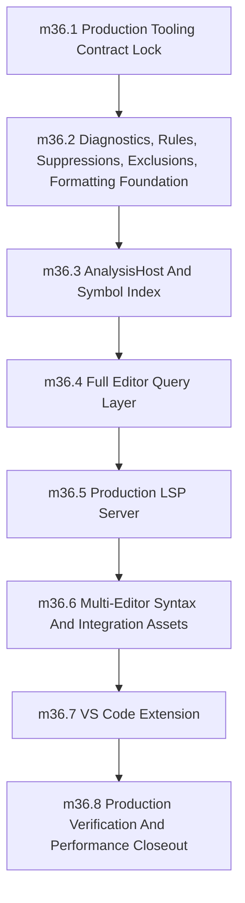

Let me analyze these documents against the six review questions systematically.

## Verdict: NOT READY - 3 blockers, 4 sequencing gaps, and 1 missing Phase 35 export contract

---

### Q1: Is the Phase 35/36 boundary decision correct?

**YES.** The memo's conclusion is correct: Phase 35 stays as compiler/frontend foundation, Phase 36 expands to full production tooling. No new phase number before 37. The roadmap structure is sound. This decision stands.

---

### Q2: Is the memo's 8-milestone sequential order correct?

**ALMOST, with 2 sequencing corrections needed:**

The memo proposes:
```
36.1 -> 36.2 -> 36.3 -> 36.4 -> 36.5 -> 36.6 -> 36.7 -> 36.8
```

**Problem 1: 36.6 (VS Code Extension) is blocked by 36.5 (LSP Server)**

The VS Code extension launches `sifr lsp --stdio`. The extension can't be implemented and packaged without the LSP server being complete. The VS Code milestone (36.6) should come AFTER the LSP server (36.5).

**Correction:** Swap 36.6 and 36.7:
```
36.5 -> 36.6 -> 36.7 -> 36.8
       v
  LSP Server -> VS Code -> Multi-Editor -> Verification
```

**Problem 2: 36.7 (Multi-Editor) should come before 36.6 (VS Code)**

Tree-sitter/TextMate grammar validation (36.7) should complete before VS Code extension work (36.6) starts, since VS Code needs grammar assets. The corrected order is:

```
36.5 Production LSP Server
36.6 Multi-Editor Syntax And Integration Assets  (grammar first)
36.7 VS Code Extension                            (extension uses validated grammar)
36.8 Production Verification And Performance Closeout
```

**Otherwise correct:** The diagnostics/formatter layer before AnalysisHost before query layer before LSP server is the right dependency chain.

---

### Q3: Are any features missing for full production-grade tooling?

**YES - 1 feature is missing from both Phase 36 and the memo:**

| Feature | Status | Gap |
|---|---|---|
| LSP (full) | [yes] In memo | - |
| VS Code Extension | [yes] In memo | - |
| Neovim/Zed/Helix/Emacs | [yes] In memo | - |
| Formatter | [warn] In memo but deferral | "formatter" is still in non-goals |
| Linter/policy rules | [warn] Partial | "may define" not "implements" |
| Suppression/exclusion | [yes] In memo | - |
| Generated Rust preview | [yes] In memo | - |
| Test Explorer | [no] **Missing** | Neither Phase 36 nor memo mentions it |
| Diagnostics | [yes] In memo | - |
| Performance | [yes] In Phase 35 + 36 | - |
| Packaging/release | [warn] Partial | "marketplace publication deferral" only |

**Test Explorer gap:** The current Phase 36 non-goals list "test explorer integration" as deferred, but the memo doesn't address it. For true production-grade tooling, test explorer needs explicit tracking: either as a Phase 36 deliverable, a Phase 37+ deferral, or a documented exclusion. Currently it's untracked.

**Formatter gap:** The current Phase 36 says "A production formatter or linter" is a non-goal. The memo says "formatter/linter integration" in scope, but the underlying phase doc still lists it as deferred. This contradiction needs resolution.

---

### Q4: Does Phase 35 need additional explicit exports before Phase 36?

**YES - 2 blocker-level gaps:**

**Blocker 1: HIR views for rename and references are undefined**

Phase 35's "Editor Analysis Boundary For Phase 36" section (lines 200-214) lists exports but **does not cover**:
- Symbol tables with stable DefId-to-location mappings for rename
- Use-def/use-site data for find-references

The existing HIR may have this data internally, but Phase 35's contract doesn't commit to exposing it. If Phase 35 doesn't expose reference/rename data structures, Phase 36's implementation of these features will be ad hoc rather than planned.

**Blocker 2: Type display contract for signature help is undefined**

Phase 36 needs to show `func(x: int, y: str) -> bool` on hover/signature help. Phase 35's contract doesn't specify how function signatures are rendered. This affects both signature help and generated Rust preview.

**Additional Phase 35 exports needed:**
- `TypeDisplayContract` - how types render as text
- `SymbolTableView` - DefId -> name/definition/uses
- `SignatureView` - parameter names, types, defaults for function signatures
- `CodegenPreviewQuery` - interface to request generated Rust for a Sifr source location

---

### Q5: Does package management need to move before Phase 36?

**NO.** The memo correctly identifies that Phase 36 can be production-grade for current workspace semantics with package-aware intelligence added after Phase 37. No phase reorder needed. Phase 36 should explicitly document this boundary.

---

### Q6: Exact edits for production-grade plan

Here are the exact edits needed:

#### Edit 1: Phase 35 - Add Phase 36 export contract (add before line 214)

```markdown
## Editor Analysis Boundary For Phase 36

Phase 35 does not implement editor features, but it must expose enough stable data for Phase 36 to build them without bypassing compiler semantics.

Required Phase 35 exports for Phase 36:

- source maps with URI/path, document version, and byte/line/column conversion
- module graph nodes/edges with deterministic ids and revisions
- per-module parsed syntax views from `sifr_syntax`
- per-module lowered HIR views or approved read-only handles
- canonical diagnostics before renderer/protocol conversion
- symbol/definition ids where already available from HIR, or a documented gap for Phase 36 to close in `sifr_analysis`
- invalidation reports that identify stale modules and query classes after document changes

### Additional Exports Required for Production Phase 36

The following exports are required for Phase 36 production-grade tooling (references, rename, signature help, generated Rust preview). Phase 35 must define these before phase exit, or explicitly defer them to Phase 36 with documented rationale:

#### Type Display Contract

```rust
// sifr_frontend or sifr_analysis
pub trait TypeDisplay {
    fn display(&self) -> String;
    fn display_qualified(&self) -> String;
}

pub trait SignatureDisplay {
    fn parameters(&self) -> Vec<ParameterInfo>;
    fn return_type(&self) -> Option<&Type>;
    fn docstring(&self) -> Option<&str>;
}

pub struct ParameterInfo {
    pub name: String,
    pub type_: Type,
    pub has_default: bool,
}
```

#### Symbol Table View (for references and rename)

```rust
pub struct SymbolTableView<'a> {
    pub defs: &'a HashMap<DefId, SymbolDef>,
    pub uses: &'a HashMap<DefId, Vec<UseSite>>,
    pub revisions: SymbolRevision,
}

pub struct SymbolDef {
    pub id: DefId,
    pub name: String,
    pub kind: SymbolKind,
    pub definition_span: SourceSpan,
    pub containing_module: ModuleId,
}

pub struct UseSite {
    pub span: SourceSpan,
    pub module: ModuleId,
    pub is_definition: bool,
}
```

Phase 36 must be able to query all `UseSite` values for a `DefId` to implement find-references and rename.

#### Codegen Preview Query (for generated Rust preview)

```rust
pub trait CodegenPreviewQuery {
    fn generated_rust_for_span(
        &self,
        file: FileId,
        span: SourceSpan,
    ) -> QueryResult<String>;

    fn generated_rust_for_module(
        &self,
        module: ModuleId,
    ) -> QueryResult<String>;
}
```

This interface is Phase 35 infrastructure needed by Phase 36's generated Rust preview feature.

Phase 36 must define `sifr_analysis` or `sifr_ide` as the only editor-query owner. Phase 35 must not add editor semantics directly to `sifr_lsp` or VS Code integration.
```

#### Edit 2: Phase 36 - Rewrite from MVP to production-grade (replace Lines 1-450)

The entire Phase 36 file needs rewrite to match the memo's expanded scope. The key changes:

**1. Remove all MVP/optional language:**

Lines currently say things like:
- "Phase 36 uses full-document sync for MVP correctness"
- "Phase 36 must support at least `open-files` diagnostics for MVP"
- "Incremental sync may be added only after..."

**Replace all with production-grade statements:**
- "Phase 36 uses full-document sync with incremental sync as a follow-up"
- "Phase 36 supports `workspace` diagnostics mode (not just `open-files`)"
- Remove "MVP" from milestone names

**2. Expand scope to match memo:**

Add to Phase 36 non-goals:
- Remove "A production formatter or linter" from non-goals
- Add "test explorer integration" explicitly as deferred with criteria

**3. Fix the milestone structure (from 4 to 8):**

Replace the current `mermaid` diagram and milestone section with:



**4. Rewrite each milestone to be production-grade, not MVP:**

**milestone_36_1** stays similar but add:
- Deliver `internal_docs/tooling_analysis.md`, `internal_docs/lsp_server.md`, `internal_docs/vscode_extension.md`, `internal_docs/editor_integrations.md`
- Lock crate names (`sifr_analysis` as final name)
- Lock LSP capability matrix (full set, not MVP subset)
- Lock diagnostic/rule policy and formatting/lint strategy

**milestone_36_2** changes significantly from current Phase 36:
- Implement `sifr_fmt` formatter module over `sifr_syntax`
- Implement `sifr_lint` policy-rule engine
- Implement suppression parser (`# sifr: ignore[rule-id]`)
- Implement include/exclude discovery
- **This is currently scattered and deferred in Phase 36 - make it explicit milestone 2**

**milestone_36_3** (AnalysisHost):
- Create `sifr_analysis` crate
- Implement `AnalysisHost` with project/open-file session state
- Build symbol index from Phase 35 exports
- Implement `TypeDisplay`, `SignatureDisplay`, `CodegenPreviewQuery` interfaces

**milestone_36_4** (Full Query Layer):
- Implement ALL features listed in the memo:
  - references, rename, signature help, document highlights, folding ranges
  - code actions from diagnostic suggestions
  - generated Rust preview query
- This expands the current Phase 36's MVP query layer

**milestone_36_5** (LSP Server):
- Full production `sifr lsp --stdio`
- Push AND pull diagnostics
- `workspace` diagnostics mode (not just `open-files`)
- Cancellation, scheduling, performance instrumentation
- All LSP 3.17 capabilities for the full feature set

**milestone_36_6** (Multi-Editor - swap with VS Code):
- Tree-sitter/TextMate grammar validated against `sifr_syntax`
- Documented editor configs for Neovim/Zed/Helix/Emacs
- Drift checks and validation

**milestone_36_7** (VS Code Extension):
- Package the extension: language id, grammar, config
- LSP launcher, settings, commands, trace/logging
- Binary discovery, restart server
- Generated Rust preview, explain diagnostic
- Integration tests, `.vsix` packaging
- Marketplace-readiness checklist

**milestone_36_8** (Verification):
- Parity snapshots for all query types
- Protocol smoke/stress tests
- Completion quality evaluation
- LSP performance budgets for every production feature
- Multi-file/workspace scale tests
- Full local validation

#### Edit 3: Phase 36 - Add test explorer tracking (add to non-goals)

```markdown
## Non-Goals And Deferrals

...

- Test explorer integration. Phase 36 produces a test discovery/query interface that test explorers can consume, but native test explorer UI integration in editors is deferred. Phase 36 exit criteria require the test interface surface; editor test explorer integration requires Phase 37+ ecosystem work.
```

#### Edit 4: Phase 36 - Update Editor Query Contract (replace lines 97-140)

```rust
// Target crate: sifr_analysis

pub struct AnalysisHost {
    pub fn open_project(root: ProjectRoot) -> Result<Self, Vec<RenderedDiagnostic>>;
    pub fn open_single_file(input: FrontendInput) -> Result<Self, Vec<RenderedDiagnostic>>;
    pub fn update_document(
        &mut self,
        file: FileId,
        version: DocumentVersion,
        text: SourceText,
    ) -> Result<InvalidationReport, Vec<RenderedDiagnostic>>;

    // Diagnostics
    pub fn diagnostics(&mut self, file: FileId) -> QueryResult<Vec<RenderedDiagnostic>>;

    // Core queries
    pub fn completion(&mut self, file: FileId, position: TextPosition) -> QueryResult<CompletionItems>;
    pub fn hover(&mut self, file: FileId, position: TextPosition) -> QueryResult<Option<HoverInfo>>;
    pub fn definition(&mut self, file: FileId, position: TextPosition) -> QueryResult<Vec<Location>>;
    pub fn declaration(&mut self, file: FileId, position: TextPosition) -> QueryResult<Vec<Location>>;
    pub fn type_definition(&mut self, file: FileId, position: TextPosition) -> QueryResult<Vec<Location>>;
    pub fn references(&mut self, file: FileId, position: TextPosition) -> QueryResult<Vec<Location>>;
    pub fn rename(&mut self, file: FileId, position: TextPosition, new_name: &str) -> QueryResult<RenameResult>;

    // Symbols
    pub fn document_symbols(&mut self, file: FileId) -> QueryResult<Vec<DocumentSymbol>>;
    pub fn workspace_symbols(&mut self, query: &str) -> QueryResult<Vec<WorkspaceSymbol>>;

    // Semantic highlighting
    pub fn semantic_tokens(&mut self, file: FileId) -> QueryResult<Vec<SemanticToken>>;

    // Inlay hints
    pub fn inlay_hints(&mut self, file: FileId) -> QueryResult<Vec<InlayHint>>;

    // Signature help
    pub fn signature_help(&mut self, file: FileId, position: TextPosition) -> QueryResult<Option<SignatureHelp>>;

    // Navigation
    pub fn document_highlights(&mut self, file: FileId, position: TextPosition) -> QueryResult<Vec<DocumentHighlight>>;
    pub fn folding_ranges(&mut self, file: FileId) -> QueryResult<Vec<FoldingRange>>;

    // Code actions
    pub fn code_actions(&mut self, file: FileId, range: TextRange) -> QueryResult<Vec<CodeAction>>;

    // Generated Rust preview
    pub fn generated_rust(&mut self, file: FileId, span: Option<TextRange>) -> QueryResult<String>;
}
```

#### Edit 5: Roadmap - Add phase 36 scope note (optional but helpful)

In the Phase 36 row of the roadmap table, expand the Phase File column:

```
[36_developer_tooling_and_ecosystem_hooks.md](./phases/36_developer_tooling_and_ecosystem_hooks.md) - expanded to full production-grade (8 milestones)
```

---

### Summary of Required Actions

| File | Action | Priority |
|---|---|---|
| `internal_docs/phases/35_...md` | Add Phase 36 export contract section | **BLOCKER** |
| `internal_docs/phases/36_...md` | Complete rewrite to 8 milestones, remove MVP language | **BLOCKER** |
| `internal_docs/phases/36_...md` | Add TypeDisplay, SymbolTable, CodegenPreview interfaces to Phase 35 contract | **BLOCKER** |
| `internal_docs/phases/36_...md` | Move formatter/linting to milestone 36.2 | Sequencing fix |
| `internal_docs/phases/36_...md` | Swap milestone 36.6 and 36.7 (grammar before VS Code) | Sequencing fix |
| `internal_docs/phases/36_...md` | Add test explorer tracking as deferred | Missing feature |
| `internal_docs/phases/36_...md` | Update Editor Query Contract to full feature set | Scope expansion |
| `internal_docs/roadmap.md` | Optionally note Phase 36 scope expansion | Low priority |

The plan is NOT READY until the Phase 35 export contract and Phase 36 rewrite are completed.
