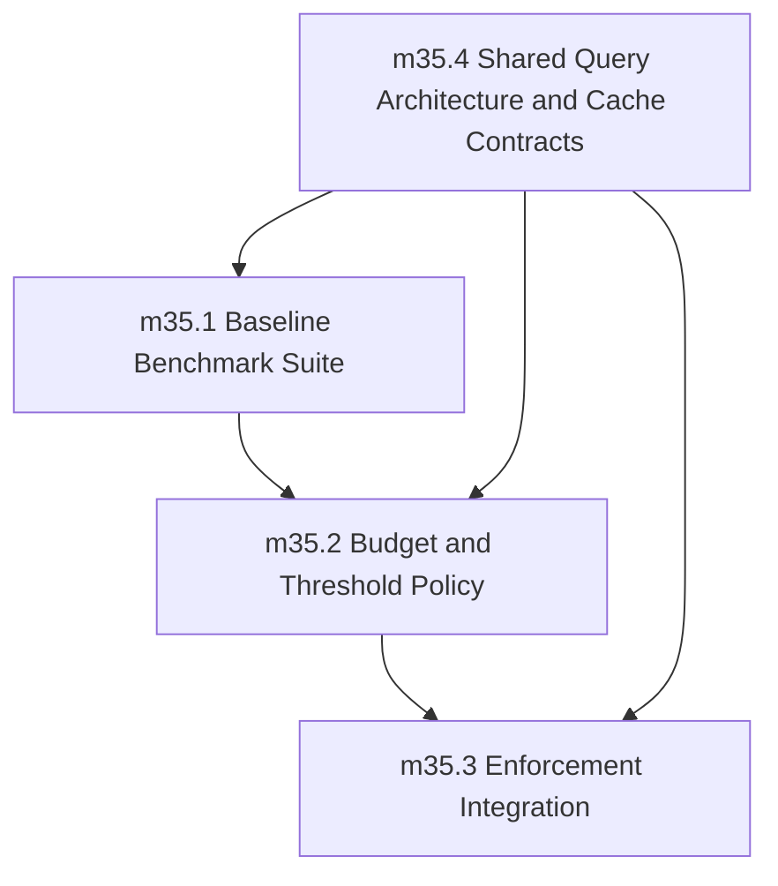

# Phase 35 Readiness Review: Performance Benchmarking, Shared Analysis Query Architecture, and Budgets

**Reviewer:** agent review agent
**Date:** 2026-05-15
**Phase Document:** `internal_docs/phases/35_performance_benchmarking_and_budgets.md`
**Status:** NOT READY

---

## Verdict: NOT READY

Phase 35 has structural completeness in its prose but critical gaps in concrete specification, leaving the phase unready for implementation. The shared query architecture and cache contracts in milestone_35_4 have strong motivation and design intent, but the documented surface area is underspecified. The benchmarking and budget enforcement in milestones 35_1 through 35_3 are essentially stubs. An implementer starting from this document today would face a cascade of architectural decisions with no authoritative guidance.

The root problem: Phase 35 attempts to establish three distinct heavyweight systems (benchmarking infrastructure, performance budget enforcement, and a canonical query/cache architecture) with only prose intent, no concrete API contracts, no concrete data structures, no concrete invalidation rules, and no concrete enforcement mechanisms. This is a Phase 0 problem, not a Phase 35 problem.

---

## Blocking Gaps (Ranked by Severity)

### BLOCKING-1: `milestone_35_4` — Shared Analysis Query Architecture is Under-Specified (Severity: Critical)

**Why this is blocking:** Phase 36 depends on this API. Phase 36's entry criteria states: "Phase 35 is completed and compiler performance/query contracts plus the shared analysis/query foundation are enforced." Phase 36's milestones explicitly consume the minimum API surface documented here. If this API is not concrete before Phase 36 begins, the split-brain prevention goal of Phase 36 is unachievable.

**Specific gaps:**

1. **No concrete API trait or struct definitions.** The scope says "create/load one project or compilation context" but does not define the handle type. Is it a struct? A trait? A builder pattern? What are its construction entry points? What are the mandatory and optional parameters? The architecture document references `sifr_frontend` as the canonical query facade ("crates/sifr_frontend/ (canonical parse/lower/type-check/diagnostics query facade shared by CLI and tooling)"), but the Phase 35 document never references or defines this crate.

2. **No concrete query result types.** "request per-module and whole-project analysis results without reimplementing semantics" is vague. What queries are exposed? What are their signatures and return types? What invariants do query results carry?

3. **No concrete cache invalidation rules.** The scope says "define deterministic invalidation rules and cache-consistency guarantees for local loops" but provides zero specifics. What is the invalidation key? File content hash? File path + mtime? AST hash? What is the cache granularity — per-file, per-module, per-type-check, per-whole-program? What happens on partial invalidation (file A changes that affect file B through imports)? What are the consistency guarantees — stale reads acceptable? Write-write conflicts? Cross-process cache sharing?

4. **No concrete relationship to existing Phase 19 cache infrastructure.** Phase 19 implemented a `OnceLock`-based stdlib cache. Phase 35 does not reference or extend this infrastructure. An implementer would need to guess whether Phase 35's query cache is a replacement, an extension, or a separate system.

5. **No concrete minimum API surface that Phase 36 can actually consume.** Phase 36's milestone_36_1 says CLI modes must adopt the canonical API. But the canonical API is not defined. The architecture document says the minimum API must expose "project/context handle plus reusable entrypoints for: parse, lower, type-check, collect diagnostics, inspect project/module graph state, and request per-module/per-project analysis results." None of this is defined in concrete terms.

**What is needed to close this gap:** A concrete section in the phase doc listing the minimum API surface as actual Rust-like pseudo-signatures (trait definitions, struct definitions, function signatures with parameter names and types). The document should reference that `sifr_frontend` is the target crate and that Phase 35 must populate it. The invalidation rules need to be specified as a concrete algorithm (input → invalidation trigger → cache behavior). Cache-consistency guarantees need explicit statements (e.g., "a cache hit always returns the result of the most recent successful compile of the same inputs" or "incremental mode may return stale results within one compilation session but never across sessions").

### BLOCKING-2: `milestones_35_1` through `35_3` — Benchmarking Infrastructure and Budget Enforcement are Hollow Stubs (Severity: Critical)

**Why this is blocking:** These three milestones are the public-facing quality gates for compiler performance. Without concrete benchmark definitions, threshold values, enforcement mechanisms, and waiver processes, there is no functional performance regression prevention system. These are not just missing details — the milestones as written have zero implementable content.

**Specific gaps for each milestone:**

**milestone_35_1 (Baseline Benchmark Suite):**
- No definition of what "benchmark suites for `check`, `build`, and incremental local loops" means in practice.
- No benchmark harness specified. Phase 34's architecture shows `criterion` mentioned in `architecture.md` layer 7 ("Use `criterion` for statistical benchmarking"). Is that the harness to use? If so, where are the benchmark entry points?
- No corpus of benchmark inputs defined. How many fixtures? Which ones? What sizes?
- No measurement methodology. Warm-up runs? Iterations per measurement? Statistical significance criteria?
- "Baselines are versioned and reproducible locally" — reproducible how? Checked into the repo? Stored as artifacts? Generated on demand?

**milestone_35_2 (Budget and Threshold Policy):**
- No concrete threshold values. What are the regression thresholds? 5%? 10%? 2 standard deviations? Absolute time limits?
- No waiver process defined. Who approves waivers? What is the format? What is the expiry policy?
- "Performance budget policy is documented and testable" — testable by whom, against what, using what tooling?

**milestone_35_3 (Enforcement Integration):**
- "Add local and CI gates for benchmark regressions." No concrete gate definition. Is this a script? A cargo test? A GitHub Actions job? A conditional compilation flag?
- "Regressions fail gates unless approved waiver exists." How is a waiver detected? File-based? Config-based? Database-based?
- No integration point specified. Which CI system? Which validation scripts?

**What is needed to close this gap:** Each milestone needs a concrete implementation plan with explicit artifacts. The phase doc should enumerate specific files to be created (e.g., `benches/compiler_benchmark.rs`, `verification/performance_budgets/thresholds.json`, `verification/performance_budgets/waiver_format.md`), specific threshold values or algorithms for deriving them, and specific enforcement scripts. The relationship to existing validation infrastructure (`scripts/run_all_tests.sh`) must be specified.

### BLOCKING-3: No Concrete Dependency Between Milestones 35_1-35_3 and 35_4 (Severity: High)

**Why this is blocking:** The benchmarks in 35_1 need a compilation pipeline to measure. That pipeline should be the shared query architecture from 35_4. But 35_4 is standalone, and 35_1-35_3 don't reference it. An implementer could build benchmarks that bypass the canonical query architecture, defeating the split-brain prevention goal.

**Specific gap:** milestone_35_1 should explicitly state that benchmark harnesses must use the shared query architecture (when it exists), not ad hoc compilation paths. This is necessary to avoid benchmark-specific code paths that don't reflect real-world CLI behavior.

---

## Concrete Edits Required Before Implementation

The following edits to `internal_docs/phases/35_performance_benchmarking_and_budgets.md` are required before the phase is implementable:

### 1. Add a Concrete Minimum API Surface for `milestone_35_4`

Add a new section under `milestone_35_4` that defines the minimum API in Rust-like pseudocode:

```rust
// Target crate: sifr_frontend
// Proposed canonical facade

pub struct CompilationContext {
    // construction
    pub fn new(source_roots: &[PathBuf]) -> Self;
    pub fn add_source_file(&mut self, path: PathBuf, source: &str);
    pub fn finish_loading(&mut self) -> Result<(), Vec<RenderedDiagnostic>>;

    // queries
    pub fn parse_module(&self, path: &Path) -> Result<ParsedModule, ModuleNotLoaded>;
    pub fn lower_module(&self, path: &Path) -> Result<LoweringResult, ModuleNotLowered>;
    pub fn type_check_module(&self, path: &Path) -> Vec<RenderedDiagnostic>;
    pub fn type_check_project(&self) -> ProjectDiagnostics;
    pub fn get_module_graph(&self) -> ModuleGraphView;
}

pub struct ModuleGraphView { /* concrete fields */ }
pub struct ProjectDiagnostics { /* concrete fields */ }
```

This is illustrative. The implementer must fill in the actual types and signatures. The key requirement is: concrete types, not prose descriptions.

### 2. Add Concrete Invalidation Rules for `milestone_35_4`

Add a concrete invalidation algorithm section:

```markdown
### Canonical Cache Invalidation Rules

- Cache key: `(source_file_path, source_content_hash_sha256)`
- Invalidation trigger: any file in the same module graph is modified
- Conservative invalidation: when a file changes, invalidate all downstream dependents
- Cache consistency guarantee: within one compilation session, a cache hit returns the result of the most recent successful compile of identical inputs
- Cross-session behavior: cache is invalidated when the compiler binary changes (toolchain fingerprint)
- No cross-process cache sharing in v1 (process-local only)
```

This needs to be refined based on implementation realities, but it gives the implementer a concrete starting point rather than a blank page.

### 3. Expand `milestone_35_1` with Concrete Benchmark Plan

```markdown
### milestone_35_1: Baseline Benchmark Suite (expanded)

- Benchmark harness: `criterion` (per architecture.md layer 7)
- Benchmark entry points:
  - `benches/compiler_check.rs` — `check` mode timing
  - `benches/compiler_build.rs` — `build` mode timing
  - `benches/compiler_incremental.rs` — incremental (modified-file only) timing
- Baseline corpus: 20 representative fixtures selected from `demos/` and e2e pass fixtures
- Measurement: 10 warmup iterations, 100 measured iterations, statistical outlier rejection at 2σ
- Baseline storage: checked into `verification/performance_budgets/baselines/<toolchain>/`
- Reproducibility: baseline is versioned alongside `Cargo.lock` fingerprint
```

### 4. Expand `milestone_35_2` with Concrete Threshold and Waiver Policy

```markdown
### milestone_35_2: Budget and Threshold Policy (expanded)

- Threshold algorithm: mean regression > 10% over 5 consecutive CI runs triggers gate failure
- Initial thresholds (must be justified by Phase 35_1 baseline data):
  - `check`: TBD ms per module (from baseline)
  - `build`: TBD ms per module (from baseline)
  - `incremental`: TBD ms per modified module (from baseline)
- Waiver format: `verification/performance_budgets/waivers/<YYYY-MM-DD>-<author>-<issue>.md`
- Waiver required fields: owner, rationale, linked issue, expiry date, threshold override value
- Waiver enforcement: gate script reads waiver directory, rejects waivers with expired dates or missing fields
```

### 5. Expand `milestone_35_3` with Concrete Gate Implementation

```markdown
### milestone_35_3: Enforcement Integration (expanded)

- Local gate: `verification/performance_budgets/run_budget_gate.sh`
  - Runs benchmarks, compares to stored baselines
  - Fails if regression exceeds threshold AND no valid waiver exists
  - Passes with warning if regression exists but valid waiver exists
- CI gate: add step to `scripts/run_all_tests.sh --profile pr` calling the local gate
- Benchmark runner: `benches/run_benchmarks.rs` using `criterion` with JSON export
- CI-only benchmark behavior is forbidden (same commands locally and in CI)
```

### 6. Add Explicit Milestone Dependency Ordering

```markdown
### Milestone Sequencing



milestone_35_4 should be started first (or in parallel) because milestones 35_1 through 35_3 need the canonical compilation pipeline to measure against. Without milestone_35_4, the benchmarks in 35_1 would measure ad hoc paths rather than the CLI's real compilation behavior.
```

### 7. Reference Existing Infrastructure Explicitly

The phase doc should explicitly reference:
- `crates/sifr_frontend/` as the target crate for milestone_35_4
- `crates/sifr_driver/src/stdlib/cache.rs` (Phase 19 OnceLock cache) as the existing cache infrastructure to extend or replace
- `scripts/run_all_tests.sh` as the integration point for milestone_35_3
- `architecture.md` layer 7 benchmark infrastructure (`criterion`) as the benchmark harness
- Phase 30's complexity/resource matrix as the governance pattern for the waiver format

---

## Non-Blocking Improvements

### Improvement-1: Define the `sifr_frontend` Crate Boundary Earlier

The architecture document already mentions `sifr_frontend` as the canonical query facade, but Phase 35 is the first phase that should populate it. Consider adding a reference to the architecture doc's crate structure section clarifying that `sifr_frontend` is created in Phase 35, not defined in advance. This prevents confusion about whether the crate should already exist.

### Improvement-2: Align Phase 35_1 Corpus with Phase 34 Corpus

Phase 34 defines a generated-code corpus in `verification/generated_code_quality/manifest.json`. Phase 35_1 benchmarks should share the same corpus selection logic or at minimum reference the same manifest. This avoids corpus divergence between code quality checks and performance measurements.

### Improvement-3: Add Deterministic Evidence Requirement for milestone_35_4

The phase doc requires "deterministic invalidation rules" but does not require the implementer to prove determinism. Phase 19 required a specific determinism test. Phase 35_4 should require the same: a specific regression test that proves cache behavior is deterministic across repeated compilations with identical inputs. This should be enumerated in the validation planning goals.

### Improvement-4: Cross-Reference Phase 36 Anti-Split-Brain Contract

Phase 36's milestone_36_1 explicitly states "disallow semantics reimplementation in tool-specific paths." Phase 35_4 should reference this contract and note that the canonical query API is the mechanism by which Phase 36 enforces the no-split-brain rule. Without this cross-reference, Phase 35_4's cache architecture could be implemented without considering the tooling integration requirement.

---

## What Would Satisfy the Reviewer in the Next Round

1. **Concrete minimum API signatures** in the phase doc (not prose, but Rust-like pseudocode with named parameters and types).

2. **Concrete cache invalidation algorithm** documented as a step-by-step specification (not "define deterministic rules" but "when file X changes, the cache does Y").

3. **Concrete threshold values or a concrete algorithm for deriving them** for milestone_35_2 (not "set thresholds" but "thresholds = baseline_mean × 1.10" or similar).

4. **Concrete file paths and script names** for the artifacts each milestone produces. An implementer should be able to look at the phase doc and know exactly which files to create.

5. **Concrete dependency ordering** showing that milestone_35_4 must complete before or alongside 35_1-35_3, not after.

6. **Evidence that the existing Phase 19 stdlib cache and Phase 35 query cache are part of the same system** — either a concrete extension plan or a concrete replacement plan.

7. **Validation planning goals that are specific enough to write test cases against.** "Include negative-path goals that catch regressions against these guarantees" is boilerplate. What specific regression would violate each guarantee? Phase 34's DoD format (with specific script names and pass/fail criteria) is the model.

---

## Summary Assessment

| Milestone | Structural Completeness | Concrete Specification | Readiness |
|---|---|---|---|
| milestone_35_1 | Low | Hollow stub | NOT READY |
| milestone_35_2 | Low | Hollow stub | NOT READY |
| milestone_35_3 | Low | Hollow stub | NOT READY |
| milestone_35_4 | Medium | Partially specified | NOT READY (critical gaps) |

The phase has strong motivation and correct high-level intent. The split-brain prevention framing, the canonical query architecture framing, and the deterministic invalidation framing are all architecturally sound. But the document confuses intent with specification. A phase document at this stage should be a specification, not a statement of goals. The gap between "define deterministic invalidation rules" and a concrete invalidation algorithm is implementation work that belongs in the phase doc, not left to the implementer.

**Recommendation:** Return to planning. The implementer should draft concrete API signatures, concrete invalidation rules, and concrete benchmark definitions before this phase begins. This is not a small addendum — it is effectively the implementation plan for each milestone.

---

*Review artifact: `reviews/phase35-readiness-review-pass-1.md`*